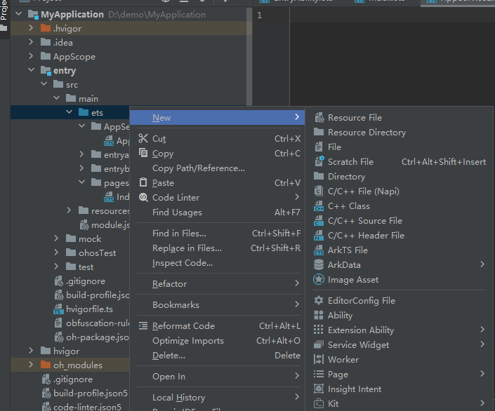

# Using AppServiceExtensionAbility for Background Services
<!--Kit: Ability Kit-->
<!--Subsystem: Ability-->
<!--Owner: @yewei0794-->
<!--Designer: @jsjzju-->
<!--Tester: @lixueqing513-->
<!--Adviser: @huipeizi-->

## Overview

Starting from API version 20, you can use the [AppServiceExtensionAbility](../reference/apis-ability-kit/js-apis-app-ability-appServiceExtensionAbility.md) component to provide background services for your application. Other third-party applications can obtain the services by starting or connecting to this component.

For example, Data Loss Prevention (DLP) software deployed by an enterprise needs to run long-term in the background without a UI, continuously monitor file operations and network traffic, and intercept violations. You can use the AppServiceExtensionAbility component to implement the core background monitoring service.
> **NOTE**
>
> In this document, the component (currently only the UIAbility is supported) that starts or connects to an AppServiceExtensionAbility is called the client, and the AppServiceExtensionAbility is called the server.

## Constraints

### Device Limitations

The AppServiceExtensionAbility takes effect only on 2-in-1 devices.

### Specification Limitations

- To integrate an AppServiceExtensionAbility, applications must request the ACL permission (ohos.permission.SUPPORT_APP_SERVICE_EXTENSION). This ACL permission is available only for enterprise applications.

- APIs provided by [Window](../reference/apis-arkui/arkts-apis-window.md) cannot be called in the AppServiceExtensionAbility.

## Working Principles

You can launch an AppServiceExtensionAbility from a [UIAbility](../reference/apis-ability-kit/js-apis-app-ability-uiAbility.md) by either [starting](../reference/apis-ability-kit/js-apis-inner-application-uiAbilityContext.md#startappserviceextensionability20) or [connecting to](../reference/apis-ability-kit/js-apis-inner-application-uiAbilityContext.md#connectappserviceextensionability20) it.

- **Starting**: To call [startAppServiceExtensionAbility()](../reference/apis-ability-kit/js-apis-inner-application-uiAbilityContext.md#startappserviceextensionability20), the client must be the application to which the AppServiceExtensionAbility belongs, or an application listed in the AppServiceExtensionAbility's trustlist (by configuring the **appIdentifierAllowList** property under the [extensionAbilities](../quick-start/module-configuration-file.md#extensionabilities) tag).
- **Connecting**: To call [connectAppServiceExtensionAbility()](../reference/apis-ability-kit/js-apis-inner-application-uiAbilityContext.md#connectappserviceextensionability20), the client must be the application to which the AppServiceExtensionAbility belongs, or an application listed in the AppServiceExtensionAbility's trustlist (by configuring the **appIdentifierAllowList** property under the [extensionAbilities](../quick-start/module-configuration-file.md#extensionabilities) tag), if the [AppServiceExtensionAbility](../reference/apis-ability-kit/js-apis-app-ability-appServiceExtensionAbility.md) instance is not started. If the instance is already started, there are no such restrictions.

The table below illustrates several scenarios for starting and connecting.


> **NOTE**
>
> If **Is Client Trusted** is **Yes**, the client belongs to the server's application or is configured in the server's **appIdentifierAllowList**. If it is set to **No**, the client does not belong to the server's application and is not in the server's **appIdentifierAllowList**.

| Client Action| Server Status| Is Client Trusted| Result Description|
| --------- | --------- | -------------------------------------------- | ---- |
| startAppServiceExtensionAbility | Not started    | Yes                                      | Success. The server is started via **start**, and its status changes to **Started**.|
| startAppServiceExtensionAbility | Not started    | No                                      | Failure. The client is not in the trustlist and cannot start the service.|
| startAppServiceExtensionAbility | Started    | Yes                                      | Success. The server is already started; the **start** operation returns success directly.|
| startAppServiceExtensionAbility | Started    | No                                      | Failure. The client is not in the trustlist and cannot start the service.|
| connectAppServiceExtensionAbility | Not started    | Yes                                      | Success. The server is started via **connect**, and a connection is established.|
| connectAppServiceExtensionAbility | Not started    | No                                      | Failure. The client is not in the trustlist and cannot connect to the server.|
| connectAppServiceExtensionAbility | Started    | Yes                                      | Success. The server is already started; a connection is established directly.|
| connectAppServiceExtensionAbility | Started    | No                                      | Success. The server is already started; a connection is established directly.|


## Implementing a Background Service

To manually create an AppServiceExtensionAbility in the DevEco Studio project, perform the following steps:

1. In the **ets** directory of a module in the project, right-click and choose **New > Directory** to create a directory named **myappserviceextability**.

2. Right-click the **myappserviceextability** directory, and choose **New > ArkTS File** to create a file named **MyAppServiceExtAbility.ets**.


    The directory structure is as follows:

    ```
    ├── ets
    │ ├── myappserviceextability
    │ │   ├── MyAppServiceExtAbility.ets
    └
    ```

3. In the **MyAppServiceExtAbility.ets** file, import the [AppServiceExtensionAbility](../reference/apis-ability-kit/js-apis-app-ability-appServiceExtensionAbility.md) module. Customize a class that inherits from AppServiceExtensionAbility and implement the lifecycle callbacks.

    <!-- @[ability_app_service_one](https://gitcode.com/openharmony/applications_app_samples/blob/master/code/DocsSample/Ability/AppServiceExtensionAbility/entry/src/main/ets/myappserviceextability/MyAppServiceExtAbility.ets) -->
    
    ``` TypeScript
    import { AppServiceExtensionAbility, Want } from '@kit.AbilityKit';
    import { rpc } from '@kit.IPCKit';
    // ···
    import { hilog } from '@kit.PerformanceAnalysisKit';
    
    const TAG: string = '[MyAppServiceExtAbility]';
    const DOMAIN_NUMBER: number = 0xFF00;
    
    class StubTest extends rpc.RemoteObject {
      constructor(des: string) {
        super(des);
      }
    
      onRemoteMessageRequest(code: number,
        data: rpc.MessageSequence,
        reply: rpc.MessageSequence,
        options: rpc.MessageOption): boolean | Promise<boolean> {
        // Process messages sent by the client.
        return true;
      }
    }
    
    export default class MyAppServiceExtAbility extends AppServiceExtensionAbility {
      onCreate(want: Want): void {
        let appServiceExtensionContext = this.context;
        hilog.info(DOMAIN_NUMBER, TAG, `onCreate, want: ${want.abilityName}`);
        // ···
      }
    
      onRequest(want: Want, startId: number): void {
        hilog.info(DOMAIN_NUMBER, TAG, `onRequest, want: ${want.abilityName}`);
      }
    
      onConnect(want: Want): rpc.RemoteObject {
        hilog.info(DOMAIN_NUMBER, TAG, `onConnect, want: ${want.abilityName}`);
        return new StubTest('test');
      }
    
      onDisconnect(want: Want): void {
        hilog.info(DOMAIN_NUMBER, TAG, `onDisconnect, want: ${want.abilityName}`);
      }
    
      onDestroy(): void {
        hilog.info(DOMAIN_NUMBER, TAG, 'onDestroy');
      }
    };
    ```

4. Register the AppServiceExtensionAbility in the [module.json5 file](../quick-start/module-configuration-file.md) of the module in the project. Set **type** to **"appService"** and **srcEntry** to the code path of the AppServiceExtensionAbility component.

    <!-- @[my_app_service_module_start](https://gitcode.com/openharmony/applications_app_samples/blob/master/code/DocsSample/Ability/AppServiceExtensionAbility/entry/src/main/module.json5) -->

    ``` JSON5
    {
      "module": {
        // ···
        "extensionAbilities": [
        // ···
          {
            "name": "MyAppServiceExtAbility",
            "description": "appService",
            "type": "appService",
            "exported": true,
            "srcEntry": "./ets/myappserviceextability/MyAppServiceExtAbility.ets",
            "appIdentifierAllowList": [
              // Fill in the list of clients that are allowed to start this background service in appIdentifiers.
            ],
          }
        ]
      }
    }
    ```

## Starting a Background Service

An application uses [startAppServiceExtensionAbility()](../reference/apis-ability-kit/js-apis-inner-application-uiAbilityContext.md#startappserviceextensionability20) to start a background service. The [onRequest()](../reference/apis-ability-kit/js-apis-app-ability-appServiceExtensionAbility.md#onrequest) callback is invoked, through which the background service receives the [Want](../reference/apis-ability-kit/js-apis-app-ability-want.md) object passed by the caller. After the background service is started, its lifecycle is independent of the client. In other words, even if the client is destroyed, the background service remains alive. Therefore, the background service must be stopped by calling [terminateSelf()](../reference/apis-ability-kit/js-apis-inner-application-appServiceExtensionContext.md#terminateself) when its work is complete. Alternatively, another component can call [stopAppServiceExtensionAbility()](../reference/apis-ability-kit/js-apis-inner-application-uiAbilityContext.md#stopappserviceextensionability20) to stop the background service.

> **NOTE**
>
> When the AppServiceExtensionAbility is started by means of starting and has no active connections, its process may be suspended. For details, see [Introduction to Background Tasks Kit](../task-management/background-task-overview.md).

- Start a new [AppServiceExtensionAbility](../reference/apis-ability-kit/js-apis-app-ability-appServiceExtensionAbility.md) in an application. For details about how to obtain the context, see [Obtaining the Context of UIAbility](uiability-usage.md#obtaining-the-context-of-uiability).

  <!-- @[app_ext_service_one_start](https://gitcode.com/openharmony/applications_app_samples/blob/master/code/DocsSample/Ability/AppServiceExtensionAbility/entry/src/main/ets/pages/StartAppServiceExt.ets) -->

  ``` TypeScript
  import { common, Want } from '@kit.AbilityKit';
  import { hilog } from '@kit.PerformanceAnalysisKit';
  import { BusinessError } from '@kit.BasicServicesKit';

  const TAG: string = '[StartAppServiceExt]';
  const DOMAIN_NUMBER: number = 0xFF00;

  @Entry
  @Component
  struct StartAppServiceExt {
    build() {
      Column() {
      // ···
        List({ initialIndex: 0 }) {
          ListItem() {
            Row() {
              // ···
            }
          // ···
            .onClick(() => {
              let context = this.getUIContext().getHostContext() as common.UIAbilityContext; // UIAbilityContext
              let want: Want = {
                deviceId: '',
                bundleName: 'com.samples.appserviceextensionability',
                abilityName: 'MyAppServiceExtAbility'
              };
              context.startAppServiceExtensionAbility(want).then(() => {
                hilog.info(DOMAIN_NUMBER, TAG, 'Succeeded in starting AppServiceExtensionAbility.');
                // The background service is started.
                this.getUIContext().getPromptAction().showToast({
                  message: 'SuccessfullyStartBackendService'
                });
              }).catch((err: BusinessError) => {
                hilog.error(DOMAIN_NUMBER, TAG,
                  `Failed to start AppServiceExtensionAbility. Code is ${err.code}, message is ${err.message}`);
              });
            })
          }

          // ···
        }
      // ···
      }

      // ···
    }
  }
  ```


- Stop the [AppServiceExtensionAbility](../reference/apis-ability-kit/js-apis-app-ability-appServiceExtensionAbility.md) in the application.

  <!-- @[app_ext_service_two_start](https://gitcode.com/openharmony/applications_app_samples/blob/master/code/DocsSample/Ability/AppServiceExtensionAbility/entry/src/main/ets/pages/StopAppServiceExt.ets) -->

  ``` TypeScript
  import { common, Want } from '@kit.AbilityKit';
  import { hilog } from '@kit.PerformanceAnalysisKit';
  import { BusinessError } from '@kit.BasicServicesKit';

  const TAG: string = '[StopAppServiceExt]';
  const DOMAIN_NUMBER: number = 0xFF00;

  @Entry
  @Component
  struct StopAppServiceExt {
    build() {
      Column() {
      // ···
        List({ initialIndex: 0 }) {
          ListItem() {
            Row() {
              // ···
            }
          // ···
            .onClick(() => {
              let context = this.getUIContext().getHostContext() as common.UIAbilityContext; // UIAbilityContext
              let want: Want = {
                deviceId: '',
                bundleName: 'com.samples.appserviceextensionability',
                abilityName: 'MyAppServiceExtAbility'
              };
              context.stopAppServiceExtensionAbility(want).then(() => {
                hilog.info(DOMAIN_NUMBER, TAG, 'Succeeded in stopping AppServiceExtensionAbility.');
                this.getUIContext().getPromptAction().showToast({
                  message: 'SuccessfullyStoppedAStartedBackendService'
                });
              }).catch((err: BusinessError) => {
                hilog.error(DOMAIN_NUMBER, TAG,
                  `Failed to stop AppServiceExtensionAbility. Code is ${err.code}, message is ${err.message}`);
              });
            })
          }

          // ···
        }

      // ···
      }

      // ···
    }
  }
  ```


- Enable the [AppServiceExtensionAbility](../reference/apis-ability-kit/js-apis-app-ability-appServiceExtensionAbility.md) to stop itself.

  <!-- @[ability_app_service_two](https://gitcode.com/openharmony/applications_app_samples/blob/master/code/DocsSample/Ability/AppServiceExtensionAbility/entry/src/main/ets/myappserviceextability/MyAppServiceExtAbility.ets) -->
  
  ``` TypeScript
  import { AppServiceExtensionAbility, Want } from '@kit.AbilityKit';
  // ···
  import { BusinessError } from '@kit.BasicServicesKit';
  import { hilog } from '@kit.PerformanceAnalysisKit';
  
  const TAG: string = '[MyAppServiceExtAbility]';
  // ···
  
  export default class MyAppServiceExtAbility extends AppServiceExtensionAbility {
    onCreate(want: Want): void {
      // ···
      // Execute the service logic.
      this.context.terminateSelf().then(() => {
        hilog.info(0x0000, TAG, '----------- terminateSelf succeed -----------');
      }).catch((error: BusinessError) => {
        hilog.error(0x0000, TAG, `terminateSelf failed, error.code: ${error.code}, error.message: $   {error.message}`);
      });
    }
  
  // ···
  };
  ```

## Connecting to a Background Service

### Connecting to an AppServiceExtensionAbility

The client can connect to a background service (specified in the Want object) through [connectAppServiceExtensionAbility()](../reference/apis-ability-kit/js-apis-inner-application-uiAbilityContext.md#connectappserviceextensionability20). The [onConnect()](../reference/apis-ability-kit/js-apis-app-ability-appServiceExtensionAbility.md#onconnect) callback is invoked, through which the background service receives the [Want](../reference/apis-ability-kit/js-apis-app-ability-want.md) object passed by the client.

The AppServiceExtensionAbility returns an [IRemoteObject](../reference/apis-ipc-kit/js-apis-rpc.md#iremoteobject) object in [onConnect()](../reference/apis-ability-kit/js-apis-inner-ability-connectOptions.md#onconnect). This object is then passed to the client's [onConnect()](../reference/apis-ability-kit/js-apis-inner-ability-connectOptions.md#onconnect). Through this IRemoteObject, you can define communication interfaces for RPC interaction between the client and server. Multiple clients can simultaneously connect to the same background service. After a client finishes the interaction, it must call [disconnectAppServiceExtensionAbility()](../reference/apis-ability-kit/js-apis-inner-application-uiAbilityContext.md#disconnectappserviceextensionability20) to disconnect from the service. If all clients connected to a background service are disconnected, the system destroys the service.

- Call [connectAppServiceExtensionAbility()](../reference/apis-ability-kit/js-apis-inner-application-uiAbilityContext.md#connectappserviceextensionability20) to establish a connection to a background service. For details about how to obtain the context, see [Obtaining the Context of UIAbility](uiability-usage.md#obtaining-the-context-of-uiability).

  <!-- @[app_ext_service_three_start](https://gitcode.com/openharmony/applications_app_samples/blob/master/code/DocsSample/Ability/AppServiceExtensionAbility/entry/src/main/ets/pages/ConnectAppServiceExt.ets) -->

  ``` TypeScript
  import { common, Want } from '@kit.AbilityKit';
  import { rpc } from '@kit.IPCKit';
  import { hilog } from '@kit.PerformanceAnalysisKit';

  const TAG: string = '[ConnectAppServiceExt]';
  const DOMAIN_NUMBER: number = 0xFF00;

  let connectionId: number;
  let want: Want = {
    deviceId: '',
    bundleName: 'com.samples.appserviceextensionability',
    abilityName: 'MyAppServiceExtAbility'
  };

  let options: common.ConnectOptions = {
    onConnect(elementName, remote: rpc.IRemoteObject): void {
      hilog.info(DOMAIN_NUMBER, TAG, 'onConnect callback');
      if (remote === null) {
        hilog.info(DOMAIN_NUMBER, TAG, `onConnect remote is null`);
        return;
      }
      // Use remote for communication.
    },
    onDisconnect(elementName): void {
      hilog.info(DOMAIN_NUMBER, TAG, 'onDisconnect callback');
    },
    onFailed(code: number): void {
      hilog.info(DOMAIN_NUMBER, TAG, 'onFailed callback', JSON.stringify(code));
    }
  };

  @Entry
  @Component
  struct ConnectAppServiceExt {
    build() {
      Column() {
      // ···
        List({ initialIndex: 0 }) {
          ListItem() {
            Row() {
              // ···
            }
          // ···
            .onClick(() => {
              let context = this.getUIContext().getHostContext() as common.UIAbilityContext; // UIAbilityContext
              // Save the connection ID, which will be used when the background service is disconnected.
              connectionId = context.connectAppServiceExtensionAbility(want, options);
              // The background service is connected.
              this.getUIContext().getPromptAction().showToast({
                message: 'SuccessfullyConnectBackendService'
              });
              hilog.info(DOMAIN_NUMBER, TAG, `connectionId is : ${connectionId}`);
            })
          }

          // ···
        }

      // ···
      }

      // ···
    }
  }
  ```


- Use [disconnectAppServiceExtensionAbility()](../reference/apis-ability-kit/js-apis-inner-application-uiAbilityContext.md#disconnectappserviceextensionability20) to disconnect from the background service.

  <!-- @[app_ext_service_four_start](https://gitcode.com/openharmony/applications_app_samples/blob/master/code/DocsSample/Ability/AppServiceExtensionAbility/entry/src/main/ets/pages/DisConnectAppServiceExt.ets) -->

  ``` TypeScript
  import { common } from '@kit.AbilityKit';
  import { hilog } from '@kit.PerformanceAnalysisKit';
  import { BusinessError } from '@kit.BasicServicesKit';

  const TAG: string = '[DisConnectAppServiceExt]';
  const DOMAIN_NUMBER: number = 0xFF00;

  let connectionId: number;

  @Entry
  @Component
  struct DisConnectAppServiceExt {
    build() {
      Column() {
      // ···
        List({ initialIndex: 0 }) {
          ListItem() {
            Row() {
              // ···
            }
          // ···
            .onClick(() => {
              let context = this.getUIContext().getHostContext() as common.UIAbilityContext; // UIAbilityContext
              // connectionId is returned when connectServiceExtensionAbility is called and needs to be manually maintained.
              context.disconnectAppServiceExtensionAbility(connectionId).then(() => {
                hilog.info(DOMAIN_NUMBER, TAG, 'disconnectAppServiceExtensionAbility success');
                // The background service is disconnected.
                this.getUIContext().getPromptAction().showToast({
                  message: 'SuccessfullyDisconnectBackendService'
                });
              }).catch((error: BusinessError) => {
                hilog.error(DOMAIN_NUMBER, TAG, 'disconnectAppServiceExtensionAbility failed');
              });
            })
          }

          // ···
        }

      // ···
      }

      // ···
    }
  }
  ```


### Communication Between the Client and Server

After obtaining the [rpc.IRemoteObject](../reference/apis-ipc-kit/js-apis-rpc.md#iremoteobject) from the [onConnect()](../reference/apis-ability-kit/js-apis-inner-ability-connectOptions.md#onconnect) lifecycle callback, the client can communicate with the AppServiceExtensionAbility.

**Client**: Call [sendMessageRequest](../reference/apis-ipc-kit/js-apis-rpc.md#sendmessagerequest9) to send messages to the server.

<!-- @[app_ext_service_five_start](https://gitcode.com/openharmony/applications_app_samples/blob/master/code/DocsSample/Ability/AppServiceExtensionAbility/entry/src/main/ets/pages/ClientServerExt.ets) -->

``` TypeScript
import { common, Want } from '@kit.AbilityKit';
import { rpc } from '@kit.IPCKit';
import { hilog } from '@kit.PerformanceAnalysisKit';
import { BusinessError } from '@kit.BasicServicesKit';

const TAG: string = '[ClientServerExt]';
const DOMAIN_NUMBER: number = 0xFF00;
const REQUEST_CODE = 1;
let connectionId: number;
let want: Want = {
  deviceId: '',
  bundleName: 'com.samples.appserviceextensionability',
  abilityName: 'MyAppServiceExtAbility'
};
let options: common.ConnectOptions = {
  onConnect(elementName, remote): void {
    hilog.info(DOMAIN_NUMBER, TAG, 'onConnect callback');
    if (remote === null) {
      hilog.info(DOMAIN_NUMBER, TAG, `onConnect remote is null`);
      return;
    }
    let option = new rpc.MessageOption();
    let data = new rpc.MessageSequence();
    let reply = new rpc.MessageSequence();

    //Write the request data.
    data.writeInt(1);
    data.writeInt(2);

    remote.sendMessageRequest(REQUEST_CODE, data, reply, option).then((ret: rpc.RequestResult) => {
      if (ret.errCode === 0) {
        hilog.info(DOMAIN_NUMBER, TAG, `sendRequest got result`);
        let sum = ret.reply.readInt();
        hilog.info(DOMAIN_NUMBER, TAG, `sendRequest success, sum:${sum}`);
      } else {
        hilog.error(DOMAIN_NUMBER, TAG, `sendRequest failed`);
      }
    }).catch((error: BusinessError) => {
      hilog.error(DOMAIN_NUMBER, TAG, `sendRequest failed, ${JSON.stringify(error)}`);
    });
  },
  onDisconnect(elementName): void {
    hilog.info(DOMAIN_NUMBER, TAG, 'onDisconnect callback');
  },
  onFailed(code): void {
    hilog.info(DOMAIN_NUMBER, TAG, 'onFailed callback');
  }
};

// Call the code related to connectAppServiceExtensionAbility.

@Entry
@Component
struct ClientServerExt {
  build() {
    Column() {
    // ···
      List({ initialIndex: 0 }) {
        ListItem() {
          Row() {
            // ···
          }
        // ···
          .onClick(() => {
            let context = this.getUIContext().getHostContext() as common.UIAbilityContext; // UIAbilityContext
            connectionId = context.connectAppServiceExtensionAbility(want, options);
            hilog.info(DOMAIN_NUMBER, TAG, `connectionId is : ${connectionId}`);
          })
        }
      }
    // ···
    }
  }
}
```


**Server**: Call [onRemoteMessageRequest](../reference/apis-ipc-kit/js-apis-rpc.md#onremotemessagerequest9) to receive the messages sent by the client.

<!-- @[ability_app_service_three](https://gitcode.com/openharmony/applications_app_samples/blob/master/code/DocsSample/Ability/AppServiceExtensionAbility/entry/src/main/ets/myappserviceextabilitytwo/MyAppServiceExtAbility.ets) -->

``` TypeScript
import { AppServiceExtensionAbility, Want } from '@kit.AbilityKit';
import { rpc } from '@kit.IPCKit';
import { hilog } from '@kit.PerformanceAnalysisKit';

const TAG: string = '[MyAppServiceExtAbility]';
const DOMAIN_NUMBER: number = 0xFF00;

// You need to implement APIs in this class.
class Stub extends rpc.RemoteObject {
  onRemoteMessageRequest(code: number,
    data: rpc.MessageSequence,
    reply: rpc.MessageSequence,
    options: rpc.MessageOption): boolean | Promise<boolean> {
    hilog.info(DOMAIN_NUMBER, TAG, 'onRemoteMessageRequest');
    let sum = data.readInt() + data.readInt();
    reply.writeInt(sum);
    return true;
  }
}

// Server implementation.
export default class MyAppServiceExtAbility extends AppServiceExtensionAbility {
  onCreate(want: Want): void {
    hilog.info(DOMAIN_NUMBER, TAG, 'MyAppServiceExtAbility onCreate');
  }

  onDestroy(): void {
    hilog.info(DOMAIN_NUMBER, TAG, 'MyAppServiceExtAbility onDestroy');
  }

  onConnect(want: Want): rpc.RemoteObject {
    hilog.info(DOMAIN_NUMBER, TAG, 'MyAppServiceExtAbility onConnect');
    return new Stub('test');
  }

  onDisconnect(): void {
    hilog.info(DOMAIN_NUMBER, TAG, 'MyAppServiceExtAbility onDisconnect');
  }
}
```

### Client Identity Verification by the Server

If your AppServiceExtensionAbility provides sensitive operations, verify the client's identity with one of the following approaches.

<!--Del-->
**Verifying the Client Identity Based on callerUid**

Call [getCallingUid()](../reference/apis-ipc-kit/js-apis-rpc.md#getcallinguid) to obtain the UID of the client, and then call [getBundleNameByUid()](../reference/apis-ability-kit/js-apis-bundleManager-sys.md#bundlemanagergetbundlenamebyuid14) to obtain the corresponding bundle name. In this way, the client identity is verified. Note that [getBundleNameByUid()](../reference/apis-ability-kit/js-apis-bundleManager-sys.md#bundlemanagergetbundlenamebyuid14) is asynchronous, and therefore the server cannot return the verification result to the client. This verification mode applies when the client sends an asynchronous task request to the server. The sample code is as follows:

<!-- @[ability_app_service_five](https://gitcode.com/openharmony/applications_app_samples/blob/master/code/DocsSample/Ability/AppServiceExtensionAbility/entry/src/main/ets/myappserviceextabilitythree/MyAppServiceExtAbility.ets) -->

``` TypeScript
import { AppServiceExtensionAbility, Want } from '@kit.AbilityKit';
import { bundleManager } from '@kit.AbilityKit';
import { rpc } from '@kit.IPCKit';
import { osAccount, BusinessError } from '@kit.BasicServicesKit';
import { hilog } from '@kit.PerformanceAnalysisKit';

const TAG: string = '[MyAppServiceExtAbility]';
const DOMAIN_NUMBER: number = 0xFF00;

class Stub extends rpc.RemoteObject {
  private validAppIdentifier: string = 'your_valid_app_identifier_here';

  onRemoteMessageRequest(
    code: number,
    data: rpc.MessageSequence,
    reply: rpc.MessageSequence,
    options: rpc.MessageOption): boolean | Promise<boolean> {
    this.verifyClientIdentity().then((isValid: boolean) => {
      if (isValid) {
        hilog.info(DOMAIN_NUMBER, TAG, 'Client authentication PASSED');
      } else {
        hilog.error(DOMAIN_NUMBER, TAG, 'Client authentication FAILED');
      }
    }).catch((err: BusinessError) => {
      hilog.error(DOMAIN_NUMBER, TAG, `Authentication error: ${err.code}, ${err.message}`);
    });
    return true;
  }

  private async verifyClientIdentity(): Promise<boolean> {
    try {
      const callerUid: number = rpc.IPCSkeleton.getCallingUid();
      hilog.info(DOMAIN_NUMBER, TAG, `Caller UID: ${callerUid}`);

      const userId: number = await this.getUserIdByUid(callerUid);
      hilog.info(DOMAIN_NUMBER, TAG, `User ID: ${userId}`);

      const bundleName: string = await bundleManager.getBundleNameByUid(callerUid);
      hilog.info(DOMAIN_NUMBER, TAG, `Bundle Name: ${bundleName}`);

      const bundleFlags = bundleManager.BundleFlag.GET_BUNDLE_INFO_WITH_SIGNATURE_INFO;
      const bundleInfo: bundleManager.BundleInfo = await bundleManager.getBundleInfo(bundleName, bundleFlags, userId);

      if (bundleInfo.signatureInfo && bundleInfo.signatureInfo.appIdentifier) {
        const appIdentifier: string = bundleInfo.signatureInfo.appIdentifier;
        hilog.info(DOMAIN_NUMBER, TAG, `App Identifier: ${appIdentifier}`);
        return appIdentifier === this.validAppIdentifier;
      }
      return false;
    } catch (err) {
      if (err instanceof Error) {
        hilog.error(DOMAIN_NUMBER, TAG, `Verification failed: ${err.message}`);
      } else {
        hilog.error(DOMAIN_NUMBER, TAG, `Verification failed: ${String(err)}`);
      }
      return false;
    }
  }

  private async getUserIdByUid(uid: number): Promise<number> {
    try {
      const accountManager = osAccount.getAccountManager();
      const userId: number = await accountManager.getOsAccountLocalIdForUid(uid);
      return userId;
    } catch (err) {
      if (err instanceof Error) {
        hilog.error(DOMAIN_NUMBER, TAG, `Get userId failed: ${err.message}`);
        throw err;
      } else {
        const error = new Error(String(err));
        hilog.error(DOMAIN_NUMBER, TAG, `Get userId failed: ${error.message}`);
        throw error;
      }
    }
  }
}

export default class MyAppServiceExtAbility extends AppServiceExtensionAbility {
  onConnect(want: Want): rpc.RemoteObject {
    return new Stub('test');
  }
  // Other lifecycle states.
}
```
<!--DelEnd-->

**Verifying the Client Identity Based on callerTokenId**

Call [getCallingTokenId()](../reference/apis-ipc-kit/js-apis-rpc.md#getcallingtokenid8) to obtain the token ID of the client, and then call [verifyAccessTokenSync()](../reference/apis-ability-kit/js-apis-abilityAccessCtrl.md#verifyaccesstokensync9) to check whether the client has the required permission. Currently, the system does not support permission customization. Therefore, only [system-defined permissions](../security/AccessToken/app-permissions.md) can be verified. The sample code is as follows:

<!-- @[ability_app_service_four](https://gitcode.com/openharmony/applications_app_samples/blob/master/code/DocsSample/Ability/AppServiceExtensionAbility/entry/src/main/ets/myappserviceextabilityfour/MyAppServiceExtAbility.ets) -->

``` TypeScript
import { AppServiceExtensionAbility, Want } from '@kit.AbilityKit';
import { abilityAccessCtrl, bundleManager } from '@kit.AbilityKit';
import { rpc } from '@kit.IPCKit';
import { hilog } from '@kit.PerformanceAnalysisKit';
import { BusinessError } from '@kit.BasicServicesKit';

const TAG: string = '[AppServiceExtImpl]';
const DOMAIN_NUMBER: number = 0xFF00;

// You need to implement APIs in this class.

class Stub extends rpc.RemoteObject {
  onRemoteMessageRequest(
    code: number,
    data: rpc.MessageSequence,
    reply: rpc.MessageSequence,
    options: rpc.MessageOption): boolean | Promise<boolean> {
    // Implement service logic.
    hilog.info(DOMAIN_NUMBER, TAG, `onRemoteMessageRequest: ${data}`);
    let callerUid = rpc.IPCSkeleton.getCallingUid();
    bundleManager.getBundleNameByUid(callerUid).then((callerBundleName) => {
      hilog.info(DOMAIN_NUMBER, TAG, 'getBundleNameByUid: ' + callerBundleName);
      // Identify the bundle name of the client.
      if (callerBundleName !== 'com.samples.stagemodelabilitydevelop') { // The verification fails.
        hilog.info(DOMAIN_NUMBER, TAG, 'The caller bundle is not in trustlist, reject');
        return;
      }
      // The verification is successful, and service logic is executed normally.
    }).catch((err: BusinessError) => {
      hilog.error(DOMAIN_NUMBER, TAG, 'getBundleNameByUid failed: ' + err.message);
    });

    let callerTokenId = rpc.IPCSkeleton.getCallingTokenId();
    let accessManager = abilityAccessCtrl.createAtManager();
    // The permission to be verified varies depending on the service requirements. ohos.permission.GET_BUNDLE_INFO_PRIVILEGED is only an example.
    let grantStatus = accessManager.verifyAccessTokenSync(callerTokenId, 'ohos.permission.GET_BUNDLE_INFO_PRIVILEGED');
    if (grantStatus === abilityAccessCtrl.GrantStatus.PERMISSION_DENIED) {
      hilog.error(DOMAIN_NUMBER, TAG, 'PERMISSION_DENIED');
      return false;
    }
    hilog.info(DOMAIN_NUMBER, TAG, 'verify access token success.');
    return true;
  }
}

export default class MyAppServiceExtAbility extends AppServiceExtensionAbility {
  onConnect(want: Want): rpc.RemoteObject {
    return new Stub('test');
  }
  // Other lifecycle states.
}
```
