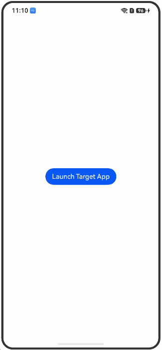

# Obtaining the URL of the Target Application

<!--Kit: Ability Kit-->
<!--Subsystem: Ability-->
<!--Owner: @hanchen45; @Luobniz21-->
<!--Designer: @ccllee1-->
<!--Tester: @lixueqing513-->
<!--Adviser: @huipeizi-->

## Use Cases

When using the [UIAbilityContext.openLink](../reference/apis-ability-kit/js-apis-inner-application-uiAbilityContext.md#openlink12) API to start the target application, you need to pass the URL of the target application. This section describes how to obtain the URL of the target application.

It is assumed that the [module.json5](../quick-start/module-configuration-file.md) configuration information of the UIAbility of the target application is as follows:

```json5
{
  "name": "EntryAbility",
  "srcEntry": "./ets/entryability/EntryAbility.ets",
  "icon": "$media:layered_image",
  "label": "$string:EntryAbility_label",
  // ···
  "skills": [
    {
      "uris": [
        {
          "scheme": "appurl",
          "host": "www.example.com",
          "path": "path1"
          // ...
        }
      ],
      "domainVerify": false,
    }
    // ...
  ]
}
```

## Environment Requirements

You need to obtain the [hdc](../dfx/hdc.md).

## Procedure

1. Use [Bundle Manager](../tools/bm-tool.md) to obtain the bundle name of the target application.

    1. Obtain the bundle names of all installed applications on the current device and save the result.

        ```bash
        hdc shell bm dump -a
        ```

    2. Install the target application.

    3. Obtain the bundle names of all installed applications on the current device again and compare the result with the previously saved result.

        The new bundleName is the target application package name. In this example, the bundle name is `com.example.myapplication`.

2. Obtain the `Mission ID` of the target application based on the bundleName.

    1. Use [Ability Assistant](../tools/aa-tool.md) to obtain the abilityName of the target application.

        ```bash
        hdc shell "aa dump -l | grep com.example.myapplication"
        ```

    2. View the `Mission ID` in the output to obtain the abilityName, that is, `EntryAbility`.

        ```bash
        # Command output:
        Mission ID #48  mission name #[#com.example.myapplication:entry:EntryAbility] lockedStat#0 mission affinity #[]
              app name [com.example.myapplication]
              bundle name [com.example.myapplication]
        ```

3. Obtain the URIs of the application based on the bundleName.

    1. Use the bm tool to obtain the complete configuration information of the application, including abilities, skills, and URIs.
    
        ```bash
        hdc shell bm dump -n com.example.myapplication
        ```

    2. Obtain the URL Scheme configurations supported by the application by checking the `skills` section under `EntryAbility` with the specified `name` in the output.

        ```json5
        // Output example (skills):
        // ...
        "name": "EntryAbility",
        // ...
        {
          "skills": [
            {
              "actions": [
                "ohos.want.action.viewData"
              ],
              "domainVerify": false,
              "entities": [
                "entity.system.browsable"
              ],
              "permissions": [],
              "uris": [
                {
                  "host": "www.example.com",
                  "linkFeature": "",
                  "maxFileSupported": 0,
                  "path": "path1",
                  "pathRegex": "",
                  "pathStartWith": "",
                  "port": "",
                  "scheme": "appurl",
                  "type": "",
                  "utd": ""
                }
              ]
            }
          ]
        }
        ```

3. Generate URL information based on the obtained configuration information.

    The URL format is as follows:

    ```
    scheme://host:port/path
    ```

    The following uses the target application as an example to describe the URL composition:

    | Configuration Item| Value|
    |--------|---|
    | scheme | `appurl` |
    | host | `www.example.com` |
    | port | Not specified (optional)|
    | path | `path1` |

    The complete URL is as follows:

    ```
    appurl://www.example.com/path1
    ```

    > **NOTE**
    >
    > - The bundleName and URL configurations of different applications may vary with versions.
    > - You are advised to run the hdc command to confirm the latest configuration information of the target application before using it.
    > - If the uris field in skills is not configured for the application, the application cannot be started in Deep Linking mode.

4. Start the target application in Deep Linking mode.

    The following is a complete example of starting the target application through the [UIAbilityContext.openLink](../reference/apis-ability-kit/js-apis-inner-application-uiAbilityContext.md#openlink12) API.

    > **NOTE**
    >
    > - URL configuration verification: Before using the URL of the target application, verify that the URL is correct to avoid startup failure caused by an incorrect URL.
    >
    > - Application installation check: Before starting the target application, you are advised to check whether the application has been installed.

    <!-- @[Start_Deep_Linking](https://gitcode.com/openharmony/applications_app_samples/blob/master/code/DocsSample/Ability/ObtainingTargetAppUrlInfo/entry/src/main/ets/pages/Index.ets) -->

    ```ts
    // The sample code of **Index.ets** is as follows:
    import { common } from '@kit.AbilityKit'
    import { hilog } from '@kit.PerformanceAnalysisKit';
    import { BusinessError } from '@kit.BasicServicesKit';

    @Entry
    @Component
    struct SpecifiedPage {
    
      build() {
        Row() {
          Column() {
            Button ("Start the target application.")
              .onClick(() => {
                let context = this.getUIContext().getHostContext() as common.UIAbilityContext;
                let link: string = 'appurl://www.example.com/path1';
    
                context.openLink(link, { appLinkingOnly: false })
                  .then(() => {
                    hilog.info(0x0000, 'testTag', `Succeeded in opening link.`);
                  })
                  .catch((error: BusinessError) => {
                    hilog.error(0x0000, 'testTag', `Failed to open link, code: ${error.code}, message: ${error.message}`);
                  });
              })
          }
          .width('100%')
        }
        .height('100%')
      }
    }
    ```

5. Debug and verify.

    After the caller application is installed and started, click **Launch Target App** to start the target application. The demonstration effect is as follows:

    **Figure 1** Starting the target application

     
