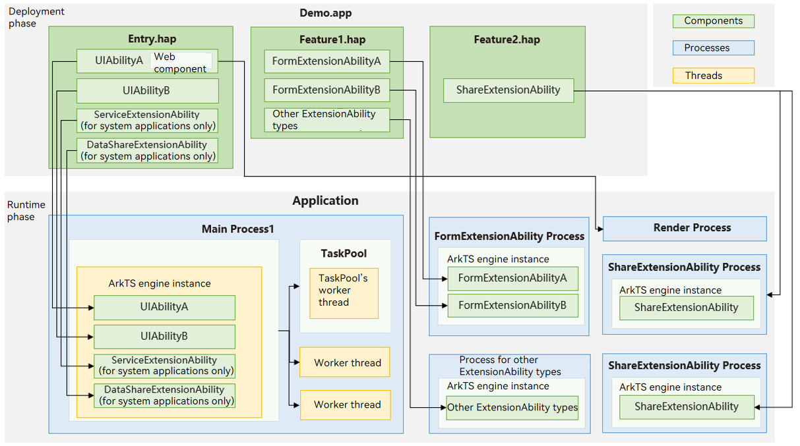

# Process Model (Stage Model)
<!--Kit: Ability Kit-->
<!--Subsystem: Ability-->
<!--Owner: @SKY2001-->
<!--Designer: @yzkp-->
<!--Tester: @lixueqing513-->
<!--Adviser: @huipeizi-->

## Overview
Processes serve as the fundamental units for resource allocation in the system and form the basis of the operating system's architecture. This topic describes the process model and thread model of the system from the perspective of an entire application.

## Process Model

### Basic Process Types

For a complex application with multiple [UIAbility](../reference/apis-ability-kit/js-apis-app-ability-uiAbility.md) components and various ExtensionAbility components (such as [FormExtensionAbility](../reference/apis-form-kit/js-apis-app-form-formExtensionAbility.md) and [ShareExtensionAbility](../reference/apis-ability-kit/js-apis-app-ability-shareExtensionAbility.md) shown in Figure 1), the following process types may be present at the runtime:

- **Main process**: By default, all UIAbility<!--Del-->, ServiceExtensionAbility, and DataShareExtensionAbility<!--DelEnd--> components within the same application (identified by the same bundle name) run in a single, dedicated process known as the main process ("Main Process1" shown in Figure 1).
- **ExtensionAbility process**: All ExtensionAbility components of the same type<!--Del--> (excluding ServiceExtensionAbility and DataShareExtensionAbility)<!--DelEnd--> within the same application (identified by the same bundle name) run in their own dedicated process (for example, "FormExtensionAbility Process" and "Process for other ExtensionAbility types" shown in Figure 1).

  For ExtensionAbility components that inherit from [UIExtensionAbility](../reference/apis-ability-kit/js-apis-app-ability-uiExtensionAbility.md), each instance can be configured to run in its own separate process. For example, each ShareExtensionAbility instance can be set to run in its own process. For details, see [UIExtensionAbility](../reference/apis-ability-kit/js-apis-app-ability-uiExtensionAbility.md).

- **Render process**: When a **Web** component in the application is running, the system allocates a dedicated Render process for rendering ("Render Process" shown in Figure 1).

**Figure 1** Basic process types

>**NOTE**
>
> - Process names follow no fixed rules and are not directly related to process types. They should not be used for service logic judgments. For example, in an application named **com.example.myapplication**, an [InputMethodExtensionAbility](../reference/apis-ime-kit/js-apis-inputmethod-extension-ability.md) may run in a separate process typically named **com.example.myapplication:input**. However, this name is not fixed, and the process with this name is not necessarily the input method process, nor is the input method process necessarily named this way.
> - A single process can contain multiple AbilityStage instances, and a single AbilityStage can contain multiple Ability instances. The lifecycle of a process is closely related to the lifecycle of Ability instances. A process will only be destroyed after all Ability instances within it have exited. In other words, to exit a process, you must first exit all Ability instances within it.

### Other Process Types

On 2-in-1 and tablet devices, the following special process types are supported for the UIAbility:
- **Module-independent process**: For applications with multiple HAPs where each HAP's service logic is relatively independent, you can configure the **isolationMode** field in the [module.json5](../quick-start/module-configuration-file.md#tags-in-the-configuration-file) file to **isolationOnly** (run only in an independent process) or **isolationFirst** (prefer to run in an independent process). This way, all UIAbility instances within that HAP will run in a unified, separate process. For example, UIAbilityC in Figure 2 runs in "Main Process2" instead of "Main Process1".
- **Dynamically specified process**: When UIAbility instances within the same HAP need to be dynamically allocated to different processes based on runtime conditions (for example, each process can support up to five instances), you can set the **isolationProcess** field under UIAbility in the **module.json5** file to **true**. When starting a UIAbility instance, the system calls the [onNewProcessRequest](../reference/apis-ability-kit/js-apis-app-ability-abilityStage.md#onnewprocessrequest11) callback of the [master process](ability-terminology.md#master-process). You can return a custom string in this callback. If the string matches an existing process, that process is reused; otherwise, a new process is created. For example, "Main Process3" and "Main Process4" in Figure 2 are multiple processes for UIAbilityD.

- **Child process**: If you want to use multiple processes for background tasks, create child processes using [childProcessManager](../reference/apis-ability-kit/js-apis-app-ability-childProcessManager.md) APIs. The lifecycle of a child process follows that of its parent process; when the parent process terminates, the child process also terminates. For example, "ArkTS Child Process" and "Native Child Process" in Figure 2 are child processes created by the main process. Child processes do not support creating further child processes.

**Figure 2** Other process types

<!--Del-->
For system applications that provide various system capabilities, each capability or group of capabilities often needs to run in the same process, requiring a more flexible process model. System applications can request the **allowAppMultiProcess** privilege to configure a custom process name for a specific HAP. The UIAbility, DataShareExtensionAbility, and ServiceExtensionAbility within that HAP will then run in the custom process (as shown in Figure 3). For details, see [Application Privilege Configuration](../../device-dev/subsystems/subsys-app-privilege-config-guide.md). Different HAPs can customize their process names by configuring the **process** property in the [module.json5](../quick-start/module-configuration-file.md#tags-in-the-configuration-file) file.

**Figure 3** Multi-process

<!--DelEnd-->

## Thread Model

After the system creates an application process, it automatically creates a main thread and enters the message loop. All application components run on the main thread.
In addition to the main thread, if an application has complex, time-consuming logic to handle, you can create[Worker](../reference/apis-arkts/js-apis-worker.md) threads or submit tasks to the [TaskPool](../reference/apis-arkts/js-apis-taskpool.md).
