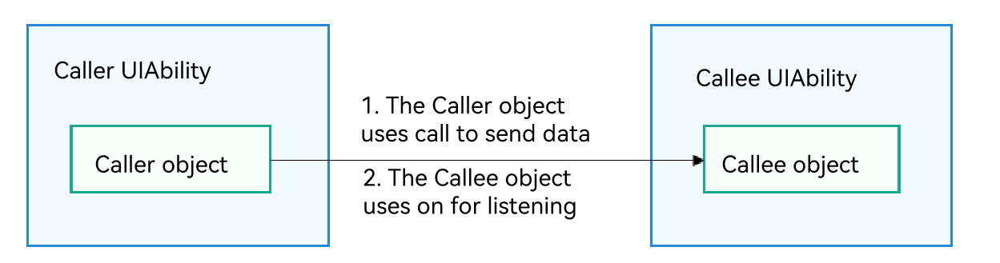

# Multi-Device Collaboration Through Call Invocation

<!--Kit: Ability Kit-->
<!--Subsystem: Ability-->
<!--Owner: @wendel-->
<!--Designer: @wendel-->
<!--Tester: @lixueqing513-->
<!--Adviser: @huipeizi-->


Call invocation is an extension of the [UIAbility](../reference/apis-ability-kit/js-apis-app-ability-uiAbility.md) capability. It enables the **UIAbility** to be invoked by and communicate with external systems. Call invocation supports two startup modes: foreground and background, enabling the **UIAbility** to be launched to the foreground for UI display or created and run in the background. By establishing an inter-process communication (IPC) link, it builds a data channel between the caller and the callee. When used in distributed scenarios, call invocation can be initiated across devices, allowing an application on one device to migrate tasks to a **UIAbility** on another device for continued execution, thereby achieving cross-device migration.

The core API used for the call is [startAbilityByCall()](../reference/apis-ability-kit/js-apis-inner-application-uiAbilityContext.md#startabilitybycall), which differs from [startAbility()](../reference/apis-ability-kit/js-apis-inner-application-uiAbilityContext.md#startability) in the following ways:

- **startAbilityByCall()** supports **UIAbility** launch in the foreground and background, whereas **startAbility()** supports **UIAbility** launch in the foreground only.

- The **CallerAbility** can use the [Caller](../reference/apis-ability-kit/js-apis-app-ability-uiAbility.md#caller) object returned by **startAbilityByCall()** to communicate with the **CalleeAbility**, but **startAbility()** does not provide the communication capability.

## Basic Concepts

**Table 1** Terms related to call invocation

| Term| Description|
| -------- | -------- |
| CallerAbility | UIAbility that triggers the call.|
| CalleeAbility | UIAbility invoked by the call.|
| Caller | Object returned by **startAbilityByCall** and used by the **CallerAbility** to communicate with the **CalleeAbility**.|
| Callee | Object held by the **CalleeAbility** to communicate with the **Caller**.|

## Constraints

- The **CalleeAbility** does not support the specified instance launch type.

- Currently, only the distributed migration scenario opens the call invocation permission to third-party applications. All other call invocation scenarios are restricted to internal system calls.

## Working Mechanism

The following figure shows the working mechanism of call invocation.

**Figure 1** Call invocation



- The **CallerAbility** uses [startAbilityByCall()](../reference/apis-ability-kit/js-apis-inner-application-uiAbilityContext.md#startabilitybycall) to obtain a [Caller](../reference/apis-ability-kit/js-apis-app-ability-uiAbility.md#caller) object and uses [call](../reference/apis-ability-kit/js-apis-app-ability-uiAbility.md#call) of the **Caller** object to send data to the **CalleeAbility**.

- The **CalleeAbility**, which holds a [Callee](../reference/apis-ability-kit/js-apis-app-ability-uiAbility.md#callee) object, uses [on](../reference/apis-ability-kit/js-apis-app-ability-uiAbility.md#on) of the **Callee** object to register a callback. This callback is invoked when the **CalleeAbility** receives data from the **Caller**.

## Available APIs

The following table describes the main APIs used for call invocation. For details, see the [API reference](../reference/apis-ability-kit/js-apis-app-ability-uiAbility.md#caller).

**Table 2** Call invocation APIs

| API| Description|
| -------- | -------- |
| startAbilityByCall(want:&nbsp;Want):&nbsp;Promise&lt;Caller&gt; | Starts a **UIAbility** in the foreground (through the **want** configuration) or background (default) and obtains the **Caller** object for communication with the **UIAbility**. For details, see the [API reference](../reference/apis-ability-kit/js-apis-inner-application-uiAbilityContext.md#startabilitybycall). Both **AbilityContext** and **ServiceExtensionContext** support this API.|
| on(method:&nbsp;string,&nbsp;callback:&nbsp;CalleeCallBack):&nbsp;void | Callback invoked when the general component **Callee** registers a method.|
| off(method:&nbsp;string):&nbsp;void | Callback invoked when the general component **Callee** unregisters a method.|
| call(method:&nbsp;string,&nbsp;data:&nbsp;rpc.Parcelable):&nbsp;Promise&lt;void&gt; | Sends agreed parcelable data to the general component **Callee**.|
| callWithResult(method:&nbsp;string,&nbsp;data:&nbsp;rpc.Parcelable):&nbsp;Promise&lt;rpc.MessageSequence&gt; | Sends agreed parcelable data to the general component **Callee** and bring back the agreed parcelable data returned by the **Callee**.|
| release():&nbsp;void | Releases the **Caller** object of the general component.|
| on(type:&nbsp;"release",&nbsp;callback:&nbsp;OnReleaseCallback):&nbsp;void | Callback invoked when the **Caller** object is released.|

### Creating a CalleeAbility

For the [Callee UIAbility](../reference/apis-ability-kit/js-apis-app-ability-uiAbility.md#callee), you need to implement the data reception callback function for the specified method, as well as the data marshalling and unmarshalling methods. During the period when data reception is required, register a listener via the [on](../reference/apis-ability-kit/js-apis-app-ability-uiAbility.md#on) API; when data reception is no longer needed, remove the listener via the [off](../reference/apis-ability-kit/js-apis-app-ability-uiAbility.md#off) API.

1. Declare the **ohos.permission.DISTRIBUTED_DATASYNC** permission. For details, see [Declaring Permissions](../security/AccessToken/declare-permissions.md).

2. Ask for authorization from the user via a dialog box when the application is started for the first time. For details, see [Requesting User Authorization](../security/AccessToken/request-user-authorization.md).

3. Configure the launch type of the [UIAbility](../reference/apis-ability-kit/js-apis-app-ability-uiAbility.md).

   For example, set the launch type of the **CalleeAbility** to **singleton**. For details, see [UIAbility Launch Type](uiability-launch-type.md).

4. Define the agreed parcelable data.

   The data formats sent and received by the caller and callee must be consistent. In the following example, the data formats are number and string.


    ```ts
    import { rpc } from '@kit.IPCKit';

    class MyParcelable {
      num: number = 0;
      str: string = '';

      constructor(num: number, string: string) {
        this.num = num;
        this.str = string;
      }

      mySequenceable(num: number, string: string): void {
        this.num = num;
        this.str = string;
      }

      marshalling(messageSequence: rpc.MessageSequence): boolean {
        messageSequence.writeInt(this.num);
        messageSequence.writeString(this.str);
        return true;
      }

      unmarshalling(messageSequence: rpc.MessageSequence): boolean {
        this.num = messageSequence.readInt();
        this.str = messageSequence.readString();
        return true;
      }
    }
    ```

5. Implement [Callee.on](../reference/apis-ability-kit/js-apis-app-ability-uiAbility.md#on) and [Callee.off](../reference/apis-ability-kit/js-apis-app-ability-uiAbility.md#off).

   You can determine the time to register a listener for the [Callee](../reference/apis-ability-kit/js-apis-app-ability-uiAbility.md#callee). The data sent and received before the listener is registered and that after the listener is unregistered are not processed. In the following example, the **'MSG_SEND_METHOD'** listener is registered in [onCreate](../reference/apis-ability-kit/js-apis-app-ability-uiAbility.md#oncreate) of the [UIAbility](../reference/apis-ability-kit/js-apis-app-ability-uiAbility.md) and unregistered in [onDestroy](../reference/apis-ability-kit/js-apis-app-ability-uiAbility.md#ondestroy). After receiving parcelable data, the application processes the data and returns the data result. You need to implement data processing based on service requirements. The code snippet is as follows:

    ```ts
    import { AbilityConstant, UIAbility, Want, Caller } from '@kit.AbilityKit';
    import { hilog } from '@kit.PerformanceAnalysisKit';
    import { rpc } from '@kit.IPCKit';

    const TAG: string = '[CalleeAbility]';
    const MSG_SEND_METHOD: string = 'CallSendMsg';
    const DOMAIN_NUMBER: number = 0xFF00;

    class MyParcelable {
      num: number = 0;
      str: string = '';

      constructor(num: number, string: string) {
        this.num = num;
        this.str = string;
      }

      mySequenceable(num: number, string: string): void {
        this.num = num;
        this.str = string;
      }

      marshalling(messageSequence: rpc.MessageSequence): boolean {
        messageSequence.writeInt(this.num);
        messageSequence.writeString(this.str);
        return true;
      }

      unmarshalling(messageSequence: rpc.MessageSequence): boolean {
        this.num = messageSequence.readInt();
        this.str = messageSequence.readString();
        return true;
      }
    }

    function sendMsgCallback(data: rpc.MessageSequence): rpc.Parcelable {
      hilog.info(DOMAIN_NUMBER, TAG, '%{public}s', 'CalleeSortFunc called');

      // Obtain the parcelable data sent by the Caller.
      let receivedData: MyParcelable = new MyParcelable(0, '');
      data.readParcelable(receivedData);
      hilog.info(DOMAIN_NUMBER, TAG, '%{public}s', `receiveData[${receivedData.num}, ${receivedData.str}]`);
      let num: number = receivedData.num;

      // Process the data.
      // Return the parcelable data result to the Caller.
      return new MyParcelable(num + 1, `send ${receivedData.str} succeed`) as rpc.Parcelable;
    }

    export default class CalleeAbility extends UIAbility {
      caller: Caller | undefined;

      onCreate(want: Want, launchParam: AbilityConstant.LaunchParam): void {
        try {
          this.callee.on(MSG_SEND_METHOD, sendMsgCallback);
        } catch (error) {
          hilog.error(DOMAIN_NUMBER, TAG, '%{public}s', `Failed to register. Error is ${error}`);
        }
      }

      // ...
      releaseCall(): void {
        try {
          if (this.caller) {
            this.caller.release();
            this.caller = undefined;
          }
          hilog.info(DOMAIN_NUMBER, TAG, 'caller release succeed');
        } catch (error) {
          hilog.error(DOMAIN_NUMBER, TAG, `caller release failed with ${error}`);
        }
      }

      // ...
      onDestroy(): void {
        try {
          this.callee.off(MSG_SEND_METHOD);
          hilog.info(DOMAIN_NUMBER, TAG, '%{public}s', 'Callee OnDestroy');
          this.releaseCall();
        } catch (error) {
          hilog.error(DOMAIN_NUMBER, TAG, '%{public}s', `Failed to register. Error is ${error}`);
        }
      }
    }
    ```

### Accessing the Called UIAbility

1. Import the [UIAbility](../reference/apis-ability-kit/js-apis-app-ability-uiAbility.md) module.
      
    ```ts
    import { UIAbility } from '@kit.AbilityKit';
    ```

2. Obtain the **Caller** object.

    The **context** attribute of the **UIAbility** implements [startAbilityByCall](../reference/apis-ability-kit/js-apis-inner-application-uiAbilityContext.md#startabilitybycall) to obtain the [Caller](../reference/apis-ability-kit/js-apis-app-ability-uiAbility.md#caller) object for communication. The following example uses **this.context** to obtain the **context** attribute of the **UIAbility**, uses **startAbilityByCall** to start [Callee](../reference/apis-ability-kit/js-apis-app-ability-uiAbility.md#callee), obtain the **Caller** object, and register the [onRelease](../reference/apis-ability-kit/js-apis-app-ability-uiAbility.md#onrelease) and [onRemoteStateChange](../reference/apis-ability-kit/js-apis-app-ability-uiAbility.md#onremotestatechange10) listeners of the **Caller**. You need to implement data processing based on service requirements.

    ```ts
    import { BusinessError } from '@kit.BasicServicesKit';
    import { Caller, common } from '@kit.AbilityKit';
    import { hilog } from '@kit.PerformanceAnalysisKit';
    import { distributedDeviceManager } from '@kit.DistributedServiceKit';
    import { promptAction } from '@kit.ArkUI';

    const TAG: string = '[Page_CollaborateAbility]';
    const DOMAIN_NUMBER: number = 0xFF00;
    let caller: Caller | undefined;
    let dmClass: distributedDeviceManager.DeviceManager;

    function getRemoteDeviceId(): string | undefined {
      if (typeof dmClass === 'object' && dmClass !== null) {
        let list = dmClass.getAvailableDeviceListSync();
        hilog.info(DOMAIN_NUMBER, TAG, JSON.stringify(dmClass), JSON.stringify(list));
        if (typeof (list) === 'undefined' || typeof (list.length) === 'undefined') {
          hilog.error(DOMAIN_NUMBER, TAG, 'getRemoteDeviceId err: list is null');
          return;
        }
        if (list.length === 0) {
          hilog.error(DOMAIN_NUMBER, TAG, `getRemoteDeviceId err: list is empty`);
          return;
        }
        return list[0].networkId;
      } else {
        hilog.error(DOMAIN_NUMBER, TAG, 'getRemoteDeviceId err: dmClass is null');
        return;
      }
    }

    @Entry
    @Component
    struct Page_CollaborateAbility {
      private context = this.getUIContext().getHostContext() as common.UIAbilityContext;
      build() {
        Row() {
          Column() {
            // ...
            List({ initialIndex: 0 }) {
              // ...
              ListItem() {
                Button('test').onClick(() => {
                  let caller: Caller | undefined;
                  let context = this.context;

                  context.startAbilityByCall({
                    deviceId: getRemoteDeviceId(),
                    bundleName: 'com.samples.stagemodelabilityinteraction',
                    abilityName: 'CalleeAbility'
                  }).then((data) => {
                    if (data !== null) {
                      caller = data;
                      hilog.info(DOMAIN_NUMBER, TAG, 'get remote caller success');
                      // Register the onRelease() listener of the Caller.
                      caller.onRelease((msg) => {
                        hilog.info(DOMAIN_NUMBER, TAG, `remote caller onRelease is called ${msg}`);
                      });
                      hilog.info(DOMAIN_NUMBER, TAG, 'remote caller register OnRelease succeed');
                      promptAction.openToast({
                        message: 'CallerSuccess'
                      });
                      // Register the onRemoteStateChange listener of the Caller.
                      try {
                        caller.onRemoteStateChange((str) => {
                          hilog.info(DOMAIN_NUMBER, TAG, 'Remote state changed ' + str);
                        });
                      } catch (error) {
                        hilog.error(DOMAIN_NUMBER, TAG, `Caller.onRemoteStateChange catch error, error.code: ${JSON.stringify(error.code)}, error.message: ${JSON.stringify(error.message)}`);
                      }
                    }
                  }).catch((error: BusinessError) => {
                    hilog.error(DOMAIN_NUMBER, TAG, `get remote caller failed with ${error}`);
                  });
                })
              }
              // ...
            }
            // ...
          }
          // ...
        }
      }
    }
    ```

### Sending Agreed Parcelable Data to the CalleeAbility

1. The parcelable data can be sent to the **CalleeAbility** with or without a return value. The method and parcelable data must be consistent with those of the **CalleeAbility**. The following example describes how to use [Call](../reference/apis-ability-kit/js-apis-app-ability-uiAbility.md#call) to send data to [Callee](../reference/apis-ability-kit/js-apis-app-ability-uiAbility.md#callee).

    ```ts
    import { UIAbility, Caller } from '@kit.AbilityKit';
    import { rpc } from '@kit.IPCKit';
    import { hilog } from '@kit.PerformanceAnalysisKit';

    const TAG: string = '[CalleeAbility]';
    const DOMAIN_NUMBER: number = 0xFF00;
    const MSG_SEND_METHOD: string = 'CallSendMsg';

    class MyParcelable {
      num: number = 0;
      str: string = '';

      constructor(num: number, string: string) {
        this.num = num;
        this.str = string;
      }

      mySequenceable(num: number, string: string): void {
        this.num = num;
        this.str = string;
      }

      marshalling(messageSequence: rpc.MessageSequence): boolean {
        messageSequence.writeInt(this.num);
        messageSequence.writeString(this.str);
        return true;
      }

      unmarshalling(messageSequence: rpc.MessageSequence): boolean {
        this.num = messageSequence.readInt();
        this.str = messageSequence.readString();
        return true;
      }
    }

    export default class EntryAbility extends UIAbility {
      // ...
      caller: Caller | undefined;

      async onButtonCall(): Promise<void> {
        try {
          let msg: MyParcelable = new MyParcelable(1, 'origin_Msg');
          if (this.caller) {
            await this.caller.call(MSG_SEND_METHOD, msg);
          }
        } catch (error) {
          hilog.error(DOMAIN_NUMBER, TAG, `caller call failed with ${error}`);
        }
      }
      // ...
    }
    ```

2. In the following example, [callWithResult](../reference/apis-ability-kit/js-apis-app-ability-uiAbility.md#callwithresult) is used to send data **originMsg** to the **CalleeAbility** and assign the data processed by the **CallSendMsg** method to **backMsg**.

    ```ts
    import { UIAbility, Caller } from '@kit.AbilityKit';
    import { rpc } from '@kit.IPCKit';
    import { hilog } from '@kit.PerformanceAnalysisKit';

    const TAG: string = '[CalleeAbility]';
    const DOMAIN_NUMBER: number = 0xFF00;

    const MSG_SEND_METHOD: string = 'CallSendMsg';
    let originMsg: string = '';
    let backMsg: string = '';

    class MyParcelable {
      num: number = 0;
      str: string = '';

      constructor(num: number, string: string) {
        this.num = num;
        this.str = string;
      }

      mySequenceable(num: number, string: string): void {
        this.num = num;
        this.str = string;
      }

      marshalling(messageSequence: rpc.MessageSequence): boolean {
        messageSequence.writeInt(this.num);
        messageSequence.writeString(this.str);
        return true;
      }

      unmarshalling(messageSequence: rpc.MessageSequence): boolean {
        this.num = messageSequence.readInt();
        this.str = messageSequence.readString();
        return true;
      }
    }

    export default class EntryAbility extends UIAbility {
      // ...
      caller: Caller | undefined;

      async onButtonCallWithResult(originMsg: string, backMsg: string): Promise<void> {
        try {
          let msg: MyParcelable = new MyParcelable(1, originMsg);
          if (this.caller) {
            const data = await this.caller.callWithResult(MSG_SEND_METHOD, msg);
            hilog.info(DOMAIN_NUMBER, TAG, 'caller callWithResult succeed');
            let result: MyParcelable = new MyParcelable(0, '');
            data.readParcelable(result);
            backMsg = result.str;
            hilog.info(DOMAIN_NUMBER, TAG, `caller result is [${result.num}, ${result.str}]`);
          }
        } catch (error) {
          hilog.error(DOMAIN_NUMBER, TAG, `caller callWithResult failed with ${error}`);
        }
      }
      // ...
    }
    ```

### Releasing the Caller Object

When the [Caller](../reference/apis-ability-kit/js-apis-app-ability-uiAbility.md#caller) object is no longer required, use the [release](../reference/apis-ability-kit/js-apis-app-ability-uiAbility.md#release) API to release it.

```ts
import { UIAbility, Caller } from '@kit.AbilityKit';
import { hilog } from '@kit.PerformanceAnalysisKit';

const TAG: string = '[CalleeAbility]';
const DOMAIN_NUMBER: number = 0xFF00;

export default class EntryAbility extends UIAbility {
  caller: Caller | undefined
  releaseCall(): void {
    try {
      if (this.caller) {
        this.caller.release();
        this.caller = undefined;
      }
      hilog.info(DOMAIN_NUMBER, TAG, 'caller release succeed');
    } catch (error) {
      hilog.error(DOMAIN_NUMBER, TAG, `caller release failed with ${error}`);
    }
  }
}
```
