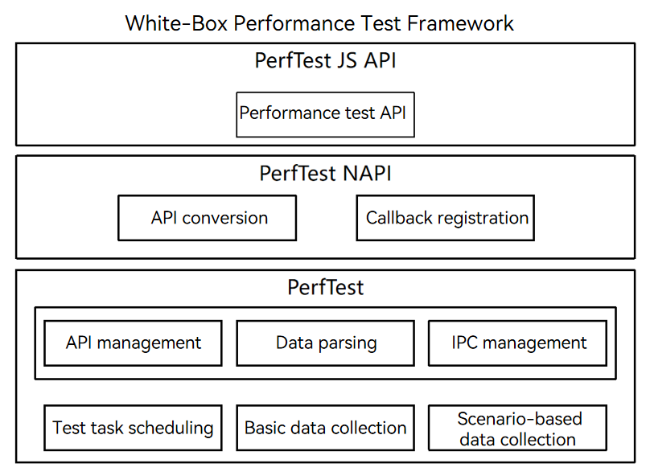

# PerfTest User Guide

<!--Kit: Test Kit-->
<!--Subsystem: Test-->
<!--Owner: @inter515-->
<!--Designer: @inter515-->
<!--Tester: @laonie666-->
<!--Adviser: @Brilliantry_Rui-->

## Overview

PerfTest provides white-box performance test capabilities for specified code segments at runtime, measuring the performance of specified application processes. The framework implements automatic tests through the multi-round iteration execution mechanism and environment reset mechanism, and collects and measures basic data such as the time consumption and CPU usage, and scenario-based performance data such as the startup latency and scrolling frame rate. Performance test scripts that use the PerfTest APIs must be developed based on JsUnit.

## Implementation Principles

The following figure shows the PerfTest feature design.



PerfTest provides ArkTS APIs for setting performance test strategies, executing performance tests, and obtaining test results. <!--RP1-->For details, see [@ohos.test.PerfTest](../reference/apis-test-kit/js-apis-perftest.md)<!--RP1End-->.

The cross-language communication layer bridges ArkTS and C++ APIs, performing parameter validation, JSON serialization/deserialization, and exception handling. As the client of PerfTest, it provides the startup entry and feature calling APIs. Loaded and run by the test application, this layer implements feature calling and lifecycle management by communicating with the server through IPC. In addition, it manages the calling of ArkTS callbacks from the C++ layer.

The PerfTest server processes the following main features:

- General framework running capability: manages C++ APIs and error codes, including API calling, parameter parsing, and exception handling. The PerfTest server runs as an independent process and communicates with the client through IPC. It listens for the client lifecycle, implementing process keepalive and on-demand start and stop.

- White-box performance test capability: schedules test tasks and collects performance data. It implements the automated performance test process for test code segment running, performance data collection, data processing, and data storage based on custom test strategies. Currently, the following performance metrics can be collected: time consumption, CPU usage, memory usage, application launch latency, page switching latency, and list scrolling frame rate.

## How to Develop

The following figure shows the process of performing a white-box performance test using the PerfTest APIs.


1. Define a performance test strategy, including the test metric list, code segment to be tested, environment reset code segment, bundle name of the application to be tested, number of test iterations, and timeout interval for executing the code segment once. The white-box performance test is performed based on the strategy.

2. Create a test task, configure the test strategy, and set up the test environment.

3. Start the test. Multiple tests are performed based on the number of test iterations. In each test, the performance data during the code execution is collected, and the environment reset code is executed to restore the environment. After the test is complete, process and save the data.

4. Obtain the collected data, which is stored in the object. You can obtain the detailed data, maximum value, minimum value, and average value of each test.

5. Destroy the created object to release the memory.

The following describes how to collect the execution duration and CPU usage of a specified code segment.

### Defining a Test Strategy

1. Define a test metric list.

    Define the **metrics** whose type is **Array\<PerfMetric>**. <!--RP2-->[PerfMetric](../reference/apis-test-kit/js-apis-perftest.md#perfmetric)<!--RP2End--> indicates the performance metrics supported by the framework.

    <!-- @[metricsDefine_sample](https://gitcode.com/openharmony/applications_app_samples/blob/master/code/Project/Test/perftest/entry/src/ohosTest/ets/test/CPUMetric.test.ets) -->
    
    ``` TypeScript
    let metrics: Array<PerfMetric> = [PerfMetric.DURATION, PerfMetric.CPU_USAGE]; // Define the metrics to be tested.
    ```

2. Define the code segment to be tested and the environment reset code segment.

    The code segment to be tested **actionCode** is a callback of the **Callback\<Callback\<boolean>>** type. The framework automatically calls this callback during the test and collects performance data. You need to call the input parameter **Callback\<boolean>** function to notify the framework that the execution is complete. Otherwise, the code segment execution times out. For example, when testing the performance of the **Utils.CalculateTest** method, you can call **finish(true)** to notify the framework that the code segment execution is complete.

    <!-- @[callbackDefine_sample](https://gitcode.com/openharmony/applications_app_samples/blob/master/code/Project/Test/perftest/entry/src/ohosTest/ets/test/CPUMetric.test.ets) -->
    
    ``` TypeScript
    let actionCode: Callback<Callback<boolean>> = async (finish: Callback<boolean>) => { // Define the code segment to be tested.
      Utils.CalculateTest();
      finish(true);
    };
    ```

    In addition, the framework supports the definition of the environment reset code segment **resetCode**, which is used to reset the environment after a single test. The type and usage of the code segment are the same as those of **actionCode**. **resetCode** is executed after **actionCode**, but application performance data is not collected during the execution.

    <!-- @[resetCodeDefine_sample](https://gitcode.com/openharmony/applications_app_samples/blob/master/code/Project/Test/perftest/entry/src/ohosTest/ets/test/CPUMetric.test.ets) -->
    
    ``` TypeScript
    let resetCode: Callback<Callback<boolean>> = async (finish: Callback<boolean>) => { // Define the code segment for environment reset.
      Utils.Reset();
      finish(true);
    };
    ```

3. Construct a test strategy object.

    In addition to the properties defined in the preceding steps, PerfTest can also define other test strategies to help you perform more accurate automated performance tests. All test strategies are defined and saved through the <!--RP3-->[PerfTestStrategy](../reference/apis-test-kit/js-apis-perftest.md#perfteststrategy)<!--RP3End--> object. During the performance test, data is collected based on the strategy.
    
    <!-- @[strategyDefine_sample](https://gitcode.com/openharmony/applications_app_samples/blob/master/code/Project/Test/perftest/entry/src/ohosTest/ets/test/CPUMetric.test.ets) -->
    
    ``` TypeScript
    let perfTestStrategy: PerfTestStrategy = {
      // Define the test policy.
      metrics: metrics,
      actionCode: actionCode,
      resetCode: resetCode,
      bundleName: 'com.samples.test.perftest', // Bundle name of the application to be tested. Replace it with the actual bundle name.
      iterations: 10, // Number of test iterations.
      timeout: 20000  // Timeout interval for executing a code segment.
    };
    ```

### Creating a Test Task and Starting the Test

  To create a test task, pass the **PerfTestStrategy** object defined above in <!--RP4-->[PerfTest.create()](../reference/apis-test-kit/js-apis-perftest.md#create)<!--RP4End-->. Then, call the <!--RP5-->[PerfTest.run()](../reference/apis-test-kit/js-apis-perftest.md#run)<!--RP5End--> asynchronous API to start the test. The test automatically iteratively executes the code segment and collects performance data. Use the **await** syntax sugar to synchronously wait for the execution to complete and then perform subsequent operations.

<!-- @[startTest_sample](https://gitcode.com/openharmony/applications_app_samples/blob/master/code/Project/Test/perftest/entry/src/ohosTest/ets/test/CPUMetric.test.ets) -->

``` TypeScript
let perfTest: PerfTest = PerfTest.create(perfTestStrategy); // Create a test task object PerfTest.
await perfTest.run(); // Execute the test. Use await to wait for the completion of the asynchronous function.
```

### Obtaining the Test Result

  After the performance test is complete, call <!--RP6-->[PerfTest.getMeasureResult()](../reference/apis-test-kit/js-apis-perftest.md#getmeasureresult)<!--RP6End--> to obtain the metrics. The test result is stored in the <!--RP7-->[PerfMeasureResult](../reference/apis-test-kit/js-apis-perftest.md#perfmeasureresult)<!--RP7End--> object. If the test is not complete or the metric is not defined, an error code is thrown.

<!-- @[getResult_sample](https://gitcode.com/openharmony/applications_app_samples/blob/master/code/Project/Test/perftest/entry/src/ohosTest/ets/test/CPUMetric.test.ets) -->

``` TypeScript
let res1: PerfMeasureResult = perfTest.getMeasureResult(PerfMetric.DURATION); // Obtain the test result of the duration.
let res2: PerfMeasureResult = perfTest.getMeasureResult(PerfMetric.CPU_USAGE); // Obtain the test result of the CPU usage.
```

### Destroying the Created Object

  After the test, if the **PerfTest** object is no longer needed, you can call <!--RP8-->[PerfTest.destroy()](../reference/apis-test-kit/js-apis-perftest.md#destroy)<!--RP8End--> to destroy the object to release memory.

<!-- @[exit_sample](https://gitcode.com/openharmony/applications_app_samples/blob/master/code/Project/Test/perftest/entry/src/ohosTest/ets/test/CPUMetric.test.ets) -->

``` TypeScript
perfTest.destroy(); // Destroy the PerfTest object.
```

## Sample Code

### Collecting Basic Performance Data

The following example describes how to collect basic performance data during the execution of a specified logic in an application. In the application, a method named **Utils.CalculateTest()** is defined. During the performance test, this method is executed to collect the execution duration and application CPU usage.

1. Add the **Utils.ets** file to the **main** > **ets** > **utils** folder and compile the custom function in the file.

    <!-- @[utils_sample](https://gitcode.com/openharmony/applications_app_samples/blob/master/code/Project/Test/perftest/entry/src/main/ets/utils/Utils.ets) -->
    
    ``` TypeScript
    export class Utils {
      static num: number = 0;
      static maxNum: number = 10000;
    
      public static CalculateTest() {
        for (let index = 0; index < Utils.maxNum; index++) {
          Utils.num++;
        }
      }
    
      public static Reset() {
        Utils.num = 0;
      }
    }
    ```

2. Compile the test code in the **CPUMetric.test.ets** file in the **ohosTest** > **ets** > **test** folder.

    <!-- @[CPUMetric_sample](https://gitcode.com/openharmony/applications_app_samples/blob/master/code/Project/Test/perftest/entry/src/ohosTest/ets/test/CPUMetric.test.ets) -->
    
    ``` TypeScript
    import { describe, expect, it, Level } from '@ohos/hypium';
    import { abilityDelegatorRegistry, PerfMeasureResult, PerfMetric, PerfTest, PerfTestStrategy } from '@kit.TestKit';
    import { Utils } from '../../../main/ets/utils/Utils';
    
    export default function PerfTestTest() {
      describe('PerfTestTest2', () => {
        it('testExample1', 0, async (done: Function) => {
          let metrics: Array<PerfMetric> = [PerfMetric.DURATION, PerfMetric.CPU_USAGE]; // Define the metrics to be tested.
          let actionCode: Callback<Callback<boolean>> = async (finish: Callback<boolean>) => { // Define the code segment to be tested.
            Utils.CalculateTest();
            finish(true);
          };
          let resetCode: Callback<Callback<boolean>> = async (finish: Callback<boolean>) => { // Define the code segment for environment reset.
            Utils.Reset();
            finish(true);
          };
          let perfTestStrategy: PerfTestStrategy = {
            // Define the test policy.
            metrics: metrics,
            actionCode: actionCode,
            resetCode: resetCode,
            bundleName: 'com.samples.test.perftest', // Bundle name of the application to be tested. Replace it with the actual bundle name.
            iterations: 10, // Number of test iterations.
            timeout: 20000  // Timeout interval for executing a code segment.
          };
          try {
            let perfTest: PerfTest = PerfTest.create(perfTestStrategy); // Create a test task object PerfTest.
            await perfTest.run(); // Execute the test. Use await to wait for the completion of the asynchronous function.
            let res1: PerfMeasureResult = perfTest.getMeasureResult(PerfMetric.DURATION); // Obtain the test result of the duration.
            let res2: PerfMeasureResult = perfTest.getMeasureResult(PerfMetric.CPU_USAGE); // Obtain the test result of the CPU usage.
            perfTest.destroy(); // Destroy the PerfTest object.
            expect(res1.average).assertLessOrEqual(1000); // Assert the performance test result.
            expect(res2.average).assertLessOrEqual(30); // Assert the performance test result.
          } catch (error) {
            expect(false).assertTrue();
          }
          done();
        })
      })
    }
    ```

### Collecting Scenario-based Performance Data

The following example describes how to test the frame rate of list scrolling in an application as follows: Open a specified application, use the UITest API to search for the **Scroll** component, scroll the list, and collect the frame rate of list scrolling.

1. Write the **PageListPage.ets** page code in the **main** > **ets** > **pages** folder as the test demo.

    <!-- @[scroll_sample](https://gitcode.com/openharmony/applications_app_samples/blob/master/code/Project/Test/perftest/entry/src/main/ets/pages/PageListPage.ets) -->
    
    ``` TypeScript
    @Entry
    @Component
    struct ListPage {
      scroller: Scroller = new Scroller();
      private arr: number[] = [1, 2, 3, 4, 5, 6, 7, 8, 9, 10];
    
      build() {
        Row() {
          Column() {
            Scroll(this.scroller) {
              Column() {
                ForEach(this.arr, (item: number) => {
                  Text(item.toString())
                    .width('90%')
                    .height('40%')
                    .fontSize(80)
                    .textAlign(TextAlign.Center)
                    .margin({ top: 10 })
                }, (item: string) => item)
              }
            }
            .width('100%')
            .height('100%')
            .scrollable(ScrollDirection.Vertical)
            .scrollBar(BarState.On)
            .scrollBarColor(Color.Gray)
          }
          .width('100%')
        }
        .height('100%')
      }
    }
    ```

2. Compile the test code in the **slideFps.test.ets** file in the **ohosTest** > **ets** > **test** folder.

    <!-- @[slideFps_sample](https://gitcode.com/openharmony/applications_app_samples/blob/master/code/Project/Test/perftest/entry/src/ohosTest/ets/test/SlideFps.test.ets) -->
    
    ``` TypeScript
    import { describe, expect, it, Level } from '@ohos/hypium';
    import {
      abilityDelegatorRegistry,
      Driver,
      ON,
      PerfMeasureResult,
      PerfMetric,
      PerfTest,
      PerfTestStrategy
    } from '@kit.TestKit';
    import { Want } from '@kit.AbilityKit';
    
    const delegator: abilityDelegatorRegistry.AbilityDelegator = abilityDelegatorRegistry.getAbilityDelegator();
    
    export default function PerfTestTest() {
      describe('PerfTestTest1', () => {
        it('testExample2', Level.LEVEL3, async (done: Function) => {
          let driver = Driver.create();
          await driver.delayMs(1000);
          const bundleName = abilityDelegatorRegistry.getArguments().bundleName;
          // Replace the bundleName and abilityName with the actual ones.
          const want: Want = {
            bundleName: bundleName,
            abilityName: 'EntryAbility'
          };
          await delegator.startAbility(want); // Start the test application.
          await driver.delayMs(1000);
          let toPageListBtn = await driver.findComponent(ON.id('toPageList'));
          await toPageListBtn.click();
          await driver.delayMs(1000);
          let scroll = await driver.findComponent(ON.type('Scroll'));
          await driver.delayMs(1000);
          let center = await scroll.getBoundsCenter(); // Obtain the coordinates of the Scroll component.
          await driver.delayMs(1000);
          let metrics: Array<PerfMetric> = [PerfMetric.LIST_SWIPE_FPS]; // Specify the test metric to the frame rate during list scrolling.
          let actionCode = async (finish: Callback<boolean>) => { // Use UITest to scroll the list in the test code segment.
            await driver.fling({ x: center.x, y: Math.floor(center.y * 3 / 2) },
              { x: center.x, y: Math.floor(center.y / 2) }, 50, 20000);
            await driver.delayMs(3000);
            finish(true);
          };
          let resetCode = async (finish: Callback<boolean>) => { // Reset the environment by scrolling to the top of the list.
            await scroll.scrollToTop(40000);
            await driver.delayMs(1000);
            finish(true);
          };
          let perfTestStrategy: PerfTestStrategy = {
            // Define the test policy.
            metrics: metrics,
            actionCode: actionCode,
            resetCode: resetCode,
            iterations: 5, // Specify the number of test iterations.
            timeout: 50000, // Specify the timeout interval of actionCode and resetCode.
          };
          try {
            let perfTest: PerfTest = PerfTest.create(perfTestStrategy); // Create a test task object PerfTest.
            await perfTest.run(); // Execute the test. Use await to wait for the completion of the asynchronous function.
            let res: PerfMeasureResult = perfTest.getMeasureResult(PerfMetric.LIST_SWIPE_FPS); // Obtain the test result of the frame rate during list scrolling.
            perfTest.destroy(); // Destroy the PerfTest object.
            expect(res.average).assertLargerOrEqual(30); // Assert the performance test result.
          } catch (error) {
            console.error(`Failed to execute perftest. Cause:${JSON.stringify(error)}`);
          }
          done();
        })
      })
    }
    ```

<!--Del-->
For details about the PerfTest project example, see [White-Box Performance Test Example](https://gitcode.com/openharmony/applications_app_samples/blob/master/code/Project/Test/perftest).
<!--DelEnd-->
