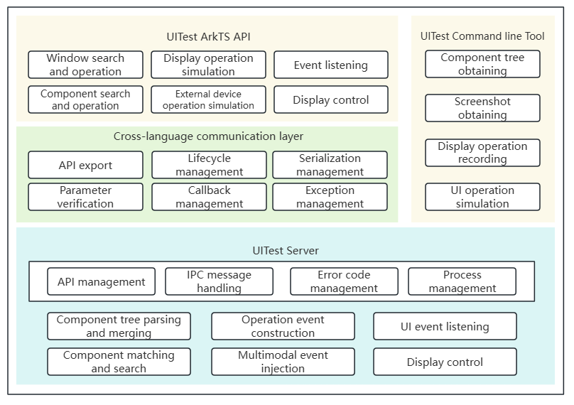

# UITest User Guide

<!--Kit: Test Kit-->
<!--Subsystem: Test-->
<!--Owner: @inter515-->
<!--Designer: @inter515-->
<!--Tester: @laonie666-->
<!--Adviser: @Brilliantry_Rui-->

## Overview

UITest provides UI search and operation simulation capabilities for key scenarios of automated UI tests, including accurate UI component search, UI interaction operations (such as tap, swipe, and text input), and peripheral behavior simulation (such as keyboard input, mouse operation, touchpad gesture, and stylus action).

## Capabilities

UITest supports both ArkTS APIs and commands, providing flexible and efficient technical support for automated UI tests.

**ArkTS script development**:
UITest provides simple and easy-to-use APIs for various test scenarios. It supports common UI interaction operations, such as tap, double-tap, long press, and swipe, helping you quickly develop automated test scripts based on UI interaction logic.

**Command line testing**:
UITest supports diversified test operations through commands, including obtaining the current screen screenshot, obtaining the component tree, recording the screen operation process, and easily injecting UI simulation events.



UITest consists of the client and server.

**Client**:
Provides a cross-language communication layer and IPC module to export APIs and launch UITest. The client is loaded by the test application and runs in the application process. The cross-language communication layer exports APIs, processes JSON serialization objects, converts ArkTS APIs into C++ APIs, and parses and verifies parameters. In addition, this module involves invoking ArkTS callback functions from the C++ layer. Therefore, the cross-language communication layer manages and invokes ArkTS callbacks.

**Server**:
Runs as an independent process and communicates with the client through IPC. After the server starts, it establishes a connection with the client through broadcast. The IPC ensures that the connection is not interrupted. The server listens for the client process status and starts or stops the client process as required. The server processes the core logic of UITest, which consists of the following parts:
1. General framework running capability: processes IPC messages, manages processes, C++ APIs, and error codes, and listens for API calling.
2. UI test capability: parses accessibility nodes to build a page component tree, matches and searches for components, constructs operation events, injects multimodal events, listens for UI events, and controls screen display.

## Using ArkTS APIs to Perform UI Tests

The following describes how to use the ArkTS APIs of UITest.

The UITest API is called based on <!--RP14-->[JsUnit](unittest-guidelines.md)<!--RP14End-->. For details about the APIs and parameters, see <!--RP13-->[@ohos.UiTest](../reference/apis-test-kit/js-apis-uitest.md)<!--RP13End-->.

### UI Test Example

The following example describes how to develop a UI test based on the JsUnit script. The functionalities are as follows:

1. Call the <!--RP1-->[AbilityDelegator](../reference/apis-test-kit/js-apis-inner-application-abilityDelegator.md)<!--RP1End--> capability to start the target application and check the application running status.
2. Call the UITest capability to perform a tap operation on the page.
3. Add an <!--RP2-->[assertion](unittest-guidelines.md)<!--RP2End--> to check whether the actual changes on the current page are as expected.

Perform the following steps:

1. Write the **clickToAfter.ets** page code in the **main** > **ets** > **pages** folder as the test demo.
    
    <!-- @[clickToAfter](https://gitcode.com/openharmony/applications_app_samples/blob/master/code/Project/Test/uitest/entry/src/main/ets/pages/ClickToAfter.ets) -->
    
    ```TypeScript
    @Entry
    @Component
    struct Index {
        @State message: string = 'Hello World';
        @State text: string = '';
        build() {
        Row() {
            Column() {
            Text(this.message)
                .fontSize(50)
                .fontWeight(FontWeight.Bold)
            Text("Next")
                .fontSize(50)
                .margin({top:20})
                .fontWeight(FontWeight.Bold)          
                .onClick((event?: ClickEvent) => {
                    if(event){
                        this.text = "after click";
                    }
                })
            .width('100%')
            Text(this.text).margin(15)
            }
        }
        .height('100%')
        }
    }
    ```
    
2. Create the test file in the **ohosTest** > **ets** > **test** folder and write the test code.
    
    <!-- @[click_sample](https://gitcode.com/openharmony/applications_app_samples/blob/master/code/Project/Test/uitest/entry/src/ohosTest/ets/test/basicExampleTest/BasicExample.test.ets) -->
    
    ```TypeScript
    import { describe, it, expect, Level } from '@ohos/hypium';
    // Import the test dependencies.
    import { abilityDelegatorRegistry, Driver, ON } from '@kit.TestKit';
    import { UIAbility, Want } from '@kit.AbilityKit';
    
    const delegator: abilityDelegatorRegistry.AbilityDelegator = abilityDelegatorRegistry.getAbilityDelegator();
    export default function abilityTest() {
      describe('ActsAbilityTest', () => {
        it('testUiExample',Level.LEVEL3, async (done: Function) => {
          // Initialize the Driver object.
          const driver = Driver.create();
          const bundleName = abilityDelegatorRegistry.getArguments().bundleName;
          // Specify the bundle name and ability name of the application to be tested.
          const want: Want = {
            bundleName: bundleName,
              abilityName: 'EntryAbility'
          }
          // Start the application to be tested.
          await delegator.startAbility(want);
          // Wait until the application starts.
          await driver.waitForIdle(4000,5000);
          // Ensure that the top ability of the application is the specified ability.
          const ability: UIAbility = await delegator.getCurrentTopAbility();
          expect(ability.context.abilityInfo.name).assertEqual('EntryAbility');
    
          // Search for the target component based on the specified text Next.
          const next = await driver.findComponent(ON.text('Next'));
          // Tap the target component.
          await next.click();
          await driver.waitForIdle(4000,5000);
          // Assert the component with text "after click" exists to ensure the page changes as expected.
          await driver.assertComponentExist(ON.text('after click'));
          await driver.pressBack();
          done();
        })
      })
    }
    ```

### Searching for and Operating Components

With UITest, you can <!--RP3-->[create a matcher based on attributes](../reference/apis-test-kit/js-apis-uitest.md#on9)<!--RP3End--> to search for one or more target components on the current page and return the component object. You can also search for target component inside the scroll component and <!--RP4-->[operate component objects or obtain component attributes](../reference/apis-test-kit/js-apis-uitest.md#component9)<!--RP4End-->.

The following example shows how to search for and operate a component. Before executing the following code, implement the code of the **Index.ets** page by referring to "UI Test Example".

<!-- @[findAndOp_sample](https://gitcode.com/openharmony/applications_app_samples/blob/master/code/Project/Test/uitest/entry/src/ohosTest/ets/test/findCommentExampleTest/Component/FindComAndOp.test.ets) -->

  ```TypeScript
  // Import the test dependencies.
  import { Driver, Component, ON, On } from '@kit.TestKit';

  export default function abilityTest() {
    describe('componentOperationTest', () => {
      /**
       * Search for the Button component and click it.
       */
      it("componentSearchAndOperation", TestType.FUNCTION, async () => {
        let driver: Driver = Driver.create();
        await driver.delayMs(1000);
        let button: Component = await driver.findComponent(ON.type('Button'));
        await button.click();
      })

      /**
       * Search for the Scroll component whose text is "123" using relative position.
       */
      it("relativePositioncomponentSearch", TestType.FUNCTION, async () => {
        let driver: Driver = Driver.create();
        let on: On = ON.text('123').within(ON.type('Scroll'));
        let items: Array<Component> = await driver.findComponents(on);
      })

      /**
       * Search for the Image component and pinch it out.
       */
      it("componentPinch", TestType.FUNCTION, async () => {
        let driver: Driver = Driver.create();
        let image: Component = await driver.findComponent(ON.type('Image'));
        await image.pinchOut(1.5);
      })
    })
  }
  ```

### Simulating Touch Operations

UITest supports simulating events such as tap, double-tap, long press, swipe, drag, and multi-finger operations.

The following example shows how to simulate touch operations at the coordinate level. Before executing the following code, implement the **Index.ets page** code by referring to "UI Test Example".

<!-- @[touchScreen_sample](https://gitcode.com/openharmony/applications_app_samples/blob/master/code/Project/Test/uitest/entry/src/ohosTest/ets/test/operationExampleTest/ui/TouchScreenEvent.test.ets) -->

  ```TypeScript
  import { describe, it, TestType, Size, Level } from '@ohos/hypium';
  // Import the test dependencies.
  import { Driver, PointerMatrix, UiDirection } from '@kit.TestKit';

  export default function abilityTest() {
    describe('touchScreen_sample', () => {
      /**
       * Simulate touch operations based on coordinates.
       */
      it("touchScreenOperation", TestType.FUNCTION, async () => {
        let driver: Driver = Driver.create();
        // Tap.
        await driver.click(100,100);
        // Tap the specified display.
            await driver.clickAt({ x: 100, y: 100, displayId: 0 });
        // Swipe.
        await driver.swipe(100, 100, 200, 200, 600);
        // Swipe the specified display.
        await driver.swipeBetween({x: 100, y: 100, displayId: 0}, {x: 1000, y: 1000, displayId: 0}, 800);
        // Fling.
        await driver.fling({x: 100, y: 100},{x: 200, y: 200}, 5, 600);
        // Fling in a specified direction.
        await driver.fling(UiDirection.DOWN, 10000);
        // Drag.
        await driver.drag(100, 100, 200, 200, 600);
        // Specify the display ID and the long press duration before dragging.
        await driver.dragBetween( {x: 100, y: 100, displayId: 0}, {x: 1000, y: 1000, displayId: 0}, 800, 1500); 
        // Simulate a two-finger operation, with each finger scrolling based on two coordinates.
        let pointers: PointerMatrix = PointerMatrix.create(2, 2);
        pointers.setPoint(0, 0, {x: 100, y: 100});
        pointers.setPoint(0, 1, {x: 200, y: 100});
        pointers.setPoint(1, 0, {x: 100, y: 200});
        pointers.setPoint(1, 1, {x: 200, y: 200});
        await driver.injectMultiPointerAction(pointers);
      })
    })
  }
  ```
### Waiting for Page Loading Completion

When interacting with a page, you can determine whether the page redirection is complete by waiting for a component to appear or waiting for the page to be idle within a specified period of time.

The following example describes how to wait for page loading completion. Before executing the following code, implement the **Index.ets** page code by referring to "UI Test Example".

<!-- @[waitForComp_sample](https://gitcode.com/openharmony/applications_app_samples/blob/master/code/Project/Test/uitest/entry/src/ohosTest/ets/test/operationExampleTest/ui/WaitForCom.test.ets) -->

  ```TypeScript
  import { describe, it, Level, TestType, Size } from '@ohos/hypium';
  // Import the test dependencies.
  import { abilityDelegatorRegistry, Driver, ON } from '@kit.TestKit';

  const delegator: abilityDelegatorRegistry.AbilityDelegator = abilityDelegatorRegistry.getAbilityDelegator();
  // Specify the bundle name and ability name of the application to be tested.
  const bundleName: string = 'com.uitestScene.acts';
  const abilityName: string = 'com.uitestScene.acts.MainAbility';
  export default function abilityTest() {
    describe('waitForComp_sample', () => {
      it('testWaitForComponent_static', TestType.FUNCTION | Size.MEDIUMTEST | Level.LEVEL3, async (done: Function): Promise<void> => {
        let driver = Driver.create();
        // Start the target application.     
        await delegator.executeShellCommand(`aa start -b ${bundleName} -a ${abilityName}`).then(result => {
        }).catch((err: Error) => {
            done();
        })
        // Wait for the specified component on the target application's home screen to appear, confirming that the application has started.
        let button = await driver.waitForComponent(ON.text('StartAbility Success!'), 1000);
      })
    })
  }
  ```

### Simulating Text Input

UITest supports text input at a specified coordinate or to a specified component. <!--RP5-->[Specified input mode](../reference/apis-test-kit/js-apis-uitest.md#inputtextmode20)<!--RP5End--> is also supported, that is, whether to copy and paste the text or add the text.

The following example describes how to input text based on components and coordinates. Before running the following code, implement the **Index.ets page** code by referring to "UI Test Example".

<!-- @[inputText_sample](https://gitcode.com/openharmony/applications_app_samples/blob/master/code/Project/Test/uitest/entry/src/ohosTest/ets/test/operationExampleTest/ui/InputText.test.ets) -->

  ```TypeScript
  import { describe, it, TestType, Size, Level } from '@ohos/hypium';
  // Import the test dependencies.
  import { Driver, ON } from '@kit.TestKit';

  export default function abilityTest() {
    describe('inputTextTest', () => {
      /**
       * Clear the text by default and then inputs the specified text based on the component.
       * If the input text does not contain Chinese characters or special characters and its length does not exceed 200 characters, it is input word by word by default.
       */
      it('componentInputText', TestType.FUNCTION, async () => {
        let driver = Driver.create();
        let input = await driver.findComponent(ON.type('TextInput'));
        await input.inputText('abc');
      })
      /**
       * Inject specified text in copy and paste mode based on the component.
       * Input text in addition mode. That is, the original content is not cleared when the text is input.
       */
      it('componentInputTextAddition', TestType.FUNCTION, async () => {
        let driver = Driver.create();
        let input = await driver.findComponent(ON.type('TextInput'));
        await input.inputText('abc', {paste: true, addition: true});
      })

      /**
       * Focus the text box by tapping the specified position and input the specified text at the cursor based on the coordinates.
       * If the input text does not contain Chinese characters or special characters and its length does not exceed 200 characters, it is input word by word by default.
       */
      it('pointInputText', TestType.FUNCTION | Size.MEDIUMTEST | Level.LEVEL3, async () => {
        let driver = Driver.create()
        let input = await driver.findComponent(ON.type('TextInput'))
        let center = await input.getBoundsCenter()
        await driver.inputText(center, 'abc')
      })

      /**
       * Inject specified text in copy and paste mode based on the coordinates.
       * Input in addition mode, that is, after the text box is focused by tapping the specified position, the cursor is moved to the end of the original text and then the specified text is input.
       */
      it('pointInputTextAddition', TestType.FUNCTION | Size.MEDIUMTEST | Level.LEVEL3, async () => {
        let driver = Driver.create()
        let input = await driver.findComponent(ON.type('TextInput'))
        let center = await input.getBoundsCenter()
        await driver.inputText(center, '123', {paste: true, addition: true})
      })

      /**
       * Inject specified text in copy and paste mode based on the coordinates.
       * Input in addition mode, that is, after the text box is focused by tapping the specified position, the cursor is moved to the end of the original text and then the specified text is input.
       * If the input content contains Chinese characters or special characters, the text can be input only in copy and paste mode, and the paste field does not take effect.
       */
      it('pointInputTextChinese', TestType.FUNCTION | Size.MEDIUMTEST | Level.LEVEL3, async () => {
        let driver = Driver.create()
        let input = await driver.findComponent(ON.type('TextInput'))
        let center = await input.getBoundsCenter()
        await driver.inputText(center, 'Hello', {paste: false, addition: true})
      })
    })
  }
  ```
### Capturing Screenshots

> **Note**:
> 1. You need to specify the path for saving screenshots to <!--RP6-->[the sandbox directory](../file-management/app-sandbox-directory.md)<!--RP6End--> of the application.
> 2. The <!--RP7-->[Ability Privilege Level (APL)](../security/AccessToken/app-permission-mgmt-overview.md#basic-concepts-in-the-permission-mechanism)<!--RP7End--> of the test HAP is **normal**. Therefore, the application sandbox path in the user-level encryption area must be used. In addition, the file should be saved in the subdirectory for saving the application's persistent data on the device. 

The following example shows how to capture a screenshot with the display ID and area specified and save the screenshot to a specified path. Before running the following code, implement the **Index.ets page** code by referring to "UI Test Example". In the multi-display scenario, to capture a screenshot of a specified display, you can call the API of the display module to <!--RP8-->[obtain the display object](../displaymanager/screenProperty-guideline.md#obtaining-a-display-object)<!--RP8End-->, and then <!--RP9-->[obtain display properties](../displaymanager/screenProperty-guideline.md#obtaining-display-properties)<!--RP9End-->.

<!-- @[screenCap_sample](https://gitcode.com/openharmony/applications_app_samples/blob/master/code/Project/Test/uitest/entry/src/ohosTest/ets/test/operationExampleTest/ui/ScreenCap.test.ets) -->

  ```TypeScript
  import { describe, it, TestType, Size, Level } from '@ohos/hypium';
  // Import the test dependencies.
  import { Driver } from '@kit.TestKit';
  import { display } from '@kit.ArkUI';

  export default function abilityTest() {
    describe('screenCap_sample', () => {
      /**
       * Capture the screen of a specified area and save the screenshot to a specified path.
       */
      it('screenCapture', TestType.FUNCTION, async () => {
        let driver = Driver.create();
        // Application sandbox path. el2 indicates the user-level encryption, and base indicates the subdirectory for saving the application's persistent data on the device.
        // Use the actual path.
        let savePath = '/data/storage/el2/base/cache/1.png';
        let res = await driver.screenCapture(savePath, {left: 0, top: 0, right: 100, bottom: 100});
      })

      /**
       * Capture the full screen based on the specified display ID and save it to the specified path.
       */
      it('screenCapWithId', TestType.FUNCTION | Size.MEDIUMTEST | Level.LEVEL3, async () => {
        let driver = Driver.create();
        // Obtain the default display object.
        let disPlay = display.getDefaultDisplaySync();
        let savePath = '/data/storage/el2/base/cache/1.png'
        let res = await driver.screenCap(savePath, disPlay.id);// Obtain the default display ID.
      })
    })
  }
  ```


### Listening for UI Events

The following example describes how to listen for UI events, including setting the listening callback, listening for the **Toast** and **Dialog** components, and proceeding after an event occurs. Before running the following code, implement the **Index.ets page** code by referring to "UI Test Example".

<!-- @[eventObserver_sample](https://gitcode.com/openharmony/applications_app_samples/blob/master/code/Project/Test/uitest/entry/src/ohosTest/ets/test/operationExampleTest/ui/EventObserver.test.ets) -->

  ```TypeScript
  import { describe, it, TestType, Size, Level } from '@ohos/hypium';
  // Import the test dependencies.
  import { Driver, UIElementInfo } from '@kit.TestKit';

  export default function abilityTest() {
    describe('eventObserver_sample', () => {
      // Listen for the display of the Toast component.
      it("toastObserver", TestType.FUNCTION, async () => {
        let driver = Driver.create();
        let observer = driver.createUIEventObserver();
        let callback = (uiElementInfo : UIElementInfo) => {
          let bundleName = uiElementInfo.bundleName;
          let text = uiElementInfo.text;
          let type = uiElementInfo.type;
        }
        observer.once('toastShow', callback);
      })
    })
  }
  ```

### Simulating Keyboard and Mouse Operations

The following example describes how to simulate keyboard and mouse operations, including single key and combination key input, mouse click, move, and drag, and key and mouse combination operations. Before running the following code, implement the **Index.ets page** code by referring to "UI Test Example".

<!-- @[mouseAndKey_sample](https://gitcode.com/openharmony/applications_app_samples/blob/master/code/Project/Test/uitest/entry/src/ohosTest/ets/test/operationExampleTest/ui/MouseAndKeyOp.test.ets) -->

  ```TypeScript
  import { describe, it, TestType, Size, Level } from '@ohos/hypium';
  // Import the test dependencies.
  import { Driver, MouseButton } from '@kit.TestKit';
  import { KeyCode } from '@ohos.multimodalInput.keyCode';

  export default function abilityTest() {
    describe('mouseAndKey_sample', () => {
      // Simulate key input and combination key input.
      it('keyBoardOperation', TestType.FUNCTION | Size.MEDIUMTEST | Level.LEVEL3, async () => {
        let driver = Driver.create();
        // Simulate key input (inject the Back key).
        await driver.triggerKey(KeyCode.KEYCODE_BACK);
        // Simulate combination key input (inject the Save combination key).
        await driver.triggerCombineKeys(KeyCode.KEYCODE_CTRL_LEFT,  KeyCode.KEYCODE_S);
      })

      // Simulate the operations of left-clicking, moving, and dragging the mouse.
      it('mouseOperation', TestType.FUNCTION | Size.MEDIUMTEST | Level.LEVEL3, async () => {
        let driver = Driver.create();
        // Left-click the mouse.
        await driver.mouseClick({x: 100, y: 100}, MouseButton.MOUSE_BUTTON_LEFT); 
        // Move the mouse.
        await driver.mouseMoveTo({x: 100, y: 100});
        // Drag the mouse.
        await driver.mouseDrag({x: 100, y: 100}, {x: 200, y: 200}, 600);
      })

      // Simulate key and mouse combination operations.
      it('combinedOperation', TestType.FUNCTION | Size.MEDIUMTEST | Level.LEVEL3, async () => {
        let driver = Driver.create();
        // Press the left Ctrl key and scroll the mouse wheel.
        await driver.mouseScroll({x:100, y:100}, true, 30, KeyCode.KEYCODE_CTRL_LEFT);
        // Press the left Ctrl key and long-click the left mouse button.
        await driver.mouseLongClick({x:100, y:100}, MouseButton.MOUSE_BUTTON_LEFT, KeyCode.KEYCODE_CTRL_LEFT);
      })
    })
  }
  ```

### Searching for and Operating Windows
The following example describes how to search for and minimize a window based on the window properties. Before running the following code, implement the **Index.ets page** code by referring to "UI Test Example".

<!-- @[findWindowAndOp_sample](https://gitcode.com/openharmony/applications_app_samples/blob/master/code/Project/Test/uitest/entry/src/ohosTest/ets/test/operationExampleTest/window/FindWindowAndOp.test.ets) -->

  ```TypeScript
  import { describe, it, TestType, expect } from '@ohos/hypium';
  // Import the test dependencies.
  import { Driver } from '@kit.TestKit';
  // Error code when the device is not supported.
  const DeviceErrorCode = 17000005;

  export default function abilityTest() {
    describe('findWindowAndOp_sample', () => {
      // Search for an active window based on specified properties and minimize the window.
      it("windowSearchAndOperation", TestType.FUNCTION, async () => {
        let driver = Driver.create();
        try {
          let window = await driver.findWindow({active: true});
          await window.minimize();
        } catch (error) {
          // If the minimize API is called on a device that does not support window operations, the 17000005 error code will be thrown.
          expect(error.code).assertEqual(DeviceErrorCode);
        }
      })
    })
  }
  ```

### Simulating Touchpad Operations
The following example describes how to simulate the touchpad operations of swiping up with three fingers to return to the home screen and swiping down with three fingers to return to the application window. Before running the following code, implement the **Index.ets page** code by referring to "UI Test Example".

<!-- @[touchPadOp_sample](https://gitcode.com/openharmony/applications_app_samples/blob/master/code/Project/Test/uitest/entry/src/ohosTest/ets/test/operationExampleTest/ui/TouchPadOp.test.ets) -->

  ```TypeScript
  import { describe, it, TestType, Size, Level, expect } from '@ohos/hypium';
  // Import the test dependencies.
  import { Driver, UiDirection } from '@kit.TestKit';
  // Error code when the device is not supported.
  const DeviceErrorCode = 17000005;

  export default function abilityTest() {
    describe('touchPadOp_sample', () => {
      // Simulate the three-finger swipe up (to return to the home screen) and three-finger swipe down (to restore the window) operations on the touchpad in the PC/2-in-1 device.
      it('touchPadOperation', TestType.FUNCTION | Size.MEDIUMTEST | Level.LEVEL3, async () => {
        let driver = Driver.create();
        try {
          // Swipe up with three fingers to return to the home screen.
          await driver.touchPadMultiFingerSwipe(3, UiDirection.UP);
          // Swipe down with three fingers to restore the application window.
          await driver.touchPadMultiFingerSwipe(3, UiDirection.DOWN);
        } catch (error) {
          // If this API is called on a device that does not support touchpad operations, the 17000005 error code will be thrown.
          expect(error.code).assertEqual(DeviceErrorCode);
        }
      })
    })
  }

  ```

### Simulating Stylus Operations
The following example describes how to simulate stylus operations such as clicking, swiping, and setting pressure. Before running the following code, implement the **Index.ets page** code by referring to "UI Test Example".

<!-- @[penOp_sample](https://gitcode.com/openharmony/applications_app_samples/blob/master/code/Project/Test/uitest/entry/src/ohosTest/ets/test/operationExampleTest/ui/PenOp.test.ets) -->

  ```TypeScript
  import { describe, it, TestType, Size, Level } from '@ohos/hypium';
  // Import the test dependencies.
  import { Driver } from '@kit.TestKit';

  export default function abilityTest() {
    describe('penOp_sample', () => {
      // Simulate stylus operations such as click, double-click, long-click, and swipe.
      it('penOperation', TestType.FUNCTION | Size.MEDIUMTEST | Level.LEVEL3, async () => {
        let driver = Driver.create();
        // Click with the stylus.
        await driver.penClick({x: 100, y: 100});
        // Double-click with the stylus.
        await driver.penDoubleClick({x: 100, y: 100});
        // Long-click with the stylus.
        await driver.penLongClick({x: 100, y: 100}, 0.5);
        // Swipe with the stylus.
        await driver.penSwipe({x: 100, y: 100}, {x: 100, y: 500}, 600, 0.5);
      })
    })
  }
  ```

### Simulating Crown Operations
The following example shows how to simulate clockwise and counter-clockwise crown rotations. Before running the following code, implement the **Index.ets page** code by referring to "UI Test Example".

<!-- @[watchOp_sample](https://gitcode.com/openharmony/applications_app_samples/blob/master/code/Project/Test/uitest/entry/src/ohosTest/ets/test/operationExampleTest/ui/WatchOp.test.ets) -->

  ```TypeScript
  import { describe, it, TestType, Size, Level, expect } from '@ohos/hypium';
  // Import the test dependencies.
  import { Driver } from '@kit.TestKit';
  // Error code when the device is not supported.
  const CapabilityCode = 801;

  export default function abilityTest() {
    describe('watchOp_sample', () => {
      // Simulate clockwise and counter-clockwise crown rotations.
      it('crownRotate', TestType.FUNCTION | Size.MEDIUMTEST | Level.LEVEL3, async () => {
        let driver = Driver.create();
        try {
          // Rotate 50 ticks clockwise at a speed of 30 ticks per second.
          await driver.crownRotate(50, 30);
          // Rotate 20 ticks counterclockwise at a speed of 30 ticks per second.
          await driver.crownRotate(-20, 30);
        } catch (error) {
          // driver.crownRotate is valid only on smart watches. If it is called on other devices, error code 801 will be thrown.
          expect(error.code).assertEqual(CapabilityCode);
        }
      })
    })
  }
  ```

### Simulating Display Operations
The following example shows how to simulate display operations, including obtaining display properties such as size and density, waking up the display, and rotating it. Before running the following code, implement the **Index.ets page** code by referring to "UI Test Example".

<!-- @[displayOp_sample](https://gitcode.com/openharmony/applications_app_samples/blob/master/code/Project/Test/uitest/entry/src/ohosTest/ets/test/operationExampleTest/ui/DisplayOp.test.ets) -->

  ```TypeScript
  import { describe, it, TestType, Size, Level } from '@ohos/hypium';
  // Import the test dependencies.
  import { DisplayRotation, Driver, Point } from '@kit.TestKit';
  
  export default function abilityTest() {
    describe('displayOp_sample', () => {
      // Obtain display properties and operate the display.
      it('displayOperation', TestType.FUNCTION | Size.MEDIUMTEST | Level.LEVEL3, async () => {
        let driver = Driver.create();
        // Obtain the display size.
        let size: Point = await driver.getDisplaySize();
        // Obtain the display density.
        let density: Point = await driver.getDisplayDensity();
        // Wake up the display.
        await driver.wakeUpDisplay();
        // Rotate the display clockwise by 90 degrees.
        await driver.setDisplayRotation(DisplayRotation.ROTATION_90);
      })
    })
  }
  ```

## Using Commands to Perform UI Tests

During development, you can use commands to quickly perform test operations such as capturing screenshots, recording UI operations, injecting UI simulation operations, and obtaining the component tree.

### Environment Setup

The environment for OpenHarmony Device Connector (hdc) has been set up. For details, see <!--RP10-->[Environment Setup](../dfx/hdc.md#environment-setup)<!--RP10End-->. The devices are properly connected and **hdc shell** is executed.

### Commands
| Command           | Parameter  |Description                             |
|---------------|---------------------------------|---------------------------------|
| help          | - |  Displays the commands supported by the UITest tool.           |
| screenCap       |[-p] [-d]| Captures a screenshot.<br>For details about the parameters, see [Obtaining a Screenshot](#obtaining-a-screenshot).|
| dumpLayout      |[-p] \<-i \| -a \| -b \| -w \| -m \| -d>| Obtains the component tree.<br>For details about the parameters, see [Obtaining the Component Tree](#obtaining-the-component-tree).|
| uiRecord        | \<record \| read>|Records UI operations.<br> **record**: starts recording the operations on the current page to **/data/local/tmp/record.csv**. To stop recording, press **Ctrl+C**.<br> **read**: reads and prints recorded data.<br>For details about the parameters, see [Recording UI Operations](#recording-ui-operations).|
| uiInput       | \<help \| click \| doubleClick \| longClick \| fling \| swipe \| drag \| dircFling \| inputText \| keyEvent \| text>| Injects UI simulation operations.<br>For details about the parameters, see [Injecting UI Simulation Operations](#injecting-ui-simulation-operations).|
| --version | - |Obtains the version information about the current UITest tool.|
| start-daemon| - | Starts the UITest process.|

### Obtaining a Screenshot

| Parameter   |   Level-2 Parameter  |Description      | 
|---------|---------|------------|
| -p | \<savePath\> | Used to specify storage path and file name, which must be **/data/local/tmp/**. The default path is **/data/local/tmp**, and the file name format is **Timestamp+.png**.|
| -d | \<displayId\> | Used to specify the ID of the display to capture in the multi-display scenario.<br> **Note**: This command is supported since API version 20.|

```bash
# Save the file in the format of Timestamp + .png in /data/local/tmp.
hdc shell uitest screenCap
# Specify the file name and save the file in /data/local/tmp/.
hdc shell uitest screenCap -p /data/local/tmp/1.png
```

### Obtaining the Component Tree
| Parameter   | Level-2 Parameter  |  Description      | 
|---------|---------|-----------|
| -p | \<savePath\> | Used to specify storage path and file name, which must be **/data/local/tmp/**. The default path is **/data/local/tmp**, and the file name format is **Timestamp+.json**.|
| -i | - | Used to disable filtering of invisible components and window merging.|
| -a | - | Used to save the **BackgroundColor**, **Content**, **FontColor**, **FontSize**, and **extraAttrs** attributes of the component.<br>**Note**: By default, the preceding attributes are not saved. The **-a** and **-i** parameters cannot be used at the same time.| 
| -b | \<bundleName\> | Used to obtain the component tree information of the target window based on the specified bundle name.|
| -w | \<windowId\>  | Used to obtain the component tree information of the target window based on the specified window ID.<br> **Note**:<br>You can use hidumper to obtain the window ID of an application. For details, see [Obtaining Application Window Information](../dfx/hidumper.md#obtaining-application-window-information).|
| -m | \<true\|false\> | Used to specify whether to merge the window information when the component tree information is obtained. The value **true** means to merge window information, and **false** means the opposite. If this parameter is not set, the default value **true** is used.|
| -d | \<displayId\>  | Used to specify the ID of the display whose component tree is to be obtained in the multi-display scenario.<br> **Note**:<br> 1. This command is supported since API version 20.<br>2. You can use hidumper to obtain the display ID of an application. For details, see [Obtaining Application Window Information](../dfx/hidumper.md#obtaining-application-window-information).|

```bash
# Specify the file name and save the file in /data/local/tmp/.
hdc shell uitest dumpLayout -p /data/local/tmp/1.json
```

### Recording UI Operations
>**NOTE**
>
> During the recording, you should perform the next operation after the recognition result of the current operation is displayed in the CLI.

**Parameters**
| Parameter  | Level-2 Parameter   |   Description             | 
|-------|--------------|-----------------|
| -W    | \<true/false> |  Used to specify whether to save the component information corresponding to the operation coordinates to the **/data/local/tmp/record.csv** file during recording. The value **true** means to save the component information, and **false** means to record only the coordinate information. The default value is **true**.<br> **Note**: This command is supported since API version 20.|
| -l    | - |  Used to save the current layout information after each operation. The file storage path is **/data/local/tmp/layout_Recording start timestamp_Operation ID.json**.<br> **Note**: This command is supported since API version 20.| 
| -c    | \<true/false> | Used to specify whether to print the recorded operation event information to the console. The value **true** means to print the information, and **false** means the opposite. The default value is **true**.<br> **Note**: This command is supported since API version 20.| 

```bash
# Record the current UI operations to /data/local/tmp/record.csv and press Ctrl+C to stop the recording.
hdc shell uitest uiRecord record
# Record only the coordinates of the operation and do not match the target component.
hdc shell uitest uiRecord record -W false
# Save the page layout in /data/local/tmp/layout_Recording start timestamp_Operation ID.json after each operation.
hdc shell uitest uiRecord record -l
# Do not print the recorded operation event information to the console.
hdc shell uitest uiRecord record -c false
# Read and print record data.
hdc shell uitest uiRecord read
```

The fields in the record data are as follows:

 ```json
 {
   "ABILITY": "com.ohos.launcher.MainAbility", // Ability name of the target application
   "BUNDLE": "com.ohos.launcher", // Bundle name of the target application
   "CENTER_X": "", // Reserved field.
   "CENTER_Y": "", // Reserved field.
   "EVENT_TYPE": "pointer", // Operation type.
   "LENGTH": "0", // Total length.
   "OP_TYPE": "click", // Event type. Currently, click, double-click, long-press, drag, pinch, swipe, and fling events are supported.
   "VELO": "0.000000", // Hands-off velocity.
   "direction.X": "0.000000",// Movement along the x-axis.
   "direction.Y": "0.000000", // Movement along the y-axis.
   "duration": 33885000.0, // Gesture duration.
   "fingerList": [{
     "LENGTH": "0", // Total length.
     "MAX_VEL": "40000", // Maximum velocity.
     "VELO": "0.000000", // Hands-off velocity.
     "W1_BOUNDS": "{"bottom":361,"left":37,"right":118,"top":280}", // Bounds of the start component.
     "W1_HIER": "ROOT,3,0,0,0,0,0,0,0,0,5,0,0,0,0,0,0,0", // Page level of the start component.
     "W1_ID": "", // ID of the start component.
     "W1_Text": "", // Text of the start component.
     "W1_Type": "Image", // Type of the start component.
     "W2_BOUNDS": "{"bottom":361,"left":37,"right":118,"top":280}", // Bounds of the end component.
     "W2_HIER": "ROOT,3,0,0,0,0,0,0,0,0,5,0,0,0,0,0,0,0", // Page level of the end component.
     "W2_ID": "", // ID of the end component.
     "W2_Text": "", // Text of the end component.
     "W2_Type": "Image", // Type of the end component.
     "X2_POSI": "47", // X coordinate of the end point.
     "X_POSI": "47", // X coordinate of the start point.
     "Y2_POSI": "301", // Y coordinate of the end point.
     "Y_POSI": "301", // Y coordinate of the start point.
     "direction.X": "0.000000", // Movement along the x-axis.
     "direction.Y": "0.000000" // Movement along the y-axis.
   }],
   "fingerNumber": "1" // Number of fingers.
 }
 ```
### Injecting UI Simulation Operations

| Parameter  |  Description             | 
|------|----------------|
| help   |Used to display the help information about the uiInput command.|
| click   |  Used to simulate a click. For details, see **Examples of Running the uiInput-click/doubleClick/longClick Command**.     | 
| doubleClick   |  Used to simulate a double-click. For details, see **Examples of Running the uiInput click/doubleClick/longClick Command**.     | 
| longClick   |Used to simulate a long-click. For details, see **Examples of Running the uiInput click/doubleClick/longClick Command**.    | 
| fling   | Used to simulate a fling. That is, the page scrolls inertially after the operation is complete. For details, see **Examples of Running the uiInput fling Command**.  | 
| swipe   |  Used to simulate a swipe. For details, see **Examples of Running the uiInput swipe/drag Command**.    | 
| drag   | Used to simulate a drag. For details, see **Examples of Running the uiInput swipe/drag Command**.    | 
| dircFling   |  Used to simulate a directional fling. For details, see **Examples of Running the uiInput dircFling Command**.    |
| inputText   |  Used to simulate text input in a text box at specified coordinates. For details, see **Examples of Running the uiInput inputText Command**.                  |
| text   |  Used to simulate text input in a text box at the focused position without specified coordinates. For details, see **Examples of Running the uiInput text Command**.<br> **Note**: This command is supported since API version 18.|
| keyEvent   | Used to simulate a physical key event (such as pressing a keyboard key, pressing the power key, returning to the previous page, and returning to the home screen) or a combination key operation. For details, see **Examples of Running the uiInput keyEvent Command**.    | 


- Example of Running the **click**/**doubleClick**/**longClick** Command

| Parameter   | Mandatory| Description           |
|---------|------|-----------------|
| point_x | Yes     | X-coordinate point to click.|
| point_y | Yes      | Y-coordinate point to click.|

```shell
# Execute the click event.
hdc shell uitest uiInput click 100 100

# Execute the double-click event.
hdc shell uitest uiInput doubleClick 100 100

# Execute a long-click event.
hdc shell uitest uiInput longClick 100 100
```

- Example of Running the **uiInput fling** Command

| Parameter | Mandatory            | Description              |      
|------|------------------|-----------------|
| from_x   | Yes               | X-coordinate of the start point.| 
| from_y   | Yes               | Y-coordinate of the start point.| 
| to_x   | Yes               | X-coordinate of the end point.|
| to_y   | Yes               | Y-coordinate of the end point.|
| swipeVelocityPps_   | No     | Swipe speed, in px/s. The value ranges from 200 to 40000.<br> Default value: **600**. If the value is out of the range, the default value is used.| 
| stepLength_   | No| Step length, in pixels. The default value is the swipe distance divided by 50.<br> **Note**:<br> The swipe distance is calculated based on the specified start and end coordinates.<br> To achieve better simulation effect, you are advised to use the default value. | 


```shell  
# Execute the fling operation with the default stepLength_ value.
hdc shell uitest uiInput fling 10 10 200 200 500 
```

- Example of Running the **uiInput swipe**/**drag** Command

| Parameter | Mandatory            | Description              |
|------|------------------|-----------------|
| from_x   | Yes               | X-coordinate of the start point.|
| from_y   | Yes               | Y-coordinate of the start point.|
| to_x   | Yes               | X-coordinate of the end point.|
| to_y   | Yes               | Y-coordinate of the end point.|
| swipeVelocityPps_   | No     | Swipe speed, in px/s. The value ranges from 200 to 40000.<br> Default value: **600**. If the value is out of the range, the default value is used.|

```shell  
# Execute the swipe operation.
hdc shell uitest uiInput swipe 10 10 200 200 500

# Execute the drag operation.
hdc shell uitest uiInput drag 10 10 100 100 500 
```

- Example of Running the **uiInput dircFling** Command

| Parameter            | Mandatory      | Description|
|-------------------|-------------|----------|
| direction         | No | Swipe direction, which can be **0**, **1**, **2**, or **3**. The default value is **0**.<br> The value **0** indicates leftward, **1** indicates rightward, **2** indicates upward, and **3** indicates downward.   | 
| swipeVelocityPps_ | No | Swipe speed, in px/s. The value ranges from 200 to 40000.<br> Default value: **600**. If the value is out of the range, the default value is used.   | 
| stepLength        | No | Step length, in pixels.<br> Default value: When the swipe direction is **0** or **1**, the default value is the screen width divided by 200. When the swipe direction is **2** or **3**, the default value is the screen height divided by 200. To achieve better simulation effect, you are advised to use the default value.|

```shell  
# Execute the leftward fling operation.
hdc shell uitest uiInput dircFling 0 500
# Execute the rightward fling operation.
hdc shell uitest uiInput dircFling 1 600
# Execute the upward fling operation.
hdc shell uitest uiInput dircFling 2 
# Execute the downward fling operation.
hdc shell uitest uiInput dircFling 3
```

- Example of Running the **uiInput inputText** Command

| Parameter            | Mandatory      | Description|       
|------|------------------|----------|
| point_x   | Yes               | X-coordinate of the text box.| 
| point_y   | Yes               | Y-coordinate of the text box.|
| text      | Yes               | Text in the text box. |

```shell  
# Execute the text input operation.
hdc shell uitest uiInput inputText 100 100 hello 
```

- Example of Running the **uiInput text** Command

| Parameter            | Mandatory      | Description|       
|--------|-------------------|----------------|
| text   | Yes               | Text in the text box. |

```shell  
# Execute the text input operation at the focused position. If the current focused position does not support text input, the operation does not take effect.
hdc shell uitest uiInput text hello
```

- Example of Running the **uiInput keyEvent** Command

| Parameter            | Mandatory      | Description                                                                                                                             |                
|------|------|---------------------------------------------------------------------------------------------------------------------------------|
| keyID1   | Yes   | ID of a physical key, which can be **Back**, **Home**, **Power**, or <!--RP12-->[a keycode value](../reference/apis-input-kit/js-apis-keycode.md#keycode)<!--RP12End-->.<br>When the value is set to **Back**, **Home**, or **Power**, combination keys are not supported.<br>Currently, the Caps Lock key (**KeyCode** = **2074**) does not take effect. Use composition keys to input uppercase letters. For example, press **Shift+V** to input uppercase letter V.| 
| keyID2    | No   | ID of the physical key. For details about the value range, see <!--RP12-->[KeyCode](../reference/apis-input-kit/js-apis-keycode.md#keycode)<!--RP12End-->. This parameter is left empty by default.|
| keyID3    | No   | ID of the physical key. For details about the value range, see <!--RP12-->[KeyCode](../reference/apis-input-kit/js-apis-keycode.md#keycode)<!--RP12End-->. This parameter is left empty by default.|

```shell  
# Back to home page.
hdc shell uitest uiInput keyEvent Home
# Back to the previous page.
hdc shell uitest uiInput keyEvent Back
# Use combination keys to paste.
hdc shell uitest uiInput keyEvent 2072 2038
# Input the lowercase letter v.
hdc shell uitest uiInput keyEvent 2038
# Input the uppercase letter V.
hdc shell uitest uiInput keyEvent 2047 2038
```

### Obtain the version information.

```bash
hdc shell uitest --version
```
### Starting the UItest Process

>**NOTE**
>
> The UITest capability can be called only by the test HAP started by ability via **aa test**, and the <!--RP7-->[Ability Privilege Level (APL)](../security/AccessToken/app-permission-mgmt-overview.md#basic-concepts-in-the-permission-mechanism)<!--RP7End--> of the test HAP must be **normal**.

```shell  
hdc shell uitest start-daemon
```


<!--Del-->
## UI Test Script Examples

### Example of Searching for Specified Components
For details about how to search for a component in an application UI by specifying the attributes of the component, see [Example of Searching for Specified Components](https://gitcode.com/openharmony/applications_app_samples/blob/master/code/Project/Test/uitest/entry/src/ohosTest/ets/test/findCommentExampleTest/Component/findCommentExample.test.ets).

### Example of Simulating Click Events
For details about how to simulate the click, long-click or double-click event, see [Example of Simulating Click Events](https://gitcode.com/openharmony/applications_app_samples/blob/master/code/Project/Test/uitest/entry/src/ohosTest/ets/test/operationExampleTest/ui/clickEvent.test.ets).

### Example of Simulating Mouse Events
For details about how to simulate the left-click, right-click, or scroll event using a mouse, see [Example of Simulating Mouse Events](https://gitcode.com/openharmony/applications_app_samples/blob/master/code/Project/Test/uitest/entry/src/ohosTest/ets/test/operationExampleTest/ui/MouseEvent.test.ets).

### Example of Simulating Text Input Events
For details about how to simulate Chinese and English text input, see [Example of Simulating Text Input Events](https://gitcode.com/openharmony/applications_app_samples/blob/master/code/Project/Test/uitest/entry/src/ohosTest/ets/test/operationExampleTest/ui/InputEvent.test.ets).

### Example of Simulating Screenshot Capture Events
For details about how to simulate capturing a screenshot (in a specified area), see [Example of Simulating Screenshot Capture Events](https://gitcode.com/openharmony/applications_app_samples/blob/master/code/Project/Test/uitest/entry/src/ohosTest/ets/test/operationExampleTest/ui/ScreenCapEvent.test.ets).

### Example of Simulating Fling Events
For details about how to simulate a fling event (the finger leaves the screen after swiping), see [Example of Simulating Fling Events](https://gitcode.com/openharmony/applications_app_samples/blob/master/code/Project/Test/uitest/entry/src/ohosTest/ets/test/operationExampleTest/ui/FlingEvent.test.ets).

### Example of Simulating Swipe Events
For details about how to simulate a swipe event (the finger stays on the screen after swiping), see [Example of Simulating Swipe Events](https://gitcode.com/openharmony/applications_app_samples/blob/master/code/Project/Test/uitest/entry/src/ohosTest/ets/test/operationExampleTest/ui/SwipeEvent.test.ets).

### Example of Simulating Pinch Events
For details about how to simulate a zoom-in and zoom-out operation on pictures, see [Example of Simulating Pinch Events](https://gitcode.com/openharmony/applications_app_samples/blob/master/code/Project/Test/uitest/entry/src/ohosTest/ets/test/operationExampleTest/ui/PinchEvent.test.ets).

### Example of Simulating Scroll Events
For details about how to simulate components scrolling, see [Example of Simulating Scroll Events](https://gitcode.com/openharmony/applications_app_samples/blob/master/code/Project/Test/uitest/entry/src/ohosTest/ets/test/operationExampleTest/ui/ScrollerEvent.test.ets).

### Example of Searching for Specified Windows
For details about how to search for an application window based on the bundle name, see [Example of Searching for Specified Windows](https://gitcode.com/openharmony/applications_app_samples/blob/master/code/Project/Test/uitest/entry/src/ohosTest/ets/test/findCommentExampleTest/window/findWindowExample.test.ets).

### Example of Simulating Window Movement Events
For details about how to simulate the window movement to a specified position, see [Example of Simulating Window Movement Events](https://gitcode.com/openharmony/applications_app_samples/blob/master/code/Project/Test/uitest/entry/src/ohosTest/ets/test/operationExampleTest/window/MoveToEvent.test.ets).

### Example of Simulating Window Size Adjustments
For details about how to simulate a window size adjustment in a specified direction, see [Example of Simulating Window Size Adjustments](https://gitcode.com/openharmony/applications_app_samples/blob/master/code/Project/Test/uitest/entry/src/ohosTest/ets/test/operationExampleTest/window/ReSizeWindow.test.ets).
<!--DelEnd-->

## FAQs

### What should I do if the failure log contains "uitest-api does not allow calling concurrently"?

**Symptom**

The UI test fails. The HiLog file contains the error message "uitest-api does not allow calling concurrently".

**Possible Causes**

1. The **await** syntax sugar is not added to the asynchronous API provided by UITest.
2. The UI test case is executed in multiple processes. As a result, multiple UITest processes are started, which is not supported.

**Solution**

1. Check the case implementation and add the **await** syntax sugar to the asynchronous API.
2. Do not execute UI test cases in multiple processes.

### What should I do if the failure log contains "does not exist on current UI! Check if the UI has changed after you got the widget object"?

**Symptom**

The UI test case fails. The HiLog file contains the error message "does not exist on current UI! Check if the UI has changed after you got the widget object".

**Possible Causes**

After the target component is found, the device UI changes, resulting in component loss and simulation failure.

**Solution**

Run the UI test case again to ensure that the component exists on the UI during the simulation operation.

### What should I do if the failure log contains "Cannot connect to AAMS, RET_ERR_CONNECTION_EXIST"?

**Symptom**

The UI test case fails. The HiLog contains the error message "Cannot connect to AAMS, RET_ERR_CONNECTION_EXIST".

**Possible Causes**

Other test tools that depend on UITest are used during the case execution.

**Solution**

Disable the test tools that depend on UITest or restart the device.
