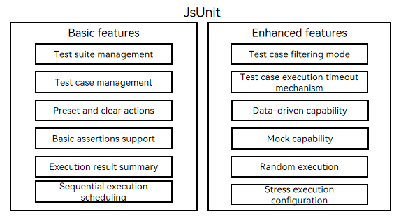
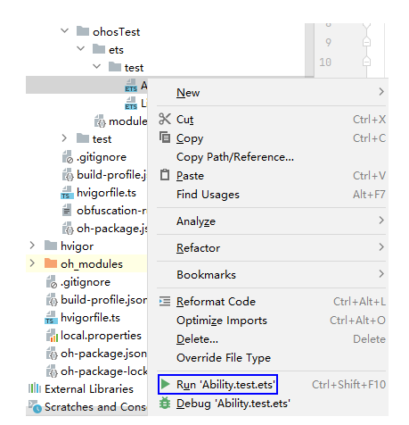

# JsUnit User Guide

<!--Kit: Test Kit-->
<!--Subsystem: Test-->
<!--Owner: @inter515-->
<!--Designer: @inter515-->
<!--Tester: @laonie666-->
<!--Adviser: @Brilliantry_Rui-->

## Overview

JsUnit is the foundation of the automated test framework. It provides capabilities such as identifying, scheduling, executing, and summarizing test scripts. You can call the UITest and PerfTest APIs to write test cases.<br>
This topic describes the main features, implementation principles, and development procedure of JsUnit.


## Capabilities

JsUnit supports the following features.
|   Feature    | Description                                                    |
|  -------- | ------------------------------------------------------------ |
|  [Basic process](#basic-process)| Allows you to identify and schedule test cases and executes test cases asynchronously.                                |
|  [Assertion](#assertion)  | Allows you to check whether the actual value of a test case is the same as the expected value.                        |
|  [Mock](#mock)| Allows you to mock functions and modify the function behavior to return a specified value or perform a specified operation.|
|  [Data-driven capability](#data-driven-capability)| Allows you to reuse a test script with different input data.|
|  [Special capability](#running-test-scripts-in-the-cli)| Allows you to filter test suites and cases, execute test cases randomly, perform pressure tests, set timeout, and stop or skip the execution upon an error.|

  **Figure 1 Main features of JsUnit**

  


## Release Mode
JsUnit is released as an ohpm package. For details about the version information, see [Hypium](https://ohpm.openharmony.cn/#/en/detail/@ohos%2Fhypium). After downloading DevEco Studio, you can configure the version number in the **devDependencies** node in the [oh-package.json5](https://developer.huawei.com/consumer/en/doc/harmonyos-guides/ide-oh-package-json5) file of the application project to use the features of the corresponding version.

**Configuration Example**
```json
"devDependencies": {
    "@ohos/hypium": "1.0.24"
  }
```

## Writing and Executing Test Scripts in ArkTS

### Environment Setup

Download [DevEco Studio](https://developer.huawei.com/consumer/en/download/) and complete <!--RP1-->[hdc configuration](../dfx/hdc.md)<!--RP1End-->.

### Creating a Test Script

Create an ArkTS test case by referring to [Creating an ArkTS Test Case](https://developer.huawei.com/consumer/en/doc/harmonyos-guides/ide-instrument-test#section36049271219).

### Writing a Unit Test Script

A test script must contain the following basic elements:

1. Dependencies that provide JSUnit and other test APIs.
2. Test code about the logic of the test case.
3. Assertion APIs for setting checkpoints in test code to verify that test cases meet expectations.

The following test example shows how to check whether the tested page is displayed as expected.

```ts
import { describe, it, expect, Level, Size, TestType } from '@ohos/hypium';
import { abilityDelegatorRegistry } from '@kit.TestKit';
import { UIAbility, Want } from '@kit.AbilityKit';

const delegator = abilityDelegatorRegistry.getAbilityDelegator();
function sleep(time: number) {
  return new Promise<void>((resolve: Function) => setTimeout(resolve, time));
}
export default function abilityTest() {
  describe('ActsAbilityTest', () =>{
  // The test suite name is ActsAbilityTest.
    // You can filter test cases based on the type, size, and level.
    it('testExample',TestType.FUNCTION | Size.MEDIUMTEST | Level.LEVEL1, async (done: Function) => {
    // The test case name is testExample.
      console.info("unitTest: TestExample begin");
      await sleep(500);
      const bundleName = abilityDelegatorRegistry.getArguments().bundleName;
      // Start the ability to be tested.
      const want: Want = {
        bundleName: bundleName,
        abilityName: 'EntryAbility'
      }
      await delegator.startAbility(want);
      await sleep(500);
      // Obtain the page displayed in the foreground on the device and assert the check.
      const ability: UIAbility = await delegator.getCurrentTopAbility();
      console.info("get top ability");
      expect(ability.context.abilityInfo.name).assertEqual('EntryAbility');
      done();
    })
  })
}
```
### Running Test Scripts in DevEco Studio

Connect the target device (for example, a mobile phone) to DevEco Studio and click the corresponding button on the DevEco Studio page to run the test script. Currently, the following modes are supported:

1. Test package level: All test cases in the test package are executed.
2. Test class level: All test cases in the *.ets file are executed.
3. Test suite level: All test cases defined in the **describe** API are executed.
4. Test case level: The specified **it** API, that is, a single test case, is executed.

The following shows how to run a test script in test class level. For details about other modes, see [Performing Local Tests in Running Mode](https://developer.huawei.com/consumer/en/doc/harmonyos-guides/ide-instrument-test#section1574003717165).



* Checking the test result

After the test is complete, you can check the test result in DevEco Studio.


* Viewing the test case coverage

After the test case is complete, you can check the test case coverage. For details, see [Performing Instrument Tests with Code Coverage](https://developer.huawei.com/consumer/en/doc/harmonyos-guides/ide-instrument-test#section1989615417457).

### Running Test Scripts in the CLI

Before running the script, install the application test package on the test device and run the **aa test** command in the CLI.

* aa test Commands

The following lists the common commands used in the unit test. For details about other **aa test** commands, see <!--RP2-->[Ability Assistant](../tools/aa-tool.md)<!--RP2End-->.

| Parameter | Description                         | Example                      |
| ------------- |  -------------------------------------- | ---------------------------------- |
| --bundleName/-b  | Bundle name of the target application.                      | - b com.test.example               |
| --packageName/-p | Module name of the application, which applies to applications developed in the FA model.          | - p com.test.example.entry         |
| --moduleName/-m  | Module name of the application, which applies to applications developed in the stage model.       | -m entry                           |
| -s            |  \<key, value> pair, which allows you to configure multiple case execution modes. The following table describes the **-s** parameters.| - s unittest /ets/testrunner/OpenHarmonyTestRunner |


| Parameter    | Description                                            | Example                             |
| ------------ | -----------------------------------------------------------------------------     | ----------------------------------------- |
| unittest     | OpenHarmonyTestRunner object used for case execution, which can be **OpenHarmonyTestRunner** or a custom runner name.                 | -s unittest OpenHarmonyTestRunner        |
| class        | Test suite or test case to be executed. The value can be **describeName** or **describeName#itName**, where **describeName** indicates the test suite name and **itName** indicates the test case name.| -s class attributeTest#testAttributeIt    |
| notClass     | Test suite or test case that does not need to be executed. The value can be **describeName** or **describeName#itName**, where **describeName** indicates the test suite name and **itName** indicates the test case name.| -s notClass attributeTest#testAttributeIt |
| itName       |Test case to be executed. The value is **itName**.                             | -s itName testAttributeIt                 |
| timeout      | Timeout interval for executing a test case. The value is a positive integer, in milliseconds. The default value is **5000**.                     | -s timeout 15000                          |
| breakOnError | Whether to stop the test upon a case failure. The value can be **true** (stop) or **false** (continue). The default value is **false**.<br> **Note**: This parameter is supported since @ohos/hypium 1.0.6.| -s breakOnError true                      |
| random | Whether to execute test cases in random order.  The value can be **true** (random order) or **false** (not random order). The default value is **false**.<br> **Note**: This parameter is supported since @ohos/hypium 1.0.3. | -s random true                      |
| testType     | Type of the test case to be executed. The value can be **function**, **performance**, **power**, **reliability**, **security**, **global**, **compatibility**, **user**, **standard**, **safety** or **resilience**.| -s testType function                      |
| level        | Level of the test case to be executed. The value can be **0**, **1**, **2**, **3**, or **4**.                                             | -s level 0                                |
| size         | Scale of the test case to be executed. The value can be **small**, **medium**, or **large**.                                       | -s size small        |
| stress       | Stress execution mode, which specifies the number of times that a test case is executed. The value is a positive integer.<br> **Note**: This parameter is supported since @ohos/hypium 1.0.5.                 | -s stress 1000                            |
| skipMessage       | Whether to skip the information about the skipped test suites and test cases. The value can be **true** (not display related information) or **false** (display related information). The default value is **false**.<br>**Note**: This parameter is supported since @ohos/hypium 1.0.17.| -s skipMessage true                            |
| runSkipped       | Skip execution mode, which specifies the test suites and test cases to be skipped. The value can be **all**, **skipped**, or **describeName#itName**.<br>**Note**: This parameter is supported since @ohos/hypium 1.0.17.| -s runSkipped all                            |

* Running test scripts

> **NOTE**<br>
>
> The following parameter settings and command examples are based on the stage model.
>
> You need to run the command parameters based on the @ohos/hypium version, and the test application package must integrate this version. Otherwise, the command parameters cannot be responded. For details, see [Release Mode](#release-mode). 


Example 1: Execute all test cases.

```shell  
 hdc shell aa test -b xxx -m xxx -s unittest OpenHarmonyTestRunner
```

Example 2: Execute cases in the specified test suites, separated by commas (,).

```shell  
  hdc shell aa test -b xxx -m xxx -s unittest OpenHarmonyTestRunner -s class s1,s2
```

Example 3: Execute specified cases in the specified test suites, separated by commas (,).

```shell  
  hdc shell aa test -b xxx -m xxx -s unittest OpenHarmonyTestRunner -s class testStop#stop_1,testStop1#stop_0
```

Example 4: Execute all test cases except the specified ones, separated by commas (,).

```shell  
  hdc shell aa test -b xxx -m xxx -s unittest OpenHarmonyTestRunner -s notClass testStop
```

Example 5: Execute specified test cases, separated by commas (,).

```shell  
  hdc shell aa test -b xxx -m xxx -s unittest OpenHarmonyTestRunner -s itName stop_0
```

Example 6: Set the timeout interval for executing a test case.

```shell  
  hdc shell aa test -b xxx -m xxx -s unittest OpenHarmonyTestRunner -s timeout 15000
```

Example 7: Execute test cases in **breakOnError** mode.

```shell  
  hdc shell aa test -b xxx -m xxx -s unittest OpenHarmonyTestRunner -s breakOnError true
```

Example 8: Execute test cases of the specified type.

```shell  
  hdc shell aa test -b xxx -m xxx -s unittest OpenHarmonyTestRunner -s testType function
```

Example 9: Execute test cases at the specified level.

```shell  
  hdc shell aa test -b xxx -m xxx -s unittest OpenHarmonyTestRunner -s level 0
```

Example 10: Execute test cases with the specified size.

```shell  
  hdc shell aa test -b xxx -m xxx -s unittest OpenHarmonyTestRunner -s size small
```

Example 11: Execute test cases for a specified number of times.

```shell  
  hdc shell aa test -b xxx -m xxx -s unittest OpenHarmonyTestRunner -s stress 1000
```

* Checking the test result

1. During the test execution in the CLI, the framework prints the following log information:
    ```
    OHOS_REPORT_STATUS: class=ActsAbilityTest
    OHOS_REPORT_STATUS: current=1
    OHOS_REPORT_STATUS: id=JS
    OHOS_REPORT_STATUS: numtests=447
    OHOS_REPORT_STATUS: stream=
    OHOS_REPORT_STATUS: test=testExample
    OHOS_REPORT_STATUS_CODE: 1

    OHOS_REPORT_STATUS: class=ActsAbilityTest
    OHOS_REPORT_STATUS: current=1
    OHOS_REPORT_STATUS: id=JS
    OHOS_REPORT_STATUS: numtests=447
    OHOS_REPORT_STATUS: stream=
    OHOS_REPORT_STATUS: test=testExample
    OHOS_REPORT_STATUS_CODE: 0
    OHOS_REPORT_STATUS: consuming=4
    ```
    | Log Field              | Description      |
    | -------           | -------------------------|
    | OHOS_REPORT_SUM    | Total number of test cases in the current test suite.|
    | OHOS_REPORT_STATUS: class | Name of the test suite to which the current test case belongs.|
    | OHOS_REPORT_STATUS: id | Execution language of the current case. The default value is JS. |
    | OHOS_REPORT_STATUS: numtests | Total number of test cases in the current test package.|
    | OHOS_REPORT_STATUS: stream | Error information of the current test case.|
    | OHOS_REPORT_STATUS: test| Name of the current test case.|
    | OHOS_REPORT_STATUS_CODE | Execution result of the current test case. **0**: pass.<br>**1**: error.<br>**2**: fail.|
    | OHOS_REPORT_STATUS: consuming | Time spent in executing the current test case, in milliseconds.|
2. After the command execution is complete, the framework prints the following log information:
    ```
    OHOS_REPORT_RESULT: stream=Tests run: 447, Failure: 0, Error: 1, Pass: 201, Ignore: 245
    OHOS_REPORT_CODE: 0

    OHOS_REPORT_RESULT: breakOnError model, Stopping whole test suite if one specific test case failed or error
    OHOS_REPORT_STATUS: taskconsuming=16029
    ```
    | Log Field              | Description          |
    | ------------------| -------------------------|
    | run    | Total number of test cases in the current test package.|
    | Failure | Number of failed test cases.|
    | Error | Number of test cases whose execution encounters errors. |
    | Pass | Number of passed test cases.|
    | Ignore | Number of test cases not executed.|
    | taskconsuming| Total time spent in executing the current test case, in milliseconds.|

    > **NOTE**
    >
    > If the execution is stopped upon an error, check the **Ignore** field and the error message.

## Using JSUnit Capabilities 
### Basic Process
JSUnit provides the basic process APIs required for executing test scripts. You need to implement related APIs for JSUnit to identify test cases, schedule and execute test cases, and summarize test results. Currently, the following basic process APIs are supported.
| Name              | Description                                                                  |
| ----------------- |------------------------------------------------------------------------|
|  describe          | Defines a test suite. Multiple test case functions can be defined in a test suite, but asynchronous functions are not supported.                     |
|  it          | Defines a test case.         |
|  beforeAll         | Presets an action, which is performed only once before all test cases of the test suite start.                       |
|  beforeEach        | Presets an action, which is performed before each test case of the test suite starts. The number of execution times is the same as the number of test cases defined by **it**.         |
|  afterEach         | Presets a clear action, which is performed after each unit test case ends. The number of execution times is the same as the number of test cases defined by **it**.         |
|  afterAll          | Presets a clear action, which is performed only once after all test cases of the test suite ends.                       |
|  beforeItSpecified | Presets an action, which is performed only before the specified unit test case starts.<br>**Note**: This API is supported since @ohos/hypium 1.0.15.|
|  afterItSpecified  | Presets a clear action, which is performed only after the specified unit test case ends.<br>**Note**: This API is supported since @ohos/hypium 1.0.15.|
|  expect            | Defines a variety of assertion capabilities, which are used to declare expected Boolean conditions.                       |
|  xdescribe    | Defines a skipped test suite. Multiple test case functions can be defined in a test suite, but asynchronous functions are not supported.<br>**Note**: This API is supported since @ohos/hypium 1.0.17.                            |
|  xit                | Defines a skipped test case.<br>**Note**: This API is supported since @ohos/hypium 1.0.17.                    |


**Example 1**: Execute **beforeAll**, **beforeEach**, **afterEach**, and **afterAll**.

```ts
import { describe, beforeAll, beforeEach, afterEach, afterAll, it, expect, Level } from '@ohos/hypium';

export default function exampleTest() {
  
  describe('ExampleTest', () =>{
    let testNumA : number = 1;
    let testNumB : number = 1;
    
    beforeAll(() => {
      testNumA++;
    })
  
    beforeEach(() => {
      testNumA++;
      testNumB++;
    })
 
    afterEach(() => {
      testNumA++;
    })
  
    afterAll(() => {
      expect(testNumA).assertEqual(5);
    })
     
    it('testExampleA',Level.LEVEL1, async (done: Function) => {
      console.info("unitTest: testExampleA begin");
      expect(testNumA).assertEqual(3);
      expect(testNumB).assertEqual(2);
      done();
    })

    it('testExampleB',Level.LEVEL1, async (done: Function) => {
      console.info("unitTest: testExampleB begin");
      expect(testNumA).assertEqual(5);
      expect(testNumB).assertEqual(3);
      done();
    })
  })
}
```
**Example 2**: Execute **beforeItSpecified** and **afterItSpecified**, which are supported since @ohos/hypium 1.0.15.
```ts
import { describe, beforeItSpecified, afterItSpecified, it, expect, Level } from '@ohos/hypium';

export default function exampleTest() {
    
  describe('ExampleTest', () =>{
   let testNumA : number = 1;
   let testNumB : number = 1;

   beforeItSpecified(['testExampleB'], () => {
      testNumB++;
    })
   afterItSpecified(['testExampleA'], () => {
      testNumA++;
    })
      
    it('testExampleA',Level.LEVEL1, async (done: Function) => {
      console.info("unitTest: testExampleA begin");
      expect(testNumA).assertEqual(1);
      expect(testNumB).assertEqual(1);
      done();
    })

    it('testExampleB',Level.LEVEL1, async (done: Function) => {
      console.info("unitTest: testExampleB begin");
      expect(testNumA).assertEqual(2);
      expect(testNumB).assertEqual(2);
      done();
    })
  })
}
```
**Example 3**: Execute **xit**, which is supported since @ohos/hypium 1.0.17.

```ts
import { describe, xit, it, Level } from '@ohos/hypium';

export default function describeExampleTest() {
  
  describe('ExampleTest', () =>{
    xit('testExampleA',Level.LEVEL1, async (done: Function) => {
      console.info("unitTest: testExampleA begin");
      done();
    })

    it('testExampleB',Level.LEVEL1, async (done: Function) => {
      console.info("unitTest: testExampleB begin");
      done();
    })
  })
}
```

### Assertion
JSUnit provides various assertion APIs for different test scenarios. For details, see the following table.
| Name               | Description                                                       |
| :------------------|-------------------------------------------------------------|
|  assertClose        | Checks whether the difference between the actual value and the expected value is within the specified allowed error range.        |
|  assertContain      | Checks whether the actual value contains the expected value.                             |
|  assertEqual        | Checks whether the actual value is equal to the expected value.                           |
|  assertFail         | Throws an error.                                                    |
|  assertFalse        | Checks whether the actual value is **false**.                                     |
|  assertTrue         | Checks whether the actual value is **true**.                                      |
|  assertInstanceOf   | Checks whether the actual value is of the expected type. Basic types are supported.                      |
|  assertLarger       | Checks whether the actual value is greater than the expected value.                              |
|  assertLargerOrEqual       | Checks whether the actual value is greater than or equal to the expected value.                            |
|  assertLess         | Checks whether the actual value is less than the expected value.                              |
|  assertLessOrEqual         | Checks whether the actual value is less than or equal to the expected value.                            |
|  assertNull         | Checks whether the actual value is **null**.                                      |
|  assertThrowError   | Checks whether the type of the error thrown by the actual value is as expected.                     |
|  assertUndefined    | Checks whether the actual value is **undefined**.                                 |
|  assertNaN          |  Checks whether the actual value is **NaN**.<br> **Note**: This API is supported since @ohos/hypium 1.0.4.                     |
|  assertNegUnlimited | Checks whether the actual value is equal to **Number.NEGATIVE_INFINITY**.<br> **Note**: This API is supported since @ohos/hypium 1.0.4.   |
|  assertPosUnlimited | Checks whether the actual value is equal to **Number.POSITIVE_INFINITY**.<br> **Note**: This API is supported since @ohos/hypium 1.0.4.    |
|  assertDeepEquals   | Checks whether the actual value is equal to the expected value.<br> **Note**: This API is supported since @ohos/hypium 1.0.4.              |
|  assertPromiseIsPending | Checks whether the promise is in the pending state.<br>**Note**: This API is supported since @ohos/hypium 1.0.4.                        |
|  assertPromiseIsRejected | Checks whether the promise is in the rejected state.<br>**Note**: This API is supported since @ohos/hypium 1.0.4.                       |
|  assertPromiseIsRejectedWith | Checks whether the promise is in the rejected state and compares the execution result.<br>**Note**: This API is supported since @ohos/hypium 1.0.4.            |
|  assertPromiseIsRejectedWithError |  Checks whether the promise is in the rejected state and contains an exception, and compares the exception type and exception information.<br>**Note**: This API is supported since @ohos/hypium 1.0.4.|
|  assertPromiseIsResolved | Checks whether the promise is in the resolved state.<br>**Note**: This API is supported since @ohos/hypium 1.0.4.                       |
|  assertPromiseIsResolvedWith |Checks whether the promise is in the resolved state and compares the result value.<br> **Note**: This API is supported since @ohos/hypium 1.0.4.           |
|  not                | Negates any of the above assertions.<br>**Note**: This API is supported since @ohos/hypium 1.0.4.          |

**Sample Code**
```ts
import { describe, it, expect, Level } from '@ohos/hypium';

export default function exampleTest() {
  describe('ExampleTest', () =>{
    it('assertCloseTest', Level.LEVEL1, () => {
      let a: number = 100;
      let b: number = 0.1;
      expect(a).assertClose(99, b);
    })

    it('assertContain_1', Level.LEVEL1, () => {
      let a = "abc";
      expect(a).assertContain('b');
    })

    it('assertContain_2', Level.LEVEL1, () => {
      let a = [1, 2, 3];
      expect(a).assertContain(1);
    })

    it('assertEqualTest', Level.LEVEL1, () => {
      expect(3).assertEqual(3);
    })

    it('assertFailTest', Level.LEVEL1, () => {
      expect().assertFail(); // The test case fails.
    })

    it('assertFalseTest', Level.LEVEL1, () => {
      expect(false).assertFalse();
    })

    it('assertTrueTest', Level.LEVEL1, () => {
      expect(true).assertTrue();
    })

    it('assertInstanceOfTest', Level.LEVEL1, () => {
      let a: string = 'strTest';
      expect(a).assertInstanceOf('String');
    })

    it('assertLargerTest', Level.LEVEL1, () => {
      expect(3).assertLarger(2);
    })

    it('assertLessTest', Level.LEVEL1, () => {
      expect(2).assertLess(3);
    })

    it('assertNullTest', Level.LEVEL1, () => {
      expect(null).assertNull();
    })

    it('assertThrowErrorTest', Level.LEVEL1, () => {
      expect(() => {
        throw new Error('test');
      }).assertThrowError('test');
    })

    it('assertUndefinedTest', Level.LEVEL1, () => {
      expect(undefined).assertUndefined();
    })

    it('assertLargerOrEqualTest', Level.LEVEL1, () => {
      expect(3).assertLargerOrEqual(3);
    })

    it('assertLessOrEqualTest', Level.LEVEL1, () => {
      expect(3).assertLessOrEqual(3);
    })

    it('assertNaNTest', Level.LEVEL1, () => {
      expect(Number.NaN).assertNaN(); // true
    })

    it('assertNegUnlimitedTest', Level.LEVEL1, () => {
      expect(Number.NEGATIVE_INFINITY).assertNegUnlimited(); // true
    })

    it('assertPosUnlimitedTest', Level.LEVEL1, () => {
      expect(Number.POSITIVE_INFINITY).assertPosUnlimited(); // true
    })

    it('deepEquals_null_true', Level.LEVEL1, () => {
      expect(null).assertDeepEquals(null);
    })

    it('deepEquals_array_not_have_true', Level.LEVEL1, () => {
      const a: Array<number> = [];
      const b: Array<number> = [];
      expect(a).assertDeepEquals(b);
    })

    it('deepEquals_map_equal_length_success', Level.LEVEL1, () => {
      const a: Map<number, number> = new Map();
      const b: Map<number, number> = new Map();
      a.set(1, 100);
      a.set(2, 200);
      b.set(1, 100);
      b.set(2, 200);
      expect(a).assertDeepEquals(b);
    })

    it("deepEquals_obj_success_1", Level.LEVEL1, () => {
      const a: SampleTest = {x: 1};
      const b: SampleTest = {x: 1};
      expect(a).assertDeepEquals(b);
    })

    it("deepEquals_regExp_success_0", Level.LEVEL1, () => {
      const a: RegExp = new RegExp("/test/");
      const b: RegExp = new RegExp("/test/");
      expect(a).assertDeepEquals(b);
    })

    it('assertPromiseIsPendingTest', Level.LEVEL1, async () => {
      let p: Promise<void> = new Promise<void>(() => {});
      await expect(p).assertPromiseIsPending();
    })

    it('assertPromiseIsRejectedTest', Level.LEVEL1, async () => {
      let info: PromiseInfo = {res: "no"};
      let p: Promise<PromiseInfo> = Promise.reject(info);
      await expect(p).assertPromiseIsRejected();
    })

    it('assertPromiseIsRejectedWithTest', Level.LEVEL1, async () => {
      let info: PromiseInfo = {res: "reject value"};
      let p: Promise<PromiseInfo> = Promise.reject(info);
      await expect(p).assertPromiseIsRejectedWith(info);
    })

    it('assertPromiseIsRejectedWithErrorTest', Level.LEVEL1, async () => {
      let p1: Promise<TypeError> = Promise.reject(new TypeError('number'));
      await expect(p1).assertPromiseIsRejectedWithError(TypeError);
    })
    
    it('assertPromiseIsResolvedTest', Level.LEVEL1, async () => {
      let info: PromiseInfo = {res: "result value"};
      let p: Promise<PromiseInfo> = Promise.resolve(info);
      await expect(p).assertPromiseIsResolved();
    })

    it('assertPromiseIsResolvedWithTest', Level.LEVEL1, async () => {
      let info: PromiseInfo = {res: "result value"};
      let p: Promise<PromiseInfo> = Promise.resolve(info);
      await expect(p).assertPromiseIsResolvedWith(info);
    })

    it("test_message", Level.LEVEL1, () => {
      expect(1).message('1 is not equal 2!').assertEqual(2); // fail
    })
  })
}

interface SampleTest {
  x: number;
}

interface PromiseInfo {
  res: string;
}
```
### Mock
Since@ohos/hypium 1.0.1, JSUnit supports the mock capability. For details about the configuration method, see [Release Mode](#release-mode).

> **NOTE**
>
>Only custom objects in application projects can be mocked. System API objects cannot be mocked. For details about how to mock system APIs, see [Mocking System Modules or External Dependency Modules](https://developer.huawei.com/consumer/en/doc/harmonyos-guides/ide-test-mock#section8353132513310).
>
>Private functions of objects cannot be mocked.

**Mockit**

Mockit is used to specify the instances and functions to be mocked.
| Name| Description                |
| --- |-------------------------------------------------------------------------------------------------------------------------------------------------|
| mockFunc| Mocks a function in a class instance. Asynchronous functions are supported.                                                |
| verify | Verifies whether a function and its parameters are executed as expected. This API returns a **VerificationMode** class.|
| ignoreMock | Restores the mocked function in the instance. This API is valid for mocked functions.                                                                                                  |
| clear | Restores the mocked object instance after the test case is complete (restores the original features of the object).                                                                      |
| clearAll | Clears all data and memory after the test cases are complete. The mocked function in the instance is not restored.                                 |  

**VerificationMode**

**VerificationMode** is used to verify the number of times that the mocked function is called. It must be used together with the **verify** function.
| Name| Description                                                                                                                                        |
| --- |-------------------------------------------------------------------------------------------------------------------------------------------------|
| times | Verifies whether the number of times that the function is called is as expected.                                                                                                                                 |
| once | Verifies whether the function is called once.                                                                                                                                     |
| atLeast | Verifies whether the minimum number of times that the function is called is as expected.                                                                                                                               |
| atMost | Verifies whether the maximum number of times that the function is called is as expected.                                                                                                                              |
| never | Verifies whether the function is never called.                                                                                                                               |

**when**

**when** is a function used to set the expected value of the function to be mocked.
| Name| Description                                                                                                                                           |
| --- |-------------------------------------------------------------------------------------------------------------------------------------------------|
| when | Checks whether the passed-in function is mocked and marked. This API returns a built-in function, which then returns a class for setting the mock value after execution.                                                                                                          |

After the **when** function is executed, you need to use the following functions to set the return value of the mocked function.
| Name| Description                                                                                                                                           |
| --- |-------------------------------------------------------------------------------------------------------------------------------------------------|
| afterReturn | Sets an expected return value, for example, a string or promise.                                                                                                         |
| afterReturnNothing| Sets the expected return value to **undefined**, that is, no value will be returned.                                                                                                                         |
| afterAction | Sets the expected return value to be an action executed by a function.                                                                                                                               |
| afterThrow | Sets an exception to throw and the error description.                                                                                                                             |

**ArgumentMatchers**

**ArgumentMatchers** provides enums and functions for customizing function parameters. You can use it to set an expected return value based on a rule.
| Enum| Description                          |
| --- |-------------------------------------------------------------------------------------------------------------------------------------------------|
| any | Returns the expected value if a parameter of any type (except **undefined** and **null**) is passed in. **ArgumentMatchers.any** must be used.                                                                          |
| anyString | Returns the expected value if a string is passed in. This API must be called by **ArgumentMatchers.anyString**.                                                                                     |
| anyBoolean | Returns the expected value if a Boolean value is passed in. This API must be called by **ArgumentMatchers.anyBoolean**.                                                                              |
| anyFunction | Returns the expected value if a function is passed in. This API must be called by **ArgumentMatchers.anyFunction**.                                                                            |
| anyNumber | Returns the expected value if a number is passed in. This API must be called by **ArgumentMatchers.anyNumber**.                                                                                    |
| anyObj | Returns the expected value if an object is passed in. This API must be called by **ArgumentMatchers.anyObj**.

| API| Description   |
| --- |--------------|                                           
| matchRegexs | Returns the expected value if a parameter that matches the regular expression is passed in. This API must be called by **ArgumentMatchers.matchRegexs(Regex)**.


> **NOTE**
>To use the mock capability, you must import the mock capability modules such as **MockKit** and **when**. You can import the modules as required.
>
>For example, `import { describe, expect, it, MockKit, when} from '@ohos/hypium'`.

**Example 1**: Use **afterReturn** and **afterReturnNothing** to set the expected return value.

```ts
import { describe, expect, it, MockKit, when } from '@ohos/hypium';

class ClassName {
  constructor() {
  }

  method_1(arg: string) {
    return '888888';
  }

  method_2(arg: string) {
    return '999999';
  }
}
export default function afterReturnTest() {
  describe('afterReturnTest', () => {
    it('afterReturnTest', 0, () => {
      console.info("it1 begin");
      // Create a MockKit object.
      let mocker: MockKit = new MockKit();
      // Initialize the ClassName object claser as the instance of the object to be mocked.
      let claser: ClassName = new ClassName();
      // Mock method_1 of the ClassName class.
      let mockfunc: Function = mocker.mockFunc(claser, claser.method_1);
      // It is expected that, after the claser.method_1 function is mocked, the result '1' is returned when the function is called with 'testA' passed in, and the result undefined is returned when the function is called with 'testB' passed in.
      when(mockfunc)('testA').afterReturn('1');
      when(mockfunc)('testB').afterReturnNothing();
      // Assert the mocked function to check whether the expected result is returned. If the function is called with 'testA' passed in, 1 should be returned. If called with 'testB' passed in, undefined should be returned.
      expect(claser.method_1('testA')).assertEqual('1'); // The assertion is successful.
      expect(claser.method_1('testB')).assertUndefined(); // The assertion is successful.
    })
  })
}
```

**Example 2**: Use **ArgumentMatchers** to set the parameter type to **any** (except **undefined** and **null**).

```ts
import { describe, expect, it, MockKit, when, ArgumentMatchers } from '@ohos/hypium';

class ClassName {
  constructor() {
  }

  method_1(arg: string) {
    return '888888';
  }

  method_2(arg: string) {
    return '999999';
  }
}
export default function argumentMatchersAnyTest() {
  describe('argumentMatchersAnyTest', () => {
    it('testMockfunc', 0, () => {
      console.info("it1 begin");
      // Create a MockKit object.
      let mocker: MockKit = new MockKit();
      // Initialize the ClassName object claser.
      let claser: ClassName = new ClassName();
      // Mock method_1 of the ClassName class.
      let mockfunc: Function = mocker.mockFunc(claser, claser.method_1);
      // It is expected that, after the claser.method_1 function is mocked, '1' is returned when the function is called with any parameter type.
      when(mockfunc)(ArgumentMatchers.any).afterReturn('1');
      // Pass different parameters to check whether the expected result is returned.
      expect(claser.method_1('test')).assertEqual('1'); // The assertion is successful.
      expect(claser.method_1("123")).assertEqual('1');// The assertion is successful.
      expect(claser.method_1("true")).assertEqual('1');// The assertion is successful.
    })
  })
}
```

**Example 3**: Use **ArgumentMatchers** to set the parameter type to **String**.

```ts
import { describe, expect, it, MockKit, when, ArgumentMatchers } from '@ohos/hypium';

class ClassName {
  constructor() {
  }

  method_1(arg: string) {
    return '888888';
  }

  method_2(arg: string) {
    return '999999';
  }
}
export default function argumentMatchersTest() {
  describe('argumentMatchersTest', () => {
    it('testMockfunc', 0, () => {
      console.info("it1 begin");
      // Create a MockKit object.
      let mocker: MockKit = new MockKit();
      // Initialize the ClassName object claser.
      let claser: ClassName = new ClassName();
      // Mock method_1 of the ClassName class.
      let mockfunc: Function = mocker.mockFunc(claser, claser.method_1);
      // It is expected that, after the claser.method_1 function is mocked, '1' is returned when the function is called with any string type.
      when(mockfunc)(ArgumentMatchers.anyString).afterReturn('1');
      // Pass different string parameters to check whether the expected result is returned.
      expect(claser.method_1('test')).assertEqual('1'); // The assertion is successful.
      expect(claser.method_1('abc')).assertEqual('1'); // The assertion is successful.
    })
  })
}
```

**Example 4**: Use **ArgumentMatchers** to set the parameter type to **matchRegexs (Regex)**.

```ts
import { describe, expect, it, MockKit, when, ArgumentMatchers } from '@ohos/hypium';

class ClassName {
  constructor() {
  }

  method_1(arg: string) {
    return '888888';
  }

  method_2(arg: string) {
    return '999999';
  }
}
export default function matchRegexsTest() {
  describe('matchRegexsTest', () => {
    it('testMockfunc', 0, () => {
      console.info("it1 begin");
      // Create a MockKit object.
      let mocker: MockKit = new MockKit();
      // Initialize the ClassName object claser.
      let claser: ClassName = new ClassName();
      // Mock method_1 of the ClassName class.
      let mockfunc: Function = mocker.mockFunc(claser, claser.method_1);
      // It is expected that, after the claser.method_1 function is mocked, '1' is returned when the function is called with "test" passed in.
      when(mockfunc)(ArgumentMatchers.matchRegexs(new RegExp("test"))).afterReturn('1');
      // Pass the test parameter and check whether the expected result is returned.
      expect(claser.method_1('test')).assertEqual('1'); // The assertion is successful.
    })
  })
}
```

**Example 5**: Use the **verify** function to verify whether the execution behavior of the mocked function is as expected.

```ts
import { describe, it, MockKit } from '@ohos/hypium';

class ClassName {
  constructor() {
  }

  method_1(...arg: string[]) {
    return '888888';
  }

  method_2(...arg: string[]) {
    return '999999';
  }
}
export default function verifyTest() {
  describe('verifyTest', () => {
    it('testMockfunc', 0, () => {
      console.info("it1 begin");
      // Create a MockKit object.
      let mocker: MockKit = new MockKit();
      // Initialize the ClassName object claser.
      let claser: ClassName = new ClassName();
      // Mock method_1 and method_2 of the ClassName class.
      mocker.mockFunc(claser, claser.method_1);
      mocker.mockFunc(claser, claser.method_2);
      // Call the functions.
      claser.method_1('abc', 'ppp');
      claser.method_1('abc');
      claser.method_1('xyz');
      claser.method_1();
      claser.method_1('abc', 'xxx', 'yyy');
      claser.method_1();
      claser.method_2('111');
      claser.method_2('111', '222');
      // Verify that method_2 is executed only once when the parameter is '111'.
      mocker.verify('method_2',['111']).once(); // The assertion is successful.
    })
  })
}
```

**Example 6**: Use the **ignoreMock** function to restore the implementation of a specified mocked function.

```ts
import { describe, expect, it, MockKit, when, ArgumentMatchers } from '@ohos/hypium';

class ClassName {
  constructor() {
  }

  method_1(...arg: number[]) {
    return '888888';
  }

  method_2(...arg: number[]) {
    return '999999';
  }
}
export default function ignoreMockTest() {
  describe('ignoreMockTest', () => {
    it('testMockfunc', 0, () => {
      console.info("it1 begin");
      // Create a MockKit object.
      let mocker: MockKit = new MockKit();
      // Initialize the ClassName object claser.
      let claser: ClassName = new ClassName();
      // Mock method_1 and method_2 of the ClassName class.
      let func_1: Function = mocker.mockFunc(claser, claser.method_1);
      let func_2: Function = mocker.mockFunc(claser, claser.method_2);
      // It is expected that, after the claser.method_1 function is mocked, '4' is returned when the function is called with the number parameter passed in.
      when(func_1)(ArgumentMatchers.anyNumber).afterReturn('4');
      // It is expected that, after the claser.method_2 function is mocked, '5' is returned when the function is called with the number parameter passed in.
      when(func_2)(ArgumentMatchers.anyNumber).afterReturn('5');
      // Call the functions.
      expect(claser.method_1(123)).assertEqual("4");
      expect(claser.method_2(456)).assertEqual("5");
      // Restore method_1.
      mocker.ignoreMock(claser, claser.method_1);
      // Call the claser.method_1 function.
      expect(claser.method_1(123)).assertEqual('888888');// The assertion is successful.
    })
  })
}
```

**Example 7**: Use the **clear** function to restore the original implementation of all mocked functions in the class.

```ts
import { describe, expect, it, MockKit, when, ArgumentMatchers } from '@ohos/hypium';

class ClassName {
  constructor() {
  }

  method_1(...arg: number[]) {
    return '888888';
  }

  method_2(...arg: number[]) {
    return '999999';
  }
}
export default function clearTest() {
  describe('clearTest', () => {
    it('testMockfunc', 0, () => {
      console.info("it1 begin");
      // Create a MockKit object.
      let mocker: MockKit = new MockKit();
      // Initialize the ClassName object claser.
      let claser: ClassName = new ClassName();
      // Mock method_1 and method_2 of the ClassName class.
      let func_1: Function = mocker.mockFunc(claser, claser.method_1);
      let func_2: Function = mocker.mockFunc(claser, claser.method_2);
      // It is expected that, after the claser.method_1 function is mocked, '4' is returned when the function is called with the number parameter passed in.
      when(func_1)(ArgumentMatchers.anyNumber).afterReturn('4');
      // It is expected that, after the claser.method_2 function is mocked, '5' is returned when the function is called with the number parameter passed in.
      when(func_2)(ArgumentMatchers.anyNumber).afterReturn('5');
      // Call the functions.
      expect(claser.method_1(123)).assertEqual('4');
      expect(claser.method_2(123)).assertEqual('5');
      // Restore all mock capabilities of the object.
      mocker.clear(claser);
      // Call the claser.method_1 and claser.method_2 functions and test the result.
      expect(claser.method_1(123)).assertEqual('888888');// The assertion is successful.
      expect(claser.method_2(123)).assertEqual('999999');// The assertion is successful.
    })
  })
}
```

**Example 8**: Use the afterThrow function to throw a specified exception.

```ts
import { describe, expect, it, MockKit, when } from '@ohos/hypium';

class ClassName {
  constructor() {
  }

  method_1(arg: string) {
    return '888888';
  }
}
export default function afterThrowTest() {
  describe('afterThrowTest', () => {
    it('testMockfunc', 0, () => {
      console.info("it1 begin");
      // Create a MockKit object.
      let mocker: MockKit = new MockKit();
      // Initialize the ClassName object claser.
      let claser: ClassName = new ClassName();
      // Mock method_1 of the ClassName class.
      let mockfunc: Function = mocker.mockFunc(claser, claser.method_1);
      // It is expected that, after the claser.method_1 function is mocked, error xxx is thrown when the function is called with the test parameter passed in.
      when(mockfunc)('test').afterThrow('error xxx');
      // Execute the mocked function, capture the exception, and use assertEqual() to check whether message meets the expectation.
      try {
        claser.method_1('test');
      } catch (e) {
        expect(e).assertEqual('error xxx'); // The assertion is successful.
      }
    })
  })
}
```

**Example 9**: Mock a promise object.

```ts
import { describe, expect, it, MockKit, when } from '@ohos/hypium';

class ClassName {
  constructor() {
  }

  async method_1(arg: string) {
    return new Promise<string>((resolve: Function, reject: Function) => {
      setTimeout(() => {
        console.log('Execute');
        resolve('Pass data');
      }, 2000);
    });
  }
}
export default function mockPromiseTest() {
  describe('mockPromiseTest', () => {
    it('testMockfunc', 0, async (done: Function) => {
      console.info("it1 begin");
      // Create a MockKit object.
      let mocker: MockKit = new MockKit();
      // Initialize the ClassName object claser.
      let claser: ClassName = new ClassName();
      // Mock method_1 of the ClassName class.
      let mockfunc: Function = mocker.mockFunc(claser, claser.method_1);
      // It is expected that, after the claser.method_1 function is mocked, a Promise object will be returned when the function is called with test as the parameter.
      when(mockfunc)('test').afterReturn(new Promise<string>((resolve: Function, reject: Function) => {
        console.log("do something");
        resolve('success something');
      }));
      // Execute the mocked function, that is, execute the defined promise.
      let result = await claser.method_1('test');
      expect(result).assertEqual("success something");// The assertion is successful.
      done();
    })
  })
}
```

**Example 10**: Use the **times** and **atLeast** functions to verify the number of times that the mocked function is called.

```ts
import { describe, it, MockKit, when } from '@ohos/hypium'

class ClassName {
  constructor() {
  }

  method_1(...arg: string[]) {
    return '888888';
  }
}
export default function verifyTimesTest() {
  describe('verifyTimesTest', () => {
    it('test_verify_times', 0, () => {
      // Create a MockKit object.
      let mocker: MockKit = new MockKit();
      // Initialize the ClassName object claser.
      let claser: ClassName = new ClassName();
      // Mock method_1 of the ClassName class.
      let func_1: Function = mocker.mockFunc(claser, claser.method_1);
      // It is expected that '4' is returned after the function is mocked.
      when(func_1)('123').afterReturn('4');
      // Call the functions.
      claser.method_1('123', 'ppp');
      claser.method_1('abc');
      claser.method_1('xyz');
      claser.method_1();
      claser.method_1('abc', 'xxx', 'yyy');
      claser.method_1('abc');
      claser.method_1();
      // Check whether method_1 with the parameter of 'abc' was executed twice.
      mocker.verify('method_1', ['abc']).times(2);// The assertion is successful.
       // Check whether method_1 with an empty value was executed at least twice.
      mocker.verify('method_1', []).atLeast(2);// The assertion is successful.
    })
  })
}
```

**Example 11**: Mock static functions. (This feature is supported since @ohos/hypium 1.0.16.)

```ts
import { describe, it, expect, MockKit, when, ArgumentMatchers } from '@ohos/hypium';

class ClassName {
  constructor() {
  }

  static method_1() {
    return 'ClassName_method_1_call';
  }
}

export default function staticTest() {
  describe('staticTest', () => {
    it('staticTest_001', 0, () => {
      let really_result = ClassName.method_1();
      expect(really_result).assertEqual('ClassName_method_1_call');
      // Create a MockKit object.
      let mocker: MockKit = new MockKit();
      // Mock method_1 of the ClassName object.
      let func_1: Function = mocker.mockFunc(ClassName, ClassName.method_1);
      // It is expected that 'ock_data' is returned after the function is mocked.
      when(func_1)(ArgumentMatchers.any).afterReturn('mock_data');
      let mock_result = ClassName.method_1();
      expect(mock_result).assertEqual('mock_data');// The assertion is successful.
      // Clear the mock capability.
      mocker.clear(ClassName);
      let really_result1 = ClassName.method_1();
      expect(really_result1).assertEqual('ClassName_method_1_call');// The assertion is successful.
    })
  })
}
```

### Data-driven Capability

Since [@ohos/hypium 1.0.2](https://ohpm.openharmony.cn/#/en/detail/@ohos%2Fhypium), JSUnit supports the data-driven capability. You can reuse test case code, configure input data and expected result data in the data configuration file, and obtain data in the test case for implementation and assertion processing, reducing redundant test code.

The data-driven capability can drive the number of times that test cases are executed and the parameters passed-in each time based on the **data.json** file, which contains the following content:

>**NOTE**
>
> The **data.json** file and the **.test.js** or **.test.ets** file of the test case are in the same directory.
>
> The parameter configuration name in the **data.json** file must be the same as that defined in the test case.

```json
{
  "suites": [{
    "describe": ["AbilityTest"],
    "stress": 2,
    "params": {
      "suiteParams1": "suiteParams001",
      "suiteParams2": "suiteParams002"
    },
    "items": [{
      "it": "testDataDriverAsync",
      "stress": 2,
      "params": [{
        "name": "tom",
        "value": 5
      }, {
        "name": "jerry",
        "value": 4
      }]
    }, {
      "it": "testDataDriver",
      "stress": 3
    }]
  }]
}
```

Configuration parameters

| Item| Description                                 | Mandatory|
| :--------- | :------------------------------------ | ---- |
|  "suite"    | Test suite configuration.                        | Yes  |
|  "describe"    | Test suite name.                      | Yes  |
|  "items" | Test case.                        | Yes  |
|  "it"       | Test case name.                      | Yes  |
|  "params"   | Parameters to be passed to the test suite or test case.| No  |
|  "stress"   | Number of times that the test suite or test case is executed.    | No  |

**Sample Code**

In the stage model, import **data.json** to the **TestAbility.ets** file in the **TestAbility** directory of the test project (import **data.json** to the **app.js** or **app.ets** file in the **TestAbility** directory of the test project in the FA model), and set the parameter data before the **Hypium.hypiumTest()** function. The following is an example:

```ts
import { abilityDelegatorRegistry } from '@kit.TestKit';
import { Hypium } from '@ohos/hypium';
import testsuite from '../test/List.test';// Import the test suite file.
import data from '../test/data.json';// Import the parameter data file.

...
let abilityDelegator = abilityDelegatorRegistry.getAbilityDelegator();
let abilityDelegatorArguments = abilityDelegatorRegistry.getArguments();
Hypium.setData(data);// Set the parameter data.
Hypium.hypiumTest(abilityDelegator, abilityDelegatorArguments, testsuite);
...
```

```ts
 import { describe, it } from '@ohos/hypium';

 export default function abilityTest() {
  describe('AbilityTest', () => {
    it('testDataDriverAsync', 0, async (done: Function, data: ParmObj) => {
      console.info('name: ' + data.name);
      console.info('value: ' + data.value);
      done();
    });

    it('testDataDriver', 0, () => {
      console.info('stress test');
    })
  })
}
 interface ParmObj {
   name: string,
   value: string
 }
```
>**NOTE**
>
>To use the data-driven capability for passing in parameters, pass the **done** and **data** parameters in the **func** of **it**, and their sequence cannot be changed. If the capability is not needed, you can pass no parameter or only the **done** parameter in **func**.

### Special Capability
Special capability allows you to configure the script execution, which can be specified execution, pressure execution, and random execution. For details, see [Running Test Scripts in the CLI](#running-test-scripts-in-the-cli).

## FAQs

What should I do if added logs are printed after the case result?

**Symptom**

The logs added to the test case are displayed after the test case completes, rather than during the test case execution.

**Possible Causes**

The test case calls an asynchronous API. To ensure that logs are correctly captured during the execution, all logs in the test case must be printed before the test case execution is complete.

**Solution**

If more than two asynchronous APIs are called, you are advised to encapsulate the API calling into a promise.

What should I do if a timeout error is reported during case execution?

**Symptom**

After the test case execution is complete, the console displays the error message "execute time XXms", indicating that the case execution times out.

**Possible Causes**

1. The **done** function is not called when the asynchronous API is executed; consequently, the case cannot complete normally and times out.
2. The time taken for API call is longer than the timeout interval (5000 ms by default) set for test case execution.
3. The assertion fails and throws an exception when the case calls the function. As a result, the case execution times out and ends. 

**Solution**

1. Check the case code logic and ensure that the **done** function can be called when the assertion fails.
2. Modify the case execution timeout settings under **Run/Debug Configurations** in DevEco Studio.
3. Check the test case code logic to ensure that the assertion is successful.
