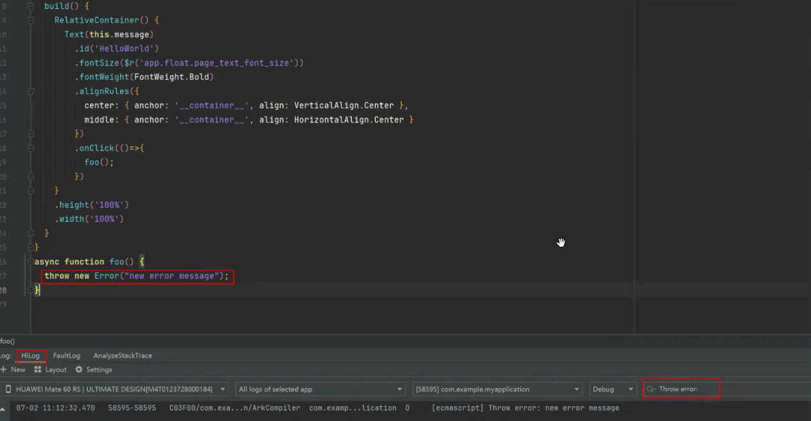

# ArkTS Runtime FAQs
<!--Kit: ArkTS-->
<!--Subsystem: ArkCompiler-->
<!--Owner: @DaiHuina1997-->
<!--Designer: @yao_dashuai-->
<!--Tester: @kirl75; @zsw_zhushiwei-->
<!--Adviser: @foryourself-->

## Unexpected Outputs in Regular Expressions

Regular expressions may produce unexpected results in the following scenarios.

### Inconsistent \b Handling

```ts
let str = "\u2642";
let res = str.replace(/\b/g, "/");
console.info("res = " + res);
// Expected output: res = ♂
// Actual output: res = /♂/
```

Workaround: None.
> **NOTE**
> 
> When regular expressions match \b (word boundaries), certain non-ASCII characters are incorrectly treated as ASCII characters, causing non-word boundaries to be mistakenly identified as word boundaries.

### Unexpected Output with Lookaheads ((?=pattern) or (?!pattern)) Nested in Lookbehinds ((?<=pattern) or (?<!pattern))

```ts
console.info(`res:${"abcdef".match(/(?<=ab(?=c)cd)ef/)}`);
// Expected output: res:ef
// Actual output: res:null
```

Workaround: Replace /(?<=ab(?=c)cd)ef/ with /(?<=abcd)ef/.

### Inconsistent Case Handling

```ts
let res = /\u{10400}/ui.test("\u{10428}");
console.info("res = " + res);
// Expected output: res = true
// Actual output: res = false
```

Workaround: None.

### Unexpected Output of lastIndex in /()/ug

```ts
let L = "\ud800";
let T = "\udc00";
let u = /()/ug;
u.lastIndex = 1;
u.exec(L + T + L + T);
console.info("u.lastIndex = " + u.lastIndex);
// Expected output: u.lastIndex = 0
// Actual output: u.lastIndex = 1
```

Workaround: None.

### Unexpected Output of '-' in []

```ts
let str =  "a-b";
let reg = /[+-\s]/;
console.info("reg.exec(str) = " + reg.exec(str));
// Expected output: reg.exec(str) = -
// Actual output: reg.exec(str) = null
```

Workaround: Use the escaped hyphen (-).
```ts
let str =  "a-b";
let reg = /[+\-\s]/;
console.info("reg.exec(str) = " + reg.exec(str));
```

### Unexpected Output of Named Capture Groups

```ts
let reg = new RegExp("(a)(?<b>b)");
let res = reg.exec("ab");
console.info("JSON.stringify(res?.groups) = " + JSON.stringify(res?.groups));
// Expected output: JSON.stringify(res?.groups) = {"b":"b"}
// Actual output: JSON.stringify(res?.groups) = {"b":"a"}
```

Workaround: Calculate the position of the named capture group to retrieve its matched content.

```ts
let reg = new RegExp("(a)(?<b>b)");
let res = reg.exec("ab") as Array<string>;
console.info("JSON.stringify(res?.groups) = {\"b\":" + JSON.stringify(res[2]) + "}");
```

### Unexpected Output with '|' Preceded by Empty Match

When regular expression matching is used, if the character before '|' is empty, the matching after '|' fails.

```ts
let reg = /a(?:|x)$/;
let res = reg.exec("ax");
console.info("JSON.stringify(res) = " + JSON.stringify(res));
// Expected output: JSON.stringify(res) = ["ax"]
// Actual output: JSON.stringify(res) = null
```

Workaround: Replace reg1 with reg2 or reg3.

```ts
let reg1 = /a(?:|x)$/;
let reg2 = /a(?:x)?$/;
let reg3 = /a(?:x){0,1}$/;
```

### Unexpected Floating-point Conversion Result in TypedArray.prototype.map Callback After Inline Cache Optimization

```ts
for(let i = 0; i < 1000; i++) {} // Trigger inline cache optimization.

let arr = new Int32Array([1, 2, 3, 4, 5]);
let result = arr.map(val => {
   let res = (Math.pow(val, 1)) * 100;
   return res;
})

console.info("result[0]:", result[0]);
// Expected output: result[0]:100
// Actual output: result[0]:104
```

Workaround: Convert the TypedArray to a plain array using **Array.from** before processing the numbers.

```ts
let arr = new Int32Array([1, 2, 3, 4, 5]);

let normalArr = Array.from(arr);
let result = normalArr.map(val => {
   let res = (Math.pow(val, 1)) * 100;
   return res;
});

console.info("result[0]:", result[0]);
// Output: result[0]:100
```

### Unexpected Parsing Result of Denormalized Floating-point Numbers in Number.parseFloat

The **parseFloat** API does not support parsing denormalized numbers.  The parseFloat API does not support parsing denormalized numbers. If the input string represents a denormalized floating-point number, the output is 0.

```ts
console.info("testcase: ", parseFloat("5e-324"));
// Expected output: testcase: 5e-324
// Actual output: testcase: 0
```

Workaround: None. You should avoid using the **parseFloat** API to parse denormalized numbers.

### Unexpected Parsing Result of Multi-dimensional Array Arguments in the Set Constructor

```ts
const arr1: number[] = [1, 2];
const arr2: number[] = [3, 4];
const set = new Set<number[]>([arr1, arr2]);
console.info("res: ", JSON.stringify(Array.from(set)));
// Expected output: res: [[1,2],[3,4]]
// Actual output: res: [2,4]
```

Workaround: None. You should avoid using multi-dimensional arrays as arguments when constructing a Set.

### Unexpected Parsing Results of Uint8Array and Uint16Array in Object.entries

```ts
// test1.js
const typedArr = new Uint8Array([10, 20, 30]);
try {
   const result = Object.entries(typedArr);
   console.info("no error throw");
} catch(e) {
   console.info(e);
}
// Expected output: no error throw
// Actual output: RangeError: object entries is not supported IsJSUint8Array or IsJSUint16Array

// test2.js
const typedArr = new Uint16Array([10, 20, 30]);
try {
   const result = Object.entries(typedArr);
   console.info("no error throw");
} catch(e) {
   console.info(e);
}
// Expected output: no error throw
// Actual output: RangeError: object entries is not supported IsJSUint8Array or IsJSUint16Array
```

Workaround: Use **Array.from** to convert TypedArray to a plain array, and then use **Object.entries**.

```ts
// test1.js
const typedArr = new Uint8Array([10, 20, 30]);
try {
   const normalArr1 = Array.from(typedArr);
   const result = Object.entries(normalArr1);
   console.info("no error throw");
} catch(e) {
   console.info(e);
}
// Output: no error throw
```

### Unexpected Output of `replace` with an Empty String as the First Parameter

When the **replace** API is used, if the first parameter is an empty string, the original string is returned.

```ts
let str = "dddd"
let res = str.replace("", "abc");
console.info("res = " + res);
// Expected output: res = abcdddd
// Actual output: res = dddd
```

Workaround: Use the regular expression `/^/` to indicate the start of the string as the first parameter.

```ts
let str = "dddd"
let res = str.replace(/^/, "abc");
```

## Exception Handling in Async Functions

**Scenario**

In ArkTS, uncaught exceptions within the **Async** function do not terminate the process. This occurs because the function returns a rejected Promise that remains unhandled, converting the internal exception into an **unhandledRejection** that is not actually thrown.

**How to Capture Exceptions**

1. Use [errorManager.on()](../reference/apis-ability-kit/js-apis-app-ability-errorManager.md#errormanageronerror) to capture the **unhandledrejection** event generated by the **Async** function, and handle the exception via the callback function registered with **errorManager.on()**.

   ```ts
   errorManager.on("unhandledRejection", (a:ESObject, b:Promise<ESObject>) => {
      console.info("Async test", a);
   })
   ```

2. Within the **Async** function, add the **try-catch** logic to code blocks that may throw exceptions to directly catch potential errors.

> **NOTE**
> 
> The **try-catch** logic must be implemented within the **Async** function. Exceptions arising internally cannot be caught from outside; they can only be listened for via **errorManager.on()**.


**How to Check Exceptions**

To check whether an exception occurs inside the **Async** function, run the following hilog command in DevEco Studio to enable debug-level log printing:

```shell
   hilog -b D
```

Click the lower **HiLog** tab and enter the filter criteria **Throw error:** to view the exception information.



## Array.flatMap() Issues

When the **Array.flatMap()** API is used to process an array that contains proxies, the nested proxy array is not flattened correctly, resulting in unexpected return values.

### ArkTS Scenario

```ts
let arr1 = [0, 1];
let arr2 = [2, 3];
const emptyHandler = new Object() as ProxyHandler<number[]>;
let proxy1 = new Proxy(arr1, emptyHandler);
let proxy2 = new Proxy(arr2, emptyHandler);
let arr3 = [proxy1, proxy2];
let res = arr3.flatMap(x => x);

console.info("res length:", res.length.toString());
// Expected output: res length: 4
// Actual output: res length: 2
console.info("res[0] is: ", res[0].toString());
// Expected output: res[0] is: 0
// Actual output: res[0] is: 0,1
```

### ArkUI Scenario

The ArkUI state management framework adds a proxy to arrays decorated with state variable decorators (such as @State, @Trace, and @Local) to observe changes caused by API calls. If state decorators are used with arrays and **Array.flatMap** is called, the following problem occurs.

Take state management V2 as an example:

```ts
@Entry
@ComponentV2
struct Index {
   @Local p: number[] = [0, 1];
   @Local q: number[] = [2, 3];
   c: number[][] = [this.p, this.q];
   d: number[] = [];

   aboutToAppear(): void {
      this.d = this.c.flatMap(it => it);
   }

   build() {
      Column() {
         Text(`${this.d[0]}`); // Expected output: 0; Actual output: 0,1
      }
   }
}
```

### Workaround

Avoid using the **Array.flatMap()** API. Instead, call **Array.map()** and then call the **Array.flat()** API with the depth of 1. The preceding ArkTS scenario is used as an example:

```ts
// Before workaround
let res = arr3.flatMap(x => x);
// After workaround
let res = arr3.map(x => x).flat();
```

### Proxy Handler Key Type Mismatch with ECMAScript Specification

In the **handler** function of the **Proxy** object, ArkTS retains the number type of the key. However, according to the EcmaScript specifications, the key should be converted to the string type.

```ts
{
  let handler:ESObject = {
    get(target: ESObject, key: ESObject): ESObject {
      console.info("get", key, typeof key);
      return Reflect.get(target, key);
    },
    set(target: ESObject, key: ESObject, value: ESObject): ESObject {
      console.info("set", key, typeof key);
      return Reflect.set(target, key, value);
    },
    deleteProperty(target: ESObject, key: ESObject):ESObject {
      console.info("delete", key, typeof key);
      return Reflect.deleteProperty(target, key);
    },
    has(target: ESObject, key: ESObject):ESObject {
      console.info("has", key, typeof key);
      return Reflect.has(target, key);
    }
  }
  let obj: ESObject = {};
  let px: ESObject = new Proxy(obj, handler);
  px[1];
  // Actual output: get 1 number
  px[2] = 2;
  // Actual output: set 2 number
  3 in px;
  // Actual output: has 3 number
  delete px[2];
  // Actual output: delete 2 number
}

```
Workaround: If the service logic depends on that the key must be of the string type, explicitly convert the key of the numeric type in the **handler** function. Example:

```ts
{
  let handler:ESObject = {
    get(target:ESObject,key:ESObject):ESObject {
      if (typeof key === "number") {
        key = String(key);
      }
      console.info("get",key,typeof key);
      return Reflect.get(target,key);

    },
    set(target:ESObject,key:ESObject,value:ESObject):ESObject {
      if (typeof key === "number") {
        key = String(key);
      }
      console.info("set",key,typeof key);
      return Reflect.set(target,key,value);
    },
    deleteProperty(target:ESObject,key:ESObject):ESObject {
      if (typeof key === "number") {
        key = String(key);
      }
      console.info("delete",key,typeof key);
      return Reflect.deleteProperty(target,key);
    },
    has(target:ESObject,key:ESObject) {
      if (typeof key === "number") {
        key = String(key);
      }
      console.info("has",key,typeof key);
      return Reflect.has(target,key);
    }
  }
  let obj:ESObject = {};
  let px:ESObject = new Proxy(obj,handler);
  px[1];
  // Actual output: get 1 string
  px[2] = 2;
  // Actual output: set 2 string
  3 in px;
  // Actual output: has 3 string
  delete px[2];
  // Actual output: delete 2 string
}
```

> **NOTE**
>
> Some syntaxes in the preceding demo, such as **3 in px**, **delete px[2]**, and **Reflect.deleteProperty**, are unavailable in .ets files.
