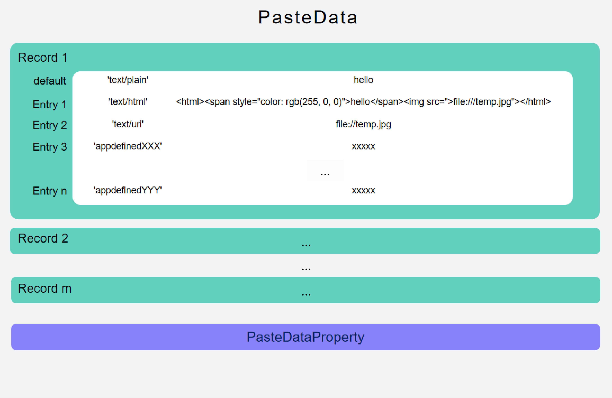

# Using the Pasteboard to Copy and Paste
<!--Kit: Basic Services Kit-->
<!--Subsystem: MiscServices-->
<!--Owner: @yangxiaodong41-->
<!--Designer: @guo867-->
<!--Tester: @maxiaorong-->
<!--Adviser: @fang-jinxu-->

## When to Use

The [pasteboard](../../reference/apis-basic-services-kit/js-apis-pasteboard.md) allows you to copy and paste data. For example, you can copy text content and paste it to Notepad, or copy a photo from Gallery and paste it to Files.

## Constraints

- The pasteboard content, including system service metadata and application settings, has a maximum size of 128 MB by default. For PCs/2-in-1 devices, the maximum size can be changed through system settings, with a valid range from 128 MB to 2 GB.
- To ensure the accuracy of the pasteboard data, only one copy can be performed at a time.
- In API version 12 and later, [permission control](get-pastedata-permission-guidelines.md) is added to the pasteboard reading API to enhance user privacy protection.

## Pasteboard Access Principles

- The pasteboard enables data copy and paste across applications as well as the sharing of copied or cut data either within a single application or between multiple applications. By default, the pasteboard supports data in common formats, such as the text, HTML rich text, file URI, and PixelMap, as well as custom extended data.

- **PasteData** defines pasteboard data. Applications write **PasteData** to the pasteboard service to copy data and read **PasteData** from the pasteboard service to paste data. The following figure shows the overall structure of **PasteData**.



- **Record** corresponds to different content segments of the copied data.<br>
- **Entry** corresponds to different formats of the same data.<br>
- **pasteDataProperty** defines the properties of the data in the pasteboard, including the timestamp, data type, pasteable range, and additional data.

To ensure that applications have the same understanding of the pasteboard data and better implement copy and paste experience between different applications, you can adapt applications to the pasteboard based on the following principles:

**Writing data to the pasteboard during a copy operation**

- The copied data is carried by only one record. Different formats of the copied data are carried by different entries of the same record.<br>
- If a record cannot carry all data, for example, multiple URIs exist during multi-file copy, multiple records are used to carry different parts of the copied data.<br>
- An application writes all supported pasteboard data formats to the pasteboard to ensure that the copied data can be pasted in all possible scenarios.

**Reading data from the pasteboard during a paste operation**

- Pasteboard data is personal data. The pasteboard provides security components and the ohos.permission.READ_PASTEBOARD permission granted by the user for applications to read the pasteboard data.<br>
- The data written by the application to the pasteboard may be in multiple formats, so the applications need to select the most appropriate format based on the current page and scenario to paste the data.

-The pasteboard also provides TS APIs and NDK APIs. Applications can select appropriate APIs as required to support the copy and paste functionality.

## Using Basic Data Types for Copy and Paste

Currently, the following basic data types are supported for copy and paste: text, HTML, URI, Want, and pixel map. The data types supported by ArkTS APIs are different from those supported by NDK APIs. You need to match the data types with the corresponding APIs during usage.

You are advised to use the solution discussed here to implement the copy and paste function for new applications.

### Mapping between ArkTS and NDK Data Types
| ArkTS| NDK                                                                                                                                       |
| -------- |----------------------------------------------------------------------------------------------------------------------------------------|
| MIMETYPE_PIXELMAP : "pixelMap" | UDMF_META_OPENHARMONY_PIXEL_MAP : "openharmony.pixel-map" |
| MIMETYPE_TEXT_HTML : "text/html" | UDMF_META_HTML : "general.html" |
| MIMETYPE_TEXT_PLAIN : "text/plain" | UDMF_META_PLAIN_TEXT : "general.plain-text" |
| MIMETYPE_TEXT_URI : "text/uri" | UDMF_META_GENERAL_FILE_URI : "general.file-uri" |
| MIMETYPE_TEXT_WANT : "text/want" | Not supported.|

The ArkTS data type corresponds to the pasteboard type. For details, see [ohos.pasteboard](../../reference/apis-basic-services-kit/js-apis-pasteboard.md). The NDK data type corresponds to the unified data management framework. For details, see [UDMF](../../reference/apis-arkdata/capi-udmf.md).

### Available APIs

For details about the APIs, see [API Reference](../../reference/apis-basic-services-kit/js-apis-pasteboard.md#getdata9).

After obtaining URI data using the **getData** API, use the [fs.copy](../../reference/apis-core-file-kit/js-apis-file-fs.md#fscopy11) API of File Manager to obtain the file.

| Name| Description                                                                                                                                       |
| -------- |----------------------------------------------------------------------------------------------------------------------------------------|
| setData(data: PasteData, callback: AsyncCallback&lt;void&gt;): void | Writes a **PasteData** object to the pasteboard. This API uses an asynchronous callback to return the result.|
| setData(data: PasteData): Promise&lt;void&gt; | Writes a **PasteData** object to the pasteboard. This API uses a promise to return the result.|
| getData( callback: AsyncCallback&lt;PasteData&gt;): void | Reads a **PasteData** object from the pasteboard. This API uses an asynchronous callback to return the result.|
| getData(): Promise&lt;PasteData&gt; | Reads a **PasteData** object from the pasteboard. This API uses a promise to return the result.|
| getDataSync(): PasteData | Reads a **PasteData** object from the pasteboard. This API returns the result synchronously and cannot be called in the same thread as **SetData**.|

### Example

<!-- @[pasteboard_usedata](https://gitcode.com/openharmony/applications_app_samples/blob/master/code/DocsSample/pasteboard/pasteboard_arkts_sample/entry/src/main/ets/pages/PasteboardModel.ets) -->

``` TypeScript
import { BusinessError, pasteboard } from '@kit.BasicServicesKit';
import { hilog } from '@kit.PerformanceAnalysisKit';
// ...
const systemPasteboard: pasteboard.SystemPasteboard = pasteboard.getSystemPasteboard();
// ...
  export async function setPlainData(content: string): Promise<void> {
    let pasteData = pasteboard.createData(pasteboard.MIMETYPE_TEXT_PLAIN, content);
    await systemPasteboard.setData(pasteData);
  }
  export async function getPlainData(): Promise<string> {
    // Read data from the system pasteboard.
    let data = await systemPasteboard.getData();
    // Obtain the number of records from the pasteboard.
    let recordCount = data.getRecordCount();
    // Obtain the corresponding record information from the pasteboard data.
    let result = '';
    for (let i = 0; i < recordCount; i++) {
      let record = data.getRecord(i).toPlainText();
      hilog.info(0xFF00, '[Sample_pasteboard]', 'Get data success, record:' + record);
      result += record;
    }
    return result;
  }
```


## Using Unified Data Objects for Copy and Paste

To facilitate data interactions between the pasteboard and other applications and reduce the workload of data type adaptation, the pasteboard supports a unified data object for copying and pasting. For details about the unified data object, see [Unified Data Channel](../../reference/apis-arkdata/js-apis-data-unifiedDataChannel.md).

Currently, the following basic data types are supported for copy and paste: text and HTML. The data types supported by ArkTS APIs are different from those supported by NDK APIs. You need to properly use the data types that correspond to the specific APIs.

### Available APIs

For details about the APIs, see [API Reference](../../reference/apis-basic-services-kit/js-apis-pasteboard.md#getunifieddata12).

| Name| Description                                                                                                  |
| -------- |---------------------------------------------------------------------------------------------------|
| setUnifiedData(data: udc.UnifiedData): Promise\<void\> | Writes the data of a unified data object to the system pasteboard.                  |
| setUnifiedDataSync(data: udc.UnifiedData): void | Writes the data of a unified data object to the system pasteboard. This API returns the result synchronously.         |
| getUnifiedData(): Promise\<udc.UnifiedData\> | Reads the data of a unified data object from the system pasteboard.                          |
| getUnifiedDataSync(): udc.UnifiedData | Reads the data of a unified data object from the system pasteboard. This API returns the result synchronously.                 |

### Example

<!-- @[pasteboard_useudc](https://gitcode.com/openharmony/applications_app_samples/blob/master/code/DocsSample/pasteboard/pasteboard_arkts_sample/entry/src/main/ets/pages/PasteboardModel.ets) -->

``` TypeScript
import { BusinessError, pasteboard } from '@kit.BasicServicesKit';
import { hilog } from '@kit.PerformanceAnalysisKit';
import { unifiedDataChannel, uniformDataStruct, uniformTypeDescriptor } from '@kit.ArkData';
const systemPasteboard: pasteboard.SystemPasteboard = pasteboard.getSystemPasteboard();
// ...
  // 1. Construct a PlainText data object.
  export async function handleUniformData() {
    let plainText: uniformDataStruct.PlainText = {
      uniformDataType: uniformTypeDescriptor.UniformDataType.PLAIN_TEXT,
      textContent: 'PLAINTEXT_CONTENT',
      abstract: 'PLAINTEXT_ABSTRACT',
    }

    let record = new unifiedDataChannel.UnifiedRecord(uniformTypeDescriptor.UniformDataType.PLAIN_TEXT, plainText);
    let data = new unifiedDataChannel.UnifiedData();
    data.addRecord(record);
    // 2. Write a piece of PlainText data to the system pasteboard.
    systemPasteboard.setUnifiedData(data).then((data: void) => {
      hilog.info(0xFF00, '[Sample_pasteboard]', 'Succeeded in setting UnifiedData.');
      // The data is successfully written, which is a normal case.
    }).catch((err: BusinessError) => {
      hilog.error(0xFF00, '[Sample_pasteboard]', 'Failed to set UnifiedData. Cause: ' + err.message);
      // Error case
    });
    // 3. Read the PlainText data from the system pasteboard.
    systemPasteboard.getUnifiedData().then((data) => {
      let records: unifiedDataChannel.UnifiedRecord[] = data.getRecords();
      for (let j = 0; j < records.length; j++) {
        if (records[j].getType() === uniformTypeDescriptor.UniformDataType.PLAIN_TEXT) {
          let text = records[j].getValue() as uniformDataStruct.PlainText;
          hilog.info(0xFF00, '[Sample_pasteboard]', `${j + 1}.${text.textContent}`);
        }
      }
    }).catch((err: BusinessError) => {
      hilog.error(0xFF00, '[Sample_pasteboard]', 'Failed to get UnifiedData. Cause: ' + err.message);
      // Error case
    });
  }
```


<!--RP1-->
<!--RP1End-->
