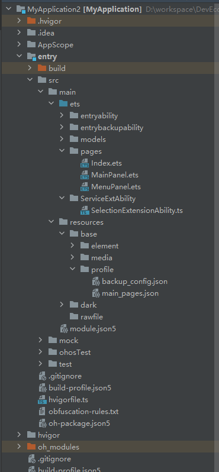

# Developing a Word Selection Extension Ability

<!--Kit: Basic Services Kit-->
<!--Subsystem: SelectionInput-->
<!--Owner: @no86-->
<!--Designer: @mmwwbb-->
<!--Tester: @dong-dongzhen-->
<!--Adviser: @fang-jinxu-->

## Available APIs

| Name| Description|
| ---- | ---- |
| on(type: 'selectionCompleted', callback: Callback\<SelectionInfo\>): void | Subscribes to the word selection completion event. This API uses a callback to return the result.|
| getSelectionContent(): Promise\<string\> | Obtains this selected text content.|
| createPanel(ctx: Context, info: PanelInfo): Promise\<Panel\> | Creates a word selection panel.|
| show(): Promise\<void\> | Shows this word selection panel.|
| hide(): Promise\<void\> | Hides this word selection panel.|
| startMoving(): Promise\<void\> | Moves the word selection panel by dragging.|
| moveTo(x: number, y: number): Promise\<void\> | Moves the word selection panel to the specified coordinates on the screen.|

The preceding APIs are core APIs used in this topic. For details about all APIs of the word selection service, see the API description of [selectionInput.SelectionExtensionAbility](../../reference/apis-basic-services-kit/js-apis-selectionInput-selectionExtensionAbility-sys.md).

## How to Develop

1. Create a project for the word selection application on DevEco Studio.

    1.1 Open [DevEco Studio](https://developer.huawei.com/consumer/en/deveco-studio/), choose **File** > **New** > **Create Project** to create an empty ability, and select **2in1** for the device type.

    1.2 In the **ets** directory of the project, right-click and choose **New** > **Directory** to create two directories named **selectionextability** and **models**.

    1.3 In the **selectionextability** directory, create the **SelectionExtAbility.ets** file. In the **models** directory, create the **SelectionModel.ets** file. In the **pages** directory, create two page files **MainPanel.ets** and **MenuPanel.ets**. The directory structure is as follows:

    ```text
    /src/main/
    ├── ets/
    │   ├── models
    │   |   └── SelectionModel.ets     # Word selection module management class
    │   ├── pages
    │   |   ├── MainPanel.ets                    # Main panel
    │   |   └── MenuPanel.ets                    # Menu panel
    │   └── selectionextability
    │       └── SelectionExtAbility.ets     # Word selection extension class
    ├── resources/base/profile/main_pages.json
    ├── module.json5                             # Configuration file
    ```

    

2. In the **SelectionModel.ets** file, customize the word selection module management class to manage selected content, panel, and other information in a unified manner. In addition, some **get** and **set** APIs are implemented to facilitate information transfer between classes.
    ```ts
    import { selectionManager, SelectionExtensionContext } from '@kit.BasicServicesKit';
    import { hilog } from '@kit.PerformanceAnalysisKit';

    export class SelectionModel {
      private selectionInfo: selectionManager.SelectionInfo | undefined;
      private selectionContent: string | undefined;
      private selectionPanel: selectionManager.Panel | undefined;
      private context: SelectionExtensionContext | undefined;
      private listener: (selectionInfo: selectionManager.SelectionInfo) => void;

      private constructor() {
        this.selectionInfo = undefined;
        this.selectionContent = undefined;
        this.selectionPanel = undefined;
        this.context = undefined;
        this.listener = (selectionInfo: selectionManager.SelectionInfo) => {
          hilog.info(0x0000, 'SelectionModel', `Received selection selectionInfo: ${selectionInfo}`);
        }
      }

      public static getInstance(): SelectionModel {
        if (globalThis.instance == null) {
          globalThis.instance = new SelectionModel();
        }
        return globalThis.instance;
      }

      public getSelectionInfo(): selectionManager.SelectionInfo | undefined {
        return this.selectionInfo;
      }

      public setSelectionInfo(selectionInfo: selectionManager.SelectionInfo) {
        this.selectionInfo = selectionInfo;
      }

      public getSelectionContent(): string | undefined {
        return this.selectionContent;
      }

      public setSelectionContent(selectionContent: string) {
        this.selectionContent = selectionContent;
      }

      public getSelectionPanel(): selectionManager.Panel | undefined {
        return this.selectionPanel;
      }

      public setSelectionPanel(selectionPanel: selectionManager.Panel) {
        this.selectionPanel = selectionPanel;
      }

      public getContext(): SelectionExtensionContext | undefined {
        return this.context;
      }

      public setContext(context: SelectionExtensionContext) {
        this.context = context;
      }

      public registerListener(listener: (selectionInfo: selectionManager.SelectionInfo) => void) {
        this.listener = listener;
      }
    }
    ```

3. Implement the extension ability class in the **SelectionExtAbility.ets** file. This class needs to inherit from [SelectionExtensionAbility](../../reference/apis-basic-services-kit/js-apis-selectionInput-selectionExtensionAbility-sys.md) to manage the lifecycle of the word selection extension.
    ```ts
    import { selectionManager, SelectionExtensionAbility} from '@kit.BasicServicesKit';
    import { Want } from '@kit.AbilityKit';
    import { rpc } from '@kit.IPCKit';

    class SelectionAbilityStub extends rpc.RemoteObject {
      constructor(des: string) {
        super(des);
      }

      onRemoteMessageRequest(
        code: number,
        data: rpc.MessageSequence,
        reply: rpc.MessageSequence,
        options: rpc.MessageOption
      ): boolean | Promise<boolean> {
        return true;
      }
    }

    class SelectionExtAbility extends SelectionExtensionAbility {
      private panel_: selectionManager.Panel | undefined = undefined;

      onConnect(want: Want): rpc.RemoteObject {
        // Called when the SelectionExtensionAbility instance is created. You can execute initialization logic (such as defining variables, loading resources, and listening for word selection events) in this callback.
        return new SelectionAbilityStub('remote');
      }

      onDisconnect(): void {
        // Called when the SelectionExtensionAbility instance is destroyed (for example, when the user disables the word selection feature or switches the word selection application). You can clear resources and save data in this callback.
        selectionManager.destroyPanel(this.panel_);
      }
    }
    ```
    In the preceding code, the [onConnect](../../reference/apis-basic-services-kit/js-apis-selectionInput-selectionExtensionAbility-sys.md#onconnect) callback is triggered when the word selection extension is started. You can listen for word selection events in this callback to create the word selection panel, set the panel content, and move, display, or hide the panel. The [onDisconnect](../../reference/apis-basic-services-kit/js-apis-selectionInput-selectionExtensionAbility-sys.md#ondisconnect) callback is triggered when the word selection extension is disabled. You can destroy the panel in this callback. For details, see step 4 below.


4. When the word selection extension is started, you can create a word selection panel in advance (without calling the [show](../../reference/apis-basic-services-kit/js-apis-selectionInput-selectionManager-sys.md#show) API) to shorten the response delay when the user selects a word for the first time. In addition, you can use [onConnect](../../reference/apis-basic-services-kit/js-apis-selectionInput-selectionExtensionAbility-sys.md#onconnect) to listen for word selection events and perform subsequent panel operations. Note that from API version 22 onwards, the [SelectionInfo](../../reference/apis-basic-services-kit/js-apis-selectionInput-selectionManager-sys.md#selectioninfo) received by listening for [selectionCompleted](../../reference/apis-basic-services-kit/js-apis-selectionInput-selectionManager-sys.md#onselectioncompleted) does not contain the selected content, which can be obtained by calling the [getSelectionContent](../../reference/apis-basic-services-kit/js-apis-selectionInput-selectionManager-sys.md#getselectioncontent22) API.
    <!--code_no_check-->
    ```ts
    import { selectionManager, PanelInfo, PanelType, SelectionExtensionAbility, BusinessError } from '@kit.BasicServicesKit';
    import { SelectionModel } from '../models/SelectionModel';
    import { Want } from '@kit.AbilityKit';
    import { rpc } from '@kit.IPCKit';
    import { hilog } from '@kit.PerformanceAnalysisKit';

    class SelectionAbilityStub extends rpc.RemoteObject {
      // ... 
    }

    class SelectionExtAbility extends SelectionExtensionAbility {
      private panel_: selectionManager.Panel | undefined = undefined;

      onConnect(want: Want): rpc.RemoteObject {
        SelectionModel.getInstance().setContext(this.context);
        selectionManager.on('selectionCompleted', async (info: selectionManager.SelectionInfo) => {
          if (this.panel_ == undefined) {
            await this.createSelectionPanel();
          }
          this.onSelected(info);
        });
        return new SelectionAbilityStub('remote');
      }

      onDisconnect(): void {
        selectionManager.destroyPanel(this.panel_);
      }

      async createSelectionPanel() {
        let panelInfo: PanelInfo = {
          panelType: PanelType.MENU_PANEL,
          x: 0,
          y: 0,
          width: 500,
          height: 300
        }
        try {
          let panel: selectionManager.Panel = await selectionManager.createPanel(this.context, panelInfo);    // Create a menu panel.
          this.panel_ = panel;
          panel.setUiContent('pages/MenuPanel')   // Set the menu panel style.
            .then(() => {
              hilog.info(0x0000, 'SelectionExtensionAbility', 'Succeed to setUiContent [pages/MenuPanel].');
            })
            .catch((error: BusinessError) => {
              hilog.info(0x0000, 'SelectionExtensionAbility', `Failed to setUiContent, error: ${JSON.stringify(error)}`);
              return;
            })
        } catch(error) {
          hilog.info(0x0000, 'SelectionExtensionAbility', `Failed to createPanel, error: ${JSON.stringify(error)}`);
        }
      }

      async onSelected(info: selectionManager.SelectionInfo) {
        SelectionModel.getInstance().setSelectionInfo(info);
        try {
          let content = await selectionManager.getSelectionContent();   // Obtain the selected content.
          SelectionModel.getInstance().setSelectionContent(content);
        } catch (error) {
          console.error(`Failed to get selection content: ${JSON.stringify(error)}`);
        }
        if (!this.panel_) {
          hilog.info(0x0000, 'SelectionExtensionAbility', 'Panel is not created yet.');
          return;
        }
        this.panel_.moveTo(info.startDisplayX, info.startDisplayY)    // Move the panel to the start point of the selected content.
          .then(() => {
            hilog.info(0x0000, 'SelectionExtensionAbility', 'Move succeed.');
          })
          .catch((error: BusinessError) => {
            hilog.info(0x0000, 'SelectionExtensionAbility', `Failed to move, error: ${JSON.stringify(error)}`);
            return;
          });

        await this.panel_.show()    // Show the panel.
          .then(() => {
            hilog.info(0x0000, 'SelectionExtensionAbility', 'Show succeed.');
          })
          .catch((error: BusinessError) => {
            hilog.info(0x0000, 'SelectionExtensionAbility', `Failed to show panel, error: ${JSON.stringify(error)}`);
            return;
          });

        this.panel_.on('hidden ', () => { // Listen for panel hiding (triggered when the panel is out of focus).
          hilog.info(0x0000, 'SelectionExtensionAbility', 'panel has hidden.');
        })
      }
    }
    ```

5. Export the extension ability class at the end of the **SelectionExtAbility.ets** file for other classes in the project to reference.
    ```ts
    export default SelectionExtAbility;
    ```

6. In the **MenuPanel.ets** file, draw a panel based on the service requirements, for example, providing buttons for translation, query, and expansion. Bind the click event to display different main panels to display different content. This example uses only a simple click button to show how to display the main panel.
    <!--code_no_check-->
    ```ts
    import { SelectionModel } from '../models/SelectionModel';
    import { selectionManager, PanelInfo, BusinessError, PanelType, SelectionExtensionContext } from '@kit.BasicServicesKit';
    import { hilog } from '@kit.PerformanceAnalysisKit';
    import Want from '@ohos.app.ability.Want';

    @Entry
    @Component
    struct MenuPanel {
      @State message: string = 'MenuPanel';
      selectionInfo: selectionManager.SelectionInfo | undefined = undefined;

      CreateMainPanel() {
        this.selectionInfo = SelectionModel.getInstance().getSelectionInfo();
        let panelInfo: PanelInfo = {
          panelType: PanelType.MAIN_PANEL,
          x: 0,
          y: 0,
          width: 1500,
          height: 1000
        }
        selectionManager.createPanel(SelectionModel.getInstance().getContext(), panelInfo)
          .then(async (panel: selectionManager.Panel) => {
            SelectionModel.getInstance().setSelectionPanel(panel);
            hilog.info(0x0000, 'SelectionExtensionAbility', 'Succeed to create main panel');
            if (this.selectionInfo !== undefined) {
              panel.moveTo(this.selectionInfo.startDisplayX + 100, this.selectionInfo.startDisplayY + 100);
            }
            try {
              panel.on('destroyed', () => {
                hilog.info(0x0000, 'SelectionExtensionAbility', 'panel has destroyed');
              })
            } catch (error) {
              hilog.info(0x0000, 'SelectionExtensionAbility', 'Failed to listen window destroy');
            }
            panel.setUiContent('pages/MainPanel')
              .then(() => {
                hilog.info(0x0000, 'SelectionExtensionAbility', 'Succeed to setUiContent [pages/MainPanel].');
              })
              .catch((error: BusinessError) => {
                hilog.info(0x0000, 'SelectionExtensionAbility', `Failed to setUiContent of main panel, error: [${JSON.stringify(error)}]`);
                return;
              });

            await panel.show()
              .then(() => {
                hilog.info(0x0000, 'SelectionExtensionAbility', 'Succeed to show main panel.');
              })
              .catch((error: BusinessError) => {
                hilog.info(0x0000, 'SelectionExtensionAbility', `Failed to show main panel, error: [${JSON.stringify(error)}]`);
                return;
              });
          })
          .catch((error: BusinessError) => {
            hilog.info(0x0000, 'SelectionExtensionAbility', `Failed to createPanel, error: [${JSON.stringify(error)}]`);
            return;
          });
      }

      startEntryAbility() {   // Start the application.
        let wantAbility: Want = {
          bundleName: 'com.selection.selectionapplication',   // Bundle name of the application.
          abilityName: 'EntryAbility',    // Ability name of the application.
        };
        let context: SelectionExtensionContext | undefined = SelectionModel.getInstance().getContext();
        if (context !== undefined) {
          context.startAbility(wantAbility)
            .then(() => {
              hilog.info(0x0000, 'SelectionExtensionAbility', `startAbility success, want: ${wantAbility.abilityName}`);
            })
            .catch((error: BusinessError) => {
              hilog.info(0x0000, 'SelectionExtensionAbility', `startAbility failed, error: ${JSON.stringify(error)}`);
            })
        }
      }

      build() {
        Column() {
          Button('click to show MAIN_PANEL')
            .onClick(() => {
              this.CreateMainPanel();
            })
          Button('start EntryAbility')
            .onClick(() => {
              this.startEntryAbility();
            })
        }
        .backgroundColor('#AAFFFF')
        .height('100%')
        .width('100%')
      }
    }
    ```

7. You can display service processing results, such as translation, in the **MainPanel.ets** file. This example shows only a simple functionality for displaying the selected content. You need to implement other service functionalities based on your actual needs.
    <!--code_no_check-->
    ```ts
    import { SelectionModel } from '../models/SelectionModel';
    import selectionManager from '@ohos.selectionInput.selectionManager';
    @Entry
    @Component
    struct MainPanel {
      @State message: string = 'MainPanel';

      aboutToAppear(): void {
        let content: string | undefined = SelectionModel.getInstance().getSelectionContent();
        if (content !== undefined) {
          this.message = content;
        }
      }

      build() {
        RelativeContainer() {
          Text(this.message)
            .id('MainPanelHelloWorld')
            .fontSize(8)
            .alignRules({
              center: { anchor: '__container__', align: VerticalAlign.Center },
              middle: { anchor: '__container__', align: HorizontalAlign.Center }
            })
        }
        .onTouch((event: TouchEvent) => {
          if (event.type === TouchType.Down) {
            let selectionPanel: selectionManager.Panel | undefined = SelectionModel.getInstance().getSelectionPanel();
            if (selectionPanel !== undefined) {
              selectionPanel.startMoving();   // Move the panel with the mouse by calling the startMoving API provided by selectionManager.
            }
          }
        })
        .backgroundColor('#AAA000')
        .height('100%')
        .width('100%')
      }
    }
    ```

8. Configure the **main_pages.json** file.

    Add the new **MainPanel** and **MenuPanel** pages to the **src** field.

    ```json
    "src": [
        // ...
        "pages/MainPanel",
        "pages/MenuPanel"
    ]
    ```

9. Add the extension **"selection"** to the **toolchains\modulecheck\module.json** file of the SDK.

    ```json
    // ...
    "type": {
      "description": "Indicates the type of the extension.",
      "type": "string",
      "enum": [
        // ...
        "selection"   // Add the word selection extension type.
      ]
    }
    // ...
    ```

10. Configure the **module.json5** file.

    Configure the path of the SelectionExtensionAbility file in the **extensionAbilities** field.

    ```json
    {
      "module": {
      // ...
        "extensionAbilities": [
          {
            "name": "SelectionExtAbility",
            "srcEntry": "./ets/selectionextability/SelectionExtAbility.ets",
            "type": "selection",
            "exported": false,
          }
        ]
      }
    }
    ```

11. Set your application as a system application in the debugging phase.

    Change the value of **app-feature** to **hos_system_app** in **toolchains\lib\UnsgnedReleasedProfileTemplate.json** of the SDK.

    ```json
    {
      // ...
      "app-feature": "hos_system_app"   // Change the value from hos_normal_app to hos_system_app.
    }
    ```

12. Sign.

    Click **Project Structure** in the upper right corner of [DevEco Studio](https://developer.huawei.com/consumer/en/deveco-studio/) and click **Signing Configs**. After you log in to your HUAWEI ID, a signature is automatically generated.

## Debugging and Verification

1. Connect to the device and click **Run entry** (the green triangle button) in the upper right corner of [DevEco Studio](https://developer.huawei.com/consumer/en/deveco-studio/). The compiler compiles the code and automatically installs the application on the device.

2. Set system parameters for the word selection service.

    2.1 Choose **Settings** > **System** > **Smart text selection** and turn on the service switch.
    
    2.2 Set the current application as the word selection application.
    
    2.3 Set the service triggering mode to pressing **Ctrl**.

3. Observe the process of starting the word selection extension ability through logs.

    View logs on the HiLog panel in [DevEco Studio](https://developer.huawei.com/consumer/en/deveco-studio/).

4. Observe the display of the menu panel after you double-click, triple-click, or drag the selected text and press **Ctrl**. Click the button on the menu panel and observe the display of the main panel.
