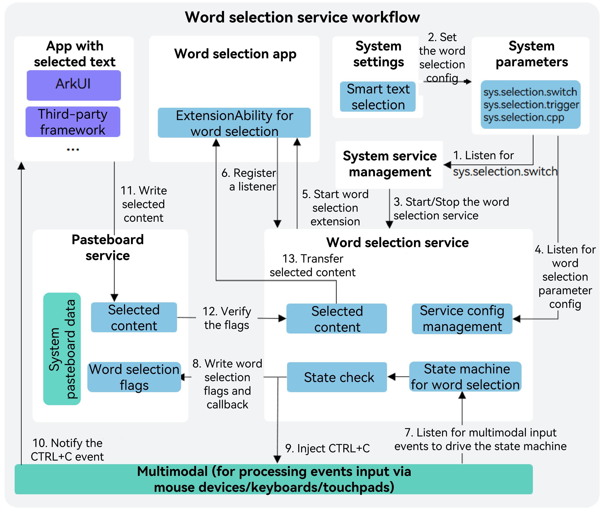

# Overview of Word Selection Service (for System Applications Only)

<!--Kit: Basic Services Kit-->
<!--Subsystem: SelectionInput-->
<!--Owner: @no86-->
<!--Designer: @mmwwbb-->
<!--Tester: @dong-dongzhen-->
<!--Adviser: @fang-jinxu-->

Since API version 20, the word selection service is available. It provides capabilities for processing text across applications and managing word selection applications.

This service is mainly used in scenarios such as text translation, content summarization, and term explanation. For example, when a user long presses a word in a news article in foreign language, the translation is automatically displayed; when a user selects a long paragraph in a reading application, this content can be quickly summarized; when a user selects a professional term in an education application, an instant explanation card is displayed.

## Working Principles

Global word selection functionality is provided based on multimodal and pasteboard. The core service process is as follows:
- Step 1: The word selection service can be enabled or disabled in the Settings screen as required. The word selection application selected by the user is started upon a service startup. If no application is selected, the earliest installed word selection application is started by default. See steps 1 and 2 in the following figure.
- Step 2: During running, this service listens for multimodal events to identify word selection actions, passes word selection marks to pasteboard, and registers a callback. In addition, this service injects the simulated **CTRL+C** operation to the application where text is selected through multimodal. See steps 3 to 6 in the following figure.
- Step 3: After receiving the **CTRL+C** operation, the application where text is selected triggers the copy operation to write the selected content to the pasteboard. The pasteboard then returns the content to the word selection service. Finally, the word selection service transfers the content to the word selection application, which then processes the corresponding service logic and displays the word selection panel. See steps 7, 8, and 9 in the following figure.

## Capabilities

- Selecting words:

  Hold left mouse button and move the cursor, double-click, and triple-click.

- Triggering panels:

  A panel can be triggered after the user selects text or presses **Ctrl**. Users can switch between the two modes on **Settings** > **System** > **Smart Text Selection**.

- Managing panels:

  You can create and manage menu panels and main panels, perform panel operations (such as adding, moving, hiding, and destroying panels), and customize panel content.

- Managing applications:

  Multiple applications can access the word selection service, but only one of them can run at a time. You can switch between applications on **Settings** > **System** > **Smart Text Selection**.

## Constraints

- This service is supported on 2-in-1 devices with external keyboards and mouse devices.

- The maximum length of selected text is 6000 bytes.

- This service can be used on an extended screen, but cannot be used across devices.

- This API is a system API and will become a public API from API version 22.
