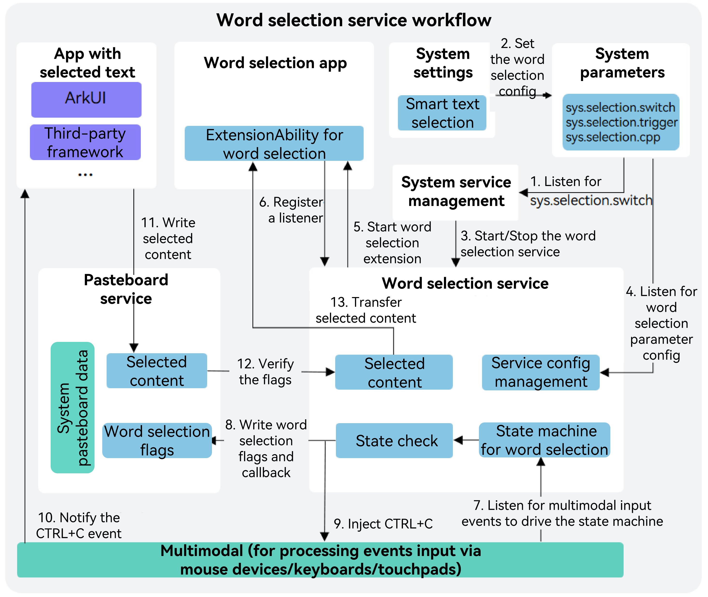

# Overview of the Word Selection Service

<!--Kit: Basic Services Kit-->
<!--Subsystem: SelectionInput-->
<!--Owner: @no86-->
<!--Designer: @mmwwbb-->
<!--Tester: @dong-dongzhen-->
<!--Adviser: @fang-jinxu-->

Since API version 24, the word selection service is available. It provides capabilities for obtaining selected text globally and APIs for implementing a word selection panel.

## Working Principles

The workflow of the word selection service depends on the collaboration of modules such as the word selection application, application with selected text, system settings application, system service management, multimodal input, and pasteboard service. The following describes these modules and their services:

**Word selection application**: an application that implements the word selection extension ability. After the word selection service successfully launches the word selection application, this application can listen for the [selectionCompleted](../../reference/apis-basic-services-kit/js-apis-selectionInput-selectionManager.md#selectionmanageronselectioncompleted) event to identify the user action for selecting text, call [getSelectionContent](../../reference/apis-basic-services-kit/js-apis-selectionInput-selectionManager.md#selectionmanagergetselectioncontent) to obtain the selected text, and [createPanel](../../reference/apis-basic-services-kit/js-apis-selectionInput-selectionManager.md#selectionmanagercreatepanel) and [show](../../reference/apis-basic-services-kit/js-apis-selectionInput-selectionManager.md#show) to create and display the panel. This process corresponds to step 6 in the following figure. For details about the API description and usage, see [Developing a Word Selection Extension Ability](./selection-services-application-guide.md).

**Application with selected text**: an application where text is selected by the user. Currently, the word selection service uses the standard system copy mechanism. Therefore, the word selection service can implement a cross-application word selection without any adaptation or modification performed on the target application. This process corresponds to step 11 in the following figure. However, for some applications that do not support system-level copy operations (such as certain controlled **WebView**s, sandbox applications, or applications that support only internal paste operations), the word selection service cannot obtain the selected text through the standard system copy mechanism. In this case, the word selection service becomes invalid. Therefore, you are advised to use a trustlist or blocklist when developing a word selection application and add the target applications that support the word selection service to the trustlist.

**System settings application**: a built-in settings application in the system. The system settings application automatically scans and identifies all applications that have implemented the word selection extension ability, and displays them on **Settings** > **System** > **Smart text selection** for users to select. (If no application is specified, the first word selection application in the list is used by default.) In addition, users can enable or disable the global word selection functionality on the **Smart text selection** screen, and select a triggering mode of the word selection panel (for example, directly triggering the panel after selecting text or triggering the pane after selecting text and pressing **Ctrl**). All configuration items are synchronized to system parameters by the system settings application for other modules to access. This process corresponds to step 2 in the following figure.

**System service management**: a module that manages system services in a unified manner. For the word selection service, this module listens for the changes of **sys.selection.switch** (one of the system parameters). If **sys.selection.switch** is set to **on**, the word selection service is started; if set to **off**, the service is stopped. This process corresponds to steps 1 and 3 in the following figure. For details about system service management, see [System Ability Manager (Samgr)](https://gitcode.com/openharmony/systemabilitymgr_samgr).

**Multimodal input**: a module that handles input events from touchscreens, keyboards, mice and other devices. The word selection service registers a listener to listen for multimodal input events, captures users' input events from the keyboard, mouse, and touchpad in real time, drives the state machine based on preset rules, and accurately identifies the word selection behavior. In addition, it also injects the **CTRL+C** event into the target application through the multimodal input module to simulate the system copy operation. This process corresponds to steps 7, 9, and 10 in the following figure. For details about multimodal input, see [multimodalinput_input](https://gitcode.com/openharmony/multimodalinput_input).

**Pasteboard service**: a core module that manages the pasteboard status and supports global copy and paste functionalities in a unified manner. To meet the requirements of the word selection service, the pasteboard service introduces the word selection flag mechanism. When the flag exists, the pasteboard service does not write the subsequently received content to the system pasteboard, but directly transfers the content to the word selection service, and immediately clears the flag after the transfer is complete. Therefore, the word selection operation does not interfere with the normal copy and paste process. This process corresponds to steps 8, 11, and 12 in the following figure. For details about the pasteboard service, see [Clipboard Service](https://gitcode.com/openharmony/distributeddatamgr_pasteboard).

**Word selection service**: When the word selection service is started, the word selection application selected by the user on the **Smart text selection** screen is started based on the value in the system parameters. Meanwhile, this service listens for parameter changes of the word selection triggering mode to ensure that the configuration takes effect in real time, and also registers a listener to listen for multimodal input events, captures users' input events from the keyboard, mouse, and touchpad in real time, drives the state machine based on preset rules, and accurately identifies word selection behavior. Once the state machine determines that the user performs a word selection operation, the word selection service injects a **CTRL+C** event into the target application through the multimodal input module to simulate a system copy operation and trigger a text copy process. At the same time, the word selection service writes a dedicated word selection flag and callback to the pasteboard service for subsequent content interception and transfer. After receiving the **CTRL+C** event, the target application executes the standard copy logic to write the content selected by the user to the system pasteboard, which then checks whether the word selection flag exists. If the flag is valid, the content is not written to the system pasteboard but directly transferred to the word selection service, and the flag is cleared immediately. Finally, the word selection service forwards the obtained text content to the current word selection application, which then completes subsequent processing (such as translation, summarization, and expansion) and creates and displays a custom panel. This process corresponds to steps 4 to 13 in the following figure.

## Capabilities

- Selecting words:

  Supported: holding left button of the mouse or touchpad and moving the cursor, double-click, and triple-click. Unsupported: pressing **CTRL+A** on the keyboard and selecting through a touchscreen.

- Triggering panels:

  A panel can be triggered after the user selects text or presses **Ctrl** upon a text selection. Users can switch between the two modes on **Settings** > **System** > **Smart text selection**.

- Managing panels:

  You can create and manage menu panels and main panels, perform panel operations (such as adding, moving, hiding, and destroying panels), and customize panel content.

- Managing applications:

  Word selection extension ability can be implemented to multiple applications, but only one application can communicate with the word selection service at a time. You can change the word selection application on **Settings** > **System** > **Smart text selection**.

## Constraints

- This service is supported on 2-in-1 devices with external keyboards and mouse devices.

- The maximum length of selected text is 6,000 bytes.

- This service can be used on an extended screen, but cannot be used across devices.

- For applications that do not support copy or supports only internal copy and paste, the word selection service is invalid. Therefore, you are advised to configure a blocklist or trustlist when developing a word selection application.
