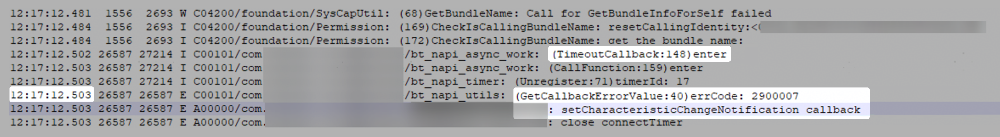
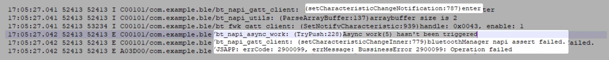

# 2900099 Bluetooth API Call Error

<!--Kit: Connectivity Kit-->
<!--Subsystem: Communication-->
<!--Owner: @guoxiadi-->
<!--Designer: @chengguohong; @tangjia15-->
<!--Tester: @wangfeng517-->
<!--Adviser: @zhang_yixin13-->
<!-- md-trans-meta sourceCommit=fac6c0d3e5a1ac47e7aa04e66b7ef4e1b1d65bd6 translatedAt=2026-05-29T13:23:18.482Z pushedAt=2026-05-29T13:26:49.805Z -->

## Symptom

During BLE Bluetooth application development, error 2900099 occurs when the [setCharacteristicChangeNotification](../../reference/apis-connectivity-kit/js-apis-bluetooth-ble.md#setcharacteristicchangenotification) API is called.

## Background

- Error [2900099](../../reference/apis-connectivity-kit/errorcode-bluetoothManager.md#2900099) indicates that the API call failed. This error code is typically returned when an API call is blocked.

- The **setCharacteristicChangeNotification** API enables or disables the client from receiving notifications about characteristic value changes from the server. Read the notes below the API carefully before using it.

- After the **setCharacteristicChangeNotification** API is called, the underlying layer writes a data request to the server in the form of a descriptor by default. The server can receive the request through [on('descriptorWrite')](../../reference/apis-connectivity-kit/js-apis-bluetooth-ble.md#ondescriptorwrite), and then call the [sendResponse](../../reference/apis-connectivity-kit/js-apis-bluetooth-ble.md#sendresponse) API to return data to the client. A **setCharacteristicChangeNotification** request is complete only after the client successfully receives the data.

## Troubleshooting

- Check whether the server has created an [on('descriptorWrite')](../../reference/apis-connectivity-kit/js-apis-bluetooth-ble.md#ondescriptorwrite) listener. If not, the server cannot receive the descriptor request sent by the client, and the client's **setCharacteristicChangeNotification** API will remain blocked while the request is pending.

- Check whether the server responds promptly after receiving the descriptor request from the client (by checking the log for the **OnSetNotifyCharacteristic** keyword). If not, the client's **setCharacteristicChangeNotification** API will also remain blocked while the request is pending. The following are error logs.

- Check whether another asynchronous API call is still pending when the client calls **setCharacteristicChangeNotification**, causing the **setCharacteristicChangeNotification** call to be blocked. To troubleshoot the issue:

  - Add logs to API callbacks to view the complete API call sequence. From object instance creation to data transmission, the BLE client API call sequence is as follows for reference:

    - Call [createGattClientDevice](../../reference/apis-connectivity-kit/js-apis-bluetooth-ble.md#blecreategattclientdevice) to create a client instance.

    - Create listeners for the BLE connection state, MTU changes, characteristic value changes, and other events.

    - Call [connect](../../reference/apis-connectivity-kit/js-apis-bluetooth-ble.md#connect) to connect to the BLE device.

    - Call [setBLEMtuSize](../../reference/apis-connectivity-kit/js-apis-bluetooth-ble.md#setblemtusize) to negotiate the MTU.

    - Call [getServices](../../reference/apis-connectivity-kit/js-apis-bluetooth-ble.md#getservices) to obtain all service capabilities supported by the server.

    - Call **setCharacteristicChangeNotification** to enable notifications for characteristic value changes from the server.

    - Call [writeCharacteristicValue](../../reference/apis-connectivity-kit/js-apis-bluetooth-ble.md#writecharacteristicvalue) to write characteristic data to the server.

  - Check system logs. After the issue is reproduced, generate hilog logs and check the timestamps of system log output when each API call starts and completes to determine whether any API call is blocked. For example, when **setCharacteristicChangeNotification** starts, the system log prints the keyword **setCharacteristicChangeNotification**. When the API call completes, you can check the custom log added to the **setCharacteristicChangeNotification** callback. The following is an example issue log.

  

## Analysis

- The server has not created an **on('descriptorWrite')** listener, or it does not respond promptly after receiving a descriptor request from the client.

- Before **setCharacteristicChangeNotification** is called, the asynchronous **setBLEMtuSize** API is generally called first to negotiate the MTU for data transmission with the server, followed by **getServices** to obtain the list of characteristic services supported by the server. Therefore, **setCharacteristicChangeNotification** can be called to enable notifications for characteristic value changes from the server only after **setBLEMtuSize** and **getServices** are called successfully in sequence.

## Suggestions

See [GATT-based Connection and Data Transmission](gatt-development-guide.md).

## Related Issues

The BLE **writeCharacteristicValue** API returns error code 2900099 when writing data for the following reasons:

- Data is written before the callback of the previous non-listener BLE API, such as **setBLEMtuSize**, **getServices**, or **setCharacteristicChangeNotification**, has returned. In this case, error 2900099 is reported and the write operation fails. Ensure that **writeCharacteristicValue** is called only after callbacks of other non-listener BLE APIs are complete.

- A new **gattClient** object is created each time the GATT device is reconnected, establishing a new GATT connection. If [close](../../reference/apis-connectivity-kit/js-apis-bluetooth-ble.md#close) is not called to destroy the **gattClient** instance after each connection is closed, **setCharacteristicChangeNotification** and **getServices** may be called repeatedly on subsequent reconnections, causing a busy state and error 2900099. Destroy the **gattClient** object promptly after each connection is closed.

- The parameters are invalid. In this case, the system log also prints **Invalid parameters**. Check whether a valid [BLECharacteristic](../../reference/apis-connectivity-kit/js-apis-bluetooth-ble.md#blecharacteristic) is passed in according to the GATT specifications.