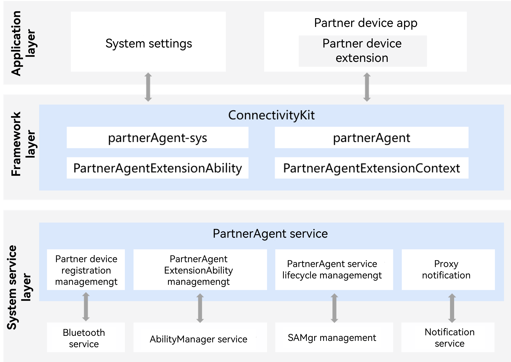

# Converged Short-Range Service Development

<!--Kit: Connectivity Kit-->
<!--Subsystem: Communication-->
<!--Owner: @guoxiadi-->
<!--Designer: @chengguohong; @tangjia15-->
<!--Tester: @wangfeng517-->
<!--Adviser: @zhang_yixin13-->
<!-- md-trans-meta sourceCommit=dcae6f10c07044342acb5b2dc0416e100c5bcaa2 translatedAt=2026-06-17T06:38:21.726Z pushedAt=2026-06-22T07:23:33.820Z -->

## Overview

The converged short-range communication service (converged short-range for short) is an OpenHarmony service that centrally manages short-range communication technologies. It currently provides the **PartnerAgent** module.

This module enables interoperability between partner devices and OpenHarmony devices. Typical scenarios include the following: 

- Media control: A wearable can display the music or video currently playing on an OpenHarmony device. Partner devices such as wearables and earbuds can also remotely control media playback on the OpenHarmony device, including playing, pausing, and switching tracks.

- Call control: When an incoming call is received on an OpenHarmony device, a wearable displays the caller's number and contact name. Partner devices such as wearables and earbuds can remotely answer or reject calls on the OpenHarmony device.

- Health monitoring: Wearables can collect health data in real time and report it to an OpenHarmony device. The OpenHarmony device can display the health data in real time.

These scenarios require partner devices to maintain long-term interoperability with OpenHarmony devices. When data exchange is required, such as for media control, call control, or health monitoring, the corresponding application must be able to wake up and process the exchanged data. This service provides a solution for keeping application processes wakeable, ensuring that partner-device applications can be awakened and continue running properly whenever data exchange is required.

## System Architecture

### Module Function Description

The overall architecture is divided into the application layer, framework layer (providing APIs), and system service layer.

* **Application layer**

  * **System settings**: Calls the `partnerAgent-sys` system APIs to enable or disable the capability of a partner device. After this capability is disabled, the **PartnerAgent** service will no longer start the partner device Extension.

  * **Partner device application**: An end-user application implemented by an ecosystem device vendor, which calls the `bindDevice()` API of `partnerAgent` to register partner devices.

  * **Partner device Extension**: A `PartnerAgentExtensionAbility` implemented by a partner device application. This extension ability can establish Bluetooth connections with partner devices and transmit Bluetooth data. After receiving commands from partner devices, the partner device Extension can perform media control and call control.

- **Framework layer**

  * **partnerAgent-sys**: Provides the `enableDeviceControl` and `disableDeviceControl` APIs for system settings to enable or disable the capability of a partner device. After this capability is disabled, the **PartnerAgent** service will no longer start the partner device Extension.

  * **partnerAgent**: Provides APIs such as `bindDevice`, `unbindDevice`, and `getBoundDevices` for partner device applications, and handles registration, binding, and unregistration of partner devices.

  * **PartnerAgentExtensionAbility**: Provides APIs such as `onDeviceDiscovered` for partner device Extensions, and notifies a partner device Extension that the corresponding partner device has been discovered.

  * **PartnerAgentExtensionContext**: Provides context information for a partner device Extension when it is started.

- **System service layer**

  * **Partner device registration management**: Manages registered partner devices.

    * Partner device applications can call `bindDevice` to register a partner device and `unbindDevice` to unregister it.

    * Only after the **PartnerAgent** service detects that a partner device has been registered does it invoke Bluetooth service APIs to perform BLE scanning and monitor Bluetooth connection state changes for partner device discovery.

    * In the following scenarios, the **PartnerAgent** service automatically unregisters a device: 1. the Bluetooth pairing relationship of a partner device registered by a partner device application has been lost for more than 30 days; 2. the partner device application associated with a registered partner device is uninstalled.

  * **PartnerAgentExtensionAbility management**: Controls partner device Extensions. After a partner device registered by a partner device application is discovered through BLE scanning or Bluetooth connection, this module starts the partner device Extension process and notifies the partner device Extension through the `onDeviceDiscovered` API.

  * **PartnerAgent service lifecycle management**: Provides dynamic startup and shutdown of the **PartnerAgent** service process to prevent resource waste.

  * **Proxy notification**: Manages notifications displayed on the minus 1 screen. These notifications inform users that the partner device extension process is running in the background, which may increase power consumption and allow the partner device to control the media playback and calling capabilities of the OpenHarmony device.

  * **Bluetooth service/AbilityManager service/SAMgr management/notification service**: Basic OpenHarmony system services. The Bluetooth service is responsible for Bluetooth scanning, Bluetooth connection, and Bluetooth data transmission. The **AbilityManager** service provides the capability of starting and destroying partner device Extensions. SAMgr management is responsible for starting and destroying the **PartnerAgent** service. The notification service is responsible for displaying notifications on the minus 1 screen.