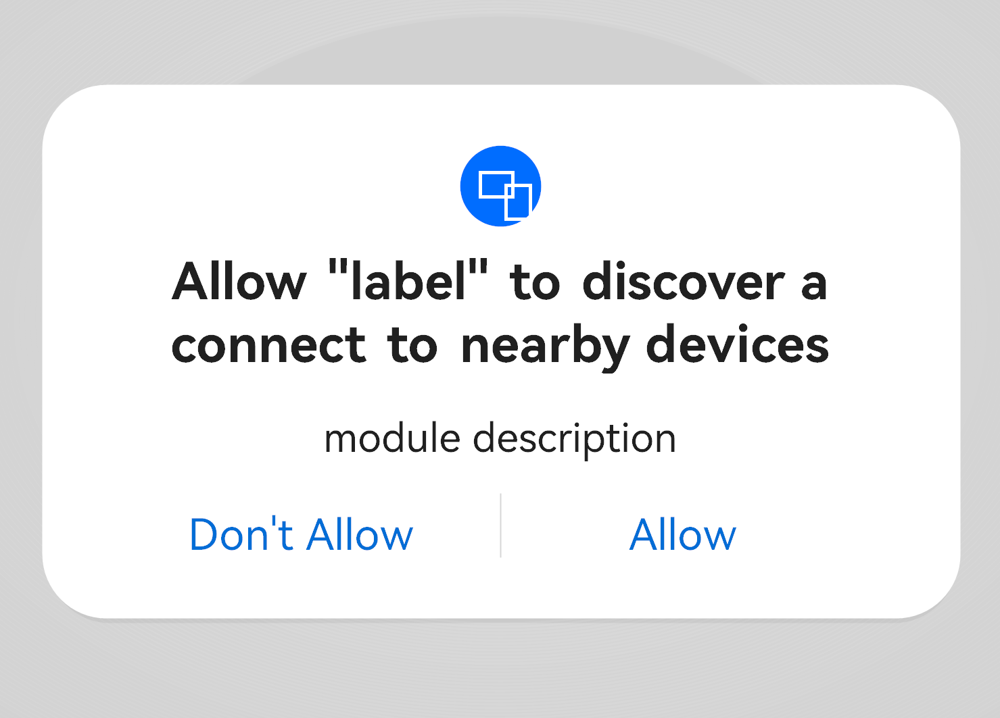
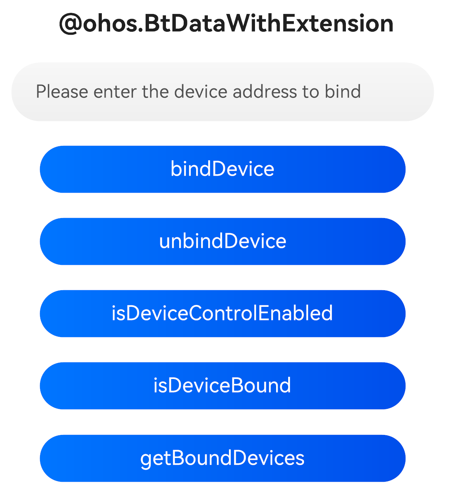

# Interconnection Between Partner Devices and OpenHarmony Devices

<!--Kit: Connectivity Kit-->
<!--Subsystem: Communication-->
<!--Owner: @guoxiadi-->
<!--Designer: @chengguohong; @tangjia15-->
<!--Tester: @wangfeng517-->
<!--Adviser: @zhang_yixin13-->
<!-- md-trans-meta sourceCommit=dcae6f10c07044342acb5b2dc0416e100c5bcaa2 translatedAt=2026-06-17T06:38:13.589Z pushedAt=2026-06-18T08:33:24.292Z -->

## Overview

Partner devices need to interconnect with OpenHarmony devices. Typical scenarios include:<br>

- Media control: A wearable can display the music or video currently playing on an OpenHarmony device. Partner devices such as wearables and earbuds can also remotely control media playback on the OpenHarmony device, including playing, pausing, and switching tracks.

- Call control: When an incoming call is received on an OpenHarmony device, a wearable displays the caller's number and contact name. Partner devices such as wearables and earbuds can remotely answer or reject calls on the OpenHarmony device.

- Health monitoring: Wearables can collect health data in real time and report it to an OpenHarmony device. The OpenHarmony device can display the health data in real time.

These scenarios require partner devices to maintain long-term interconnection with OpenHarmony devices. When data interaction occurs, such as media control, call control, or health data interaction, applications must remain active. This guide provides a solution for keeping application processes wakeable, ensuring that partner device vendor applications required by partner devices can be woken up and run properly during data interaction.

## Key Process

1. A partner device application must first implement [PartnerAgentExtensionAbility](../../reference/apis-connectivity-kit/js-apis-fusionConnectivity-partnerAgentExtensionAbility.md), where it implements the data transmission service operations required after the application is woken up by the system.

2. The partner device application triggers [Bluetooth pairing](../../connectivity/bluetooth/br-pair-device-development-guide.md) with the partner device, and then calls the **bindDevice** API to register the partner device. After detecting that the partner device is registered, the **PartnerAgent** service calls Bluetooth service APIs to perform [BLE](../../connectivity/terminology.md#ble) scanning and listen for Bluetooth connection status to discover the partner device, and then starts the partner device [ExtensionAbility](../../reference/apis-connectivity-kit/js-apis-fusionConnectivity-partnerAgentExtensionAbility.md). If the partner device is not registered, the **PartnerAgent** service does not start the partner device Extension.

3. The registration information is persistently stored and remains valid after the OpenHarmony device restarts.

4. When the partner device application no longer needs to use the device, it can call the **unbindDevice** API to unregister the device.

## Constraints

To reduce the risk of **PartnerAgentExtensionAbility** being abused by third-party applications, functional constraints of the basic access mode are used to provide security control for applications.

> **NOTE**
>
> Strictly comply with the functional constraints of the basic access mode. In this mode, you should provide only partner device service notification features. The system will gradually introduce security control capabilities for the basic access mode, including but not limited to prohibiting applications from requesting long-term or short-term tasks, calling the camera, recording audio, using media, using location, using contacts and calls, using Wi-Fi, and using NFC. Violations may result in service exceptions.

## How to Develop

### Creating Directory Structure

When implementing a partner device lifecycle management application, create a **PartnerAgentExtensionAbility** in the DevEco Studio project by performing the following steps:

1. In the **ets** directory of the project module, right-click and choose **New > Directory** to create a directory named **entryability**.

2. In the **entryability** directory, right-click and choose **New > File** to create two files, **EntryAbility.ets** and **PartnerAgentAbility.ets**. The directory structure is as follows:

   ``` TypeScript
   /src/main/
   ├── ets/entryability
   │       └──EntryAbility.ets               # Display the button interaction UI
   │       └──PartnerAgentAbility.ets        # Custom class inheriting PartnerAgentExtensionAbility with required lifecycle callbacks
   │   ├───pages
   │       └── Index.ets                     # Draw the button interaction page for device registration and deregistration
   ├── resources/base/profile/main_pages.json  
   ```

### Requesting Bluetooth Permission

The **ohos.permission.ACCESS_BLUETOOTH** permission must be requested. For details about how to declare and request permissions, see [Declaring Permissions](../../security/AccessToken/declare-permissions.md) and [Requesting User Authorization](../../security/AccessToken/request-user-authorization.md).

### Implementing PartnerAgentExtensionAbility

The application must implement [PartnerAgentExtensionAbility](../../reference/apis-connectivity-kit/js-apis-fusionConnectivity-partnerAgentExtensionAbility.md). This module is started when an OpenHarmony device detects or connects to a **registered** partner device through BLE scanning. After the OpenHarmony device disconnects from the registered partner device, this module destroys the partner device Extension process after 3 minutes. This module keeps the application wakeable by providing the following functions.

- **onDeviceDiscovered(deviceAddress: PartnerDeviceAddress)**

  This callback is triggered when an [ACL](../../connectivity/terminology.md#acl) connection is established with a registered device or when the registered device is discovered through BLE scanning. You can perform data transmission service operations in this callback, such as establishing a Bluetooth [SPP connection](../bluetooth/spp-development-guide.md) or printing device discovery information.

- **onDestroyWithReason(reason: PartnerAgentExtensionAbilityDestroyReason)**

  This callback is triggered when the service is no longer used and the instance is about to be destroyed. The callback reports the reason why the instance is destroyed. You can clear resources in this callback, for example, unbinding devices or printing device lost information.

  ``` TypeScript
  import { partnerAgent } from '@kit.ConnectivityKit';
  import { PartnerAgentExtensionAbility } from '@kit.ConnectivityKit';

  export default class PartnerAgentAbility extends PartnerAgentExtensionAbility {
    onDeviceDiscovered(deviceAddress: partnerAgent.PartnerDeviceAddress): void {
      console.info(`[testTag] onDeviceDiscovered success: ${deviceAddress.bluetoothAddress?.address} ${deviceAddress.bluetoothAddress?.addressType}`);
    }

    onDestroyWithReason(reason: partnerAgent.PartnerAgentExtensionAbilityDestroyReason): void {
      console.info(`[testTag] onDestroyWithReason is: ${reason}`);
    }
  }
  ```

### Registering a Device

Call [bindDevice](../../reference/apis-connectivity-kit/js-apis-fusionConnectivity-partnerAgent.md#partneragentbinddevice) to register a device. Only registered devices can trigger the process of starting the partner device Extension.

- Before registration, call [isDeviceControlEnabled](../../reference/apis-connectivity-kit/js-apis-fusionConnectivity-partnerAgent.md#partneragentisdevicecontrolenabled) to check whether the interconnection feature of the current device is enabled.

- Before registration, ensure that the device is paired with the local device over Bluetooth.

- The name of the ability to be started is the name of the ability registered as **PartnerAgentExtensionAbility** in the [module.json5 configuration file](../../quick-start/module-configuration-file.md) of the project module, with the type tag set to **partnerAgent**. It must be the same as the **name** property of [extensionabilities](../../quick-start/module-configuration-file.md#extensionabilities) in the module-level [module.json5 configuration file](../../quick-start/module-configuration-file.md) of the application.

```ts
// // Registered device address information
let btAddr: common.BluetoothAddress = {
  "address": 'XX:XX:XX:XX:XX:XX',
  "addressType": common.BluetoothAddressType.VIRTUAL,
};
let deviceAddress: partnerAgent.PartnerDeviceAddress = {
  "bluetoothAddress": btAddr,
};

// // Check whether the interconnection feature of the current device is enabled
let isEnabled = partnerAgent.isDeviceControlEnabled(deviceAddress);
console.info(`[testTag] device ${btAddr.address} is enabled: ${isEnabled}`);

// // Register the capabilities supported by the device
let capability: partnerAgent.DeviceCapability = {
  "supportBR": true,
  "supportBleAdvertiser": true,
};
// // Register the business functions of the device, including media control and call control.
let businessCap: partnerAgent.BusinessCapability = {
  "supportMediaControl": true,
  "supportTelephonyControl": false,
};
if (isEnabled == false) {
  // PartnerAgentAbility is the name of the ability launched during device discovery
  partnerAgent.bindDevice(deviceAddress, capability, businessCap, "PartnerAgentAbility")
    .then(() => {
      console.info(`[testTag] bind device success:  ${btAddr.address}`);
    })
    .catch((err: BusinessError) => {
      console.error(`errCode: ${err.code}, errMessage: ${err.message}`);
    });
}

```

### Unregistering a Device

When the partner device application no longer needs to be kept wakeable by the system, call [unbindDevice](../../reference/apis-connectivity-kit/js-apis-fusionConnectivity-partnerAgent.md#partneragentunbinddevice) to unregister the device.

- Before unregistration, you are advised to call [isDeviceBound](../../reference/apis-connectivity-kit/js-apis-fusionConnectivity-partnerAgent.md#partneragentisdevicebound) to check the device registration status. Unregister a device only after confirming that it has been registered.

- After unregistration, the **PartnerAgentExtensionAbility** process of the application no longer receives discovery and offline status notifications of this device.

```ts
// Get all devices currently registered by the application
let devices: partnerAgent.PartnerDeviceAddress[] = partnerAgent.getBoundDevices();
for (let i = 0; i < devices.length; i++) {
  let addr = devices[i].bluetoothAddress;
  if (addr) {
    console.info(`[testTag] bound device (addr: ${addr.address}, addressType: ${addr.addressType},
        rawAddressType: ${addr.rawAddressType})`);
  }
}

let btAddr: common.BluetoothAddress = {
  "address": 'XX:XX:XX:XX:XX:XX',
  "addressType": common.BluetoothAddressType.VIRTUAL,
};
let deviceAddress: partnerAgent.PartnerDeviceAddress = {
  "bluetoothAddress": btAddr,
};

// Check whether the application has already registered this device
let isBound = partnerAgent.isDeviceBound(deviceAddress);
console.info(`[testTag] device ${btAddr.address} is bound: ${isBound}`);

if (isBound == true) {
  partnerAgent.unbindDevice(deviceAddress)
    .then(() => {
      console.info(`[testTag] unbindDevice device success:  ${btAddr.address}`);
    })
    .catch((err: BusinessError) => {
      console.error(`[testTag] errCode: ${err.code}, errMessage: ${err.message}`);
    });
}
```

- For details about project setup, see [Complete Example](#complete-example).

## Complete Example

1. **PartnerAgentAbility.ets** file.

   In the **PartnerAgentAbility.ets** file, import the dependency package of **PartnerAgentExtensionAbility**, define a custom class that inherits from **PartnerAgentExtensionAbility**, and add the required lifecycle callbacks.

    ``` TypeScript
    import { partnerAgent } from '@kit.ConnectivityKit';
    import { PartnerAgentExtensionAbility } from '@kit.ConnectivityKit';

    export default class PartnerAgentAbility extends PartnerAgentExtensionAbility {
      onDeviceDiscovered(deviceAddress: partnerAgent.PartnerDeviceAddress): void {
        console.info(`[testTag] onDeviceDiscovered success: ${deviceAddress.bluetoothAddress?.address} ${deviceAddress.bluetoothAddress?.addressType}`);
      }

      onDestroyWithReason(reason: partnerAgent.PartnerAgentExtensionAbilityDestroyReason): void {
        console.info(`[testTag] onDestroyWithReason is: ${reason}`);
      }
    }
    ```

2. **EntryAbility.ets** file.

    The **EntryAbility** loads the page drawn in **ets/pages/Index.ets** and requests the user to grant Bluetooth access permission.

    

    ``` TypeScript
    import { AbilityConstant, ConfigurationConstant, UIAbility, Want } from '@kit.AbilityKit';
    import { hilog } from '@kit.PerformanceAnalysisKit';
    import { window } from '@kit.ArkUI';

    const DOMAIN = 0x0000;

    export default class EntryAbility extends UIAbility {
      onCreate(want: Want, launchParam: AbilityConstant.LaunchParam): void {
        try {                                                        
          this.context.getApplicationContext().setColorMode(ConfigurationConstant.ColorMode.COLOR_MODE_NOT_SET);
        } catch (err) {
          hilog.error(DOMAIN, 'testTag', 'Failed to set colorMode. Cause: %{public}s', JSON.stringify(err));
        }
        hilog.info(DOMAIN, 'testTag', '%{public}s', 'Ability onCreate');
      }

      onDestroy(): void {
        hilog.info(DOMAIN, 'testTag', '%{public}s', 'Ability onDestroy');
      }

      onWindowStageCreate(windowStage: window.WindowStage): void {
        // Main window is created, set main page for this ability
        hilog.info(DOMAIN, 'testTag', '%{public}s', 'Ability onWindowStageCreate');

        windowStage.loadContent('pages/Index', (err) => {
          if (err.code) {
            hilog.error(DOMAIN, 'testTag', 'Failed to load the content. Cause: %{public}s', JSON.stringify(err));
            return;
          }
          hilog.info(DOMAIN, 'testTag', 'Succeeded in loading the content.');
        });
      }

      onWindowStageDestroy(): void {
        // Main window is destroyed, release UI related resources
        hilog.info(DOMAIN, 'testTag', '%{public}s', 'Ability onWindowStageDestroy');
      }

      onForeground(): void {
        // Ability has brought to foreground
        hilog.info(DOMAIN, 'testTag', '%{public}s', 'Ability onForeground');
      }

      onBackground(): void {
        // Ability has back to background
        hilog.info(DOMAIN, 'testTag', '%{public}s', 'Ability onBackground');
      }
    }
    ```

3. **Index.ets** file.

    This file calls functional APIs such as device registration. In **Index.ets**, enter the Bluetooth address of the device to register. Then you can register the Bluetooth device, unregister the Bluetooth device, query the binding status of the device, and obtain the list of devices bound to the local device.

    

    ``` TypeScript
    import { BusinessError } from '@kit.BasicServicesKit';
    import common from '@ohos.bluetooth.common';
    import partnerAgent from '@ohos.FusionConnectivity.partnerAgent';

    @Entry
    @Component
    struct Index {
      @State perBtAddress: string = '';

      build() {
        Column() {
          Text("@ohos.BtDataWithExtension")
            .fontSize(20)
            .margin({ bottom: 16 })
            .fontWeight(FontWeight.Bold)
          TextInput({ placeholder: 'Please enter the device address to bind', text: this.perBtAddress })
            .margin(1)
            .width('90%')
            .height(50)
            .type(InputType.Normal)
            .onChange((value: string) => {
              this.perBtAddress = value;
            })
          Row() {
            Button("bindDevice").width(300).margin(5).onClick(() => {
              console.info("[testTag] bindDevice");
              let btAddr: common.BluetoothAddress = {
                "address": this.perBtAddress,
                "addressType": common.BluetoothAddressType.VIRTUAL,
              };
              let deviceAddress: partnerAgent.PartnerDeviceAddress = {
                "bluetoothAddress": btAddr,
              };
              let capability: partnerAgent.DeviceCapability = {
                "supportBR": true,
                "supportBleAdvertiser": true,
              };
              let businessCap: partnerAgent.BusinessCapability = {
                "supportMediaControl": true,
                "supportTelephonyControl": false,
              };
              partnerAgent.bindDevice(deviceAddress, capability, businessCap, "PartnerAgentAbility")
                .then(() => {
                  console.info(`[testTag] bind device success:  ${btAddr.address}`);
                })
                .catch((err: BusinessError) => {
                  console.error(`errCode: ${err.code}, errMessage: ${err.message}`);
                });
            })
          }

          Row() {
            Button("unbindDevice").width(300).margin(5).onClick(() => {
              console.info("[testTag] unbindDevice");
              let btAddr: common.BluetoothAddress = {
                "address": this.perBtAddress,
                "addressType": common.BluetoothAddressType.VIRTUAL,
              };
              let deviceAddress: partnerAgent.PartnerDeviceAddress = {
                "bluetoothAddress": btAddr,
              };
              partnerAgent.unbindDevice(deviceAddress)
                .then(() => {
                  console.info(`[testTag] unbindDevice device success:  ${btAddr.address}`);
                })
                .catch((err: BusinessError) => {
                  console.error(`[testTag] errCode: ${err.code}, errMessage: ${err.message}`);
                });
            })
          }

          Row() {
            Button("isDeviceControlEnabled").width(300).margin(5).onClick(() => {
              console.info("[testTag] isEnable");
              try {
                let btAddr: common.BluetoothAddress = {
                  "address": this.perBtAddress,
                  "addressType": common.BluetoothAddressType.VIRTUAL,
                };
                let deviceAddress: partnerAgent.PartnerDeviceAddress = {
                  "bluetoothAddress": btAddr,
                };
                let isEnabled = partnerAgent.isDeviceControlEnabled(deviceAddress);
                console.info(`[testTag] device ${btAddr.address} is enabled: ${isEnabled}`);
              } catch (err) {
                console.error(`[testTag] errCode: ${err.code}, errMessage: ${err.message}`);
              }
            })
          }
          Row() {
            Button("isDeviceBound").width(300).margin(5).onClick(() => {
              console.info("[testTag] isBound");
              try {
                let btAddr: common.BluetoothAddress = {
                  "address": this.perBtAddress,
                  "addressType": common.BluetoothAddressType.VIRTUAL,
                };
                let deviceAddress: partnerAgent.PartnerDeviceAddress = {
                  "bluetoothAddress": btAddr,
                };
                let isBound = partnerAgent.isDeviceBound(deviceAddress);
                console.info(`[testTag] device ${btAddr.address} is bound: ${isBound}`);
              } catch (err) {
                console.error(`[testTag] errCode: ${err.code}, errMessage: ${err.message}`);
              }
            })
          }
          Row() {
            Button("getBoundDevices").width(300).margin(5).onClick(() => {
              console.info("[testTag] Get bound devices");
              try {
                let devices: partnerAgent.PartnerDeviceAddress[] = partnerAgent.getBoundDevices();
                for (let i = 0; i < devices.length; i++) {
                  let btAddr = devices[i].bluetoothAddress;
                  if (btAddr) {
                    console.info(`[testTag] bound device (addr: ${btAddr.address}, addressType: ${btAddr.addressType},
                        rawAddressType: ${btAddr.rawAddressType})`);
                  }
                }
              } catch (err) {
                console.error(`[testTag] errCode: ${err.code}, errMessage: ${err.message}`);
              }
            })
          }
        }
      }
    }
    ```

 4. **main_pages.json** file. This file corresponds to the page drawn under the **ets/pages/** path for partner device management buttons.

    ``` JSON
    {
      "src": [
        "pages/Index"
      ]
    }
    ```

 5. Register **PartnerAgentExtensionAbility** in the [module.json5 file](../../quick-start/module-configuration-file.md) corresponding to the project module. The **type** tag must be set to **partnerAgent**, and the **srcEntry** tag indicates the code path corresponding to the current **PartnerAgentExtensionAbility** component.

    ``` JSON5
    "extensionAbilities": [
      {
        "name": "PartnerAgentAbility",
        "srcEntry": "./ets/entryability/PartnerAgentAbility.ets",
        "description": "service",
        "icon": "$media:layered_image",
        "type": "partnerAgent",
        "exported": true
      }
    ],
    "requestPermissions": [
      {
        "name": "ohos.permission.ACCESS_BLUETOOTH",
        "reason": "$string:module_desc",
        "usedScene": {
          "abilities": [
            "EntryFormAbility"
          ],
          "when": "inuse"
        }
      }
    ]
    ```