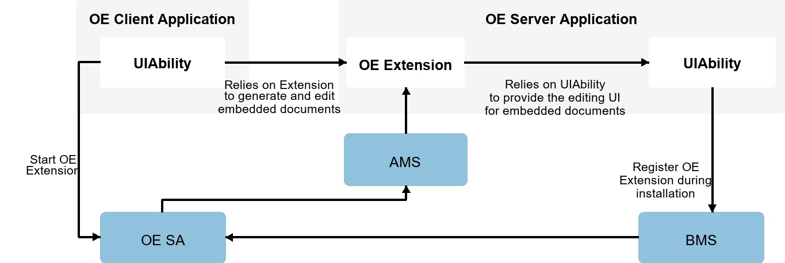
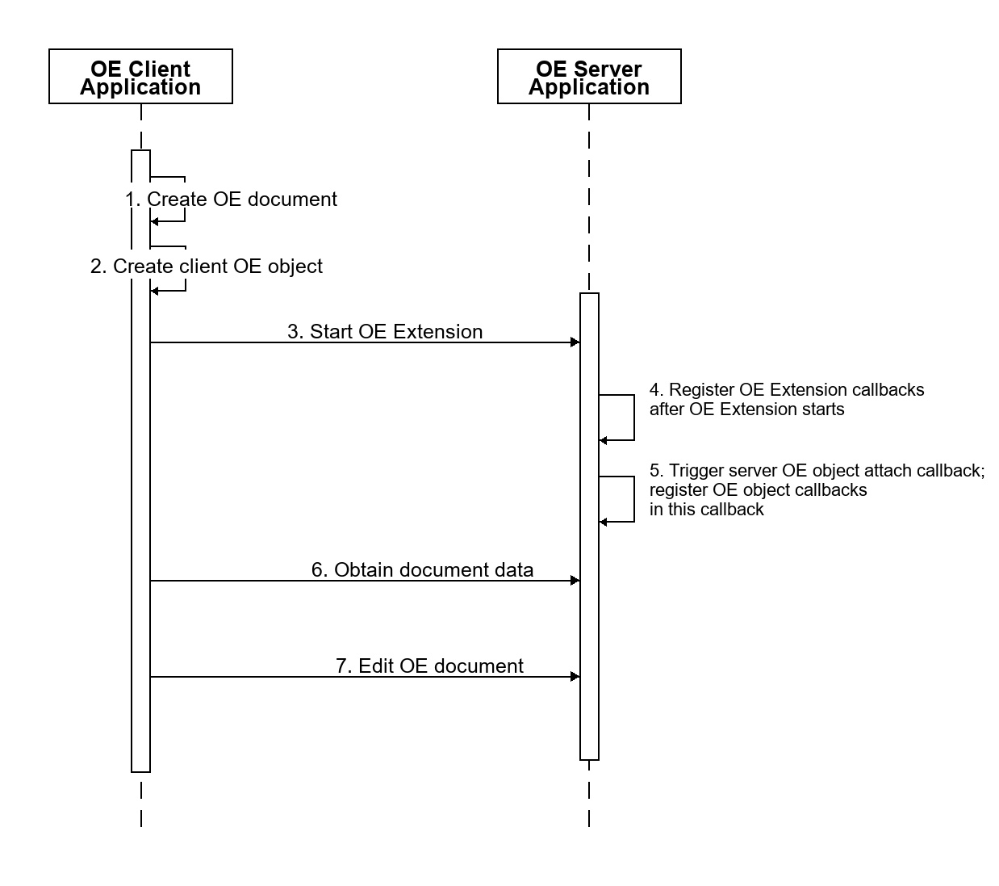

# Client-Server Interaction Process

<!--Kit: Content Embed Kit-->
<!--Subsystem: officeservice -->
<!--Owner: @qq_41146650-->
<!--Designer: @gcw_nDnzjzHO;@wei-guoning-->
<!--Tester: @sd_yinjian-->
<!--Adviser: @jinqiuheng-->

The [OE](content-embed-kit-terminology.md#oe) framework uses the ExtensionAbility mechanism for extension. Its main architecture elements include [OE Extension](content-embed-kit-terminology.md#oe-extension) and [OE SA](content-embed-kit-terminology.md#oe-sa). External dependency elements include [AMS](content-embed-kit-terminology.md#ams) and [BMS](content-embed-kit-terminology.md#bms).

The following describes the interaction process between an OE client and server. The client relies on the server's OE Extension to perform document embedding and editing operations, while the server is responsible for unified registration and management of OE Extensions. At runtime, the server **dynamically starts** the corresponding OE Extension instance based on the client request to respond to document processing requirements.

The following figure shows the development sequence diagram for inter-application content embedding and collaborative editing.

For details about client and server development steps, see [Client Application Development](content-embed-client-guidelines.md) and [Server Application Development](content-embed-server-guidelines.md).

1. Create an [OE document](content-embed-kit-terminology.md#oe-document): A client can create an OE document in three ways: based on an [OEID](content-embed-kit-terminology.md#oeid), based on a file, or by loading an [OE format file](content-embed-kit-terminology.md#oe-format-file).
2. Create a [client OE object](content-embed-kit-terminology.md#client-oe-object): The client creates a client OE object based on the OE document, associates the OE document with the client OE object, and uses the object to communicate with the server. After the client OE object is created, the client must register callbacks for the object to respond to notifications from the OE server.
3. Start the OE Extension: When embedding or editing an OE document, the OE client application must call [OE framework APIs](../reference/apis-content-embed-kit/capi-content-embed-proxy-h.md) to notify the OE server to start the OE Extension component.
4. Register OE Extension callbacks: After the OE Extension component of the OE server application starts, OE Extension callbacks must be registered in the entry function of the OE Extension component to respond to client requests.
5. Register [server OE object](content-embed-kit-terminology.md#server-oe-object) callbacks: After the OE Extension component of the OE server application starts, the client OE object is bound to the server OE object. At this point, callback functions must be registered for the server OE object to respond to OE client requests.
6. Obtain the OE document snapshot: When the OE client embeds an OE document, the document can be displayed as a document snapshot in the OE client UI. After the OE Extension starts, the OE client obtains the document snapshot from the server.
7. Edit the OE document: After the OE Extension starts, the OE client notifies the OE server to edit the OE document. The OE server application must then start the corresponding UIAbility to edit the document.

<!--no_check-->