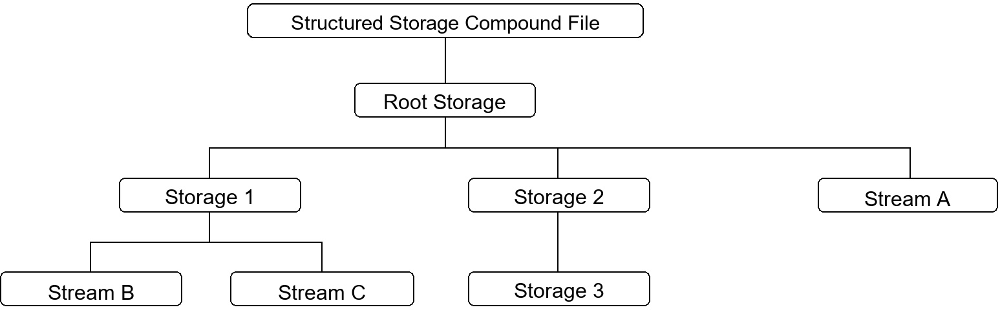

# Content Embed Kit Terminology

<!--Kit: Content Embed Kit-->
<!--Subsystem: officeservice -->
<!--Owner: @qq_41146650-->
<!--Designer: @gcw_nDnzjzHO;@wei-guoning-->
<!--Tester: @sd_yinjian-->
<!--Adviser: @jinqiuheng-->

This topic describes terms related to Content Embed Kit.

## OE

OE is short for Object Editor. It refers to the object editing framework and technology provided by OpenHarmony for inter-application document embedding and collaborative editing.

## OE Document

An embedded document implemented using OE. In a client UI, an OE document can be displayed as a thumbnail or snapshot. It can also be serialized in a standard format as a segment of binary data and stored in memory or in a file.

## OE Format File

A data format in which object data that complies with the object linking and embedding standard format is serialized into a binary data stream and persistently stored in the file system.

## OE Document Storage Structure

An OE document is a compound file that uses structured storage. Structured storage defines how a single file can be treated as a hierarchical collection consisting of two types of objects: storage objects and stream objects. These two object types are represented as directories and files, respectively, as shown below.

- root storage object: A special storage object in a compound file that acts as the root node. It is not only the top-level parent object in the hierarchy of storage objects and stream objects, but also the object that must be accessed before any child storage object or stream object can be accessed.
- storage object: An object in a compound file, similar to a directory in a file system. The parent of a storage object must be another storage object or the root storage object.
- stream object: An object in a compound file, similar to a file in a file system. The parent of a stream object must be a storage object or the root storage object.

## OEID

A system-recognizable identifier of an **OE document**. It is included in the document. The system locates and loads the OE server application that supports the OE document based on the OEID, thereby enabling editing.

## OE Extension

An [ExtensionAbility component](../application-models/extensionability-overview.md) provided by Content Embed Kit for third-party applications to implement embedding and editing capabilities for documents in specific formats.

## OE SA

OE SA is a system service that runs in an independent process. As the core scheduling and management module of OE, it interacts with underlying system capabilities, provides support for the upper-layer framework, and provides registration and management capabilities for the corresponding OE ExtensionAbility.

## Client OE Object

A program object used by client developers to encapsulate object embedding and editing for an OE document. It can also interact with the OE server.

## Server OE Object

A program object used by server developers to encapsulate object embedding and editing for an OE document. It points to the same OE document as the client OE object and can interact with the client OE object.

## AMS

AMS (Ability Manager Service): Provides internal `ConnectExtensionAbility/DisconnectExtensionAbility` APIs for **OE SA** to start and stop OE Extensions.

## BMS

BMS (Bundle Manager Service): Provides **OE SA** with the capability to query OE Extension information registered by installed applications, and supports dynamic addition, modification, and deletion of OE Extension information through event notifications.
