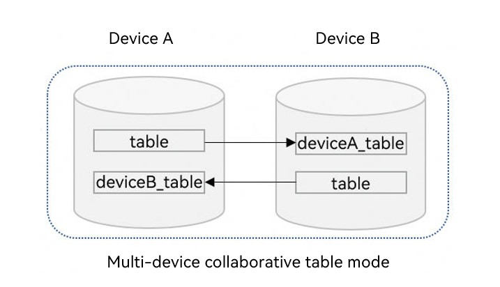
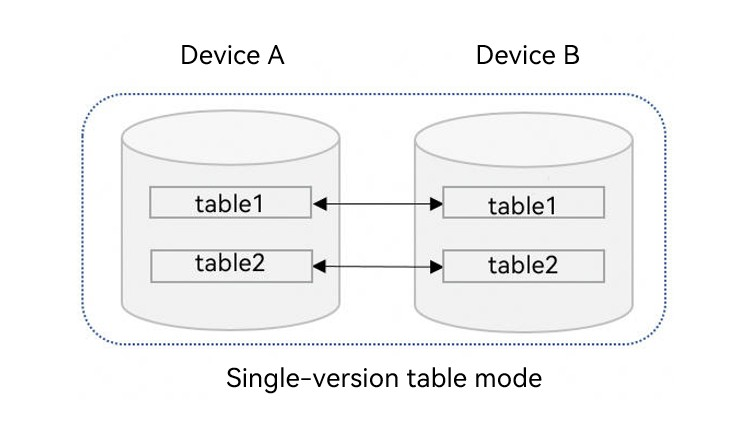

# Cross-Device Sync of RDB Stores (ArkTS)
<!--Kit: ArkData-->
<!--Subsystem: DistributedDataManager-->
<!--Owner: @baijidong-->
<!--Designer: @widecode; @htt1997-->
<!--Tester: @yippo; @logic42-->
<!--Adviser: @ge-yafang-->


## When to Use

You can sync the application data in a local RDB store on a device to other devices that form a Super Device.


## Basic Concepts

OpenHarmony supports sync of the relational data of an application across multiple devices.

- Distributed table: a database table that supports data sync across multiple devices in the network cluster. Data from other devices is synced to the local device and stored under table names associated with the corresponding device ID. Prior to API version 23, only the multi-device collaborative table mode was supported by default. Starting from API version 23, the single-version table mode is supported.
- Data sync: Changes to distributed tables in the database on a device are synced to other devices in the network cluster. Data can be synced between devices in either of the following ways: pushing data from a local device to a remote device and pulling data from a remote device to a local device.
- Data change notification: When data changes on other devices in the network cluster are synced to the current device, the registered callback function is executed.

## Working Principles

After completing device discovery and authentication, the underlying communication component notifies the application that the device goes online. The **DatamgrService** then establishes an encrypted transmission channel to sync data between the two devices.


### Cross-Device Data Sync Mechanism


After writing data to an RDB store, the service sends a sync request to the **DatamgrService**.

The **DatamgrService** reads the data to be synced from the application sandbox and sends the data to the **DatamgrService** of the target device based on the **deviceId** of the peer device. Then, the **DatamgrService** writes the data to the RDB of the same application.


### Data Change Notification Mechanism

When data is added, deleted, or modified, a notification is sent to the subscriber. The notifications can be classified into the following types:

- Local data change notification: subscription of the application data changes on the local device. When the data in the local KV store is added, deleted, or modified in the database, a notification is received.

- Distributed data change notification: subscription of the application data changes of other devices in the network. When the data in the local RDB store changes after being synced with data from another device in the same network, a notification is received.

### Data Sync Storage Mechanism

By default, cross-device data sync uses the multi-device collaborative table mode for management. Starting from API version 23, the single-version table mode is supported for data storage.

**Multi-device collaborative table mode**

In this mode, data on each device is stored in isolation in an independent distributed table instead of being written to the local table. The name of the distributed table is formed by prepending the peer device's **deviceID** to the original table name, as shown in the following figure.

When a device receives data synchronized from another device, the data is automatically written to the corresponding distributed table. You can obtain the table name via **obtainDistributedTableName** and query the data.

Note that modification of data synchronized from other devices is not supported in this mode. This restriction ensures data consistency and the stability of sync logic.



**Single-version table mode**

In this mode, synced data is written to the local table, as shown in the following figure.

To perform cross-device sync in the single-version table mode, you need to configure a schema file and specify the columns to be synced and the conflict resolution columns. This mode supports modifying the data synced from peer devices.



## Constraints

- A maximum of 16 RDB stores can be opened simultaneously for an application.

- Each RDB store supports a maximum of eight callbacks for subscription of data change notifications.

- A table containing composite keys cannot be set as a distributed table.

- To use the single-version table mode, you need to configure a schema file to specify the columns to be synced and the conflict resolution columns. For details, see [Using Single-Version Table Mode for Data Sync](#using-single-version-table-mode-for-data-sync).

- A table cannot be configured as both a device-to-device distributed table and a device-to-cloud distributed table simultaneously, and such configuration is not switchable.

- All device-to-device distributed tables under the same RDB store must adopt the same data sync and storage mechanism, and the mechanism does not support switching.

- The multi-device collaborative table mode does not support schema configuration, and the schema file is not read by default.

## Available APIs

The following table lists the APIs for cross-device data sync of RDB stores. Most of the APIs are executed asynchronously, using a callback or promise to return the result. The following table uses the callback-based APIs as an example. For more information about the APIs, see [RDB Store](../reference/apis-arkdata/arkts-apis-data-relationalStore.md).

| API| Description| 
| -------- | -------- |
| setDistributedTables(tables: Array&lt;string&gt;, callback: AsyncCallback&lt;void&gt;): void | Sets the distributed tables to be synced. Only the multi-device collaborative table mode is supported.| 
| setDistributedTables(tables: Array&lt;string&gt;, type: DistributedType, config: DistributedConfig, callback: AsyncCallback&lt;void&gt;): void | Sets the distributed tables to be synced.| 
| sync(mode: SyncMode, predicates: RdbPredicates, callback: AsyncCallback&lt;Array&lt;[string, number]&gt;&gt;): void | Synchronizes data across devices.| 
| on(event: 'dataChange', type: SubscribeType, observer: Callback&lt;Array&lt;string&gt;&gt;): void | Subscribes to changes in the distributed data.| 
| off(event:'dataChange', type: SubscribeType, observer: Callback&lt;Array&lt;string&gt;&gt;): void | Unsubscribe from changes in the distributed data.| 
| obtainDistributedTableName(device: string, table: string, callback: AsyncCallback&lt;string&gt;): void | Obtains the table name on the specified device based on the local table name. Only the multi-device collaborative table mode is supported.| 
| remoteQuery(device: string, table: string, predicates: RdbPredicates, columns: Array&lt;string&gt; , callback: AsyncCallback&lt;ResultSet&gt;): void | Queries data from the RDB store of a remote device based on specified conditions.| 


## Using Multi-device Collaborative Table Mode for Data Sync

> **NOTE**
>
> The security level of the destination device (to which data is synced) cannot be higher than that of the source device. For details, see [Access Control Mechanism in Cross-Device Sync](access-control-by-device-and-data-level.md#access-control-mechanism-in-cross-device-sync).

1. Import the related modules.
   <!--@[sync_import](https://gitcode.com/openharmony/applications_app_samples/blob/master/code/DocsSample/ArkData/RelationalStore/DataSyncAndPersistence/entry/src/main/ets/pages/datasync/RdbDataSync.ets)--> 
   
   ``` TypeScript
   import { relationalStore } from '@kit.ArkData'; // Import modules.
   import { BusinessError } from '@kit.BasicServicesKit';
   import { distributedDeviceManager } from '@kit.DistributedServiceKit';
   import { hilog } from '@kit.PerformanceAnalysisKit';
   import { common } from '@kit.AbilityKit';
   import { UIContext } from '@kit.ArkUI';
   const DOMAIN = 0x0000;
   ```

2. Request permissions.

   1. Declare the **ohos.permission.DISTRIBUTED_DATASYNC** permission. For details, see [Declaring Permissions](../security/AccessToken/declare-permissions.md).
   2. Display a dialog box to ask for authorization from the user when the application is started for the first time. For details, see [Requesting User Authorization](../security/AccessToken/request-user-authorization.md).

3. Create an RDB store and a data table, and set the data table that requires cross-device data sync as a distributed table. By default, the multi-device collaborative table mode is used for data storage and management.
   <!--@[setDefaultDistributedTables](https://gitcode.com/openharmony/applications_app_samples/blob/master/code/DocsSample/ArkData/RelationalStore/DataSyncAndPersistence/entry/src/main/ets/pages/datasync/RdbDataSync.ets)--> 
   
   ``` TypeScript
   const context = new UIContext().getHostContext() as common.UIAbilityContext;
   let store: relationalStore.RdbStore | undefined = undefined;
   // ...
     const STORE_CONFIG: relationalStore.StoreConfig = {
       name: 'RdbTest.db', // Database file name.
       securityLevel: relationalStore.SecurityLevel.S3 // Database security level.
     };
     // Open the database and set the distributed table.
     relationalStore.getRdbStore(context, STORE_CONFIG).then(async (rdbStore: relationalStore.RdbStore) => {
       store = rdbStore;
       await store.executeSql('CREATE TABLE IF NOT EXISTS EMPLOYEE (ID INTEGER PRIMARY KEY AUTOINCREMENT, NAME TEXT NOT NULL, AGE INTEGER, SALARY REAL, CODES BLOB)');
       // Set the created table as a distributed table.
       await store.setDistributedTables(['EMPLOYEE']);
     }).catch((err: BusinessError) => {
       hilog.error(DOMAIN, 'rdbDataSync', `Get RdbStore failed, code is ${err.code}, message is ${err.message}`);
     });
   ```

4. Subscribe to data changes of other devices in the network cluster.
   1. Call [on('dataChange')](../reference/apis-arkdata/arkts-apis-data-relationalStore-RdbStore.md#ondatachange) to listen for data changes of other devices. This API is called when data changes and is synced to the current device. The input parameter is the list of device IDs whose data changes.
   2. Obtain the distributed table name corresponding to the device based on the device ID and query data in the distributed table.
   <!--@[on_data_change](https://gitcode.com/openharmony/applications_app_samples/blob/master/code/DocsSample/ArkData/RelationalStore/DataSyncAndPersistence/entry/src/main/ets/pages/datasync/RdbDataSync.ets)--> 
   
   ``` TypeScript
   // Subscribe to data changes of other devices in the network cluster.
   if (store) {
     try {
       // Query the device list in the network cluster.
       const deviceManager = distributedDeviceManager.createDeviceManager('com.example.rdbDataSync');
       const deviceList = deviceManager.getAvailableDeviceListSync();
       const devices: string[] = [];
       deviceList.forEach(item => {
         if (item.networkId) {
           devices.push(item.networkId);
         }
       });
       // Register an observer to listen for the changes of the distributed data.
       // When data in the RDB store changes, the registered callback will be invoked to return the data changes.
       store.on('dataChange', relationalStore.SubscribeType.SUBSCRIBE_TYPE_REMOTE, async (devices) => {
         for (let i = 0; i < devices.length; i++) {
           let device = devices[i];
           if (!store) {
             return;
           }
           hilog.info(DOMAIN, 'rdbDataSync', `The data of device:${device} has been changed.`);
           // Obtain the distributed table name.
           const distributedTableName = await store.obtainDistributedTableName(device, 'EMPLOYEE');
           // Create a query predicate to query data in the distributed table.
           const predicates = new relationalStore.RdbPredicates(distributedTableName);
           const resultSet = await store.query(predicates);
           hilog.info(DOMAIN, 'rdbDataSync', `device ${device}, table EMPLOYEE rowCount is: ${resultSet.rowCount}`);
         }
       });
     } catch (err) {
       hilog.error(DOMAIN, 'rdbDataSync', `Failed to register observer. Code:${err.code},message:${err.message}`);
     }
   }
   ```

5. Sync data changes of the current device to other devices in the network cluster.
   1. After the data in the distributed table of the current device changes, the [sync](../reference/apis-arkdata/arkts-apis-data-relationalStore-RdbStore.md#sync-1) API of **RdbStore** is called to pass the [SYNC_MODE_PUSH](../reference/apis-arkdata/arkts-apis-data-relationalStore-e.md#syncmode) parameter to push data changes to other devices.
   2. Use the [inDevices](../reference/apis-arkdata/arkts-apis-data-relationalStore-RdbPredicates.md#indevices) method of the predicate to specify the target device for receiving data changes.
  
   <!--@[data_sync_push](https://gitcode.com/openharmony/applications_app_samples/blob/master/code/DocsSample/ArkData/RelationalStore/DataSyncAndPersistence/entry/src/main/ets/pages/datasync/RdbDataSync.ets)--> 
   
   ``` TypeScript
   // Sync data changes of the current device to other devices in the network cluster.
   if (store) {
     // Insert new data into the distributed data table of the current device.
     const ret = store.insertSync('EMPLOYEE', {
       name: 'sync_me',
       age: 18,
       salary: 666
     });
     hilog.info(DOMAIN, 'rdbDataSync', 'Insert to distributed table EMPLOYEE, result: ' + ret);
     // Query the device list in the network cluster.
     const deviceManager = distributedDeviceManager.createDeviceManager('com.example.rdbDataSync');
     const deviceList = deviceManager.getAvailableDeviceListSync();
     const syncTarget: string[] = [];
     deviceList.forEach(item => {
       if (item.networkId) {
         syncTarget.push(item.networkId);
       }
     });
     if (syncTarget.length === 0) {
       hilog.error(DOMAIN, 'rdbDataSync', 'no device to sync');
     } else {
       // Construct the predicate object for synchronizing the distributed table.
       const predicates = new relationalStore.RdbPredicates('EMPLOYEE');
       // Specify devices to be synced.
       predicates.inDevices(syncTarget);
       try {
         // Call the sync API to push the data changes from the current device to other devices in the network cluster.
         const result = await store.sync(relationalStore.SyncMode.SYNC_MODE_PUSH, predicates);
         hilog.info(DOMAIN, 'rdbDataSync', 'Push data success.');
         // Obtain the sync result.
         for (let i = 0; i < result.length; i++) {
           const deviceId = result[i][0];
           const syncResult = result[i][1];
           if (syncResult === 0) {
             hilog.info(DOMAIN, 'rdbDataSync', `device:${deviceId} sync success`);
           } else {
             hilog.error(DOMAIN, 'rdbDataSync', `device:${deviceId} sync failed, status:${syncResult}`);
           }
         }
       } catch (e) {
         hilog.error(DOMAIN, 'rdbDataSync', 'Push data failed, code: ' + e.code + ', message: ' + e.message);
       }
     }
   }
   ```

6. Obtain the data changes of other devices in the network cluster.
   1. The current device can call the [sync](../reference/apis-arkdata/arkts-apis-data-relationalStore-RdbStore.md#sync-1) API of **RdbStore** and pass the [SYNC_MODE_PULL](../reference/apis-arkdata/arkts-apis-data-relationalStore-e.md#syncmode) parameter to pull data changes from other devices in the network cluster.
   2. Use the [inDevices](../reference/apis-arkdata/arkts-apis-data-relationalStore-RdbPredicates.md#indevices) method of the predicate to specify the target device.
   
   <!--@[data_sync_pull](https://gitcode.com/openharmony/applications_app_samples/blob/master/code/DocsSample/ArkData/RelationalStore/DataSyncAndPersistence/entry/src/main/ets/pages/datasync/RdbDataSync.ets)--> 
   
   ``` TypeScript
   // Obtain the data changes of other devices in the network cluster.
   if (store) {
     // Query the device list in the network cluster.
     const deviceManager = distributedDeviceManager.createDeviceManager('com.example.rdbDataSync');
     const deviceList = deviceManager.getAvailableDeviceListSync();
     const syncTarget: string[] = [];
     deviceList.forEach(item => {
       if (item.networkId) {
         syncTarget.push(item.networkId);
       }
     });
     if (syncTarget.length === 0) {
       hilog.error(DOMAIN, 'rdbDataSync', 'no device to pull data');
     } else {
       // Construct the predicate object for synchronizing the distributed table.
       const predicates = new relationalStore.RdbPredicates('EMPLOYEE');
       // Specify devices to be synced.
       predicates.inDevices(syncTarget);
       try {
         // Call the sync API to pull data changes from other devices to the current device.
         const result = await store.sync(relationalStore.SyncMode.SYNC_MODE_PULL, predicates);
         hilog.info(DOMAIN, 'rdbDataSync', 'Pull data success.');
         // Obtain the sync result.
         for (let i = 0; i < result.length; i++) {
           const deviceId = result[i][0];
           const syncResult = result[i][1];
           if (syncResult === 0) {
             hilog.info(DOMAIN, 'rdbDataSync', `device:${deviceId} sync success`);
           } else {
             hilog.error(DOMAIN, 'rdbDataSync', `device:${deviceId} sync failed, status:${syncResult}`);
           }
         }
       } catch (e) {
         hilog.error(DOMAIN, 'rdbDataSync', 'Pull data failed, code: ' + e.code + ', message: ' + e.message);
       }
     }
   }
   ```

7. If data sync is not complete or not triggered, use the [remoteQuery](../reference/apis-arkdata/arkts-apis-data-relationalStore-RdbStore.md#remotequery-1) method of **RdbStore** to query the data in the distributed table on a specified device in the network cluster.
   <!--@[data_remote_query](https://gitcode.com/openharmony/applications_app_samples/blob/master/code/DocsSample/ArkData/RelationalStore/DataSyncAndPersistence/entry/src/main/ets/pages/datasync/RdbDataSync.ets)--> 
   
   ``` TypeScript
   // Query data of the distributed table on a specified device in the network cluster.
   if (store) {
     // Query the device list in the network cluster.
     const deviceManager = distributedDeviceManager.createDeviceManager('com.example.rdbDataSync');
     const deviceList = deviceManager.getAvailableDeviceListSync();
     const devices: string[] = [];
     deviceList.forEach(item => {
       if (item.networkId) {
         devices.push(item.networkId);
       }
     });
     if (devices.length === 0) {
       hilog.error(DOMAIN, 'rdbDataSync', 'no device to query data');
       return;
     }
     // Construct the predicate object for querying the distributed table.
     const predicates = new relationalStore.RdbPredicates('EMPLOYEE');
     try {
       // Query the distributed table on a specified device in the network cluster.
       const resultSet = await store.remoteQuery(devices[0], 'EMPLOYEE', predicates, ['ID', 'NAME', 'AGE', 'SALARY', 'CODES']);
       hilog.info(DOMAIN, 'rdbDataSync', `ResultSet column names: ${resultSet.columnNames}, column count: ${resultSet.columnCount}`);
     } catch (e) {
       hilog.error(DOMAIN, 'rdbDataSync', 'Remote query failed, code: ' + e.code + ', message: ' + e.message);
     }
   }
   ```

## Using Single-version Table Mode for Data Sync

Data sync using the single-version table mode follows basic development steps similar to those of the [multi-device collaborative table mode](#using-multi-device-collaborative-table-mode-for-data-sync). However, when creating a data table (that is, step 3 in *Using Multi-device Collaborative Table Mode for Data Sync*, you need to set the data table to be synced across devices to the **SINGLE_VERSION** type. An example is provided as follows.
   <!--@[setSingleDistributedTables](https://gitcode.com/openharmony/applications_app_samples/blob/master/code/DocsSample/ArkData/RelationalStore/DataSyncAndPersistence/entry/src/main/ets/pages/datasync/RdbDataSync.ets)--> 
   
   ``` TypeScript
   const context = new UIContext().getHostContext() as common.UIAbilityContext;
   let store: relationalStore.RdbStore | undefined = undefined;
   // ...
     const STORE_CONFIG: relationalStore.StoreConfig = {
       name: 'RdbTest.db', // Database file name.
       securityLevel: relationalStore.SecurityLevel.S3 // Database security level.
     };
     // Open the database and set the distributed table.
     const DISTRIBUTED_CONFIG: relationalStore.DistributedConfig = {
       autoSync: false,
       asyncDownloadAsset: false,
       enableCloud: false,
       tableType: relationalStore.DistributedTableType.SINGLE_VERSION
     }
     relationalStore.getRdbStore(context, STORE_CONFIG).then(async (rdbStore: relationalStore.RdbStore) => {
       store = rdbStore;
       await store.executeSql('CREATE TABLE IF NOT EXISTS EMPLOYEE (ID INTEGER PRIMARY KEY AUTOINCREMENT, NAME TEXT NOT NULL UNIQUE, AGE INTEGER, SALARY REAL, CODES BLOB)');
       await store.executeSql('CREATE TABLE IF NOT EXISTS EMPLOYEE2 (NAME TEXT NOT NULL UNIQUE, AGE INTEGER, SALARY REAL, CODES BLOB, PRIMARY KEY (NAME))');
       // Set the created table as a distributed table.
       await store.setDistributedTables(['EMPLOYEE', 'EMPLOYEE2'], relationalStore.DistributedType.DISTRIBUTED_DEVICE, DISTRIBUTED_CONFIG);
     }).catch((err: BusinessError) => {
       hilog.error(DOMAIN, 'rdbDataSync', `Get RdbStore failed, code is ${err.code}, message is ${err.message}`);
     });
   ```

In addition, when using the single-version table mode to perform data sync, you need to configure the schema file to specify the columns to be synced and the conflict resolution columns.

For details about the configuration and format requirements, see [Configuring Schema File](#configuring-schema-file).

## Configuring Schema File

When using the single-version table mode to perform data sync, you need to configure the schema file.

### Requirements for Schema File Name and Path

The schema file name and path cannot be customized. Otherwise, the corresponding file will not be read when the single-version table mode is used to perform data sync, and the distributed table setup will also fail.

-  File name: **sync_schema.json**

- File path: **../entry/src/main/resources/rawfile/arkdata/schema/sync_schema.json**

### Schema File Content Hierarchy and Directory Structure

The schema file is in JSON format. You can configure multiple databases in the **dbSchema** field.

- **dbSchema**: schema name, array[db], mandatory.
  - **version**: current schema version, which is of the integer type and mandatory.
  - **bundleName**: application bundle name, which is of the string type and mandatory.
  - **dbName**: database name, which is of the string type and mandatory. For example, the database name in the schema sample is **RdbTest.db**, so this parameter is set to **RdbTest** here.
  - **tables**: table information in the database, array[table].
    - **tableName**: table name, which is of the string type and mandatory.
    - **deviceSyncFields**: columns for device-to-device sync, array[string]. This field must be in the **fields** array and the database table; otherwise, data sync will not be performed. This field is mandatory—omitting it will result in distributed table setup failure.
    - **fields**: detailed information about the database table fields, array[field].
      - **columnName**: column name, which is of the string type and mandatory.
      - **type**: column type, which is of the string type and mandatory. The value can be ["Text", "Integer", "Long", "Float", "Double", "Blob"].
      - **primaryKey**: indicates whether the column is a conflict resolution column, which is irrelevant to the primary key in the table. The value is of the Boolean type. This field is mandatory for an auto-increment table. The value **true** means that the column is a conflict resolution column, and **false** means the opposite.
      - **autoIncrement**: indicates whether the column is auto-increment, which must be consistent with the corresponding table structure. The value is of the Boolean type. Cross-device data sync for RDB store does not support the sync of auto-increment primary keys. The value **true** means it is an auto-increment primary key, and **false** means the opposite. The default value is **false**.
      - **notNull**: indicates whether the filed is not null. The value is of the Boolean type. This field is optional. The value **true** means that the field is not null, and **false** means the opposite. The default value is **false**.

### Schema Sample

```json
{
    "dbSchema": [
      {
        "version": 0,
        "bundleName": "com.example.rdbDataSync",
        "dbName": "RdbTest",
        "tables": [
          {
            "tableName": "EMPLOYEE",
            "deviceSyncFields": ["NAME", "AGE", "SALARY", "CODES"],
            "fields": [
              {
                "columnName": "ID",
                "type": "Integer",
                "primaryKey": false,
                "notNull": false,
                "autoIncrement": true
              },
              {
                "columnName": "NAME",
                "type": "Text",
                "primaryKey": true,
                "notNull": true,
                "autoIncrement": false
              },
              {
                "columnName": "AGE",
                "type": "Integer",
                "primaryKey": false,
                "notNull": false,
                "autoIncrement": false
              },
              {
                "columnName": "SALARY",
                "type": "Float",
                "primaryKey": false,
                "notNull": false,
                "autoIncrement": false
              },
              {
                "columnName": "CODES",
                "type": "Blob",
                "primaryKey": false,
                "notNull": false,
                "autoIncrement": false
              }
            ]
          },
          {
            "tableName": "EMPLOYEE2",
            "deviceSyncFields": ["NAME", "AGE", "SALARY", "CODES"],
            "fields": [
              {
                "columnName": "NAME",
                "type": "Text",
                "primaryKey": true,
                "notNull": true,
                "autoIncrement": false
              },
              {
                "columnName": "AGE",
                "type": "Integer",
                "primaryKey": false,
                "notNull": false,
                "autoIncrement": false
              },
              {
                "columnName": "SALARY",
                "type": "Float",
                "primaryKey": false,
                "notNull": false,
                "autoIncrement": false
              },
              {
                "columnName": "CODES",
                "type": "Blob",
                "primaryKey": false,
                "notNull": false,
                "autoIncrement": false
              }
            ]
          }
        ]
      }
    ]
  }
```

### Schema Constraints and Examples

- Modification of the conflict resolution column is not supported
  
  Incorrect example: After the schema version is upgraded, the conflict resolution column is changed from "NAME" to "AGE".
    - Old schema version:
      ``` Json
      {
        "dbSchema": [
          {
            "version": 0,
            "bundleName": "com.example.rdbDataSync",
            "dbName": "RdbTest",
            "tables": [
              {
                "tableName": "EMPLOYEE",
                "deviceSyncFields": ["NAME", "AGE"],
                "fields": [
                  {
                    "columnName": "NAME",
                    "type": "Text",
                    "primaryKey": true,
                    "notNull": true,
                    "autoIncrement": false
                  },
                  {
                    "columnName": "AGE",
                    "type": "Integer",
                    "primaryKey": false,
                    "notNull": false,
                    "autoIncrement": false
                  }
                ]
              }
            ]
          }
        ]
      }
      ```
    - Upgraded schema version:
      ``` Json
      {
        "dbSchema": [
          {
            "version": 1,
            "bundleName": "com.example.rdbDataSync",
            "dbName": "RdbTest",
            "tables": [
              {
                "tableName": "EMPLOYEE",
                "deviceSyncFields": ["NAME", "AGE"],
                "fields": [
                  {
                    "columnName": "NAME",
                    "type": "Text",
                    "primaryKey": false,
                    "notNull": true,
                    "autoIncrement": false
                  },
                  {
                    "columnName": "AGE",
                    "type": "Integer",
                    "primaryKey": true,
                    "notNull": false,
                    "autoIncrement": false
                  }
                ]
              }
            ]
          }
        ]
      }
      ```

- Only one conflict resolution column is allowed.
  
  Incorrect example: Two conflict resolution columns, "NAME" and "AGE", are specified in the schema.

   ``` Json
   {
     "dbSchema": [
       {
         "version": 0,
         "bundleName": "com.example.rdbDataSync",
         "dbName": "RdbTest",
         "tables": [
           {
             "tableName": "EMPLOYEE",
             "deviceSyncFields": ["NAME", "AGE"],
             "fields": [
               {
                 "columnName": "NAME",
                 "type": "Text",
                 "primaryKey": true,
                 "notNull": true,
                 "autoIncrement": false
               },
               {
                 "columnName": "AGE",
                 "type": "Integer",
                 "primaryKey": true,
                 "notNull": false,
                 "autoIncrement": false
               }
             ]
           }
         ]
       }
     ]
   }
   ```

- The synced column must exist in the table.
  
  Incorrect example: The field "NAMe" specified in the schema has a case mismatch with the table field "NAME".
    - Table creation statement: 'CREATE TABLE IF NOT EXISTS EMPLOYEE (ID INTEGER PRIMARY KEY AUTOINCREMENT, NAME TEXT NOT NULL, AGE INTEGER, SALARY REAL, CODES BLOB)'
    - Schema:
      ``` Json
      {
        "dbSchema": [
          {
            "version": 0,
            "bundleName": "com.example.rdbDataSync",
            "dbName": "RdbTest",
            "tables": [
              {
                "tableName": "EMPLOYEE",
                "deviceSyncFields": ["NAMe", "AGE"],
                "fields": [
                  {
                    "columnName": "NAME",
                    "type": "Text",
                    "primaryKey": true,
                    "notNull": true,
                    "autoIncrement": false
                  },
                  {
                    "columnName": "AGE",
                    "type": "Integer",
                    "primaryKey": false,
                    "notNull": false,
                    "autoIncrement": false
                  }
                ]
              }
            ]
          }
        ]
      }
      ```

- When a synced column is modified, existing data will be re-synced. If a specified column is added to the schema, the existing synced column and the newly added synced column will trigger a re-sync of their data.

- **version** must be incremented when the schema is modified.
  
  Incorrect example: A new synced field "AGE" is added to the schema, but **version** is not incremented.
    - Old schema version:
      ``` Json
      {
        "dbSchema": [
          {
            "version": 0,
            "bundleName": "com.example.rdbDataSync",
            "dbName": "RdbTest",
            "tables": [
              {
                "tableName": "EMPLOYEE",
                "deviceSyncFields": ["NAME"],
                "fields": [
                  {
                    "columnName": "NAME",
                    "type": "Text",
                    "primaryKey": true,
                    "notNull": true,
                    "autoIncrement": false
                  },
                  {
                    "columnName": "AGE",
                    "type": "Integer",
                    "primaryKey": false,
                    "notNull": false,
                    "autoIncrement": false
                  }
                ]
              }
            ]
          }
        ]
      }
      ```
    - Upgraded schema version:
      ``` Json
      {
        "dbSchema": [
          {
            "version": 0,
            "bundleName": "com.example.rdbDataSync",
            "dbName": "RdbTest",
            "tables": [
              {
                "tableName": "EMPLOYEE",
                "deviceSyncFields": ["NAME", "AGE"],
                "fields": [
                  {
                    "columnName": "NAME",
                    "type": "Text",
                    "primaryKey": true,
                    "notNull": true,
                    "autoIncrement": false
                  },
                  {
                    "columnName": "AGE",
                    "type": "Integer",
                    "primaryKey": false,
                    "notNull": false,
                    "autoIncrement": false
                  }
                ]
              }
            ]
          }
        ]
      }
      ```

- In the single-version table mode, all **UNIQUE** columns in the table must be synced.
  
  Incorrect example: "AGE" is a **UNIQUE** column, but it is not specified as a synced field.
    - Table creation statement: 'CREATE TABLE IF NOT EXISTS EMPLOYEE (ID INTEGER PRIMARY KEY AUTOINCREMENT, NAME TEXT NOT NULL UNIQUE, AGE INTEGER UNIQUE, SALARY REAL, CODES BLOB)'
    - Schema:
      ``` Json
      {
        "dbSchema": [
          {
            "version": 0,
            "bundleName": "com.example.rdbDataSync",
            "dbName": "RdbTest",
            "tables": [
              {
                "tableName": "EMPLOYEE",
                "deviceSyncFields": ["NAME"],
                "fields": [
                  {
                    "columnName": "NAME",
                    "type": "Text",
                    "primaryKey": true,
                    "notNull": true,
                    "autoIncrement": false
                  },
                  {
                    "columnName": "AGE",
                    "type": "Integer",
                    "primaryKey": false,
                    "notNull": false,
                    "autoIncrement": false
                  }
                ]
              }
            ]
          }
        ]
      }
      ```

- In an auto-increment table, a non-primary key column cannot be specified as a conflict resolution column while the primary key is synced simultaneously.
  
  Incorrect example: In an auto-increment table, "NAME" is specified as the conflict resolution column and "ID" is synced simultaneously.
    - Table creation statement: 'CREATE TABLE IF NOT EXISTS EMPLOYEE (ID INTEGER PRIMARY KEY AUTOINCREMENT, NAME TEXT NOT NULL UNIQUE, AGE INTEGER, SALARY REAL, CODES BLOB)'
    - Schema:
      ``` Json
      {
        "dbSchema": [
          {
            "version": 0,
            "bundleName": "com.example.rdbDataSync",
            "dbName": "RdbTest",
            "tables": [
              {
                "tableName": "EMPLOYEE",
                "deviceSyncFields": ["ID", "NAME" ],
                "fields": [
                  {
                    "columnName": "ID",
                    "type": "Integer",
                    "primaryKey": false,
                    "notNull": false,
                    "autoIncrement": true
                  },
                  {
                    "columnName": "NAME",
                    "type": "Text",
                    "primaryKey": true,
                    "notNull": true,
                    "autoIncrement": false
                  }
                ]
              }
            ]
          }
        ]
      }
      ```

- During a schema version upgrade, the specified synced columns support only addition, not removal.
  
  Incorrect example:  The schema version is upgraded from 0 to 1, with the specified synced column "AGE" removed.
    - Old schema version:
      ``` Json
      {
        "dbSchema": [
          {
            "version": 0,
            "bundleName": "com.example.rdbDataSync",
            "dbName": "RdbTest",
            "tables": [
              {
                "tableName": "EMPLOYEE",
                "deviceSyncFields": ["NAME", "AGE"],
                "fields": [
                  {
                    "columnName": "NAME",
                    "type": "Text",
                    "primaryKey": true,
                    "notNull": true,
                    "autoIncrement": false
                  },
                  {
                    "columnName": "AGE",
                    "type": "Integer",
                    "primaryKey": false,
                    "notNull": false,
                    "autoIncrement": false
                  }
                ]
              }
            ]
          }
        ]
      }
      ```
    - Upgraded schema version:
      ``` Json
      {
        "dbSchema": [
          {
            "version": 1,
            "bundleName": "com.example.rdbDataSync",
            "dbName": "RdbTest",
            "tables": [
              {
                "tableName": "EMPLOYEE",
                "deviceSyncFields": ["NAME"],
                "fields": [
                  {
                    "columnName": "NAME",
                    "type": "Text",
                    "primaryKey": true,
                    "notNull": true,
                    "autoIncrement": false
                  },
                  {
                    "columnName": "AGE",
                    "type": "Integer",
                    "primaryKey": false,
                    "notNull": false,
                    "autoIncrement": false
                  }
                ]
              }
            ]
          }
        ]
      }
      ```

- **deviceSyncFields** cannot be empty and its length must be at least 1. If **deviceSyncFields** is not configured in the schema, the field is empty by default.
  
  Incorrect example: **deviceSyncFields** is not configured in the schema, which results in failure to set the distributed table in the single-version table mode.

   ``` Json
   {
     "dbSchema": [
       {
         "version": 0,
         "bundleName": "com.example.rdbDataSync",
         "dbName": "RdbTest",
         "tables": [
           {
             "tableName": "EMPLOYEE",
             "fields": [
               {
                 "columnName": "NAME",
                 "type": "Text",
                 "primaryKey": true,
                 "notNull": true,
                 "autoIncrement": false
               },
               {
                 "columnName": "AGE",
                 "type": "Integer",
                 "primaryKey": false,
                 "notNull": false,
                 "autoIncrement": false
               }
             ]
           }
         ]
       }
     ]
   }
   ```

- A **NOT NULL** column in the table must have a default value; otherwise, it must be specified as a synced column.
  
  Incorrect example: The "AGE" field is set as **NOT NULL** without a default value, and it is not specified as a synced column.
    - Table creation statement: 'CREATE TABLE IF NOT EXISTS EMPLOYEE (ID INTEGER PRIMARY KEY AUTOINCREMENT, NAME TEXT NOT NULL UNIQUE, AGE INTEGER NOT NULL, SALARY REAL, CODES BLOB)'
    - Schema:
      ``` Json
      {
        "dbSchema": [
          {
            "version": 0,
            "bundleName": "com.example.rdbDataSync",
            "dbName": "RdbTest",
            "tables": [
              {
                "tableName": "EMPLOYEE",
                "deviceSyncFields": ["NAME"],
                "fields": [
                  {
                    "columnName": "NAME",
                    "type": "Text",
                    "primaryKey": true,
                    "notNull": true,
                    "autoIncrement": false
                  },
                  {
                    "columnName": "AGE",
                    "type": "Integer",
                    "primaryKey": false,
                    "notNull": true,
                    "autoIncrement": false
                  }
                ]
              }
            ]
          }
        ]
      }
      ```

- For tables without a primary key, synced columns cannot be specified and the single-version table mode cannot be configured.
  
  Incorrect example: "EMPLOYEE" is a table without a primary key, which results in failure to set a distributed table in the single-version table mode.
    - Table creation statement: 'CREATE TABLE IF NOT EXISTS EMPLOYEE (NAME TEXT NOT NULL UNIQUE, AGE INTEGER, SALARY REAL, CODES BLOB)'
    - Schema:
      ``` Json
      {
        "dbSchema": [
          {
            "version": 0,
            "bundleName": "com.example.rdbDataSync",
            "dbName": "RdbTest",
            "tables": [
              {
                "tableName": "EMPLOYEE",
                "deviceSyncFields": ["NAME"],
                "fields": [
                  {
                    "columnName": "NAME",
                    "type": "Text",
                    "primaryKey": true,
                    "notNull": true,
                    "autoIncrement": false
                  },
                  {
                    "columnName": "AGE",
                    "type": "Integer",
                    "primaryKey": false,
                    "notNull": false,
                    "autoIncrement": false
                  }
                ]
              }
            ]
          }
        ]
      }
      ```

- If the primary key is not auto-increment, it must be a synced field, and the conflict resolution column must be the primary key.
  
  Incorrect example: "NAME" is a non-auto-increment primary key, but "AGE" is specified as the conflict resolution column.
    - Table creation statement: 'CREATE TABLE IF NOT EXISTS EMPLOYEE (NAME TEXT NOT NULL PRIMARY KEY, AGE INTEGER NOT NULL UNIQUE, SALARY REAL, CODES BLOB)'
    - Schema:
      ``` Json
      {
        "dbSchema": [
          {
            "version": 0,
            "bundleName": "com.example.rdbDataSync",
            "dbName": "RdbTest",
            "tables": [
              {
                "tableName": "EMPLOYEE",
                "deviceSyncFields": ["AGE"],
                "fields": [
                  {
                    "columnName": "NAME",
                    "type": "Text",
                    "primaryKey": false,
                    "notNull": true,
                    "autoIncrement": false
                  },
                  {
                    "columnName": "AGE",
                    "type": "Integer",
                    "primaryKey": true,
                    "notNull": false,
                    "autoIncrement": false
                  }
                ]
              }
            ]
          }
        ]
      }
      ```

- The conflict resolution column must be specified with the **UNIQUE** property and be a globally unique field, such as a UUID.
  
  Incorrect example: The **UNIQUE** property is not specified for the conflict resolution column "NAME".
    - Table creation statement: 'CREATE TABLE IF NOT EXISTS EMPLOYEE (ID INTEGER PRIMARY KEY AUTOINCREMENT, NAME TEXT NOT NULL, AGE INTEGER, SALARY REAL, CODES BLOB)'
    - Schema:
      ``` Json
      {
        "dbSchema": [
          {
            "version": 0,
            "bundleName": "com.example.rdbDataSync",
            "dbName": "RdbTest",
            "tables": [
              {
                "tableName": "EMPLOYEE",
                "deviceSyncFields": ["NAME", "AGE"],
                "fields": [
                  {
                    "columnName": "NAME",
                    "type": "Text",
                    "primaryKey": true,
                    "notNull": true,
                    "autoIncrement": false
                  },
                  {
                    "columnName": "AGE",
                    "type": "Integer",
                    "primaryKey": false,
                    "notNull": false,
                    "autoIncrement": false
                  }
                ]
              }
            ]
          }
        ]
      }
      ```

- All fields in **deviceSyncFields** must be present in the **fields** configuration; otherwise, any missing fields will not be synced.
  
  Incorrect example: The "AGE" field is not present in the **fields** configuration, so it will not be synced.
    - Table creation statement: 'CREATE TABLE IF NOT EXISTS EMPLOYEE (ID INTEGER PRIMARY KEY AUTOINCREMENT, NAME TEXT NOT NULL UNIQUE, AGE INTEGER, SALARY REAL, CODES BLOB)'
    - Schema:
      ``` Json
      {
        "dbSchema": [
          {
            "version": 0,
            "bundleName": "com.example.rdbDataSync",
            "dbName": "RdbTest",
            "tables": [
              {
                "tableName": "EMPLOYEE",
                "deviceSyncFields": ["NAME", "AGE"],
                "fields": [
                  {
                    "columnName": "NAME",
                    "type": "Text",
                    "primaryKey": true,
                    "notNull": true,
                    "autoIncrement": false
                  }
                ]
              }
            ]
          }
        ]
      }
      ```

- Global unique primary keys, such as UUIDs, must be synced. Auto-increment primary keys are not allowed to be synced. If the primary key is auto-increment, a non-primary key column must be configured as the conflict resolution column.
  
  Incorrect example: The "ID" field is specified for sync in the schema, and the field is an auto-increment primary key.
    - Table creation statement: 'CREATE TABLE IF NOT EXISTS EMPLOYEE (ID INTEGER PRIMARY KEY AUTOINCREMENT, NAME TEXT NOT NULL UNIQUE, AGE INTEGER, SALARY REAL, CODES BLOB)'
    - Schema:
      ``` Json
      {
        "dbSchema": [
          {
            "version": 0,
            "bundleName": "com.example.rdbDataSync",
            "dbName": "RdbTest",
            "tables": [
              {
                "tableName": "EMPLOYEE",
                "deviceSyncFields": ["ID", "NAME"],
                "fields": [
                  {
                    "columnName": "ID",
                    "type": "Integer",
                    "primaryKey": true,
                    "notNull": false,
                    "autoIncrement": true
                  },
                  {
                    "columnName": "NAME",
                    "type": "Text",
                    "primaryKey": false,
                    "notNull": true,
                    "autoIncrement": false
                  }
                ]
              }
            ]
          }
        ]
      }
      ```

- Values in the specified conflict resolution column must not be null. If the existing data in the specified conflict resolution column contains null, the distributed table fails to be set. If the incremental data in the specified conflict resolution column is null, the write operation fails.
  
  Incorrect example: Executing the write statement first will cause the distributed table setup statement to fail; executing the distributed table setup statement first will cause the write statement to fail.
    - Table creation statement: 'CREATE TABLE IF NOT EXISTS EMPLOYEE (ID INTEGER PRIMARY KEY AUTOINCREMENT, NAME TEXT UNIQUE, AGE INTEGER, SALARY REAL, CODES BLOB)'
    - Write statement:
      ``` TypeScript
      let valueBucket: ValueBucket = {};
      valueBucket["NAME"] = null;
      valueBucket["AGE"] = 25;
      valueBucket["SALARY"] = 23456.7;
      let value = new Uint8Array([1, 2, 3, 4, 5]);
      valueBucket["CODES"] = value;
      await rdbstore.insert("EMPLOYEE", valueBucket);
      ```
    - Distributed table setup statement:
      ``` TypeScript
      const DISTRIBUTED_CONFIG: relationalStore.DistributedConfig = {
        autoSync: false,
        asyncDownloadAsset: false,
        enableCloud: false,
        tableType: relationalStore.DistributedTableType.SINGLE_VERSION
      }
      await store.setDistributedTables(['EMPLOYEE'], relationalStore.DistributedType.DISTRIBUTED_DEVICE, DISTRIBUTED_CONFIG);
      ```
    - Schema:
      ``` Json
      {
        "dbSchema": [
          {
            "version": 0,
            "bundleName": "com.example.rdbDataSync",
            "dbName": "RdbTest",
            "tables": [
              {
                "tableName": "EMPLOYEE",
                "deviceSyncFields": ["NAME"],
                "fields": [
                  {
                    "columnName": "NAME",
                    "type": "Text",
                    "primaryKey": false,
                    "notNull": false,
                    "autoIncrement": false
                  }
                ]
              }
            ]
          }
        ]
      }
      ```
##  
