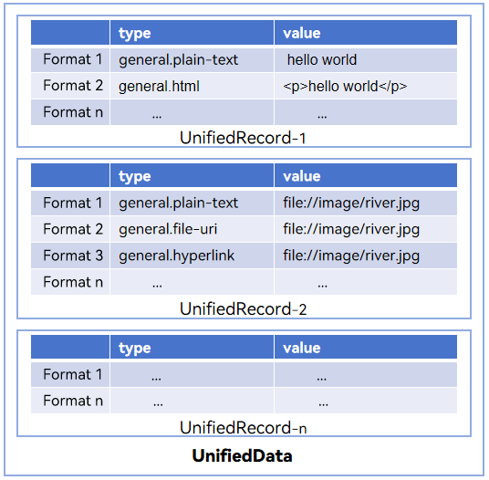

# Unified Data Definition Overview

<!--Kit: ArkData-->
<!--Subsystem: DistributedDataManager-->
<!--Owner: @jcwen-->
<!--Designer: @junathuawei1; @zph000-->
<!--Tester: @lj_liujing; @yippo; @logic42-->
<!--Adviser: @ge-yafang-->
<!-- md-trans-meta sourceCommit=a1b9555ca35e53d2ce1fb3e822613b1436be9250 translatedAt=2026-06-05T06:41:40.270Z pushedAt=2026-06-09T03:54:34.620Z -->

Efficient data interaction is critical for interaction between devices and applications. The Unified Data Management Framework (UDMF) provides unified data definitions for different applications and devices to reduce the costs in application and service data interaction.

The unified data definitions include [uniform type descriptors (UTDs)](uniform-data-type-descriptors.md) and [uniform data structs](uniform-data-structure.md).

## Basic Concepts

### UTD

A UTD defines data of the same type to eliminate data type ambiguity. It contains the data type ID and types to which the current data type belongs. UTDs are generally used to filter or identify the data type in file preview and file sharing.

### Uniform Data Struct

A uniform data struct defines the data of a certain type (UTD). Uniform data structs allow unified parsing standards to be used in data interaction, which minimizes the adaptation workload. Uniform data structs are used for data interaction across applications and devices, such as, the drag-and-drop operations.

### Multi-Entry Struct

During interactions between devices and applications, a single interaction may contain multiple records, and each record may have different representations (entries). To address this scenario, the concept of multi-entry struct is introduced. During an interaction, the data provider supplies different data entries for a record. After obtaining the data, the data consumer can retrieve the required entry from the record based on service requirements.

As shown in the preceding figure, **UnifiedRecord** identifies different records, which contain different data. In each **UnifiedRecord**, the same data is stored in different formats.