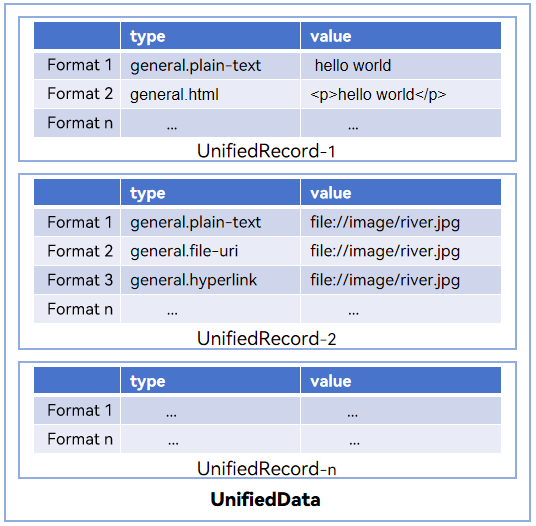

# Unified Data Definition Overview
<!--Kit: ArkData-->
<!--Subsystem: DistributedDataManager-->
<!--Owner: @jcwen-->
<!--Designer: @junathuawei1; @zph000-->
<!--Tester: @lj_liujing; @yippo; @logic42-->
<!--Adviser: @ge-yafang-->

Efficient data interaction is critical for interaction between devices and applications. The Unified Data Management Framework (UDMF) provides unified data definitions for different applications and devices to reduce the costs in application and service data interaction.

The unified data definitions include [uniform type descriptors (UTDs)](uniform-data-type-descriptors.md) and [uniform data structs](uniform-data-structure.md).

## Basic Concepts

### UTD

A UTD defines data of the same type to eliminate data type ambiguity. It contains the data type ID and types to which the current data type belongs. UTDs are generally used to filter or identify the data type in file preview and file sharing.

### Uniform Data Struct

A uniform data struct defines the data of a certain type (UTD). Uniform data structs allow unified parsing standards to be used in data interaction, which minimizes the adaptation workload. Uniform data structs are used for data interaction across applications and devices, such as, the drag-and-drop operations.

### Multi-Entry Struct

A single interaction between devices or applications may involve multiple records, each of which can have different representations. This leads to the multi-entry struct, which allows the same data to be presented in multiple formats in a unified data struct. During the interaction process, the data provider offers records in various formats, and the data consumer retrieves and uses data in a specific format based on service requirements.

As shown in the preceding figure, **UnifiedRecord** identifies different records, which contain different data. In each **UnifiedRecord**, the same data is stored in different formats.