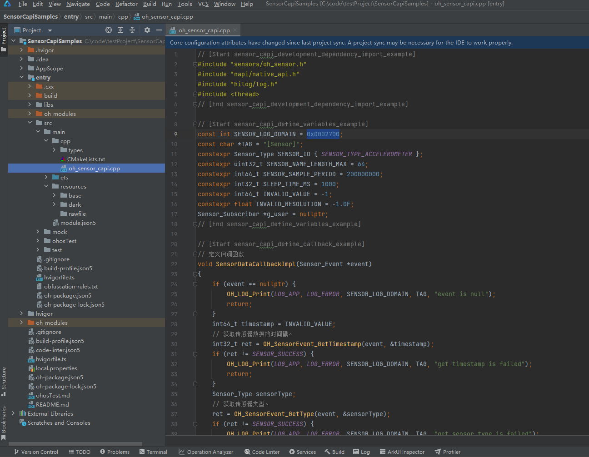

# Sensor Development (C/C++)
<!--Kit: Sensor Service Kit-->
<!--Subsystem: Sensors-->
<!--Owner: @dilligencer-->
<!--Designer: @butterls-->
<!--Tester: @murphy84-->
<!--Adviser: @hu-zhiqiong-->

## When to Use

With the sensor module, a device can obtain sensor data. For example, the device can subscribe to data of the orientation sensor to detect its own orientation, and data of the pedometer sensor to learn the number of steps the user walks every day.

For details about the APIs, see [Sensor](../../reference/apis-sensor-service-kit/capi-sensor.md).

## Function Description

| Name                                                        | Description                                                        |
| ------------------------------------------------------------ | ------------------------------------------------------------ |
| OH_Sensor_GetInfos(Sensor_Info **infos, uint32_t *count)     | Obtains information about all sensors on the device.                                |
| OH_Sensor_Subscribe(const Sensor_SubscriptionId *id, const Sensor_SubscriptionAttribute *attribute, const Sensor_Subscriber *subscriber) | Subscribe to sensor data. The system will report sensor data to the subscriber at the specified frequency.<br>To subscribe to data of acceleration sensors, request the **ohos.permission.ACCELEROMETER** permission.<br>To subscribe to data of gyroscope sensors, request the **ohos.permission.GYROSCOPE** permission.<br>To subscribe to data of pedometer-related sensors, request the **ohos.permission.ACTIVITY_MOTION** permission.<br>To subscribe to data of health-related sensors, such as heart rate sensors, request the **ohos.permission.READ_HEALTH_DATA** permission. Otherwise, the subscription fails.<br>You do not need to request any permission to subscribe to data of other types of sensors.|
| OH_Sensor_Unsubscribe(const Sensor_SubscriptionId *id, const Sensor_Subscriber *subscriber) | Unsubscribes from sensor data.<br>To unsubscribe from data of acceleration sensors, request the **ohos.permission.ACCELEROMETER** permission.<br>To unsubscribe from data of gyroscope sensors, request the **ohos.permission.GYROSCOPE** permission.<br>To unsubscribe from data of pedometer-related sensors, request the **ohos.permission.ACTIVITY_MOTION** permission.<br>To unsubscribe from data of health-related sensors, request the **ohos.permission.READ_HEALTH_DATA** permission. Otherwise, the unsubscription fails.<br>You do not need to request any permission to unsubscribe from data of other types of sensors.|
| OH_Sensor_CreateInfos(uint32_t count)                        | Creates an array of instances with the given number. For details, see [Sensor_Info](../../reference/apis-sensor-service-kit/capi-sensor-sensor-info.md).|
| OH_Sensor_DestroyInfos(Sensor_Info **sensors, uint32_t count) | Destroys the array of instances and reclaims the memory. For details, see [Sensor_Info](../../reference/apis-sensor-service-kit/capi-sensor-sensor-info.md).|
| OH_SensorInfo_GetName(Sensor_Info *sensor, char *sensorName, uint32_t *length) | Obtains the sensor name.                                            |
| OH_SensorInfo_GetVendorName(Sensor_Info* sensor, char *vendorName, uint32_t *length) | Obtains the sensor's vendor name.                                      |
| OH_SensorInfo_GetType(Sensor_Info* sensor, Sensor_Type *sensorType) | Obtains the sensor type.                                            |
| OH_SensorInfo_GetResolution(Sensor_Info* sensor, float *resolution) | Obtains the sensor resolution.                                          |
| OH_SensorInfo_GetMinSamplingInterval(Sensor_Info* sensor, int64_t *minSamplingInterval) | Obtains the minimum data reporting interval of a sensor.                              |
| OH_SensorInfo_GetMaxSamplingInterval(Sensor_Info* sensor, int64_t *maxSamplingInterval) | Obtains the maximum data reporting interval of a sensor.                          |
| OH_SensorEvent_GetType(Sensor_Event* sensorEvent, Sensor_Type *sensorType) | Obtains the sensor type.                                            |
| OH_SensorEvent_GetTimestamp(Sensor_Event* sensorEvent, int64_t *timestamp) | Obtains the timestamp of sensor data.                                    |
| OH_SensorEvent_GetAccuracy(Sensor_Event* sensorEvent, Sensor_Accuracy *accuracy) | Obtains the accuracy of sensor data.                                      |
| OH_SensorEvent_GetData(Sensor_Event* sensorEvent, float **data, uint32_t *length) | Obtains sensor data.<br>The data length and content depend on the sensor type. The format of the sensor data reported is as follows:<br>- SENSOR_TYPE_ACCELEROMETER: data[0], data[1], and data[2], indicating the acceleration around the x, y, and z axes of a device, respectively, in m/s².<br>- SENSOR_TYPE_GYROSCOPE: data[0], data[1], and data[2], indicating the angular velocity of rotation around the x, y, and z axes of a device, respectively, in rad/s.<br>- SENSOR_TYPE_AMBIENT_LIGHT: data[0], indicating the ambient light intensity, in lux. Since API version 12, two extra data records are returned, where **data[1]** indicates the color temperature (in kelvin), and **data[2]** indicates the infrared luminance (in cd/m²).<br> - SENSOR_TYPE_MAGNETIC_FIELD: data[0], data[1], and data[2], indicating the magnetic field strength around the x, y, and z axes of a device, respectively, in μT.<br>- SENSOR_TYPE_BAROMETER: data[0], indicating the atmospheric pressure, in hPa.<br>- SENSOR_TYPE_HALL: data[0], indicating the opening/closing state of the flip cover. The value **0** means that the flip cover is opened, and a value greater than 0 means that the flip cover is closed.<br>- SENSOR_TYPE_PROXIMITY: data[0], indicates the approaching state. The value **0** means the two objects are close to each other, and a value greater than 0 means that they are far away from each other.<br>- SENSOR_TYPE_ORIENTATION: data[0], data[1], and data[2], indicating the rotation angles of a device around the z, x, and y axes, respectively, in degree.<br>- SENSOR_TYPE_GRAVITY: data[0], data[1], and data[2], indicating the gravitational acceleration around the x, y, and z axes of a device, respectively, in m/s².<br>- SENSOR_TYPE_ROTATION_VECTOR: data[0], data[1] and data[2], indicating the rotation angles of a device around the x, y, and z axes, respectively, in degree. data[3] indicates the rotation vector.<br>- SENSOR_TYPE_PEDOMETER_DETECTION: data[0], indicating the pedometer detection status. The value **1** means that the number of detected steps changes.<br>- SENSOR_TYPE_PEDOMETER: data[0], indicating the number of steps a user has walked.<br>- SENSOR_TYPE_HEART_RATE: data[0], indicating the heart rate value.|
| OH_Sensor_CreateSubscriptionId(void)                         | Creates a **Sensor_SubscriptionId** instance.                        |
| OH_Sensor_DestroySubscriptionId(Sensor_SubscriptionId *id)   | Destroys a **Sensor_SubscriptionId** instance and reclaims memory.                  |
| OH_SensorSubscriptionId_SetType(Sensor_SubscriptionId* id, const Sensor_Type sensorType) | Sets the sensor type.                                            |
| OH_Sensor_CreateSubscriptionAttribute(void)                  | Creates a **Sensor_SubscriptionAttribute** instance.                      |
| OH_Sensor_DestroySubscriptionAttribute(Sensor_SubscriptionAttribute *attribute) | Destroys a **Sensor_SubscriptionAttribute** instance and reclaims memory.            |
| OH_SensorSubscriptionAttribute_SetSamplingInterval(Sensor_SubscriptionAttribute* attribute, const int64_t samplingInterval) | Sets the interval for reporting sensor data.                                    |
| OH_Sensor_CreateSubscriber(void)                             | Creates a **Sensor_Subscriber** instance.                             |
| OH_Sensor_DestroySubscriber(Sensor_Subscriber *subscriber)   | Destroys a **Sensor_Subscriber** instance and reclaims memory.                       |
| OH_SensorSubscriber_SetCallback(Sensor_Subscriber* subscriber, const Sensor_EventCallback callback) | Sets a callback function to report sensor data.                          |


## How to Develop

The following uses the acceleration sensor as an example to describe the development procedure.

1. Create a native C++ project.

   

2. Configure the acceleration sensor permission. For details, see [Declaring Permissions](../../security/AccessToken/declare-permissions.md).

   <!-- @[sensor_capi_permission_example](https://gitcode.com/openharmony/applications_app_samples/blob/master/code/BasicFeature/DeviceManagement/Sensor/SensorCapiSamples/entry/src/main/module.json5) --> 
   
   ``` JSON5
   "requestPermissions": [
     {
       "name": "ohos.permission.ACCELEROMETER"
     }
   ]
   ```

3. Add the dynamic dependency libraries into the **CMakeLists.txt** file.

   ```C
   target_link_libraries(entry PUBLIC libace_napi.z.so)
   target_link_libraries(entry PUBLIC libhilog_ndk.z.so)
   target_link_libraries(entry PUBLIC libohsensor.so)
   ```

4. Write the **oh_sensor_capi.cpp** file to import related modules.

   <!-- @[sensor_capi_development_dependency_import_example](https://gitcode.com/openharmony/applications_app_samples/blob/master/code/BasicFeature/DeviceManagement/Sensor/SensorCapiSamples/entry/src/main/cpp/oh_sensor_capi.cpp) --> 
   
   ``` C++
   #include "sensors/oh_sensor.h"
   #include "napi/native_api.h"
   #include "hilog/log.h"
   #include <thread>
   ```

5. Define constants.

   <!-- @[sensor_capi_define_variables_example](https://gitcode.com/openharmony/applications_app_samples/blob/master/code/BasicFeature/DeviceManagement/Sensor/SensorCapiSamples/entry/src/main/cpp/oh_sensor_capi.cpp) --> 
   
   ``` C++
   const int SENSOR_LOG_DOMAIN = 0xD002700;
   const char *TAG = "[Sensor]";
   constexpr Sensor_Type SENSOR_ID { SENSOR_TYPE_ACCELEROMETER };
   constexpr uint32_t SENSOR_NAME_LENGTH_MAX = 64;
   constexpr int64_t SENSOR_SAMPLE_PERIOD = 200000000;
   constexpr int32_t SLEEP_TIME_MS = 1000;
   constexpr int64_t INVALID_VALUE = -1;
   constexpr float INVALID_RESOLUTION = -1.0F;
   Sensor_Subscriber *g_user = nullptr;
   ```

6. Define a callback function to receive sensor data.

   <!-- @[sensor_capi_define_callback_example](https://gitcode.com/openharmony/applications_app_samples/blob/master/code/BasicFeature/DeviceManagement/Sensor/SensorCapiSamples/entry/src/main/cpp/oh_sensor_capi.cpp) --> 
   
   ``` C++
   // Define the callback.
   void SensorDataCallbackImpl(Sensor_Event *event)
   {
       if (event == nullptr) {
           OH_LOG_Print(LOG_APP, LOG_ERROR, SENSOR_LOG_DOMAIN, TAG, "event is null");
           return;
       }
       int64_t timestamp = INVALID_VALUE;
       // Obtain the timestamp of sensor data.
       int32_t ret = OH_SensorEvent_GetTimestamp(event, &timestamp);
       if (ret != SENSOR_SUCCESS) {
           OH_LOG_Print(LOG_APP, LOG_ERROR, SENSOR_LOG_DOMAIN, TAG, "get timestamp is failed");
           return;
       }
       Sensor_Type sensorType;
       // Obtain the sensor type.
       ret = OH_SensorEvent_GetType(event, &sensorType);
       if (ret != SENSOR_SUCCESS) {
           OH_LOG_Print(LOG_APP, LOG_ERROR, SENSOR_LOG_DOMAIN, TAG, "get sensor type is failed");
           return;
       }
       Sensor_Accuracy accuracy = SENSOR_ACCURACY_UNRELIABLE;
       // Obtain the accuracy of sensor data.
       ret = OH_SensorEvent_GetAccuracy(event, &accuracy);
       if (ret != SENSOR_SUCCESS) {
           OH_LOG_Print(LOG_APP, LOG_ERROR, SENSOR_LOG_DOMAIN, TAG, "get sensor accuracy is failed");
           return;
       }
       float *data = nullptr;
       uint32_t length = 0;
       // Obtain sensor data.
       ret = OH_SensorEvent_GetData(event, &data, &length);
       if (ret != SENSOR_SUCCESS) {
           OH_LOG_Print(LOG_APP, LOG_ERROR, SENSOR_LOG_DOMAIN, TAG, "get sensor data is failed");
           return;
       }
       if (data == nullptr) {
           OH_LOG_Print(LOG_APP, LOG_ERROR, SENSOR_LOG_DOMAIN, TAG, "sensor data is null");
           return;
       }
       OH_LOG_Print(LOG_APP, LOG_INFO, SENSOR_LOG_DOMAIN, TAG,
           "sensorType:%{public}d, dataLen:%{public}d, accuracy:%{public}d", sensorType, length, accuracy);
       for (uint32_t i = 0; i < length; ++i) {
           OH_LOG_Print(LOG_APP, LOG_INFO, SENSOR_LOG_DOMAIN, TAG, "data[%{public}d]:%{public}f", i, data[i]);
       }
   }
   ```

7. Obtain information about all sensors on the device. 

   <!-- @[sensor_capi_get_sensors_info_example](https://gitcode.com/openharmony/applications_app_samples/blob/master/code/BasicFeature/DeviceManagement/Sensor/SensorCapiSamples/entry/src/main/cpp/oh_sensor_capi.cpp) --> 
   
   ``` C++
   static int32_t GetSensorInfo(Sensor_Info *sensorInfoTemp)
   {
       char sensorName[SENSOR_NAME_LENGTH_MAX] = {};
       uint32_t length = SENSOR_NAME_LENGTH_MAX;
       // Obtain the sensor name.
       int32_t ret = OH_SensorInfo_GetName(sensorInfoTemp, sensorName, &length);
       if (ret != SENSOR_SUCCESS) {
           OH_LOG_Print(LOG_APP, LOG_ERROR, SENSOR_LOG_DOMAIN, TAG, "get sensor name is failed");
           return ret;
       }
       char vendorName[SENSOR_NAME_LENGTH_MAX] = {};
       length = SENSOR_NAME_LENGTH_MAX;
       // Obtain the sensor's vendor name.
       ret = OH_SensorInfo_GetVendorName(sensorInfoTemp, vendorName, &length);
       if (ret != SENSOR_SUCCESS) {
           OH_LOG_Print(LOG_APP, LOG_ERROR, SENSOR_LOG_DOMAIN, TAG, "get sensor vender name is failed");
           return ret;
       }
       Sensor_Type sensorType;
       // Obtain the sensor type.
       ret = OH_SensorInfo_GetType(sensorInfoTemp, &sensorType);
       if (ret != SENSOR_SUCCESS) {
           OH_LOG_Print(LOG_APP, LOG_ERROR, SENSOR_LOG_DOMAIN, TAG, "get sensor type is failed");
           return ret;
       }
       float resolution = INVALID_RESOLUTION;
       // Obtain the sensor resolution.
       ret = OH_SensorInfo_GetResolution(sensorInfoTemp, &resolution);
       if (ret != SENSOR_SUCCESS) {
           OH_LOG_Print(LOG_APP, LOG_ERROR, SENSOR_LOG_DOMAIN, TAG, "get sensor resolution is failed");
           return ret;
       }
       int64_t minSamplePeriod = INVALID_VALUE;
       // Obtain the minimum data reporting interval of a sensor.
       ret = OH_SensorInfo_GetMinSamplingInterval(sensorInfoTemp, &minSamplePeriod);
       if (ret != SENSOR_SUCCESS) {
           OH_LOG_Print(LOG_APP, LOG_ERROR, SENSOR_LOG_DOMAIN, TAG, "get sensor min sampling interval is failed");
           return ret;
       }
       int64_t maxSamplePeriod = INVALID_VALUE;
       // Obtain the maximum data reporting interval of a sensor.
       ret = OH_SensorInfo_GetMaxSamplingInterval(sensorInfoTemp, &maxSamplePeriod);
       if (ret != SENSOR_SUCCESS) {
           OH_LOG_Print(LOG_APP, LOG_ERROR, SENSOR_LOG_DOMAIN, TAG, "get sensor max sampling interval is failed");
       }
       return ret;
   }
   
   static napi_value GetSensorInfos(napi_env env, napi_callback_info info)
   {
       uint32_t count = 0;
       // Obtain the number of all sensors on the device.
       int32_t ret = OH_Sensor_GetInfos(nullptr, &count);
       if (ret != SENSOR_SUCCESS) {
           OH_LOG_Print(LOG_APP, LOG_ERROR, SENSOR_LOG_DOMAIN, TAG, "get sensor count is failed");
           return nullptr;
       }
       // Create an array of instances with the given number.
       Sensor_Info **sensors = OH_Sensor_CreateInfos(count);
       if (sensors == nullptr) {
           OH_LOG_Print(LOG_APP, LOG_ERROR, SENSOR_LOG_DOMAIN, TAG, "create sensorInfo array is failed");
           return nullptr;
       }
       // Obtain information about all sensors on the device.
       ret = OH_Sensor_GetInfos(sensors, &count);
       if (ret != SENSOR_SUCCESS) {
           OH_LOG_Print(LOG_APP, LOG_ERROR, SENSOR_LOG_DOMAIN, TAG, "get all sensor info is failed");
           return nullptr;
       }
       for (uint32_t i = 0; i < count; ++i) {
           Sensor_Info *sensorInfoTemp = sensors[i];
           ret = GetSensorInfo(sensorInfoTemp);
           if (ret != SENSOR_SUCCESS) {
               OH_LOG_Print(LOG_APP, LOG_ERROR, SENSOR_LOG_DOMAIN, TAG, "get sensor info failed");
               return nullptr;
           }
       }
       OH_LOG_Print(LOG_APP, LOG_INFO, SENSOR_LOG_DOMAIN, TAG, "GetSensorInfos successful");
       // Destroy the instance array and reclaim memory.
       ret = OH_Sensor_DestroyInfos(sensors, count);
       if (ret != SENSOR_SUCCESS) {
           OH_LOG_Print(LOG_APP, LOG_ERROR, SENSOR_LOG_DOMAIN, TAG, "destroy sensor info is failed");
           return nullptr;
       }
       return nullptr;
   }
   ```

8. Subscribe to and unsubscribe from sensor data.

   <!-- @[sensor_capi_subscriber_example](https://gitcode.com/openharmony/applications_app_samples/blob/master/code/BasicFeature/DeviceManagement/Sensor/SensorCapiSamples/entry/src/main/cpp/oh_sensor_capi.cpp) --> 
   
   ``` C++
   static napi_value Subscriber(napi_env env, napi_callback_info info)
   {
       // Create a Sensor_Subscriber instance.
       g_user = OH_Sensor_CreateSubscriber();
       // Set the callback used to return sensor data.
       int32_t ret = OH_SensorSubscriber_SetCallback(g_user, SensorDataCallbackImpl);
       if (ret != SENSOR_SUCCESS) {
           OH_LOG_Print(LOG_APP, LOG_ERROR, SENSOR_LOG_DOMAIN, TAG, "OH_SensorSubscriber_SetCallback failed");
           return nullptr;
       }
       // Create a Sensor_SubscriptionId instance.
       Sensor_SubscriptionId *id = OH_Sensor_CreateSubscriptionId();
       // Set the sensor type. For example, if you use SENSOR_TYPE_ACCELEROMETER, you need to request the ohos.permission.ACCELEROMETER permission.
       // Configure the required permission as instructed in step 2 in the Sensor Development.
       ret = OH_SensorSubscriptionId_SetType(id, SENSOR_ID);
       if (ret != SENSOR_SUCCESS) {
           OH_LOG_Print(LOG_APP, LOG_ERROR, SENSOR_LOG_DOMAIN, TAG, "OH_SensorSubscriptionId_SetType failed");
           return nullptr;
       }
       // Create a Sensor_SubscriptionAttribute instance.
       Sensor_SubscriptionAttribute *attr = OH_Sensor_CreateSubscriptionAttribute();
       // Set the sensor data reporting interval.
       ret = OH_SensorSubscriptionAttribute_SetSamplingInterval(attr, SENSOR_SAMPLE_PERIOD);
       if (ret != SENSOR_SUCCESS) {
           OH_LOG_Print(LOG_APP, LOG_ERROR, SENSOR_LOG_DOMAIN, TAG,
               "OH_SensorSubscriptionAttribute_SetSamplingInterval failed");
           return nullptr;
       }
       // Subscribe to sensor data.
       ret = OH_Sensor_Subscribe(id, attr, g_user);
       if (ret != SENSOR_SUCCESS) {
           OH_LOG_Print(LOG_APP, LOG_ERROR, SENSOR_LOG_DOMAIN, TAG, "OH_Sensor_Subscribe failed");
           return nullptr;
       }
       OH_LOG_Print(LOG_APP, LOG_INFO, SENSOR_LOG_DOMAIN, TAG, "OH_Sensor_Subscribe successful");
       std::this_thread::sleep_for(std::chrono::milliseconds(SLEEP_TIME_MS));
       // Unsubscribe from sensor data.
       ret = OH_Sensor_Unsubscribe(id, g_user);
       if (ret != SENSOR_SUCCESS) {
           OH_LOG_Print(LOG_APP, LOG_ERROR, SENSOR_LOG_DOMAIN, TAG, "OH_Sensor_Unsubscribe failed");
           return nullptr;
       }
       OH_LOG_Print(LOG_APP, LOG_INFO, SENSOR_LOG_DOMAIN, TAG, "OH_Sensor_Unsubscribe successful");
       if (id != nullptr) {
           // Destroy the Sensor_SubscriptionId instance.
           OH_Sensor_DestroySubscriptionId(id);
       }
       if (attr != nullptr) {
           // Destroy the Sensor_SubscriptionAttribute instance.
           OH_Sensor_DestroySubscriptionAttribute(attr);
       }
       if (g_user != nullptr) {
           // Destroy the Sensor_Subscriber instance and reclaim memory.
           OH_Sensor_DestroySubscriber(g_user);
           g_user = nullptr;
       }
       return nullptr;
   }
   ```

9. Add related APIs to the **Init** function.

   <!-- @[sensor_capi_init_example](https://gitcode.com/openharmony/applications_app_samples/blob/master/code/BasicFeature/DeviceManagement/Sensor/SensorCapiSamples/entry/src/main/cpp/oh_sensor_capi.cpp) --> 
   
   ``` C++
   EXTERN_C_START
   static napi_value Init(napi_env env, napi_value exports)
   {
       napi_property_descriptor desc[] = {
           {"getSensorInfos", nullptr, GetSensorInfos, nullptr, nullptr, nullptr, napi_default, nullptr},
           {"subscriber", nullptr, Subscriber, nullptr, nullptr, nullptr, napi_default, nullptr}
       };
       napi_define_properties(env, exports, sizeof(desc) / sizeof(desc[0]), desc);
       return exports;
   }
   EXTERN_C_END
   ```

10. Introduce the NAPI APIs to the **index.d.ts** file in **types/libentry**.

    <!-- @[sensor_capi_dependency_napi_example](https://gitcode.com/openharmony/applications_app_samples/blob/master/code/BasicFeature/DeviceManagement/Sensor/SensorCapiSamples/entry/src/main/cpp/types/libentry/Index.d.ts) --> 
    
    ``` TypeScript
    export const getSensorInfos: () => object;
    export const subscriber: () => object;
    ```

11. Write the application entry call code.

    <!-- @[sensor_capi_index_example](https://gitcode.com/openharmony/applications_app_samples/blob/master/code/BasicFeature/DeviceManagement/Sensor/SensorCapiSamples/entry/src/main/ets/pages/Index.ets) --> 
    
    ``` TypeScript
    import { BusinessError } from '@kit.BasicServicesKit';
    import { hilog } from '@kit.PerformanceAnalysisKit';
    import sensorCapi from 'libentry.so';
    
    const DOMAIN = 0xD002700;
    // ...
              try {
                sensorCapi.getSensorInfos();
                // ...
              } catch (error) {
                let e: BusinessError = error as BusinessError;
                hilog.error(DOMAIN, 'testTag', `Failed to invoke getSensorInfos. Code: ${e.code}, message: ${e.message}`);
              }
              // ...
              try {
                sensorCapi.subscriber();
                // ...
              } catch (error) {
                let e: BusinessError = error as BusinessError;
                hilog.error(DOMAIN, 'testTag', `Failed to invoke getSensorInfos. Code: ${e.code}, message: ${e.message}`);
              }
    ```
