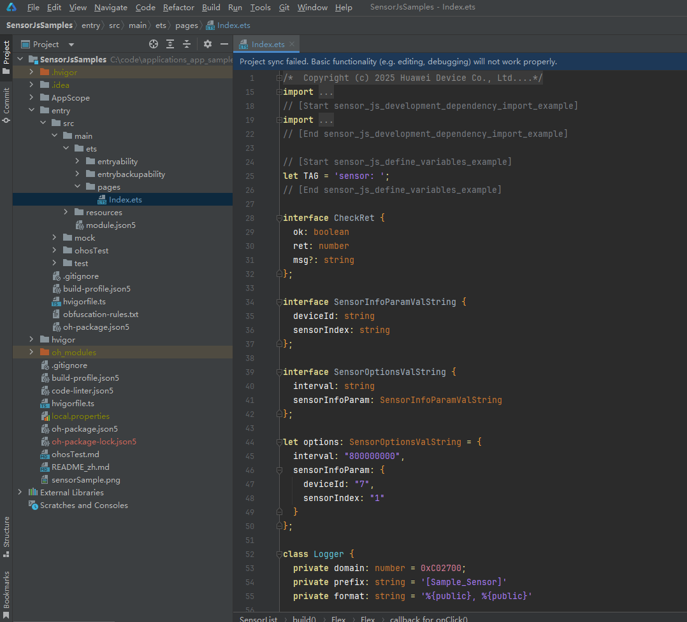

# Sensor Development (ArkTS)
<!--Kit: Sensor Service Kit-->
<!--Subsystem: Sensors-->
<!--Owner: @dilligencer-->
<!--Designer: @butterls-->
<!--Tester: @murphy84-->
<!--Adviser: @hu-zhiqiong-->

## When to Use

With the sensor module, a device can obtain sensor data. For example, the device can subscribe to data of the orientation sensor to detect its own orientation, and data of the pedometer sensor to learn the number of steps the user walks every day.

For details about the APIs, see [Sensor](../../reference/apis-sensor-service-kit/js-apis-sensor.md).


## Available APIs

| Name| Description                             |
| -------- |---------------------------------|
| sensor.on(sensorId, callback:AsyncCallback&lt;Response&gt;, options?: Options): void | Enables listening for data changes of the specified type of sensor.                   |
| sensor.on(type: 'sensorStatusChange', callback: Callback&lt;SensorStatusEvent&gt;): void | Enables listening for sensor status changes.|
| sensor.once(sensorId, callback:AsyncCallback&lt;Response&gt;): void | Enables one-time listening for sensor data changes.                   |
| sensor.off(sensorId, callback?:AsyncCallback&lt;void&gt;): void | Disables listening for data changes of the specified type of sensor.                    |
| sensor.off(sensorId, sensorInfoParam?: SensorInfoParam, callback?:AsyncCallback&lt;void&gt;): void | Disables listening for data changes of the specified type of sensor based on the given sensor parameters.            |
| sensor.off(type: 'sensorStatusChange', callback?: Callback&lt;SensorStatusEvent&gt;): void | Disables listening for sensor status changes.             |
| sensor.getSensorList(callback: AsyncCallback\<Array\<Sensor>>): void| Obtains information about all sensors on the device.                 |


## How to Develop

The acceleration sensor is used as an example.

1. Create a project.

   

2. Configure the acceleration sensor permission. For details, see [Declaring Permissions](../../security/AccessToken/declare-permissions.md).

   <!-- @[sensor_js_permission_example](https://gitcode.com/openharmony/applications_app_samples/blob/master/code/BasicFeature/DeviceManagement/Sensor/SensorJsSamples/entry/src/main/module.json5) -->

``` JSON5
    "requestPermissions": [
      {
        "name":"ohos.permission.ACCELEROMETER"
      }
    ],
```


3. Import the module.

   <!-- @[sensor_js_development_dependency_import_example](https://gitcode.com/openharmony/applications_app_samples/blob/master/code/BasicFeature/DeviceManagement/Sensor/SensorJsSamples/entry/src/main/ets/pages/Index.ets) -->

``` TypeScript
import { sensor } from '@kit.SensorServiceKit';
import { BusinessError } from '@kit.BasicServicesKit';
import hilog from '@ohos.hilog';
```


4. Define constants.

   <!-- @[sensor_js_define_variables_example](https://gitcode.com/openharmony/applications_app_samples/blob/master/code/BasicFeature/DeviceManagement/Sensor/SensorJsSamples/entry/src/main/ets/pages/Index.ets) -->

``` TypeScript
let TAG = 'sensor: ';
```


5. Obtain the list of all sensors on the device. If a sensor cannot be found, the sensor does not exist or is unavailable on the device. If you subscribe to events specific to this sensor, an exception will be thrown, and you need to implement the service logic to handle this exception.

    <!-- @[sensor_js_get_sensor_list_example](https://gitcode.com/openharmony/applications_app_samples/blob/master/code/BasicFeature/DeviceManagement/Sensor/SensorJsSamples/entry/src/main/ets/pages/Index.ets) -->

``` TypeScript
    try {
      sensor.getSensorList((error: BusinessError, data: Array<sensor.Sensor>) => {
          if (error) {
              console.error(TAG + 'getSensorList failed');
          } else {
              console.info('getSensorList success');
              for (let i = 0; i < data.length; i++) {
                  console.info(TAG + JSON.stringify(data[i]));
				// ···
              }
          }
      });
    } catch (error) {
      console.error(TAG + 'get list exception, code:' + error.code + 'msg:' + error.message);
      console.error(TAG + 'get list exception, msg:' + JSON.stringify(error));
    }
```


   

   The minimum and the maximum sampling periods supported by the sensor are 5000000 ns and 200000000 ns, respectively. The sampling interval may vary depending on the sensor type. The specified sampling interval must be within this range. If the configured value is smaller than the minimum sampling interval of the sensor, the minimum sampling interval is used. If the configured value is larger than the maximum sampling interval of the sensor, the maximum sampling interval is used. A smaller value means a higher reporting frequency and a higher power consumption.

   You can query sensors based on the given device ID.

   <!-- @[sensor_js_get_sensor_list_by_device_example](https://gitcode.com/openharmony/applications_app_samples/blob/master/code/BasicFeature/DeviceManagement/Sensor/SensorJsSamples/entry/src/main/ets/pages/Index.ets) -->
``` TypeScript
            try {
              this.deviceId = -1;
              // The deviceId parameter is optional. The default value is the ID of the local device.
              const sensorList: sensor.Sensor[] = sensor.getSensorListByDeviceSync(this.deviceId);
              console.info(`sensorList length: ${sensorList.length}`);
              console.info(`sensorList: ${JSON.stringify(sensorList)}`);
			// ···
            } catch (error) {
              let e: BusinessError = error as BusinessError;
              console.error(`Failed to get sensorList. Code: ${e.code}, message: ${e.message}`);
            }
```


   Query a sensor based on the specified device ID and sensor type.

   <!-- @[sensor_js_get_single_sensor_by_device_sync_example](https://gitcode.com/openharmony/applications_app_samples/blob/master/code/BasicFeature/DeviceManagement/Sensor/SensorJsSamples/entry/src/main/ets/pages/Index.ets) -->

``` TypeScript
            try {
              this.deviceId = -1;
              // The second deviceId is optional.
              const sensorList: sensor.Sensor[] = sensor.getSingleSensorByDeviceSync(sensor.SensorId.ACCELEROMETER, this.deviceId);
              console.info(`sensorList length: ${sensorList.length}`);
              console.info(`sensorList Json: ${JSON.stringify(sensorList)}`);
			// ···
            } catch (error) {
              let e: BusinessError = error as BusinessError;
              console.error(`Failed to get sensorList. Code: ${e.code}, message: ${e.message}`);
            }
```


6. Enable listening for sensor status changes. You can call **on()** or **once()** to listen for sensor data changes.

   The **on()** API is used to continuously listen for data changes of the sensor. The sensor reporting interval is set to 100000000 ns.

   <!-- @[sensor_js_on_accelerometer_example](https://gitcode.com/openharmony/applications_app_samples/blob/master/code/BasicFeature/DeviceManagement/Sensor/SensorJsSamples/entry/src/main/ets/pages/Index.ets) -->

``` TypeScript
                try { 
                  sensor.on(sensor.SensorId.ACCELEROMETER, (data: sensor.AccelerometerResponse) => {
                        console.info("Succeeded in obtaining data. x: " + data.x + " y: " + data.y + " z: " + data.z);
						// ···
                  }, { interval: 100000000 });
                } catch (error) {
                    let e: BusinessError = error as BusinessError;
                    console.error(`Failed to invoke on. Code: ${e.code}, message: ${e.message}`);
                }
```


   You can also specify SensorInfoParam, which is used to pass deviceId and sensorIndex.

   <!-- @[sensor_js_on_accelerometer_use_sensor_info_param_example](https://gitcode.com/openharmony/applications_app_samples/blob/master/code/BasicFeature/DeviceManagement/Sensor/SensorJsSamples/entry/src/main/ets/pages/Index.ets) -->

``` TypeScript
                try { 
                  sensor.on(sensor.SensorId.ACCELEROMETER, (data: sensor.AccelerometerResponse) => {
                        console.info("Succeeded in obtaining data. x: " + data.x + " y: " + data.y + " z: " + data.z);
						// ···
                  }, { interval: 100000000, sensorInfoParam: { deviceId: -1 } });
                } catch (error) {
                    let e: BusinessError = error as BusinessError;
                    console.error(`Failed to invoke on. Code: ${e.code}, message: ${e.message}`);
                }
```


   

   The **once()** API is used to perform one-time listening for sensor data changes.

   <!-- @[sensor_js_once_accelerometer_example](https://gitcode.com/openharmony/applications_app_samples/blob/master/code/BasicFeature/DeviceManagement/Sensor/SensorJsSamples/entry/src/main/ets/pages/Index.ets) -->

``` TypeScript
                try {
                  sensor.once(sensor.SensorId.ACCELEROMETER, (data: sensor.AccelerometerResponse) => {
                      console.info("Succeeded in obtaining data. x: " + data.x + " y: " + data.y + " z: " + data.z);
					// ···
                  });
                } catch (error) {
                  let e: BusinessError = error as BusinessError;
                  console.error(`Failed to invoke once. Code: ${e.code}, message: ${e.message}`);
                }
```


   

7. Disable listening for sensor status changes.

    Note that disabling listening without a prior subscription is an abnormal behavior and requires exception handling.

    <!-- @[sensor_js_off_accelerometer_example](https://gitcode.com/openharmony/applications_app_samples/blob/master/code/BasicFeature/DeviceManagement/Sensor/SensorJsSamples/entry/src/main/ets/pages/Index.ets) -->

``` TypeScript
                try {
                  sensor.off(sensor.SensorId.ACCELEROMETER);
                } catch (error) {
                  let e: BusinessError = error as BusinessError;
                  console.error(`Failed to invoke off. Code: ${e.code}, message: ${e.message}`);
                }
```


   Disables listening for sensor status changes based on the given sensor parameters.

   <!-- @[sensor_js_off_accelerometer_use_sensor_info_param_example](https://gitcode.com/openharmony/applications_app_samples/blob/master/code/BasicFeature/DeviceManagement/Sensor/SensorJsSamples/entry/src/main/ets/pages/Index.ets) -->

``` TypeScript
                try {
                  sensor.off(sensor.SensorId.ACCELEROMETER, { deviceId: -1 });
                } catch (error) {
                  let e: BusinessError = error as BusinessError;
                  console.error(`Failed to invoke off. Code: ${e.code}, message: ${e.message}`);
                }
```


8. Enable listening for sensor status changes. When receiving a device offline event, you need to call **off** to close the sensor on the device.

   In **SensorStatusEvent**, the following information is included: event timestamp, sensor ID, sensor index, online/offline status, device ID, and device name.

    <!-- @[sensor_js_on_sensor_status_change_example](https://gitcode.com/openharmony/applications_app_samples/blob/master/code/BasicFeature/DeviceManagement/Sensor/SensorJsSamples/entry/src/main/ets/pages/Index.ets) -->

``` TypeScript
            try {
              sensor.on('sensorStatusChange', (data: sensor.SensorStatusEvent) => {
                  console.info(`timestamp: ${data.timestamp},
                  deviceId: ${data.deviceId} deviceName: ${data.deviceName}
                  sensorId: ${data.sensorId} sensorIndex:${data.sensorIndex} isSensorOnline: ${data.isSensorOnline}`);
              });
			// ···
            } catch (error) {
              let e: BusinessError = error as BusinessError;
              console.error(`Failed to invoke on. Code: ${e.code}, message: ${e.message}`);
            }
```

   Disable listening for sensor status changes.

   <!-- @[sensor_js_off_sensor_status_change_example](https://gitcode.com/openharmony/applications_app_samples/blob/master/code/BasicFeature/DeviceManagement/Sensor/SensorJsSamples/entry/src/main/ets/pages/Index.ets) -->

``` TypeScript
            try {
              sensor.off('sensorStatusChange');
			// ···
            } catch (error) {
              let e: BusinessError = error as BusinessError;
              console.error(`Failed to invoke on. Code: ${e.code}, message: ${e.message}`);
            }
```


9. Obtain the geomagnetic field of a geographic location at a certain time.

   This API uses an asynchronous callback to return the result.

    <!-- @[sensor_js_get_geomagnetic_info_callback_example](https://gitcode.com/openharmony/applications_app_samples/blob/master/code/BasicFeature/DeviceManagement/Sensor/SensorJsSamples/entry/src/main/ets/pages/Index.ets) -->

``` TypeScript
            try {
              sensor.getGeomagneticInfo({ latitude: 80, longitude: 0, altitude: 0 }, 1580486400000,
                  (err: BusinessError, data: sensor.GeomagneticResponse) => {
                if (err) {
                  console.error(`Failed to get geomagneticInfo. Code: ${err.code}, message: ${err.message}`);
                  return;
                }
                console.info("Succeeded in getting geomagneticInfo x" + data.x);
                console.info("Succeeded in getting geomagneticInfo y" + data.y);
                console.info("Succeeded in getting geomagneticInfo z" + data.z);
                console.info("Succeeded in getting geomagneticInfo geomagneticDip" + data.geomagneticDip);
                console.info("Succeeded in getting geomagneticInfo deflectionAngle" + data.deflectionAngle);
                console.info("Succeeded in getting geomagneticInfo levelIntensity" + data.levelIntensity);
                console.info("Succeeded in getting geomagneticInfo totalIntensity" + data.totalIntensity);
              });
            } catch (error) {
              let e: BusinessError = error as BusinessError;
              console.error(`Failed to get geomagneticInfo. Code: ${e.code}, message: ${e.message}`);
            }
```


   This API uses a promise to return the result.

   <!-- @[sensor_js_get_geomagnetic_info_promise_example](https://gitcode.com/openharmony/applications_app_samples/blob/master/code/BasicFeature/DeviceManagement/Sensor/SensorJsSamples/entry/src/main/ets/pages/Index.ets) -->

``` TypeScript
            try {
              const promise = sensor.getGeomagneticInfo({ latitude: 80, longitude: 0, altitude: 0 }, 1580486400000);
              promise.then((data: sensor.GeomagneticResponse) => {
                console.info("Succeeded in getting geomagneticInfo x" + data.x);
                console.info("Succeeded in getting geomagneticInfo y" + data.y);
                console.info("Succeeded in getting geomagneticInfo z" + data.z);
                console.info("Succeeded in getting geomagneticInfo geomagneticDip" + data.geomagneticDip);
                console.info("Succeeded in getting geomagneticInfo deflectionAngle" + data.deflectionAngle);
                console.info("Succeeded in getting geomagneticInfo levelIntensity" + data.levelIntensity);
                console.info("Succeeded in getting geomagneticInfo totalIntensity" + data.totalIntensity);
              }, (err: BusinessError) => {
                console.error(`Failed to get geomagneticInfo. Code: ${err.code}, message: ${err.message}`);
              });
            } catch (error) {
              let e: BusinessError = error as BusinessError;
              console.error(`Failed to get geomagneticInfo. Code: ${e.code}, message: ${e.message}`);
            }
```


10. Obtain the altitude based on the atmospheric pressure.

    This API uses an asynchronous callback to return the result.

    <!-- @[sensor_js_get_device_altitude_callback_example](https://gitcode.com/openharmony/applications_app_samples/blob/master/code/BasicFeature/DeviceManagement/Sensor/SensorJsSamples/entry/src/main/ets/pages/Index.ets) -->

``` TypeScript
            try {
              let seaPressure = 1013.2;
              let currentPressure = 1500.0;
              sensor.getDeviceAltitude(seaPressure, currentPressure, (err: BusinessError, data: number) => {
                if (err) {
                  console.error(`Failed to get altitude. Code: ${err.code}, message: ${err.message}`);
                  return;
                }
                console.info('Succeeded in getting altitude: ' + data);
              });
            } catch (error) {
              let e: BusinessError = error as BusinessError;
              console.error(`Failed to get altitude. Code: ${e.code}, message: ${e.message}`);
            }
```


   This API uses a promise to return the result.

   <!-- @[sensor_js_get_device_altitude_promise_example](https://gitcode.com/openharmony/applications_app_samples/blob/master/code/BasicFeature/DeviceManagement/Sensor/SensorJsSamples/entry/src/main/ets/pages/Index.ets) -->

``` TypeScript
            try {
              let seaPressure = 1013.2;
              let currentPressure = 1500.0;
              const promise = sensor.getDeviceAltitude(seaPressure, currentPressure);
              promise.then((data: number) => {
                console.info('Succeeded in getting sensor_getDeviceAltitude_Promise', data);
              }, (err: BusinessError) => {
                console.error(`Failed to get altitude. Code: ${err.code}, message: ${err.message}`);
              });
            } catch (error) {
              let e: BusinessError = error as BusinessError;
              console.error(`Failed to get altitude. Code: ${e.code}, message: ${e.message}`);
            }
```


11. Obtain the magnetic dip based on the inclination matrix.

    This API uses an asynchronous callback to return the result.

    <!-- @[sensor_js_get_inclination_callback_example](https://gitcode.com/openharmony/applications_app_samples/blob/master/code/BasicFeature/DeviceManagement/Sensor/SensorJsSamples/entry/src/main/ets/pages/Index.ets) -->

``` TypeScript
            try {
              // inclinationMatrix can be 3*3 or 4*4.
              let inclinationMatrix = [
                1, 0, 0,
                0, 1, 0,
                0, 0, 1
              ]
              sensor.getInclination(inclinationMatrix, (err: BusinessError, data: number) => {
                if (err) {
                  console.error(`Failed to get inclination. Code: ${err.code}, message: ${err.message}`);
                  return;
                }
                console.info('Succeeded in getting inclination: ' + data);
              })
            } catch (error) {
              let e: BusinessError = error as BusinessError;
              console.error(`Failed to get inclination. Code: ${e.code}, message: ${e.message}`);
            }
```


   This API uses a promise to return the result.

   <!-- @[sensor_js_get_inclination_promise_example](https://gitcode.com/openharmony/applications_app_samples/blob/master/code/BasicFeature/DeviceManagement/Sensor/SensorJsSamples/entry/src/main/ets/pages/Index.ets) -->

``` TypeScript
            try {
              // inclinationMatrix can be 3*3 or 4*4.
              let inclinationMatrix = [
                1, 0, 0,
                0, 1, 0,
                0, 0, 1
              ]
              const promise = sensor.getInclination(inclinationMatrix);
              promise.then((data: number) => {
                console.info('Succeeded in getting inclination: ' + data);
              }, (err: BusinessError) => {
                console.error(`Failed to get inclination. Code: ${err.code}, message: ${err.message}`);
              });
            } catch (error) {
              let e: BusinessError = error as BusinessError;
              console.error(`Failed to get inclination. Code: ${e.code}, message: ${e.message}`);
            }
```


12. Obtain the angle change between two rotation matrices.

    This API uses an asynchronous callback to return the result.

    <!-- @[sensor_js_get_angle_variation_callback_example](https://gitcode.com/openharmony/applications_app_samples/blob/master/code/BasicFeature/DeviceManagement/Sensor/SensorJsSamples/entry/src/main/ets/pages/Index.ets) -->

``` TypeScript
            try {
              // The rotation matrix can be 3*3 or 4*4.
              let currentRotationMatrix = [
                1, 0, 0,
                0, 1, 0,
                0, 0, 1
              ];
              let preRotationMatrix = [
                1, 0, 0,
                0, 0.87, -0.50,
                0, 0.50, 0.87
              ];
              sensor.getAngleVariation(currentRotationMatrix, preRotationMatrix, (err: BusinessError, data: Array<number>) => {
                if (err) {
                  console.error(`Failed to get angle variation. Code: ${err.code}, message: ${err.message}`);
                  return;
                }
                if (data.length < 3) {
                  console.error("Failed to get angle variation, length" + data.length);
                  return;
                }
                console.info("Z: " + data[0]);
                console.info("X: " + data[1]);
                console.info("Y: " + data[2]);
              })
            } catch (error) {
              let e: BusinessError = error as BusinessError;
              console.error(`Failed to get angle variation. Code: ${e.code}, message: ${e.message}`);
            }
```


   This API uses a promise to return the result.

   <!-- @[sensor_js_get_angle_variation_promise_example](https://gitcode.com/openharmony/applications_app_samples/blob/master/code/BasicFeature/DeviceManagement/Sensor/SensorJsSamples/entry/src/main/ets/pages/Index.ets) -->

``` TypeScript
            try {
              // The rotation matrix can be 3*3 or 4*4.
              let currentRotationMatrix = [
                1, 0, 0,
                0, 1, 0,
                0, 0, 1
              ];
              let preRotationMatrix = [
                1, 0, 0,
                0, 0.87, -0.50,
                0, 0.50, 0.87
              ];
              const promise = sensor.getAngleVariation(currentRotationMatrix, preRotationMatrix);
              promise.then((data: Array<number>) => {
                if (data.length < 3) {
                  console.error("Failed to get angle variation, length" + data.length);
                  return;
                }
                console.info("Z: " + data[0]);
                console.info("X: " + data[1]);
                console.info("Y: " + data[2]);
              }, (err: BusinessError) => {
                console.error(`Failed to get angle variation. Code: ${err.code}, message: ${err.message}`);
              });
            } catch (error) {
              let e: BusinessError = error as BusinessError;
              console.error(`Failed to get angle variation. Code: ${e.code}, message: ${e.message}`);
            }
```


13. Obtain the rotation matrix from a rotation vector.

    This API uses an asynchronous callback to return the result.

    <!-- @[sensor_js_get_rotation_matrix_callback_example](https://gitcode.com/openharmony/applications_app_samples/blob/master/code/BasicFeature/DeviceManagement/Sensor/SensorJsSamples/entry/src/main/ets/pages/Index.ets) -->

``` TypeScript
            try {
              let rotationVector = [0.20046076, 0.21907, 0.73978853, 0.60376877];
              sensor.getRotationMatrix(rotationVector, (err: BusinessError, data: Array<number>) => {
                if (err) {
                  console.error(`Failed to get rotationMatrix. Code: ${err.code}, message: ${err.message}`);
                  return;
                }
                for (let i = 0; i < data.length; i++) {
                  console.info('Succeeded in getting data[' + i + ']: ' + data[i]);
                }
              })
            } catch (error) {
              let e: BusinessError = error as BusinessError;
              console.error(`Failed to get rotationMatrix. Code: ${e.code}, message: ${e.message}`);
            }
```


   This API uses a promise to return the result.

   <!-- @[sensor_js_get_rotation_matrix_promise_example](https://gitcode.com/openharmony/applications_app_samples/blob/master/code/BasicFeature/DeviceManagement/Sensor/SensorJsSamples/entry/src/main/ets/pages/Index.ets) -->

``` TypeScript
            try {
              let rotationVector = [0.20046076, 0.21907, 0.73978853, 0.60376877];
              const promise = sensor.getRotationMatrix(rotationVector);
              promise.then((data: Array<number>) => {
                for (let i = 0; i < data.length; i++) {
                  console.info('Succeeded in getting data[' + i + ']: ' + data[i]);
                }
              }, (err: BusinessError) => {
                console.error(`Failed to get rotationMatrix. Code: ${err.code}, message: ${err.message}`);
              });
            } catch (error) {
              let e: BusinessError = error as BusinessError;
              console.error(`Failed to get rotationMatrix. Code: ${e.code}, message: ${e.message}`);
            }
```


14. Transform a rotation vector based on the coordinate system.

    This API uses an asynchronous callback to return the result.

    <!-- @[sensor_js_transform_rotation_matrix_callback_example](https://gitcode.com/openharmony/applications_app_samples/blob/master/code/BasicFeature/DeviceManagement/Sensor/SensorJsSamples/entry/src/main/ets/pages/Index.ets) -->

``` TypeScript
            try {
              let rotationMatrix = [
                1, 0, 0,
                0, 0.87, -0.50,
                0, 0.50, 0.87
              ];
              sensor.transformRotationMatrix(rotationMatrix, { x: 1, y: 3 }, (err: BusinessError, data: Array<number>) => {
                if (err) {
                  console.error(`Failed to transform rotationMatrix. Code: ${err.code}, message: ${err.message}`);
                  return;
                }
                for (let i = 0; i < data.length; i++) {
                  console.info('Succeeded in getting data[' + i + '] = ' + data[i]);
                }
              })
            } catch (error) {
              let e: BusinessError = error as BusinessError;
              console.error(`Failed to transform rotationMatrix. Code: ${e.code}, message: ${e.message}`);
            }
```


   This API uses a promise to return the result.

   <!-- @[sensor_js_transform_rotation_matrix_promise_example](https://gitcode.com/openharmony/applications_app_samples/blob/master/code/BasicFeature/DeviceManagement/Sensor/SensorJsSamples/entry/src/main/ets/pages/Index.ets) -->

``` TypeScript
            try {
              let rotationMatrix = [
                1, 0, 0,
                0, 0.87, -0.50,
                0, 0.50, 0.87
              ];
              const promise = sensor.transformRotationMatrix(rotationMatrix, { x: 1, y: 3 });
              promise.then((data: Array<number>) => {
                for (let i = 0; i < data.length; i++) {
                  console.info('Succeeded in getting data[' + i + ']: ' + data[i]);
                }
              }, (err: BusinessError) => {
                console.error(`Failed to transform rotationMatrix. Code: ${err.code}, message: ${err.message}`);
              });
            } catch (error) {
              let e: BusinessError = error as BusinessError;
              console.error(`Failed to transform rotationMatrix. Code: ${e.code}, message: ${e.message}`);
            }
```


15. Obtain the quaternion from a rotation vector.

    This API uses an asynchronous callback to return the result.

    <!-- @[sensor_js_get_quaternion_callback_example](https://gitcode.com/openharmony/applications_app_samples/blob/master/code/BasicFeature/DeviceManagement/Sensor/SensorJsSamples/entry/src/main/ets/pages/Index.ets) -->

``` TypeScript
            try {
              let rotationVector = [0.20046076, 0.21907, 0.73978853, 0.60376877];
              sensor.getQuaternion(rotationVector, (err: BusinessError, data: Array<number>) => {
                if (err) {
                  console.error(`Failed to get quaternion. Code: ${err.code}, message: ${err.message}`);
                  return;
                }
                for (let i = 0; i < data.length; i++) {
                  console.info('Succeeded in getting data[' + i + ']: ' + data[i]);
                }
              })
            } catch (error) {
              let e: BusinessError = error as BusinessError;
              console.error(`Failed to get quaternion. Code: ${e.code}, message: ${e.message}`);
            }
```


   This API uses a promise to return the result.

   <!-- @[sensor_js_get_quaternion_promise_example](https://gitcode.com/openharmony/applications_app_samples/blob/master/code/BasicFeature/DeviceManagement/Sensor/SensorJsSamples/entry/src/main/ets/pages/Index.ets) -->

``` TypeScript
            try {
                let rotationVector = [0.20046076, 0.21907, 0.73978853, 0.60376877];
                const promise = sensor.getQuaternion(rotationVector);
                promise.then((data: Array<number>) => {
                    for (let i = 0; i < data.length; i++) {
                        console.info('Succeeded in getting data[' + i + ']: ' + data[i]);
                    }
                }, (err: BusinessError) => {
                    console.error(`Failed to get quaternion. Code: ${err.code}, message: ${err.message}`);
                });
            } catch (error) {
                let e: BusinessError = error as BusinessError;
                console.error(`Failed to get quaternion. Code: ${e.code}, message: ${e.message}`);
            }
```


16. Obtain the device direction based on the rotation matrix.

    This API uses an asynchronous callback to return the result.

    <!-- @[sensor_js_get_orientation_callback_example](https://gitcode.com/openharmony/applications_app_samples/blob/master/code/BasicFeature/DeviceManagement/Sensor/SensorJsSamples/entry/src/main/ets/pages/Index.ets) -->

``` TypeScript
            try {
              let preRotationMatrix = [
                1, 0, 0,
                0, 0.87, -0.50,
                0, 0.50, 0.87
              ];
              sensor.getOrientation(preRotationMatrix, (err: BusinessError, data: Array<number>) => {
                if (err) {
                  console.error(`Failed to get orientation. Code: ${err.code}, message: ${err.message}`);
                  return;
                }
                if (data.length < 3) {
                  console.error("Failed to get orientation, length" + data.length);
                }
                console.info("Succeeded in getting data. Z: " + data[0]);
                console.info("Succeeded in getting data. X: " + data[1]);
                console.info("Succeeded in getting data. Y: " + data[2]);
              })
            } catch (error) {
              let e: BusinessError = error as BusinessError;
              console.error(`Failed to get orientation. Code: ${e.code}, message: ${e.message}`);
            }
```


   This API uses a promise to return the result.

   <!-- @[sensor_js_get_orientation_promise_example](https://gitcode.com/openharmony/applications_app_samples/blob/master/code/BasicFeature/DeviceManagement/Sensor/SensorJsSamples/entry/src/main/ets/pages/Index.ets) -->

``` TypeScript
            try {
              let preRotationMatrix = [
                1, 0, 0,
                0, 0.87, -0.50,
                0, 0.50, 0.87
              ];
              const promise = sensor.getOrientation(preRotationMatrix);
              promise.then((data: Array<number>) => {
                for (let i = 0; i < data.length; i++) {
                  console.info('Succeeded in getting data[' + i + ']: ' + data[i]);
                }
              }, (err: BusinessError) => {
                console.error(`Failed to getOrientation. Code: ${err.code}, message: ${err.message}`);
              });
            } catch (error) {
              let e: BusinessError = error as BusinessError;
              console.error(`Failed to getOrientation Code: ${e.code}, message: ${e.message}`);
            }
```


17. Obtain the rotation matrix based on a gravity vector and geomagnetic vector.

    This API uses an asynchronous callback to return the result.

    <!-- @[sensor_js_get_rotation_matrix_two_param_callback_example](https://gitcode.com/openharmony/applications_app_samples/blob/master/code/BasicFeature/DeviceManagement/Sensor/SensorJsSamples/entry/src/main/ets/pages/Index.ets) -->

``` TypeScript
            try {
              let gravity = [-0.27775216, 0.5351276, 9.788099];
              let geomagnetic = [210.87253, -78.6096, -111.44444];
              sensor.getRotationMatrix(gravity, geomagnetic, (err: BusinessError, data: sensor.RotationMatrixResponse) => {
                if (err) {
                  console.error(`Failed to get rotationMatrix. Code: ${err.code}, message: ${err.message}`);
                  return;
                }
                console.info('Succeeded in getting rotationMatrix' + JSON.stringify(data));
              })
            } catch (error) {
              let e: BusinessError = error as BusinessError;
              console.error(`Failed to get rotationMatrix. Code: ${e.code}, message: ${e.message}`);
            }
```


   This API uses a promise to return the result.

   <!-- @[sensor_js_get_rotation_matrix_two_param_promise_example](https://gitcode.com/openharmony/applications_app_samples/blob/master/code/BasicFeature/DeviceManagement/Sensor/SensorJsSamples/entry/src/main/ets/pages/Index.ets) -->

``` TypeScript
            try {
              let gravity = [-0.27775216, 0.5351276, 9.788099];
              let geomagnetic = [210.87253, -78.6096, -111.44444];
              const promise = sensor.getRotationMatrix(gravity, geomagnetic);
              promise.then((data: sensor.RotationMatrixResponse) => {
                console.info('Succeeded in getting rotationMatrix' + JSON.stringify(data));
              }, (err: BusinessError) => {
                console.error(`Failed to get rotationMatrix. Code: ${err.code}, message: ${err.message}`);
              });
            } catch (error) {
              let e: BusinessError = error as BusinessError;
              console.error(`Failed to get rotationMatrix. Code: ${e.code}, message: ${e.message}`);
            }
```


18. Obtain information about the sensor of a specific type.

    This API uses an asynchronous callback to return the result.

    <!-- @[sensor_js_get_single_sensor_callback_example](https://gitcode.com/openharmony/applications_app_samples/blob/master/code/BasicFeature/DeviceManagement/Sensor/SensorJsSamples/entry/src/main/ets/pages/Index.ets) -->

``` TypeScript
            try {
              sensor.getSingleSensor(sensor.SensorId.ACCELEROMETER, (err: BusinessError, data: sensor.Sensor) => {
                if (err) {
                  console.error(`Failed to get singleSensor. Code: ${err.code}, message: ${err.message}`);
                  return;
                }
                console.info('Succeeded in getting sensor: ' + JSON.stringify(data));
              });
            } catch (error) {
              let e: BusinessError = error as BusinessError;
              console.error(`Failed to get singleSensor. Code: ${e.code}, message: ${e.message}`);
            }
```


   This API uses a promise to return the result.

   <!-- @[sensor_js_get_single_sensor_promise_example](https://gitcode.com/openharmony/applications_app_samples/blob/master/code/BasicFeature/DeviceManagement/Sensor/SensorJsSamples/entry/src/main/ets/pages/Index.ets) -->

``` TypeScript
            try {
              sensor.getSingleSensor(sensor.SensorId.ACCELEROMETER).then((data: sensor.Sensor) => {
                console.info('Succeeded in getting sensor: ' + JSON.stringify(data));
              }, (err: BusinessError) => {
                console.error(`Failed to get singleSensor . Code: ${err.code}, message: ${err.message}`);
              });
            } catch (error) {
              let e: BusinessError = error as BusinessError;
              console.error(`Failed to get singleSensor . Code: ${e.code}, message: ${e.message}`);
            }
```


   This API returns the result synchronously.

   <!-- @[sensor_js_get_single_sensor_sync_example](https://gitcode.com/openharmony/applications_app_samples/blob/master/code/BasicFeature/DeviceManagement/Sensor/SensorJsSamples/entry/src/main/ets/pages/Index.ets) -->

``` TypeScript
            try {
              let ret = sensor.getSingleSensorSync(sensor.SensorId.ACCELEROMETER);
              console.info('Succeeded in getting sensor: ' + JSON.stringify(ret));
            } catch (error) {
              let e: BusinessError = error as BusinessError;
              console.error(`Failed to get singleSensor . Code: ${e.code}, message: ${e.message}`);
            }
```
