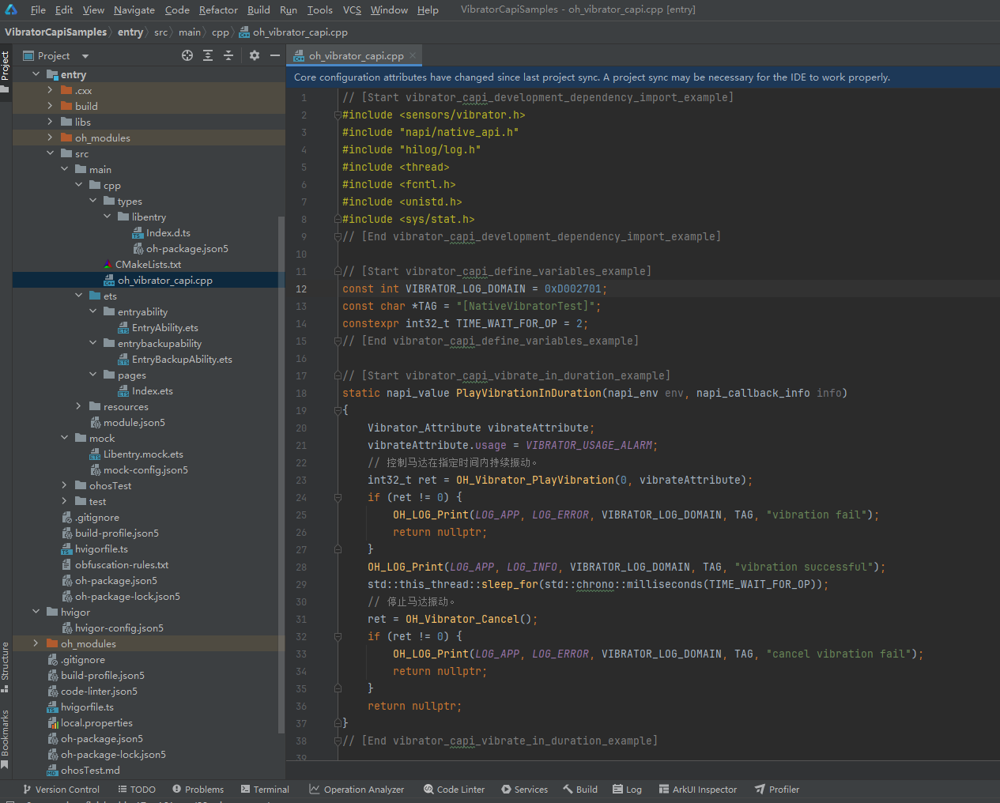

# Vibrator Development (C/C++)
<!--Kit: Sensor Service Kit-->
<!--Subsystem: Sensors-->
<!--Owner: @dilligencer-->
<!--Designer: @butterls-->
<!--Tester: @murphy84-->
<!--Adviser: @hu-zhiqiong-->

## When to Use

You can set different vibration effects as needed, for example, customizing the vibration intensity, frequency, and duration for button touches, alarm clocks, and incoming calls.

For details about the APIs, see [Vibrator API Reference](../../reference/apis-sensor-service-kit/vibrator_8h.md).


## Function Description

| Name                                                        | Description                          |
| ------------------------------------------------------------ | ------------------------------ |
| OHOS::Sensors::OH_Vibrator_PlayVibration(int32_t duration, Vibrator_Attribute attribute) | Configures the vibrator to vibrate continuously for a given duration.|
| OHOS::Sensors::OH_Vibrator_PlayVibrationCustom(Vibrator_FileDescription fileDescription, Vibrator_Attribute vibrateAttribute) | Configures the vibrator to vibrate with the custom sequence.          |
| OHOS::Sensors::OH_Vibrator_Cancel()                          | Stops the vibration.                |

## Vibration Effect Description

Currently, two types of vibration effects are supported.

### Fixed-Duration Vibration

Only a fixed duration is passed in, and the device vibrates based on the default intensity and frequency.

### Custom Vibration

Custom vibration enables you to design desired vibration effects by customizing a vibration configuration file and orchestrating vibration forms based on the corresponding rules.


## How to Develop

1. Create a native C++ project.

   

2. Before using the vibrator on a device, you must declare the **ohos.permission.VIBRATE** permission. For details, see [Declaring Permissions](../../security/AccessToken/declare-permissions.md).

   <!-- @[vibrator_capi_permission_example](https://gitcode.com/openharmony/applications_app_samples/blob/master/code/BasicFeature/DeviceManagement/Vibrator/VibratorCapiSamples/entry/src/main/module.json5) -->

``` JSON5
    "requestPermissions": [
      {
        "name": "ohos.permission.VIBRATE"
      }
    ]
```


3. Add the dynamic dependency libraries into the **CMakeLists.txt** file.

```c
target_link_libraries(entry PUBLIC libace_napi.z.so)
target_link_libraries(entry PUBLIC libhilog_ndk.z.so)
target_link_libraries(entry PUBLIC libohvibrator.z.so)
target_link_libraries(entry PUBLIC librawfile.z.so)
```

4. Import modules.

   <!-- @[vibrator_capi_development_dependency_import_example](https://gitcode.com/openharmony/applications_app_samples/blob/master/code/BasicFeature/DeviceManagement/Vibrator/VibratorCapiSamples/entry/src/main/cpp/oh_vibrator_capi.cpp) -->

``` C++
#include <sensors/vibrator.h>
#include "napi/native_api.h"
#include "hilog/log.h"
#include <thread>
#include <fcntl.h>
#include <unistd.h>
#include <sys/stat.h>
#include <rawfile/raw_file_manager.h>
```


5. Define constants.

   <!-- @[vibrator_capi_define_variables_example](https://gitcode.com/openharmony/applications_app_samples/blob/master/code/BasicFeature/DeviceManagement/Vibrator/VibratorCapiSamples/entry/src/main/cpp/oh_vibrator_capi.cpp) -->

``` C++
const int VIBRATOR_LOG_DOMAIN = 0xD002701;
const char *TAG = "[NativeVibratorTest]";
constexpr int32_t TIME_WAIT_FOR_OP = 2;
```


6. Configure the vibrator to vibrate continuously for a given duration.

   <!-- @[vibrator_capi_vibrate_in_duration_example](https://gitcode.com/openharmony/applications_app_samples/blob/master/code/BasicFeature/DeviceManagement/Vibrator/VibratorCapiSamples/entry/src/main/cpp/oh_vibrator_capi.cpp) -->

``` C++
static napi_value PlayVibrationInDuration(napi_env env, napi_callback_info info)
{
    Vibrator_Attribute vibrateAttribute;
    vibrateAttribute.usage = VIBRATOR_USAGE_ALARM;
    // Control the vibrator to vibrate continuously for a given duration.
    int32_t ret = OH_Vibrator_PlayVibration(2000, vibrateAttribute);
    if (ret != 0) {
        OH_LOG_Print(LOG_APP, LOG_ERROR, VIBRATOR_LOG_DOMAIN, TAG, "vibration fail");
        return nullptr;
    }
    OH_LOG_Print(LOG_APP, LOG_INFO, VIBRATOR_LOG_DOMAIN, TAG, "vibration successful");
    std::this_thread::sleep_for(std::chrono::milliseconds(TIME_WAIT_FOR_OP));
    // Stop the vibration.
    ret = OH_Vibrator_Cancel();
    if (ret != 0) {
        OH_LOG_Print(LOG_APP, LOG_ERROR, VIBRATOR_LOG_DOMAIN, TAG, "cancel vibration fail");
        return nullptr;
    }
    return nullptr;
}
```


8. Configure the vibrator to vibrate with the custom sequence.

   <!-- @[vibrator_capi_vibrate_in_custom_example](https://gitcode.com/openharmony/applications_app_samples/blob/master/code/BasicFeature/DeviceManagement/Vibrator/VibratorCapiSamples/entry/src/main/cpp/oh_vibrator_capi.cpp) -->

``` C++
static napi_value PlayVibrationCustom(napi_env env, napi_callback_info info)
{
    size_t argc = 1;
    napi_value argv[1] = { nullptr };
    // Obtain arguments of the native API.
    napi_get_cb_info(env, info, &argc, argv, nullptr, nullptr);

    // argv[0] is the first parameter of the function, which is a JS resource object. The  OH_ResourceManager_InitNativeResourceManager function converts this JS resource object into a native object.
    NativeResourceManager *mNativeResMgr = OH_ResourceManager_InitNativeResourceManager(env, argv[0]);
    if (mNativeResMgr == nullptr) {
        OH_LOG_Print(LOG_APP, LOG_ERROR, VIBRATOR_LOG_DOMAIN, TAG, "Get native resourceMagr failed");
        return nullptr;
    }
    // Obtain the rawFile pointer object.
    std::string fileName = "coin_drop.json";
    RawFile *rawFile = OH_ResourceManager_OpenRawFile(mNativeResMgr, fileName.c_str());
    if (rawFile == nullptr) {
        OH_ResourceManager_ReleaseNativeResourceManager(mNativeResMgr);
        OH_LOG_Print(LOG_APP, LOG_ERROR, VIBRATOR_LOG_DOMAIN, TAG, "Get native rawFile failed");
        return nullptr;
    }
    // Obtain the FD of the rawfile, that is, RawFileDescriptor {fd, offset, length}.
    RawFileDescriptor descriptor;
    OH_ResourceManager_GetRawFileDescriptor(rawFile, descriptor);
    Vibrator_FileDescription fileDescription = {
        .fd = descriptor.fd,
        .offset = descriptor.start,
        .length = descriptor.length
    };
    Vibrator_Attribute vibrateAttribute = {
        .usage = VIBRATOR_USAGE_RING
    };
    // Configure the vibrator to vibrate with the custom sequence.
    int32_t ret = OH_Vibrator_PlayVibrationCustom(fileDescription, vibrateAttribute);
    bool isSuccess = ((ret == 0) || (ret == UNSUPPORTED));
    if (!isSuccess) {
        OH_LOG_Print(LOG_APP, LOG_INFO, VIBRATOR_LOG_DOMAIN, TAG, "Vibratecustom fail");
    } else {
        OH_LOG_Print(LOG_APP, LOG_INFO, VIBRATOR_LOG_DOMAIN, TAG, "Vibratecustom successful");
    }
    std::this_thread::sleep_for(std::chrono::milliseconds(TIME_WAIT_FOR_OP));
    // Stop the vibration.
    OH_Vibrator_Cancel();
    // Close the rawFile pointer object.
    OH_ResourceManager_CloseRawFile(rawFile);
    OH_ResourceManager_ReleaseNativeResourceManager(mNativeResMgr);
    return nullptr;
}
```


8. Add related APIs to the **Init** function.

   <!-- @[vibrator_capi_init_example](https://gitcode.com/openharmony/applications_app_samples/blob/master/code/BasicFeature/DeviceManagement/Vibrator/VibratorCapiSamples/entry/src/main/cpp/oh_vibrator_capi.cpp) -->

``` C++
EXTERN_C_START
static napi_value Init(napi_env env, napi_value exports)
{
    napi_property_descriptor desc[] = {
        {"playVibrationInDuration", nullptr, PlayVibrationInDuration, nullptr, nullptr, nullptr, napi_default, nullptr},
        {"playVibrationCustom", nullptr, PlayVibrationCustom, nullptr, nullptr, nullptr, napi_default, nullptr}
    };
    napi_define_properties(env, exports, sizeof(desc) / sizeof(desc[0]), desc);
    return exports;
}
EXTERN_C_END
```

   
9. Introduce the NAPI APIs to the **index.d.ts** file in **types/libentry**.

   <!-- @[vibrator_capi_dependency_napi_example](https://gitcode.com/openharmony/applications_app_samples/blob/master/code/BasicFeature/DeviceManagement/Vibrator/VibratorCapiSamples/entry/src/main/cpp/types/libentry/Index.d.ts) -->

``` TypeScript
export const playVibrationInDuration: () => object;
export const playVibrationCustom: (resmgr: object) => object;
```


10. Write the application entry call code.

   <!-- @[vibrator_capi_index_example](https://gitcode.com/openharmony/applications_app_samples/blob/master/code/BasicFeature/DeviceManagement/Vibrator/VibratorCapiSamples/entry/src/main/ets/pages/Index.ets) -->

``` TypeScript
import { BusinessError } from '@kit.BasicServicesKit';
import { hilog } from '@kit.PerformanceAnalysisKit';
import { resourceManager } from '@kit.LocalizationKit';
import vibratorCapi from 'libentry.so';

const DOMAIN = 0xD002701;
// ···
          try {
            vibratorCapi.playVibrationInDuration();
			// ···
          } catch (error) {
            let e: BusinessError = error as BusinessError;
            hilog.error(DOMAIN, 'testTag', `Failed to invoke playVibrationInDuration. Code: ${e.code}, message: ${e.message}`);
          }
		// ···
          try {
            vibratorCapi.playVibrationCustom(this.getUIContext().getHostContext()?.resourceManager);
			// ···
          } catch (error) {
            let e: BusinessError = error as BusinessError;
            hilog.error(DOMAIN, 'testTag', `Failed to invoke playVibrationCustom. Code: ${e.code}, message: ${e.message}`);
          }
```
