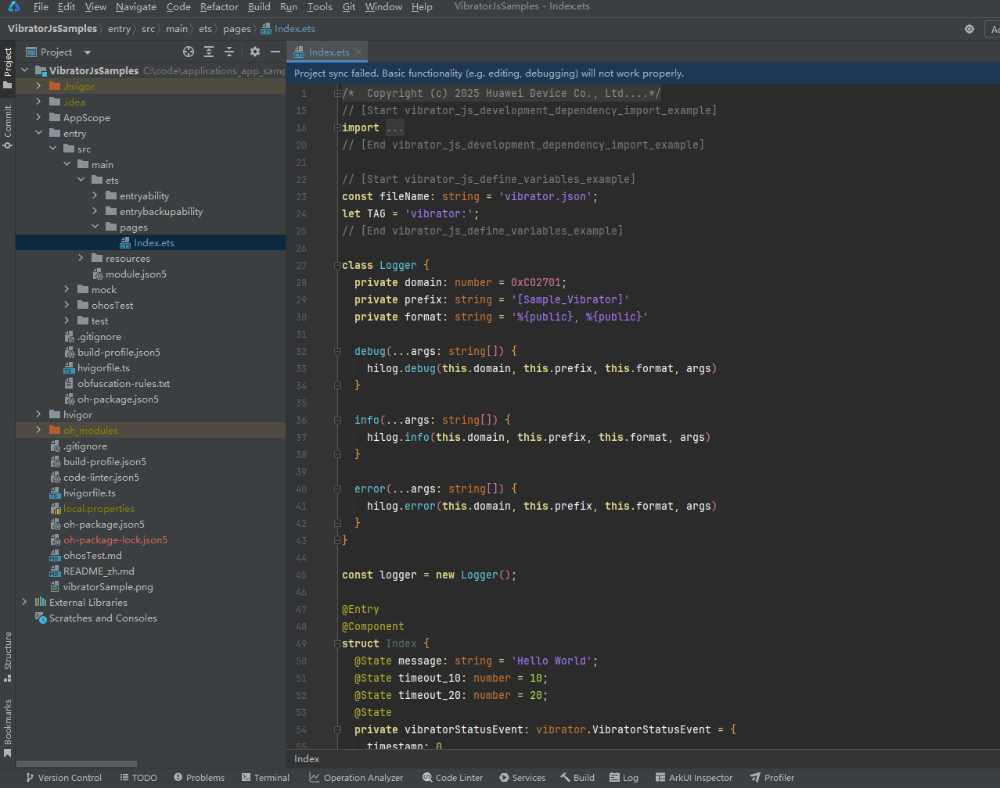

# Vibrator Development (ArkTS)
<!--Kit: Sensor Service Kit-->
<!--Subsystem: Sensors-->
<!--Owner: @dilligencer-->
<!--Designer: @butterls-->
<!--Tester: @murphy84-->
<!--Adviser: @hu-zhiqiong-->

## When to Use

You can set different vibration effects as needed, for example, customizing the vibration intensity, frequency, and duration for button touches, alarm clocks, and incoming calls.

For details about the APIs, see [@ohos.vibrator (Vibrator)](../../reference/apis-sensor-service-kit/js-apis-vibrator.md).


## Available APIs

| Name                                                        | Description                                                                         |
| ------------------------------------------------------------ |-----------------------------------------------------------------------------|
| startVibration(effect: VibrateEffect, attribute: VibrateAttribute): Promise&lt;void&gt; | Starts vibration with the specified effect and attribute. This API uses a promise to return the result.                                         |
| startVibration(effect: VibrateEffect, attribute: VibrateAttribute, callback: AsyncCallback&lt;void&gt;): void | Starts vibration with the specified effect and attribute. This API uses an asynchronous callback to return the result.                                        |
| stopVibration(stopMode: VibratorStopMode): Promise&lt;void&gt; | Stops vibration in the specified mode. This API uses a promise to return the result.                                               |
| stopVibration(stopMode: VibratorStopMode, callback: AsyncCallback&lt;void&gt;): void | Stops vibration in the specified mode. This API uses an asynchronous callback to return the result.                                              |
| stopVibration(): Promise&lt;void&gt;                         | Stops vibration in all modes. This API uses a promise to return the result.                                                 |
| stopVibration(param?: VibratorInfoParam): Promise&lt;void&gt; | Stops vibration based on the specified vibrator parameters. This API uses a promise to return the result.                                |
| stopVibration(callback: AsyncCallback&lt;void&gt;): void     | Stops vibration in all modes. This API uses an asynchronous callback to return the result.                                                |
| isSupportEffect(effectId: string): Promise&lt;boolean&gt;    | Checks whether an effect ID is supported. This API uses a promise to return the result. The return value **true** means that the effect ID is supported, and **false** means the opposite.                       |
| isSupportEffect(effectId: string, callback: AsyncCallback&lt;boolean&gt;): void | Checks whether an effect ID is supported. This API uses an asynchronous callback to return the result. The return value **true** means that the effect ID is supported, and **false** means the opposite.                      |
| getEffectInfoSync(effectId: string, param?: VibratorInfoParam): EffectInfo | Checks whether the effect specified by the input **effectId** is supported. The **param** parameter can be used to specify a specific vibrator. You can check the **isEffectSupported** field in the returned **EffectInfo** object to determine whether the effect is supported.|
| getVibratorInfoSync(param?: VibratorInfoParam): Array&lt;VibratorInfo&gt; | Queries the vibrator list of one or all devices. The returned **VibratorInfo** object includes the following information: device ID, vibrator ID, device name, support for HD vibration, and local device flag.      |
| on(type: 'vibratorStateChange', callback: Callback&lt;VibratorStatusEvent&gt;): void | Enables listening for vibrator status changes. The **VibratorStatusEvent** parameter includes the following information: event timestamp, device ID, number of vibrators, and online/offline status. |
| off(type: 'vibratorStateChange', callback?: Callback&lt;VibratorStatusEvent&gt;): void | Disables listening for vibrator status changes.                                                          |


## Vibration Effect Description

Currently, three types of vibration effects are supported.

| Name        | Description                                                        |
| ------------ | ------------------------------------------------------------ |
| Fixed-Duration Vibration| Only a fixed duration is passed in, and the device vibrates based on the default intensity and frequency. For details about the vibration effect, see [VibrateTime](../../reference/apis-sensor-service-kit/js-apis-vibrator.md#vibratetime9).|
| Preset Vibration    | [EffectId](../../reference/apis-sensor-service-kit/js-apis-vibrator.md#effectid) for fixed scenes. For example, the effect "haptic.clock.timer" is preset to provide feedback when a user adjusts the timer. For details about the vibration effect, see [VibratePreset](../../reference/apis-sensor-service-kit/js-apis-vibrator.md#vibratepreset9).|
| Custom Vibration  | Custom vibration enables you to design vibration effects by customizing a vibration configuration file and orchestrating vibration forms based on the corresponding rules. For details about the vibration effect, see [VibrateFromFile](../../reference/apis-sensor-service-kit/js-apis-vibrator.md#vibratefromfile10).|

The custom vibration configuration file is in JSON format. An example file is as follows:

```json
{
    "MetaData": {
        "Create": "2023-01-09",
        "Description": "a haptic case",
        "Version": 1.0,
        "ChannelNumber": 1
    },
    "Channels": [
        {
            "Parameters": {
                "Index": 0
            },
            "Pattern": [
                {
                    "Event": {
                        "Type": "transient",
                        "StartTime": 0,
                        "Parameters": {
                            "Frequency": 31,
                            "Intensity": 100
                        }
                    }
                },
                {
                    "Event": {
                        "Type": "continuous",
                        "StartTime": 40,
                        "Duration": 54,
                        "Parameters": {
                            "Frequency": 30,
                            "Intensity": 38,
                            "Curve": [
                                {
                                    "Time": 0,
                                    "Frequency": 0,
                                    "Intensity": 0
                                },
                                {
                                    "Time": 1,
                                    "Frequency": 15,
                                    "Intensity": 0.5
                                },
                                {
                                    "Time": 40,
                                    "Frequency": -8,
                                    "Intensity": 1.0
                                },
                                {
                                    "Time": 54,
                                    "Frequency": 0,
                                    "Intensity": 0
                                }
                            ]
                        }
                    }
                }
            ]
        }
    ]
}
```

This JSON file contains three attributes: **MetaData**, **Channels**, and **Parameters**.
1. **MetaData** contains information about the file header. You can add the following attributes under **MetaData**.

     | Name         | Mandatory| Description                                         |
     | ------------- | ------ | --------------------------------------------- |
     | Version       | Yes    | Version number of the file format, which is forward compatible. Currently, only version 1.0 is supported.|
     | ChannelNumber | Yes    | Number of channels for vibration. A maximum of two channels are supported.   |
     | Create        | No    | Time when the file was created.                         |
     | Description   | No    | Additional information such as the vibration effect and creation information.         |

2. **Channels** provides information about the vibration channel.

     It is a JSON array that holds information about each channel. It contains two attributes: **Parameters** and **Pattern**.

     | Name      | Mandatory| Description                                                        |
     | ---------- | ------ | ------------------------------------------------------------ |
     | Parameters | Yes    | Channel parameters. Among them, **Index** indicates the channel ID. The value **0** indicates both channels, **1** indicates the left channel, and **2** indicates the right channel. **0** cannot be used as a configuration parameter simultaneously with other channel numbers.|
     | Pattern    | No    | Vibration sequence.                                              |

     **Pattern** is a JSON array that holds the vibration events. Under it, **Event** indicates a vibration event, which can be either of the following types.

     | Vibration Type  | Description                                          |
     | ---------- | ---------------------------------------------- |
     | transient  | Short vibration.                        |
     | continuous | Long vibration.|

     A vibration event contains the following attributes.

     | Name     | Mandatory| Description                                                        |
     | --------- | ------ | ------------------------------------------------------------ |
     | Type      | Yes    | Type of the vibration event, which can be **transient** or **continuous**.                |
     | StartTime | Yes    | Vibration start time. The value range is [0, 1800000], in ms.           |
     | Duration  | Yes    | Vibration duration. This parameter is valid only when **Type** is set to **continuous**. The value range is [0, 5000], in ms.|

3. **Parameters** provides the following parameters related to the vibration event and is mandatory.

     | Name     | Mandatory| Description                                                        |
     | --------- | ------ | ------------------------------------------------------------ |
     | Intensity | Yes    | Vibration intensity. The value range is [0, 100]. The specified value indicates the percentage of the maximum vibration intensity.|
     | Frequency | Yes    | Vibration frequency. The value range is [0, 100]. For vibrators that support frequency adjustment, the value is usually set to **55**, which is the resonance frequency. In this case, the vibration intensity is the highest. The closer the vibration frequency is to the resonance frequency, the higher the vibration intensity is.|
     | Curve     | No    | Vibration curve. This parameter is valid only when **Type** is set to **continuous**. It is a JSON array that holds 4 to 16 adjustment points. Each adjustment point must contain the following attributes:<br>**Time**: offset relative to the event start time. The value ranges from 0 to the vibration duration.<br>**Intensity**: gain relative to the vibration intensity. The value range is [0, 1]. This value multiplied by the vibration intensity is the adjusted intensity at the corresponding time point.<br>**Frequency**: change relative to the vibration frequency. The value range is [-100, 100]. This value plus the vibration frequency is the adjusted frequency at the corresponding time point.|

The following requirements must be met:

| Item| Description                |
| -------- | ------------------------ |
| Number of vibration events| No more than 128|
| Length of the vibration configuration file| Not greater than 64 KB|


## How to Develop

1. Create a project.

   

2. Declare the permission. For details, see [Declaring Permissions](../../security/AccessToken/declare-permissions.md).

   <!-- @[vibrator_js_permission_example](https://gitcode.com/openharmony/applications_app_samples/blob/master/code/BasicFeature/DeviceManagement/Vibrator/VibratorJsSamples/entry/src/main/module.json5) -->
   
   ``` JSON5
   "requestPermissions": [
     {
       "name": "ohos.permission.VIBRATE"
     }
   ],
   ```

3. Import the related modules.

   <!-- @[vibrator_js_development_dependency_import_example](https://gitcode.com/openharmony/applications_app_samples/blob/master/code/BasicFeature/DeviceManagement/Vibrator/VibratorJsSamples/entry/src/main/ets/pages/Index.ets) --> 
   
   ``` TypeScript
   import { vibrator } from '@kit.SensorServiceKit';
   import { resourceManager } from '@kit.LocalizationKit';
   import { BusinessError } from '@kit.BasicServicesKit';
   import { hilog } from '@kit.PerformanceAnalysisKit';
   ```

4. Define constants.

   <!-- @[vibrator_js_define_variables_example](https://gitcode.com/openharmony/applications_app_samples/blob/master/code/BasicFeature/DeviceManagement/Vibrator/VibratorJsSamples/entry/src/main/ets/pages/Index.ets) --> 
   
   ``` TypeScript
   const fileName: string = 'vibrator.json';
   let TAG = 'vibrator:';
   ```

5. Query vibrator information.

   Scenario 1: Query information about all vibrators.

   <!-- @[vibrator_js_get_vibrator_info_sync_example](https://gitcode.com/openharmony/applications_app_samples/blob/master/ code/BasicFeature/DeviceManagement/Vibrator/VibratorJsSamples/entry/src/main/ets/pages/Index.ets) --> 
   
   ``` TypeScript
   try {
     const vibratorInfoList: vibrator.VibratorInfo[] = vibrator.getVibratorInfoSync();
     console.info(`vibratorInfoList: ${JSON.stringify(vibratorInfoList)}`);
     // ...
   } catch (error) {
     let e: BusinessError = error as BusinessError;
     console.error(`An unexpected error occurred. Code: ${e.code}, message: ${e.message}`);
   }
   ```

   Scenario 2: Query information about one or more vibrators of the specified device.

   <!-- @[vibrator_js_get_vibrator_info_sync_by_device_id_example](https://gitcode.com/openharmony/ applications_app_samples/blob/master/code/BasicFeature/DeviceManagement/Vibrator/VibratorJsSamples/entry/src/main/ets/ pages/Index.ets) --> 
   
   ``` TypeScript
   try {
     const vibratorParam: vibrator.VibratorInfoParam = {
       deviceId: -1    // The device ID must be the one that actually exists.
     }
     const vibratorInfoList: vibrator.VibratorInfo[] = vibrator.getVibratorInfoSync(vibratorParam);
     console.info(`vibratorInfoList: ${JSON.stringify(vibratorInfoList)}`);
     // ...
   } catch (error) {
     let e: BusinessError = error as BusinessError;
     console.error(`An unexpected error occurred. Code: ${e.code}, message: ${e.message}`);
   }
   ```

6. Start vibration with the specified effect and attribute.

   Scenario 1: Trigger vibration with the specified duration.

   <!-- @[vibrator_js_vibrator_by_type_time_example](https://gitcode.com/openharmony/applications_app_samples/blob/master/code/BasicFeature/DeviceManagement/Vibrator/VibratorJsSamples/entry/src/main/ets/pages/Index.ets) --> 
   
   ``` TypeScript
   try {
     // Start vibration.
     vibrator.startVibration({
       type: 'time',
       duration: 1000,
     }, {
       id: 0,
       usage: 'alarm'
     }, (error: BusinessError) => {
       if (error) {
         console.error(`Failed to start vibration. Code: ${error.code}, message: ${error.message}`);
         return;
       }
       console.info('Succeed in starting vibration');
     });
   } catch (err) {
     let e: BusinessError = err as BusinessError;
     console.error(`An unexpected error occurred. Code: ${e.code}, message: ${e.message}`);
   }
   ```

   Scenario 2: Trigger vibration with a preset effect. You can check whether the preset effect is supported before calling **startVibration()**.

   <!-- @[vibrator_js_vibrator_by_type_preset_example](https://gitcode.com/openharmony/applications_app_samples/blob/master/code/BasicFeature/DeviceManagement/Vibrator/VibratorJsSamples/entry/src/main/ets/pages/Index.ets) --> 
   
   ``` TypeScript
   try {
     vibrator.isSupportEffect(this.realEffectId, (err: BusinessError, state: boolean) => {
       if (err) {
         console.error(`Failed to query effect. Code: ${err.code}, message: ${err.message}`);
         return;
       }
       console.info('Succeed in querying effect');
       if (state) {
         try {
           // Start vibration.
           vibrator.startVibration({
             type: 'preset',
             effectId: this.realEffectId,
             count: 1,
             intensity: 50,
           }, {
             usage: 'unknown'
           }, (error: BusinessError) => {
             if (error) {
               console.error(`Failed to start vibration. Code: ${error.code}, message: ${error.message}`);
             } else {
               console.info('Succeed in starting vibration');
             }
           });
         } catch (error) {
           let e: BusinessError = error as BusinessError;
           console.error(`An unexpected error occurred. Code: ${e.code}, message: ${e.message}`);
         }
       }
     })
   } catch (error) {
     let e: BusinessError = error as BusinessError;
     console.error(`An unexpected error occurred. Code: ${e.code}, message: ${e.message}`);
   }
   ```

   Scenario 3: Trigger vibration according to a custom vibration configuration file.

   <!-- @[vibrator_js_vibrator_by_type_file_example](https://gitcode.com/openharmony/applications_app_samples/blob/master/code/BasicFeature/DeviceManagement/Vibrator/VibratorJsSamples/entry/src/main/ets/pages/Index.ets) --> 
   
   ``` TypeScript
   // Obtain the file descriptor of the vibration configuration file.
   let rawFd: resourceManager.RawFileDescriptor | undefined = this.uiContext.getHostContext()?.resourceManager.getRawFdSync(fileName);
   if (rawFd != undefined) {
     // Start vibration.
     try {
       vibrator.startVibration({
         type: "file",
         hapticFd: { fd: rawFd.fd, offset: rawFd.offset, length: rawFd.length }
       }, {
         id: 0,
         usage: 'alarm' // The switch control is subject to the selected type.
       }, (error: BusinessError) => {
         if (error) {
           console.error(`Failed to start vibration. Code: ${error.code}, message: ${error.message}`);
           return;
         }
         console.info('Succeed in starting vibration');
       });
     } catch (err) {
       let e: BusinessError = err as BusinessError;
       console.error(`An unexpected error occurred. Code: ${e.code}, message: ${e.message}`);
     } finally {
       vibrator.stopVibration();
       this.uiContext.getHostContext()?.resourceManager.closeRawFdSync(fileName);
     }
   }
   ```

   Scenario 4: Trigger vibration according to the specified pattern.

   Add a short vibration event as a **VibratorPattern** object and trigger vibration.

   <!-- @[vibrator_js_vibrator_by_type_pattern_use_transient_example](https://gitcode.com/openharmony/applications_app_samples/blob/master/code/BasicFeature/DeviceManagement/Vibrator/VibratorJsSamples/entry/src/main/ets/pages/Index.ets) --> 
   
   ``` TypeScript
   let builder: vibrator.VibratorPatternBuilder = new vibrator.VibratorPatternBuilder();
   try {
     let param: vibrator.TransientParam = {
       intensity: 80,
       frequency: 70,
       index: 0
     }
     builder.addTransientEvent(0, param);
     console.info(`addTransientEvent builder is ${builder.build()}`);
   } catch (error) {
     let e: BusinessError = error as BusinessError;
     console.error(`An unexpected error occurred. Code: ${e.code}, message: ${e.message}`);
   }
   try {
     vibrator.startVibration({
       type: "pattern",
       pattern: builder.build()
     }, {
       id: 1,
       deviceId: -1,
       // The switch control is subject to the selected type.
       usage: "alarm"
     }, (error: BusinessError) => {
       if (error) {
         let e: BusinessError = error as BusinessError;
         console.error(`Vibrate fail. Code: ${e.code}, message: ${e.message}`);
       } else {
         console.info(`vibrate success`);
       }
     });
   } catch (error) {
     let e: BusinessError = error as BusinessError;
     console.error(`An unexpected error occurred. Code: ${e.code}, message: ${e.message}`);
   }
   ```

   Add a long vibration event as a **VibratorPattern** object and trigger vibration.

   <!-- @[vibrator_js_vibrator_by_type_pattern_use_continuous_example](https://gitcode.com/openharmony/applications_app_samples/blob/master/code/BasicFeature/DeviceManagement/Vibrator/VibratorJsSamples/entry/src/main/ets/pages/Index.ets) --> 
   
   ``` TypeScript
   let builder: vibrator.VibratorPatternBuilder = new vibrator.VibratorPatternBuilder();
   try {
     // No less than four VibratorCurvePoint objects must be set. The maximum value is 16.
     let pointsMe: vibrator.VibratorCurvePoint[] = [
       { time: 0, intensity: 0, frequency: -7 },
       { time: 42, intensity: 1, frequency: -6 },
       { time: 128, intensity: 0.94, frequency: -4 },
       { time: 217, intensity: 0.63, frequency: -14 },
       { time: 763, intensity: 0.48, frequency: -14 },
       { time: 1125, intensity: 0.53, frequency: -10 },
       { time: 1503, intensity: 0.42, frequency: -14 },
       { time: 1858, intensity: 0.39, frequency: -14 },
       { time: 2295, intensity: 0.34, frequency: -17 },
       { time: 2448, intensity: 0.21, frequency: -14 },
       { time: 2468, intensity: 0, frequency: -21 }
     ]
     let param: vibrator.ContinuousParam = {
       intensity: 97,
       frequency: 34,
       points: pointsMe,
       index: 0
     }
     builder.addContinuousEvent(0, 2468, param);
     console.info(`addContinuousEvent builder is ${builder.build()}`);
   } catch (error) {
     let e: BusinessError = error as BusinessError;
     console.error(`Exception. Code ${e.code}`);
   }
   try {
     vibrator.startVibration({
       type: 'pattern',
       pattern: builder.build()
     }, {
       id: 1,
       deviceId: -1,
       usage:"alarm",
     }, (error: BusinessError) => {
       if (error) {
         let e: BusinessError = error as BusinessError;
         console.error(`Vibrate fail. Code: ${e.code}, message: ${e.message}`);
       } else {
         console.info(`vibrate success`);
       }
     });
   } catch (error) {
     let e: BusinessError = error as BusinessError;
     console.error(`An unexpected error occurred. Code: ${e.code}, message: ${e.message}`);
   }
   ```

7. Stop vibration.

   Method 1: Stop vibration in the specified mode. This method is invalid for custom vibration.

   ​Stop fixed-duration vibration.

   <!-- @[vibrator_js_stop_vibrator_by_type_time_example](https://gitcode.com/openharmony/applications_app_samples/blob/master/code/BasicFeature/DeviceManagement/Vibrator/VibratorJsSamples/entry/src/main/ets/pages/Index.ets) --> 
   
   ``` TypeScript
   try {
     // Stop vibration in VIBRATOR_STOP_MODE_TIME mode.
     vibrator.stopVibration(vibrator.VibratorStopMode.VIBRATOR_STOP_MODE_TIME, (error: BusinessError) => {
       if (error) {
         console.error(`Failed to stop vibration. Code: ${error.code}, message: ${error.message}`);
         return;
       }
       console.info('Succeed in stopping vibration');
     })
   } catch (err) {
     let e: BusinessError = err as BusinessError;
     console.error(`An unexpected error occurred. Code: ${e.code}, message: ${e.message}`);
   }
   ```

   ​Stop preset vibration.

   <!-- @[vibrator_js_stop_vibrator_by_type_preset_example](https://gitcode.com/openharmony/applications_app_samples/blob/master/code/BasicFeature/DeviceManagement/Vibrator/VibratorJsSamples/entry/src/main/ets/pages/Index.ets) --> 
   
   ``` TypeScript
   try {
     // Stop vibration in VIBRATOR_STOP_MODE_PRESET mode.
     vibrator.stopVibration(vibrator.VibratorStopMode.VIBRATOR_STOP_MODE_PRESET, (error: BusinessError) => {
       if (error) {
         console.error(`Failed to stop vibration. Code: ${error.code}, message: ${error.message}`);
         return;
       }
       console.info('Succeed in stopping vibration');
     })
   } catch (err) {
     let e: BusinessError = err as BusinessError;
     console.error(`An unexpected error occurred. Code: ${e.code}, message: ${e.message}`);
   }
   ```

   Method 2: Stop vibration in all modes, including custom vibration.

   <!-- @[vibrator_js_stop_vibrator_by_type_all_example](https://gitcode.com/openharmony/applications_app_samples/blob/master/code/BasicFeature/DeviceManagement/Vibrator/VibratorJsSamples/entry/src/main/ets/pages/Index.ets) --> 
   
   ``` TypeScript
   try {
     // Stop vibration in all modes.
     vibrator.stopVibration((error: BusinessError) => {
       if (error) {
         console.error(`Failed to stop vibration. Code: ${error.code}, message: ${error.message}`);
         return;
       }
       console.info('Succeed in stopping vibration');
     })
   } catch (error) {
     let e: BusinessError = error as BusinessError;
     console.error(`An unexpected error occurred. Code: ${e.code}, message: ${e.message}`);
   }
   ```

   Method 3: Stop vibration of the specified device.

   <!-- @[vibrator_js_stop_vibrator_by_device_id_example](https://gitcode.com/openharmony/applications_app_samples/blob/master/code/BasicFeature/DeviceManagement/Vibrator/VibratorJsSamples/entry/src/main/ets/pages/Index.ets) --> 
   
   ``` TypeScript
   const vibratorInfoParam: vibrator.VibratorInfoParam = {
     deviceId: -1   // The device ID must be the one that actually exists.
   }
   try {
     vibrator.stopVibration(vibratorInfoParam).then(() => {
       console.info('Succeed in stopping vibration');
     }, (error: BusinessError) => {
       console.error(`Failed to stop vibration. Code: ${error.code}, message: ${error.message}`);
     });
   } catch (error) {
     let e: BusinessError = error as BusinessError;
     console.error(`An unexpected error occurred. Code: ${e.code}, message: ${e.message}`);
   }
   ```

8. Enable listening for vibrator status changes. 

   Enable listening.

   <!-- @[vibrator_js_vibrator_on_state_change_example](https://gitcode.com/openharmony/applications_app_samples/blob/master/code/BasicFeature/DeviceManagement/Vibrator/VibratorJsSamples/entry/src/main/ets/pages/Index.ets) --> 
   
   ``` TypeScript
   // Callback
   vibratorStateChangeCallback = (data: vibrator.VibratorStatusEvent) => {
     console.info('vibrator state callback info:', JSON.stringify(data));
     // ...
   }
   // ...
               try {
                 // Subscribe to vibratorStateChange events.
                 vibrator.on('vibratorStateChange', this.vibratorStateChangeCallback);
               } catch (error) {
                 let e: BusinessError = error as BusinessError;
                 console.error(`An unexpected error occurred. Code: ${e.code}, message: ${e.message}`);
               }
   ```

   Disable listening. The specified callback must be the same as that passed to the **on** API.

   <!-- @[vibrator_js_vibrator_off_state_change_example](https://gitcode.com/openharmony/applications_app_samples/blob/master/code/BasicFeature/DeviceManagement/Vibrator/VibratorJsSamples/entry/src/main/ets/pages/Index.ets) --> 
   
   ``` TypeScript
   // Callback
   vibratorStateChangeCallback = (data: vibrator.VibratorStatusEvent) => {
     console.info('vibrator state callback info:', JSON.stringify(data));
     // ...
   }
   // ...
               try {
                 // Unsubscribe from specified vibratorStateChange events.
                 vibrator.off('vibratorStateChange', this.vibratorStateChangeCallback);
                 // Unsubscribe from all vibratorStateChange events.
                 // vibrator.off('vibratorStateChange');
               } catch (error) {
                 let e: BusinessError = error as BusinessError;
                 console.error(`An unexpected error occurred. Code: ${e.code}, message: ${e.message}`);
               }
   ```

9. Obtain the preset vibration effect based on the specified device ID and vibrator ID.

   <!-- @[vibrator_js_vibrator_get_effect_info_sync_example](https://gitcode.com/openharmony/applications_app_samples/blob/master/code/BasicFeature/DeviceManagement/Vibrator/VibratorJsSamples/entry/src/main/ets/pages/Index.ets) --> 
   
   ``` TypeScript
   try {
     const effectInfo: vibrator.EffectInfo = vibrator.getEffectInfoSync('haptic.clock.timer', { deviceId: -1, vibratorId: 1});
     console.info(`isEffectSupported: ${effectInfo.isEffectSupported}`);
     // ...
   } catch (error) {
     let e: BusinessError = error as BusinessError;
     console.error(`An unexpected error occurred. Code: ${e.code}, message: ${e.message}`);
   }
   ```

10. Check whether HD vibration is supported.

    <!-- @[vibrator_js_vibrator_is_hd_haptic_supported_example](https://gitcode.com/openharmony/applications_app_samples/blob/master/code/BasicFeature/DeviceManagement/Vibrator/VibratorJsSamples/entry/src/main/ets/pages/Index.ets) -->
    
    ``` TypeScript
    try {
      // Check whether HD vibration is supported.
      let ret = vibrator.isHdHapticSupported();
      console.info(`The query result is ${ret}`);
      // ...
    } catch (error) {
      let e: BusinessError = error as BusinessError;
      console.error(`An unexpected error occurred. Code: ${e.code}, message: ${e.message}`);
    }
    ```

## Related Examples

The following sample is provided to help you better understand how to develop vibrators:

- [Vibrator (ArkTS, API version 9)](https://gitcode.com/openharmony/applications_app_samples/tree/master/code/BasicFeature/DeviceManagement/Vibrator/BasicVibration)

- [CustomHaptic (ArkTS, Full SDK, API version 10)](https://gitcode.com/openharmony/applications_app_samples/tree/master/code/BasicFeature/DeviceManagement/Vibrator/CustomHaptic)
