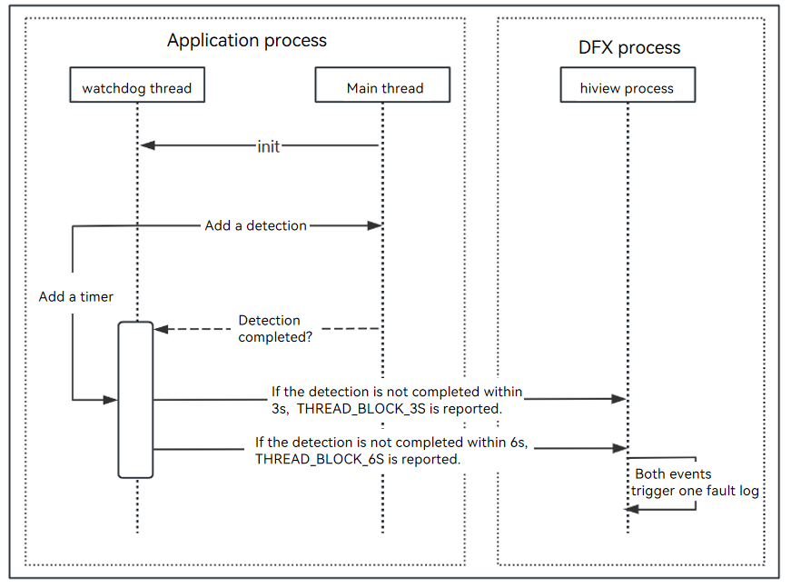
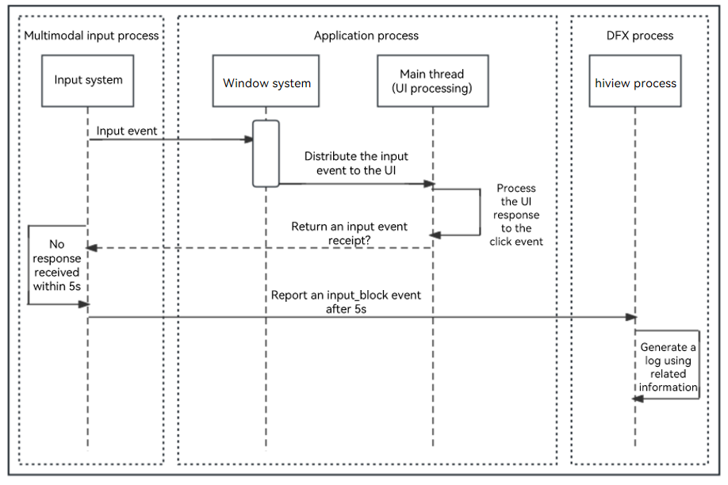

# Application Freeze Detection

<!--Kit: Performance Analysis Kit-->
<!--Subsystem: HiviewDFX-->
<!--Owner: @rr_cn-->
<!--Designer: @peterhuangyu-->
<!--Tester: @gcw_KuLfPSbe;@lipengpeng97-->
<!--Adviser: @foryourself-->

## Overview

AppFreeze (application freeze) means that an application does not respond to user operations (for example, clicking) for a specified period of time. In this case, the system detects AppFreeze faults and generates AppFreeze logs for fault analysis.

> **NOTE**
>
> This guide applies only to applications in the stage model. Before using this guide, you must have basic knowledge about the JS applications, C++ program stacks, and application-related subsystems.

## Detection Principles

Currently, AppFreeze detection supports the fault types listed in the following table.

> **NOTE**
>
> AppFreeze detection takes effect only for [applications of the release version](performance-analysis-kit-terminology.md#applications-of-the-release-version), but not for [applications of the debug version](performance-analysis-kit-terminology.md#applications-of-the-debug-version)

| Fault| Description|
| -------- | -------- |
| THREAD_BLOCK_6S | The application main thread times out.|
| APP_INPUT_BLOCK | The user input response times out.|

When any of the preceding faults occurs in an application, the application is killed to ensure that it is recoverable and the application freeze event is reported. You can subscribe to the [application freeze event](hiappevent-watcher-freeze-events.md) using HiAppEvent.

### THREAD_BLOCK_6S Application Main Thread Timeout

**Description**: This fault indicates that the main thread of this application is suspended or too many tasks are executed, affecting task execution smoothness and experience.

**Detection principle**: The watchdog thread of the application periodically inserts an activation detection to the main thread. If the activity detection is not executed within 3s, the **THREAD_BLOCK_3S** warning event is reported. If the activity detection is not executed within 6s, the **THREAD_BLOCK_6S** main thread timeout event is reported. The two events constitute an AppFreeze log.

The following figure shows the detection principle.

**Figure 1**



### APP_INPUT_BLOCK User Input Response Timeout

**Description**: This fault occurs when the tap event is not responded within 5 seconds.

**Detection principle**: When a user taps an application, the input system sends a tap event to the application. If the application response times out, this fault is reported.

The following figure shows the detection principle.

**Figure 2**



## Obtaining Logs

Both application freeze logs and process crash logs are managed by the FaultLogger module and can be obtained using any of the following methods:

**Method 1: DevEco Studio**

DevEco Studio collects process crash logs from **/data/log/faultlog/faultlogger/** to FaultLog, where logs are displayed by process name and fault time. For details about how to obtain logs, see [Fault Log](https://developer.huawei.com/consumer/en/doc/harmonyos-guides/ide-fault-log).

**Method 2: HiAppEvent APIs**

HiAppEvent provides APIs for subscribing to faults. For details, see [Introduction to HiAppEvent](hiappevent-intro.md). Subscribe to the application freeze event by referring to [Subscribing to Application Freeze Events (ArkTS)](hiappevent-watcher-freeze-events-arkts.md) or [Subscribing to Application Freeze Events (C/C++)](hiappevent-watcher-freeze-events-ndk.md), and read the fault log file content based on the [external_log](hiappevent-watcher-freeze-events.md#event-fields) field of the event.

**Method 3: hdc**

Enable **Developer options** and run the `hdc file recv /data/log/faultlog/faultlogger D:\` command to export fault logs to the local device. The fault log file name is in the format of **appfreeze-process name-process UID-millisecond-level timestamp.log**.

## Log Specifications

You need to analyze AppFreeze problems based on AppFreeze logs and HiLog logs.

The following example is for reference only. You should analyze the problem based on the actual situation.

AppFreeze logs consist of the following information:

### Header Information

```text
Generated by HiviewDFX@OpenHarmony
================================================================
Device info:HUAWEI Mate 60 Pro
Build info:ALN-AL00 6.0.0.328(C00E1R4P3DEVDUlog)
DeviceDebuggable:No
Fingerprint:e18a33c12e1361173ec9ac1c93f2bd0c2daa88f03c7f76b228cca14bdc6a21b1
Module name:com.samples.freezedebug
ReleaseType:release
CpuAbi:arm64-v8a
Version:1.0.0
VersionCode:1000000
IsSystemApp:No
PreInstalled:No
Foreground:Yes
Pid:13680
Uid:20020177
Process life time:18s
Process Memory(kB):163819(Rss)
Device Memory(kB):Total 11679272, Free 3697424, Available 5814272
Reason:THREAD_BLOCK_6S
appfreeze: com.samples.freezedebug THREAD_BLOCK_6S at 20250628140837
DisplayPowerInfo:powerState:UNKNOWN
HitraceIdInfo: hitrace_id: a92ab27238f409a, span_id: 1cd61c9, parent_span_id: 3072e, trace_flag: 0
Page switch history:
  14:08:30:327 /ets/pages/Index:Appfreeze
  14:08:28:986 /ets/pages/Index
  14:08:26:502 :enters foreground
  14:08:07:606 :leaves foreground
  14:08:06:246 /ets/pages/Index:Appfreeze
  14:08:01:955 :enters foreground
>>>>>>>>>>>>>>>>>>>>>>>>>>>>>>>>>>>>>>>>>>>
DOMAIN:AAFWK
STRINGID:THREAD_BLOCK_6S
TIMESTAMP:2025/06/28-14:08:37:360
PID:13680
UID:20020177
PACKAGE_NAME:com.samples.freezedebug
PROCESS_NAME:com.samples.freezedebug
NOTE: Current fault may be caused by the system's low memory or thermal throttling, you may ignore it and analysis other faults.
***
```

Since API version 20, the **NOTE** line is displayed when a device resource alarm is generated (for example, the device memory is low or thermal throttling is enabled). When this line is displayed, you can ignore the application freeze fault. In earlier API versions, this line is not displayed regardless of the system resource status.

Since API version 20, the [HiTraceId](../reference/apis-performance-analysis-kit/js-apis-hitracechain.md#hitraceid) information is added to the log when the **THREAD_BLOCK_6S** fault occurs. Provided by HiTraceChain, the **HitraceId** uniquely identifies each service process call chain. You can use it to view the HiLog logs of the faulty process during the fault period, and analyze the logs to check the application execution status.

All the three types of AppFreeze events include the following information.

| Field| Description|
| -------- | -------- |
| DeviceDebuggable | Whether the system version of the device can be debugged, which is irrelevant to **Developer options**.<br>Note: This field is supported since API version 23.|
| ReleaseType | Application version type. The value **release** indicates that the application is a [release-type application](https://developer.huawei.com/consumer/en/doc/harmonyos-guides/ide-hvigor-compilation-options-customizing-guide#section192461528194916), and the value **debug** indicates that the application is a [debug-type application](https://developer.huawei.com/consumer/en/doc/harmonyos-guides/ide-hvigor-compilation-options-customizing-guide#section192461528194916).<br>Note: This field is supported since API version 23.|
| CpuAbi | ABI type.<br>Note: This field is supported since API version 23.|
| IsSystemApp | Whether the application is a system application.<br>Note: This field is supported since API version 23.|
| Reason | Reason why the application freezes, corresponding to the application freeze detection capability.|
| PID | PID of the faulty process.|
| PACKAGE_NAME | Application process package name.|
|[Page switch history](./cppcrash-guidelines.md#faults-with-page-switching-history)| Since API version 20, the maintenance and debugging process records the application switching history. After an application fault occurs, the generated fault file contains the page switching history. If the maintenance and debugging service process is faulty or the switching history is not cached, this field is not displayed.|
| Process life time | Lifetime of the faulty process, in seconds.<br>Note: This field is supported since API version 22.|
| Process Memory(kB) | Memory usage of the faulty process.<br>Note: This field is supported since API version 22.|
| Device Memory(kB) | Device memory status.<br>Note: This field is supported since API version 22.|

### General Information in the Log Body

```text
start time: 2025/06/28-14:08:34:318
DOMAIN = AAFWK
EVENTNAME = THREAD_BLOCK_3S
TIMESTAMP = 2025/06/28-14:08:34:310
PID = 13680
UID = 20020177
TID = 13680
PACKAGE_NAME = com.samples.freezedebug
PROCESS_NAME = com.samples.freezedebug
eventLog_action = ffrt,t,GpuStack,cmd:m,hot
eventLog_interval = 10
MSG =
Fault time:2025/06/28-14:08:34
App main thread is not response!
Main handler dump start time: 2025-06-28 14:08:34.067
mainHandler dump is:
 EventHandler dump begin curTime: 2025-06-28 14:08:34.067
 Event runner (Thread name = , Thread ID = 13680) is running
 Current Running: start at 2025-06-28 14:08:27.354, Event { send thread = 13680, send time = 2025-06-28 14:08:22.353, handle time = 2025-06-28 14:08:27.353, trigger time = 2025-06-28 14:08:27.354, task name = uv_timer_task, caller = [ohos_loop_handler.cpp(OnTriggered:72)] }
 History event queue information:
 No. 0 : Event { send thread = 13856, send time = 2025-06-28 14:08:22.336, handle time = 2025-06-28 14:08:22.336, trigger time = 2025-06-28 14:08:22.336, completeTime time = 2025-06-28 14:08:22.337, priority = VIP, task name = MMITask, caller = [deamon_io_waiter.cpp(HandleFileDescriptorEvent:225)] }
...
 No. 31 : Event { send thread = 13856, send time = 2025-06-28 14:08:22.330, handle time = 2025-06-28 14:08:22.380, trigger time = 2025-06-28 14:08:22.330, completeTime time = 2025-06-28 14:08:22.331, priority = VIP, task name = vSyncTask, caller = [deamon_io_waiter.cpp(PostTaskForVsync:159)] }
 VIP priority event queue information:
 No.1 : Event { send thread = 13843, send time = 2025-06-28 14:08:31.066, handle time = 2025-06-28 14:08:31.066, id = 1, caller = [watchdog.cpp(Timer:233)] }
 No.2 : Event { send thread = 13843, send time = 2025-06-28 14:08:34.067, handle time = 2025-06-28 14:08:34.067, id = 1, caller = [watchdog.cpp(Timer:233)] }
 Total size of VIP events : 2
 Immediate priority event queue information:
 Total size of Immediate events : 0
 High priority event queue information:
 Total size of High events : 0
 Low priority event queue information:
 Total size of Low events : 0
 Idle priority event queue information:
 Total size of Idle events : 0
 Total event size : 2
```

All the three types of AppFreeze events include the following information.

| Field| Description|
| -------- | -------- |
| EVENTNAME | Name of the fault event.|
| TIMESTAMP | Time when the fault event reported. You can narrow down the time range to view HiLog logs based on the timeout duration described in the application freeze detection capability.|
| PID | PID of the faulty process.|
| UID | UID of the faulty process.|
| TID | TID of the faulty process.|
| PACKAGE_NAME | Application process package name.|
| PROCESS_NAME | Application process name.|
| MSG | Time when the fault occurs and **EventHandler** information.|

**EventHandler** information. The details are as follows:

Structure of the dump information.

| Field| Description|
| -------- | -------- |
| EventHandler dump begin curTime | Time when the dump information is obtained.|
| Event runner | Thread name and thread ID corresponding to **EventHandler**.|
| Current Running | Complete information about the task that is being executed.|
| History event queue information | Information about historical tasks.|
| VIP priority event queue information | VIP task queue information.|
| Immediate priority event queue information | Information about the task queue that is executed immediately.|
| High priority event queue information | Information about the high-priority task queue.|
| Low priority event queue information | Information about the low-priority task queue.|
| Idle priority event queue information | Information about the suspended task queue.|

Task components.

| Field| Description|
| -------- | -------- |
| send thread | Thread ID of the submitted task.|
| send time | Time when a task is submitted.|
| task name | Task name in the task queue.|
| priority | Task priority.|
| caller | Method of submitting a task.|
| handle time | Expected execution time of a task. The value may be different from the actual task execution time (**trigger time**).|
| trigger time | Task execution time.|
| completeTime time | Time when the task is complete. (If no information is displayed, the task is not complete.)|

> **NOTE**
>
> In the **EventHandler** information, you only need to pay attention to **EventHandler dump begin curTime**, **trigger time**, and **completeTime time**.
>
>  

### Stack Information

Stack information of the faulty process is displayed.

```text
Tid:13680, Name:les.freezedebug
state=S, utime=0, stime=0, priority=0, nice=-20, clk=100
#00 pc 000000000000186c [shmm](__kernel_gettimeofday+72)
#01 pc 00000000001d887c /system/lib/ld-musl-aarch64.so.1(gettimeofday+40)(f1a940981720250b920ee26d2d76af5b)
#02 pc 000000000058fb5c /system/lib64/platformsdk/libark_jsruntime.so(panda::ecmascript::builtins::BuiltinsDate::Now(panda::ecmascript::EcmaRuntimeCallInfo*)+48)(0f1928b77d36d27edb5512bd89806a6f)
#03 pc 0000000000cff5dc /system/lib64/module/arkcompiler/stub.an(RTStub_PushCallArgsAndDispatchNative+40)
#04 pc 000000000036aaf4 /system/lib64/module/arkcompiler/stub.an(BCStub_HandleCallthis0Imm8V8StwCopy+380)
#05 at wait15s (entry/src/main/ets/pages/Index.ets:16:10)
#06 pc 000000000026b1dc /system/lib64/platformsdk/libark_jsruntime.so(panda::ecmascript::InterpreterAssembly::Execute(panda::ecmascript::EcmaRuntimeCallInfo*)+536)(0f1928b77d36d27edb5512bd89806a6f)
#07 pc 000000000096b188 /system/lib64/platformsdk/libark_jsruntime.so(panda::FunctionRef::CallForNapi(panda::ecmascript::EcmaVM const*, panda::JSValueRef*, panda::JSValueRef* const*, int)+1432)(0f1928b77d36d27edb5512bd89806a6f)
#08 pc 000000000006b7a4 /system/lib64/platformsdk/libace_napi.z.so(napi_call_function+212)(eaa639519e67e8495ca596293a0d33cd)
#09 pc 000000000000b17c /system/lib64/platformsdk/libtimer.z.so(OHOS::JsSysModule::Timer::TimerCallback(uv_timer_s*) (.cfi)+528)(764291289e89523cdbe9c3c78c1cca35)
#10 pc 0000000000013ea8 /system/lib64/platformsdk/libuv.so(uv__run_timers+68)(9e7eb59ca1a45f4230b641a7c940a20b)
#11 pc 000000000001a344 /system/lib64/platformsdk/libuv.so(uv_run+376)(9e7eb59ca1a45f4230b641a7c940a20b)
#12 pc 00000000000895a8 /system/lib64/platformsdk/libruntime.z.so(OHOS::AbilityRuntime::OHOSLoopHandler::OnTriggered()+140)(daf29e377c47e3e26282e745dd1b3488)
#13 pc 0000000000089b4c /system/lib64/platformsdk/libruntime.z.so(std::__h::__function::__func<OHOS::AbilityRuntime::OHOSLoopHandler::OnTriggered()::$_0, std::__h::allocator<OHOS::AbilityRuntime::OHOSLoopHandler::OnTriggered()::$_0>, void ()>::operator()() (.9efded9864dc55830f61b3b92d59beab)+52)(daf29e377c47e3e26282e745dd1b3488)
#14 pc 000000000001ff6c /system/lib64/chipset-sdk-sp/libeventhandler.z.so(OHOS::AppExecFwk::(anonymous namespace)::EventRunnerImpl::ExecuteEventHandler(std::__h::unique_ptr<OHOS::AppExecFwk::InnerEvent, void (*)(OHOS::AppExecFwk::InnerEvent*)>&)+2228)(475713336c2720d372d5aeb99dda5f9f)
#15 pc 000000000001a7d8 /system/lib64/chipset-sdk-sp/libeventhandler.z.so(OHOS::AppExecFwk::(anonymous namespace)::EventRunnerImpl::Run()+648)(475713336c2720d372d5aeb99dda5f9f)
#16 pc 000000000003f5f4 /system/lib64/chipset-sdk-sp/libeventhandler.z.so(OHOS::AppExecFwk::EventRunner::Run()+404)(475713336c2720d372d5aeb99dda5f9f)
#17 pc 00000000000a50f0 /system/lib64/platformsdk/libappkit_native.z.so(OHOS::AppExecFwk::MainThread::Start()+504)(e794b687fdf46631ae5144eba250f8c0)
#18 pc 0000000000005278 /system/lib64/appspawn/appspawn/libappspawn_ace.z.so(RunChildProcessor(AppSpawnContent*, AppSpawnClient*)+568)(143c05087e9460f0fd794b9dce5dec29)
#19 pc 000000000000baa8 /system/bin/appspawn(AppSpawnChild+648)(25ab88f6e04b1d2c8feb5d3eebfb4664)
#20 pc 0000000000016478 /system/bin/appspawn(ProcessSpawnReqMsg+3260)(25ab88f6e04b1d2c8feb5d3eebfb4664)
#21 pc 0000000000013aac /system/bin/appspawn(OnReceiveRequest+724)(25ab88f6e04b1d2c8feb5d3eebfb4664)
#22 pc 0000000000017844 /system/lib64/chipset-sdk-sp/libbegetutil.z.so(HandleRecvMsg_+384)(a9ddb8b84cc09183cc6bd2e5bb875f30)
#23 pc 000000000001715c /system/lib64/chipset-sdk-sp/libbegetutil.z.so(HandleStreamEvent_+152)(a9ddb8b84cc09183cc6bd2e5bb875f30)
#24 pc 000000000001444c /system/lib64/chipset-sdk-sp/libbegetutil.z.so(ProcessEvent+380)(a9ddb8b84cc09183cc6bd2e5bb875f30)
#25 pc 0000000000013edc /system/lib64/chipset-sdk-sp/libbegetutil.z.so(RunLoop_.llvm.16927440879641410339+656)(a9ddb8b84cc09183cc6bd2e5bb875f30)
#26 pc 0000000000010dcc /system/bin/appspawn(AppSpawnRun+212)(25ab88f6e04b1d2c8feb5d3eebfb4664)
#27 pc 000000000000eb90 /system/bin/appspawn(main+728)(25ab88f6e04b1d2c8feb5d3eebfb4664)
#28 pc 00000000000a9804 /system/lib/ld-musl-aarch64.so.1(libc_start_main_stage2+84)(f1a940981720250b920ee26d2d76af5b)
```

In most cases, you can use the stack information of **THREAD_BLOCK_6S** and **APP_INPUT_BLOCK** to locate the abnormal code.

In other cases (for example, in the instant stack), the stack information cannot be obtained immediately due to the busy main thread. As a result, the abnormal code segment cannot be captured in a timely manner, and the stack top information is not as expected.

To solve this problem, enhanced AppFreeze logs can be obtained since API version 21. For details, see [Implementation Principles](#implementation-principles).

> **NOTE**
>
> When the system is heavily loaded (for example, high CPU load), the function name information may be lost if the call stack is obtained in low-overhead mode.
>
> Since API version 21, when the message "Failed to dump normal stacktrace" is displayed, the system uses the lightweight frame pointer backtracing mode. Stack backtracing may be interrupted in libraries that do not enable the frame pointer (when the **-fomit-frame-pointer** option is used during GCC compilation, the compilation product does not enable the frame pointer). In addition, the number of stack layers of a single thread may not exceed 50 due to lightweight restrictions.

Since API version 23, information such as the thread state is added under the thread ID to determine whether the problem is caused by system freeze. **state** indicates the running state of the current thread, **priority** and **nice** indicate the scheduling priority of the current thread, and **stime** and **utime** indicate the running time of the current thread. The stack running time of **THREAD_BLOCK_3S** and **THREAD_BLOCK_6S** events does not change, indicating that the process is  not scheduled. After analyzing the service code, it can be determined that the problem is caused by system scheduling. The format of thread state information in fault logs is as follows:

```text
state=S, utime=0, priority=0, nice=-20, clk=100
```

The fields are described as follows:

| Field| Description|
| -------- | -------- |
| state | Thread running state, which is read from the value of **state** in **/proc/pid/stat**.|
| utime | Number of CPU ticks consumed by the thread in user mode, which is read from the value of **utime** in **/proc/pid/stat**.|
| stime | Number of CPU ticks consumed by the thread in kernel mode, which is read from the value of **stime** in **/proc/pid/stat**.|
| priority | Real-time priority, which is read from the value of **priority** in **/proc/pid/stat**.|
| nice | Static priority, which is read from the value of **nice** in **/proc/pid/stat**.|
| clk | Number of clock ticks per second, which is obtained through **sysconf(_SC_CLK_TCK)**. If the value fails to be obtained, the default value **100** is used. The running time (unit: second) can be calculated by dividing the number of clock ticks by this value.|

### Peer Information (Information About the Process That Communicates with the Faulty Process)

(1) **BinderCatcher**: Displays the IPC call information and cases where the waiting time is excessive.

```text
PeerBinderCatcher -- pid==13680
BinderCatcher --
    13840:14102 to 901:4079 code 16 wait:0.25653125 s frz_state:3,  ns:-1:-1 to -1:-1, debug:13840:14102 to 901:4079, active_code:0, active_thread=0, pending_async_proc=0
    3712:3712 to 13967:14076 code d2 wait:0.703385417 s frz_state:3,  ns:-1:-1 to -1:-1, debug:3712:3712 to 13967:14076, active_code:0, active_thread=0, pending_async_proc=0
    1733:2285 to 3712:3712 code b wait:1.365925521 s frz_state:3,  ns:-1:-1 to -1:-1, debug:1733:2285 to 3712:3712, active_code:0, active_thread=0, pending_async_proc=0
...
pid context     request started max ready   free_async_space
14072   binder  0   2   16  3   520192
14103   binder  0   4   16  6   520192
13967   binder  0   3   16  3   520192
13878   binder  0   2   16  3   520192
13840   binder  0   2   16  3   520192
13863   binder  0   1   16  3   520192
13680   binder  0   2   16  3   520192
13770   binder  0   3   16  5   520192
13749   binder  0   3   16  5   520192
...

```

The IPC information is described as follows.

| Field| Description|
| -------- | -------- |
| xxx:xxx to xxx:xxx | Client process ID and thread ID to server process ID and thread ID. **async** indicates asynchronous; no **async** indicates synchronous.|
| code | Service code agreed by the client and server.|
| wait | Communication waiting duration.|
| frz_state | Process freeze state.<br>**-1**: Unknown.<br>**1**: Default.<br>**2**: The binder status information is being sent to the user mode.<br>**3**: The binder receiving thread is reached.|
| ns | Client process ID and thread ID to server process ID and thread ID (**-1** for non-DroiTong processes).|
| debug | Supplementary information about the IPC parties.|
| active_code | Code of the asynchronous message that is being processed.|
| active_thread | Thread that processes the asynchronous message.|
| pending_async_proc | Process blocked by the asynchronous message.|
| pid | Process ID.|
| context | Communication mode.|
| request | Number of IPC threads requested.|
| started | Number of started IPC threads.|
| max | Maximum number of IPC threads that can be requested.|
| ready | Idle IPC thread.|
| free_async_space | Free asynchronous space, which is used to observe asynchronous information blocking.|

(2) **PeerBinder Stacktrace**: Stack traces of unresponsive peer processes communicating with the faulty process.

```text
Tid:48841, Name:xxx
#00 pc 000000000016adf4 /system/lib/ld-musl-aarch64.so.1
#01 pc 000000000001c0d4 /system/lib64/chipset-sdk-sp/libeventhandler.z.so
#02 pc 000000000001a7f4 /system/lib64/chipset-sdk-sp/libeventhandler.z.so
#03 pc 000000000003f5f4 /system/lib64/chipset-sdk-sp/libeventhandler.z.so
#04 pc 00000000000a50f0 /system/lib64/platformsdk/libappkit_native.z.so
#05 pc 0000000000005278 /system/lib64/appspawn/appspawn/libappspawn_ace.z.so
#06 pc 000000000000baa8 /system/bin/appspawn
#07 pc 0000000000016478 /system/bin/appspawn
#08 pc 0000000000013aac /system/bin/appspawn
#09 pc 0000000000017844 /system/lib64/chipset-sdk-sp/libbegetutil.z.so
#10 pc 000000000001715c /system/lib64/chipset-sdk-sp/libbegetutil.z.so
#11 pc 000000000001444c /system/lib64/chipset-sdk-sp/libbegetutil.z.so
#12 pc 0000000000013edc /system/lib64/chipset-sdk-sp/libbegetutil.z.so
#13 pc 0000000000010dcc /system/bin/appspawn
#14 pc 000000000000eb90 /system/bin/appspawn
#15 pc 00000000000a9804 /system/lib/ld-musl-aarch64.so.1
#16 pc 000000000000b754 /system/bin/appspawn
```

### CPU Information

The system CPU information is as follows:

```text
Load average: 14.3 / 12.9 / 11.4; the cpu load average in 1 min, 5 min and 15 min
CPU usage from 2025-06-28 14:08:36 to 2025-06-28 14:08:37
Total: 22.45%; User Space: 13.64%; Kernel Space: 8.81%; iowait: 0.33%; irq: 0.07%; idle: 77.15%
Details of Processes:
    PID   Total Usage      User Space    Kernel Space    Page Fault Minor    Page Fault Major    Name
    13680      8.86%           8.31%          0.55%            4711                6637            com.samples.freezedebug
    644        2.55%           1.40%          1.15%          210104                7391            hiview
    600        0.89%           0.78%          0.10%           60192                 514            hilogd
    1685       0.53%           0.31%          0.22%          879838               59636            foundation
```

| Field| Description|
| -------- | -------- |
| PID | Process ID.|
| Total Usage | CPU usage. **Total Usage** = **User Space** + **Kernel Space**.|
| User Space | CPU usage in user mode.|
| Kernel Space | CPU usage in kernel mode.|
| Page Fault Minor | Minor page fault.|
| Page Fault Major | Major page fault.|
| Name | Name of the process.|

### Memory Information

```text
Get freeze memory start time: 2025-06-28 14:08:37.112
some avg10=56.81 avg60=56.81 avg300=56.81 total=56
full avg10=56.81 avg60=56.81 avg300=56.81 total=56
...
ReclaimAvailBuffer:                    4676608 kB
...
```

The preceding shows the system memory information. **ReclaimAvailBuffer** indicates the remaining available system memory, which is used to check whether the memory is low.

## Log Differences

**APP_INPUT_BLOCK** User Input Response Timeout

```text
Generated by HiviewDFX@OpenHarmony
================================================================
...
Reason:APP_INPUT_BLOCK
appfreeze: com.samples.freezedebug APP_INPUT_BLOCK at 20251129123745
Wait Event(430) to be marked exceed 8000ms, lastDispatchEvent(430), lastProcessEvent(429), lastMarkedEvent(428)
DisplayPowerInfo:powerState:AWAKE
...
```

Since API version 22, when an **APP_INPUT_BLOCK** fault occurs, the log will output a timeout event (**Wait Event**) for multi-mode input (including mouse, keyboard, touchpad, and touchscreen). The event information includes the event ID, event detection timeout threshold, and previous event ID.

Event detection timeout threshold: 8000 ms for the log version and 5000 ms for the nolog version.

Previous events: **lastDispatchEvent** indicates the event dispatched last time; **lastProcessEvent** indicates the event processed last time; **lastMarkedEvent** indicates the event marked last time.

In the preceding example, the last dispatched event is **430**, the last processed event is **429**, and the last marked event is **428**, indicating that the event 430 has been dispatched and the processing times out for 8000 ms. This log can be used to determine the **APP_INPUT_BLOCK** event and help analyze the problem.

## Enhanced AppFreeze Logs

Since API version 21, enhanced AppFreeze logs can be obtained. In these logs, the running loads of the device and main thread are collected, and multiple call stacks of the main thread are captured to help you analyze the cause. Compared with the original logs, the enhanced AppFreeze logs address the following issues:

1. It is difficult to locate the main thread hotspot during the fault.

2. The resource layer analysis on the busy or blocked main thread is unavailable.

### Implementation Principles

The process of generating enhanced AppFreeze logs is as follows:

1. When the **THREAD_BLOCK_3S** event occurs during the running of an application process, the main thread call stack is captured to record the current CPU information.

2. When the **THREAD_BLOCK_6S** or **APP_INPUT_BLOCK** event occurs during the running of an application process, the main thread call stack capturing is stopped, and the CPU information within the period is calculated. Generally, the stack logs are captured 1 to 10 times.

   > **NOTE**
   >
   > The sampling stack of the application freeze event conflicts with that of [MAIN_THREAD_JANK](hiappevent-watcher-mainthreadjank-events.md). If the number of sampling stacks is set through the **setEventConfig** API of **MAIN_THREAD_JANK**, the number of sampling stacks of the application freeze event is the same as that configured for the application.
   >
   > Enhanced logs for **APP_INPUT_BLOCK** faults are generated only when **THREAD_BLOCK_3S** occurs first.

### Obtaining Logs

You can obtain the path of the enhanced AppFreeze logs using any of the following methods:

**Method 1: HiAppEvent APIs**

Configure the following environment variables in the **AppScope/app.json5** file:

   ```text
   "appEnvironments": [
     {
       "name": "DFX_APPFREEZE_LOG_OPTIONS",
       "value": "mainthread_sampling:enable"
     }
   ]
   ```

Use the fault subscription APIs provided by HiAppEvent to listen for the application freeze event and obtain the file content. For details, see [Application Freeze Event Overview](hiappevent-watcher-freeze-events.md). Subscribe to the application freeze event by referring to [Subscribing to Application Freeze Events (ArkTS)](hiappevent-watcher-freeze-events-arkts.md) or [Subscribing to Application Freeze Events (C/C++)](hiappevent-watcher-freeze-events-ndk.md).

You can read the fault file and enhanced log file generated by the application freeze event using the [external_log](hiappevent-watcher-freeze-events.md#event-fields) field. The name format of the enhanced log file is the same as that of the fault file.

**external_log** is a string array whose first element is the path to the fault file and whose second element is the path to the enhanced log file.

**Method 2: hdc**

Enable **Developer options** and run the `hdc file recv /data/log/faultlog/freeze_ext D:\` command to export fault logs to the local device. The fault log file name is in the format of **freeze-cpuinfo-ext-process name-process UID-millisecond-level timestamp**.

### Log Specifications

The enhanced log header contains the following fields.
|Field|Description|Initial API Version|
|---|---|---|
| TimeStamp | Log generation time.| 21 |
| Module name | Name of the faulty module.| 21 |

The following table lists the fields of the total CPU time consumption information in enhanced logs.
|Field|Description|Initial API Version|
|---|---|---|
| ProcessCpuTime | Process running time in a statistical period.| 21 |
| DeviceRuntime | Running time of all CPUs on the device in a statistical period.| 21 |
| Tid | Thread ID.| 21 |
| StartTime | Start time for statistics.| 21 |
| EndTime | End time for statistics.| 21 |
| StaticsDuration | Duration of statistics.| 21 |
| CpuTime | Running time of the main thread in a statistical period.| 21 |
| SyncWaitTime | Waiting time of the main thread.| 21 |
| OptimalCpuTime | Running time of the main thread with the optimal load in a statistical period (using the maximum computing power of the maximum number of cores).| 21 |
| SupplyAvailableTime | Time that can be optimized by scheduling. If the value is small, the main thread is busy. In this case, you need to optimize the main thread tasks.| 21 |

The following table lists the stack information fields in enhanced logs.
|Field|Description|Initial API Version|
|---|---|---|
| SnapshotTime | Time when the main thread stack is captured.| 21 |
| ThreadInfos Tid | Thread ID.| 21 |
| Name | Thread name.| 21 |
| Stack | Main thread call stack.| 21 |
| SubmitterStacktrace | Task submitter call stack.| 21 | 

### Enhanced Log Specifications

The following describes the common enhanced AppFreeze log specifications: You can use the [clustering script](#clustering-script) to obtain key information of the main thread stack, improving the efficiency and accuracy of fault locating.

```text
Generated by HiviewDFX @OpenHarmony
===============================================================
TimeStamp: 2021-01-01 20:06:01.175  <- Log generation time.
Module name: com.example.freeze   <- Module name.

#Basic Concepts   <- CPU time comment.
T1:  StaticsDuration, EndTime - StartTime.
T2:  CpuTime              --Time that spend on CPU.
T3:  SyncWaitTime         --SleepingTime + Runnable Time, etc.
T4:  OptimalCpuTime       --run the thread at the max Core's max cpu capacity.
T5:  SupplyAvailableTime  --T2 - T4. Time can be optimized by scheduling.
Equation:  T1 = T2 + T3. T2 = T4 + T5.
|-----------------------------------StaticsDuration-----------------------------------|.
|-------------------------CpuTime----------------------|--------SyncWaitTime----------|.
|----OptimalCpuTime----|------SupplyAvailableTime------|--------SyncWaitTime----------|.

#Basic Statistical Information  <- Basic CPU statistics.
ProcessCpuTime: 0 ms  <- Running time of the process in a statistical period.
DeviceRuntime: 0 ms  <- Running time of all CPUs in a statistical period.
Tid: 2320  <- ID of the faulty main thread.
StartTime: 2021-01-01 20:05:58:177  <- Start time for statistics.
EndTime: 2021-01-01 20:06:01:172  <- End time for statistics.
StaticsDuration: 2995 ms  <- Duration of statistics.
CpuTime: 0 ms  <- Running time of the main thread in the statistical period.
SyncWaitTime: 2995 ms  <- Waiting time of the main thread.
OptimalCpuTime: 0 ms  <- Running time of the main thread with the optimal load in a statistical period (using the maximum computing power of the maximum number of cores).
SupplyAvailableTime: 0 ms  <- Time that can be optimized by scheduling.

#CpuFreq Usage (usage >=1%)  <- If the usage of a single CPU frequency is greater than or equal to 1%, the frequency and its usage are listed.
start time: 2021-01-01 20:06:00:888  <- Start time for calculating the CPU usage.
cpu0 Usage 23.5%, 1430MHZ 21.04%  <- Total usage of cpu0, and usage of a single frequency (1430 MHZ) of cpu0.
cpu1 Usage 23.5%, 1430MHZ 21.04%
cpu2 Usage 23.5%, 1430MHZ 21.04%
cpu3 Usage 23.5%, 1430MHZ 21.04%
.......
end time: 2021-01-01 20:06:00:888  <- End time for calculating the CPU usage.
#ThreadInfos Tid: 2204, Name: com.example.freeze  <- Faulty thread ID, and thread name.
SnapshotTime: 2021-01-01-20-05-58.292875  <- Time when the main thread is captured.
#00 pc 00000000000015b8 [shmm](__kernel_gettimeofday+72) <- Main thread call stack
#01 pc 00000000001d7e44 /system/lib64/ld-musl-aarck64.so.1(clock_gettime+48)(f8a0616c89b184992d0e8883cc78f638)
#02 pc 00000000001d9f20 /system/lib64/ld-musl-aarck64.so.1(time+32)(f8a0616c89b184992d0e8883cc78f638)
#03 pc 0000000000007e2c /data/storage/el1/bundle/libs/arm64/libsample.so(WaitSomeTime()+76)(8b74cdc906ea6b2eba95d891bc91c72a)
#04 pc 0000000000009b2c /data/storage/el1/bundle/libs/arm64/libsample.so(8b74cdc906ea6b2eba95d891bc91c72a)
#05 pc 00000000000a0500 /system/lib64/platformsdk/libruntime.z.so(c2f75213ee12fdf08da323fe546923ff)
#06 pc 0000000000017b04 /system/lib64/chipset-sdk-sp/libeventhandler.z.so(366b4d7f2eba693ad06f14469b08943b)
#07 pc 0000000000016f38 /system/lib64/chipset-sdk-sp/libeventhandler.z.so(366b4d7f2eba693ad06f14469b08943b)
#08 pc 000000000003e160 /system/lib64/chipset-sdk-sp/libeventhandler.z.so(OHOS::AppExecFwk::EventRunner::Run()+396)(366b4d7f2eba693ad06f14469b08943b)
.......
========SubmitterStacktrace======== <- Task submitter call stack (up to 16 layers).
#00 pc 0000000000013108 /system/lib64/platformsdk/libuv.so(uv_queue_work+292)(366b4d7f2eba693ad06f14469b08943b)
#01 pc 0000000000008cdc /data/storage/el1bundle/libs/arm64/libsample.so(8b74cdc906ea6b2eba95d891bc91c72a)
#02 pc 000000000005ae00 /system/lib64/platformsdk/libace_napi.z.so(panda::JSValueRef ArkNativeFunctionCallBack<true>(panda::JsiRuntimeCallInfo*)+272)(bc1c64aabbe5c7d4db2282a6137443e1)
#03 pc 0000000000de3efc /system/lib64/module/arkcompiler/stub.an(RTStub_PushCallArgsAndDispatchNative+44)
#04 pc 0000000000448dd4 /system/lib64/module/arkcompiler/stub.an(BCStub_HandleCallthis0Imm8V8StwCopy+372)
#05 at anonymous (sample|sample|1.0.0|src/main/ets/pages/Index.ts:381:36)
#06 pc 00000000001e5c8c /system/lib64/platformsdk/libark_jsruntime.so(ce0b05d90b9fae02e7abf8e9f1e5a0f3)
.......

SnapshotTime: 2021-01-01-20-05-58.549685
#00 pc 00000000000015b8 [shmm](__kernel_gettimeofday+72)
#01 pc 00000000001d7e44 /system/lib64/ld-musl-aarck64.so.1(clock_gettime+48)(f8a0616c89b184992d0e8883cc78f638)
#02 pc 00000000001d9f20 /system/lib64/ld-musl-aarck64.so.1(time+32)(f8a0616c89b184992d0e8883cc78f638)
#03 pc 0000000000007e2c /data/storage/el1/bundle/libs/arm64/libsample.so(WaitSomeTime()+76)(8b74cdc906ea6b2eba95d891bc91c72a)
#04 pc 0000000000009b2c /data/storage/el1/bundle/libs/arm64/libsample.so(8b74cdc906ea6b2eba95d891bc91c72a)
#05 pc 00000000000a0500 /system/lib64/platformsdk/libruntime.z.so(c2f75213ee12fdf08da323fe546923ff)
.......
========SubmitterStacktrace========
#00 pc 0000000000013108 /system/lib64/platformsdk/libuv.so(uv_queue_work+292)(366b4d7f2eba693ad06f14469b08943b)
#01 pc 0000000000008cdc /data/storage/el1bundle/libs/arm64/libsample.so(8b74cdc906ea6b2eba95d891bc91c72a)
#02 pc 000000000005ae00 /system/lib64/platformsdk/libace_napi.z.so(panda::JSValueRef ArkNativeFunctionCallBack<true>(panda::JsiRuntimeCallInfo*)+272)(bc1c64aabbe5c7d4db2282a6137443e1)
#03 pc 0000000000de3efc /system/lib64/module/arkcompiler/stub.an(RTStub_PushCallArgsAndDispatchNative+44)
#04 pc 0000000000448dd4 /system/lib64/module/arkcompiler/stub.an(BCStub_HandleCallthis0Imm8V8StwCopy+372)
#05 at anonymous (sample|sample|1.0.0|src/main/ets/pages/Index.ts:381:36)
.......
```

**Native Stack Frame Content**

For details, see the call stack frame description in [Log Specification of C++ Crash Common Faults](./cppcrash-guidelines.md#common-faults).

**JS Hybrid Stack Frame Content**

For details, see [JS Crash Exception Code Call Stack Formats](./jscrash-guidelines.md#exception-code-call-stack-formats).

### Clustering Rules for Enhanced Logs

**Clustering Rules**

In a log file that contains multiple application main thread stacks (for example, 10 stacks), perform the following operations on each sampling stack:

1. Filter out the system stack.

   Filter out system stack frames (for example, **/system/lib/...** and **ld-musl**) as required. Example of the system stack frame format:
   ```text
   # 00 pc 000e8400 /system/lib/ld-musl-arm.so.1(raise+176)(a40044d0acb68107cfc4adb5049c0725)
   ```
2. Retain the service stack.

   Retain service stack frames (starting with **at** or containing **/data/storage**). JS stack frames are considered as service stack frames (from application code) by default. Example of the service stack frame format:
   ```text
   at onPageShow har1 (har1/src/main/ets/pages/Index.ets:7:13)
   ```
3. Standardize stack frames.

   Define the content of the standard stack frame, remove variable information (such as the line number, byte offset, and build ID), and retain the key information for clustering as required.
   Perform the following cleaning operations on each service stack frame:

  (1) Native stack frame standardization

   | Original Stack Frame Content| Standardized Stack Frame Content|
   | ------------- | ---------------- |
   | # 01 pc 00006e95 /data/crasher_cpp(DfxCrasher::RaiseSegmentFaultException()+92)(d6cead5be17c9bb7eee2a9b4df4b7626) | /data/crasher_cpp(DfxCrasher::RaiseSegmentFaultException()+92) |

   Steps:

   a. Extract the function signature (including the class name, function name, and parameters in the brackets).

   b. Ignore the PC offset and build ID.

   c. Retain the complete function signature (including **const** and parameter types, if parsed in logs).

  (2) JS stack frame standardization

   | Original Stack Frame Content| Standardized Stack Frame Content|
   | ------------- |---------------- |
   | # 00 at onPageShow (entry\|har1\|1.0.0\|src/main/ets/pages/Index.ts:7:13) | onPageShow (entry\|har1\|1.0.0\|src/main/ets/pages/Index.ts:7:13) |

   Steps:

   a. Remove the line number.

   b. Retain the function name (for example, **onPageShow**).

   c. Retain the file path (for example, **src/main/ets/pages/Index.ts**).

   d. Generate a standardized service call stack sequence for subsequent cluster analysis.

4. Generate cluster features.

  |Original Sampling Stack|Final Cluster Features (Calling Sequence from Top to Bottom)|
  | ----------- |-------------- |
  | # 00 pc 000e8400 /system/lib/ld-musl-arm.so.1(raise+176)(a40044d0...)<br># 01 pc 00006e95 /data/crasher_cpp(DfxCrasher::RaiseSegmentFaultException()+92)(d6ce...)<br># 02 pc 00008909 /data/crasher_cpp(DfxCrasher::ParseAndDoCrash(char const*) const+612)(d6ce...)<br># 03 at onPageShow (entry\|har1\|1.0.0\|src/main/ets/pages/Index.ts:7:13) | /data/crasher_cpp(DfxCrasher::RaiseSegmentFaultException()+92)<br>/data/crasher_cpp(DfxCrasher::ParseAndDoCrash(char const*) const+612)<br>at onPageShow (entry\|har1\|1.0.0\|src/main/ets/pages/Index.ts:7:13) |

   Cluster all sampling stacks based on cluster features.

### Clustering Script

This script is used only for [appfreeze enhanced logs](#enhanced-log-specifications). When the log content is too long and the main thread stack is repeated for multiple times, this script is used to extract service stack clustering information (service stack content, total number of occurrences, and typical complete stack) to quickly locate faults.

1. Script functionalities

   This script is used to process .zip log files in a specified folder in batches. Perform the following steps:

   (1) Read the sampling stack files from all .zip files in the input folder.

   (2) Automatically decompress, parse, and convert the files one by one.

   (3) Output the processing result to the specified folder.

2. Running method

   ```python
   get_all_result(input_dir: str, output_dir: str)
   ```
   | Parameter| Mandatory| Type| Description|
   |----|----|----|----|
   | input_dir |Yes| String| Path of the input folder, which must contain several .zip log files.|
   | output_dir |Yes| String| Path of the output folder. The script writes the processing result to this directory.|

   Example:
   ```python
   get_all_result(r"D:\log\input", r"D:\log\output")
   ```

3. Input requirements

   The **input_dir** directory must contain several.zip files.

   The file name is not limited. The file can be a nested structure (the script can support .zip files in .zip files).

   The .zip file must contain sampling stack log files.

4. Output description

   The script generates the processing result in **output_dir**, for example:
   ```text
   output_dir/
   ├─stack_summary.txt
   ├─ Service stack clustering .txt
   └─ Service stack clustering .xlsx
   ```
   The output type depends on the script logic (for example, decompressed file, converted file, summary text, JSON, or CSV).

5. Preparations before running

   Ensure that the local host or deployment environment meets the following requirements:

   (1) Python 3.x has been installed.

   (2) Script dependencies (such as **os**, **zipfile**, and **pandas**) have been installed.

   (3) If **output_dir** does not exist, the script will be automatically created. (If the script does not support automatic creation, create the directory in advance.)
    
   (4) This script cannot be executed in DevEco Studio. Run it in the Python environment.

6. Clustering script source code

<!-- @[sample_stack_cluster](https://gitcode.com/openharmony/applications_app_samples/blob/master/code/DocsSample/PerformanceAnalysisKit/Tools/SampleStack/cluster_script.py) --> 

```python
import re
from collections import Counter, defaultdict
import os
import pandas as pd
import zipfile
import glob
from pathlib import Path

# Log directory
log_dir = r"D:\log\input"  # Change it to your log directory.
# Output the result.
output_file = r"D:\log\stack_summary.txt"
# Match the stack line.
stack_line_pattern = re.compile(r'^\s*(#\d+\s+pc\s+[0-9a-f]+.*|#?\d*\s*at .+)$')


# Determine whether it is a service stack.
def is_business_stack(line):
    line = line.strip()
    return re.match(r'^(#\d+\s+)?at .+\(.+\)$', line) is not None


def process_log_file(path):
    with open(path, "r", encoding="utf-8", errors='ignore') as f:
        lines = f.readlines()

    all_stacks = []
    current_stack = []
    for line in lines:
        if line.startswith("SnapshotTime:"):
            if current_stack:
                all_stacks.append(current_stack)
                current_stack = []
        elif stack_line_pattern.match(line):
            # Ignore irrelevant system lines.
            if re.match(r'#\d+\s+pc\s+[0-9a-f]+$', line.strip()):
                continue
            current_stack.append(line.strip())
    if current_stack:
        all_stacks.append(current_stack)

    # Count the stacks of the same log.
    stack_counter = Counter()
    for stack in all_stacks:
        business_lines = [line for line in stack if is_business_stack(line)]
        if business_lines:
            key = "\n".join(business_lines[0:5])
        else:
            key = "\n".join(stack)
        stack_counter[key] += 1

    # Retain only those that occur more than five times.
    result = {k: v for k, v in stack_counter.items() if v >= 1}
    return result


def remove_lineno(line):
    return re.sub(r'^#\d+\s+', '', line.strip())


def normalize_frame(line: str) -> str:
    """
    Remove irrelevant information and extract the key part of the service stack.
    """
    line = line.strip()
    # Delete "#number pc address" or "#number at".
    line = re.sub(r'^#\d+\s+(pc\s+[0-9a-f]+\s+)?', '', line)
    # Delete the line number (:123:1).
    line = re.sub(r':\d+(:\d+)?', '', line)
    return line


def is_business_frame(line: str) -> bool:
    """
    Determine whether it is a service stack.
    """
    return (
            line.startswith("at ") or
            "/data/storage/" in line
    )


def unzip_all(src_dir, dest_dir):
    # Ensure that the target directory exists.
    os.makedirs(dest_dir, exist_ok=True)

    # Find all .zip files.
    zip_files = glob.glob(os.path.join(src_dir, "*.zip"))

    for zip_path in zip_files:
        # Use the zip file name (without the extension) as the subdirectory.
        base_name = os.path.splitext(os.path.basename(zip_path))[0]
        extract_path = os.path.join(dest_dir, base_name)

        os.makedirs(extract_path, exist_ok=True)

        # Decompress the files.
        with zipfile.ZipFile(zip_path, "r") as zip_ref:
            zip_ref.extractall(extract_path)

        print(f"✅ Decompression completed: {zip_path} → {extract_path}")

    print(f"\nAll decompression completed. A total of {len(zip_files)} .zip files are decompressed.")


def get_cluster(input_dir):
    input_file = os.path.join(input_dir, 'stack_summary.txt')
    # Count the number of occurrences and representative stacks.
    cluster_count = defaultdict(int)
    cluster_sample = {}  # Segment key -> representative complete stack.

    current_stack = []
    current_count = 0

    with open(input_file, "r", encoding="utf-8") as f:
        for line in f:
            line = line.rstrip()
            if line.startswith("Number of occurrences:"):
                current_count = int(re.search(r'\d+', line).group())
                current_stack = []
            elif line.startswith("=" * 10) or line == "":
                if current_stack:
                    # Find the first service stack.
                    business_frame = None
                    for frame in current_stack:
                        norm = normalize_frame(frame)
                        if is_business_frame(norm):
                            business_frame = norm
                            break
                    if business_frame:
                        cluster_count[business_frame] += 1
                        if business_frame not in cluster_sample:  # Save the representative stack.
                            cluster_sample[business_frame] = "\n".join(current_stack)
                current_stack = []
            else:
                current_stack.append(line)
    output_file = os.path.join(input_dir, 'Service stack clustering .txt')
    # Output to a .txt file.
    with open(output_file, "w", encoding="utf-8") as f:
        for top_line, total_count in sorted(cluster_count.items(), key=lambda x: x[1], reverse=True):
            f.write(f"Service stack: {top_line}\n")
            f.write(f"Total occurrences: {total_count}\n")
            f.write("Representative complete stack:\n")
            f.write(cluster_sample[top_line] + "\n")
            f.write("-" * 80 + "\n")

    print(f"Service stack clustering is complete. The result is exported to {output_file}.")

    # Output to an Excel file.
    rows = []
    for key, count in sorted(cluster_count.items(), key=lambda x: x[1], reverse=True):
        rows.append({
            "Service stack fragment": key,
            "Total occurrences": count,
            "Representative complete stack": cluster_sample[key]
        })
    output_excel = os.path.join(input_dir, 'Service stack clustering .xlsx')
    df = pd.DataFrame(rows)
    df.to_excel(output_excel, index=False)
    print(f"Service stack clustering has been exported to {output_excel}.")


def get_stack_summary(log_dir, output_dir):
    all_results = {}
    for root, dirs, files in os.walk(log_dir):
        for filename in files:
            if "freeze-cpuinfo-ext" in filename:
                path = os.path.join(root, filename)
                result = process_log_file(path)
                if result:
                    all_results[path] = result
    folder = Path(output_dir)  #Convert the directory to Path.
    output_file = folder / 'stack_summary.txt'  #Automatically combine the path.
    folder.mkdir(parents=True, exist_ok=True)
    # Output the result.
    with open(output_file, "w", encoding="utf-8") as f:
        for log_file, stacks in all_results.items():
            f.write(f"Log file: {log_file}\n")
            for stack_text, count in stacks.items():
                f.write(f"Number of occurrences: {count}\n")
                f.write(stack_text + "\n")
                f.write("=" * 80 + "\n")
    print(f"Processing is complete. The result is exported to {output_file}.")


def get_all_result(log_dir, output_dir):
    unzip_all(log_dir, log_dir)
    get_stack_summary(log_dir, output_dir)
    get_cluster(output_dir)


if __name__ == "__main__":
    get_all_result(r"D:\log\input", r"D:\log\output")
```
