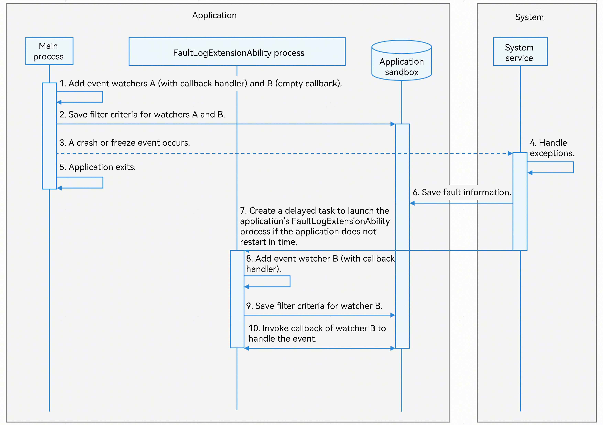

# Using FaultLogExtensionAbility to Subscribe to Events

<!--Kit: Performance Analysis Kit-->
<!--Subsystem: HiviewDFX-->
<!--Owner: @chenshi51-->
<!--Designer: @Maplestory91-->
<!--Tester: @gcw_KuLfPSbe-->
<!--Adviser: @foryourself-->

Starting from API version 21, you can use the HiAppEvent event subscription API in **FaultLogExtensionAbility** to implement delayed notifications for application [crash events](./hiappevent-watcher-crash-events.md) and [freeze events](./hiappevent-watcher-freeze-events.md)). After an application exits due to a crash or freeze and then fails to launch or has not been launched for an extended period, you can subscribe to and receive fault event callbacks without requiring the application to launch. **FaultLogExtensionAbility** is intended only for supplementary processing of fault events and does not replace fault event handling during normal [main process](../application-models/process-model-stage.md#basic-process-types) startup.

The system will launch the **FaultLogExtensionAbility** process 30 minutes after an application crash or freeze is detected. The actual launch time may be delayed due to system scheduling. This 30‑minute interval represents accumulated time while the device is awake. During testing, keep the device screen on to prevent the system from entering sleep mode. If the screen turns off and the device sleeps, the callback may be delayed.

## Mechanism Description

The following figure shows the mechanism of **FaultLogExtensionAbility**.



1. After the main process launches, event watcher A and watcher B are added to it. Watcher A includes a fully implemented callback handler and event filter criteria ([appEventFilter](../reference/apis-performance-analysis-kit/js-apis-hiviewdfx-hiappevent.md#appeventfilter)). If the application restarts normally after a fault occurs, watcher A's callback processes **HiAppEvent** events. Watcher B has an empty callback implementation and is used only to generate the event subscription filter criteria that need to be saved.
2. The subscription filter criteria for watchers A and B are saved to the application's sandbox. When a watcher is removed from the application, its corresponding filter criteria are deleted from the sandbox.
3. A crash or freeze event occurs during normal application operation.
4. The system service detects the application fault and collects fault information.
5. The application exits after the system service finishes collecting fault information
6. The system saves the collected fault information to the application's sandbox, based on the **HiAppEvent** types it subscribed to. If the application restarts in time, **HiAppEvent** detects unprocessed fault events in the sandbox. If these events match watcher A's filter criteria, it triggers watcher A's callback to handle the events. Watcher B (empty callback) does not reprocess the same events.
7. If the application does not restart in time, the system service creates a delayed task (30-minute delay) to launch the application's **FaultLogExtensionAbility** process after the fault occurs. If a delayed launch task for the process already exists in the task queue, no new task is created. The **FaultLogExtensionAbility** process exits automatically after 10 seconds, regardless of whether the events are processed.
8. Add event watcher B to the **FaultLogExtensionAbility** process. You must implement a functional callback handler for this watcher B, and it must use the same name as the watcher B added in the main process.
9. Since watcher B in **FaultLogExtensionAbility** shares the same name as the one in the main process, the application sandbox overwrites the previously saved subscription filter criteria for B.
10. **HiAppEvent** detects unprocessed fault events in the sandbox. If the events match watcher B's filter criteria (in **FaultLogExtensionAbility**), it triggers watcher B's callback logic. Unprocessed event data in the sandbox is deleted after the fault events are handled by the callback.

## Constraints

- Once **FaultLogExtensionAbility** is launched, it has only 10 seconds to complete fault handling. If the handling is not complete within the timeout interval, you can save the status in [onDisconnect](../reference/apis-performance-analysis-kit/js-apis-hiviewdfx-FaultLogExtensionAbility.md#ondisconnect).

- The timer starts when the application triggers a crash or freeze event for the first time after the device is powered on or **FaultLogExtensionAbility** is started last time. When a crash or screen freeze event is repeatedly triggered before **FaultLogExtensionAbility** is started, the timer will not restart. **FaultLogExtensionAbility** is started after 30 minutes.

- If **FaultLogExtensionAbility** crashes, it will not be restarted by the system service.

- For details about the APIs that cannot be called by **FaultLogExtensionAbility**, see [Appendix](../reference/apis-performance-analysis-kit/js-apis-hiviewdfx-FaultLogExtensionAbility.md#appendix).

- Events subscribed to in the **FaultLogExtensionAbility** process must be subscribed to in the main process using **HiAppEvent**. Failure to do so may result in the [FaultLogExtensionAbility process not receiving callback events](#what-should-i-do-if-the-faultlogextensionability-process-does-not-receive-the-callback-event).

- Only crash and freeze events should be subscribed to in the **FaultLogExtensionAbility** process. Otherwise, [system events may be repeatedly reported](#what-should-i-do-if-system-events-are-repeatedly-reported).

- In the main process, event watcher B (for delayed callback handling) and event watcher A (for immediate callback handling) must not share the same name. Otherwise, [some events may be lost](#what-should-i-do-if-some-events-are-lost).

- After **FaultLogExtensionAbility** is accessed, if the device restarts after an application fault occurs, the **FaultLogExtensionAbility** process will not be started after the restart.

## Available APIs

For details about how to use the APIs (such as parameter usage restrictions and value ranges), see [@ohos.hiviewdfx.FaultLogExtensionAbility (Delayed Fault Notification)](../reference/apis-performance-analysis-kit/js-apis-hiviewdfx-FaultLogExtensionAbility.md).

These APIs apply only to the stage model.

**Subscription APIs**

| API| Description|
| -------- | -------- |
| [onConnect(): void](../reference/apis-performance-analysis-kit/js-apis-hiviewdfx-FaultLogExtensionAbility.md#onconnect) | Called when the system connects to **FaultLogExtensionAbility**.|
| [onDisconnect(): void](../reference/apis-performance-analysis-kit/js-apis-hiviewdfx-FaultLogExtensionAbility.md#ondisconnect) | Called when the system disconnects from **FaultLogExtensionAbility**.|
| [onFaultReportReady(): void](../reference/apis-performance-analysis-kit/js-apis-hiviewdfx-FaultLogExtensionAbility.md#onfaultreportready) | Called when the system notifies ability of fault handling. It is recommended that the service logic in the callback does not exceed 10s.|

## How to Develop

The following walks you through on how to subscribe to the appfreeze event.

1. Create an ArkTS application project. In the **entry/src/main/ets/pages/Index.ets** file in the project, construct an appfreeze fault as follows:

   ```ts
   @Entry
   @Component
   struct Index {
     build() {
       Button("AppInput").
       .onClick(() => {
         let t = Date.now();
         while (Date.now() - t <= 15000) {}
       })
     }
   }
   ```

2. Edit the **entry/src/main/ets/entryability/EntryAbility.ets** file. The sample code is as follows.

   ```ts
   // Import the hiAppEvent module.
   import { hiAppEvent } from '@kit.PerformanceAnalysisKit';
       // Omitted code.
       // Add a subscription for system events (watcher A) in the onCreate function.
       hiAppEvent.addWatcher ({
          // Set the watcher name. The system identifies different watchers based on their names.
          name: "EntryAbilityWatcherNormal",
          // You can subscribe to system events that you are interested in. Here, the application freeze event is subscribed to.
          appEventFilters: [
              {
                  domain: hiAppEvent.domain.OS,
                  names: [hiAppEvent.event.APP_FREEZE]
              }
          ]
          // After a fault occurs, watcher A processes event callbacks when the application restarts normally.
          onReceive: (domain: string, appEventGroups: Array<hiAppEvent.AppEventGroup>) => {
              // Omitted code.
          }
       });
       // Add a subscription for system events (watcher B) in the onCreate function.
       hiAppEvent.addWatcher ({
          // Set the watcher name. The system identifies different watchers based on their names.
          name: "EntryAbilityWatcherExtension",
          // You can subscribe to system events that you are interested in. Here, the application freeze event is subscribed to.
          appEventFilters: [
              {
                  domain: hiAppEvent.domain.OS,
                  names: [hiAppEvent.event.APP_FREEZE]
              }
          ]
          // Empty implementation: used only to generate filter rules, ensuring fault events persist in the app sandbox until processed.
          // If the app restarts normally and watcher A has processed the same event, watcher B consumes the event retrieved from the sandbox with an empty implementation, avoiding duplicate processing of the event.
          onReceive: (domain: string, appEventGroups: Array<hiAppEvent.AppEventGroup>) => {

          }
       });
       // Omitted code.
   ```

3. Create the **faultlogextension/MyFaultLogExtensionAbility.ets** file in the **entry/src/main/ets** directory. Create the **MyFaultLogExtensionAbility** class that inherits from **FaultLogExtensionAbility** and override the three subscription APIs. The sample code is as follows.

   ```ts
   // Import the FaultLogExtensionAbility class.
   import { FaultLogExtensionAbility, hilog, hiAppEvent } from '@kit.PerformanceAnalysisKit';

   export default class MyFaultLogExtensionAbility extends FaultLogExtensionAbility {
    // Override onConnect().
    onConnect() {
      hilog.info(0x0000, 'testTag', `FaultLogExtensionAbility onConnect`);
    }

    // Override onDisconnect().
    onDisconnect() {
      hilog.info(0x0000, 'testTag', `FaultLogExtensionAbility onDisconnect`);
    }

    // Override onFaultReportReady().
    onFaultReportReady() {
      hilog.info(0x0000, 'testTag', `FaultLogExtensionAbility onFaultReportReady`);
      hiAppEvent.addWatcher({
        // Watcher name, which must be the same as that of watcher B in the main process.
        name: "EntryAbilityWatcherExtension",
        // You can subscribe to system events that you are interested in. Here, the application freeze event is subscribed to.
        appEventFilters: [
          {
            domain: hiAppEvent.domain.OS,
            names: [hiAppEvent.event.APP_FREEZE]
          }
        ],
        // Implement a callback for the registered system event so that you can apply custom processing to the event data obtained.
        onReceive: (domain: string, appEventGroups: Array<hiAppEvent.AppEventGroup>) => {
          hilog.info(0x0000, 'testTag', `HiAppEvent onReceive: domain=${domain}`);
          for (const eventGroup of appEventGroups) {
            // The event name uniquely identifies a system event.
            hilog.info(0x0000, 'testTag', `HiAppEvent eventName=${eventGroup.name}`);
            for (const eventInfo of eventGroup.appEventInfos) {
              // Apply custom processing to the event data obtained, for example, print the event data in the log.
              hilog.info(0x0000, 'testTag', `HiAppEvent eventInfo.domain=${eventInfo.domain}`);
              hilog.info(0x0000, 'testTag', `HiAppEvent eventInfo.name=${eventInfo.name}`);
              hilog.info(0x0000, 'testTag', `HiAppEvent eventInfo.eventType=${eventInfo.eventType}`);
              // Obtain the timestamp when the application freeze event occurs.
              hilog.info(0x0000, 'testTag', `HiAppEvent eventInfo.params.time=${eventInfo.params['time']}`);
              // Obtain the foreground/background status of the application when the application freeze event occurs.
              hilog.info(0x0000, 'testTag', `HiAppEvent eventInfo.params.foreground=${eventInfo.params['foreground']}`);
              // Obtain the version information of the application when the application freeze event occurs.
              hilog.info(0x0000, 'testTag', `HiAppEvent eventInfo.params.bundle_version=${eventInfo.params['bundle_version']}`);
              // Obtain the bundle name of the application when the application freeze event occurs.
              hilog.info(0x0000, 'testTag', `HiAppEvent eventInfo.params.bundle_name=${eventInfo.params['bundle_name']}`);
              // Obtain the process name of the application when the application freeze event occurs.
              hilog.info(0x0000, 'testTag', `HiAppEvent eventInfo.params.process_name=${eventInfo.params['process_name']}`);
              // Obtain the process ID of the application when the application freeze event occurs.
              hilog.info(0x0000, 'testTag', `HiAppEvent eventInfo.params.pid=${eventInfo.params['pid']}`);
              hilog.info(0x0000, 'testTag', `HiAppEvent eventInfo.params.uid=${eventInfo.params['uid']}`);
              hilog.info(0x0000, 'testTag', `HiAppEvent eventInfo.params.uuid=${eventInfo.params['uuid']}`);
              // Obtain the exception type and cause of the application freeze event.
              hilog.info(0x0000, 'testTag', `HiAppEvent eventInfo.params.exception=${JSON.stringify(eventInfo.params['exception'])}`);
              // Obtain the log information when the application freeze event occurs.
              hilog.info(0x0000, 'testTag', `HiAppEvent eventInfo.params.hilog.size=${eventInfo.params['hilog'].length}`);
              // Obtain the messages that are not yet processed by the main thread when the application freezes.
              hilog.info(0x0000, 'testTag', `HiAppEvent eventInfo.params.event_handler=${eventInfo.params['event_handler']}`);
              hilog.info(0x0000, 'testTag', `HiAppEvent eventInfo.params.event_handler_size_3s=${eventInfo.params['event_handler_size_3s']}`);
              hilog.info(0x0000, 'testTag', `HiAppEvent eventInfo.params.event_handler_size_6s=${eventInfo.params['event_handler_size_6s']}`);
              // Obtain the synchronous binder call information when the application freezes.
              hilog.info(0x0000, 'testTag', `HiAppEvent eventInfo.params.peer_binder=${eventInfo.params['peer_binder']}`);
              // Obtain the full thread call stack when the application freezes.
              hilog.info(0x0000, 'testTag', `HiAppEvent eventInfo.params.threads.size=${eventInfo.params['threads'].length}`);
              // Obtain the memory information when the application freezes.
              hilog.info(0x0000, 'testTag', `HiAppEvent eventInfo.params.memory=${JSON.stringify(eventInfo.params['memory'])}`);
              // Obtain the fault log file when the application freezes.
              hilog.info(0x0000, 'testTag', `HiAppEvent eventInfo.params.external_log=${JSON.stringify(eventInfo.params['external_log'])}`);
              hilog.info(0x0000, 'testTag', `HiAppEvent eventInfo.params.log_over_limit=${eventInfo.params['log_over_limit']}`);
            }
          }
        }
      });
    }
   }
   ```

4. In the **entry/src/main/module.json5** file in the project, add the extensionAbility information. The sample code is as follows.

   ```
   "extensionAbilities": [
     {
       "name" : "MyFaultLogExtensionAbility",
       "srcEntry": "./ets/faultlogextension/MyFaultLogExtensionAbility.ets",
       "type": "faultLog"
     }
   ]
   ```

## Debugging and Verification

In DevEco Studio, click the **Run** button to run the project. Then, click the **AppInput** button to trigger a freeze event. After the application exits, do not restart the application or device. Wait for about 30 minutes.

In the HiLog window, search for the keyword "testTag" to view the result of **FaultLogExtensionAbility**'s callback.

   ```text
   FaultLogExtensionAbility onConnect
   FaultLogExtensionAbility onFaultReportReady
   HiAppEvent onReceive: domain=OS
   HiAppEvent eventName=APP_FREEZE
   HiAppEvent eventInfo.domain=OS
   HiAppEvent eventInfo.name=APP_FREEZE
   HiAppEvent eventInfo.eventType=1
   ......
   FaultLogExtensionAbility onDisconnect
   ```
  The **FaultLogExtensionAbility** executes connection, processing, and disconnection in sequence.

## FAQs

### What should I do if the FaultLogExtensionAbility process does not receive the callback event

After the **FaultLogExtensionAbility** process starts, the callback subscribed by **HiAppEvent** is not received. The possible causes are as follows:

- Before the **FaultLogExtensionAbility** process starts, the main process has subscribed to and processed the event.
- The subscription in the **FaultLogExtensionAbility** process is the first subscription after the application is installed. **HiAppEvent** does not detect events that occur before the subscription. You need to subscribe to the events in the main process so that **HiAppEvent** will record the fault events and perform a callback after **FaultLogExtensionAbility** starts.

### What should I do if system events are repeatedly reported

System events are notified to all watchers who have subscribed to the events through the **HiAppEvent** callback. When the **FaultLogExtensionAbility** process and the main process both exist and subscribe to the same system event, they will receive the corresponding event callback after the system event is triggered.

### What should I do if some events are lost

Events that occur after the application starts and before the watcher is registered are lost. Check whether multiple event watchers with the same name are registered.

To prevent event loss, **HiAppEvent**, after the application starts but before the event watcher is registered, first scans the subscription filter criteria of event watchers that were not removed before the application's last exit, and accordingly subscribes to and saves events. If the same watcher with the same name is registered repeatedly, the information about the watcher registered later will overwrite that about the watcher registered earlier. As a result, the subscription filter criteria are overwritten, and events are lost.
