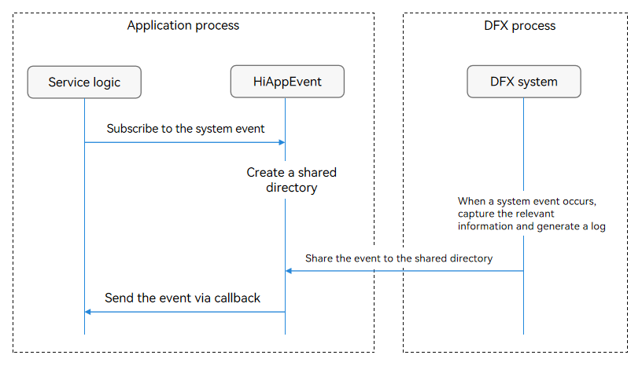
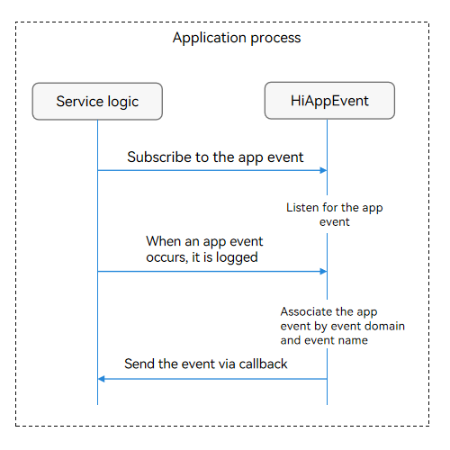

# Introduction to HiAppEvent

<!--Kit: Performance Analysis Kit-->
<!--Subsystem: HiviewDFX-->
<!--Owner: @liujiaxing2024-->
<!--Designer: @junjie_shi-->
<!--Tester: @gcw_KuLfPSbe-->
<!--Adviser: @foryourself-->

## Overview

HiAppEvent is an event logging mechanism provided for recording faults, statistics, security events, and behavior events during application running. It helps you locate faults, analyze application running status, and collect statistics on access traffic, user activity, operation habits, and other key factors that affect user experience.

## Basic Concepts

**Logging**: a function that logs changes caused by user operations to provide service data for development, product, and O&M analysis.

- Event domain: identifies the domain of an event. You are advised to set this parameter to the service domain name to differentiate service domains.

- Event name: specifies the name of an event. You are advised to set this parameter to a specific service name to differentiate services.

- Event type: specifies the type of an event. Four event types are supported:

  - Behavior event: used to record the daily operation behavior of a user, for example, button click and page redirection.
  - Fault event: used to locate and analyze application faults, for example, frame freezes and network interruption.
  - Statistical event: used to collect statistics on key application behaviors, for example, usage duration and number of visits.
  - Security event: used to record events related to application security, for example, user authorization.

- Event parameter: specifies the parameters of an event. Each event can contain a group of parameters. You are advised to set this parameter to an event attribute or event context to depict the event details.

**Event subscription**: You can use the [addWatcher](../reference/apis-performance-analysis-kit/js-apis-hiviewdfx-hiappevent.md#hiappeventaddwatcher) API of HiAppEvent to register a watcher for system events or application events that you concern. In this way, when the subscribed event occurs, you can receive and process the event callback information.

## Implementation Principles

### System Event Subscription Mechanism

In the current system application sandbox mechanism, an application process can access only its own application sandbox directory. For details, see [Application Sandbox](../file-management/app-sandbox-directory.md). However, the system event information is not stored in the application sandbox directory. As a result, the information cannot be directly obtained.

The application calls the **addWatcher** API of HiAppEvent to subscribe to system events and create a shared directory. When the application process is faulty, the DFX system captures the related information, generates events and logs, and writes them to the shared directory. After detecting an event, HiAppEvent sends the event to the application.

### Application Event Subscription Mechanism

After calling the addWatcher API to subscribe to the application event, the application must call the [write](../reference/apis-performance-analysis-kit/js-apis-hiviewdfx-hiappevent.md#hiappeventwrite-1) API to log application events.

HiAppEvent associates application events based on the event domain and event name, and sends the events to the application using the callback set through the **addWatcher** API.

> **NOTE**
>
> If an application has subscribed to an event but exits before the callback is triggered, the callback of the event will be executed after the application calls **addWatcher** at the next startup. For example, if an application subscribes to the crash event and exits due to a crash, the event callback is executed after **addWatcher** is called upon the next startup.

## Constraints

- The **addWatcher** API is a synchronous API and involves I/O operations. For modules that have high requirements on performance, you are advised to call the API on a non-main thread.

- The name passed to the **addWatcher** API should be unique. If the same name is passed, the previous subscription will be overwritten.

- Currently, HarmonyOS supports common applications, [application clones](../quick-start/app-clone.md), atomic services, and [input method applications](../inputmethod/inputmethod-application-guide.md). The subscription specifications of system events vary depending on the application type. Since API version 22, you can use the HiAppEvent system event subscription capability in the input method application. The following table lists the specifications.

|System Event Name|Application Clone Subscription|Atomic Service Subscription|Input Method Application Subscription|
|-----------|------------------|-----------------|-------------------|
|Crash event|   Supported |   Supported  |   Supported  |
|Application freeze event|   Supported |   Supported  |   Supported  |
|Resource leak event|   Supported |   Supported  |   Supported  |
|Address sanitizer event|   Supported |   Not supported  |   Supported  |
|Main thread jank event|   Supported |   Supported  |   Supported  |
|Task execution timeout event|   Supported |   Not supported  |   Supported  |
|Application killed event|   Supported |   Supported  |   Supported  |
|Time-consuming launch event|   Not supported |   Not supported  |   Not supported  |
|Scrolling frame loss event|   Not supported |   Not supported  |   Not supported  |
|High CPU usage event|   Not supported |   Not supported  |   Supported  |
|Battery usage statistics event|   Not supported |   Not supported  |   Supported  |
|Audio jank event|   Not supported |   Not supported  |   Not supported  |
