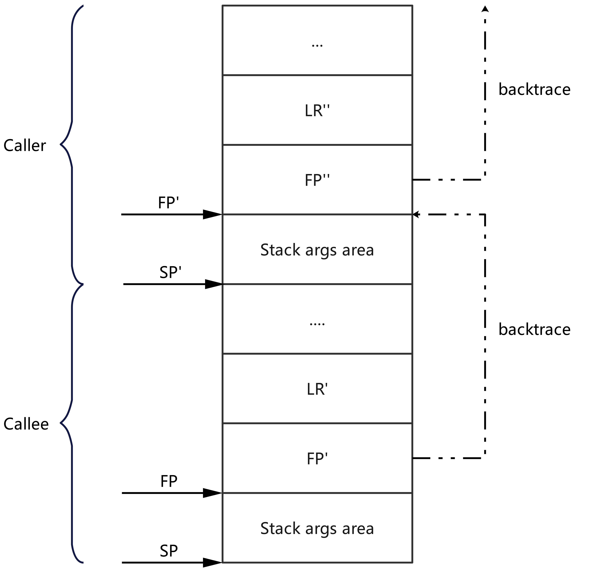

# Introduction to HiDebug

<!--Kit: Performance Analysis Kit-->
<!--Subsystem: HiviewDFX-->
<!--Owner: @hello_harmony; @yu_haoqiaida-->
<!--Designer: @kutcherzhou1-->
<!--Tester: @gcw_KuLfPSbe-->
<!--Adviser: @foryourself-->

HiDebug can obtain the memory, CPU, and GPU data of the system or application processes, and enable process trace collection.

This topic describes the ArkTS and C/C++ APIs of the HiDebug module and classifies them by API capability.

For details about the APIs, see [ArkTS API Reference](../reference/apis-performance-analysis-kit/js-apis-hidebug.md) and [C API Reference](../reference/apis-performance-analysis-kit/capi-hidebug-h.md).

## Constraints

API calls of this module are time-consuming. Some API calls take seconds, causing thread freeze. In addition, it is recommended that the APIs in the HiDebug module be used only in the application debugging and optimization phases. If the APIs are required in other scenarios, evaluate the impact of the APIs on application performance.

## Obtaining Memory Information

HiDebug can obtain the system memory, application process memory usage, application thread memory usage, and native memory allocation data collected by the memory allocator. During program development, these memory data can be used to detect and solve problems, optimize program performance, and ensure program stability.

### APIs (ArkTS)

| Name| Description  |
| -------- | -------- |
| hidebug.getNativeHeapSize | Obtains the total number of bytes occupied by the total space (**uordblks** and **fordblks**, which are obtained through **mallinfo**) held by a process, which is measured by the memory allocator.|
| hidebug.getNativeHeapAllocatedSize | Obtains the total number of bytes occupied by the total allocated space (**uordblks**, which is obtained through **mallinfo**) held by a process, which is measured by the memory allocator.|
| hidebug.getNativeHeapFreeSize | Obtains the total number of bytes occupied by the total free space (**fordblks**, which is obtained from **mallinfo**) held by a process, which is measured by the memory allocator.|
| hidebug.getPss | Obtains the size of the physical memory actually used by the application process. This API is implemented by reading and summing up the values of <b class="+ topic/ph hi-d/b " id="b7835135125313">Pss</b> and <b class="+ topic/ph hi-d/b " id="b188351351155317">SwapPss</b> in the <b class="+ topic/ph hi-d/b " id="b183595116532">/proc/{pid}/smaps_rollup</b> node.|
| hidebug.getVss | Obtains the virtual set size used by the application process. This API is implemented by reading the value of **size** (number of memory pages) from the **/proc/{pid}/statm** node and calculating the value using the following formula: **vss** = **size** × page size (4 KB/page).|
| hidebug.getSharedDirty | Obtains the size of the shared dirty memory of a process. This API is implemented by reading the value of **Shared_Dirty** in **/proc/{pid}/smaps_rollup**.|
| hidebug.getPrivateDirty | Obtains the size of the private dirty memory of a process. This API is implemented by reading the value of **Private_Dirty** in the **/proc/{pid}/smaps_rollup** node.|
| hidebug.getAppNativeMemInfo | Obtains the memory information of the application process. This API is implemented by reading data from the **/proc/{pid}/smaps_rollup and /proc/{pid}/statm** node.|
| hidebug.getAppNativeMemInfoAsync | Obtains the memory information of an application process in asynchronous mode.<br>Note: This API is supported since API version 20.|
| hidebug.getAppNativeMemInfoWithCache | Obtains the memory information of an application process. This API has a cache mechanism to improve its performance.<br>Note: This API is supported since API version 20.|
| hidebug.getSystemMemInfo | Obtains system memory information. This API is implemented by reading data from the **/proc/meminfo** node.|
| hidebug.getAppMemoryLimit | Obtains the memory limit of an application process. **rsslimit** and **vsslimit** are the values of **RLIMIT_RSS** and **RLIMIT_AS** obtained through the **getrlimit** API, respectively.|

### APIs (C/C++)

| Name| Description  |
| -------- | -------- |
| OH_HiDebug_GetSystemMemInfo | Obtains system memory information. This API is implemented by reading data from the **/proc/meminfo** node.|
| OH_HiDebug_GetAppNativeMemInfo | Obtains the memory information of the application process. This API is implemented by reading data from the **/proc/{pid}/smaps_rollup and /proc/{pid}/statm** node.|
| OH_HiDebug_GetAppNativeMemInfoWithCache | Obtains the memory information of an application process. This API has a cache mechanism to improve its performance.<br>Note: This API is supported since API version 20.|
| OH_HiDebug_GetAppMemoryLimit | Obtains the memory limit of an application process. **rsslimit** and **vsslimit** are the values of **RLIMIT_RSS** and **RLIMIT_AS** obtained through the **getrlimit** API, respectively.|

## Obtaining GPU Memory Information

HiDebug can obtain the GPU memory information of an application. In graphics-intensive applications, GPU memory management is critical. Misuse of GPU memory resources will cause severe frame freezes and affect user experience. GPU memory resources include:

1. **graph**: DMA memory usage of the process, including the DMA buffers obtained directly through the API and those obtained through **allocator_host**.

2. **gl**: Memory occupied by RenderService for loading required resources, such as images and textures.

### APIs (ArkTS)

| Name| Description                                                |
| -------- |----------------------------------------------------|
| hidebug.getGraphicsMemory | Obtains the total GPU memory size (**graph** + **gl**) of an application in asynchronous mode.                     |
| hidebug.getGraphicsMemorySync | Obtains the total GPU memory size (**graph** + **gl**) of an application in synchronous mode.|                   
| hidebug.getGraphicsMemorySummary | Obtains the GPU memory data of an application in asynchronous mode.<br>Note: This API is supported since API version 21.|

### APIs (C/C++)

| Name| Description                                            |
| -------- |------------------------------------------------|
| OH_HiDebug_GetGraphicsMemory | Obtains the total GPU memory size (**graph** + **gl**) of an application.                   |
| OH_HiDebug_GetGraphicsMemorySummary | Obtains the GPU memory data of an application.<br>Note: This API is supported since API version 21.|

## Obtaining CPU Usage

Monitoring the CPU usage is critical to performance analysis during application development. To help you optimize application performance and ensure smooth running of applications, the HiDebug module provides multiple APIs for obtaining the CPU usage.

### Implementation Principles

The HiView process obtains and caches the running data of the current CPU every 10 seconds as the benchmark for calculating the CPU usage. The following data is included:

1. System CPU usage data

The **/proc/stat** node contains the statistics of the CPU running data since the system is started. You can run the following command on the terminal to view the node information:

```
cat  /proc/stat
cpu  648079 547 703220 16994706 23006 101071 0 0 0 0
...
```

Fields in the CPU indicator:

The CPU statistics from left to right are as follows (**cpu** indicates the total running data of all CPUs, in jiffies):

- **user**: user-mode time occupied by non-low-priority processes (**nice** ≤ 0).

- **nice**: user-mode time occupied by low-priority processes (**nice** > 0).

- **system**: kernel-mode time.

- **idle**: idle time (excluding the I/O waiting time).

- **iowait**: I/O waiting time.

- **irq**: hard interrupt time.

- **softirq**: soft interrupt time.

- **steal**: time when a process that is not running on the VM is running in the virtualization environment.

- **guest**: time when non-low-priority processes (**nice** ≤ 0) are running on the VM (included in the **user** field).

- **guest_nice**: time when low-priority processes (**nice** > 0) are running on the VM (included in the **nice** field).

2. Process/Thread CPU usage data

```
// Process CPU running data collected by the kernel
struct ucollection_process_cpu_item {
    int pid;
    unsigned int thread_total;
    unsigned long long min_flt;
    unsigned long long maj_flt;
    unsigned long long cpu_usage_utime; // User-mode CPU running duration
    unsigned long long cpu_usage_stime;// Kernel-mode CPU running duration
    unsigned long long cpu_load_time;
};
// Thread CPU running data collected by the kernel
struct ucollection_thread_cpu_item {
    int tid;
    char name[16]; // 16 : max length of thread name
    unsigned long long cpu_usage_utime;// User-mode CPU running duration
    unsigned long long cpu_usage_stime;// Kernel-mode CPU running duration
    unsigned long long cpu_load_time;
};
```

You can call the API to obtain the current data, calculate the increments based on the baseline data, and use the following formulas to obtain the CPU usages:

System CPU usage:

```
(**systemUsage** increment + **niceUsage** increment + **userUsage** increment)/(**userTime** increment + **niceTime** increment + **systemTime** increment + **idleTime** increment + **ioWaitTime** increment + **irqTime** increment + **softIrqTime** increment)
```

Process/Thread CPU usage:

```
(**cpu_usage_utime** increment + **cpu_usage_stime** increment)/(ms-level timestamp increment)
```

### APIs (ArkTS)

| Name| Description  |
| -------- | -------- |
| hidebug.getAppThreadCpuUsage | Obtains the CPU usage of an application thread.|
| hidebug.getCpuUsage | Obtains the CPU usage of an application process.|
| hidebug.getSystemCpuUsage | Obtains the system CPU usage.|

### APIs (C/C++)

| Name| Description  |
| -------- | -------- |
| OH_HiDebug_GetSystemCpuUsage | Obtains the system CPU usage.|
| OH_HiDebug_GetAppCpuUsage | Obtains the CPU usage of a process.|
| OH_HiDebug_GetAppThreadCpuUsage | Obtains the CPU usage of all threads in an application.|
| OH_HiDebug_FreeThreadCpuUsage | Releases the data obtained by calling **OH_HiDebug_GetAppThreadCpuUsage**.|

## Obtaining VM Information

HiDebug can obtain VM memory data, GC statistics, and VM heap dump data.

### APIs (ArkTS)

| Name| Description  |
| -------- | -------- |
| hidebug.getAppVMMemoryInfo | Obtains VM memory information.|
| hidebug.getVMRuntimeStats | Obtains the system [GC](../arkts-utils/gc-introduction.md) statistics.|
| hidebug.getVMRuntimeStat | Obtains the specified system [GC](../arkts-utils/gc-introduction.md) statistics based on parameters.|
| hidebug.dumpJsRawHeapData | Dumps the original VM heap snapshot for the current thread in asynchronous mode. This API is used for JavaScript memory leak analysis.<br>Note: This API is supported since API version 18.|
| hidebug.setJsRawHeapTrimLevel | Sets the trimming level of the original heap snapshot stored by the current process.<br>Note: This API is supported since API version 20.|
| hidebug.dumpJsHeapData | Dumps the VM heap data in synchronous mode. This API is used for JavaScript memory leak analysis.|
| hidebug.getAppMemoryLimit | Obtains the memory limit of an application process. **vmHeapLimit** is the VM heap size limit of the current thread, and **vmTotalHeapSize** is the total size limit of all VM heaps in the current process.|
| hidebug.getAppVMObjectUsedSize | Obtains the VM memory size occupied by ArkTS objects.<br>Note: This API is supported since API version 21.|

## Obtaining Application Trace Records

HiTrace provides APIs to implement call chain tracing throughout a service process. This can help you obtain the run log for the call chain of a service process and locate faults across devices, processes, and threads. For details, see [Introduction to HiTraceMeter](hitracemeter-intro.md). To implement automatic HiTrace collection, the HiDebug module provides APIs for starting and stopping a HiTrace collection.

### APIs (ArkTS)

| Name| Description  |
| -------- | -------- |
| hidebug.startAppTraceCapture | Starts an application trace collection.|
| hidebug.stopAppTraceCapture | Stops an application trace collection.|

### APIs (C/C++)

| Name| Description  |
| -------- | -------- |
| OH_HiDebug_StartAppTraceCapture | Starts an application trace collection.|
| OH_HiDebug_StopAppTraceCapture | Stops an application trace collection.|

## Starting VM CpuProfiler

HiDebug provides APIs for starting and stopping a VM CpuProfiler, helping you implement an automatic CpuProfiler collection.

### APIs (ArkTS)

| Name| Description  |
| -------- | -------- |
| hidebug.startJsCpuProfiling | Starts the VM CPU profiling.|
| hidebug.stopJsCpuProfiling | Stops the VM CPU profiling.|

## Obtaining Call Stack

Obtaining call stack information is useful for debugging and error handling. It helps you understand the method calling sequence and caller information. HiDebug provides APIs for obtaining call stack information.

### Stack Backtracing Principles

The following figure shows the structure of the function stack frame in the ARM64 architecture.

**Figure 1**


**FP**: stack top pointer to the top of a stack frame. When a function jumps, the start position of the stack is recorded.

**SP**: stack pointer (stack bottom pointer) to the current position of the stack.

**LR**: pointer to the address returned by the function.

As shown in the preceding figure, the address adjacent to the FP stores the FP address of the previous frame and the function return address of the current frame. During stack backtracing, the stack information of the previous frame is parsed based on the function return address, and the LR and FP addresses stored in each function stack frame are found in sequence based on the FP address of the previous frame. Based on the FP stack backtracing feature, the current function can only obtain its own return address for stack parsing. Therefore, the call stack information of the current function cannot be obtained.

### APIs (C/C++)

| Name| Description  |
| -------- | -------- |
| OH_HiDebug_CreateBacktraceObject | Creates an object for stack backtracing and stack parsing.<br>Note: This API is supported since API version 20.|
| OH_HiDebug_DestroyBacktraceObject | Destroys the object created by **OH_HiDebug_CreateBacktraceObject** for stack backtracing and stack parsing.<br>Note: This API is supported since API version 20.|
| OH_HiDebug_BacktraceFromFp | Obtains the backtrace frame starting from the specified stack frame pointer.<br>Note: This API is supported since API version 20.|
| OH_HiDebug_SymbolicAddress | Obtains detailed symbol information based on the specified program counter (PC).<br>Note: This API is supported since API version 20.|

## Thread Stack Perf Sampling

HiDebug provides the Perf sampling functionality for the thread stack. This API periodically collects the running status of threads, accurately captures performance hotspots and hotspot functions at low performance overhead, and analyzes the call chain relationships of hotspot functions.

### Sampling Stack Specifications

The following is an example of the Perf sampling result:

   ```text
Tid: 52129, ThreadName: xample.perftest, Cputime: 3160ms, Count: 42
42 #00 pc 00000000001e01e4 /system/lib/ld-musl-aarch64.so.1(start+244)(de6b25d6d992bac030d72713568dfb59)
  42 #01 pc 000000000003682c /system/lib64/module/libtaskpool.z.so(Commonlibrary::Concurrent::TaskPoolModule::TaskRunner::TaskInnerRunner::Run()+76)(40aaf52f6b737f011eed52936860111f)
    42 #02 pc 000000000003b428 /system/lib64/module/libtaskpool.z.so(Commonlibrary::Concurrent::TaskPoolModule::Worker::ExecuteInThread(void const*)+460)(40aaf52f6b737f011eed52936860111f)
      42 #03 pc 0000000000018794 /system/lib64/platformsdk/libuv.so(uv_run+420)(eed416babeadbcffb483fd111b5effe6)
        42 #04 pc 0000000000029bec /system/lib64/platformsdk/libuv.so(uv__io_poll+1060)(eed416babeadbcffb483fd111b5effe6)
          42 #05 pc 0000000000018180 /system/lib64/platformsdk/libuv.so(uv__async_io+364)(eed416babeadbcffb483fd111b5effe6)
            42 #06 pc 000000000003c724 /system/lib64/module/libtaskpool.z.so(Commonlibrary::Concurrent::TaskPoolModule::Worker::PerformTask(uv_async_s const*)+1408)(40aaf52f6b737f011eed52936860111f)
              42 #07 pc 00000000000540e0 /system/lib64/platformsdk/libace_napi.z.so(napi_call_function+184)(61530eabcb1b8bae5c105ebcb2151bc1)
                42 #08 pc 000000000078fab8 /system/lib64/platformsdk/libark_jsruntime.so(panda::FunctionRef::CallForNapi(panda::ecmascript::EcmaVM const*, panda::JSValueRef*, panda::JSValueRef* const*, int)+940)(bc704f4139f03a59a1d34448f7b59fd0)
                  42 #09 pc 00000000001e5170 /system/lib64/platformsdk/libark_jsruntime.so(panda::ecmascript::InterpreterAssembly::Execute(panda::ecmascript::EcmaRuntimeCallInfo*)+268)(bc704f4139f03a59a1d34448f7b59fd0)
                    42 #10 at AddThread (entry|entry|1.0.0|src/main/ets/pages/Index.ts:13:21)
                      42 #11 pc 00000000004494b0 /system/lib64/module/arkcompiler/stub.an(BCStub_HandleCallthis2Imm8V8V8V8StwCopy+396)
                        42 #12 pc 0000000000de3efc /system/lib64/module/arkcompiler/stub.an(RTStub_PushCallArgsAndDispatchNative+44)
                          42 #13 pc 000000000005ad2c /system/lib64/platformsdk/libace_napi.z.so(panda::JSValueRef ArkNativeFunctionCallBack<true>(panda::JsiRuntimeCallInfo*)+224)(61530eabcb1b8bae5c105ebcb2151bc1)
                            42 #14 pc 000000000000a498 /data/storage/el1/bundle/libs/arm64/libentry.so(94ed3a52d7ef751a94358709d11c99545960cdd4)
                              41 #15 pc 000000000000a228 /data/storage/el1/bundle/libs/arm64/libentry.so(TestMyFunc()+120)(94ed3a52d7ef751a94358709d11c99545960cdd4)
                              1 #15 pc 000000000000a21c /data/storage/el1/bundle/libs/arm64/libentry.so(TestMyFunc()+108)(94ed3a52d7ef751a94358709d11c99545960cdd4)
   ```
The first line contains the thread ID, thread name, CPU time occupied by the target thread during API calling, and the number of samplings of the thread. (The CPU time occupied by the target thread is slightly greater than the actual CPU time during sampling because the API consumes performance.) The number of thread samplings is less than or equal to the number of samplings (Sampling frequency (Hz) × Sampling time (ms) × Unit conversion (1s/1000ms)).

Except the first line, each line indicates a piece of stack information. The following describes the meaning of a line of stack frame information:

Native frame:

   ```text
   41 #15 pc 000000000000a228 /data/storage/el1/bundle/libs/arm64/libentry.so(TestMyFunc()+120)(94ed3a52d7ef751a94358709d11c99545960cdd4)
   ^   ^       ^                                                      ^              ^                   ^ 
   1   2       3                                                      4              5                   6
   
   1 indicates the number of times that the frame is sampled. The value is less than or equal to the number of thread samplings.
   2 indicates the call level of the frame, which corresponds to the line indentation size. The number of samplings of the current level is the sum of the number of samplings of the next level.
   3 indicates the Program Counter (PC) value of the native frame.
   4 indicates the path of the called file.
   5 indicates the name of the called function and the code line offset.
   6 indicates the MD5 value of the .so file.
   ```

JS frame:

   ```text
   42 #10 at AddThread (entry|entry|1.0.0|src/main/ets/pages/Index.ts:13:21)
   ^   ^         ^                                             ^
   1   2         3                                             4
   
   1 indicates the number of times that the frame is sampled, which is the same as that of the native frame.
   2 indicates the invoking level of the frame, which is the same as that of the native frame.
   3 indicates the name of the called function.
   4 indicates the path, file, row number, and column number of the called function.
   ```

> **NOTE**
>
> When Perf is used to sample the kernel stack backtrace, the sampling stack depth is less than 50, and the frame-pointer is required. If the collected call stack is interrupted in a third-party library, check whether the stack pointer functionality is enabled for the third-party library.

### APIs (C/C++)

| Name| Description      |
| -------- |----------|
| OH_HiDebug_RequestThreadLiteSampling | Applies for thread stack sampling.<br>Note: This API is supported since API version 22.|

## Setting Resource Leak Detection Threshold

HiDebug provides APIs for setting the threshold of system resource leak detection. You can customize this threshold as required. This API is used to assist in memory leak detection and feature development. For details, see [Analyzing Resource Leaks](https://developer.huawei.com/consumer/en/doc/harmonyos-guides/resource-leak-guidelines).

### APIs (ArkTS)

| Name| Description|
| -------- | -------- |
| hidebug.setAppResourceLimit | Sets the threshold for triggering resource leak detection based on the number of file descriptors (FDs), number of threads, JavaScript memory, or native memory of an application.|

## Managing GWP-ASan

HiDebug provides the capabilities of enabling and disabling GWP-ASan and querying the number of days when GWP-ASan is enabled.

### APIs (ArkTS)

| Name| Description|
| -------- | -------- |
| hidebug.enableGwpAsanGrayscale | Enables GWP-ASan to detect illegal behaviors in heap memory usage.<br>Note: This API is supported since API version 20.|
| hidebug.disableGwpAsanGrayscale | Disables GWP-ASan.<br>Note: This API is supported since API version 20.|
| hidebug.getGwpAsanGrayscaleState | Obtains the remaining days for which GWP-ASan is enabled.<br>Note: This API is supported since API version 20.|

## Others

HiDebug provides features such as obtaining the application debugging status and starting the dump information collection of system processes.

### APIs (ArkTS)

| Name| Description|
| -------- | -------- |
| hidebug.isDebugState | Obtains the debugging state of an application process. If the Ark or native layer of the application process is in debugging state, **true** is returned. Otherwise, **false** is returned.|
| hidebug.getServiceDump | Obtains the dump information of a system service. This API can be called only by system applications.|

## FAQs

What should I do if the **OH_HiDebug_StartAppTraceCapture** and **startAppTraceCapture** APIs return local physical paths when capturing HiTrace logs?

The returned path is the real physical path on the device. If you need to access the path in the application, convert the real physical path to the sandbox path by referring to [Mappings Between Application Sandbox Paths and Physical Paths](../file-management/app-sandbox-directory.md#mappings-between-application-sandbox-paths-and-physical-paths).

Example: **/data/app/el2/100/log/com.example.myapplication/trace/com.example.myapplication_20250604_173158.trace** -> **/data/storage/el2/log/trace/com.example.myapplication_20250604_173158.trace**

What should I do if the **OH_HiDebug_GetAppThreadCpuUsage** and **getAppThreadCpuUsage** APIs report that the CPU usage of a newly created thread is 0?

If the calculation is based on the CPU usage, you need to obtain the current CPU running statistics and the calculation baseline value updated by HiView every 10 seconds. The new thread does not have a calculation baseline value. As a result, the CPU usage cannot be calculated, and 0 is returned by default.
