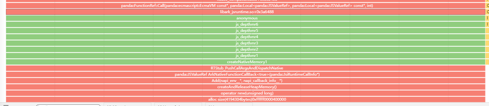

# hiprofiler

<!--Kit: Performance Analysis Kit-->
<!--Subsystem: HiviewDFX-->
<!--Owner: @zyxzyx-->
<!--Designer: @Maplestroy91-->
<!--Tester: @gcw_KuLfPSbe-->
<!--Adviser: @foryourself-->


## Overview


hiprofiler provides the performance profiling capabilities for you to analyze memory and performance issues.


Its overall architecture comprises the profiling data display page on the PC and performance profiling service on the device. The PC and device services use the C/S model. The profiling data on the PC is displayed on the [DevEco Studio](https://developer.huawei.com/consumer/en/doc/harmonyos-guides/ide-software-install) and [SmartPerf](https://gitcode.com/openharmony/developtools_smartperf_host/releases) pages. The device program consists of multiple parts that run in the system environment. The **hiprofilerd** process communicates with DevEco Studio to provide profiling services. The device also contains the CLI tool (**hiprofiler_cmd**) and data collection process (**hiprofiler_plugins**). Based on the Producer-Consumer model, the profiling service controls the data collection process to obtain profiling data and sends the data to DevEco Studio. Currently, plugins such as nativehook, CPU, ftrace, GPU, hiperf, xpower, and memory have been implemented, providing comprehensive profiling capabilities for CPU, GPU, memory, and power consumption.


Benchmarking with profilers in the industry, hiprofiler provides more capabilities, such as [cross-language stack unwinding, power consumption data obtaining, and long-time heap memory stack capturing](#plugin-parameters).


## Environment Requirements

- The environment for OpenHarmony Device Connector (hdc) has been set up. For details, see [Environment Setup](hdc.md#environment-setup).

- The devices are properly connected and **hdc shell** is executed.


## Architecture

1. The PC calls the hiprofiler_cmd tool on DevEco Studio or SmartPerf.

2. The **hiprofiler_cmd** process starts the hiprofilerd service and the **hiprofiler_plugins** process.

3. **hiprofiler_plugins** enables the corresponding plugin and summarizes the obtained profiling data to the hiprofilerd process.

4. The **hiprofilerd** process stores the profiling data in proto format to a file, or returns it to the PC in real time.

5. The PC parses the data, generates lanes, and displays the obtained profiling data.


## Command Syntax

You can use hiprofiler_cmd to call different plugins and input different parameters for different profiling requirements. The following is an example command:

```shell
$ hiprofiler_cmd \
  -c - \
  -o /data/local/tmp/hiprofiler_data.htrace \
  -t 30 \
  -s \
  -k \
  --nonblock \
<<CONFIG
 request_id: 1
 session_config {
  buffers {
   pages: 16384
  }
 }
 plugin_configs {
  plugin_name: "ftrace-plugin"
  sample_interval: 1000
  config_data {
   hitrace_categories: "binder"
   buffer_size_kb: 204800
   flush_interval_ms: 1000
   flush_threshold_kb: 4096
   trace_period_ms: 200
  }
 }
CONFIG
```


| Command| Description| 
| -------- | -------- |
| -c | After setting this option, you need to place the configuration file in the **/data/local/tmp** directory and input the path.| 
| -o | Sets the custom file save path, which must start with **/data/local/tmp**. If no path is set, the profiling data is saved to **/data/local/tmp/hiprofiler_data.htrace** by default. If the profiling is performed repeatedly, the file in the original path will be overwritten.| 
| -k | Kills the existing profiling service process.| 
| -s | Starts the profiling service process.| 
| -t | Sets the profiling duration, in seconds.|
| --nonblock | Sets **hiprofiler_cmd** to run in non-blocking mode.<br>After the command is executed, **hiprofiler_cmd** runs in the background and other commands can be executed.<br>If this parameter is not set, **hiprofiler_cmd** will block the execution until it is complete.<br>Note: This parameter is supported since API version 23.|


After inputting the **hiprofiler_cmd** parameter, input the plugin configuration information, which starts with **<<CONFIG** and ends with **CONFIG**. The configuration varies depending on the plugin. For details, see [Plugin Parameters](#plugin-parameters).


The following table describes the **session config** fields.


| Field| Description| 
| -------- | -------- |
| buffers | Number of shared memory pages.| 
| split_file | Whether to split a file. The value **true** means to split the file, and **false** means the opposite.| 
| split_file_max_size_mb | Maximum size of each split file when **split_file** is set to **true**.| 


The following table describes the **plugin_configs** fields.


| Field| Description| 
| -------- | -------- |
| plugin_name | Name of the plugin to enable.| 
| sample_interval | Interval for the plugin to obtain profiling data, in milliseconds.| 
| config_data | Parameters of the plugin. The parameters required by each plugin are different. For details, see the **proto** definition of the plugins.<br>(The code path is **developtools/profiler/protos**.)| 


Download the generated trace file to the local PC by running the **hdc file recv** command, and then upload the file to SmartPerf or DevEco Studio for parsing.


## Plugins Supported

| Name| Description| Specifications|
| -------- | -------- | -------- |
| [native hook](#nativehook)| Obtains the call stack information about heap memory allocation.| Only [applications signed by the debug certificate](#applications-signed-by-the-debug-certificate) can be collected.|
| [ftrace plugin](#ftrace-plugin)| Obtains the trace events of kernel logging and the HiTrace logging data.| - |
| [cpu plugin](#cpu-plugin)| Obtains the CPU usage information of a process, including the process-level and thread-level usage.| - |
| [gpu plugin](#gpu-plugin)| Obtains the GPU usage information of a process.| - |
| [xpower plugin](#xpower-plugin)| Obtains the power consumption information of a process.| - |
| [memory plugin](#memory-plugin)| Obtains the memory usage of a process, primarily the data from its **smaps** node.| - |
| [diskio plugin](#diskio-plugin)| Obtains the disk space usage of a process.| - |
| [network profiler](#network-profiler)| Obtains the detailed HTTP/HTTPS request information of a process through process logging.| Only [applications signed by the debug certificate](#applications-signed-by-the-debug-certificate) can be collected.|
| [network plugin](#network-plugin)| Obtains the network traffic statistics of a process.| - |
| [hisysevent plugin](#hisysevent-plugin)| Obtains the HiSysEvent event data by running the HiSysEvent commands.| - |
| [hidump plugin](#hidump-plugin)| Obtains the related data by running the SP_daemon commands.| - |


## Applications Signed by the Debug Certificate


> **NOTE**
>
> Run the **hdc shell "bm dump -n bundlename | grep appProvisionType"** command to check whether the application specified in the command is a debug-type application. The expected output is **"appProvisionType": "debug"**.

For example, run the following command to check the bundle name **com.example.myapplication**:

```shell
hdc shell "bm dump -n com.example.myapplication | grep appProvisionType"
```

If the application is a debug-type application, the following information is displayed:

```shell
"appProvisionType": "debug",
```

To build a debug application, you need to use a debug certificate for signature. For details about how to request and use the debug certificate, see [Requesting a Debug Certificate](https://developer.huawei.com/consumer/en/doc/app/agc-help-add-debugcert-0000001914263178).


## Plugin Parameters


### nativehook

Obtains the call stack information of heap memory allocations (by the **malloc**, **mmap**, **calloc** or **realloc** function), cross-language allocations (for example, native heap memory allocated by the Node-API in ArkTS), and unreleased heap memory due to memory leaks.

**Parameters**

| Name| Type| Description| Details| 
| -------- | -------- | -------- | -------- |
| fp_unwind | bool | Whether to enable stack unwinding in fp mode. The value **true** means to enable stack unwinding in fp mode.<br>The value **false** means to enable stack unwinding in dwarf mode.| The stack unwinding in fp mode is implemented by using the x29 register, in which the function fp always points to the parent function (caller) fp. After stack unwinding, the profiling service calculates the relative PC based on the instruction pointer (IP) and searches for the corresponding mapping in maps for symbolization.<br>Due to increasingly aggressive compiler optimizations, register reuse and disabled fp can cause stack unwinding in fp mode to fail. In mixed stacks, the fp alone cannot capture all frames, so dwarf is required for more accurate stack rewinding.<br>The stack unwinding in dwarf mode is to search for the corresponding mapping information in the map table based on the PC register. The performance of dwarf is worse than that of fp because the call stack is parsed level by level in dwarf mode.<br>Note: fp stack unwinding does not support profiling for non-AArch64 devices.| 
| statistics_interval | int | Statistics interval, in seconds. Stacks in a statistics interval are summarized.| The statistics stack capture mode is provided to implement long-term lightweight collection. If profiling performance is a priority and you only need call counts and total stack size, use statistics mode.| 
| process_name | string | Name of the process for which memory profiling is to be performed.| The value must be the same as the process name in the **/proc/** node.| 
| startup_mode | bool | Whether to capture the memory during process startup. By default, the memory during process startup is not captured.| This parameter records the heap memory allocation information during the period from the start of process incubation to the end of optimization.| 
| js_stack_report | int | Whether to enable cross-language stack unwinding.<br>The value **0** means not to capture the JS stack.<br>The value **1** means to capture the JS stack.| This parameter provides the cross-language stack unwinding feature for the Ark environment.| 
| malloc_free_matching_interval | int | Matching interval, in seconds. **malloc** and **free** are matched within the interval. If matched, the stack is not flushed to the disk.| Within the matching interval, the allocated and released call stacks are not recorded, reducing the overhead of the stack capture service process. If this parameter is set to a value greater than 0, **statistics_interval** cannot be set to **true**.| 
| offline_symbolization | bool | Whether to enable offline symbolization.<br>The value **true** means to enable offline symbolization;<br>the value **false** means the opposite.| When offline symbolization is used, the operation of matching symbols based on IP is performed on SmartPerf, reducing process freezes during profiling. However, since the offline symbol table is written into the trace file, the trace file generated under offline symbolization is larger in size than that under online symbolization.|
| sample_interval | int | Sampling size.| When this parameter is set, the sampling mode is enabled. In sampling mode, malloc allocations smaller than the sampling size are accounted for probabilistically. The larger the call-stack allocation size, the more frequently it occurs and the greater its chance of being sampled.| 
| restrace_tag | string | Type of the GPU memory to be captured.| This parameter can be added repeatedly. Currently, this parameter can only be set to **RES_GPU_VK**, **RES_GPU_GLES_BUFFER**, **RES_GPU_GLES_IMAGE**, **RES_GPU_CL_BUFFER**, or **RES_GPU_CL_IMAGE**, which are used to specify the GPU memory allocation stack of Vulkan, OpenGL ES, OpenCL, image, and buffer types.<br>Note: This parameter is supported since API version 21.|

**Result analysis**

The fp stack unwinding and cross-language stack unwinding are enabled (green frames denote JavaScript).


The dwarf stack unwinding and cross-language stack unwinding are enabled (native ->JS -> native stack frames are displayed).



Statistics mode is enabled (the stack data is displayed periodically).


Non-statistics mode is enabled (the stack data is not displayed periodically).


### ftrace-plugin

**Parameters**

| Name| Type| Description| Details| 
| -------- | -------- | -------- | -------- |
| ftrace_events | string | Captured trace events.| Trace events that record kernel logging.| 
| hitrace_categories | string | Captured HiTrace logging information.| The HiTrace capability is called to obtain data and write the data to a file in proto format.| 
| hitrace_apps | string | Captured HiTrace information process.| When this parameter is set, only the trace information of the corresponding process is recorded. When this parameter is added, binder cannot be added to **hitrace_categories**. Otherwise, trace data parsing will be abnormal.| 
| buffer_size_kb | int | Buffer size, in KB.| Cache size required for the **hiprofiler_plugins** process to read kernel events. The default value **204800** is recommended.| 
| flush_interval_ms | int | Data collection interval, in ms.| The default value **1000** is recommended.| 
| flush_threshold_kb | int | Size of the data to refresh.| Data is refreshed to the file once when the threshold is exceeded. It is recommended that you use the default value of SmartPerf.| 
| parse_ksyms | bool | Whether to obtain kernel data.| The value **true** means to obtain kernel data, and **false** means the opposite.| 
| trace_period_ms | int | Period for reading kernel data.| It is recommended that you use the default value of SmartPerf.| 

**Result analysis**

Example:

```shell
$ hiprofiler_cmd \
  -c - \
  -o /data/local/tmp/hiprofiler_data.htrace \
  -t 10 \
  -s \
  -k \
<<CONFIG
request_id: 1
session_config {
  buffers {
  pages: 16384
  }
}
plugin_configs {
  plugin_name: "ftrace-plugin"
  sample_interval: 1000
  config_data {
  ftrace_events: "binder/binder_transaction"
  ftrace_events: "binder/binder_transaction_received"
  buffer_size_kb: 204800
  flush_interval_ms: 1000
  flush_threshold_kb: 4096
  parse_ksyms: true
  clock: "boot"
  trace_period_ms: 200
  debug_on: false
  }
}
CONFIG
```

This command reads the kernel **binder_transaction** and **binder_transaction_received** data. The two fields must be used together to completely display the data at both ends of the binder. After running the command, run the **hdc file recv /data/local/tmp/hiprofiler_data.htrace** command to export the file to the current directory, and then use SmartPerf to open and parse the file. The following figure shows an example result.

You can click the arrow on the right of **binder transaction** to go to the process or thread on the other end of the binder.


### memory-plugin

**Parameters**

| Name| Type| Description| Details| 
| -------- | -------- | -------- | -------- |
| report_sysmem_vmem_info | bool | Whether to read virtual memory data.| Data is read from the **/proc/vmstat** node.| 
| report_process_mem_info | bool | Whether to obtain the detailed memory data of a process, such as **rss_shmem**, **rss_file**, and **vm_swap**.| Data is read from the **/proc/${pid}/stat** node.| 
| report_smaps_mem_info | bool | Whether to obtain the smaps memory information of a process.| Data is read from the **/proc/${pid}/smaps** node.| 
| report_gpu_mem_info | bool | Whether to obtain the GPU usage of a process.| Data is read from the **/proc/gpu_memory** node.| 
| parse_smaps_rollup | bool | Whether to read smaps statistics from the **smaps_rollup** node.| Data is read from the **/proc/{pid}/smaps_rollup** node. The profiling effect (for CPU and memory usage) is better than that of using the **report_smaps_mem_info** parameter.| 

The following memory information is displayed:
- **MemTotal**: total memory size.
- **MemFree**: free memory size.
- **Buffers**: buffer size of files.
- **Cached**: cache size.
- **Shmem**: size of allocated shared memory.
- **Slab**: kernel data cache size.
- **SUnreclaim**: size of unreclaimable slab.
- **SwapTotal**: total size of the swap space.
- **SwapFree**: size of the unused swap space.
- **Mapped**: size of the mapping for devices and files.
- **VmallocUsed**: size of the used virtual memory.
- **PageTables**: size of the index table that manages memory paging.
- **KernelStack**: memory consumed by the kernel.
- **Active**: size of the buffer or cache page file that is frequently used.
- **Inactive**: size of the buffer or cache page file that is not frequently used.
- **Unevictable**: size of the memory page that cannot be released.
- **VmallocTotal**: total size of the vmalloc virtual memory.
- **CmaTotal**: total size of the contiguous available memory.
- **CmaFree**: size of the free available memory.
- **Zram**: size of the used zRAM.
- **ZramTotal**: total size of zRAM.

>**NOTE**
>
> The difference between **Active** and **Inactive** is that **Active** contains data that has been used recently while **Inactive** does not. When the physical memory is insufficient and the memory space in use needs to be released, the **Inactive** memory is released first.

**Result analysis**

Run the **hiprofiler_cmd** command to obtain the memory data.

Example:

```shell
$ hiprofiler_cmd \
  -c - \
  -o /data/local/tmp/hiprofiler_data.htrace \
  -t 30 \
  -s \
  -k \
<<CONFIG
request_id: 1
session_config {
  buffers {
  pages: 16384
  }
}
plugin_configs {
  plugin_name: "memory-plugin"
  sample_interval: 5000
  config_data {
  report_process_tree: true
  report_sysmem_mem_info: true
  sys_meminfo_counters: PMEM_MEM_TOTAL
  sys_meminfo_counters: PMEM_MEM_FREE
  sys_meminfo_counters: PMEM_BUFFERS
  sys_meminfo_counters: PMEM_CACHED
  sys_meminfo_counters: PMEM_SHMEM
  sys_meminfo_counters: PMEM_SLAB
  sys_meminfo_counters: PMEM_SWAP_TOTAL
  sys_meminfo_counters: PMEM_SWAP_FREE
  sys_meminfo_counters: PMEM_MAPPED
  sys_meminfo_counters: PMEM_VMALLOC_USED
  sys_meminfo_counters: PMEM_PAGE_TABLES
  sys_meminfo_counters: PMEM_KERNEL_STACK
  sys_meminfo_counters: PMEM_ACTIVE
  sys_meminfo_counters: PMEM_INACTIVE
  sys_meminfo_counters: PMEM_UNEVICTABLE
  sys_meminfo_counters: PMEM_VMALLOC_TOTAL
  sys_meminfo_counters: PMEM_SLAB_UNRECLAIMABLE
  sys_meminfo_counters: PMEM_CMA_TOTAL
  sys_meminfo_counters: PMEM_CMA_FREE
  sys_meminfo_counters: PMEM_KERNEL_RECLAIMABLE
  sys_meminfo_counters: PMEM_ACTIVE_PURG
  sys_meminfo_counters: PMEM_INACTIVE_PURG
  sys_meminfo_counters: PMEM_PINED_PURG
  report_sysmem_vmem_info: true
  report_process_mem_info: true
  report_app_mem_info: false
  report_app_mem_by_memory_service: false
  report_purgeable_ashmem_info: true
  report_dma_mem_info: true
  report_gpu_mem_info: true
  }
}
CONFIG
```

This command reads the basic memory statistics of the system. After the command is executed, run the **hdc file recv /data/local/tmp/hiprofiler_data.htrace** command to export the file to the current directory, and then open and parse the file on SmartPerf. The following figure shows an example result.


Use DevEco Studio to obtain the memory data.


You can go to **DevEco Studio** -> **Profiler** -> **Allocation** and select **Memory** to use the **memory plugin** feature of the profiler. The preceding figure shows the process smaps memory information in the selected time range.

### xpower-plugin

**Parameters**

| Name| Type| Description| Details| 
| -------- | -------- | -------- | -------- |
| bundle_name | string | Name of the process for which power consumption profiling is required.| The value must be the same as the process name in the **/proc/** node.| 
| message_type | XpowerMessageType | Type of the power consumption data to be obtained.| The data types include **REAL_BATTERY**, **APP_STATISTIC**, **APP_DETAIL**, **COMPONENT_TOP**, **ABNORMAL_EVENTS**, and **THERMAL_REPORT**.| 

**Result analysis**


You can go to **DevEco Studio** -> **Profiler** -> **Realtime Monitor** to obtain the power consumption data of related processes.


### gpu-plugin

Obtain the GPU usage information.

**Parameters**

| Name| Type| Description| Details|
| -------- | -------- | -------- | -------- |
| pid | int | Process ID to profile, which is the same as the process ID in the **/proc/** node.| - |
| report_gpu_info | bool | Whether to display the GPU usage of a specified process.| The value **true** means to display the GPU data of a specified process (PID needs to be set), and **false** means the opposite.|


### cpu-plugin

Obtain the CPU usage information.

**Parameters**

| Name| Type| Description| Details| 
| -------- | -------- | -------- | -------- |
| pid | int | Process ID to profile.| The value must be the same as the process ID in the **/proc/** node.|
| report_process_info | bool | Whether to display the CPU usage of a specified process.| The value **true** means to display the CPU usage of a specified process (PID needs to be set);<br>the value **false** means to display only the system CPU usage.| 
| skip_thread_cpu_info | bool | Whether to skip the thread CPU usage data.| The value **true** means to not display the CPU usage of each thread, which reduces the profiling overhead;<br>the value **false** means the opposite.| 

The following lists the basic CPU information:
- **Start Time**: start time of the collection.
- **Duration**: interval between the previous collection and the current collection.
- **TotalLoad%**: total CPU usage.
- **UserLoad%**: CPU usage in user mode.
- **SystemLoad%**: CPU usage in kernel mode.
- **Process**: process ID.

**Result analysis**

Example:

```shell
$ hiprofiler_cmd \
  -c - \
  -o /data/local/tmp/hiprofiler_data.htrace \
  -t 30 \
  -s \
  -k \
<<CONFIG
request_id: 1
session_config {
  buffers {
  pages: 16384
  }
}
plugin_configs {
  plugin_name: "cpu-plugin"
  sample_interval: 1000
  config_data {
  report_process_info: true
  }
}
CONFIG
```

This command reads the basic CPU statistics. After the command is executed, run the **hdc file recv /data/local/tmp/hiprofiler_data.htrace** command to export the file to the current directory, and then open and parse the file on SmartPerf. The following figure shows an example result.


### diskio-plugin

Obtain the disk I/O usage information of the entire device.

**Parameters**

| Name| Type| Description| Details| 
| -------- | -------- | -------- | -------- |
| report_io_stats | IoReportType | Disk I/O statistics.| The value is an enum type. Currently, only **IO_REPORT** is supported.| 

When **IO_REPORT** is set, the following disk I/O information is obtained:
- **Data Read**: total number of bytes read from the disk to the memory.
- **Data Read/sec**: number of bytes read from the disk to the memory per second.
- **Data Write**: total number of bytes written from the memory to the disk.
- **Data Write/sec**: number of bytes written from the memory to the disk per second.
- **Reads In**: number of bytes read.
- **Reads In/sec**: number of bytes read per second.
- **Write Out**: number of bytes written.
- **Write Out/sec**: number of bytes written per second.

**Result analysis**

Example:

```shell
$ hiprofiler_cmd \
  -c - \
  -o /data/local/tmp/hiprofiler_data.htrace \
  -t 30 \
  -s \
  -k \
<<CONFIG
request_id: 1
session_config {
  buffers {
  pages: 16384
  }
}
plugin_configs {
  plugin_name: "diskio-plugin"
  sample_interval: 1000
  config_data {
  report_io_stats: IO_REPORT
  }
}
CONFIG
```

This command reads the basic disk I/O statistics. After the command is executed, run the **hdc file recv /data/local/tmp/hiprofiler_data.htrace** command to export the file to the current directory, and then open and parse the file on SmartPerf. The following figure shows an example result.


### hidump-plugin

Obtain the frame rate of an application process.

**Parameters**

| Name| Type| Description| Details| 
| -------- | -------- | -------- | -------- |
| report_fps | bool | Whether to report the frame rate data.| The value **true** means to report the frame rate data of the application process;<br>the **value** false means the opposite.|
| sections | uint32 | Number of times that the frame rate data is reported per second.| The default value is **10**, that is, the frame rate data is reported every 100 ms.|

**Result analysis**

Currently, this plugin only supports trace data parsing on DevEco Studio. SmartPerf is not supported. For details, see the following figure.


### hisysevent-plugin

Obtain the system event data.

**Parameters**

| Name| Type| Description| Details| 
| -------- | -------- | -------- | -------- |
| msg | string | Custom string.| Reserved field. An empty string can be passed.|
| subscribe_domain | string | Domain to subscribe to.| Used to subscribe to all events in a specific domain. If this field is left empty, all events in all domains are subscribed to.|
| subscribe_event | string | Event to subscribe to.| Used to subscribe to a specific event. If this field is left empty, all events are subscribed to.|

**Result analysis**

Example:

```shell
$ hiprofiler_cmd \
  -c - \
  -o /data/local/tmp/hiprofiler_data.htrace \
  -t 30 \
  -s \
  -k \
<<CONFIG
request_id: 1
session_config {
  buffers {
  pages: 16384
  }
}
plugin_configs {
  plugin_name: "hisysevent-plugin"
  config_data {
  msg: "hisysevent-plugin"
  subscribe_domain: ""
  subscribe_event: ""
  }
}
CONFIG
```
This command captures information about all hisystem event subscriptions. After the command is executed, run the **hdc file recv /data/local/tmp/hiprofiler_data.htrace** command to export the file to the current directory, and then open and parse the file on SmartPerf. The following figure shows an example result.


### network-plugin
 
Obtains the network upload and download data, and collects statistics on network traffic and connection status provided by the network management module.

**Parameters**

| Name| Type| Description| Mandatory| Details| 
| -------- | -------- | -------- | -------- | -------- |
| pid | int32 | Process ID.| No| Used to obtain the network data of a specified process. Multiple parameters can be passed in. If this parameter is not specified, the network data of the entire device is captured.|
| startup_process_name | string | Name of the process to start.| No| This parameter must be specified for capturing network data of a specified process.|
| restart_process_name | string | Name of the process to restart.| No| This parameter must be specified for capturing network data of a specified process after the process restarts.|

>**NOTE**
>
> **startup_process_name** and **restart_process_name** cannot be both empty.

The following lists the network information:
- **StartTime**: start time of the collection.
- **Duration**: interval between the previous collection and the current collection.
- **Data Received**: total number of received network bytes.
- **Data Received/sec**: number of received network bytes per second.
- **Data Send**: total number of sent network bytes.
- **Data Send/sec**: number of sent network bytes per second.
- **Packets In**: total number of received network packets.
- **Packets In/sec**: number of received network packets per second.
- **Packets Out**: total number of sent network packets.
- **Packets Out/sec**: number of sent network packets per second.

**Result analysis**

Example:

```shell
$ hiprofiler_cmd \
  -c - \
  -o /data/local/tmp/hiprofiler_data.htrace \
  -t 30 \
  -s \
  -k \
<<CONFIG
request_id: 1
session_config {
  buffers {
  pages: 16384
  }
}
plugin_configs {
  plugin_name: "network-plugin"
  sample_interval: 1000
  config_data {
  }
}
CONFIG
```
This command captures network data of the entire device. After the command is executed, run the **hdc file recv /data/local/tmp/hiprofiler_data.htrace** command to export the file to the current template, and then open and parse the file on SmartPerf. The following figure shows an example result.


### network profiler
 
Obtains the network request information of a process, and records each HTTP request as a data point.

**Parameters**

| Name| Type| Description| Mandatory| Details| 
| -------- | -------- | -------- | -------- | -------- |
| pid | int32 | Process ID.| No| Used to obtain the network data of a specified process. Multiple parameters can be passed in. If this parameter is not specified, the network data of the entire device is captured.|
| startup_process_name | string | Name of the process to start.| No| This parameter must be specified for capturing network data of a specified process.|
| restart_process_name | string | Name of the process to restart.| No| This parameter must be specified for capturing network data of a specified process after the process restarts.|
| clock_id | int | Clock type.| Yes| **1**: BOOTTIME, which indicates the monotonically increasing time (including NTP adjustment) after the system starts.<br> **2**: REALTIME, which indicates the adjustable system real time.<br>**3**: REALTIME_COARSE, which indicates the low-precision real time.<br>**4**: MONOTONIC, which indicates the monotonically increasing time without NTP adjustment.<br>**5**: MONOTONIC_COARSE, which indicates the low-precision monotonically increasing time.<br>**6**: MONOTONIC_RAW, which indicates the hardware raw monotonically increasing time.|
| smb_pages | int | Number of shared memory pages.| Yes| Size of the shared memory established between the hiprofiler_plugins process and the profiled process. The recommended value is 16384 pages, that is, 16384 × 4096 = 67108864 bytes (64 MB).|
| flush_interval | int |  Disk flush interval.| No| A disk flush is triggered every **flush_interval** network requests, optimizing the I/O efficiency.<br>The default value is **1**.|
| block | bool | Whether to enable the block mode.| No| **true**: Enable the block mode when the shared memory is full, which may affect the performance.<br> **false**: Discard the excess data when the shared memory is full.<br>The default value is **false**.|


**Result analysis**

Currently, SmartPerf does not support trace data parsing of this plugin. To analyze network data, use the NetWork feature of DevEco Studio Profiler. The reference is as follows:

[Network Diagnosis: Network](https://developer.huawei.com/consumer/en/doc/harmonyos-guides/ide-profiler-network)

## Common Commands

### Sampling Records of Heap Memory Allocation Call Stack Data


Capture the stack of heap memory allocation operations of the **com.example.insight_test_stage** process, and enable fp stack unwinding, offline symbolization, and statistics mode.

```shell
$ hiprofiler_cmd \
  -c - \
  -t 30 \
  -s \
  -k \
<<CONFIG
request_id: 1
session_config {
  buffers {
  pages: 16384
  }
}
plugin_configs {
  plugin_name: "nativehook"
  sample_interval: 5000
  config_data {
  save_file: false
  smb_pages: 16384
  max_stack_depth: 20
  process_name: "com.example.insight_test_stage"
  string_compressed: true
  fp_unwind: true
  blocked: true
  callframe_compress: true
  record_accurately: true
  offline_symbolization: true
  startup_mode: false
  statistics_interval: 10
  sample_interval: 256
  js_stack_report: 1
  max_js_stack_depth: 10
  }
}
CONFIG
```


The collected data is saved to the **/data/local/tmp/hiprofiler_data.htrace** file, which contains the function call information, thread and dynamic library memory allocation information, call stack count and allocation size required for memory leak analysis. Enabling offline symbolization, fp stack unwinding, and statistics mode can improve the data processing efficiency of the profiling service.


 


Collect CPU data of the process whose process ID is **1234**. The collection duration is 30s, the sampling period is 1000 ms, the size of the shared memory for transmitting profiling data is 16384 memory pages, and the collected data is saved to the **/data/local/tmp/hiprofiler_data.htrace** file.


```shell
$ hiprofiler_cmd \
  -c - \
  -o /data/local/tmp/hiprofiler_data.htrace \
  -t 30 \
  -s \
  -k \
<<CONFIG
 request_id: 1
 session_config {
  buffers {
   pages: 16384
  }
 }
 plugin_configs {
  plugin_name: "cpu-plugin"
  sample_interval: 1000
  config_data {
   pid: 1234
   report_process_info: true
  }
 }
CONFIG
```

Capture the GPU memory call stack of a specified process. (The latest smartperf release version is required for parsing files. Download link: [smartperf](https://gitcode.com/openharmony/developtools_smartperf_host/releases).)

```shell
$ hiprofiler_cmd \
  -c - \
  -t 30 \
  -s \
  -k \
<<CONFIG
request_id: 1
session_config {
  buffers {
  pages: 16384
  }
}
plugin_configs {
  plugin_name: "nativehook"
  sample_interval: 5000
  config_data {
  save_file: false
  smb_pages: 16384
  max_stack_depth: 20
  pid: 11237
  string_compressed: true
  fp_unwind: true
  blocked: true
  callframe_compress: true
  record_accurately: true
  offline_symbolization: true
  startup_mode: false
  statistics_interval: 10
  malloc_disable: true
  memtrace_enable: true
  restrace_tag: "RES_GPU_VK"
  restrace_tag: "RES_GPU_GLES_BUFFER"
  restrace_tag: "RES_GPU_GLES_IMAGE"
  restrace_tag: "RES_GPU_CL_BUFFER"
  js_stack_report: 1
  max_js_stack_depth: 10
  }
}
CONFIG
```
The **malloc_disable** parameter is used in the command to filter the native heap stack data. If the **restrace_tag** parameter does not contain **RES_GPU_CL_IMAGE**, the GPU memory allocation stack of the OpenCL image type is not captured.

## FAQs

### What should I do if an exception occurs during profiling?

**Symptom**

"Service not started" is displayed when the **hiprofiler_cmd** command is executed.


**Possible Causes and Solution**

If the profiling service is not started, DevEco Studio is being used for profiling or the previous profiling exits frequently. In this case, run the **hiprofiler_cmd -k** command and then run the profiling command again.

### What should I do if the captured trace file is empty?

**Symptom**

The captured trace file is empty.

**Possible Causes and Solution**

Check whether the generated file is in the **/data/local/tmp/** directory. If the target path is a folder in **/data/local/tmp**, run the **chmod 777** command on the folder. If the application captured by the nativehook or network profiler plugin in the user version is not a [debug-type application](#applications-signed-by-the-debug-certificate), no data can be captured.

### What should I do if the profiling data may be inaccurate?

**Symptom**

The native heap captured by hiprofiler is different from that viewed by hidumper.

**Possible Causes and Solution**

hidumper captures the process-level memory usage, while hiprofiler captures the heap memory data allocated by the user-mode process using basic library functions such as **malloc**, **mmap**, and **realloc**. The **operator new** function also calls **malloc**. Therefore, the native heap information capture by them differs in the thread memory cache, heap memory release delay, and memory used by the loader.


### What should I do if the target process freezes during profiling?

**Symptom**

When the **hiprofiler_cmd** command is executed, and the fp or dwarf stack unwinding is used, the application process freezes.

**Possible Causes and Solution**

You can change the **config** parameter in the **hiprofiler_cmd** command as follows:

 
 - Decrease the values of **max_stack_depth** and **max_js_stack_depth** to reduce the stack unwinding depth and the collection of call stack information.
 - Increase the value of **smb_pages** to increase the shared memory size for profiling data transmission. The default value is 16384 pages, that is, 16384 × 4096 = 67108864 bytes (64 MB). You can change the value to 128 MB.
 - Increase the value of **sample_interval** to increase the size of the sampling thread stack. The default value is 256. You can change the value to 512.
