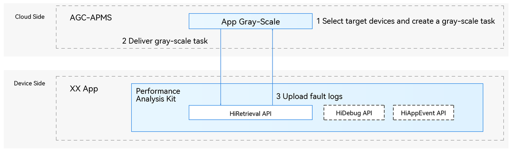

# App Gray-scale Data Collection Overview

<!--Kit: Performance Analysis Kit-->
<!--Subsystem: HiviewDFX-->
<!--Owner: @ljy_love_code-->
<!--Designer: @jiangwenhao-->
<!--Tester: @gcw_KuLfPSbe-->
<!--Adviser: @jinqiuheng-->
<!-- md-trans-meta sourceCommit=abb2cbc3c0ee7701da88cfed86a07b11347a25be translatedAt=2026-07-08T06:43:54.793Z pushedAt=2026-07-08T12:39:03.185Z -->

## Overview

<!--RP1-->

Starting from API version 26.0.0, the system supports gray-scale fault log collection for apps. Designed for the operations and maintenance (O&M) phase, this feature requires device-cloud coordination. After integrating the feature into the on-device app, app developers must complete registration and authentication on the cloud platform (OS developers can refer to [HiRetrieval Cloud-Side Capabilities](hiretrieval-cloud-server-guidelines.md) to provide their own adaptation)<!--RP1End-->. They can then enable gray-scale tasks for specific fault categories on the cloud.

Based on the task category, the cloud platform uses a specific algorithm to select a subset of devices from all those participating in the gray-scale activity to execute the gray-scale task.

When a fault of the corresponding type occurs on a selected device, the system can precisely collect the fault log and report it to the cloud platform for developers to review, helping them resolve the issue.

> **NOTE**
>
> This feature may degrade performance and increase power consumption when collecting fault logs.

## Basic Concepts

**Gray-scale**: Derived from gray-scale release, this refers to selecting a small number of devices from the entire device pool based on specific criteria or algorithms to perform feature verification and collect feedback.

**Gray-scale collection**: A mechanism in which the cloud platform enables fault log collection and upload on a selected subset of devices when creating a gray-scale task. These logs typically include verbose logs, whose collection and upload introduce additional performance and resource overhead. Therefore, they are not suitable for all devices. By enabling the feature only on a limited number of devices, developers can balance fault diagnosis with performance and power consumption. In the context of Performance Analysis Kit, this term may also be abbreviated as gray-scale.

**Gray-scale task**: A gray-scale task is the execution unit of gray-scale data collection. It defines a specific time period, fault type, and the selected devices on which fault log collection and upload are enabled. Gray-scale tasks are created by developers on the cloud platform and distributed to selected devices based on the results of the device selection algorithm. Developers can monitor the status of a task and view the fault logs collected during its execution on the cloud platform to help diagnose issues.

## Implementation Principles

### Overall Architecture

### How to Integrate

1. Register for an account on the cloud platform and complete developer verification.

2. Integrate the app gray-scale data collection feature into the app and perform the required initialization on the device so that the feature can start running.

3. Sign in to the cloud platform and create a gray-scale task. Specify the task duration, fault type, and other required information. The device selection algorithm then identifies the target devices, and the cloud platform delivers the task to those devices.

4. After a selected device receives the task, if the app is running and the specified fault occurs during the task activation period, the device collects the corresponding fault logs (including verbose logs that are not collected in production builds) and uploads them to the cloud platform. When the task ends, the device also uploads a task report to the cloud platform.

5. Developers can view and download the uploaded fault logs and task reports on the cloud platform. They can also review the root cause analysis generated by the platform to facilitate fault diagnosis.

## Constraints

<!--RP2-->The app's privacy statement must include a description of how personal data is processed.<!--RP2End-->