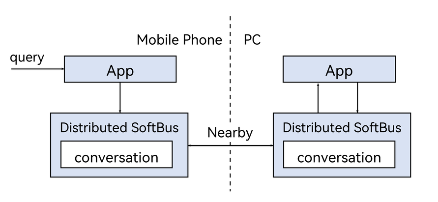

# Cross-Device Agent Wake-Up and Message Transmission

<!--Kit: Distributed Service Kit-->
<!--Subsystem: DistributedSched-->
<!--Owner: @wangrui7-->
<!--Designer: @yangyang2-->
<!--Tester: @Ytt-test-->
<!--Adviser: @hu-zhiqiong-->
<!-- md-trans-meta sourceCommit=b33d67f4be19823da8fc8d0464c3e2f4ea32702e translatedAt=2026-07-07T08:41:06.205Z pushedAt=2026-07-07T12:15:52.498Z -->

## Overview

As distributed scenarios evolve, the demand for message communication between agents continues to grow. Based on Distributed SoftBus, OpenHarmony provides cross-device agent wake-up and message transmission capabilities. This module includes core capabilities such as device discovery, fast device wake-up, and message listening and sending, enabling apps to conduct efficient and reliable message exchange between agents on trusted devices under the same account.

### Implementation Principles

The complete process of cross-device agent wake-up and message transmission is illustrated in the following figure. Through this process, precise cross-device execution of user intents is achieved.



By registering a conversation listener, an app can receive messages from other devices. By calling the conversation data sending API, the app can send messages to the target Ability on a specified device. The entire communication process relies on the device's network ID or UDID for addressing, ensuring that messages are accurately delivered to the target app on the target device.

### Constraints

- The `ohos.permission.DISTRIBUTED_DATASYNC` and `ohos.permission.sec.ACCESS_UDID` permissions must be configured.

- Cross-device message exchange is supported only for apps with the same `bundleName` on different devices.

- The target device must be a trusted device under the same account.

- The system's native fast device wake-up capability is supported. For nearby devices, Bluetooth and Wi-Fi must be enabled, and the devices must be connected to the same local area network (LAN) over Wi-Fi.

- This capability is supported since API version 26.1.0.

## Environment Preparation

### Environment Requirements

Ensure that the devices participating in communication are logged in with the same account.

### Environment Setup

1. Install [DevEco Studio](https://developer.huawei.com/consumer/en/download) 4.1 or later on the development PC.

2. Update the public-SDK to API version 26.1.0 or later. For details, see [OpenHarmony SDK Upgrade Assistant](../tools/openharmony_sdk_upgrade_assistant.md).

3. Connect the two debugging devices (device A and device B) to the development PC using USB cables.

4. Ensure that the two devices have network connections enabled and are logged in with the same account.

## Available APIs

The following table describes the commonly used APIs. For details, see [@ohos.distributedSoftBus.conversation](../reference/apis-distributedservice-kit/js-apis-conversation-sys.md).

| Name                                      | Description                                                                                               |
| ------------------------------------------ | ------------------------------------------------------------------------------------------------------ |
| getTrustedDevices()                        | Obtains the list of all trusted devices.                                                                               |
| postConversationData(deviceId, bundleName, abilityName, msg) | Sends conversation data to the specified Ability on the specified device.                                                                                     |
| registerConversationListener(bundleName, abilityName, dataCallback) | Registers a conversation listener to receive data from trusted devices.                                                                              |
| unregisterConversationListener(bundleName, abilityName) | Unregisters the conversation listener to stop receiving data.                                                                                  |

## Distributed SoftBus Conversation Development

- The receiving end calls [registerConversationListener()](../reference/apis-distributedservice-kit/js-apis-conversation-sys.md#conversationregisterconversationlistener) to register a conversation listener and listen for data from trusted devices.

- The sending end calls [getTrustedDevices()](../reference/apis-distributedservice-kit/js-apis-conversation-sys.md#conversationgettrusteddevices) to obtain the list of trusted devices, selects a target device, and then calls [postConversationData()](../reference/apis-distributedservice-kit/js-apis-conversation-sys.md#conversationpostconversationdata) to send conversation data.

- When data reception is no longer needed, call [unregisterConversationListener()](../reference/apis-distributedservice-kit/js-apis-conversation-sys.md#conversationunregisterconversationlistener) to unregister the conversation listener.

### Receiver Development

1. Import the required module.

   <!-- @[import_conversation](https://gitcode.com/openharmony/applications_app_samples/blob/master/code/DocsSample/DistributedAppDev/DistributedSoftbusConversationDemo/entry/src/main/ets/pages/Index.ets) -->

   ``` TypeScript
   import { conversation } from '@kit.DistributedServiceKit'
   ```

2. Configure the distributed data sync permission and UDID access permission in the **module.json5** configuration file.

   ```json
   {
     "module" : {
       "requestPermissions":[
         {
           "name" : "ohos.permission.DISTRIBUTED_DATASYNC",
           "reason": "$string:distributed_permission",
           "usedScene": {
             "abilities": [
               "EntryAbility"
             ],
             "when": "always"
           }
         },
         {
           "name" : "ohos.permission.sec.ACCESS_UDID",
           "reason": "$string:access_udid_permission",
           "usedScene": {
             "abilities": [
               "EntryAbility"
             ],
             "when": "always"
           }
         }
       ]
     }
   }
   ```

3. Define the conversation listener callback function.

   <!-- @[data_callback](https://gitcode.com/openharmony/applications_app_samples/blob/master/code/DocsSample/DistributedAppDev/DistributedSoftbusConversationDemo/entry/src/main/ets/pages/Index.ets) -->

   ``` TypeScript
   let messageCallback: conversation.DataCallback = (deviceId: string, msg: ArrayBuffer): void => {
     hilog.info(DOMAIN, TAG, 'Received message from: %{public}s', deviceId);
     hilog.info(DOMAIN, TAG, 'Message length: %{public}d', msg.byteLength);
     let bufferView = new Uint8Array(msg);
     let messageStr = '';
     for (let i = 0; i < bufferView.length; i++) {
       messageStr += String.fromCharCode(bufferView[i]);
     }
     hilog.info(DOMAIN, TAG, 'Message content: %{public}s', messageStr);
   }
   ```

4. Register the conversation listener to receive data from trusted devices.

   <!-- @[register_listener](https://gitcode.com/openharmony/applications_app_samples/blob/master/code/DocsSample/DistributedAppDev/DistributedSoftbusConversationDemo/entry/src/main/ets/pages/Index.ets) -->

   ``` TypeScript
   registerListener(): void {
     hilog.info(DOMAIN, TAG, 'registerListener called');
     try {
       conversation.registerConversationListener(bundleName, abilityName, messageCallback);
       hilog.info(DOMAIN, TAG, 'Listener registered for %{public}s/%{public}s', bundleName, abilityName);
     } catch (err) {
       let error = err as BusinessError;
       hilog.error(DOMAIN, TAG, 'registerConversationListener error: %{public}s - %{public}s', error.code, error.message);
     }
   }
   ```

5. Unregister the conversation listener.

   <!-- @[unregister_listener](https://gitcode.com/openharmony/applications_app_samples/blob/master/code/DocsSample/DistributedAppDev/DistributedSoftbusConversationDemo/entry/src/main/ets/pages/Index.ets) -->

   ``` TypeScript
   unregisterListener(): void {
     hilog.info(DOMAIN, TAG, 'unregisterListener called');
     try {
       conversation.unregisterConversationListener(bundleName, abilityName);
       hilog.info(DOMAIN, TAG, 'Listener unregistered');
     } catch (err) {
       let error = err as BusinessError;
       hilog.error(DOMAIN, TAG, 'unregisterConversationListener error: %{public}s - %{public}s', error.code, error.message);
     }
   }
   ```

### Sender Development

1. Import the required module.

   <!-- @[import_conversation](https://gitcode.com/openharmony/applications_app_samples/blob/master/code/DocsSample/DistributedAppDev/DistributedSoftbusConversationDemo/entry/src/main/ets/pages/Index.ets) -->

   ``` TypeScript
   import { conversation } from '@kit.DistributedServiceKit'
   ```

2. Configure the distributed data synchronization permission and UDID access permission in the **module.json5** configuration file.

   ```json
   {
     "module" : {
       "requestPermissions":[
         {
           "name" : "ohos.permission.DISTRIBUTED_DATASYNC",
           "reason": "$string:distributed_permission",
           "usedScene": {
             "abilities": [
               "EntryAbility"
             ],
             "when": "always"
           }
         },
         {
           "name" : "ohos.permission.sec.ACCESS_UDID",
           "reason": "$string:access_udid_permission",
           "usedScene": {
             "abilities": [
               "EntryAbility"
             ],
             "when": "always"
           }
         }
       ]
     }
   }
   ```

3. Obtain the trusted device list and select the target device.

   <!-- @[get_trusted_devices](https://gitcode.com/openharmony/applications_app_samples/blob/master/code/DocsSample/DistributedAppDev/DistributedSoftbusConversationDemo/entry/src/main/ets/pages/Index.ets) -->

   ``` TypeScript
   getTrustedDevices(): void {
     hilog.info(DOMAIN, TAG, 'getTrustedDevices called');
     try {
       let devices = conversation.getTrustedDevices() as conversation.DeviceNodeInfo[];
       if (devices && devices.length > 0) {
         let deviceInfo = devices.map((d, idx) =>
           `${idx + 1}. ${d.deviceName} (${d.networkId}) - Type:${d.deviceTypeId} - Nearby:${d.nearby}`
         ).join('\n');
         hilog.info(DOMAIN, TAG, 'Found %{public}d devices', devices.length);
           hilog.info(DOMAIN, TAG, 'Devices list: \n %{public}s', deviceInfo);
         } else {
           hilog.info(DOMAIN, TAG, 'Found %{public}d devices', devices.length);
       }
     } catch (err) {
       let error = err as BusinessError;
       hilog.error(DOMAIN, TAG, 'getTrustedDevices error: %{public}s - %{public}s', error.code, error.message);
     }
   }
   ```

4. Send conversation data to the specified device.

   <!-- @[send_message](https://gitcode.com/openharmony/applications_app_samples/blob/master/code/DocsSample/DistributedAppDev/DistributedSoftbusConversationDemo/entry/src/main/ets/pages/Index.ets) -->

   ``` TypeScript
   sendMessage(): void {
     hilog.info(DOMAIN, TAG, 'sendMessage called');
     try {
       let arrayBuffer = new ArrayBuffer(messageToSend.length);
       let bufferView = new Uint8Array(arrayBuffer);
       for (let i = 0; i < messageToSend.length; i++) {
         bufferView[i] = messageToSend.charCodeAt(i);
       }

       conversation.postConversationData(deviceId, bundleName, abilityName, arrayBuffer)
         .then(() => {
           hilog.info(DOMAIN, TAG, 'Message sent successfully to %{public}s', deviceId);
         })
         .catch((err : BusinessError) => {
           hilog.error(DOMAIN, TAG, 'sendMessage error: %{public}s - %{public}s', err.code, err.message);
         });
     } catch (err) {
       let error = err as BusinessError;
       hilog.error(DOMAIN, TAG, 'sendMessage error: %{public}s - %{public}s', error.code, error.message);
     }
   }
   ```
   <!--no_check-->