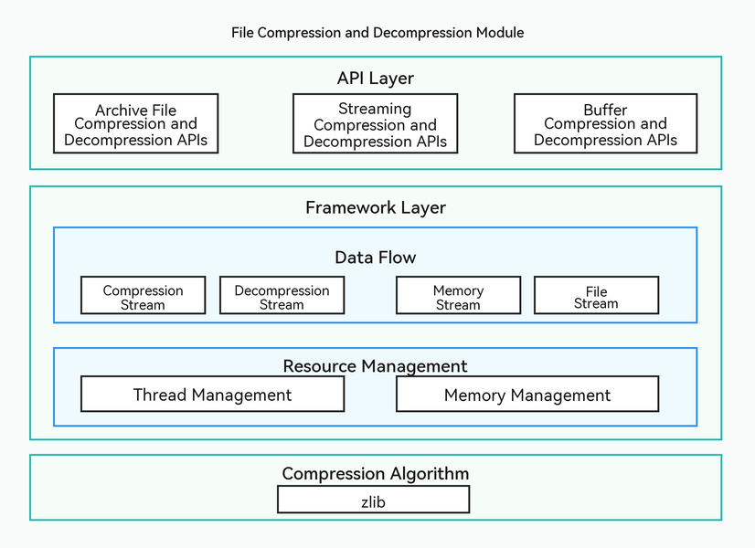

# Compression and Decompression Overview

<!--Kit: Core File Kit-->
<!--Subsystem: FileManagement-->
<!--Owner: @rl123567-->
<!--Designer: @selina_jiang; @RainbowLLL-->
<!--Tester: @zheng1368-->
<!--Adviser: @jinqiuheng-->
<!-- md-trans-meta sourceCommit=b21bd82a68f5cb2fefefde92a7afef87223beafc translatedAt=2026-07-09T10:43:43.952Z pushedAt=2026-07-10T10:01:30.316Z -->

Starting from API version 26.0.0, the compression and decompression module is supported, providing apps with data compression and decompression capabilities. It can be used in scenarios such as file packaging and distribution to reduce storage usage and accelerate network transmission. Based on different data sources and processing methods, the module provides the following three compression and decompression approaches:

- **[Archive File Compression and Decompression](archive-file-compression-guidelines.md)**: Packages multiple files or directories into a single archive file, or extracts files from an archive to a specified directory. It is suitable for file-level packaging and distribution scenarios, with support for directory structure preservation and progress callbacks. If you need to archive and package files or extract files from an archive, this approach is recommended.

- **[Streaming Compression and Decompression](archive-stream-compression-guidelines.md)**: Performs segmented compression or decompression on continuous data streams (such as logs, network data streams, and real-time transmission data). It is suitable for scenarios involving large data volumes or data that is generated and processed simultaneously, with support for batch data input and controllable memory usage. If data is generated in a streaming manner (such as real-time log collection or network transmission), or if the data volume is too large to be loaded into memory at once, this approach is recommended.

- **[Buffer Compression and Decompression](archive-buffer-compression-guidelines.md)**: Performs one-time compression or decompression on an entire block of data in memory. It is suitable for scenarios with small and complete data sets, featuring a simple API and fast operation. If the data is already in a memory buffer and the data volume is small, this approach is recommended for easier development.

## Working Principles

As shown in the figure, the file compression and decompression module adopts a three-layer architecture:

- **API layer**: Provides three types of compression and decompression APIs.

- **Framework layer**: Implements data flow and resource management capabilities.

- **Compression algorithm layer**: Implements data encoding and decoding based on compression algorithms such as zlib, and handles the actual data compression and decompression logic.

The layered architecture provides good extensibility, allowing you to choose the appropriate compression and decompression approach based on your requirements.

## Relationship with Related Modules

Basic Services Kit also provides the ArkTS-based [@ohos.zlib (Zip)](../reference/apis-basic-services-kit/js-apis-zlib.md) for file and data compression and decompression. The main differences between the two are as follows:

| Module | Archive | zlib |
|---|---|---|
| **Implementation** | A high-performance compression framework developed in-house | An ArkTS wrapper around the zlib C library, with a small set of high-level file APIs |
| **Applicable scenarios** | Native development requiring high performance, progress callbacks, cancellation support (for example, [OH_Archive_Reader_SetProgressHandlerWithData](../reference/apis-core-file-kit/capi-oh-archive-h.md#oh_archive_reader_setprogresshandlerwithdata)), or large data stream processing | ArkTS-only development requiring the full set of low-level zlib capabilities |

<!--no_check-->