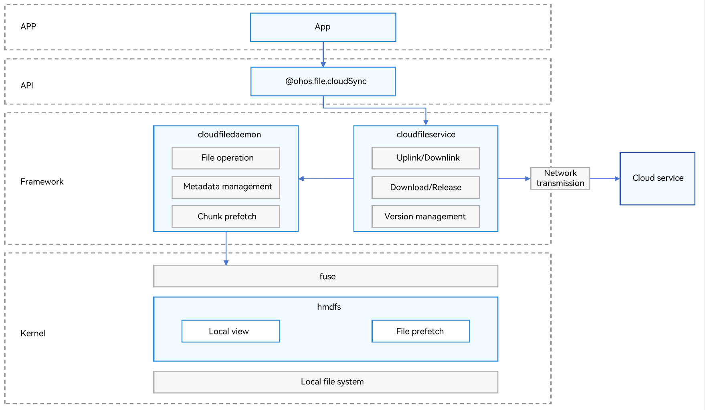

# Device-Cloud File Sync Overview
<!--Kit: Core File Kit-->
<!--Subsystem: FileManagement-->
<!--Owner: @zsyztt; @Hermits; @reminder2352-->
<!--Designer: @yunlanying-->
<!--Tester: @liuhonggang123-->
<!--Adviser: @foryourself-->

Device-cloud file sync delivers a unified file system capability for application development, offering consistent file synchronization and cross-device access experiences for both users and applications.

As a system-level platform capability, device-cloud file sync provides standardized access APIs and encapsulated core features (including synchronization, download, and version management). This enables applications to quickly integrate with the platform at a low cost, while ensuring consistent user experiences and data reliability.

## Capabilities

- Full-dimensional cloud sync: supports bidirectional synchronization of both file content modifications (such as editing and updating) and metadata modifications (such as renaming). After a file is changed, the system automatically triggers the cloud sync process. Meanwhile, the callback API notifies the application of the sync status (success, failure, or progress) in real time to ensure device-cloud data consistency.
  - Optimized space: File entities are fully stored in the cloud, and only file metadata (name, type, size, and modification time) is stored locally. This greatly releases the local storage space of the device and avoids redundant files.
  - Seamless experience: File operations such as opening, editing, deleting, and renaming fully replicate the local file operation logic. The synchronization process is automatically executed in the background. Users do not need to perceive uplink or downlink processes, achieving a seamless experience.
  - Resumable upload: If uploads are interrupted due to network issues or device offline status, the system automatically records the progress of uploaded file chunks. After network recovery, uploads resume from the breakpoint without retransmitting data, saving data traffic and time.
  - Incremental upload: If a local file is modified, only the changed parts (new or modified file chunks) are uploaded instead of the entire file. This greatly improves upload efficiency and reduces bandwidth consumption.
  - Fast sync: When the same file is uploaded consecutively (or file content remains unchanged), the cloud quickly verifies the stored file using its unique identifier and directly reuses existing cloud resources to complete synchronization. No actual file data transmission is required, enabling fast uploads.

- Flexible file download: provides single-point download (precise download of a single file) and batch download (packaged download of multiple selected files or folders) for cloud files, adapting to file acquisition requirements in different service scenarios.
  - Resumable download: If downloads are interrupted by network fluctuations or manual pauses, the system retains downloaded chunks. Subsequent downloads resume from the incomplete part instead of re-downloading the entire file, reducing data traffic consumption.
  - Differential download: When files are modified and synchronized by other devices, the local device only downloads the changed file chunks (instead of the entire file). This shortens download time, lowers traffic costs, and improves synchronization efficiency.

- Full-lifecycle version management: supports full-lifecycle version management of files on both device and cloud sides, including version creation (automatic new version generation during synchronization) and version query (retrieval of historical version lists and details). It meets requirements for file modification traceability and data security.

## Use Scenarios

- For users:
  - Gallery photo backup
  - Cloud drive file management
  - Cloud storage of application files

- For applications:
  - Multi-device collaborative editing of cloud files
  - Multi-device synchronization of cloud files

## Implementation Principles

Device-cloud file sync provides core APIs for file upload, download, and synchronization, single-point download, and batch download. You only need to save the files to be uploaded to the cloud to the sandbox directory **/data/storage/el2/cloud** to enable automatic cloud uploads. For details about other basic file operation APIs, see [Accessing Application Files (ArkTS)](app-file-access.md).

This capability is built on system-level services. The **cloudfiledaemon** process provides core functionalities such as basic file operations, metadata management, and chunk prefetch. The **cloudfileservice** process automatically interacts with the cloud service in the background, triggers and completes uplink/downlink and file download based on service requirements, and also provides APIs to support version management and the proactive triggering of synchronization tasks.

## Basic Concepts

- cloudfiledaemon: device-cloud file daemon, which provides basic file operations, metadata management, and chunk prefetch capabilities for applications accessing the cloud.
- cloudfileservice: device-cloud synchronization service process, which provides uplink/downlink, file download, and version management capabilities for applications accessing the cloud.
- fuse: a file system that allows unprivileged users to implement file system logic in user space. It provides a universal virtual file system (VFS) bridge module in the kernel to forward file system operations to user-space processes, where specific logic is implemented by user programs.
- hmdfs: a distributed file system that provides file prefetch and local view capabilities for device-cloud file sync in the kernel.
- Metadata management: supports local retention of basic metadata information such as file names, sizes, and timestamps. The device-cloud file daemon manages the basic information.
- Chunk prefetch: a refined file prefetch strategy that divides read requests into multiple logical chunks, and asynchronously preloads specific chunks on demand or by priority to further optimize I/O performance and bandwidth utilization.
- File prefetch: an I/O optimization technology. Before a user explicitly requests subsequent data, hmdfs proactively loads parts of subsequent content into memory in advance based on the file read range, reducing latency on subsequent reads.
- Local view: directory structure and file list in the local file system of the current device, reflecting the actual storage status of the host. All operations (such as browsing, creating, deleting, and renaming) take effect directly on the local disk.
