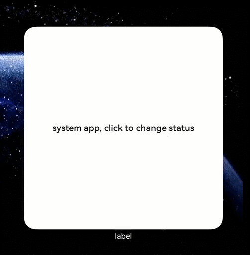

# Developing a Scene-based Widget (for System Applications)
<!--Kit: Form Kit-->
<!--Subsystem: Ability-->
<!--Owner: @cx983299475-->
<!--Designer: @xueyulong-->
<!--Tester: @chenmingze-->
<!--Adviser: @HelloShuo-->
For details about the development guidelines of scene-based widgets, see [Developing a Scene-based Widget](arkts-ui-liveform-sceneanimation-development.md). For system applications, scene-based widgets provide two extended capabilities: gesture suspension configuration and long-term widget activation.

## Gesture Suspension Configuration
For [scene-based widgets](arkts-ui-liveform-sceneanimation-overview.md), operations such as long-pressing and dragging on the home screen will interrupt the current animation, causing the widget to revert to the inactive state. However, system applications can cancel this limitation by configuring [disabledDesktopBehaviors](arkts-ui-widget-configuration.md#sceneanimationparams-field) in the **form_config.json** file, ensuring smooth animations within the interactive target of the activated widget.
If no configuration is performed, the system does not intercept any valid gesture operations on the home screen by default. Once gestures are intercepted, the corresponding gesture events are handled by the LiveFormExtensionAbility.

```ts
// entry/src/main/resources/base/profile/form_config.json
{
  "forms": [
    {
      // ...
      "sceneAnimationParams": {
        "abilityName": "MySystemLiveFormExtensionAbility",
        "disabledDesktopBehaviors": [
          "SWIPE_DESKTOP",
          "PULL_DOWN_SEARCH",
          "LONG_CLICK",
          "DRAG"
        ]
      }
    }
  ]
}
```

## Long-term Widget Activation

System applications can control widget state switching via APIs, allowing widgets to remain active for extended periods (hereafter referred to as the "long-term activated state"). A widget in this state is called a "long-term activated widget." Widget state transitions are managed through [formProvider.activateSceneAnimation](../reference/apis-form-kit/js-apis-app-form-formProvider-sys.md#activatesceneanimation20) and [formProvider.deactivateSceneAnimation](../reference/apis-form-kit/js-apis-app-form-formProvider-sys.md#deactivatesceneanimation20). In this case, the widget's animation rendering area is the same size as the widget itself, with no overflow effect displayed.

### Widget Animation

You can call the [formProvider.requestOverflow](../reference/apis-form-kit/js-apis-app-form-formProvider.md#formproviderrequestoverflow20) API to initiate interactive widget animation requests.
- If the animation duration (**overflowInfo.duration**) requested by the API is greater than or equal to 60 seconds, the request will succeed and the animation will remain displayed. The widget exits the animation and switches to the inactive state only when the [cancelOverflow](../reference/apis-form-kit/js-apis-app-form-formProvider.md#formprovidercanceloverflow20) API is called to cancel the animation, the [formProvider.deactivateSceneAnimation](../reference/apis-form-kit/js-apis-app-form-formProvider-sys.md#deactivatesceneanimation20) API is called to switch the widget to the inactive state, or another widget successfully applies for the animation.
- If the animation duration (**overflowInfo.duration**) passed in via the API is less than 60 seconds, the request will fail.

### Widget State Synchronization

When the system updates the key state information of a widget, it sends the widget's latest state to the widget provider via a proxy. The widget provider can listen for this information using the [setReceiveDataCallback](../reference/apis-ability-kit/js-apis-app-ability-uiExtensionContentSession-sys.md#setreceivedatacallback) API. For the widget state information that supports listening, see the table below.

|State|Description|
|-----|---------|
|stopOverflow|The widget exits the animation.|
|startSwipe|The user triggers a horizontal swipe gesture on the home screen.|
|endSwipe|The user completes the horizontal swipe gesture on the home screen.|
|extensionready|The widget's state has been switched.|
|longPress|The user triggers a long-press gesture on the widget, and the system is about to display the widget's long-press menu.|

### Constraints

In addition to [animation request constraints](arkts-ui-liveform-sceneanimation-overview.md#animation-request), the following limitations apply once an interactive widget enters the long-term activated state:
1. The system allows a maximum of five widgets in active state at a time. If more than five widgets are in active state, the widget that first switched to the active state will be deactivated.
2. After an interactive widget successfully requests an animation, the current widget's animation will be interrupted and the widget will switch to the inactive state if any of the following conditions are met:
   - The [cancelOverflow](../reference/apis-form-kit/js-apis-app-form-formProvider.md#formprovidercanceloverflow20) API is called to cancel the animation.
   - The [formProvider.deactivateSceneAnimation](../reference/apis-form-kit/js-apis-app-form-formProvider-sys.md#deactivatesceneanimation20) API is called to switch the widget to the inactive state.
   - The user taps another interactive widget, and that widget successfully applies for an animation.
   - Within 60 seconds after an animation is requested, animation requests triggered by non-user taps of other widgets will fail. After 60 seconds since an animation is requested, animation requests triggered by non-user taps of other widgets will interrupt the current animation.

## Available APIs

The following table lists the key APIs for a scene-based widget.

**Table 1** Main APIs

| API                                                                                                                                                                      | Description                                                                                                                 |
|---------------------------------------------------------------------------------------------------------------------------------------------------------------------------|---------------------------------------------------------------------------------------------------------------------|
| [formProvider.activateSceneAnimation(formId: string): Promise&lt;void&gt;](../reference/apis-form-kit/js-apis-app-form-formProvider-sys.md#activatesceneanimation20)     | Called to switch the interactive widget state to active.|
| [formProvider.deactivateSceneAnimation(formId: string): Promise&lt;void&gt;](../reference/apis-form-kit/js-apis-app-form-formProvider-sys.md#deactivatesceneanimation20) | Called to switch the interactive widget state to inactive.|
| [formProvider.requestOverflow(formId: string, overflowInfo: formInfo.OverflowInfo): Promise&lt;void&gt;](../reference/apis-form-kit/js-apis-app-form-formProvider.md#formproviderrequestoverflow20) | Called by the widget provider to request interactive widget animations.  |
| [formProvider.cancelOverflow(formId: string): Promise&lt;void&gt;](../reference/apis-form-kit/js-apis-app-form-formProvider.md#formprovidercanceloverflow20)                                        | Called by the widget provider to cancel interactive widget animations.|

## How to Develop

### Widget UI in Active State

1. Create an interactive widget.

    Create an interactive widget through [LiveFormExtensionAbility](../reference/apis-form-kit/js-apis-app-form-LiveFormExtensionAbility.md) and load the widget page.
    
    ```ts
    // entry/src/main/ets/mysystemliveformextensionability/MySystemLiveFormExtensionAbility.ets
    import { formInfo, LiveFormInfo, LiveFormExtensionAbility } from '@kit.FormKit';
    import { UIExtensionContentSession } from '@kit.AbilityKit';
    import { Constants } from '../common/Constants';
    
    const PAGE_PATH: string = 'mysystemliveformextensionability/pages/MySystemLiveFormPage';
    
    export default class MySystemLiveFormExtensionAbility extends LiveFormExtensionAbility {
      onLiveFormCreate(liveFormInfo: LiveFormInfo, session: UIExtensionContentSession) {
        let storage: LocalStorage = new LocalStorage();
        storage.setOrCreate(Constants.SESSION, session);
    
        // Obtain the widget ID and the rendering area in the active state.
        let formId: string = liveFormInfo.formId as string;
        storage.setOrCreate(Constants.FORM_ID, formId);
        let rect: formInfo.Rect = liveFormInfo.rect as formInfo.Rect
        storage.setOrCreate(Constants.FORM_RECT, rect);
        let borderRadius: number = liveFormInfo.borderRadius as number;
        storage.setOrCreate(Constants.BORDER_RADIUS, borderRadius);
        console.info(`onSessionCreate formId: ${formId}, rect: ${JSON.stringify(rect)}` +
          `, borderRadius: ${borderRadius}`);
    
        try {
          // Load the widget provider page.
          session.loadContent(PAGE_PATH, storage);

          // The widget provider needs to notify the widget host via session when the activated page is ready.
          session.sendData({['isFormReady']: true});
        } catch (e) {
          console.info(`sth wrong when load content ${e.code}, ${e.message}`);
        }
      }
    
      onLiveFormDestroy(liveFormInfo: LiveFormInfo) {
        console.info(`MySystemLiveFormExtensionAbility onDestroy`);
      }
    }
    ```

2. Implement an interactive widget page.

    ```ts
    // entry/src/main/ets/mysystemliveformextensionability/pages/MySystemLiveFormPage.ets
    import { formInfo, formProvider } from '@kit.FormKit';
    import { UIExtensionContentSession } from '@kit.AbilityKit';
    import { Constants } from '../../common/Constants';
    
    const EPSILON: number = 1e-1;
    let that: MySystemLiveFormPage;
    
    @Entry
    @Component
    struct MySystemLiveFormPage {
      private uiContext: UIContext | undefined = undefined;
      private storageActiveUIExtAbilityPage: LocalStorage | undefined = undefined;
      private session: UIExtensionContentSession | undefined = undefined;
      private message: string = 'Widget is activated';
      private formId: string | undefined = undefined;
      @State formRect: formInfo.Rect | undefined = undefined;
      @State formBorderRadius: number | undefined = undefined;
      private isExtensionReady: boolean = false;
    
      aboutToAppear(): void {
        console.info('aboutToAppear');
        this.uiContext = this.getUIContext();
        if (!this.uiContext) {
          console.info('no uiContext');
          return;
        }
        that = this;
        this.initParams();
      }
    
      /**
       * Initialize widget properties.
       */
      private initParams(): void {
        this.storageActiveUIExtAbilityPage = this.uiContext?.getSharedLocalStorage();
        this.formId = this.storageActiveUIExtAbilityPage?.get<string>(Constants.FORM_ID);
        this.formRect = this.storageActiveUIExtAbilityPage?.get<formInfo.Rect>(Constants.FORM_RECT);
        this.formBorderRadius = this.storageActiveUIExtAbilityPage?.get<number>(Constants.BORDER_RADIUS);
        this.session = this.storageActiveUIExtAbilityPage?.get<UIExtensionContentSession>(Constants.SESSION);
      }
    
      onPageShow(): void {
        if (!this.session) {
          return;
        }
    
        // When the system detects a widget state change, it notifies the widget provider via a session. The widget provider then handles animation continuation and data saving based on service requirements.
        this.session.setReceiveDataCallback(that.handleMessage);
      }
    
      /**
       * System message processing function
       *
       * @param data Key state change information of the widget, which is sent by the system.
       */
      private async handleMessage(data: Record<string, Object>): Promise<void> {
        try {
          let formStatusChange: string = data[Constants.FORM_STATUS_CHANGE] as string;
          let formStatusObject: Record<string, Object> = JSON.parse(formStatusChange) as Record<string, Object>;
          if (!formStatusObject || !that.formId) {
            console.info(`sth wrong when get form status`);
            return;
          }
          let status: string = formStatusObject[Constants.FORM_STATUS] as string;
          console.info(`data: ${JSON.stringify(data)}, status: ${status}`);
          await that.handleFormStatus(status);
        } catch (e) {
          console.info(`sth wrong when handleMessage, code: ${e.code}, message: ${e.message}`);
        }
      }

      /**
       * When the system detects a widget state change, it notifies the widget provider via a session. The widget provider then handles animation continuation and data saving based on service requirements.
       * @param status Widget state
       */
      private async handleFormStatus(status: string): Promise<void> {
        if (status === Constants.STOP_OVERFLOW) {
          // The widget's animation rendering area reverts to the same size as the widget itself and switches to the long-term activated state.
          return;
        }
        if (status === Constants.START_SWIPE) {
          // The user triggers a horizontal swipe gesture on the home screen.
          return;
        }
        if (status === Constants.END_SWIPE) {
          // The user completes the horizontal swipe gesture on the home screen.
          return;
        }
        if (status === Constants.EXTENSION_READY) {
          // The widget's state has been switched, and the requestOverflow API can be called.
          this.isExtensionReady = true;
          return;
        }
        if (status === Constants.LONG_PRESS) {
          // The user triggers a long-press gesture on the widget, and the system is about to display the widget's long-press menu.
          return;
        }
      }
    
      build() {
        Stack() {
          this.buildBackground();
          Column({space: 20}) {
            this.buildControlButton();
          }
        }
        .width('100%')
        .height('100%')
        .onSizeChange((oldValue: SizeOptions, newValue: SizeOptions) => {
          if (!this.formRect) {
            return;
          }

          // After the widget size is expanded, send the system a notification that the animation page is ready.
          let isWidthExtend: boolean = 
            Math.abs(newValue.width as number - this.formRect.width * Constants.OVERFLOW_WIDTH_RATIO) < EPSILON;
          let isHeightExtend: boolean =
            Math.abs(newValue.height as number - this.formRect.height * Constants.OVERFLOW_HEIGHT_RATIO) < EPSILON;
          console.info(`newValue: ${JSON.stringify(newValue)}` + `, ${isWidthExtend}, ${isHeightExtend}` +
              `, ${this.formRect.width * Constants.OVERFLOW_WIDTH_RATIO}` +
              `, ${this.formRect.height * Constants.OVERFLOW_HEIGHT_RATIO}`);
          if (isWidthExtend && isHeightExtend) {
            this.session?.sendData({['isExtensionOverflowReady']: true});
          }
        })        
      }
    
      @Builder
      buildBackground() {
        Stack()
          .width('100%')
          .height('100%')
          .opacity(0.3)
          .backgroundColor(Color.Yellow)
    
        // The widget background component has the same size as a regular widget.
        Image($r('app.media.background'))
          .width(this.formRect? this.formRect.width : 0)
          .height(this.formRect? this.formRect.height : 0)
          .borderRadius(this.formBorderRadius ? this.formBorderRadius : 0)
      }
    
      @Builder
      buildControlButton() {
        Text(this.message)
          .fontColor(Color.White)
          .fontSize(20)
          .fontWeight(FontWeight.Bold)
    
        Row({space: 10}) {
          Button('Expand Animation Area')
            .backgroundColor(Color.Grey)
            .onClick(() => {
              console.info('MyLiveFormPage start overflow animation');
              this.requestOverflow();
            })
    
          Button('Cancel Animation Area Expansion')
            .backgroundColor(Color.Grey)
            .onClick(() => {
              console.info('MyLiveFormPage cancel overflow animation');
              formProvider.cancelOverflow(this.formId);
            })
        }
    
        Button('Switch Widget to Inactive State')
          .backgroundColor(Color.Grey)
          .onClick(() => {
            console.info('MyLiveFormPage cancel active status');
            formProvider.deactivateSceneAnimation(this.formId);
          })
      }
    
      private requestOverflow(): void {
        if (!this.formId || !this.formRect || !this.isExtensionReady) {
          return;
        }
        formProvider.requestOverflow(this.formId,{
          area: {
            left: -this.formRect.width * Constants.OVERFLOW_LEFT_RATIO,
            top: -this.formRect.height * Constants.OVERFLOW_TOP_RATIO,
            width: this.formRect.width * Constants.OVERFLOW_WIDTH_RATIO,
            height: this.formRect.height * Constants.OVERFLOW_HEIGHT_RATIO
          },
    
          // The animation duration must be greater than or equal to 60s.
          duration: Constants.OVERFLOW_DURATION
        });
      }
    }
    ```

3. Configure LiveFormExtensionAbility for interactive widgets.

    Configure LiveFormExtensionAbility in [extensionAbilities](../quick-start/module-configuration-file.md#extensionabilities) of the **module.json5** file.
    
    ```ts
    // entry/src/main/module.json5
        ...
        "extensionAbilities": [
          {
            "name": "MySystemLiveFormExtensionAbility",
            "srcEntry": "./ets/mysystemliveformextensionability/MySystemLiveFormExtensionAbility.ets",
            "description": "MySystemLiveFormExtensionAbility_desc",
            "type": "liveForm"
          }
        ]
        ...
    ```
    
    Declare the interactive widget page in the **main_pages.json** file.
    
    ```ts
    // entry/src/main/resources/base/profile/main_pages.json
    {
      "src": [
        "pages/Index",
        "mysystemliveformextensionability/pages/MySystemLiveFormPage"
      ]
    }
    ```

### Widget UI in Inactive State

1. Implement a widget page in the inactive state.

    The development process for inactive widget pages is identical to that for regular widgets, and is implemented in **SystemWidgetCard.ets**. which is automatically generated when a widget is created. For details about the widget creation process, see [Creating an ArkTS Widget](arkts-ui-widget-creation.md). On the inactive widget page, request the widget animation when the widget is tapped.
    
    ```ts
    // entry/src/main/ets/systemwidget/pages/SystemWidgetCard.ets
    @Entry
    @Component
    struct SystemWidgetCard {
      /*
       * The title.
       */
      readonly title: string = 'Tap to Switch Widget State (System Application)';
      /*
       * The action type.
       */
      readonly actionType: string = 'message';
      /*
       * The ability name.
       */
      readonly abilityName: string = 'EntryFormAbility';
      /*
       * The message.
       */
      readonly message: string = 'activateSceneAnimation';
      /*
       * The width percentage setting.
       */
      readonly fullWidthPercent: string = '100%';
      /*
       * The height percentage setting.
       */
      readonly fullHeightPercent: string = '100%';
    
      build() {
        Row() {
          Column() {
            Text(this.title)
              .fontSize($r('app.float.font_size'))
              .fontWeight(FontWeight.Medium)
              .fontColor($r('sys.color.font_primary'))
          }
          .width(this.fullWidthPercent)
        }
        .height(this.fullHeightPercent)
        .onClick(() => {
          postCardAction(this, {
            action: this.actionType,
            abilityName: this.abilityName,
            params: {
              message: this.message
            }
          });
        })
      }
    }
    ```

2. Configure the **form_config.json** file.

    Add the **sceneAnimationParams** configuration item to the **form_config.json** file.
    
    ```ts
    // entry/src/main/resources/base/profile/form_config.json
    {
      "forms": [
        {
          "name": "systemWidget",
          "displayName": "$string:systemWidget_display_name",
          "description": "$string:systemWidget_desc",
          "src": "./ets/systemwidget/pages/SystemWidgetCard.ets",
          "uiSyntax": "arkts",
          "window": {
            "designWidth": 720,
            "autoDesignWidth": true
          },
          "colorMode": "auto",
          "isDynamic": true,
          "isDefault": false,
          "updateEnabled": false,
          "scheduledUpdateTime": "10:30",
          "updateDuration": 1,
          "defaultDimension": "4*4",
          "supportDimensions": [
            "4*4"
          ],
          "sceneAnimationParams": {
            "abilityName": "MySystemLiveFormExtensionAbility",
            "disabledDesktopBehaviors": [
              "SWIPE_DESKTOP",
              "PULL_DOWN_SEARCH",
              "LONG_CLICK",
              "DRAG"
            ]            
          }
        }
      ]
    }
    ```

### Interactive Widget Animation

1. Implement a long-term activated widget.   
    ```ts
    // entry/src/main/ets/entryformability/EntryFormAbility.ets
    import { formProvider, FormExtensionAbility } from '@kit.FormKit';
    import { BusinessError } from '@kit.BasicServicesKit';
    
    export default class EntryFormAbility extends FormExtensionAbility {
      async onFormEvent(formId: string, message: string) {
        let shortMessage: string = JSON.parse(message)['message'];
        // Trigger the interactive widget to switch to the long-term activated state when the received message is activateSceneAnimation.
        if (shortMessage === 'activateSceneAnimation') {
          this.activateSceneAnimation(formId);
          return;
        }
      }
    
      private activateSceneAnimation(formId: string): void {
        try {
          formProvider.activateSceneAnimation(formId).then(() => {
            console.info('activateSceneAnimation succeed');
          }).catch((error: BusinessError) => {
            console.info(`activateSceneAnimation catch error` +
              `, code: ${error.code}, message: ${error.message}`);
          })
        } catch (e) {
          console.info(`activateSceneAnimation call requestOverflow catch error` +
            `, code: ${e.code}, message: ${e.message}`);
        }
      }
    }
    ```

2. Implement utility functions for interactive widget animations.
    ```ts
    // entry/src/main/ets/common/Constants.ets
    export class Constants {
      // Left offset percentage = Offset value/Widget width
      public static readonly OVERFLOW_LEFT_RATIO: number = 0.1;
    
      // Top offset percentage = Offset value/Widget height
      public static readonly OVERFLOW_TOP_RATIO: number = 0.1;
    
      // Enlargement percentage of the animation width.
      public static readonly OVERFLOW_WIDTH_RATIO: number = 1.2;
    
      // Enlargement percentage of the animation height.
      public static readonly OVERFLOW_HEIGHT_RATIO: number = 1.2;
    
      // Animation duration.
      public static readonly OVERFLOW_DURATION: number = 60000;
    
      // Constants related to the LiveFormExtensionAbility data structure
      public static readonly FORM_ID: string = 'formId';
    
      public static readonly FORM_RECT: string = 'formRect';
    
      public static readonly BORDER_RADIUS: string = 'borderRadius';
    
      public static readonly SESSION: string = 'session';
    
      public static readonly FORM_STATUS_CHANGE: string = 'formStatusChange';
    
      public static readonly FORM_STATUS: string = 'formStatus';
    
      // The widget's animation rendering area reverts to the same size as the widget itself and switches to the long-term activated state.
      public static readonly STOP_OVERFLOW: string = 'stopOverflow';
    
      // The user triggers a horizontal swipe gesture on the home screen.
      public static readonly START_SWIPE: string = 'startSwipe';
    
      // The user completes the horizontal swipe gesture on the home screen.
      public static readonly END_SWIPE: string = 'endSwipe';

      // The widget's state has been switched.
      public static readonly EXTENSION_READY: string = 'extensionReady';
    
      // The user triggers a long-press gesture on the widget, and the system is about to display the widget's long-press menu.
      public static readonly LONG_PRESS: string = 'longPress';
    }
    ```

## Effect
The following is a demo developed based on the code example in this document.


