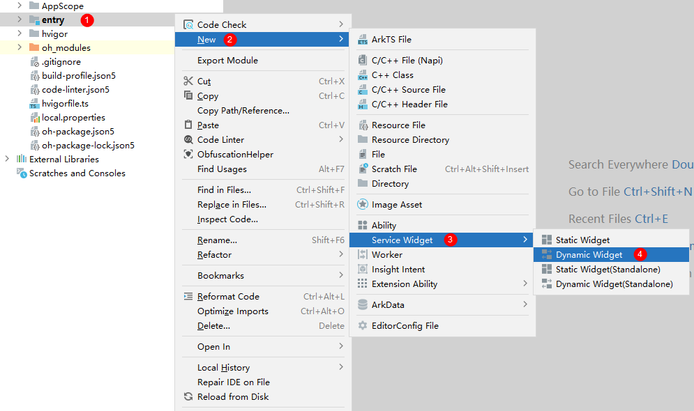
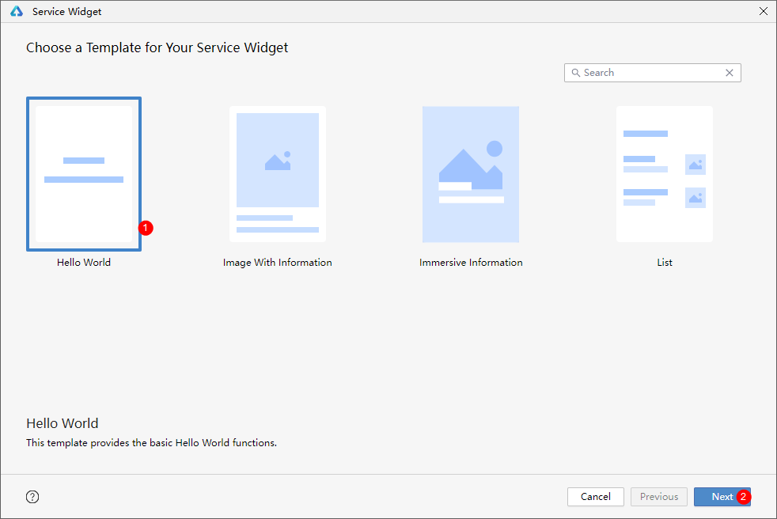
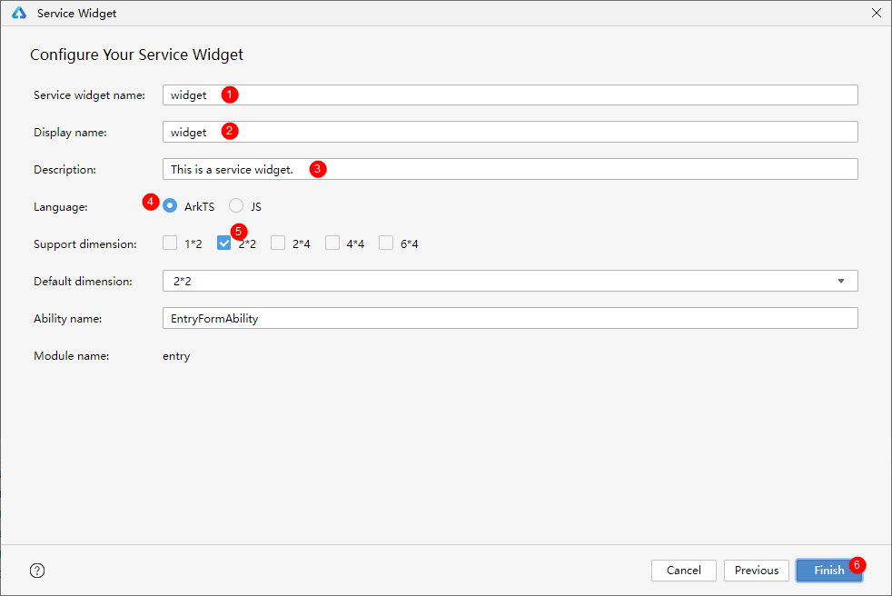
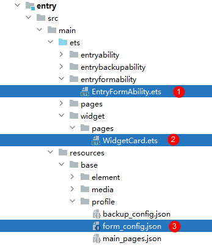
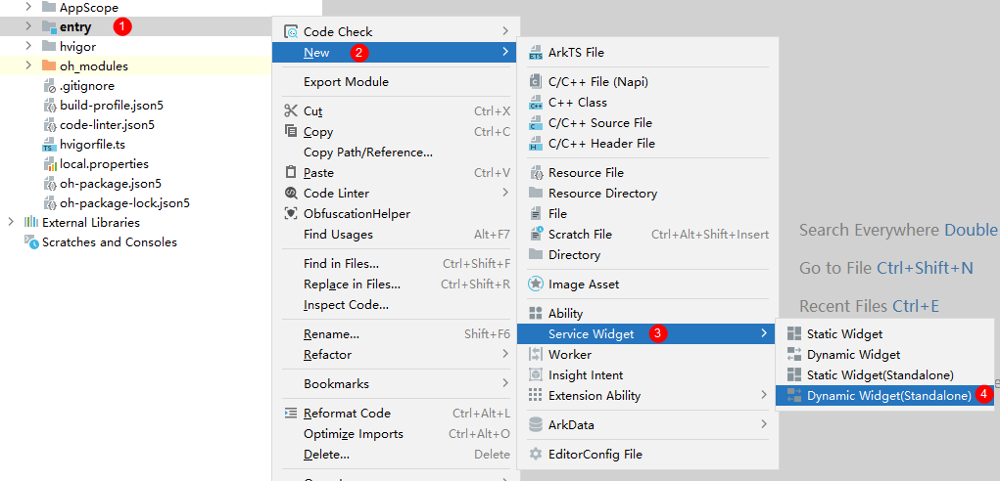
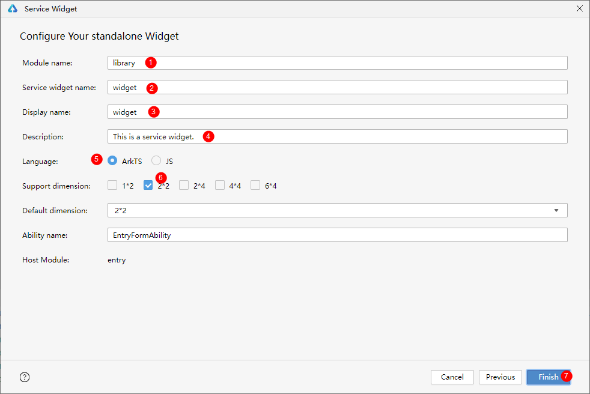
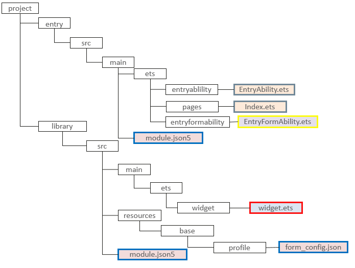

# Creating an ArkTS Widget
<!--Kit: Form Kit-->
<!--Subsystem: Ability-->
<!--Owner: @cx983299475-->
<!--Designer: @xueyulong-->
<!--Tester: @yangyuecheng-->
<!--Adviser: @HelloShuo-->
You can create an ArkTS widget package in either of the following ways:   
Method 1: Create a shared package. For details, see [Creating a Shared Package](./arkts-ui-widget-creation.md#method-1-creating-a-shared-package). The widget UI and application code are in the same module, and the final compilation product is in the same HAP. 
Method 2: Create a standalone package. For details, see [Creating a Standalone Package](./arkts-ui-widget-creation.md#method-2-creating-a-standalone-package). The widget UI and application code are in different modules, and the final compilation products are in separate widget and application packages. The initial APIs of this module are supported since API version 20. 
After an ArkTS widget is created, you can preview the widget in real time during development. For details, see [Previewing a Service Widget](https://developer.huawei.com/consumer/en/doc/harmonyos-guides/ide-service-widget#section18171652015).
## Method 1: Creating a Shared Package
### Procedure
**1. Create a project.** 
In DevEco Studio, create an application or atomic service project. Both types of projects support widget creation. For details about how to create a project, see [Creating a Project](https://developer.huawei.com/consumer/en/doc/harmonyos-guides/ide-create-new-project). 

>**NOTE**
>
> The UI may be different in DevEco Studio of a different version.

**2. Create a widget.** 
In an existing application project, right-click to create an ArkTS widget. The procedure is as follows:

- Right-click the **entry** directory and choose **New** > **Service Widget** > **Dynamic Widget** from the shortcut menu. In a project using the stage model of API version 10 or later, you can directly create dynamic widgets or static widgets through the **Service Widget** menu. After a widget is created, you can modify the widget type by setting the **isDynamic** parameter in the [form_config.json file](arkts-ui-widget-configuration.md#fields-in-configuration-file) of the widget. If **isDynamic** is left empty or set to **true**, the widget is a [dynamic widget](./arkts-form-overview.md#dynamic-widget). If **isDynamic** is set to **false**, the widget is a [static widget](./arkts-form-overview.md#static-widget). After the static widget and dynamic widget are switched, the user interaction implementation needs to be modified. For details, see [Dynamic Widget](./arkts-form-overview.md#dynamic-widget) and [Static Widget](./arkts-form-overview.md#static-widget) in ArkTS widget overview. 
   

- Select a template and click **Next**. 
   

- Set **Language** to **ArkTS**, **Support dimension** to the desired widget size, and **Default dimension** to the default widget dimension. Then click **Finish** to create an ArkTS widget. You can refer to or modify the widget dimension in the [form_config.json](arkts-ui-widget-configuration.md#fields-in-configuration-file) file. 
   

   You are advised to name the widget based on the actual scenario. After an ArkTS widget is created, the following widget-related files are automatically added to the project directory: **EntryFormAbility.ets** (widget lifecycle management file), **WidgetCard.ets** (widget page file), and **form_config.json** (widget configuration file). You can enter the widget configuration information and click **Finish**. 
   
### Project Structure
**Figure 1** ArkTS widget project directory and related modules 

- [FormExtensionAbility](../reference/apis-form-kit/js-apis-app-form-formExtensionAbility.md): provides lifecycle callbacks invoked when a widget is created, destroyed, or updated.

- [FormExtensionContext](../reference/apis-form-kit/js-apis-inner-application-formExtensionContext.md): provides context for FormExtensionAbilities. You can use the APIs of this module to start FormExtensionAbilities.

- [formProvider](../reference/apis-form-kit/js-apis-app-form-formProvider.md): provides capabilities such as obtaining widget information, updating widgets, and setting the widget update time.

- [formInfo](../reference/apis-form-kit/js-apis-app-form-formInfo.md): provides types and enums related to the widget information and state.

- [formBindingData](../reference/apis-form-kit/js-apis-app-form-formBindingData.md): provides APIs for widget data binding. You can use the APIs to create a **FormBindingData** object and obtain related information.

- [Page layout (WidgetCard.ets)](arkts-ui-widget-page-overview.md): provides the widget UI development capability based on ArkUI.
   - [General capabilities of ArkTS widgets](arkts-ui-widget-page-overview.md#page-capabilities-supported-by-arkts-widgets): provide components, attributes, and APIs that can be used in ArkTS widgets.
   - [Capabilities exclusive to ArkTS widgets](arkts-ui-widget-event-overview.md): include the **postCardAction** API used for interaction between the widget internal and the provider application and can be called only in the widget.

- [Widget configuration](arkts-ui-widget-configuration.md): includes FormExtensionAbility configuration and widget configuration.
   - Configure the FormExtensionAbility information under **extensionAbilities** in the [module.json5 file](../quick-start/module-configuration-file.md).
   - Configure **WidgetCard.ets** in the [form_config.json](arkts-ui-widget-configuration.md#fields-in-configuration-file) file under the **resources/base/profile/** directory.

## Method 2: Creating a Standalone Package
### Procedure
**1. Create a project.** 
In DevEco Studio, create an application or atomic service project. Both types of projects support widget creation. For details about how to create a project, see [Creating a Project](https://developer.huawei.com/consumer/en/doc/harmonyos-guides/ide-create-new-project). 

>**NOTE**
>
> The UI may be different in DevEco Studio of a different version. 

**2. Create a widget.** 
- Right-click the **entry** directory and choose **New** > **Service Widget** > **Dynamic Widget(Standalone)** from the shortcut menu. On the **Service Widget** menu, you can directly select **Dynamic Widget(standalone)** or **Static Widget(standalone)** to create a standalone package. After a widget is created, you can modify the widget type by setting the **isDynamic** parameter in the [form_config.json file](arkts-ui-widget-configuration.md#fields-in-configuration-file) of the widget. If **isDynamic** is left empty or set to **true**, the widget is a [dynamic widget](./arkts-form-overview.md#dynamic-widget). If **isDynamic** is set to **false**, the widget is a [static widget](./arkts-form-overview.md#static-widget). After the static widget and dynamic widget are switched, the user interaction implementation needs to be modified. For details, see [Dynamic Widget](./arkts-form-overview.md#dynamic-widget) and [Static Widget](./arkts-form-overview.md#static-widget) in ArkTS widget overview. 

- Select a template and click **Next**. 

- You can enter the widget configuration information and click **Finish**. After the widget is created, the entry package contains the application and widget backend capabilities, and the library package contains the widget UI capabilities. In the `module.json5` configuration file of the entry module, the `formWidgetModule` field must be associated with the library module; conversely, the `formExtensionModule` field in the `module.json5` of the library module must be linked to the entry module. This mutual association ensures the widget package and application bundle are properly connected. After the creation is complete, the configuration file is automatically generated and configured. You can also configure the file according to [widget configuration files](./arkts-ui-widget-configuration.md). 

### Project Structure
If a widget is created using a standalone widget package or a shared widget package, the project structure is different but the generated files are the same. For details about the files, see [Project Structure in a Shared Package](./arkts-ui-widget-creation.md#project-structure). 
**Figure 2** Project directory of a standalone widget package 
 
>**NOTE**
>
> The application package and widget package in a standalone widget package are two independent modules. Therefore, you need to ensure that the application package and widget package installed at the same time have the same version number.
