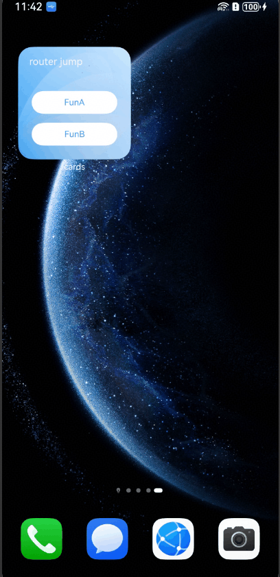

# Redirecting to an Application Page (router Event)
<!--Kit: Form Kit-->
<!--Subsystem: Ability-->
<!--Owner: @cx983299475-->
<!--Designer: @xueyulong-->
<!--Tester: @yangyuecheng-->
<!--Adviser: @HelloShuo-->

The **router** capability of the [postCardAction](../reference/apis-arkui/js-apis-postCardAction.md#postcardaction-1) API can be used in a dynamic widget to quickly start a specific UIAbility of the widget provider. By leveraging this capability, an application can provide in the widget multiple buttons, each of which targets a different target UIAbility. For example, a camera widget can provide the buttons that redirect the user to the UIAbility for taking a photo and the UIAbility for recording a video.


> **NOTE**
>
> This topic describes development for dynamic widgets. For static widgets, see [FormLink](../reference/apis-arkui/arkui-ts/ts-container-formlink.md).

## How to Develop
1. Create a dynamic widget. In the entry module of the project, create an ArkTS widget named **WidgetEventRouterCard**.

2. Build the code layout of the ArkTS widget page. Design two buttons on the widget page. When one of the buttons is tapped, **postCardAction** is called to send a router event to the specified UIAbility, with the content to be transferred defined in the event.

   <!-- @[widget_event_router_card](https://gitcode.com/openharmony/applications_app_samples/blob/master/code/DocsSample/ApplicationModels/StageServiceWidgetCards/entry/src/main/ets/widgeteventrouter/pages/WidgetEventRouterCard.ets) -->
   
   ``` TypeScript
   // src/main/ets/widgeteventrouter/pages/WidgetEventRouterCard.ets
   @Entry
   @Component
   struct WidgetEventRouterCard {
     build() {
       Column() {
         // Replace $r('app.string.JumpLabel') with the resource file you use.
         Text($r('app.string.JumpLabel'))
           .fontColor('#FFFFFF')
           .opacity(0.9)
           .fontSize(14)
           .margin({ top: '8%', left: '10%' })
         Row() {
           Column() {
             Button() {
               // Replace $r('app.string.ButtonA_label') with the resource file you use.
               Text($r('app.string.ButtonA_label'))
                 .fontColor('#45A6F4')
                 .fontSize(12)
             }
             .width(120)
             .height(32)
             .margin({ top: '20%' })
             .backgroundColor('#FFFFFF')
             .borderRadius(16)
             .onClick(() => {
               postCardAction(this, {
                 action: 'router',
                 abilityName: 'EntryAbility',
                 params: { targetPage: 'funA' }
               });
             })
   
             Button() {
               // Replace $r('app.string.ButtonB_label') with the resource file you use.
               Text($r('app.string.ButtonB_label'))
                 .fontColor('#45A6F4')
                 .fontSize(12)
             }
             .width(120)
             .height(32)
             .margin({ top: '8%', bottom: '15vp' })
             .backgroundColor('#FFFFFF')
             .borderRadius(16)
             .onClick(() => {
               postCardAction(this, {
                 action: 'router',
                 abilityName: 'EntryAbility',
                 params: { targetPage: 'funB' }
               });
             })
           }
         }.width('100%').height('80%')
         .justifyContent(FlexAlign.Center)
       }
       .width('100%')
       .height('100%')
       .alignItems(HorizontalAlign.Start)
       // Replace $r('app.media.CardEvent') with the resource file you use.
       .backgroundImage($r('app.media.CardEvent'))
       .backgroundImageSize(ImageSize.Cover)
     }
   }
   ```

3. Handle the router event. The UIAbility receives the router event and obtains parameters. It then starts the page specified by **params**.
  
   <!-- @[entry_ability](https://gitcode.com/openharmony/applications_app_samples/blob/master/code/DocsSample/ApplicationModels/StageServiceWidgetCards/entry/src/main/ets/entryability/EntryAbility.ts) -->
   
   ``` TypeScript
   // src/main/ets/entryability/EntryAbility.ts
   import { AbilityConstant, UIAbility, Want } from '@kit.AbilityKit';
   import { window } from '@kit.ArkUI';
   import { hilog } from '@kit.PerformanceAnalysisKit';
   
   const TAG: string = 'EntryAbility';
   const DOMAIN_NUMBER: number = 0xFF00;
   
   export default class EntryAbility extends UIAbility {
     private selectPage: string = 'funA';
     private currentWindowStage: window.WindowStage | null = null;
   
     onCreate(want: Want, launchParam: AbilityConstant.LaunchParam): void {
       // Obtain the targetPage parameter passed in the router event.
       hilog.info(DOMAIN_NUMBER, TAG, `Ability onCreate, ${JSON.stringify(want)}`);
       if (want?.parameters?.params) {
         // want.parameters.params corresponds to params in postCardAction().
         let params: Record<string, Object> = JSON.parse(want.parameters.params as string);
         this.selectPage = params.targetPage as string;
         hilog.info(DOMAIN_NUMBER, TAG, `onCreate selectPage: ${this.selectPage}`);
       }
     }
   
     // If the UIAbility is running in the background, onNewWant is triggered after the router event is received.
     onNewWant(want: Want, launchParam: AbilityConstant.LaunchParam): void {
       hilog.info(DOMAIN_NUMBER, TAG, `onNewWant Want: ${JSON.stringify(want)}`);
       if (want?.parameters?.params) {
         // want.parameters.params corresponds to params in postCardAction().
         let params: Record<string, Object> = JSON.parse(want.parameters.params as string);
         this.selectPage = params.targetPage as string;
         hilog.info(DOMAIN_NUMBER, TAG, `onNewWant selectPage: ${this.selectPage}`);
       }
       if (this.currentWindowStage !== null) {
         this.onWindowStageCreate(this.currentWindowStage);
       }
     }
   
     onWindowStageCreate(windowStage: window.WindowStage): void {
       // Main window is created, set main page for this ability
       let targetPage: string;
       // Start the page specified by targetPage.
       switch (this.selectPage) {
         case 'funA':
           targetPage = 'funpages/FunA';
           break;
         case 'funB':
           targetPage = 'funpages/FunB';
           break;
         default:
           targetPage = 'pages/Index';
       }
       if (this.currentWindowStage === null) {
         this.currentWindowStage = windowStage;
       }
       windowStage.loadContent(targetPage, (err, data) => {
         if (err.code) {
           hilog.error(DOMAIN_NUMBER, TAG, 'Failed to load the content. Cause: %{public}s', JSON.stringify(err) ?? '');
           return;
         }
         hilog.info(DOMAIN_NUMBER, TAG, 'Succeeded in loading the content. Data: %{public}s', JSON.stringify(data) ?? '');
       });
     }
   }
   ```

4. Create the UIAbility pages after redirection. Create **FunA.ets** and **FunB.ets** to build the page layout.

   <!-- @[fun_a](https://gitcode.com/openharmony/applications_app_samples/blob/master/code/DocsSample/ApplicationModels/StageServiceWidgetCards/entry/src/main/ets/funpages/FunA.ets) -->
   
   ``` TypeScript
   // src/main/ets/funpages/FunA.ets
   @Entry
   @Component
   struct FunA {
     build() {
       Column() {
         Row() {
           // Replace $r('app.string.ButtonA_label') with the resource file you use.
           Text(($r('app.string.ButtonA_label')))
             .fontSize(24)
             .fontWeight(FontWeight.Bold)
             .textAlign(TextAlign.Start)
             .margin({
               top: 12,
               bottom: 11,
               right: 24,
               left: 24
             })
         }
         .width('100%')
         .height(56)
         .justifyContent(FlexAlign.Start)
   
         // Replace $r('app.media.pic_empty') with the resource file you use.
         Image($r('app.media.pic_empty'))
           .width(120)
           .height(120)
           .margin({ top: 224 })
   
         // Replace $r('app.string.NoContentAvailable') with the resource file you use.
         Text($r('app.string.NoContentAvailable'))
           .fontSize(14)
           // Replace $r('app.color.text_color') with the resource file you use.
           .fontColor($r('app.color.text_color'))
           .opacity(0.4)
           .margin({
             top: 8,
             bottom: 317,
             right: 152,
             left: 152
           })
       }
       .width('100%')
       .height('100%')
     }
   }
   ```

   <!-- @[fun_b](https://gitcode.com/openharmony/applications_app_samples/blob/master/code/DocsSample/ApplicationModels/StageServiceWidgetCards/entry/src/main/ets/funpages/FunB.ets) -->
   
   ``` TypeScript
   // src/main/ets/funpages/FunB.ets
   @Entry
   @Component
   struct FunB {
     build() {
       Column() {
         Row() {
           // Replace $r('app.string.ButtonB_label') with the resource file you use.
           Text(($r('app.string.ButtonB_label')))
             .fontSize(24)
             .fontWeight(FontWeight.Bold)
             .textAlign(TextAlign.Start)
             .margin({
               top: 12,
               bottom: 11,
               right: 24,
               left: 24
             })
         }
         .width('100%')
         .height(56)
         .justifyContent(FlexAlign.Start)
   
         // Replace $r('app.media.pic_empty') with the resource file you use.
         Image($r('app.media.pic_empty'))
           .width(120)
           .height(120)
           .margin({ top: 224 })
   
         // Replace $r('app.string.NoContentAvailable') with the resource file you use.
         Text($r('app.string.NoContentAvailable'))
           .fontSize(14)
           // Replace $r('app.color.text_color') with the resource file you use.
           .fontColor($r('app.color.text_color'))
           .opacity(0.4)
           .margin({
             top: 8,
             bottom: 317,
             right: 152,
             left: 152
           })
       }
       .width('100%')
       .height('100%')
     }
   }
   ```

5. Configure the **FunA.ets** and **FunB.ets** pages in the **main_pages.json** file under **resources/base/profile**.
   ```json
   // src/main/resources/base/profile/main_pages.json
   {
       "src": [
         "pages/Index",
         "funpages/FunA",
         "funpages/FunB"
       ]
   }
   ```
6. The resource file is as follows. Replace the resources with the actual ones.
   ```json
   // src/main/resources/en_US/element/string.json
   {
     "string": [
       // ...
       {
         "name": "ButtonA_label",
         "value": "FunA page"
       },
       {
         "name": "ButtonB_label",
         "value": "FunB page"
       },
       {
         "name": "JumpLabel",
         "value": "router event"
       },
       {
         "name": "NoContentAvailable",
         "value": "No content"
       }
     ]
   }
   ```
## Running Effect

