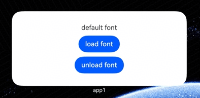

# Using Custom Fonts in ArkTS Widgets
<!--Kit: Form Kit-->
<!--Subsystem: Ability-->
<!--Owner: @cx983299475-->
<!--Designer: @xueyulong-->
<!--Tester: @yangyuecheng-->
<!--Adviser: @HelloShuo-->

Starting from API version 22, the [ohos.graphics.text.FontCollection.getLocalInstance](../reference/apis-arkgraphics2d/js-apis-graphics-text.md#getlocalinstance22) API has been added to obtain the local font set instance. Applications can use this local instance to load custom fonts for widgets.

## How to Develop
1. [Create an ArkTS widget](arkts-ui-widget-creation.md).

2. Add the custom font file `xxx.ttf` to the `entry\src\main\resources\rawfile` directory of the project.

3. Implement page layout.

    Add two buttons to the widget page. Tapping the `load font` button triggers **loadFontSync** to load the font, while tapping the `unload font` button triggers **unloadFontSync** to unload it.

```ts
import { text } from '@kit.ArkGraphics2D';

@Entry
@Component
struct loadFontSyncCard {
  // Use getLocalInstance to access the local font set instance.
  private fc: text.FontCollection = text.FontCollection.getLocalInstance();
  @State content: string = "Default font";

  build() {
    Column({ space: 10 }) {
      Text(this.content)
        .fontFamily("custom")  // Declare that the component uses a custom font.
      Button("load font")
        .onClick(() => {
          // Load the custom font file.
          this.fc.loadFontSync("custom", $rawfile("xxx.ttf"));
          this.content = "Custom font";
        })
      Button("unload font")
        .onClick(() => {
          this.fc.unloadFontSync("custom");
          this.content = "Default font";
        })
    }.width("100%")
    .height("100%")
    .justifyContent(FlexAlign.Center)
  }
}
```

> **NOTE**
>
> - The local font set can load multiple custom fonts, with a total memory limit of 20 MB for all loaded fonts.
>
> - All widgets in an application share a single local font set instance. When a custom font is loaded or unloaded, the font settings for all widgets update synchronously.


### Effect

