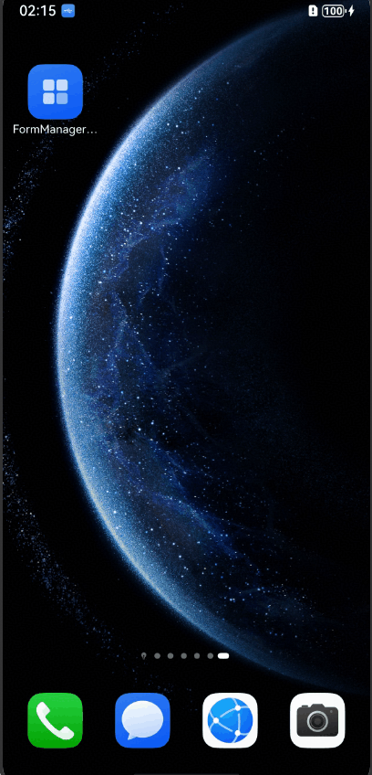

# Adding Widgets to the Home Screen
<!--Kit: Form Kit-->
<!--Subsystem: Ability-->
<!--Owner: @cx983299475-->
<!--Designer: @xueyulong-->
<!--Tester: @yangyuecheng-->
<!--Adviser: @HelloShuo-->

Since API version 18, Form Kit provides the capability of adding ArkTS widgets to the home screen in an application, allowing users to conveniently view information or quickly access the application.

## How to Develop
The following demonstrates how to add a widget to the home screen by tapping the **Add to home screen** button within the application. Users can navigate to the Widget Manager page, tap the button, and the widget will be added to the home screen automatically.
1. [Create a widget](./arkts-ui-widget-creation.md).

2. Add a button for opening the Widget Manager page in the application using the [openFormManager](../reference/apis-form-kit/js-apis-app-form-formProvider.md#formprovideropenformmanager18) method.

   <!-- @[FormManagerDemo](https://gitcode.com/openharmony/applications_app_samples/blob/master/code/DocsSample/Form/FormManagerDemo/entry/src/main/ets/pages/Index.ets) -->
   
   ``` TypeScript
   // entry/src/main/ets/pages/Index.ets
   import { formProvider } from '@kit.FormKit';
   import { BusinessError } from '@kit.BasicServicesKit';
   import { Want } from '@kit.AbilityKit';
   import { promptAction } from '@kit.ArkUI';
   import { hilog } from '@kit.PerformanceAnalysisKit';
   
   const DOMAIN = 0x0000;
   
   @Entry
   @Component
   struct Index {
     build() {
       Row() {
         Column() {
           // Add a button for opening the Widget Manager page.
           Button($r('app.string.open_form_manager_button'))
             .onClick(() => {
               const want: Want = {
                 bundleName: "com.samples.formmanagerdemo",
                 abilityName: 'EntryFormAbility',
                 parameters: {
                   'ohos.extra.param.key.form_dimension': 2,
                   'ohos.extra.param.key.form_name': 'widget',
                   'ohos.extra.param.key.module_name': 'entry'
                 },
               };
               try {
                 // Add a button and call the openFormManager method to start the widget management page.
                 formProvider.openFormManager(want);
               } catch (error) {
                 promptAction.openToast({ message: (error as BusinessError).message });
                 hilog.info(DOMAIN, 'testTag', 'catch error ', 'code:', (error as BusinessError).code, 'message:',
                   (error as BusinessError).message);
               }
             })
             .margin({ top: 10, bottom: 10 })
         }
         .width('100%')
       }
       .height('100%')
     }
   }
   ```

   The resource file is as follows:
   ```json
   // entry/src/main/resources/base/element/string.json
   {
     "string": [
       {
         "name": "open_form_manager_button",
         "value": "Add the widget to home screen"
       }
     ]
   }
   ```

3. Users can navigate to the Widget Manager page, tap **Add to home screen** or **Add to Assistant·TODAY**, and the widget will be added to the home screen or Assistant·TODAY. The following figure shows the effect.<br>

