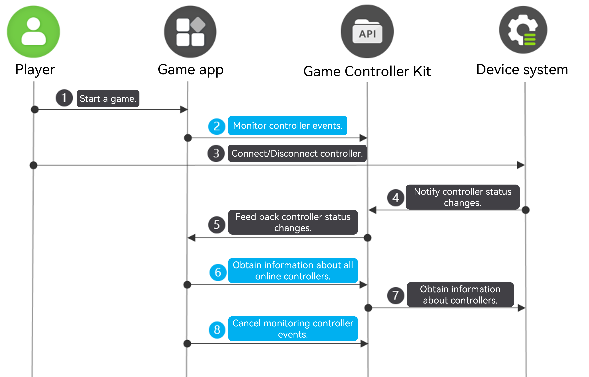

# Listening for Game Controller Online/Offline Events (C/C++)
<!--Kit: Game Controller Kit-->
<!--Subsystem: Game-->
<!--Owner: @zhaoshuhao123-->
<!--Designer: @wudejun2025-->
<!--Tester: @csp1992-->
<!--Adviser: @luwy2025-->

## When to Use

Game Controller Kit allows you to monitor controller online/offline events and query information about online controllers. After registering a listener for these events, you can receive real-time callback notifications when controllers are plugged in or unplugged. It also supports querying specific information about all online devices.


## Service Flow



1. A player starts a game.

2. The game calls **OH_GameDevice_RegisterDeviceMonitor** to register a listener for controller status change events.

3. The player plugs in or unplugs a game controller.

4. The device system notifies Game Controller Kit of the controller status change.

5. Game Controller Kit feeds back the controller status change to the game.

6. The game calls **OH_GameDevice_GetAllDeviceInfos** to query information about all online game controllers from Game Controller Kit.

7. Game Controller Kit obtains information about all online game controllers from the device system.

8. Unregister via **OHGameDeviceUnregisterDeviceMonitor** if monitoring is no longer needed.


## Available APIs

For details about the APIs, please refer to the [API reference](../reference/apis-game-controller-kit/capi-game-controller.md).

| API| Description| 
| -------- | -------- |
| GameController_ErrorCode OH_GameDevice_RegisterDeviceMonitor (GameDevice_DeviceMonitorCallback deviceMonitorCallback) | Registers the listening callback for controller status change events.| 
| GameController_ErrorCode OH_GameDevice_UnregisterDeviceMonitor (void) | Unregisters the listening callback for controller status change events.| 
| GameController_ErrorCode OH_GameDevice_GetAllDeviceInfos (GameDevice_AllDeviceInfos \*\*allDeviceInfos) | Obtains information about all online controllers.| 


## How to Develop


### Linking the Dynamic Library

```c
target_link_libraries(entry PUBLIC libohgame_controller.z.so)
```


### Importing the Module

```c
#include <GameControllerKit/game_device.h>
```


### Registering a Listener for Controller Status Changes

Call **OH_GameDevice_RegisterDeviceMonitor** to register a listener for controller status changes and receive callback notifications.

```c
napi_value DeviceApi::RegisterDeviceMonitor(napi_env env, napi_callback_info info) {
    napi_value result;
    GameController_ErrorCode errorCode = OH_GameDevice_RegisterDeviceMonitor(DeviceApi::OnDeviceChanged);
    if (errorCode != GameController_ErrorCode::GAME_CONTROLLER_SUCCESS) {
        OH_LOG_ERROR(LOG_APP, "RegisterDeviceMonitor Failed, %{public}d", errorCode);
        napi_create_double(env, errorCode, &result);
        return result;
    }
    OH_LOG_INFO(LOG_APP, "RegisterDeviceMonitor Success");
    napi_create_double(env, 0, &result);
    return result;
}

void DeviceApi::OnDeviceChanged(const struct GameDevice_DeviceEvent *deviceEvent) {
    GameDevice_StatusChangedType type;
    OH_GameDevice_DeviceEvent_GetChangedType(deviceEvent, &type);
    GameDevice_DeviceInfo *deviceInfo;
    OH_GameDevice_DeviceEvent_GetDeviceInfo(deviceEvent, &deviceInfo);
    std::string temp = GetDeviceInfoStringForPrint(deviceInfo);
    Log::GetInstance()->PrintLog("OnDeviceChanged type[" + std::to_string(type) + "] DeviceInfo" + temp);
    OH_LOG_INFO(LOG_APP, "OnDeviceChanged type:%{public}d DeviceInfo:%{public}s", type, temp.c_str());
    OH_GameDevice_DestroyDeviceInfo(&deviceInfo);
}
```


### Unregistering a Listener for Controller Status Changes

If subscription is no longer needed, call **OH_GameDevice_UnregisterDeviceMonitor** to unregister the listener for controller status change events.

```c
napi_value DeviceApi::UnregisterDeviceMonitor(napi_env env, napi_callback_info info) {
    napi_value result;
    GameController_ErrorCode errorCode = OH_GameDevice_UnregisterDeviceMonitor();
    if (errorCode != GameController_ErrorCode::GAME_CONTROLLER_SUCCESS) {
        OH_LOG_ERROR(LOG_APP, "UnregisterDeviceMonitor Failed, %{public}d", errorCode);
        napi_create_double(env, errorCode, &result);
        return result;
    }
    OH_LOG_INFO(LOG_APP, "UnregisterDeviceMonitor Success");
    napi_create_double(env, 0, &result);
    return result;
}
```


### Querying All Online Controllers

Call **OH_GameDevice_GetAllDeviceInfos** to query information about all online game controllers.

```c
GameController_ErrorCode DeviceApi::DoQueryAllDeviceInfos() {
    GameDevice_AllDeviceInfos *gameDevice_AllDeviceInfos;
    //Query all online controllers.
    GameController_ErrorCode errorCode = OH_GameDevice_GetAllDeviceInfos(&gameDevice_AllDeviceInfos);
    if (errorCode != GameController_ErrorCode::GAME_CONTROLLER_SUCCESS) {
        OH_LOG_ERROR(LOG_APP, "GetAllDeviceInfos Failed, %{public}d", errorCode);
        return errorCode;
    }
    // Obtain controller information in sequence.
    int count;
    OH_GameDevice_AllDeviceInfos_GetCount(gameDevice_AllDeviceInfos, &count);
    Log::GetInstance()->PrintLog("GetAllDeviceInfos Success, the count is " + std::to_string(count));
    for (int idx = 0; idx < count; idx++) {
        GameDevice_DeviceInfo *deviceInfo;
        errorCode = OH_GameDevice_AllDeviceInfos_GetDeviceInfo(gameDevice_AllDeviceInfos, idx, &deviceInfo);
        if (errorCode != GameController_ErrorCode::GAME_CONTROLLER_SUCCESS) {
            OH_LOG_ERROR(LOG_APP, "OH_GameDevice_AllDeviceInfos_GetDeviceInfo Failed, %{public}d", errorCode);
            return errorCode;
        }
        std::string temp = GetDeviceInfoStringForPrint(deviceInfo);
        Log::GetInstance()->PrintLog("AllDeviceInfos[" + std::to_string(idx) + "]" + temp);
        OH_LOG_INFO(LOG_APP, "AllDeviceInfos[%{public}d] DeviceInfo: %{public}s", idx, temp.c_str());
        OH_GameDevice_DestroyDeviceInfo(&deviceInfo);
    }
    // Destroy the pointer to the controller query result.
    OH_GameDevice_DestroyAllDeviceInfos(&gameDevice_AllDeviceInfos);
    OH_LOG_INFO(LOG_APP, "GetAllDeviceInfos Success");
    return errorCode;
}

std::string DeviceApi::GetDeviceInfoStringForPrint(GameDevice_DeviceInfo *deviceInfo) {
    std::string log;
    char *deviceId = NULL;
    OH_GameDevice_DeviceInfo_GetDeviceId(deviceInfo, &deviceId);
    log.append("deviceId:").append(deviceId);
    free(deviceId);
    char *name = NULL;
    OH_GameDevice_DeviceInfo_GetName(deviceInfo, &name);
    log.append(",name:").append(name);
    free(name);
    int product;
    OH_GameDevice_DeviceInfo_GetProduct(deviceInfo, &product);
    log.append(",product:").append(std::to_string(product));
    int version;
    OH_GameDevice_DeviceInfo_GetVersion(deviceInfo, &version);
    log.append(",version:").append(std::to_string(version));
    char *physicalAddress = NULL;
    OH_GameDevice_DeviceInfo_GetPhysicalAddress(deviceInfo, &physicalAddress);
    log.append(",physicalAddress:").append(physicalAddress);
    free(physicalAddress);
    GameDevice_DeviceType type;
    OH_GameDevice_DeviceInfo_GetDeviceType(deviceInfo, &type);
    log.append(",type:").append(std::to_string(type));
    return log;
}
```
