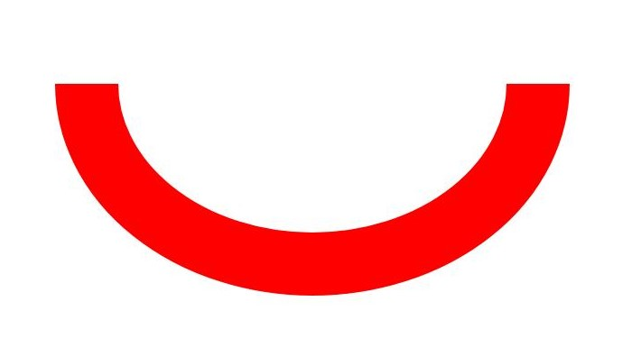
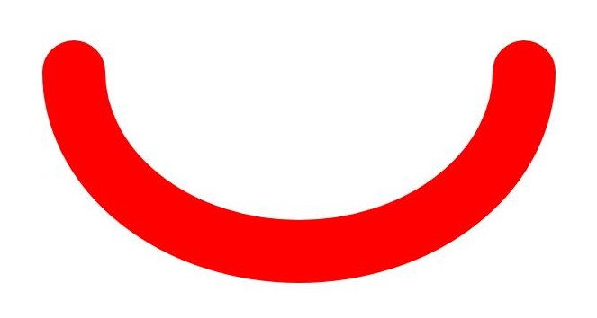
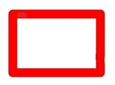

# Basic Drawing Effects (ArkTS)

<!--Kit: ArkGraphics 2D-->
<!--Subsystem: Graphics-->
<!--Owner: @hangmengxin-->
<!--Designer: @wangyanglan-->
<!--Tester: @nobuggers-->
<!--Adviser: @ge-yafang-->

## Overview

You can set some basic effects, such as the fill color, anti-aliasing, stroke, and line connection style.

You can set the basic fill effect using a brush and set the basic stroke effect using a pen.


## Fill Effect

You can set the basic fill color using a brush and use the brush to implement more complex drawing effects, such as the blend mode, shader effect, and filter effect. For details, see [Complex Drawing Effects](complex-drawing-effect-arkts.md).


### Available APIs

The following table lists the APIs for setting the drawing effect using a brush. For details, see [drawing.Brush](../reference/apis-arkgraphics2d/arkts-apis-graphics-drawing-Brush.md).

| API| Description|
| -------- | -------- |
| attachBrush(brush: Brush): void | Attaches a brush to a canvas so that the canvas can use the style and color of the brush to fill in a shape.|
| setColor(alpha: number, red: number, green: number, blue: number): void | Sets the color for a brush, which is used to fill in a shape.|
| setAntiAlias(aa: boolean) : void | Enables or disables anti-aliasing for a brush. Anti-aliasing makes the pixels around the shape edges semi-transparent, delivering a smoother effect.|
| detachBrush(): void | Removes the brush from the canvas. After the execution, the canvas does not use the previously set brush and restores to the default fill effect.|


### How to Develop

1. Create a brush object.

   <!-- @[arkts_graphics_draw_create_brush](https://gitcode.com/openharmony/applications_app_samples/blob/master/code/DocsSample/ArkGraphics2D/Drawing/ArkTSGraphicsDraw/entry/src/main/ets/drawing/pages/BasicEffect.ets) -->
   
   ``` TypeScript
   // Set the brush.
   const brush = new drawing.Brush();
   ```

2. Use the brush to set basic drawing effects, such as setting the fill color and enabling the anti-aliasing effect.
   You can call **setColor()** to set the fill color.

   <!-- @[arkts_graphics_draw_brush_set_color](https://gitcode.com/openharmony/applications_app_samples/blob/master/code/DocsSample/ArkGraphics2D/Drawing/ArkTSGraphicsDraw/entry/src/main/ets/drawing/pages/BasicEffect.ets) -->
   
   ``` TypeScript
   // Set the fill color to red.
   brush.setColor(0xFF, 0xFF, 0x00, 0x00);
   ```

   You can call **setAntiAlias()** to enable the anti-aliasing effect to smooth the edges of the graphics.

   <!-- @[arkts_graphics_draw_brush_set_antialias](https://gitcode.com/openharmony/applications_app_samples/blob/master/code/DocsSample/ArkGraphics2D/Drawing/ArkTSGraphicsDraw/entry/src/main/ets/drawing/pages/BasicEffect.ets) -->
   
   ``` TypeScript
   // Enable the anti-aliasing effect.
   brush.setAntiAlias(true);
   ```

3. Call **attachBrush()** to set a brush for the canvas.

   <!-- @[arkts_graphics_draw_canvas_attach_brush](https://gitcode.com/openharmony/applications_app_samples/blob/master/code/DocsSample/ArkGraphics2D/Drawing/ArkTSGraphicsDraw/entry/src/main/ets/drawing/pages/BasicEffect.ets) -->
   
   ``` TypeScript
   // Set a brush for the canvas.
   canvas.attachBrush(brush);
   ```

4. Draw primitives as required. For details, see [Drawing Primitives](primitive-drawing-overview.md).

5. If the fill effect is not required, you can use the **detachBrush()** API to remove the brush from the canvas.

   <!-- @[arkts_graphics_draw_canvas_detach_brush](https://gitcode.com/openharmony/applications_app_samples/blob/master/code/DocsSample/ArkGraphics2D/Drawing/ArkTSGraphicsDraw/entry/src/main/ets/drawing/pages/BasicEffect.ets) -->
   
   ``` TypeScript
   // Remove the brush.
   canvas.detachBrush();
   ```


## Stroke Effect

You can set the basic stroke color using a pen and use the pen to implement more complex drawing effects, such as the blend mode, path effect, shader effect, and filter effect. For details, see [Complex Drawing Effects](complex-drawing-effect-arkts.md).


### Available APIs

The following table lists the APIs for setting the drawing effect using a pen. For details, see [drawing.Pen](../reference/apis-arkgraphics2d/arkts-apis-graphics-drawing-Pen.md).


| API| Description|
| -------- | -------- |
| attachPen(pen: Pen): void | Attaches a pen to a canvas so that the canvas can use the style and color of the pen to outline a shape.|
| setColor(alpha: number, red: number, green: number, blue: number): void | Sets the color for a pen, which is used to outline a shape.|
| setStrokeWidth(width: number) : void | Sets the width for a pen. The value **0** is treated as an unusually thin width. During drawing, the width of 0 is always drawn as 1 pixel wide, regardless of any scaling applied to the canvas. Negative values are also regarded as the value **0** during the drawing process.|
| setAntiAlias(aa: boolean) : void | Enables or disables anti-aliasing for a pen. Anti-aliasing makes the pixels around the shape edges semi-transparent.|
| setCapStyle(style: CapStyle): void | Sets the line cap style for a pen.|
| setJoinStyle(style: JoinStyle): void | Sets the line join style for a pen.|
| detachPen(): void | Removes the brush from the canvas. After the execution, the canvas does not draw the outline of the shape and restores to the default fill effect.|


### How to Develop

1. Create a pen object.

   <!-- @[arkts_graphics_draw_create_drawing_pen](https://gitcode.com/openharmony/applications_app_samples/blob/master/code/DocsSample/ArkGraphics2D/Drawing/ArkTSGraphicsDraw/entry/src/main/ets/drawing/pages/BasicEffect.ets) -->
   
   ``` TypeScript
   // Create a pen object.
   let pen = new drawing.Pen();
   ```

2. Call **attachPen()** to set a pen for the canvas. The canvas uses the pen style and color to draw the outline.

   <!-- @[arkts_graphics_draw_canvas_attach_pen](https://gitcode.com/openharmony/applications_app_samples/blob/master/code/DocsSample/ArkGraphics2D/Drawing/ArkTSGraphicsDraw/entry/src/main/ets/drawing/pages/BasicEffect.ets) -->
   
   ``` TypeScript
   // Set a pen for the canvas.
   canvas.attachPen(pen);
   ```

3. (Optional) Use the pen to set the stroke effect. You can select one or more of the following effects:

   - You can call **setColor()** to set the pen color, which is used to outline a shape.

      <!-- @[arkts_graphics_draw_pen_set_color](https://gitcode.com/openharmony/applications_app_samples/blob/master/code/DocsSample/ArkGraphics2D/Drawing/ArkTSGraphicsDraw/entry/src/main/ets/drawing/pages/BasicEffect.ets) -->
      
      ``` TypeScript
      // Set the color to red.
      pen.setColor(0xFF, 0xFF, 0x00, 0x00);
      ```

   - You can call **setStrokeWidth()** to set the pen width.

      <!-- @[arkts_graphics_draw_pen_set_stroke_width](https://gitcode.com/openharmony/applications_app_samples/blob/master/code/DocsSample/ArkGraphics2D/Drawing/ArkTSGraphicsDraw/entry/src/main/ets/drawing/pages/BasicEffect.ets) -->
      
      ``` TypeScript
      // Set the stroke width.
      pen.setStrokeWidth(15);
      ```

   - You can call **setAntiAlias()** to set anti-aliasing for the pen to make the drawing edge smoother.

      <!-- @[arkts_graphics_draw_pen_set_antialias](https://gitcode.com/openharmony/applications_app_samples/blob/master/code/DocsSample/ArkGraphics2D/Drawing/ArkTSGraphicsDraw/entry/src/main/ets/drawing/pages/BasicEffect.ets) -->
      
      ``` TypeScript
      // Set the anti-aliasing effect.
      pen.setAntiAlias(true);
      ```

   - You can call **setCapStyle()** to set the pen cap style.

      <!-- @[arkts_graphics_draw_pen_set_cap_style](https://gitcode.com/openharmony/applications_app_samples/blob/master/code/DocsSample/ArkGraphics2D/Drawing/ArkTSGraphicsDraw/entry/src/main/ets/drawing/pages/BasicEffect.ets) -->
      
      ``` TypeScript
      // Set the pen cap style.
      pen.setCapStyle(drawing.CapStyle.SQUARE_CAP);
      ```

      The options of **CapStyle** are as follows.

      | Line Cap Style| Description| Effect|
      | -------- | -------- | -------- |
      | FLAT_CAP | No cap style. Both ends of the line segment are cut off square.|  |
      | SQUARE_CAP | Square cap style. Both ends have a square, the height of which is half of the width of the line segment, with the same width.|  |
      | ROUND_CAP | Round cap style. Both ends have a semicircle centered, the diameter of which is the same as the width of the line segment.|  |

   - You can call **setJoinStyle()** to set the pen join style.

      <!-- @[arkts_graphics_draw_pen_set_join_style](https://gitcode.com/openharmony/applications_app_samples/blob/master/code/DocsSample/ArkGraphics2D/Drawing/ArkTSGraphicsDraw/entry/src/main/ets/drawing/pages/BasicEffect.ets) -->
      
      ``` TypeScript
      // Set the pen join style.
      pen.setJoinStyle(drawing.JoinStyle.ROUND_JOIN);
      ```

      The options of **JoinStyle** are as follows.

      | Line Join Style| Description| Effect|
      | -------- | -------- | -------- |
      | MITER_JOIN | Miter join.| |
      | ROUND_JOIN | Round join.| |
      | BEVEL_JOIN | Beveled join.| |

4. Draw primitives as required. For details, see [Drawing Primitives](primitive-drawing-overview.md).

5. If the stroke effect is not required, you can use the **detachPen()** API to remove the pen from the canvas.

   <!-- @[arkts_graphics_draw_canvas_detach_pen](https://gitcode.com/openharmony/applications_app_samples/blob/master/code/DocsSample/ArkGraphics2D/Drawing/ArkTSGraphicsDraw/entry/src/main/ets/drawing/pages/BasicEffect.ets) -->
   
   ``` TypeScript
   // Remove the stroke effect.
   canvas.detachPen();
   ```

<!--RP1-->
## Samples

The following samples are provided to help you better understand how to use the **Drawing** APIs (ArkTS) for development:

- [ArkTSGraphicsDraw (API20)](https://gitcode.com/openharmony/applications_app_samples/tree/master/code/DocsSample/ArkGraphics2D/Drawing/ArkTSGraphicsDraw)
<!--RP1End-->
