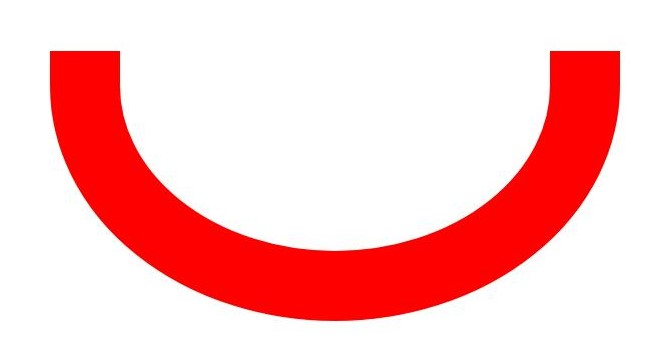

# Basic Drawing Effects (ArkTS)

<!--Kit: ArkGraphics 2D-->
<!--Subsystem: Graphics-->
<!--Owner: @hangmengxin-->
<!--Designer: @wangyanglan-->
<!--Tester: @nobuggers-->
<!--Adviser: @ge-yafang-->

## Overview

You can set some basic effects during drawing, such as setting the fill color, anti-aliasing, stroke, and line connection style.

You can set the basic filling effect through Brush and set the basic stroke effect through Pen.


## Filling Effect

You can set the basic fill color through Brush. You can also use Brush to implement more complex drawing effects by using blending modes, shaders, and filters. For details, see complex-drawing-effect-arkts.md.


### Available APIs

The following table lists the common APIs for setting drawing effects through Brush. For details about the usage and parameters, see [drawing.Brush](../reference/apis-arkgraphics2d/arkts-apis-graphics-drawing-Brush.md).

| API| Description|
| -------- | -------- |
| attachBrush(brush: Brush): void | Attaches a brush to a canvas so that the canvas can use the style and color of the brush to fill in a shape.|
| setColor(alpha: number, red: number, green: number, blue: number): void | Sets the color attribute of the brush. The color attribute describes the color used by the brush to fill the shape.|
| setAntiAlias(aa: boolean) : void | Sets the anti-aliasing attribute of the brush. If this attribute is set to true, the brush blurs the edge pixels of the shape to be drawn in a semi-transparent manner, making the shape edges smoother.|
| detachBrush(): void | Removes the brush from the canvas. After this API is called, the canvas does not use the previously set brush and restores to the default filling effect.|


### How to Develop

1. Create a Brush object.

   ```ts
   // BasicEffect.ets
   const brush = new drawing.Brush();
   ```
   <!-- [arkts_graphics_draw_create_brush](https://gitcode.com/openharmony/applications_app_samples/blob/master/code/DocsSample/Drawing/ArkTSGraphicsDraw/entry/src/main/ets/drawing/pages/BasicEffect.ets) -->

2. Set basic drawing effects through Brush, for example, setting the fill color and enabling anti-aliasing.
   You can use the setColor() API to set the fill color.

   ```ts
   // BasicEffect.ets
   brush.setColor(0xFF, 0xFF, 0x00, 0x00);
   ```
   <!-- [arkts_graphics_draw_brush_set_color](https://gitcode.com/openharmony/applications_app_samples/blob/master/code/DocsSample/Drawing/ArkTSGraphicsDraw/entry/src/main/ets/drawing/pages/BasicEffect.ets) -->

   You can use the setAntiAlias() API to enable the anti-aliasing effect so that the edges of the graphics are smoother.

   ```ts
   // BasicEffect.ets
   brush.setAntiAlias(true);
   ```
   <!-- [arkts_graphics_draw_brush_set_antialias](https://gitcode.com/openharmony/applications_app_samples/blob/master/code/DocsSample/Drawing/ArkTSGraphicsDraw/entry/src/main/ets/drawing/pages/BasicEffect.ets) -->

3. Use the attachBrush() API to set a brush for the canvas.

   ```ts
   // BasicEffect.ets
   canvas.attachBrush(brush);
   ```
   <!-- [arkts_graphics_draw_canvas_attach_brush](https://gitcode.com/openharmony/applications_app_samples/blob/master/code/DocsSample/Drawing/ArkTSGraphicsDraw/entry/src/main/ets/drawing/pages/BasicEffect.ets) -->

4. Draw primitives as required. For details, see [Primitive Drawing](primitive-drawing-overview.md).

5. If the filling effect is not required, you can use the detachBrush() API to remove the brush from the canvas.

   ```ts
   // BasicEffect.ets
   canvas.detachBrush();
   ```
   <!-- [arkts_graphics_draw_canvas_detach_brush](https://gitcode.com/openharmony/applications_app_samples/blob/master/code/DocsSample/Drawing/ArkTSGraphicsDraw/entry/src/main/ets/drawing/pages/BasicEffect.ets) -->


## Stroke Effect

You can set the basic stroke color by using a pen. In addition, you can use a pen to implement more complex drawing effects, such as blending modes, path effects, shader effects, and filter effects. For details, see [Complex Drawing Effects](complex-drawing-effect-arkts.md).


### Available APIs

The following table lists the common APIs for setting the drawing effect using a pen. For details about the APIs and parameters, see [drawing.Pen](../reference/apis-arkgraphics2d/arkts-apis-graphics-drawing-Pen.md).


| API| Description|
| -------- | -------- |
| attachPen(pen: Pen): void | Attaches a pen to a canvas so that the canvas can use the style and color of the pen to outline a shape.|
| setColor(alpha: number, red: number, green: number, blue: number): void | Sets the color attribute of the pen. The color attribute describes the color used by the pen to draw the outline of the graphic.|
| setStrokeWidth(width: number) : void | Sets the width for a pen. A line width of 0 is considered as a special ultra-fine line width. During drawing, the line width is always drawn as 1 pixel and does not change with the canvas scaling. A negative line width is considered as a line width of 0 during actual drawing.|
| setAntiAlias(aa: boolean) : void | Sets the anti-aliasing attribute of the pen. If this attribute is set to true, the pen blurs the edge pixels of the graphic in a semi-transparent manner when drawing the graphic.|
| setCapStyle(style: CapStyle): void | Sets the line cap style of the pen.|
| setJoinStyle(style: JoinStyle): void | Sets the line join style for a pen.|
| detachPen(): void | Removes the pen from the canvas. After the pen is removed, the canvas does not draw the outline of the shape and restores to the default filling effect.|


### How to Develop

1. Create a pen object.

   ```ts
   // BasicEffect.ets
   let pen = new drawing.Pen();
   ```
   <!-- [arkts_graphics_draw_create_drawing_pen](https://gitcode.com/openharmony/applications_app_samples/blob/master/code/DocsSample/Drawing/ArkTSGraphicsDraw/entry/src/main/ets/drawing/pages/BasicEffect.ets) -->

2. Use the attachPen() API to set a pen for the canvas. The canvas uses the configured pen style and color to draw the outline of the shape.

   ```ts
   // BasicEffect.ets
   canvas.attachPen(pen);
   ```
   <!-- [arkts_graphics_draw_canvas_attach_pen](https://gitcode.com/openharmony/applications_app_samples/blob/master/code/DocsSample/Drawing/ArkTSGraphicsDraw/entry/src/main/ets/drawing/pages/BasicEffect.ets) -->

3. (Optional) Use the pen to set the stroke effect. You can select one or more of the following effects:

   - Use the setColor() API to set the pen color, which is the color used for drawing the outline of the shape.

      ```ts
      // BasicEffect.ets
      // Set the color to red.
      pen.setColor(0xFF, 0xFF, 0x00, 0x00);
      ```
      <!-- [arkts_graphics_draw_pen_set_color](https://gitcode.com/openharmony/applications_app_samples/blob/master/code/DocsSample/Drawing/ArkTSGraphicsDraw/entry/src/main/ets/drawing/pages/BasicEffect.ets) -->

   - Use the setStrokeWidth() API to set the pen width.

      ```ts
      // BasicEffect.ets
      pen.setStrokeWidth(15);
      ```
      <!-- [arkts_graphics_draw_pen_set_stroke_width](https://gitcode.com/openharmony/applications_app_samples/blob/master/code/DocsSample/Drawing/ArkTSGraphicsDraw/entry/src/main/ets/drawing/pages/BasicEffect.ets) -->

   - Use the setAntiAlias() API to set anti-aliasing for the pen to make the edges of the drawn shape smoother.

      ```ts
      // BasicEffect.ets
      pen.setAntiAlias(true);
      ```
      <!-- [arkts_graphics_draw_pen_set_antialias](https://gitcode.com/openharmony/applications_app_samples/blob/master/code/DocsSample/Drawing/ArkTSGraphicsDraw/entry/src/main/ets/drawing/pages/BasicEffect.ets) -->

   - Use the setCapStyle() API to set the line cap style of the pen.

      ```ts
      // BasicEffect.ets
      pen.setCapStyle(drawing.CapStyle.SQUARE_CAP);
      ```
      <!-- [arkts_graphics_draw_pen_set_cap_style](https://gitcode.com/openharmony/applications_app_samples/blob/master/code/DocsSample/Drawing/ArkTSGraphicsDraw/entry/src/main/ets/drawing/pages/BasicEffect.ets) -->

      The line cap styles are as follows:

      | Line Cap Style| Description| Diagram|
      | -------- | -------- | -------- |
      | FLAT_CAP | There is no cap style. Both ends of the line segment are cut off square.|  |
      | SQUARE_CAP | Square cap style. Both ends have a square, the height of which is half of the width of the line segment, with the same width.|  |
      | ROUND_CAP | Round cap style. Both ends have a semicircle centered, the diameter of which is the same as the width of the line segment.|  |

   - Use the setJoinStyle() API to set the corner style of the pen.

      ```ts
      // BasicEffect.ets
      pen.setJoinStyle(drawing.JoinStyle.ROUND_JOIN);
      ```
      <!-- [arkts_graphics_draw_pen_set_join_style](https://gitcode.com/openharmony/applications_app_samples/blob/master/code/DocsSample/Drawing/ArkTSGraphicsDraw/entry/src/main/ets/drawing/pages/BasicEffect.ets) -->

      The JoinStyle class classifies the corner styles as follows:

      | Corner Style| Description| Diagram|
      | -------- | -------- | -------- |
      | MITER_JOIN | The corner type is miter.| |
      | ROUND_JOIN | Round corner.| |
      | BEVEL_JOIN | Beveled corner.| |

4. Draw primitives as required. For details, see [Primitive Drawing](primitive-drawing-overview.md).

5. If the stroke effect is not required, you can use the detachPen() API to remove the pen from the canvas.

   ```ts
   // BasicEffect.ets
   canvas.detachPen();
   ```
   <!-- [arkts_graphics_draw_canvas_detach_pen](https://gitcode.com/openharmony/applications_app_samples/blob/master/code/DocsSample/Drawing/ArkTSGraphicsDraw/entry/src/main/ets/drawing/pages/BasicEffect.ets) -->

<!--RP1-->
## Samples

The following samples can be used as references for Drawing (ArkTS) development:

- [ArkTSGraphicsDraw (API14)](https://gitcode.com/openharmony/applications_app_samples/tree/master/code/DocsSample/Drawing/ArkTSGraphicsDraw)
<!--RP1End-->
