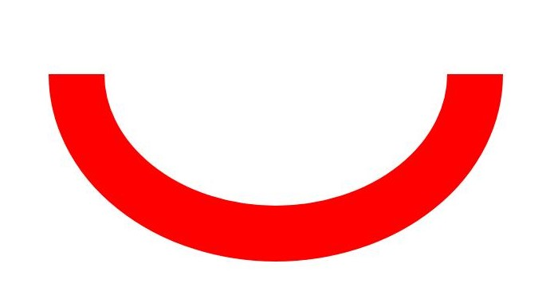
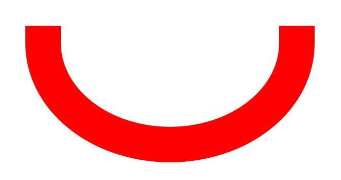
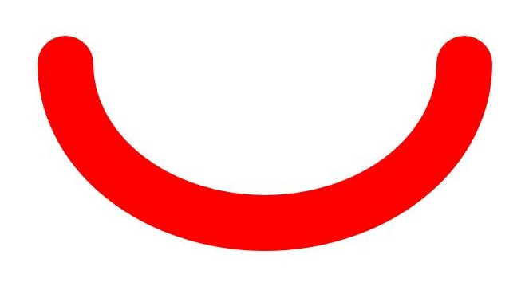
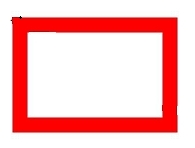
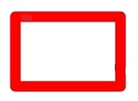

# Basic Drawing Effects (C/C++)

<!--Kit: ArkGraphics 2D-->
<!--Subsystem: Graphics-->
<!--Owner: @hangmengxin-->
<!--Designer: @wangyanglan-->
<!--Tester: @nobuggers-->
<!--Adviser: @ge-yafang-->

## Overview

You can set some basic effects during drawing, such as setting the fill color, anti-aliasing, graphic stroke, and graphic line connection style.

You can set the basic filling effect through the brush and set the basic stroke effect through the pen.


## Filling Effect

You can set the basic fill color through the brush. You can also use the brush to use the blending mode, shader effect, and filter effect to implement more complex drawing effects. For details, see complex-drawing-effect-c.md.


### Available APIs

The following table lists the common APIs for using the brush to set the drawing effect. For details about the usage and parameters, see [drawing_brush](../reference/apis-arkgraphics2d/capi-drawing-brush-h.md).

| API| Description|
| -------- | -------- |
| OH_Drawing_Brush\* OH_Drawing_BrushCreate (void) | Creates an **OH_Drawing_Brush** object.|
| void OH_Drawing_CanvasAttachBrush (OH_Drawing_Canvas\*, const OH_Drawing_Brush\*) | Sets the brush for the canvas. The canvas uses the set brush style and color to fill the drawn graphic shape.|
| void OH_Drawing_BrushSetColor (OH_Drawing_Brush\* , uint32_t color) | Sets the color for a brush. The color is used by the brush to fill in a shape.|
| void OH_Drawing_BrushSetAntiAlias (OH_Drawing_Brush\* , bool) | Sets the anti-aliasing attribute of the brush. If this attribute is set to true, the brush blurs the edge pixels of the graphic in a semi-transparent manner when drawing the graphic, so that the edge of the graphic is smoother.|
| void OH_Drawing_CanvasDetachBrush (OH_Drawing_Canvas\*) | Removes the brush from the canvas. After the brush is removed, the canvas does not use the brush and restores to the default filling effect.|
| void OH_Drawing_BrushDestroy (OH_Drawing_Brush\*) | Destroys an **OH_Drawing_Brush** object and reclaims the memory occupied by the object.|


### How to Develop

1. Create a brush object by calling OH_Drawing_BrushCreate().

   <!-- @[ndk_graphics_draw_create_brush](https://gitcode.com/openharmony/applications_app_samples/blob/master/code/DocsSample/ArkGraphics2D/Drawing/NDKGraphicsDraw/entry/src/main/cpp/samples/sample_graphics.cpp) -->

   ``` C++
   // Create a brush.
   OH_Drawing_Brush* brush = OH_Drawing_BrushCreate();
   ```

2. (Optional) Set the basic drawing effect using the brush. You can select one or more of the following effects:

   - Call OH_Drawing_BrushSetColor() to set the fill color.

      <!-- @[ndk_graphics_draw_brush_set_color](https://gitcode.com/openharmony/applications_app_samples/blob/master/code/DocsSample/ArkGraphics2D/Drawing/NDKGraphicsDraw/entry/src/main/cpp/samples/sample_graphics.cpp) -->
      
      ``` C++
      // Set the fill color to red.
      uint32_t color = 0xffff0000;
      OH_Drawing_BrushSetColor(brush, color);
      ```

      color is a 32-bit (ARGB) variable, for example, 0xffff0000.
   
   - Call OH_Drawing_BrushSetAntiAlias() to enable the anti-aliasing effect to make the edges of the graphics smoother.

      <!-- @[ndk_graphics_draw_brush_set_antialias](https://gitcode.com/openharmony/applications_app_samples/blob/master/code/DocsSample/ArkGraphics2D/Drawing/NDKGraphicsDraw/entry/src/main/cpp/samples/sample_graphics.cpp) -->
      
      ``` C++
      // Enable anti-aliasing.
      OH_Drawing_BrushSetAntiAlias(brush, true);
      ```

3. Call OH_Drawing_CanvasAttachBrush() to set the brush for the canvas. This API accepts two parameters. One is the canvas object. Ensure that the canvas has been created or obtained. For details, see [Obtaining a Canvas and Displaying the Drawing Result (C/C++)](canvas-get-result-draw-c.md). The other is the brush object to be set. The canvas uses the set brush style and color to fill the graphics.

   <!-- @[ndk_graphics_draw_canvas_attach_brush](https://gitcode.com/openharmony/applications_app_samples/blob/master/code/DocsSample/ArkGraphics2D/Drawing/NDKGraphicsDraw/entry/src/main/cpp/samples/sample_graphics.cpp) -->
   
   ``` C++
   // Set the brush of the canvas.
   OH_Drawing_CanvasAttachBrush(canvas, brush);
   ```

4. Draw primitives as required. For details, see [Drawing Primitives](primitive-drawing-overview.md).

5. When the filling effect is not required, you can call OH_Drawing_CanvasDetachBrush() to remove the brush. The input parameter is the canvas object.

   <!-- @[ndk_graphics_draw_canvas_detach_brush](https://gitcode.com/openharmony/applications_app_samples/blob/master/code/DocsSample/ArkGraphics2D/Drawing/NDKGraphicsDraw/entry/src/main/cpp/samples/sample_graphics.cpp) -->
   
   ``` C++
   // Remove the brush from the canvas.
   OH_Drawing_CanvasDetachBrush(canvas);
   ```

6. When the brush is no longer needed, use the OH_Drawing_BrushDestroy() API to destroy the brush object in a timely manner.

   <!-- @[ndk_graphics_draw_brush_destroy](https://gitcode.com/openharmony/applications_app_samples/blob/master/code/DocsSample/ArkGraphics2D/Drawing/NDKGraphicsDraw/entry/src/main/cpp/samples/sample_graphics.cpp) -->
   
   ``` C++
   // Destroy objects.
   OH_Drawing_BrushDestroy(brush);
   ```


## Stroke Effect

You can set the basic stroke color by using a pen, and use the pen to implement more complex drawing effects by using the blending mode, path effect, shader effect, and filter effect. For details, see [Complex Drawing Effects](complex-drawing-effect-c.md).


### Available APIs

The following table lists the common APIs for setting the drawing effect by using a pen. For details about the APIs and parameters, see [drawing_pen](../reference/apis-arkgraphics2d/capi-drawing-pen-h.md).

| API| Description|
| -------- | -------- |
| OH_Drawing_Pen\* OH_Drawing_PenCreate (void) | Creates an **OH_Drawing_Pen** object.|
| void OH_Drawing_CanvasAttachPen (OH_Drawing_Canvas\* , const OH_Drawing_Pen\* ) | Attaches a pen to a canvas so that the canvas can use the style and color of the pen to outline a shape.|
| void OH_Drawing_PenSetColor (OH_Drawing_Pen\* , uint32_t color) | Sets the color for a pen. The color is used by the pen to outline a shape.|
| void OH_Drawing_PenSetWidth (OH_Drawing_Pen\* , float width) | Sets the width for a pen. A line width of 0 is considered as a special ultra-fine line width. The line width is always drawn as 1 pixel during drawing and does not change with the canvas scaling. A negative line width is considered as 0 during actual drawing.|
| void OH_Drawing_PenSetAntiAlias (OH_Drawing_Pen\* , bool ) | Sets the anti-aliasing attribute of the pen. If this attribute is set to true, the pen performs semi-transparent blurring on the edge pixels of the shape when drawing the shape.|
| void OH_Drawing_PenSetCap (OH_Drawing_Pen\* , OH_Drawing_PenLineCapStyle) | Sets the line cap style of the pen.|
| void OH_Drawing_PenSetJoin (OH_Drawing_Pen\* , OH_Drawing_PenLineJoinStyle) | Sets the line join style for a pen.|
| void OH_Drawing_CanvasDetachPen (OH_Drawing_Canvas\*) | Removes the pen from the canvas. After the execution, the canvas does not draw the outline of the shape and restores to the default filling effect.|
| void OH_Drawing_PenDestroy (OH_Drawing_Pen\*) | Destroys an **OH_Drawing_Pen** object and reclaims the memory occupied by the object.|


### How to Develop

1. Use the OH_Drawing_PenCreate() API to create a pen object.

   <!-- @[ndk_graphics_draw_create_drawing_pen](https://gitcode.com/openharmony/applications_app_samples/blob/master/code/DocsSample/ArkGraphics2D/Drawing/NDKGraphicsDraw/entry/src/main/cpp/samples/sample_graphics.cpp) -->
   
   ``` C++
   // Create a pen.
   OH_Drawing_Pen* pen = OH_Drawing_PenCreate();
   ```

2. Use the OH_Drawing_CanvasAttachPen() API to set the pen for the canvas. The API accepts two parameters. One is the canvas object. Ensure that the canvas has been created or obtained. For details, see [Obtaining a Canvas and Displaying the Drawing Result (C/C++)](canvas-get-result-draw-c.md). The other is the pen object to be set. The canvas uses the configured pen style and color to draw the outline of the shape.

   <!-- @[ndk_graphics_draw_canvas_attach_pen](https://gitcode.com/openharmony/applications_app_samples/blob/master/code/DocsSample/ArkGraphics2D/Drawing/NDKGraphicsDraw/entry/src/main/cpp/samples/sample_graphics.cpp) -->
   
   ``` C++
   // Set the pen for the canvas.
   OH_Drawing_CanvasAttachPen(canvas, pen);
   ```

3. (Optional) Use the pen to set the specific stroke effect (one or more of the following effects).

   - Use the OH_Drawing_PenSetColor() API to set the pen color, which is the color used for drawing the outline of the shape.
  
      <!-- @[ndk_graphics_draw_pen_set_color](https://gitcode.com/openharmony/applications_app_samples/blob/master/code/DocsSample/ArkGraphics2D/Drawing/NDKGraphicsDraw/entry/src/main/cpp/samples/sample_graphics.cpp) -->
      
      ``` C++
      // Set the stroke color to red.
      uint32_t color = 0xffff0000;
      OH_Drawing_PenSetColor(pen, color);
      ```

      color is a 32-bit (ARGB) variable, for example, 0xffff0000.

   - Use the OH_Drawing_PenSetWidth() API to set the pen width.

      <!-- @[ndk_graphics_draw_pen_set_stroke_width](https://gitcode.com/openharmony/applications_app_samples/blob/master/code/DocsSample/ArkGraphics2D/Drawing/NDKGraphicsDraw/entry/src/main/cpp/samples/sample_graphics.cpp) -->
      
      ``` C++
      // Set the pen width to 50 pixels.
      float width = 50.0;
      OH_Drawing_PenSetWidth(pen, width);
      ```

      width indicates the pixel value of the line width.

   - Use the OH_Drawing_PenSetAntiAlias() API to set anti-aliasing for the pen to make the edges of the drawn shape smoother.

      <!-- @[ndk_graphics_draw_pen_set_antialias](https://gitcode.com/openharmony/applications_app_samples/blob/master/code/DocsSample/ArkGraphics2D/Drawing/NDKGraphicsDraw/entry/src/main/cpp/samples/sample_graphics.cpp) -->
      
      ``` C++
      // Enable anti-aliasing for the pen.
      OH_Drawing_PenSetAntiAlias(pen, true);
      ```

   - Use the OH_Drawing_PenSetCap() API to set the pen line cap style.

      <!-- @[ndk_graphics_draw_pen_set_cap_style](https://gitcode.com/openharmony/applications_app_samples/blob/master/code/DocsSample/ArkGraphics2D/Drawing/NDKGraphicsDraw/entry/src/main/cpp/samples/sample_graphics.cpp) -->
      
      ``` C++
      // Set the cap style for the pen.
      OH_Drawing_PenSetCap(pen, OH_Drawing_PenLineCapStyle::LINE_ROUND_CAP);
      ```

      The line cap styles of OH_Drawing_PenLineCapStyle are as follows:

      | Line Cap Style| Description| Diagram|
      | -------- | -------- | -------- |
      | LINE_FLAT_CAP | There is no cap style. Both ends of the line segment are cut off square.|  |
      | LINE_SQUARE_CAP | Square cap style. Both ends have a square, the height of which is half of the width of the line segment, with the same width.|  |
      | LINE_ROUND_CAP | Round cap style. Both ends have a semicircle centered, the diameter of which is the same as the width of the line segment.|  |

   - You can use the OH_Drawing_PenSetJoin() API to set the pen corner style.

      <!-- @[ndk_graphics_draw_pen_set_join_style](https://gitcode.com/openharmony/applications_app_samples/blob/master/code/DocsSample/ArkGraphics2D/Drawing/NDKGraphicsDraw/entry/src/main/cpp/samples/sample_graphics.cpp) -->
      
      ``` C++
      // Set the join style for the pen.
      OH_Drawing_PenSetJoin(pen, OH_Drawing_PenLineJoinStyle::LINE_BEVEL_JOIN);
      ```

      The corner styles of OH_Drawing_PenLineJoinStyle are as follows:
      | Corner Style| Description| Diagram|
      | -------- | -------- | -------- |
      | LINE_MITER_JOIN | The corner type is sharp.| |
      | LINE_ROUND_JOIN | Round corner.| |
      | LINE_BEVEL_JOIN | Beveled corner.| |

4. Draw primitives as required. For details, see [Drawing Primitives](primitive-drawing-overview.md).

5. If the stroke effect is not required, you can use OH_Drawing_CanvasDetachPen() to remove it. The input parameter is the canvas object. Ensure that the canvas has been created or obtained. For details, see Obtaining a Canvas and Displaying the Drawing Result (C/C++).

   <!-- @[ndk_graphics_draw_canvas_detach_pen](https://gitcode.com/openharmony/applications_app_samples/blob/master/code/DocsSample/ArkGraphics2D/Drawing/NDKGraphicsDraw/entry/src/main/cpp/samples/sample_graphics.cpp) -->
   
   ``` C++
   // Remove the pen from the canvas.
   OH_Drawing_CanvasDetachPen(canvas);
   ```

6. When the pen is no longer needed, use the OH_Drawing_PenDestroy() API to destroy the pen object in a timely manner.

   <!-- @[ndk_graphics_draw_pen_destroy](https://gitcode.com/openharmony/applications_app_samples/blob/master/code/DocsSample/ArkGraphics2D/Drawing/NDKGraphicsDraw/entry/src/main/cpp/samples/sample_graphics.cpp) -->
   
   ``` C++
   // Destroy objects.
   OH_Drawing_PenDestroy(pen);
   ```

<!--RP1-->
## Samples

The following samples are available for Drawing (C/C++):

- [NDKGraphicsDraw (API20)](https://gitcode.com/openharmony/applications_app_samples/tree/master/code/DocsSample/ArkGraphics2D/Drawing/NDKGraphicsDraw)
<!--RP1End-->
