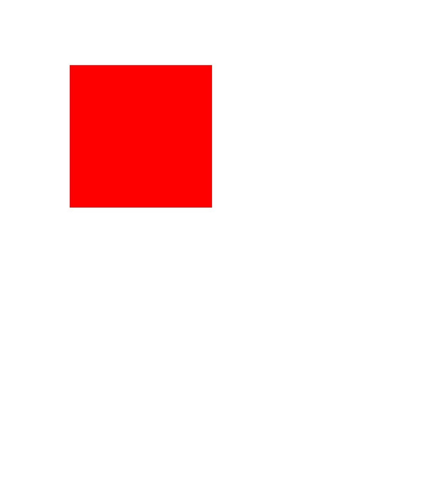
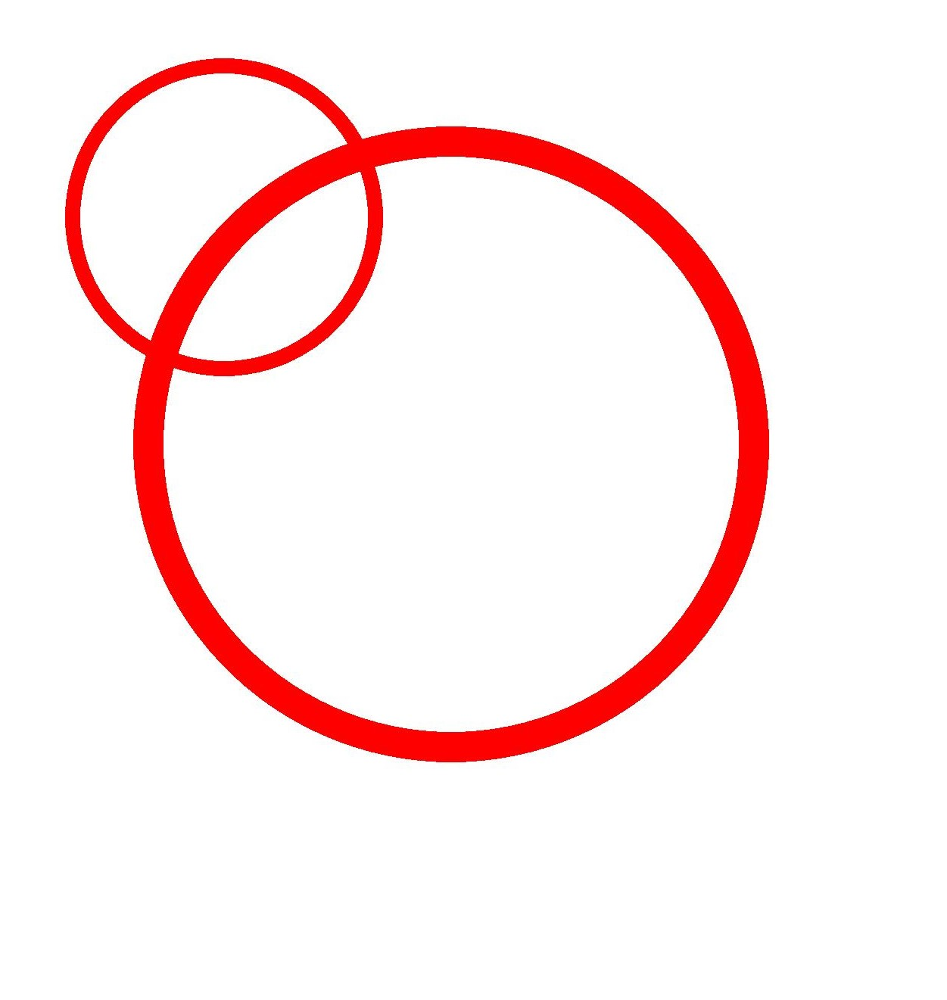

# Canvas Operations and State Processing (ArkTS)

<!--Kit: ArkGraphics 2D-->
<!--Subsystem: Graphics-->
<!--Owner: @hangmengxin-->
<!--Designer: @wangyanglan-->
<!--Tester: @nobuggers-->
<!--Adviser: @ge-yafang-->

## Overview

After creating or obtaining a canvas, you can perform graphics operations and status processing based on the canvas. Canvas operations are optional. You need to perform canvas operations before subsequent drawing. Otherwise, the canvas operations do not take effect.

Common canvas operations are as follows:

- Clipping

- Matrix transformation, such as translation, scaling, and rotation

- Status saving and restoration

For details about more canvas operations and API parameters, see [drawing.Canvas](../reference/apis-arkgraphics2d/arkts-apis-graphics-drawing-Canvas.md).


## Clipping

Clipping is a common operation in graphics processing. It is performed on the canvas and can be used to restrict the drawing region. The corresponding effect is displayed only after the clipping operation is performed before drawing.

The following clipping operations are supported:

- Clipping a rectangle

- Clipping a rounded rectangle

- Clipping a custom path

- Clipping a region


### Available APIs

The following table lists the APIs for clipping. For details, see [drawing.Canvas](../reference/apis-arkgraphics2d/arkts-apis-graphics-drawing-Canvas.md).


| API| Description|
| -------- | -------- |
| clipRect(rect: common2D.Rect, clipOp?: ClipOp, doAntiAlias?: boolean): void | Clips a rectangle.|
| clipRoundRect(roundRect: RoundRect, clipOp?: ClipOp, doAntiAlias?: boolean): void | Clips a rounded rectangle.|
| clipPath(path: Path, clipOp?: ClipOp, doAntiAlias?: boolean): void | Clips a path.|
| clipRegion(region: Region, clipOp?: ClipOp): void | Clips a rectangle.|


### How to Develop

The following uses the rectangle clipping on the canvas as an example. The logic of other clipping operations is similar. You only need to call the corresponding API and ensure that the data type to be clipped is correct. For details about the usage and parameters, see [drawing.Canvas](../reference/apis-arkgraphics2d/arkts-apis-graphics-drawing-Canvas.md).

Use the **clipRect()** API to clip a rectangle. There are three input parameters:


- **rect**: rectangle region to be clipped.

- **clipOp**: clipping mode, including **INTERSECT** and **DIFFERENCE**. For details, see [ClipOp](../reference/apis-arkgraphics2d/arkts-apis-graphics-drawing-e.md#clipop12).

- **doAntiAlias**: whether to enable anti-aliasing. If the value is **true**, the anti-aliasing function is enabled, which makes the edge pixels of a graph semi-transparent and blurred. If the value is **false**, the anti-aliasing function is disabled.


<!-- @[arkts_graphics_draw_canvas_clip](https://gitcode.com/openharmony/applications_app_samples/blob/master/code/DocsSample/ArkGraphics2D/Drawing/ArkTSGraphicsDraw/entry/src/main/ets/drawing/pages/CanvasOperationState.ets) -->

``` TypeScript
// Create a brush object.
let brush = new drawing.Brush();
// Set the color to blue.
brush.setColor(0xFF, 0x00,  0x00, 0xFF);
// Set the brush fill effect.
canvas.attachBrush(brush);
// Create a rectangle object.
let rect: common2D.Rect = { left: VALUE_200, top: VALUE_200, right: VALUE_600, bottom: VALUE_600 };
// Clip the rectangle region.
canvas.clipRect(rect);
// Draw a circle.
canvas.drawCircle(VALUE_300, VALUE_300, VALUE_300);
// Remove the fill effect.
canvas.detachBrush();
```


| Original Image| Clipped Image|
| -------- | -------- |
|  |  |


## Matrix Transformation

Matrix transformation is a common canvas operation. It is a coordinate system conversion used to change graphics.

The following matrix transformation operations are supported:

- Translation

- Scaling

- Rotation


### Available APIs

The following table lists the APIs for matrix transformation. For details, see [drawing.Canvas](../reference/apis-arkgraphics2d/arkts-apis-graphics-drawing-Canvas.md).

| API| Description|
| -------- | -------- |
| translate(dx: number, dy: number): void | Translates a canvas by a given distance.|
| scale(sx: number, sy: number): void | Scales a canvas.|
| rotate(degrees: number, sx: number, sy: number): void | Rotates a canvas by a given angle. A positive value indicates a clockwise rotation, and a negative value indicates a counterclockwise rotation.|
| skew(sx: number, sy: number) : void | Skews a canvas in both the horizontal and vertical directions.|


### Translation

Use the **translate()** API to translate the canvas. The API takes two parameters, which are the translation amount in the horizontal and vertical directions, respectively. The unit is px.

The following shows the sample code and effect:


<!-- @[arkts_graphics_draw_canvas_translation](https://gitcode.com/openharmony/applications_app_samples/blob/master/code/DocsSample/ArkGraphics2D/Drawing/ArkTSGraphicsDraw/entry/src/main/ets/drawing/pages/CanvasOperationState.ets) -->

``` TypeScript
// Create a brush object.
let brush = new drawing.Brush();
// Set the color to red.
brush.setColor(0xFF, 0xFF, 0x00, 0x00);
// Set the brush fill effect.
canvas.attachBrush(brush);
// Perform the translation operation.
canvas.translate(VALUE_300, VALUE_300);
// Draw a rectangle.
canvas.drawRect({ left: VALUE_200, top: VALUE_200, right: VALUE_600, bottom: VALUE_600 });
// Remove the fill effect.
canvas.detachBrush();
```


| Original Image| Translated Image|
| -------- | -------- |
|  |  |


### Rotation

Use the **rotate()** API to rotate the canvas. The API takes three parameters: rotation angle, and X and Y coordinates of the rotation center.


The following shows the sample code and effect:


<!-- @[arkts_graphics_draw_canvas_rotation](https://gitcode.com/openharmony/applications_app_samples/blob/master/code/DocsSample/ArkGraphics2D/Drawing/ArkTSGraphicsDraw/entry/src/main/ets/drawing/pages/CanvasOperationState.ets) -->

``` TypeScript
// Create a brush object.
let brush = new drawing.Brush();
// Set the color to red.
brush.setColor(0xFF, 0xFF, 0x00, 0x00);
// Set the brush fill effect.
canvas.attachBrush(brush);
// Rotate the image clockwise by 45 degrees.
canvas.rotate(45, VALUE_200, VALUE_200);
// Draw a rectangle.
canvas.drawRect({ left: VALUE_200, top: VALUE_200, right: VALUE_600, bottom: VALUE_600 });
// Remove the fill effect.
canvas.detachBrush();
```


| Original Image| Rotated Image|
| -------- | -------- |
|  |  |


### Scaling

Use the **scale()** API to scale the canvas. The API takes two parameters, which are the scaling factors along the X axis and Y axis, respectively.


The following shows the sample code and effect:


<!-- @[arkts_graphics_draw_canvas_scale](https://gitcode.com/openharmony/applications_app_samples/blob/master/code/DocsSample/ArkGraphics2D/Drawing/ArkTSGraphicsDraw/entry/src/main/ets/drawing/pages/CanvasOperationState.ets) -->

``` TypeScript
// Create a brush object.
let brush = new drawing.Brush();
// Set the color to red.
brush.setColor({ alpha: 0xFF, red: 0xFF, green: 0x00, blue: 0x00 });
// Set the brush fill effect.
canvas.attachBrush(brush);
// Perform the scale-up operation.
canvas.scale(2, 2);
// Draw a rectangle.
canvas.drawRect({ left: VALUE_200, top: VALUE_200, right: VALUE_600, bottom: VALUE_600 });
// Remove the fill effect.
canvas.detachBrush();
```


| Original Image| Scaled up Image|
| -------- | -------- |
|  |  |


## Saving and Restoring the Canvas Status


The saving operation is used to save the current canvas status to the top of the stack. The restoration operation is used to restore the canvas status saved at the top of the stack. Once the restoration operation is performed, a series of operations such as translation, scaling, and clipping between the saving and restoration operations are cleared.


### Available APIs

The following table lists the APIs used for saving and restoring the canvas status. For details about the usage and parameters, see [canvas](../reference/apis-arkgraphics2d/arkts-apis-graphics-drawing-Canvas.md).

| API| Description|
| -------- | -------- |
| save(): void | Saves the current canvas status (canvas matrix) to the top of the stack.|
| restore(): void | Restores the canvas status (canvas matrix) saved on the top of the stack.|
| restoreToCount(count: number): void | Restores to a given number of canvas statuses (canvas matrices).|

The following shows the sample code and effect:


<!-- @[arkts_graphics_draw_canvas_state_operation](https://gitcode.com/openharmony/applications_app_samples/blob/master/code/DocsSample/ArkGraphics2D/Drawing/ArkTSGraphicsDraw/entry/src/main/ets/drawing/pages/CanvasOperationState.ets) -->

``` TypeScript
// Create a pen object.
let pen = new drawing.Pen();
// Set the color to red.
pen.setColor({ alpha: 0xFF, red: 0xFF, green: 0x00, blue: 0x00 });
// Set the stroke width to 20 px.
pen.setStrokeWidth(20);
// Set the stroke effect of the pen.
canvas.attachPen(pen);
// Save the current canvas status. Currently, no scale-up operation is performed. The original status is saved.
canvas.save();
// Scale up the image along the X axis and Y axis by two times.
canvas.scale(2, 2);
// Draw a circle. Because the scale-up operation has been performed, a large circle is drawn.
canvas.drawCircle(VALUE_300, VALUE_300, VALUE_200);
// Restore the canvas to the original status.
canvas.restore();
// Draw a circle. Because the original state is restored, a small circle is drawn.
canvas.drawCircle(VALUE_300, VALUE_300, VALUE_200);
// Remove the stroke effect.
canvas.detachPen();
```



<!--RP1-->
## Samples

The following samples are provided to help you better understand how to use the **Drawing** APIs (ArkTS) for development:

- [ArkTSGraphicsDraw (API20)](https://gitcode.com/openharmony/applications_app_samples/tree/master/code/DocsSample/ArkGraphics2D/Drawing/ArkTSGraphicsDraw)
<!--RP1End-->
