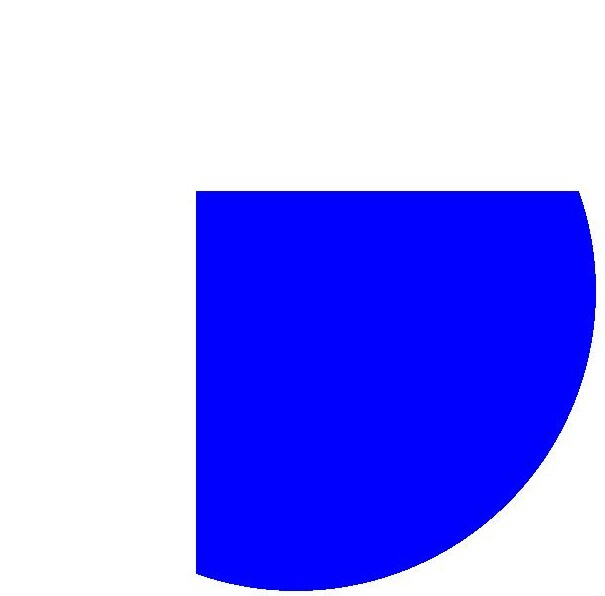
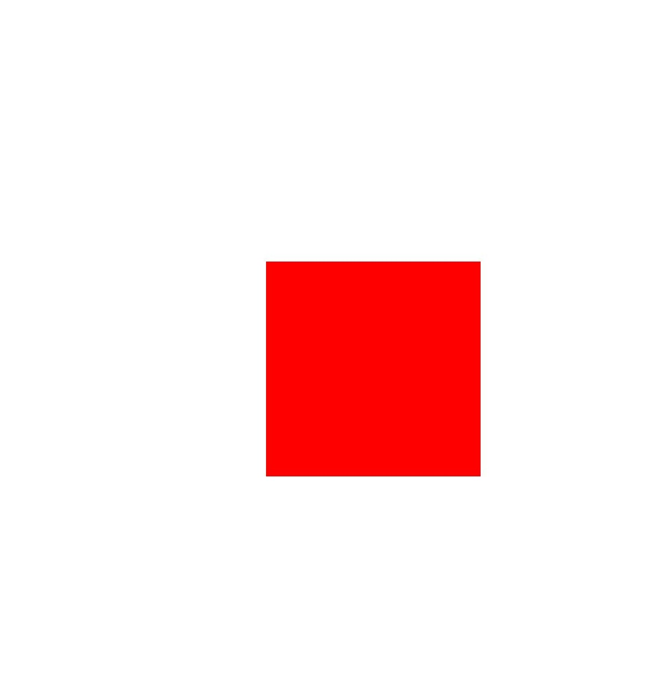
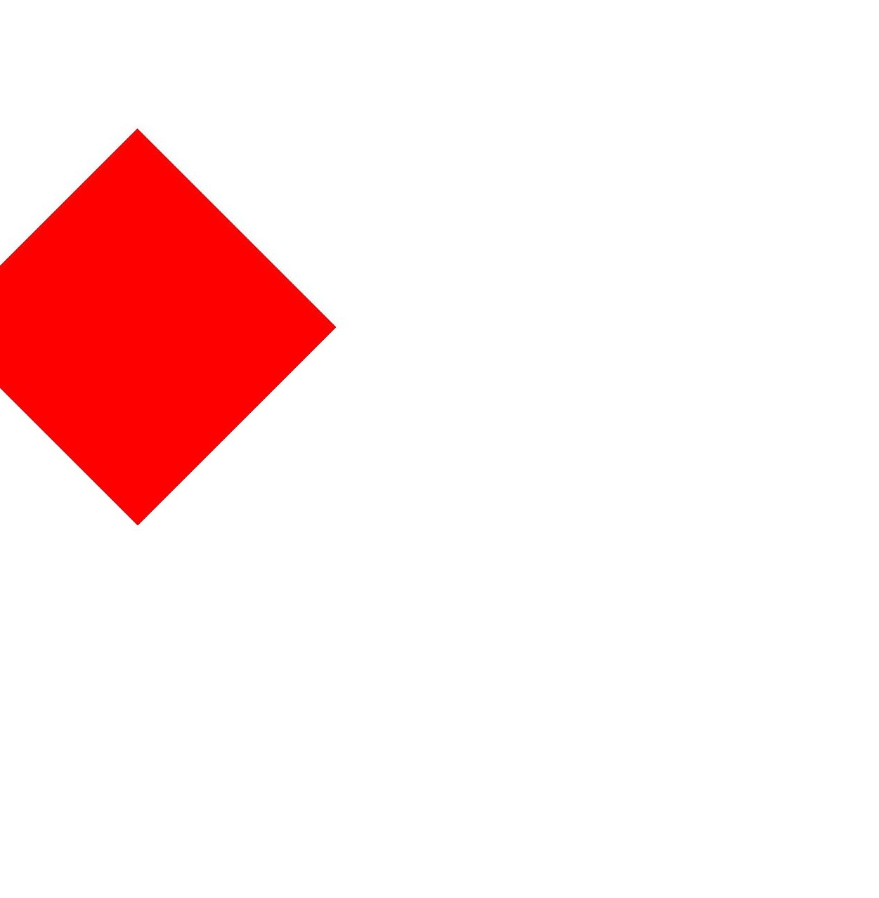
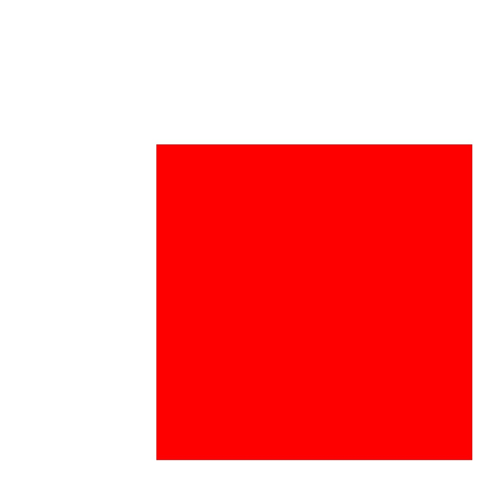

# Canvas Operations and State Processing (ArkTS)

<!--Kit: ArkGraphics 2D-->
<!--Subsystem: Graphics-->
<!--Owner: @hangmengxin-->
<!--Designer: @wangyanglan-->
<!--Tester: @nobuggers-->
<!--Adviser: @ge-yafang-->

## Overview

After creating or obtaining a canvas, you can perform graphics operations and status processing based on the canvas. Canvas operations are optional. You can perform canvas operations as required. You need to perform canvas operations before drawing. Only in this way, the canvas operations take effect.

The common canvas operations are as follows:

- Clipping

- Matrix transformation, such as translation, scaling, and rotation

- Status saving and restoration

For details about more canvas operations and API parameters, see [drawing.Canvas](../reference/apis-arkgraphics2d/arkts-apis-graphics-drawing-Canvas.md).


## Clipping

Clipping is a common operation in graphics processing. It is used to restrict the drawing area on the canvas. The effect is achieved only after the clipping operation is performed before drawing.

The following clipping operations are supported:

- Clipping a rectangle

- Clipping a rounded rectangle

- Clipping a custom path

- Clipping an area


### Available APIs

The following table lists the APIs commonly used for clipping. For details about the APIs and parameters, see [drawing.Canvas](../reference/apis-arkgraphics2d/arkts-apis-graphics-drawing-Canvas.md).


| API| Description|
| -------- | -------- |
| clipRect(rect: common2D.Rect, clipOp?: ClipOp, doAntiAlias?: boolean): void | Clips a rectangle.|
| clipRoundRect(roundRect: RoundRect, clipOp?: ClipOp, doAntiAlias?: boolean): void | Clips a rounded rectangle.|
| clipPath(path: Path, clipOp?: ClipOp, doAntiAlias?: boolean): void | Clips a path.|
| clipRegion(region: Region, clipOp?: ClipOp): void | Clips a rectangle.|


### How to Develop

The following uses the rectangle clipping on the canvas as an example to describe the example and effect. The logic of other clipping operations is similar. You only need to call the corresponding API and ensure that the data type to be clipped is correct. For details about the usage and parameters, see [drawing.Canvas](../reference/apis-arkgraphics2d/arkts-apis-graphics-drawing-Canvas.md).

Use the clipRect() API to clip a rectangle. There are three input parameters:


- rect indicates the rectangle to be clipped.

- clipOp indicates the clipping mode, including INTERSECT and DIFFERENCE. For details, see [ClipOp](../reference/apis-arkgraphics2d/arkts-apis-graphics-drawing-e.md#clipop12).

- doAntiAlias indicates whether to enable anti-aliasing. If the value is true, the anti-aliasing function is enabled. When a graphic is drawn, the edge pixels of the graphic are blurred in a semi-transparent manner. If the value is false, the anti-aliasing function is disabled.


<!-- @[arkts_graphics_draw_canvas_clip](https://gitcode.com/openharmony/applications_app_samples/blob/master/code/DocsSample/ArkGraphics2D/Drawing/ArkTSGraphicsDraw/entry/src/main/ets/drawing/pages/CanvasOperationState.ets) -->

``` TypeScript
// Create a brush.
let brush = new drawing.Brush();
// Set the color to blue.
brush.setColor(0xFF, 0x00,  0x00, 0xFF);
// Set the brush filling effect.
canvas.attachBrush(brush);
// Create a rectangle object.
let rect: common2D.Rect = { left: VALUE_200, top: VALUE_200, right: VALUE_600, bottom: VALUE_600 };
// Clip the rectangle.
canvas.clipRect(rect);
// Draw a circle.
canvas.drawCircle(VALUE_300, VALUE_300, VALUE_300);
// Remove the filling effect.
canvas.detachBrush();
```


| Original image| Image after cropping|
| -------- | -------- |
|  |  |


## Matrix Transformation

Matrix transformation is a common canvas operation. It is a coordinate system transformation used to change the shape of a graphic.

The following matrix transformations are supported:

- Translation

- Scaling

- Rotate


### Available APIs

The following table lists the APIs commonly used for matrix transformation. For details about the APIs and parameters, see [drawing.Canvas](../reference/apis-arkgraphics2d/arkts-apis-graphics-drawing-Canvas.md).

| API| Description|
| -------- | -------- |
| translate(dx: number, dy: number): void | Translates a canvas by a given distance.|
| scale(sx: number, sy: number): void | Scales a canvas.|
| rotate(degrees: number, sx: number, sy: number): void | Rotates a canvas by a given angle. A positive value indicates a clockwise rotation, and a negative value indicates a counterclockwise rotation.|
| skew(sx: number, sy: number) : void | Skews a canvas in both the horizontal and vertical directions.|


### Translation

Use the translate() API to translate the canvas. The API accepts two parameters, which are the translation amounts in the horizontal and vertical directions, respectively. The unit is px.

A simple example and a schematic diagram are as follows:


<!-- @[arkts_graphics_draw_canvas_translation](https://gitcode.com/openharmony/applications_app_samples/blob/master/code/DocsSample/ArkGraphics2D/Drawing/ArkTSGraphicsDraw/entry/src/main/ets/drawing/pages/CanvasOperationState.ets) -->

``` TypeScript
// Create a brush.
let brush = new drawing.Brush();
// Set the color to red.
brush.setColor(0xFF, 0xFF, 0x00, 0x00);
// Set the brush filling effect.
canvas.attachBrush(brush);
// Translate the canvas.
canvas.translate(VALUE_300, VALUE_300);
// Draw a rectangle.
canvas.drawRect({ left: VALUE_200, top: VALUE_200, right: VALUE_600, bottom: VALUE_600 });
// Remove the filling effect.
canvas.detachBrush();
```


| Original image| Rotated image|
| -------- | -------- |
|  |  |


### Rotate

Use the rotate() API to rotate the canvas. The API accepts three parameters, which are the rotation angle, x-coordinate of the rotation center, and y-coordinate of the rotation center.


The following is a simple example and a diagram:


<!-- @[arkts_graphics_draw_canvas_rotation](https://gitcode.com/openharmony/applications_app_samples/blob/master/code/DocsSample/ArkGraphics2D/Drawing/ArkTSGraphicsDraw/entry/src/main/ets/drawing/pages/CanvasOperationState.ets) -->

``` TypeScript
// Create a brush.
let brush = new drawing.Brush();
// Set the color to red.
brush.setColor(0xFF, 0xFF, 0x00, 0x00);
// Set the brush filling effect.
canvas.attachBrush(brush);
// Rotate the canvas clockwise by 45 degrees.
canvas.rotate(45, VALUE_200, VALUE_200);
// Draw a rectangle.
canvas.drawRect({ left: VALUE_200, top: VALUE_200, right: VALUE_600, bottom: VALUE_600 });
// Remove the filling effect.
canvas.detachBrush();
```


| Original image| Rotated image|
| -------- | -------- |
|  |  |


### Scaling

Use the scale() API to scale the canvas. The API accepts two parameters, which are the scaling factors along the x-axis and y-axis, respectively.


The following is a simple example and a schematic diagram:


<!-- @[arkts_graphics_draw_canvas_scale](https://gitcode.com/openharmony/applications_app_samples/blob/master/code/DocsSample/ArkGraphics2D/Drawing/ArkTSGraphicsDraw/entry/src/main/ets/drawing/pages/CanvasOperationState.ets) -->

``` TypeScript
// Create a brush.
let brush = new drawing.Brush();
// Set the color to red.
brush.setColor({ alpha: 0xFF, red: 0xFF, green: 0x00, blue: 0x00 });
// Set the brush filling effect.
canvas.attachBrush(brush);
// Perform the zoom-in operation.
canvas.scale(2, 2);
// Draw a rectangle.
canvas.drawRect({ left: VALUE_200, top: VALUE_200, right: VALUE_600, bottom: VALUE_600 });
// Remove the filling effect.
canvas.detachBrush();
```


| Original image| Image after scaling|
| -------- | -------- |
|  |  |


## Saving and Restoring the Canvas Status


The save operation is used to save the current canvas status to the top of the stack. The restore operation is used to restore the canvas status saved at the top of the stack. Once the restore operation is performed, a series of operations such as translation, scaling, and cropping between the save and restore operations are cleared.


### Available APIs

The following table lists the APIs used for saving and restoring the canvas status. For details about the usage and parameters, see [canvas](../reference/apis-arkgraphics2d/arkts-apis-graphics-drawing-Canvas.md).

| API| Description|
| -------- | -------- |
| save(): void | Saves the current canvas status (canvas matrix) to the top of the stack.|
| restore(): void | Restores the canvas status (canvas matrix) saved on the top of the stack.|
| restoreToCount(count: number): void | Restores to a given number of canvas statuses (canvas matrices).|

The following is a simple example and diagram:


<!-- @[arkts_graphics_draw_canvas_state_operation](https://gitcode.com/openharmony/applications_app_samples/blob/master/code/DocsSample/ArkGraphics2D/Drawing/ArkTSGraphicsDraw/entry/src/main/ets/drawing/pages/CanvasOperationState.ets) -->

``` TypeScript
// Create a pen.
let pen = new drawing.Pen();
// Set the color to red.
pen.setColor({ alpha: 0xFF, red: 0xFF, green: 0x00, blue: 0x00 });
// Set the stroke width to 20 px.
pen.setStrokeWidth(20);
// Set the stroke effect of the paint brush.
canvas.attachPen(pen);
// Save the current canvas status. Currently, there is no zoom-in or zoom-out operation. The original status is saved.
canvas.save();
// Zoom in on the x-axis and y-axis by two times.
canvas.scale(2, 2);
// Draw a circle. Because the zoom-in operation has been performed, a large circle is drawn.
canvas.drawCircle(VALUE_300, VALUE_300, VALUE_200);
// Restore the canvas status to the original status without zoom-in or zoom-out.
canvas.restore();
// Draw a circle. Because the canvas status has been restored to the original status without zoom-in or zoom-out, a small circle is drawn.
canvas.drawCircle(VALUE_300, VALUE_300, VALUE_200);
// Remove the stroke effect.
canvas.detachPen();
```


<!--RP1-->
## Samples

The following samples are available for you to develop Drawing (ArkTS) applications:

- [ArkTSGraphicsDraw (API20)](https://gitcode.com/openharmony/applications_app_samples/tree/master/code/DocsSample/ArkGraphics2D/Drawing/ArkTSGraphicsDraw)
<!--RP1End-->
