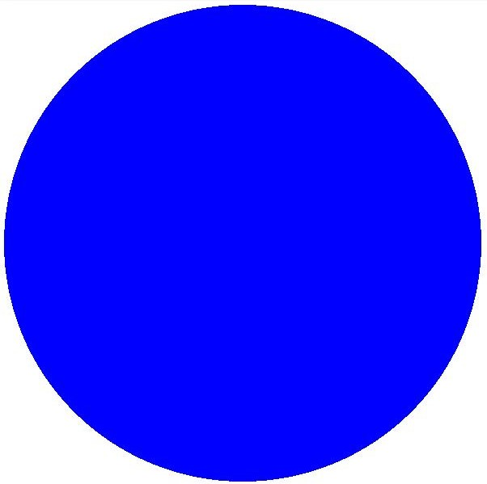
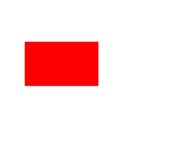
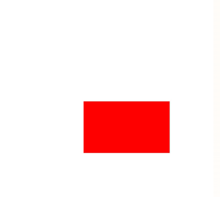
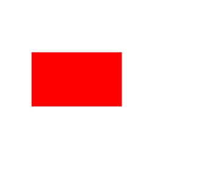
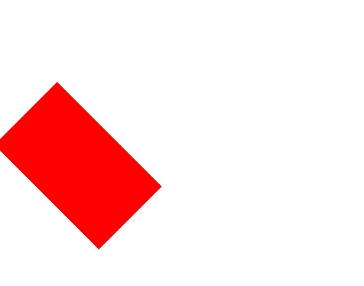
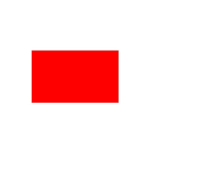
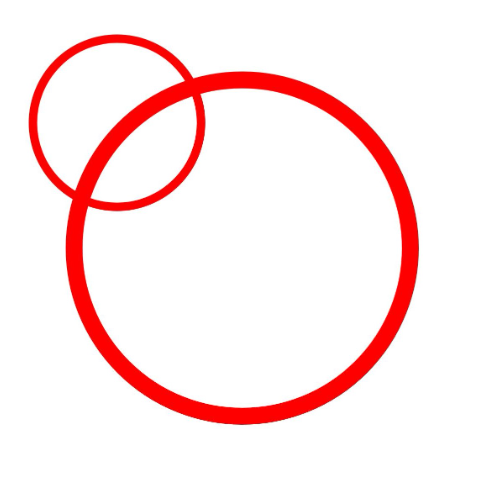

# Canvas Operations and State Processing (C/C++)

<!--Kit: ArkGraphics 2D-->
<!--Subsystem: Graphics-->
<!--Owner: @hangmengxin-->
<!--Designer: @wangyanglan-->
<!--Tester: @nobuggers-->
<!--Adviser: @ge-yafang-->

## Overview

After creating or obtaining a canvas, you can perform graphics operations and status processing based on the canvas. Canvas operations are optional. You can perform canvas operations as required. You need to perform canvas operations before drawing. Only in this way, the canvas operations take effect.

Common canvas operations are as follows:

- Clipping

- Matrix transformation, such as translation, scaling, and rotation

- Status saving and restoration


## Clipping

Clipping is a common operation in graphics processing. It is used to restrict the drawing area and draw only in the specified area. The effect is achieved only after the clipping operation is performed before drawing.

Currently, the following clipping operations are supported:

- Clipping a rectangle

- Clipping a rounded rectangle

- Clipping a custom path

- Clipping an area


### Available APIs

The following table lists the common APIs for clipping operations. For details about the usage and parameters, see [drawing_canvas.h](../reference/apis-arkgraphics2d/capi-drawing-canvas-h.md).

| API| Description|
| -------- | -------- |
| void OH_Drawing_CanvasClipRect (OH_Drawing_Canvas \*, const OH_Drawing_Rect \*, OH_Drawing_CanvasClipOp clipOp, bool doAntiAlias) | Clips a rectangle.|
| void OH_Drawing_CanvasClipRoundRect (OH_Drawing_Canvas \*, const OH_Drawing_RoundRect \*, OH_Drawing_CanvasClipOp clipOp, bool doAntiAlias) | Clips a rounded rectangle.|
| void OH_Drawing_CanvasClipPath (OH_Drawing_Canvas \*, const OH_Drawing_Path \*, OH_Drawing_CanvasClipOp clipOp, bool doAntiAlias) | Clips a path.|
| OH_Drawing_ErrorCode OH_Drawing_CanvasClipRegion (OH_Drawing_Canvas \*canvas, const OH_Drawing_Region \*region, OH_Drawing_CanvasClipOp clipOp) | Clips a rectangle.|


### How to Develop

The following uses a rectangle as an example to describe how to crop a rectangle on the canvas. The logic of other cropping operations is similar. You only need to call the corresponding API and ensure that the data type to be cropped is correct. For details about the usage and parameters, see [drawing_canvas.h](../reference/apis-arkgraphics2d/capi-drawing-canvas-h.md).

Use the OH_Drawing_CanvasClipRect API to crop a rectangle. There are four input parameters:
- The first parameter is the canvas. The cropping operation is performed on the canvas. Ensure that the canvas has been created or obtained. For details, see [Obtaining a Canvas and Displaying the Drawing Result (C/C++)](canvas-get-result-draw-c.md).

- The second parameter is the rectangle to be cropped.

- The third parameter is the cropping operation type, including INTERSECT and DIFFERENCE.

- The fourth parameter indicates whether anti-aliasing is required.

```c++
// sample_graphics.cpp
// Create a brush object.
OH_Drawing_Brush *brush = OH_Drawing_BrushCreate();
// Set the brush fill color to blue.
OH_Drawing_BrushSetColor(brush, 0xff0000ff);
// Set the brush on the canvas.
OH_Drawing_CanvasAttachBrush(canvas, brush);
OH_Drawing_Rect *rect = OH_Drawing_RectCreate(400, 400, 1200, 1200);
// Crop the rectangle.
OH_Drawing_CanvasClipRect(canvas, rect, OH_Drawing_CanvasClipOp::INTERSECT, true);
OH_Drawing_Point *point = OH_Drawing_PointCreate(600, 600);
//Draw a circle.
OH_Drawing_CanvasDrawCircle(canvas, point, 600);
//Remove the brush from the canvas.
OH_Drawing_CanvasDetachBrush(canvas);
//Destroy the brush object and reclaim the memory occupied by the brush object.
OH_Drawing_BrushDestroy(brush);
```
<!-- [ndk_graphics_draw_canvas_clip](https://gitcode.com/openharmony/applications_app_samples/blob/master/code/DocsSample/Drawing/NDKGraphicsDraw/entry/src/main/cpp/samples/sample_graphics.cpp) -->

| Original image| Cropped image|
| -------- | -------- |
|  |  |


## Matrix Transformation

Matrix transformation is a common canvas operation. It is a coordinate system transformation and is used to change the graphics.

Currently, the following matrix transformations are supported:

- Translation

- Scaling

- Rotate


### Available APIs

The following table lists the APIs commonly used for matrix transformation. For details about the APIs and parameters, see [drawing_matrix.h](../reference/apis-arkgraphics2d/capi-drawing-matrix-h.md).

| API| Description|
| -------- | -------- |
| void OH_Drawing_CanvasTranslate (OH_Drawing_Canvas \*, float dx, float dy) | Translates a canvas by a given distance.|
| void OH_Drawing_CanvasScale (OH_Drawing_Canvas \*, float sx, float sy) | Scales a canvas.|
| void OH_Drawing_CanvasRotate (OH_Drawing_Canvas \*, float degrees, float px, float py) | Rotates a canvas by a given angle. A positive value indicates a clockwise rotation, and a negative value indicates a counterclockwise rotation.|
| void OH_Drawing_CanvasSkew (OH_Drawing_Canvas \*, float sx, float sy) | Skews a canvas. This function premultiplies the current canvas matrix by a skew transformation matrix and applies the resulting matrix to the canvas. The skew transformation matrix is as follows: \|1 sx 0\| \|sy 1 0\| \|0 0 1\|.|


### Translation

Use the OH_Drawing_MatrixCreateTranslation() API to translate the canvas. The API accepts two parameters, which are the translation amounts in the horizontal and vertical directions, respectively. The unit is px.

The following figure shows a simple example.

```c++
// sample_graphics.cpp
// Create a brush object.
OH_Drawing_Brush* brush = OH_Drawing_BrushCreate();
// Set the fill color.
OH_Drawing_BrushSetColor(brush, OH_Drawing_ColorSetArgb(0xFF, 0xFF, 0x00, 0x00));
// Set the brush on the canvas.
OH_Drawing_CanvasAttachBrush(canvas, brush);
// Create a matrix object that translates 300 px in the horizontal and vertical directions.
OH_Drawing_Matrix *matrix = OH_Drawing_MatrixCreateTranslation(300, 300);
// Apply the matrix transformation to the canvas.
OH_Drawing_CanvasConcatMatrix(canvas, matrix);
// Draw a rectangle.
OH_Drawing_Rect *rect = OH_Drawing_RectCreate(200, 300, 700, 600);
OH_Drawing_CanvasDrawRect(canvas, rect);
// Remove the brush from the canvas.
OH_Drawing_CanvasDetachBrush(canvas);
OH_Drawing_RectDestroy(rect);
OH_Drawing_MatrixDestroy(matrix);
```
<!-- [ndk_graphics_draw_canvas_translation](https://gitcode.com/openharmony/applications_app_samples/blob/master/code/DocsSample/Drawing/NDKGraphicsDraw/entry/src/main/cpp/samples/sample_graphics.cpp) -->

| Original image| Image after translation|
| -------- | -------- |
| | |


### Rotate

Use the OH_Drawing_MatrixCreateRotation() API to rotate the canvas. The API accepts three parameters, which are the rotation angle, and the x and y coordinates of the rotation center.

The following figure shows a simple example.

```c++
// sample_graphics.cpp
// Create a brush object.
OH_Drawing_Brush* brush = OH_Drawing_BrushCreate();
// Set the fill color.
OH_Drawing_BrushSetColor(brush, OH_Drawing_ColorSetArgb(0xFF, 0xFF, 0x00, 0x00));
// Set the brush on the canvas.
OH_Drawing_CanvasAttachBrush(canvas, brush);
// Create a rotation matrix object. The three parameters are the rotation angle and the coordinates of the rotation center.
OH_Drawing_Matrix* matrix = OH_Drawing_MatrixCreateRotation(45, 200, 300);
// Perform matrix transformation on the canvas.
OH_Drawing_CanvasConcatMatrix(canvas, matrix);
// Draw a rectangle.
OH_Drawing_Rect *rect = OH_Drawing_RectCreate(200, 300, 700, 600);
OH_Drawing_CanvasDrawRect(canvas, rect);
// Remove the brush from the canvas.
OH_Drawing_CanvasDetachBrush(canvas);
OH_Drawing_RectDestroy(rect);
OH_Drawing_MatrixDestroy(matrix);
```
<!-- [ndk_graphics_draw_canvas_rotation](https://gitcode.com/openharmony/applications_app_samples/blob/master/code/DocsSample/Drawing/NDKGraphicsDraw/entry/src/main/cpp/samples/sample_graphics.cpp) -->

| Original image| Rotated image|
| -------- | -------- |
| | |


### Scaling

Use the OH_Drawing_MatrixCreateScale() API to scale the canvas. The API accepts four parameters, which are the scaling factors along the x and y axes, and the x and y coordinates of the rotation center.

The following figure shows a simple example.

```c++
// sample_graphics.cpp
// Create a brush object.
OH_Drawing_Brush* brush = OH_Drawing_BrushCreate();
// Set the fill color.
OH_Drawing_BrushSetColor(brush, OH_Drawing_ColorSetArgb(0xFF, 0xFF, 0x00, 0x00));
// Set the brush on the canvas.
OH_Drawing_CanvasAttachBrush(canvas, brush);
//Create a scaling matrix object. The four parameters are the coordinates of the rotation center and the scaling factors in the horizontal and vertical directions.
OH_Drawing_Matrix* matrix = OH_Drawing_MatrixCreateScale(2, 2, 200, 300);
//Perform matrix transformation on the canvas.
OH_Drawing_CanvasConcatMatrix(canvas, matrix);
// Draw a rectangle.
OH_Drawing_Rect *rect = OH_Drawing_RectCreate(200, 300, 700, 600);
OH_Drawing_CanvasDrawRect(canvas, rect);
// Remove the brush from the canvas.
OH_Drawing_CanvasDetachBrush(canvas);
OH_Drawing_RectDestroy(rect);
```
<!-- [ndk_graphics_draw_canvas_scale](https://gitcode.com/openharmony/applications_app_samples/blob/master/code/DocsSample/Drawing/NDKGraphicsDraw/entry/src/main/cpp/samples/sample_graphics.cpp) -->

| Original image| Image after zooming in|
| -------- | -------- |
| | |


## Saving and Restoring the Canvas Status

The save operation is used to save the current canvas status to the top of the stack. The restore operation is used to restore the canvas status saved at the top of the stack. Once the restore operation is performed, a series of operations such as translation, scaling, and clipping between the save and restore operations are cleared.


### Available APIs

The following table lists the APIs used for saving and restoring the canvas status. For details about the APIs and parameters, see [drawing_canvas.h](../reference/apis-arkgraphics2d/capi-drawing-canvas-h.md).

| API| Description|
| -------- | -------- |
| void OH_Drawing_CanvasSave (OH_Drawing_Canvas \*) | Saves the current canvas status (canvas matrix) to the top of the stack.|
| void OH_Drawing_CanvasRestore (OH_Drawing_Canvas \*) | Restores the canvas status (canvas matrix) saved on the top of the stack.|
| void OH_Drawing_CanvasRestoreToCount (OH_Drawing_Canvas \*, uint32_t saveCount) | Restores to a given number of canvas statuses (canvas matrices).|


### How to Develop

```c++
// sample_graphics.cpp
// Create a paint object.
OH_Drawing_Pen* pen = OH_Drawing_PenCreate();
// Set the stroke color of the paint.
OH_Drawing_PenSetColor(pen, OH_Drawing_ColorSetArgb(0xFF, 0xFF, 0x00, 0x00));
// Set the stroke width to 20.
OH_Drawing_PenSetWidth(pen, 20);
// Set the paint on the canvas.
OH_Drawing_CanvasAttachPen(canvas, pen);
// Save the current canvas status. No zoom-in or zoom-out operation is performed. The original status is saved.
OH_Drawing_CanvasSave(canvas);
OH_Drawing_Matrix *matrix = OH_Drawing_MatrixCreateScale(2, 2, 2, 2);
// Zoom in on the canvas.
OH_Drawing_CanvasConcatMatrix(canvas, matrix);
OH_Drawing_Point* point = OH_Drawing_PointCreate(300, 300);
// Draw a circle. Because the zoom-in operation has been performed, a large circle is drawn.
OH_Drawing_CanvasDrawCircle(canvas, point, 200);
// Restore the canvas to the original status.
OH_Drawing_CanvasRestore(canvas);
// Draw a circle. Because the canvas has been restored to the original status, a small circle is drawn.
OH_Drawing_CanvasDrawCircle(canvas, point, 200);
// Remove the paint from the canvas.
OH_Drawing_CanvasDetachPen(canvas);
// Destroy the paint object and reclaim the memory.
OH_Drawing_PenDestroy(pen);
OH_Drawing_PointDestroy(point);
OH_Drawing_MatrixDestroy(matrix);
```
<!-- [ndk_graphics_draw_canvas_state_operation](https://gitcode.com/openharmony/applications_app_samples/blob/master/code/DocsSample/Drawing/NDKGraphicsDraw/entry/src/main/cpp/samples/sample_graphics.cpp) -->



<!--RP1-->
## Samples

The following table lists the examples for developing Drawing (C/C++).

- [NDKGraphicsDraw (API14)](https://gitcode.com/openharmony/applications_app_samples/tree/master/code/DocsSample/Drawing/NDKGraphicsDraw)
<!--RP1End-->
