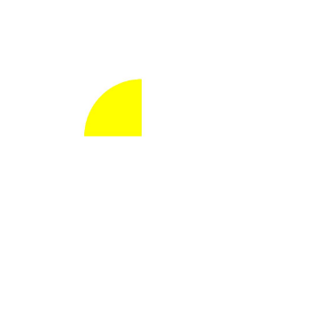
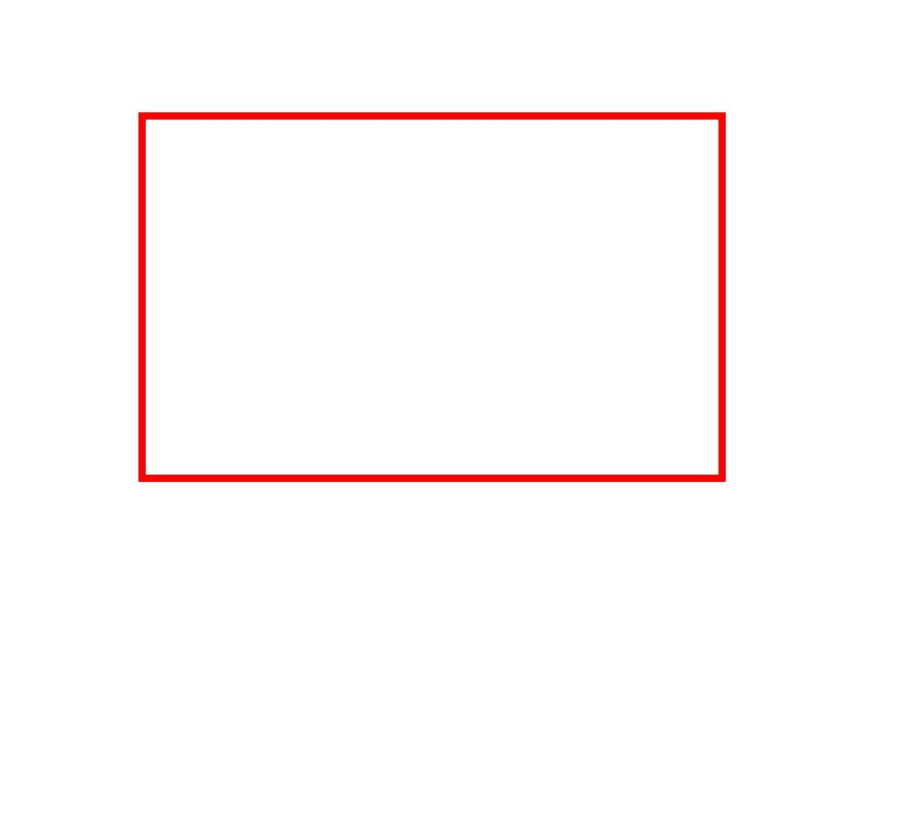
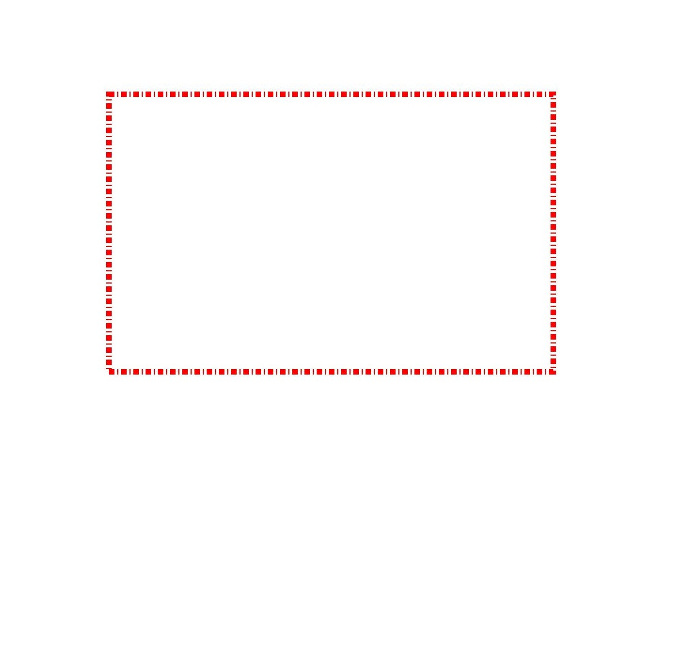
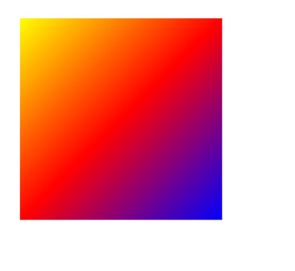
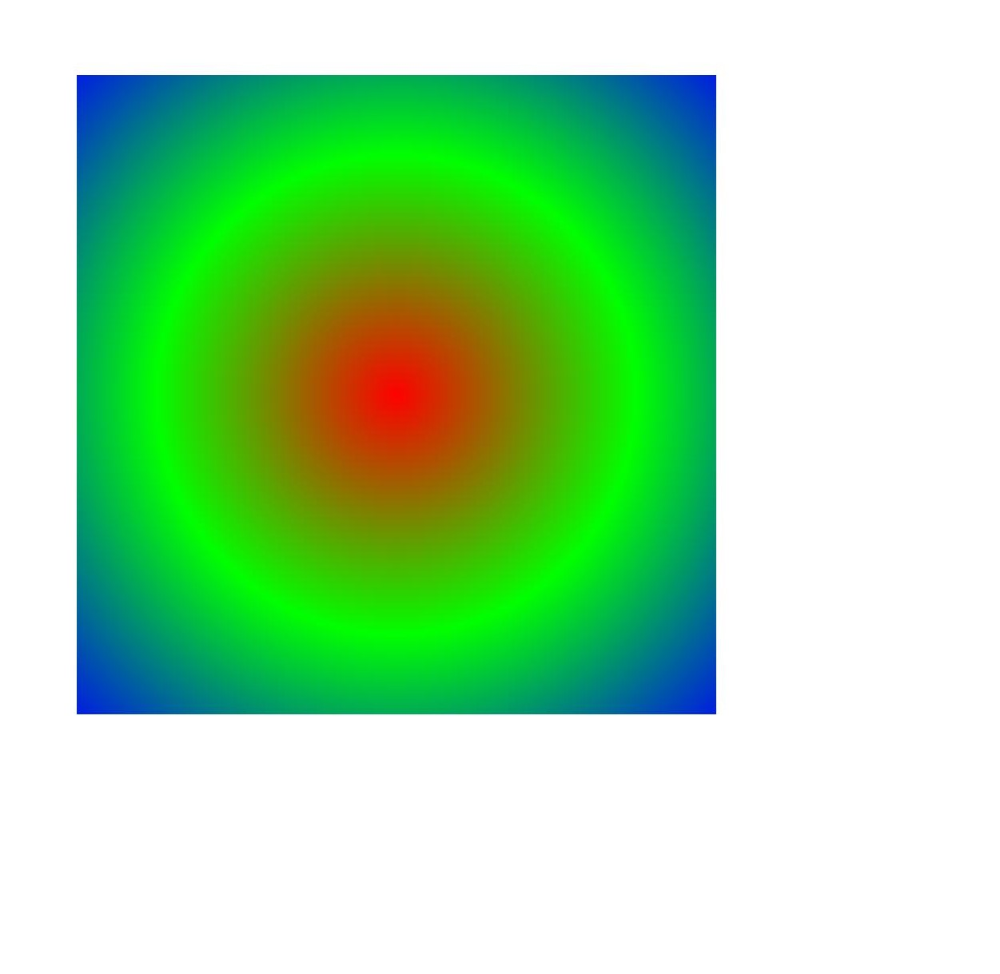
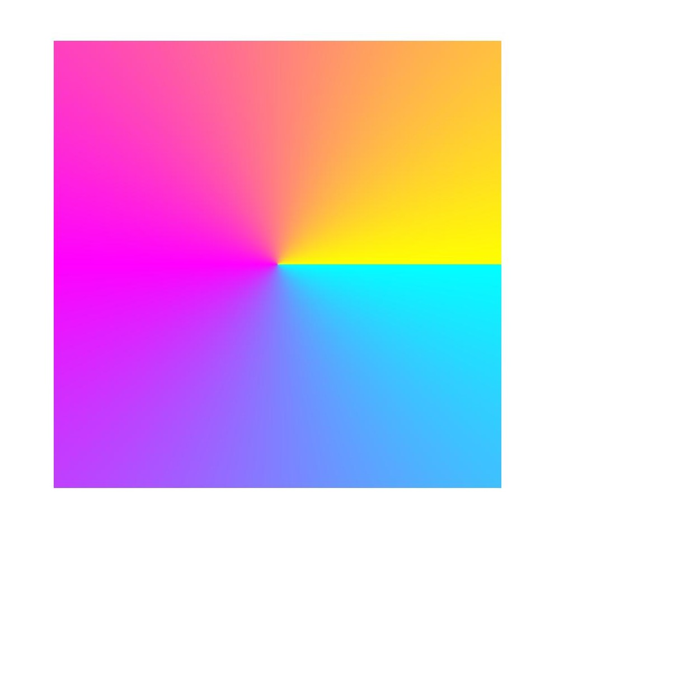
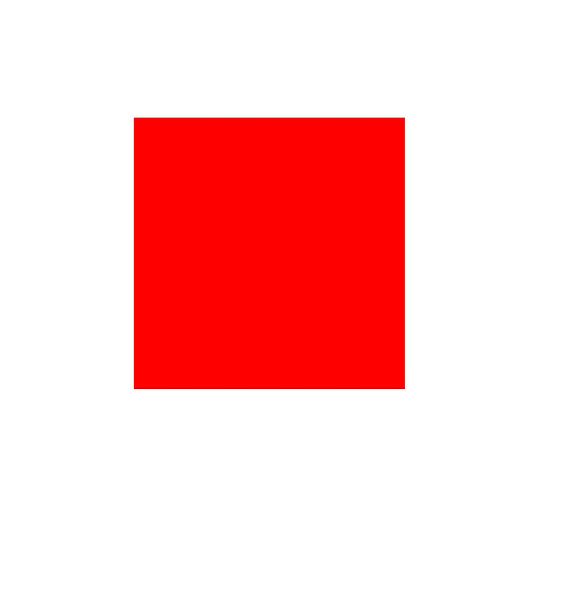
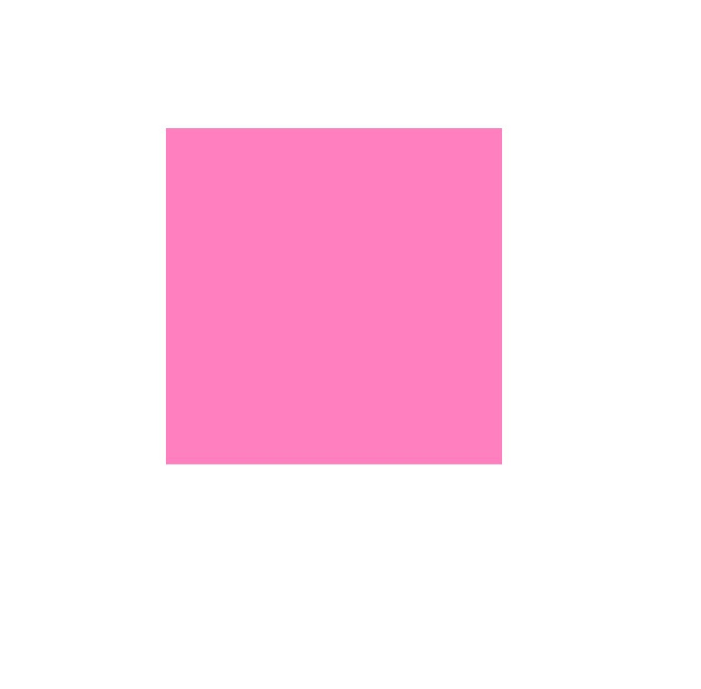
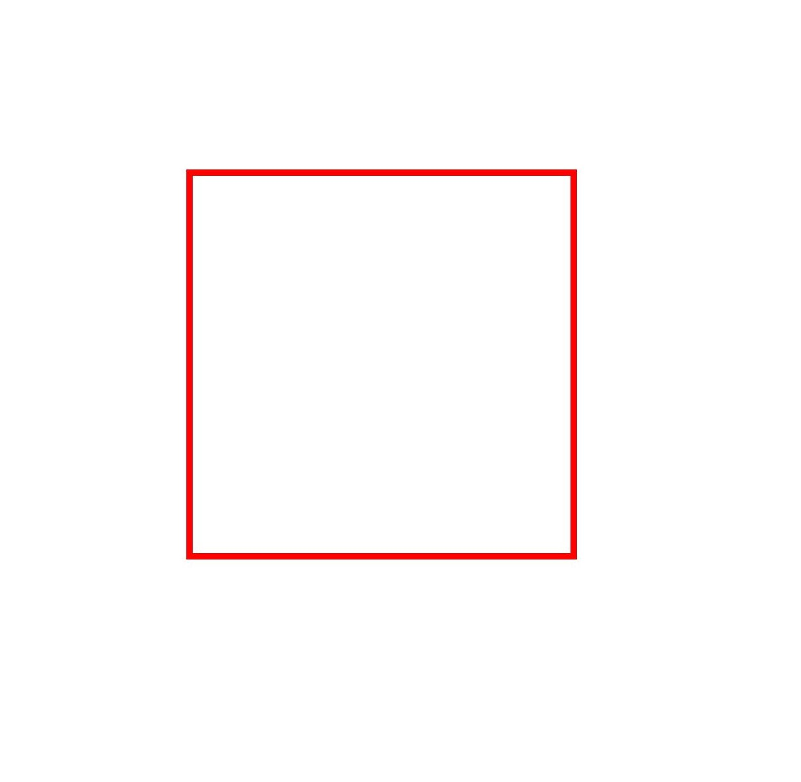
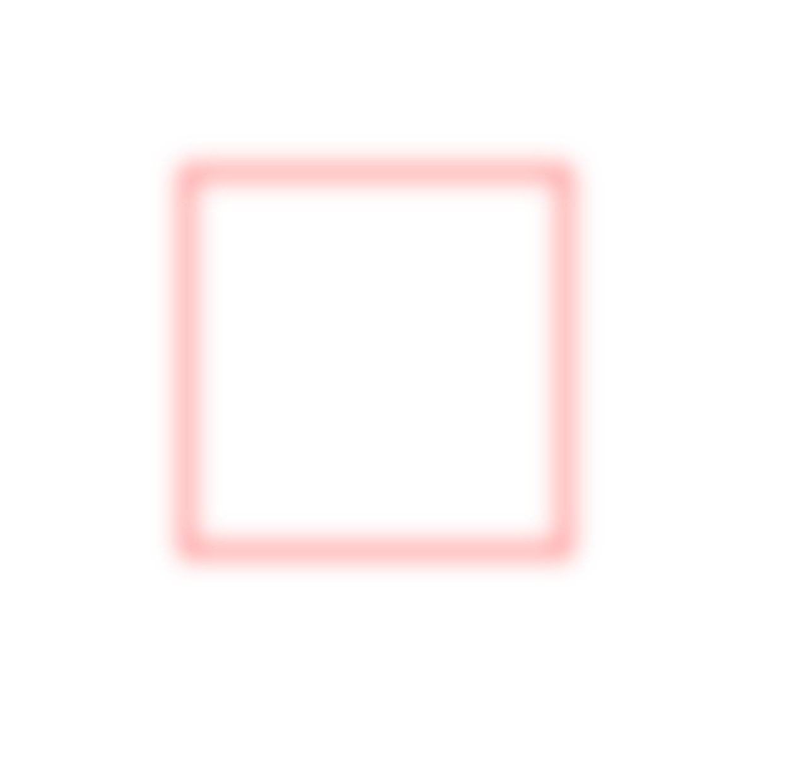

# Complex Drawing Effects (ArkTS)

<!--Kit: ArkGraphics 2D-->
<!--Subsystem: Graphics-->
<!--Owner: @hangmengxin-->
<!--Designer: @wangyanglan-->
<!--Tester: @nobuggers-->
<!--Adviser: @ge-yafang-->

You can use a brush or a pen to implement complex drawing effects in addition to the basic fill color, stroke color, and style settings. For example:


- Blend mode

- Path effect, such as dashed lines

- Shader effect, such as linear gradient and radial gradient

- Filtering effect, such as blurring


## Blend Mode

The blend mode can be used for brushes or pens. It defines how to combine source pixels (content to be drawn) with target pixels (content that already exists on the canvas).

You can use the **setBlendMode()** API to apply the blend mode to the brush or pen. This API requires the **BlendMode** parameter, that is, the type of the blend mode. For details, see [BlendMode](../reference/apis-arkgraphics2d/arkts-apis-graphics-drawing-e.md#blendmode).

The following shows the sample code and effect:

<!-- @[arkts_graphics_draw_import_ui_and_graphics2d](https://gitcode.com/openharmony/applications_app_samples/blob/master/code/DocsSample/ArkGraphics2D/Drawing/ArkTSGraphicsDraw/entry/src/main/ets/drawing/pages/ComplexEffect.ets) -->

``` TypeScript
import { DrawContext, FrameNode, NodeController, RenderNode, UIContext } from '@kit.ArkUI';
import { common2D, drawing } from '@kit.ArkGraphics2D';
```

<!-- @[arkts_graphics_draw_render_node](https://gitcode.com/openharmony/applications_app_samples/blob/master/code/DocsSample/ArkGraphics2D/Drawing/ArkTSGraphicsDraw/entry/src/main/ets/drawing/pages/ComplexEffect.ets) -->

``` TypeScript
function drawRenderNode(canvas: drawing.Canvas) {
  canvas.saveLayer(null, null);
  const brushCircle = new drawing.Brush();
  const colorCircle: common2D.Color = {alpha: 255, red: 0, green: 0, blue: 255};
  brushCircle.setColor(colorCircle);
  canvas.attachBrush(brushCircle);
  canvas.drawCircle(500, 500, 200);
  const brush = new drawing.Brush();
  // Set the blend mode.
  brush.setBlendMode(drawing.BlendMode.SRC_IN);
  canvas.saveLayer(null, brush);

  const brushRect = new drawing.Brush();
  const colorRect: common2D.Color = {alpha: 255, red: 255, green: 255, blue: 0};
  brushRect.setColor(colorRect);
  canvas.attachBrush(brushRect);
  const rect: common2D.Rect = {left:100, top:100, right:500, bottom:500};
  canvas.drawRect(rect);
  canvas.restore();
  canvas.restore();
  canvas.detachBrush();
}
```




## Path Effect

The path effect, such as dashed lines, is available only for the pen.

You can use the **createDashPathEffect()** API to set the path effect. The API takes two parameters, which are as follows:

- Float array **intervals**: indicates the interval between dashed lines or dotted lines.

- Float **phase**: indicates the offset in the intervals array, that is, the position from which the dashed line or dotted line effect is applied.

The following uses the dashed line path effect of a rectangle as an example. The sample code and effect are as follows:

<!-- @[arkts_graphics_draw_path_effect](https://gitcode.com/openharmony/applications_app_samples/blob/master/code/DocsSample/ArkGraphics2D/Drawing/ArkTSGraphicsDraw/entry/src/main/ets/drawing/pages/ComplexEffect.ets) -->

``` TypeScript
// Create a pen object.
let pen = new drawing.Pen();
// Set the stroke width.
pen.setStrokeWidth(10.0);
// Set the color.
pen.setColor(0xFF, 0xFF, 0x00, 0x00);
// The effect is a cyclic repetition of a 10 px solid line, a 5 px interval, a 2 px solid line, and a 5 px interval.
let intervals = [10, 5, 2, 5];
// Set the dashed line path effect.
let effect = drawing.PathEffect.createDashPathEffect(intervals, 0);
pen.setPathEffect(effect);
// Set the stroke effect of the pen.
canvas.attachPen(pen);
// Create a rectangle.
let rect: common2D.Rect = {
  left: VALUE_200,
  top: VALUE_200,
  right: VALUE_1000,
  bottom: VALUE_700
};
// Draw a rectangle.
canvas.drawRect(rect);
// Remove the stroke effect.
canvas.detachPen();
```

| Original Image| Dashed Line Effect|
| -------- | -------- |
|  |  |


## Shader Effect

The shader effect is implemented based on the brush or pen. You can use the **setShaderEffect()** API to set the shader effect of the brush or pen. Currently, different shader effects are supported, such as linear gradient, radial gradient, and sector gradient.


For details about shader-related APIs and parameters, see [ShaderEffect](../reference/apis-arkgraphics2d/arkts-apis-graphics-drawing-ShaderEffect.md).


### Linear Gradient Shader Effect

You can use the **createLinearGradient()** API to create the linear gradient shader effect to be set. The API takes six parameters, which are the start point, end point, color array, tiling mode, relative position array, and matrix object.

- The start point and end point are used to determine the gradient direction.

- The color array is used to store the colors used in the gradient.

- The relative position array is used to determine the relative position of each color in the gradient. If the relative position is empty, the colors are evenly distributed between the start point and end point.

- Matrix object, which is used to perform matrix transformation on the shader. The default value is **null**, indicating the unit matrix.

- The tiling mode is used to determine how to continue the gradient effect outside the gradient area. The options are as follows:
  - **CLAMP**: Replicates the edge color if the image exceeds its original boundary.
  - **REPEAT**: Repeats the image in both horizontal and vertical directions.
  - **MIRROR**: Repeats the image in both horizontal and vertical directions and alternates the mirrored image between adjacent images.
  - **DECAL**: Renders the shader effect's image only within the original boundary, and returns transparent black elsewhere.

The following uses the rectangle drawing and the linear gradient shader effect implemented by a brush as an example. The sample code and effect are as follows:

<!-- @[arkts_graphics_draw_linear_gradient](https://gitcode.com/openharmony/applications_app_samples/blob/master/code/DocsSample/ArkGraphics2D/Drawing/ArkTSGraphicsDraw/entry/src/main/ets/drawing/pages/ComplexEffect.ets) -->

``` TypeScript
let startPt: common2D.Point = { x: VALUE_100, y: VALUE_100 };
let endPt: common2D.Point = { x: VALUE_900, y: VALUE_900 };
let colors = [0xFFFFFF00, 0xFFFF0000, 0xFF0000FF];
// Create a linear gradient shader.
let shaderEffect = drawing.ShaderEffect.createLinearGradient(startPt, endPt, colors, drawing.TileMode.CLAMP);
// Create a brush object.
let brush = new drawing.Brush();
// Set the linear shader.
brush.setShaderEffect(shaderEffect);
// Set the brush fill effect.
canvas.attachBrush(brush);
let rect: common2D.Rect = {
  left: VALUE_100,
  top: VALUE_100,
  right: VALUE_900,
  bottom: VALUE_900
};
// Draw a rectangle.
canvas.drawRect(rect);
// Remove the fill effect.
canvas.detachBrush();
```




### Radial Gradient Shader Effect

You can use the **createRadialGradient()** API to create the radial gradient shader effect to be set. The API takes six parameters, which are the center point (**centerPt**), radius (**radius**), color array (**colors**), tiling mode (**TileMode**), relative position array (**pos**), and matrix object (**matrix**).

The implementation method is similar to that of the linear gradient shader. The difference is that the radial gradient starts from the center and gradually changes outward.

The following uses the rectangle drawing and the radial gradient shader effect implemented by a brush as an example. The sample code and effect are as follows:

<!-- @[arkts_graphics_draw_path_gradient](https://gitcode.com/openharmony/applications_app_samples/blob/master/code/DocsSample/ArkGraphics2D/Drawing/ArkTSGraphicsDraw/entry/src/main/ets/drawing/pages/ComplexEffect.ets) -->

``` TypeScript
let centerPt: common2D.Point = { x: VALUE_500, y: VALUE_500 };
let colors = [0xFFFF0000, 0xFF00FF00, 0xFF0000FF];
// Create a radial gradient shader.
let shaderEffect = drawing.ShaderEffect.createRadialGradient(centerPt, VALUE_600, colors, drawing.TileMode.CLAMP);
// Create a brush object.
let brush = new drawing.Brush();
// Set the radial gradient shader.
brush.setShaderEffect(shaderEffect);
// Set the brush fill effect.
canvas.attachBrush(brush);
let rect: common2D.Rect = {
  left: VALUE_100,
  top: VALUE_100,
  right: VALUE_900,
  bottom: VALUE_900
};
// Draw a rectangle.
canvas.drawRect(rect);
// Remove the fill effect.
canvas.detachBrush();
```




### Sector Gradient Shader Effect

You can use the **createSweepGradient()** API to create the sector gradient shader effect to be set. The API takes seven parameters: which are the center coordinates (**centerPt**), color array (**colors**), tiling mode (**TileMode**), start angle of the sector gradient (**startAngle**), end angle of the sector gradient (**endAngle**), relative position array (**pos**), and matrix object (**matrix**).

The implementation method is similar to that of the linear gradient shader. The difference is that the sector gradient is gradually changed during rotation around the center point.

The following uses the rectangle drawing and the sector gradient shader effect implemented by a brush as an example. The sample code and effect are as follows:

<!-- @[arkts_graphics_draw_sector_gradient](https://gitcode.com/openharmony/applications_app_samples/blob/master/code/DocsSample/ArkGraphics2D/Drawing/ArkTSGraphicsDraw/entry/src/main/ets/drawing/pages/ComplexEffect.ets) -->

``` TypeScript
let centerPt: common2D.Point = { x: VALUE_500, y: VALUE_500 };
let colors = [0xFF00FFFF, 0xFFFF00FF, 0xFFFFFF00];
// Create a sector gradient shader.
let shaderEffect = drawing.ShaderEffect.createSweepGradient(centerPt, colors, drawing.TileMode.CLAMP, 0, 360);
// Create a brush object.
let brush = new drawing.Brush();
// Set the sector gradient shader.
brush.setShaderEffect(shaderEffect);
// Set the brush fill effect.
canvas.attachBrush(brush);
let rect: common2D.Rect = {
  left: VALUE_100,
  top: VALUE_100,
  right: VALUE_900,
  bottom: VALUE_900
};
// Draw a rectangle.
canvas.drawRect(rect);
// Remove the fill effect.
canvas.detachBrush();
```




## Filter Effects

The filter effect can be implemented based on the brush or pen. Currently, different filter effects are supported, such as image filters, color filters, and mask filters.

For details about the filter-related APIs and parameters, see [ImageFilter](../reference/apis-arkgraphics2d/arkts-apis-graphics-drawing-ImageFilter.md).


### Color Filter Effects

The color filter can be implemented based on the pen or brush. For details about the color filter-related APIs and parameters, see [ColorFilter](../reference/apis-arkgraphics2d/arkts-apis-graphics-drawing-ColorFilter.md).

Currently, multiple color filters can be implemented, including:

- Color filter object with a given blend mode

- Color filter object with a given 5 x 4 color matrix

- Color filter object with the SRGB gamma curve applied to the RGB color channel

- Color filter object with the RGB color channel applied to the SRGB gamma curve

- Color filter object that multiplies the input luminance value by the transparency channel and sets the red, green, and blue channels to zero

- Color filter object composed of two color filters

The following uses the color filter with a 5 x 4 color matrix as an example.

You can use the **createMatrixColorFilter()** API to create a color filter with a 5 x 4 color matrix. The API takes one parameter, which is the color matrix. The color matrix is a floating-point array of 20 elements. The array format is as follows:

[ a0, a1, a2, a3, a4 ]

[ b0, b1, b2, b3, b4 ]

[ c0, c1, c2, c3, c4 ]

[ d0, d1, d2, d3, d4 ]

For each original pixel color value (R, G, B, A), the formula for calculating the transformed color value (R', G', B', A') is as follows:

R' = a0\*R + a1\*G + a2\*B + a3\*A + a4

G' = b0\*R + b1\*G + b2\*B + b3\*A + b4

B' = c0\*R + c1\*G + c2\*B + c3\*A + c4

A' = d0\*R + d1\*G + d2\*B + d3\*A + d4

The following uses the rectangle drawing and the color filter effect with a 5 x 4 color matrix implemented by a brush as an example. The sample code and effect are as follows:

<!-- @[arkts_graphics_draw_color_filter](https://gitcode.com/openharmony/applications_app_samples/blob/master/code/DocsSample/ArkGraphics2D/Drawing/ArkTSGraphicsDraw/entry/src/main/ets/drawing/pages/ComplexEffect.ets) -->

``` TypeScript
// Create a brush object.
let brush = new drawing.Brush();
// Set the color.
brush.setColor(0xFF, 0xFF, 0x00, 0x00);
// Set the color matrix.
let matrix: number[] = [
  1, 0, 0, 0, 0,
  0, 1, 0, 0, 0,
  0, 0, 0.5, 0.5, 0,
  0, 0, 0.5, 0.5, 0
];
// Create a color filter object with a given 5x4 color matrix.
let filter = drawing.ColorFilter.createMatrixColorFilter(matrix);
// Set the color filter.
brush.setColorFilter(filter);
// Set the brush fill effect.
canvas.attachBrush(brush);
let rect: common2D.Rect = {
  left: VALUE_300,
  top: VALUE_300,
  right: VALUE_900,
  bottom: VALUE_900
};
// Draw a rectangle.
canvas.drawRect(rect);
// Remove the fill effect.
canvas.detachBrush();
```

| Original Image| Image with a Color Filter Based on a 5×4 Color Matrix|
| -------- | -------- |
|  |  |


### Image Filter Effects

The image filter can be implemented based on the pen or brush. For details about the image filter-related APIs and parameters, see [ImageFilter](../reference/apis-arkgraphics2d/arkts-apis-graphics-drawing-ImageFilter.md).

Currently, only the following two types of image filters are supported:

- Image filter based on the color filter
  You can use the **createFromColorFilter()** API to implement this type of image filter. This API takes two parameters: **colorFilter** and **imageFilter**. That is, the effect of the color filter is superimposed on the image filter. **imageFilter** can be empty, which means that only the color filter effect is added.

- Image filter with a given blur effect
  You can use the **createBlurImageFilter()** API to implement this type of image filter. This API takes four parameters: **sigmaX**, **sigmaY**, **cTileMode**, and **imageFilter**. **sigmaX** and **sigmaY** are the standard deviations of the blur, **cTileMode** is the tiling mode, and **imageFilter** is the input image filter.

  The final effect is to blur the input image filter **imageFilter**. That is, the filter effect can be superimposed. **imageFilter** can be empty, which means that only the blur effect is added.

The following uses the rectangle drawing and the blur effect implemented by a pen as an example. The sample code and effect are as follows:

<!-- @[arkts_graphics_draw_image_filter](https://gitcode.com/openharmony/applications_app_samples/blob/master/code/DocsSample/ArkGraphics2D/Drawing/ArkTSGraphicsDraw/entry/src/main/ets/drawing/pages/ComplexEffect.ets) -->

``` TypeScript
// Set the pen.
let pen = new drawing.Pen();
// Set the stroke width.
pen.setStrokeWidth(10.0);
// Set the color.
pen.setColor(0xFF, 0xFF, 0x00, 0x00);
// Create an image filter with the blur effect.
let filter = drawing.ImageFilter.createBlurImageFilter(20, 20, drawing.TileMode.CLAMP);
// Set the image filter.
pen.setImageFilter(filter);
// Set the stroke effect of the pen.
canvas.attachPen(pen);
let rect: common2D.Rect = {
  left: VALUE_300,
  top: VALUE_300,
  right: VALUE_900,
  bottom: VALUE_900
};
// Draw a rectangle.
canvas.drawRect(rect);
// Remove the stroke effect.
canvas.detachPen();
```

| Original Image| Blurred Image|
| -------- | -------- |
|  |  |


### Mask Filter Effect

The blur effect of the mask filter only blurs the transparency and shape edges, which is less costly than that of the image filter.

The mask filter can be implemented based on the pen or brush. For details about the mask filter-related APIs and parameters, see [MaskFilter](../reference/apis-arkgraphics2d/arkts-apis-graphics-drawing-MaskFilter.md).

You can use the **createBlurMaskFilter()** API to create a mask filter with the blur effect. The API takes two parameters, which are as follows:

- **blurType**: specifies the blur type to be applied. For details, see [BlurType](../reference/apis-arkgraphics2d/arkts-apis-graphics-drawing-e.md#blurtype12).

- **sigma**: specifies the standard deviation of the Gaussian blur to be applied. The standard deviation must be greater than 0.

The following uses the rectangle drawing and the mask filter effect implemented by a pen as an example. The sample code and effect are as follows:

<!-- @[arkts_graphics_draw_mask_filter](https://gitcode.com/openharmony/applications_app_samples/blob/master/code/DocsSample/ArkGraphics2D/Drawing/ArkTSGraphicsDraw/entry/src/main/ets/drawing/pages/ComplexEffect.ets) -->

``` TypeScript
// Create a pen object.
let pen = new drawing.Pen();
// Set the stroke width.
pen.setStrokeWidth(10.0);
// Set the color.
pen.setColor(0xFF, 0xFF, 0x00, 0x00);
// Create a mask filter object with the blur effect.
let filter = drawing.MaskFilter.createBlurMaskFilter(drawing.BlurType.NORMAL, 20);
// Set the blur effect.
pen.setMaskFilter(filter);
// Set the stroke effect of the pen.
canvas.attachPen(pen);
let rect: common2D.Rect = {
  left: VALUE_300,
  top: VALUE_300,
  right: VALUE_900,
  bottom: VALUE_900
};
// Draw a rectangle.
canvas.drawRect(rect);
// Remove the stroke effect.
canvas.detachPen();
```

| Original Image| Blurred Image|
| -------- | -------- |
|  |  |

<!--RP1-->
## Samples

The following samples are provided to help you better understand how to use the **Drawing** APIs (ArkTS) for development:

- [ArkTSGraphicsDraw (API20)](https://gitcode.com/openharmony/applications_app_samples/tree/master/code/DocsSample/ArkGraphics2D/Drawing/ArkTSGraphicsDraw)
<!--RP1End-->
