# Complex Drawing Effects (C/C++)

<!--Kit: ArkGraphics 2D-->
<!--Subsystem: Graphics-->
<!--Owner: @hangmengxin-->
<!--Designer: @wangyanglan-->
<!--Tester: @nobuggers-->
<!--Adviser: @ge-yafang-->

In addition to the basic drawing effects such as filling color, stroke color, and style settings, more complex drawing effects can be implemented using brushes and pens. For example:


- Blend mode.

- Path effect, such as the dashed line effect

- Shader effect, such as linear gradient and radial gradient

- Filtering effect, such as the blur effect


## Blend Mode

Blend mode can be used for pens or brushes. It defines how to combine source pixels (content to be drawn) with target pixels (content that already exists on the canvas).

You can use the OH_Drawing_BrushSetBlendMode() API to apply the blend mode to a brush and use the OH_Drawing_PenSetBlendMode() API to apply the blend mode to a pen. These two APIs need to receive a parameter OH_Drawing_BlendMode, which is the type of the blend mode. For details, see [OH_Drawing_BlendMode](../reference/apis-arkgraphics2d/capi-drawing-types-h.md#oh_drawing_blendmode).

The following uses a brush to set the overlay blend mode as an example (the canvas does not have a background color to prevent the background color from interfering with the blend mode effect. The default black background is used). The key example and effect diagram are as follows:

```c++
// sample_graphics.cpp
// Create a brush object.
OH_Drawing_Brush* brush = OH_Drawing_BrushCreate();
// Set the target pixel color.
OH_Drawing_BrushSetColor(brush, OH_Drawing_ColorSetArgb(0xFF, 0xFF, 0x00, 0x00));
// Set the brush effect of the target pixel to the canvas.
OH_Drawing_CanvasAttachBrush(canvas, brush);
// Create a rectangle object.
OH_Drawing_Rect *rect = OH_Drawing_RectCreate(100, 100, 600, 600);
// Draw a rectangle (target pixel).
OH_Drawing_CanvasDrawRect(canvas, rect);
// Set the source pixel color.
OH_Drawing_BrushSetColor(brush, OH_Drawing_ColorSetArgb(0xFF, 0x00, 0x00, 0xFF));
// Set the blending mode to overlay.
OH_Drawing_BrushSetBlendMode(brush, OH_Drawing_BlendMode::BLEND_MODE_PLUS);
// Set the brush effect of the source pixel to the canvas.
OH_Drawing_CanvasAttachBrush(canvas, brush);
// Create a point object for the center of the circle.
OH_Drawing_Point *point = OH_Drawing_PointCreate(600, 600);
// Draw a circle (source pixel).
OH_Drawing_CanvasDrawCircle(canvas, point, 300);
// Remove the brush from the canvas.
OH_Drawing_CanvasDetachBrush(canvas);
// Destroy objects.
OH_Drawing_RectDestroy(rect);
OH_Drawing_BrushDestroy(brush);
OH_Drawing_PointDestroy(point);
```
<!-- [ndk_graphics_draw_mixed_mode](https://gitcode.com/openharmony/applications_app_samples/blob/master/code/DocsSample/Drawing/NDKGraphicsDraw/entry/src/main/cpp/samples/sample_graphics.cpp) -->

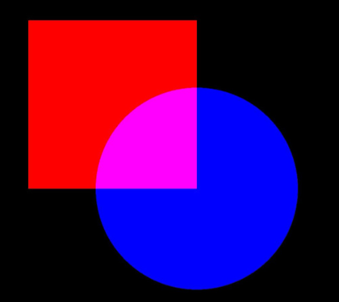


## Path Effect

The path effect, for example, the dashed line effect, is used only for the paint.

You can use the OH_Drawing_CreateDashPathEffect() API to set the path effect. The API accepts three parameters:

- intervals: an array of floating-point numbers, indicating the interval between dashes or dots.

- count: an integer, indicating the number of elements in the intervals array.

- phase: a floating-point number, indicating the offset in the intervals array, that is, the position in the array from which the dashed or dotted line effect starts to be applied.

The following uses the dashed line effect of a rectangle as an example. The key example and effect are as follows:

```c++
// sample_graphics.cpp
// Create a pen.
OH_Drawing_Pen *pen = OH_Drawing_PenCreate();
// Set the stroke color of the paint.
OH_Drawing_PenSetColor(pen, 0xffff0000);
// Set the stroke width of the pen to 10.
OH_Drawing_PenSetWidth(pen, 10);
// 10 px solid line, 5 px gap, 2 px solid line, 5 px gap, and so on
float intervals[] = {10, 5, 2, 5};
// Set the dashed line effect.
OH_Drawing_PathEffect *pathEffect = OH_Drawing_CreateDashPathEffect(intervals, 4, 0.0);
OH_Drawing_PenSetPathEffect(pen, pathEffect);
// Set the pen on the canvas. Ensure that the canvas object has been obtained.
OH_Drawing_CanvasAttachPen(canvas, pen);
// Create a rectangle.
OH_Drawing_Rect *rect = OH_Drawing_RectCreate(300, 300, 900, 900);
// Draw the rectangle.
OH_Drawing_CanvasDrawRect(canvas, rect);
// Remove the paint from the canvas.
OH_Drawing_CanvasDetachPen(canvas);
// Destroy objects.
OH_Drawing_PenDestroy(pen);
OH_Drawing_RectDestroy(rect);
OH_Drawing_PathEffectDestroy(pathEffect);
```
<!-- [ndk_graphics_draw_path_effect](https://gitcode.com/openharmony/applications_app_samples/blob/master/code/DocsSample/Drawing/NDKGraphicsDraw/entry/src/main/cpp/samples/sample_graphics.cpp) -->

| Dashed line effect disabled| Dashed line effect enabled|
| -------- | -------- |
| 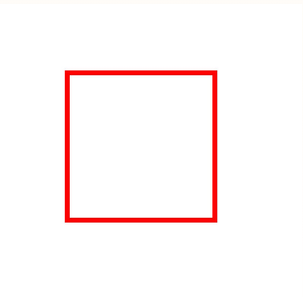| 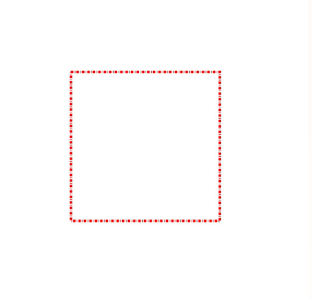|


## Shader Effect

The shader effect is implemented based on the brush or paint. You can use the OH_Drawing_BrushSetShaderEffect() API to set the shader effect of the brush, or use the OH_Drawing_PenSetShaderEffect() API to set the shader effect of the paint. Currently, different shader effects are supported, such as linear gradient shader effect, radial gradient shader effect, and sector gradient shader effect.

For details about the shader-related APIs and parameters, see [drawing_shader_effect](../reference/apis-arkgraphics2d/capi-drawing-shader-effect-h.md).


### Linear gradient shader effect

You can use the OH_Drawing_ShaderEffectCreateLinearGradient() API to create the linear gradient shader effect. The API accepts six parameters, which are the start point, end point, color array, relative position array, color array size, and tiling mode.

- The start point and end point are used to determine the gradient direction.

- The color array is used to store the colors used for gradient.

- The relative position array is used to determine the relative position of each color in the gradient. If the relative position is empty, the colors are evenly distributed between the start point and end point.

- The tiling mode is used to determine how to continue the gradient effect beyond the gradient area. The tiling modes are as follows:
  - CLAMP: When the image exceeds its original boundary, the edge color is copied.
  - REPEAT: The image is repeated in the horizontal and vertical directions.
  - MIRROR: The image is repeated in the horizontal and vertical directions, and mirrored images are alternately used between adjacent images.
  - DECAL: Only the original domain is drawn, and transparent black is returned elsewhere.

The following uses drawing a rectangle and setting the linear gradient shader effect using a brush as an example. The key example and effect diagram are as follows:

```c++
// sample_graphics.cpp
// Start point
OH_Drawing_Point *startPt = OH_Drawing_PointCreate(20, 20);
// End point
OH_Drawing_Point *endPt = OH_Drawing_PointCreate(900, 900);
// Color array
uint32_t colors[] = {0xFFFFFF00, 0xFFFF0000, 0xFF0000FF};
// Relative position array
float pos[] = {0.0f, 0.5f, 1.0f};
// Create a linear gradient shader effect.
OH_Drawing_ShaderEffect *colorShaderEffect =
    OH_Drawing_ShaderEffectCreateLinearGradient(startPt, endPt, colors, pos, 3, OH_Drawing_TileMode::CLAMP);
// Create a brush object.
OH_Drawing_Brush* brush = OH_Drawing_BrushCreate();
// Set the shader effect based on the brush.
OH_Drawing_BrushSetShaderEffect(brush, colorShaderEffect);
// Set the brush on the canvas. Ensure that the canvas object has been obtained.
OH_Drawing_CanvasAttachBrush(canvas, brush);
OH_Drawing_Rect *rect = OH_Drawing_RectCreate(100, 100, 900, 900);
  // Draw a rectangle.
OH_Drawing_CanvasDrawRect(canvas, rect);
// Remove the brush from the canvas.
OH_Drawing_CanvasDetachBrush(canvas);
// Destroy objects.
OH_Drawing_BrushDestroy(brush);
OH_Drawing_RectDestroy(rect);
OH_Drawing_ShaderEffectDestroy(colorShaderEffect);
OH_Drawing_PointDestroy(startPt);
OH_Drawing_PointDestroy(endPt);
```
<!-- [ndk_graphics_draw_linear_gradient](https://gitcode.com/openharmony/applications_app_samples/blob/master/code/DocsSample/Drawing/NDKGraphicsDraw/entry/src/main/cpp/samples/sample_graphics.cpp) -->

The following figure shows the rectangle with the linear gradient shader effect.

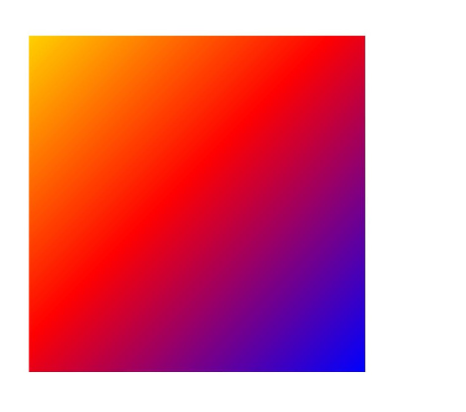


### Radial Gradient Shader Effect

You can use the OH_Drawing_ShaderEffectCreateRadialGradient() API to create the radial gradient shader effect. The API accepts six parameters: centerPt (coordinates of the center point), radius (radius), colors (color array), pos (relative position array), size (number of colors and positions), and OH_Drawing_TileMode (tile mode).

The implementation method is similar to that of the linear gradient shader. The difference is that the radial gradient shader starts from the center point and gradually changes outward.

The following uses drawing a rectangle and setting the radial gradient shader effect using a brush as an example. The key example and effect diagram are as follows:

```c++
// sample_graphics.cpp
// Coordinates of the center point
OH_Drawing_Point *centerPt = OH_Drawing_PointCreate(500, 500);
// Radius
float radius = 600;
// Color array
uint32_t gColors[] = {0xFFFF0000, 0xFF00FF00, 0xFF0000FF};
// Relative position array
float gPos[] = {0.0f, 0.25f, 0.75f};
// Create a radial gradient shader effect.
OH_Drawing_ShaderEffect *colorShaderEffect =
    OH_Drawing_ShaderEffectCreateRadialGradient(centerPt, radius, gColors, gPos, 3, OH_Drawing_TileMode::REPEAT);
// Create a brush object.
OH_Drawing_Brush* brush = OH_Drawing_BrushCreate();
// Set the shader effect based on the brush.
OH_Drawing_BrushSetShaderEffect(brush, colorShaderEffect);
// Set the brush on the canvas. Ensure that the canvas object has been obtained.
OH_Drawing_CanvasAttachBrush(canvas, brush);
OH_Drawing_Rect *rect = OH_Drawing_RectCreate(100, 100, 900, 900);
  // Draw a rectangle.
OH_Drawing_CanvasDrawRect(canvas, rect);
// Remove the brush from the canvas.
OH_Drawing_CanvasDetachBrush(canvas);
// Destroy objects.
OH_Drawing_BrushDestroy(brush);
OH_Drawing_RectDestroy(rect);
OH_Drawing_ShaderEffectDestroy(colorShaderEffect);
OH_Drawing_PointDestroy(centerPt);
```
<!-- [ndk_graphics_draw_path_gradient](https://gitcode.com/openharmony/applications_app_samples/blob/master/code/DocsSample/Drawing/NDKGraphicsDraw/entry/src/main/cpp/samples/sample_graphics.cpp) -->

The following figure shows the rectangle with the radial gradient shader effect.

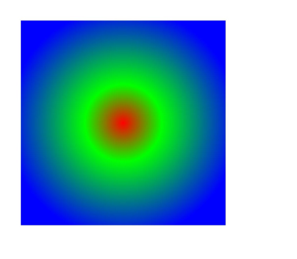


### Sweep Gradient Shader Effect

You can use the OH_Drawing_ShaderEffectCreateSweepGradient() API to create the sweep gradient shader effect. This API accepts five parameters, which are the center point, color array, relative position array, number of colors and relative positions, and tiling mode.

The implementation is similar to that of the linear gradient shader. The difference is that the sweep gradient shader effect is achieved through gradient transition during rotation around the center point.

The following example shows how to draw a rectangle and set the fan gradient shader effect using a brush. The key code and effect are as follows:

```c++
// sample_graphics.cpp
// Center point
OH_Drawing_Point *centerPt = OH_Drawing_PointCreate(500, 500);
// Color array
uint32_t colors[3] = {0xFF00FFFF, 0xFFFF00FF, 0xFFFFFF00};
// Relative position array
float pos[3] = {0.0f, 0.5f, 1.0f};
// Create a fan gradient shader effect.
OH_Drawing_ShaderEffect* colorShaderEffect =
    OH_Drawing_ShaderEffectCreateSweepGradient(centerPt, colors, pos, 3, OH_Drawing_TileMode::CLAMP);
// Create a brush object.
OH_Drawing_Brush* brush = OH_Drawing_BrushCreate();
// Set the shader effect based on the brush.
OH_Drawing_BrushSetShaderEffect(brush, colorShaderEffect);
// Set the brush on the canvas. Ensure that the canvas object has been obtained.
OH_Drawing_CanvasAttachBrush(canvas, brush);
OH_Drawing_Rect *rect = OH_Drawing_RectCreate(100, 100, 900, 900);
  // Draw a rectangle.
OH_Drawing_CanvasDrawRect(canvas, rect);
// Remove the brush from the canvas.
OH_Drawing_CanvasDetachBrush(canvas);
// Destroy objects.
OH_Drawing_BrushDestroy(brush);
OH_Drawing_RectDestroy(rect);
OH_Drawing_ShaderEffectDestroy(colorShaderEffect);
OH_Drawing_PointDestroy(centerPt);
```
<!-- [ndk_graphics_draw_sector_gradient](https://gitcode.com/openharmony/applications_app_samples/blob/master/code/DocsSample/Drawing/NDKGraphicsDraw/entry/src/main/cpp/samples/sample_graphics.cpp) -->

The following figure shows the rectangle drawn in this example.

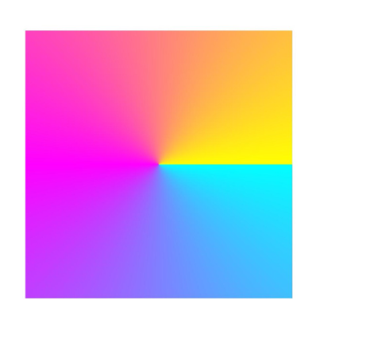


## Filter effect

The filter effect can be implemented based on the brush or pen. You can use the OH_Drawing_PenSetFilter() API to set the filter effect of the pen, or use the OH_Drawing_BrushSetFilter() API to set the filter effect of the brush. Currently, different filter effects are supported, such as image filter, color filter, and mask filter.

For details about the filter APIs and parameters, see [drawing_filter.h](../reference/apis-arkgraphics2d/capi-drawing-filter-h.md).


### Color Filter Effect

The color filter can be implemented based on the pen or brush. For details about the APIs and parameters of the color filter, see [drawing_color_filter.h](../reference/apis-arkgraphics2d/capi-drawing-color-filter-h.md).

Currently, the following color filters can be implemented:

- Color filter with a blending mode.

- Color filter with a 5x4 color matrix.

- Color filter that applies the SRGB gamma curve to the RGB color channel.

- Color filter that applies the RGB color channel to the SRGB gamma curve.

- Color filter that multiplies the input luminance value by the transparency channel and sets the red, green, and blue channels to zero.

- Color filter composed of two color filters.

The following uses the color filter with a 5x4 color matrix as an example.

You can use the OH_Drawing_ColorFilterCreateMatrix() API to create a color filter with a 5x4 color matrix. The API accepts one parameter, which is a color matrix. The color matrix is a floating-point number array with a length of 20. The array format is as follows:

[ a0, a1, a2, a3, a4 ]

[ b0, b1, b2, b3, b4 ]

[ c0, c1, c2, c3, c4 ]

[ d0, d1, d2, d3, d4 ]

For each original pixel color value (R, G, B, A), the formula for calculating the transformed color value (R', G', B', A') is as follows:

R' = a0\*R + a1\*G + a2\*B + a3\*A + a4

G' = b0\*R + b1\*G + b2\*B + b3\*A + b4

B' = c0\*R + c1\*G + c2\*B + c3\*A + c4

A' = d0\*R + d1\*G + d2\*B + d3\*A + d4

The following uses drawing a rectangle and setting the color filter effect with a 5x4 color matrix by using a brush as an example. The key example and effect diagram are as follows:

```c++
// sample_graphics.cpp
// Create a brush.
OH_Drawing_Brush *brush = OH_Drawing_BrushCreate();
// Set the anti-aliasing of the brush.
OH_Drawing_BrushSetAntiAlias(brush, true);
// Set the brush fill color.
OH_Drawing_BrushSetColor(brush, 0xffff0000);
// Set the color matrix.
const float matrix[20] = {
    1, 0, 0, 0, 0,
    0, 1, 0, 0, 0,
    0, 0, 0.5f, 0.5f, 0,
    0, 0, 0.5f, 0.5f, 0
};

// Create a filter color.
OH_Drawing_ColorFilter* colorFilter = OH_Drawing_ColorFilterCreateMatrix(matrix);
// Create a filter object.
OH_Drawing_Filter *filter = OH_Drawing_FilterCreate();
// Set the color filter for the filter object.
OH_Drawing_FilterSetColorFilter(filter, colorFilter);
// Set the filter effect of the brush.
OH_Drawing_BrushSetFilter(brush, filter);
// Set the brush on the canvas. Ensure that the canvas object has been obtained.
OH_Drawing_CanvasAttachBrush(canvas, brush);
// Create a rectangle.
OH_Drawing_Rect *rect = OH_Drawing_RectCreate(300, 300, 900, 900);
// Draw the rectangle.
OH_Drawing_CanvasDrawRect(canvas, rect);
// Remove the brush from the canvas.
OH_Drawing_CanvasDetachBrush(canvas);
// Destroy objects.
OH_Drawing_BrushDestroy(brush);
OH_Drawing_ColorFilterDestroy(colorFilter);
OH_Drawing_RectDestroy(rect);
OH_Drawing_FilterDestroy(filter);
```
<!-- [ndk_graphics_draw_color_filter](https://gitcode.com/openharmony/applications_app_samples/blob/master/code/DocsSample/Drawing/NDKGraphicsDraw/entry/src/main/cpp/samples/sample_graphics.cpp) -->

| No color filter effect| Color filter effect of a 5x4 color matrix|
| -------- | -------- |
| 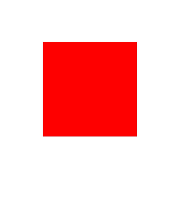| 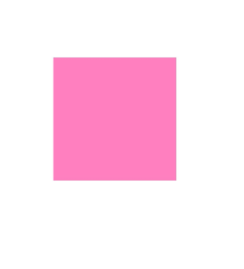|


### Image Filter Effect

Image filters can be implemented based on brushes or paintbrushes. For details about the APIs and parameters related to image filters, see [drawing_image_filter.h](../reference/apis-arkgraphics2d/capi-drawing-image-filter-h.md).

Currently, only the following two image filters are supported:

- Image filter based on color filters.
  You can use the OH_Drawing_ImageFilterCreateFromColorFilter() API to implement this function. The API accepts two parameters: colorFilter and input. The color filter effect is superimposed on the image filter input. input can be empty. If input is empty, only the color filter effect is added.

- Image filter with the blur effect.
  You can use the OH_Drawing_ImageFilterCreateBlur() API to implement this function. The API accepts four parameters: standard deviation of the blur effect on the X axis, standard deviation of the blur effect on the Y axis, tiling mode, and image filter (input).

  The final effect is that the input image filter (input) is blurred. That is, the filter effect can be superimposed. input can be empty. If input is empty, only the blur effect is added.

The following uses the image filter effect of drawing a rectangle and adding a blur effect using a brush as an example. The key example and effect diagram are as follows:

```c++
// sample_graphics.cpp
// Create a pen.
OH_Drawing_Pen *pen = OH_Drawing_PenCreate();
// Set anti-aliasing for the brush.
OH_Drawing_PenSetAntiAlias(pen, true);
// Set the stroke color of the brush.
OH_Drawing_PenSetColor(pen, 0xffff0000);
// Set the stroke width of the pen to 20.
OH_Drawing_PenSetWidth(pen, 20);
// Create an image filter to implement the blur effect.
OH_Drawing_ImageFilter *imageFilter =
    OH_Drawing_ImageFilterCreateBlur(20.0f, 20.0f, OH_Drawing_TileMode::CLAMP, nullptr);
// Create a filter object.
OH_Drawing_Filter *filter = OH_Drawing_FilterCreate();
// Set the image filter for the filter object.
OH_Drawing_FilterSetImageFilter(filter, imageFilter);
// Set the filter effect of the pen.
OH_Drawing_PenSetFilter(pen, filter);
// Set the pen on the canvas. Ensure that the canvas object has been obtained.
OH_Drawing_CanvasAttachPen(canvas, pen);
// Create a rectangle.
OH_Drawing_Rect *rect = OH_Drawing_RectCreate(300, 300, 900, 900);
// Draw the rectangle.
OH_Drawing_CanvasDrawRect(canvas, rect);
// Remove the paint from the canvas.
OH_Drawing_CanvasDetachPen(canvas);
// Destroy objects.
OH_Drawing_PenDestroy(pen);
OH_Drawing_ImageFilterDestroy(imageFilter);
OH_Drawing_RectDestroy(rect);
OH_Drawing_FilterDestroy(filter);
```
<!-- [ndk_graphics_draw_image_filter](https://gitcode.com/openharmony/applications_app_samples/blob/master/code/DocsSample/Drawing/NDKGraphicsDraw/entry/src/main/cpp/samples/sample_graphics.cpp) -->

| Image without the filter effect| Image with the filter effect|
| -------- | -------- |
| 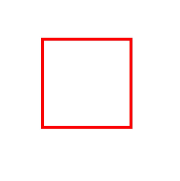| |


### Mask Filter Effect

The mask filter effect blurs only the transparency and shape edges. Compared with the image filter effect, the mask filter effect is less costly.

The mask filter can be implemented based on the brush or brush. For details about the APIs and parameters of the mask filter, see [drawing_mask_filter.h](../reference/apis-arkgraphics2d/capi-drawing-mask-filter-h.md).

You can use the OH_Drawing_MaskFilterCreateBlur() API to create a mask filter with the blur effect. The API accepts three parameters:

- blurType: specifies the blur type to be applied. For details, see [OH_Drawing_BlurType](../reference/apis-arkgraphics2d/capi-drawing-mask-filter-h.md#oh_drawing_blurtype).

- sigma: specifies the standard deviation of the Gaussian blur to be applied. The standard deviation must be greater than 0.

- respectCTM: specifies whether the standard deviation of the blur is modified by the coordinate transformation matrix (CTM). The default value is true, indicating that the standard deviation is modified accordingly.

The following uses drawing a rectangle and setting the mask filter effect using a paint as an example. The key example and effect are as follows:

```c++
// sample_graphics.cpp
// Create a pen.
OH_Drawing_Pen *pen = OH_Drawing_PenCreate();
// Set anti-aliasing for the brush.
OH_Drawing_PenSetAntiAlias(pen, true);
// Set the stroke color of the brush.
OH_Drawing_PenSetColor(pen, 0xffff0000);
// Set the stroke width of the pen to 20.
OH_Drawing_PenSetWidth(pen, 20);
// Create a mask filter.
OH_Drawing_MaskFilter *maskFilter = OH_Drawing_MaskFilterCreateBlur(OH_Drawing_BlurType::NORMAL, 20, true);
// Create a filter object.
OH_Drawing_Filter *filter = OH_Drawing_FilterCreate();
// Set the mask filter for the filter object.
OH_Drawing_FilterSetMaskFilter(filter, maskFilter);
// Set the filter effect of the pen.
OH_Drawing_PenSetFilter(pen, filter);
// Set the pen on the canvas. Ensure that the canvas object has been obtained.
OH_Drawing_CanvasAttachPen(canvas, pen);
// Create a rectangle.
OH_Drawing_Rect *rect = OH_Drawing_RectCreate(300, 300, 900, 900);
// Draw the rectangle.
OH_Drawing_CanvasDrawRect(canvas, rect);
// Remove the paint from the canvas.
OH_Drawing_CanvasDetachPen(canvas);
// Destroy objects.
OH_Drawing_PenDestroy(pen);
OH_Drawing_MaskFilterDestroy(maskFilter);
OH_Drawing_RectDestroy(rect);
OH_Drawing_FilterDestroy(filter);
```
<!-- [ndk_graphics_draw_mask_filter](https://gitcode.com/openharmony/applications_app_samples/blob/master/code/DocsSample/Drawing/NDKGraphicsDraw/entry/src/main/cpp/samples/sample_graphics.cpp) -->

| No mask filter effect| Mask filter effect|
| -------- | -------- |
| 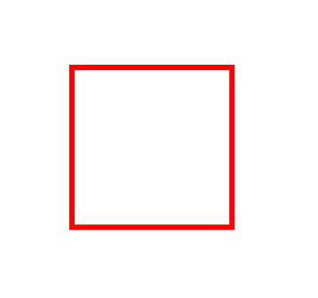| 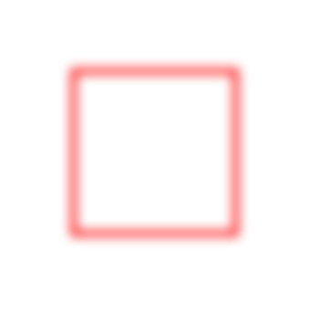|

<!--RP1-->
## Samples

The following samples are related to Drawing (C/C++):

- [NDKGraphicsDraw (API14)](https://gitcode.com/openharmony/applications_app_samples/tree/master/code/DocsSample/Drawing/NDKGraphicsDraw)
<!--RP1End-->
