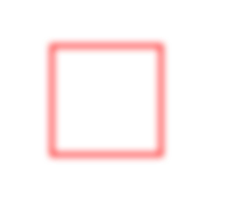

# Complex Drawing Effects (C/C++)

<!--Kit: ArkGraphics 2D-->
<!--Subsystem: Graphics-->
<!--Owner: @hangmengxin-->
<!--Designer: @wangyanglan-->
<!--Tester: @nobuggers-->
<!--Adviser: @ge-yafang-->

You can use a brush or a pen to implement complex drawing effects in addition to the basic fill color, stroke color, and style settings. The following lists some major challenges:


- Blend mode

- Path effect, such as dashed lines

- Shader effect, such as linear gradient and radial gradient

- Filtering effect, such as blurring


## Blend Mode

The blend mode can be used for brushes or pens. It defines how to combine source pixels (content to be drawn) with target pixels (content that already exists on the canvas).

You can use the **OH_Drawing_BrushSetBlendMode()** API to apply the blend mode to a brush and use the **OH_Drawing_PenSetBlendMode()** API to apply the blend mode to a pen. Both APIs need to take the **OH_Drawing_BlendMode** parameter, that is, the type of the blend mode. For details, see [OH_Drawing_BlendMode](../reference/apis-arkgraphics2d/capi-drawing-types-h.md#oh_drawing_blendmode).

The following describes how to use the brush to set the blend mode. (To prevent the blend mode effect from being interfered by the background color, the default black background is used.) The sample code and effect are as follows:

<!-- @[ndk_graphics_draw_mixed_mode](https://gitcode.com/openharmony/applications_app_samples/blob/master/code/DocsSample/ArkGraphics2D/Drawing/NDKGraphicsDraw/entry/src/main/cpp/samples/sample_graphics.cpp) -->

``` C++
// Create a brush object.
OH_Drawing_Brush* brush = OH_Drawing_BrushCreate();
// Set the target pixel color.
OH_Drawing_BrushSetColor(brush, OH_Drawing_ColorSetArgb(RGBA_MAX, RGBA_MAX, RGBA_MIN, RGBA_MIN));
// Attach the brush effect of the target pixels to the canvas.
OH_Drawing_CanvasAttachBrush(canvas, brush);
// Create a rectangle object.
OH_Drawing_Rect *rect = OH_Drawing_RectCreate(value100_, value100_, value600_, value600_);
// Draw a rectangle (target pixels).
OH_Drawing_CanvasDrawRect(canvas, rect);
// Set the source pixel color.
OH_Drawing_BrushSetColor(brush, OH_Drawing_ColorSetArgb(RGBA_MAX, RGBA_MIN, RGBA_MIN, 0xFF));
// Set the blend mode to PLUS.
OH_Drawing_BrushSetBlendMode(brush, OH_Drawing_BlendMode::BLEND_MODE_PLUS);
// Attach the brush effect of the source pixels to the canvas.
OH_Drawing_CanvasAttachBrush(canvas, brush);
// Create a point object for the circle center.
OH_Drawing_Point *point = OH_Drawing_PointCreate(value600_, value600_);
// Draw a circle (source pixels).
OH_Drawing_CanvasDrawCircle(canvas, point, value300_);
// Remove the brush from the canvas.
OH_Drawing_CanvasDetachBrush(canvas);
// Destroy objects.
OH_Drawing_RectDestroy(rect);
OH_Drawing_BrushDestroy(brush);
OH_Drawing_PointDestroy(point);
```


## Path Effect

The path effect, such as dashed lines, is available only for the pen.

You can use the **OH_Drawing_CreateDashPathEffect()** API to set the path effect. The API takes three parameters, which are as follows:

- Float array **intervals**: indicates the interval between dashed lines or dotted lines.

- Integer **count**: indicates the number of elements in the **intervals** array.

- Float **phase**: indicates the offset in the intervals array, that is, the position from which the dashed line or dotted line effect is applied.

The following uses the dashed line path effect of a rectangle as an example. The sample code and effect are as follows:

<!-- @[ndk_graphics_draw_path_effect](https://gitcode.com/openharmony/applications_app_samples/blob/master/code/DocsSample/ArkGraphics2D/Drawing/NDKGraphicsDraw/entry/src/main/cpp/samples/sample_graphics.cpp) -->

``` C++
// Create a pen object.
OH_Drawing_Pen *pen = OH_Drawing_PenCreate();
// Set the stroke color of the pen.
OH_Drawing_PenSetColor(pen, 0xffff0000);
// Set the pen width to 10.
OH_Drawing_PenSetWidth(pen, 10);
// The effect is a cyclic repetition of a 10 px solid line, a 5 px interval, a 2 px solid line, and a 5 px interval.
float intervals[] = {10, 5, 2, 5};
// Set the dashed line path effect.
OH_Drawing_PathEffect *pathEffect = OH_Drawing_CreateDashPathEffect(intervals, 4, 0.0);
OH_Drawing_PenSetPathEffect(pen, pathEffect);
// Set the pen on the canvas. Ensure that the canvas object has been obtained.
OH_Drawing_CanvasAttachPen(canvas, pen);
// Create a rectangle.
OH_Drawing_Rect *rect = OH_Drawing_RectCreate(value300_, value300_, value900_, value900_);
// Draw a rectangle.
OH_Drawing_CanvasDrawRect(canvas, rect);
// Remove the pen from the canvas.
OH_Drawing_CanvasDetachPen(canvas);
// Destroy objects.
OH_Drawing_PenDestroy(pen);
OH_Drawing_RectDestroy(rect);
OH_Drawing_PathEffectDestroy(pathEffect);
```

| Path Without Dashed Lines| Path With Dashed Lines|
| -------- | -------- |
| | |


## Shader Effect

The shader effect is implemented based on the brush or pen. You can use **OH_Drawing_BrushSetShaderEffect()** to set the shader effect of the brush, or use **OH_Drawing_PenSetShaderEffect()** to set the shader effect of the pen. Currently, different shader effects are supported, such as linear gradient, radial gradient, and sector gradient.

For details about shader-related APIs and parameters, see [drawing_shader_effect](../reference/apis-arkgraphics2d/capi-drawing-shader-effect-h.md).


### Linear Gradient Shader Effect

You can use the **OH_Drawing_ShaderEffectCreateLinearGradient()** API to create the linear gradient shader effect to be set. The API takes six parameters, which are the start point, end point, color array, relative position array, color array size, and tiling mode.

- The start point and end point are used to determine the gradient direction.

- The color array is used to store the colors used in the gradient.

- The relative position array is used to determine the relative position of each color in the gradient. If the relative position is empty, the colors are evenly distributed between the start point and end point.

- The tiling mode is used to determine how to continue the gradient effect outside the gradient area. The options are as follows:
  - **CLAMP**: Replicates the edge color if the image exceeds its original boundary.
  - **REPEAT**: Repeats the image in both horizontal and vertical directions.
  - **MIRROR**: Repeats the image in both horizontal and vertical directions and alternates the mirrored image between adjacent images.
  - **DECAL**: Renders the shader effect's image only within the original boundary, and returns transparent black elsewhere.

The following uses the rectangle drawing and the linear gradient shader effect implemented by a brush as an example. The sample code and effect are as follows:

<!-- @[ndk_graphics_draw_linear_gradient](https://gitcode.com/openharmony/applications_app_samples/blob/master/code/DocsSample/ArkGraphics2D/Drawing/NDKGraphicsDraw/entry/src/main/cpp/samples/sample_graphics.cpp) -->

``` C++
// Start point.
OH_Drawing_Point *startPt = OH_Drawing_PointCreate(20, 20);
// End point.
OH_Drawing_Point *endPt = OH_Drawing_PointCreate(value900_, value900_);
// Color array.
uint32_t colors[] = {0xFFFFFF00, 0xFFFF0000, 0xFF0000FF};
// Relative position array.
float pos[] = {0.0f, 0.5f, 1.0f};
// Create a linear gradient shader effect.
OH_Drawing_ShaderEffect *colorShaderEffect =
    OH_Drawing_ShaderEffectCreateLinearGradient(startPt, endPt, colors, pos, 3, OH_Drawing_TileMode::CLAMP);
// Create a brush object.
OH_Drawing_Brush* brush = OH_Drawing_BrushCreate();
// Set the shader effect based on the brush.
OH_Drawing_BrushSetShaderEffect(brush, colorShaderEffect);
// Set the brush on the canvas. Ensure that the canvas object has been obtained.
OH_Drawing_CanvasAttachBrush(canvas, brush);
OH_Drawing_Rect *rect = OH_Drawing_RectCreate(value100_, value100_, value900_, value900_);
 // Draw a rectangle.
OH_Drawing_CanvasDrawRect(canvas, rect);
// Remove the brush from the canvas.
OH_Drawing_CanvasDetachBrush(canvas);
// Destroy objects.
OH_Drawing_BrushDestroy(brush);
OH_Drawing_RectDestroy(rect);
OH_Drawing_ShaderEffectDestroy(colorShaderEffect);
OH_Drawing_PointDestroy(startPt);
OH_Drawing_PointDestroy(endPt);
```

The following figure shows the rectangle with the linear gradient shader effect.


### Radial Gradient Shader Effect

You can use the **OH_Drawing_ShaderEffectCreateRadialGradient()** API to create the radial gradient shader effect to be set. The API takes six parameters, which are the center coordinates (**centerPt**), radius (**radius**), color array (**colors**), relative position array (**pos**), number of colors and positions (**size**), and tiling mode (**OH_Drawing_TileMode**).

The implementation method is similar to that of the linear gradient shader. The difference is that the radial gradient starts from the center and gradually changes outward.

The following uses the rectangle drawing and the radial gradient shader effect implemented by a brush as an example. The sample code and effect are as follows:

<!-- @[ndk_graphics_draw_path_gradient](https://gitcode.com/openharmony/applications_app_samples/blob/master/code/DocsSample/ArkGraphics2D/Drawing/NDKGraphicsDraw/entry/src/main/cpp/samples/sample_graphics.cpp) -->

``` C++
// Center coordinates.
OH_Drawing_Point *centerPt = OH_Drawing_PointCreate(value500_, value500_);
// Radius.
float radius = value600_;
// Color array.
uint32_t gColors[] = {0xFFFF0000, 0xFF00FF00, 0xFF0000FF};
// Relative position array.
float_t gPos[] = {0.0f, 0.25f, 0.75f};
// Create a radial gradient shader.
OH_Drawing_ShaderEffect *colorShaderEffect =
    OH_Drawing_ShaderEffectCreateRadialGradient(centerPt, radius, gColors, gPos, 3, OH_Drawing_TileMode::REPEAT);
// Create a brush object.
OH_Drawing_Brush* brush = OH_Drawing_BrushCreate();
// Set the shader effect based on the brush.
OH_Drawing_BrushSetShaderEffect(brush, colorShaderEffect);
// Set the brush on the canvas. Ensure that the canvas object has been obtained.
OH_Drawing_CanvasAttachBrush(canvas, brush);
OH_Drawing_Rect *rect = OH_Drawing_RectCreate(value100_, value100_, value900_, value900_);
 // Draw a rectangle.
OH_Drawing_CanvasDrawRect(canvas, rect);
// Remove the brush from the canvas.
OH_Drawing_CanvasDetachBrush(canvas);
// Destroy objects.
OH_Drawing_BrushDestroy(brush);
OH_Drawing_RectDestroy(rect);
OH_Drawing_ShaderEffectDestroy(colorShaderEffect);
OH_Drawing_PointDestroy(centerPt);
```

The following figure shows the rectangle with the radial gradient shader effect.


### Sector Gradient Shader Effect

You can use the **OH_Drawing_ShaderEffectCreateSweepGradient()** API to create the sector gradient shader effect to be set. The API takes five parameters, which are the center point, color array, relative position array, number of colors and relative positions, and tiling mode.

The implementation method is similar to that of the linear gradient shader. The difference is that the sector gradient is gradually changed during rotation around the center point.

The following uses the rectangle drawing and the sector gradient shader effect implemented by a brush as an example. The sample code and effect are as follows:

<!-- @[ndk_graphics_draw_sector_gradient](https://gitcode.com/openharmony/applications_app_samples/blob/master/code/DocsSample/ArkGraphics2D/Drawing/NDKGraphicsDraw/entry/src/main/cpp/samples/sample_graphics.cpp) -->

``` C++
// Center point.
OH_Drawing_Point *centerPt = OH_Drawing_PointCreate(value500_, value500_);
// Color array.
uint32_t colors[3] = {0xFF00FFFF, 0xFFFF00FF, 0xFFFFFF00};
// Relative position array.
float pos[3] = {0.0f, 0.5f, 1.0f};
// Create a sector gradient shader.
OH_Drawing_ShaderEffect* colorShaderEffect =
    OH_Drawing_ShaderEffectCreateSweepGradient(centerPt, colors, pos, 3, OH_Drawing_TileMode::CLAMP);
// Create a brush object.
OH_Drawing_Brush* brush = OH_Drawing_BrushCreate();
// Set the shader effect based on the brush.
OH_Drawing_BrushSetShaderEffect(brush, colorShaderEffect);
// Set the brush on the canvas. Ensure that the canvas object has been obtained.
OH_Drawing_CanvasAttachBrush(canvas, brush);
OH_Drawing_Rect *rect = OH_Drawing_RectCreate(value100_, value100_, value900_, value900_);
 // Draw a rectangle.
OH_Drawing_CanvasDrawRect(canvas, rect);
// Remove the brush from the canvas.
OH_Drawing_CanvasDetachBrush(canvas);
// Destroy objects.
OH_Drawing_BrushDestroy(brush);
OH_Drawing_RectDestroy(rect);
OH_Drawing_ShaderEffectDestroy(colorShaderEffect);
OH_Drawing_PointDestroy(centerPt);
```

The following figure shows the rectangle with the sector gradient shader effect.


## Filter Effects

The filter effect can be implemented based on the brush or pen. You can use **OH_Drawing_PenSetFilter()** to set the filter effect of the pen, or use **OH_Drawing_BrushSetFilter()** to set the filter effect of the brush. Currently, different filter effects are supported, such as image filters, color filters, and mask filters.

For details about the filter-related APIs and parameters, see [drawing_filter.h](../reference/apis-arkgraphics2d/capi-drawing-filter-h.md).


### Color Filter Effects

The color filter can be implemented based on the pen or brush. For details about the color filter-related APIs and parameters, see [drawing_color_filter.h](../reference/apis-arkgraphics2d/capi-drawing-color-filter-h.md).

Currently, multiple color filters can be implemented, including:

- Color filter object with a given blend mode

- Color filter object with a given 5 x 4 color matrix

- Color filter object with the SRGB gamma curve applied to the RGB color channel

- Color filter object with the RGB color channel applied to the SRGB gamma curve

- Color filter object that multiplies the input luminance value by the transparency channel and sets the red, green, and blue channels to zero

- Color filter object composed of two color filters

The following uses the color filter with a 5 x 4 color matrix as an example.

You can use the **OH_Drawing_ColorFilterCreateMatrix()** API to create a color filter with a 5 x 4 color matrix. The API takes one parameter, which is the color matrix. The color matrix is a floating-point array of 20 elements. The array format is as follows:

[ a0, a1, a2, a3, a4 ]

[ b0, b1, b2, b3, b4 ]

[ c0, c1, c2, c3, c4 ]

[ d0, d1, d2, d3, d4 ]

For each original pixel color value (R, G, B, A), the formula for calculating the transformed color value (R', G', B', A') is as follows:

R' = a0\*R + a1\*G + a2\*B + a3\*A + a4

G' = b0\*R + b1\*G + b2\*B + b3\*A + b4

B' = c0\*R + c1\*G + c2\*B + c3\*A + c4

A' = d0\*R + d1\*G + d2\*B + d3\*A + d4

The following uses the rectangle drawing and the color filter effect with a 5 x 4 color matrix implemented by a brush as an example. The sample code and effect are as follows:

<!-- @[ndk_graphics_draw_color_filter](https://gitcode.com/openharmony/applications_app_samples/blob/master/code/DocsSample/ArkGraphics2D/Drawing/NDKGraphicsDraw/entry/src/main/cpp/samples/sample_graphics.cpp) -->

``` C++
// Create a brush object.
OH_Drawing_Brush *brush = OH_Drawing_BrushCreate();
// Set anti-aliasing for the brush.
OH_Drawing_BrushSetAntiAlias(brush, true);
// Set the fill color of the brush.
OH_Drawing_BrushSetColor(brush, 0xffff0000);
// Set the color matrix.
const float matrix[20] = {
    1, 0, 0, 0, 0,
    0, 1, 0, 0, 0,
    0, 0, 0.5f, 0.5f, 0,
    0, 0, 0.5f, 0.5f, 0
};
    
// Create a filter color.
OH_Drawing_ColorFilter* colorFilter = OH_Drawing_ColorFilterCreateMatrix(matrix);
// Create a filter object.
OH_Drawing_Filter *filter = OH_Drawing_FilterCreate();
// Set a color filter object for the filter object.
OH_Drawing_FilterSetColorFilter(filter, colorFilter);
// Set the filter effect of the brush.
OH_Drawing_BrushSetFilter(brush, filter);
// Set the brush on the canvas. Ensure that the canvas object has been obtained.
OH_Drawing_CanvasAttachBrush(canvas, brush);
// Create a rectangle.
OH_Drawing_Rect *rect = OH_Drawing_RectCreate(value300_, value300_, value900_, value900_);
// Draw a rectangle.
OH_Drawing_CanvasDrawRect(canvas, rect);
// Remove the brush from the canvas.
OH_Drawing_CanvasDetachBrush(canvas);
// Destroy objects.
OH_Drawing_BrushDestroy(brush);
OH_Drawing_ColorFilterDestroy(colorFilter);
OH_Drawing_RectDestroy(rect);
OH_Drawing_FilterDestroy(filter);
```

| Original Image| Image with a Color Filter Based on a 5×4 Color Matrix|
| -------- | -------- |
| | |


### Image Filter Effects

The image filter can be implemented based on the pen or brush. For details about the image filter-related APIs and parameters, see [drawing_image_filter.h](../reference/apis-arkgraphics2d/capi-drawing-image-filter-h.md).

Currently, only the following two types of image filters are supported:

- Image filter based on the color filter
  You can use the **OH_Drawing_ImageFilterCreateFromColorFilter()** API to implement this type of image filter. This API takes two parameters: **colorFilter** and **input**. That is, the effect of the color filter is superimposed on the image filter. **input** can be empty, which means that only the color filter effect is added.

- Image filter with a given blur effect
  You can call **OH_Drawing_ImageFilterCreateBlur()** to create a blur filter. The API takes four parameters, which are the blur standard deviation on the X axis, blur standard deviation on the Y axis, tiling mode, and image filter (**input**).

  The final effect is to blur the input image filter **input**. That is, the filter effect can be superimposed. **input** can be empty, which means that only the blur effect is added.

The following uses the rectangle drawing and the blur effect implemented by a pen as an example. The sample code and effect are as follows:

<!-- @[ndk_graphics_draw_image_filter](https://gitcode.com/openharmony/applications_app_samples/blob/master/code/DocsSample/ArkGraphics2D/Drawing/NDKGraphicsDraw/entry/src/main/cpp/samples/sample_graphics.cpp) -->

``` C++
// Create a pen object.
OH_Drawing_Pen *pen = OH_Drawing_PenCreate();
// Set anti-aliasing for the pen.
OH_Drawing_PenSetAntiAlias(pen, true);
// Set the stroke color of the pen.
OH_Drawing_PenSetColor(pen, 0xffff0000);
// Set the pen width to 20.
OH_Drawing_PenSetWidth(pen, 20);
// Create an image filter to implement the blur effect.
OH_Drawing_ImageFilter *imageFilter =
    OH_Drawing_ImageFilterCreateBlur(20.0f, 20.0f, OH_Drawing_TileMode::CLAMP, nullptr);
// Create a filter object.
OH_Drawing_Filter *filter = OH_Drawing_FilterCreate();
// Set an image filter object for the filter object.
OH_Drawing_FilterSetImageFilter(filter, imageFilter);
// Set the filter effect of the pen.
OH_Drawing_PenSetFilter(pen, filter);
// Set the pen on the canvas. Ensure that the canvas object has been obtained.
OH_Drawing_CanvasAttachPen(canvas, pen);
// Create a rectangle.
OH_Drawing_Rect *rect = OH_Drawing_RectCreate(value300_, value300_, value900_, value900_);
// Draw a rectangle.
OH_Drawing_CanvasDrawRect(canvas, rect);
// Remove the pen from the canvas.
OH_Drawing_CanvasDetachPen(canvas);
// Destroy objects.
OH_Drawing_PenDestroy(pen);
OH_Drawing_ImageFilterDestroy(imageFilter);
OH_Drawing_RectDestroy(rect);
OH_Drawing_FilterDestroy(filter);
```

| Original Image| Image with the Filter Effect|
| -------- | -------- |
| | |


### Mask Filter Effect

The blur effect of the mask filter only blurs the transparency and shape edges, which is less costly than that of the image filter.

The mask filter can be implemented based on the pen or brush. For details about the mask filter-related APIs and parameters, see [drawing_mask_filter.h](../reference/apis-arkgraphics2d/capi-drawing-mask-filter-h.md).

You can use the **OH_Drawing_MaskFilterCreateBlur()** API to create a mask filter with the blur effect. The API takes three parameters, which are as follows:

- **blurType**: specifies the blur type to be applied. For details, see [OH_Drawing_BlurType](../reference/apis-arkgraphics2d/capi-drawing-mask-filter-h.md#oh_drawing_blurtype).

- **sigma**: specifies the standard deviation of the Gaussian blur to be applied. The standard deviation must be greater than 0.

- **respectCTM**: specifies whether the standard deviation of the blur is modified by the coordinate transformation matrix (CTM). The default value is **true**, indicating that the standard deviation is modified.

The following uses the rectangle drawing and the mask filter effect implemented by a pen as an example. The sample code and effect are as follows:

<!-- @[ndk_graphics_draw_mask_filter](https://gitcode.com/openharmony/applications_app_samples/blob/master/code/DocsSample/ArkGraphics2D/Drawing/NDKGraphicsDraw/entry/src/main/cpp/samples/sample_graphics.cpp) -->

``` C++
// Create a pen object.
OH_Drawing_Pen *pen = OH_Drawing_PenCreate();
// Set anti-aliasing for the pen.
OH_Drawing_PenSetAntiAlias(pen, true);
// Set the stroke color of the pen.
OH_Drawing_PenSetColor(pen, 0xffff0000);
// Set the pen width to 20.
OH_Drawing_PenSetWidth(pen, 20);
// Create a mask filter.
OH_Drawing_MaskFilter *maskFilter = OH_Drawing_MaskFilterCreateBlur(OH_Drawing_BlurType::NORMAL, 20, true);
// Create a filter object.
OH_Drawing_Filter *filter = OH_Drawing_FilterCreate();
// Set a mask filter object for the filter object.
OH_Drawing_FilterSetMaskFilter(filter, maskFilter);
// Set the filter effect of the pen.
OH_Drawing_PenSetFilter(pen, filter);
// Set the pen on the canvas. Ensure that the canvas object has been obtained.
OH_Drawing_CanvasAttachPen(canvas, pen);
// Create a rectangle.
OH_Drawing_Rect *rect = OH_Drawing_RectCreate(value300_, value300_, value900_, value900_);
// Draw a rectangle.
OH_Drawing_CanvasDrawRect(canvas, rect);
// Remove the pen from the canvas.
OH_Drawing_CanvasDetachPen(canvas);
// Destroy objects.
OH_Drawing_PenDestroy(pen);
OH_Drawing_MaskFilterDestroy(maskFilter);
OH_Drawing_RectDestroy(rect);
OH_Drawing_FilterDestroy(filter);
```

| Original Image| Image with the Mask Effect|
| -------- | -------- |
| | |

<!--RP1-->
## Samples

The following samples are provided to help you better understand how to use the **Drawing** APIs (C/C++) for development:

- [NDKGraphicsDraw (API20)](https://gitcode.com/openharmony/applications_app_samples/tree/master/code/DocsSample/ArkGraphics2D/Drawing/NDKGraphicsDraw)
<!--RP1End-->
