# Drawing and Displaying Complex Text (ArkTS)
<!--Kit: ArkGraphics 2D-->
<!--Subsystem: Graphics-->
<!--Owner: @oh_wangxk; @gmiao522; @Lem0nC-->
<!--Designer: @liumingxiang-->
<!--Tester: @yhl0101-->
<!--Adviser: @ge-yafang-->
You can draw and display simple text by selecting a proper font, size, and color. In addition, you can set other rich styles, languages, and paragraphs to draw complex text.

Complex text drawing involves the following scenarios:

- Drawing and displaying multilingual text

- Drawing and displaying multiline text

- Drawing and displaying text with multiple styles


## Drawing and Displaying Multilingual Text

Multilingual support is the foundation of global apps. Multilingual text drawing needs to support the character sets of different languages and their unique display requirements, such as right-to-left languages (such as Arabic) or vertical text (such as Chinese). You need to understand the rendering features of different languages to ensure correct text display.


In the scenario where multilingual text is used, you can specify the **locale** field in the [TextStyle](../reference/apis-arkgraphics2d/js-apis-graphics-text.md#textstyle) text style to match the corresponding font based on the value of the locale field, skipping the process of traversing the list to match the font. This reduces the matching time and memory usage.


### How to Develop

1. Obtain the canvas object through context.

   ```ts
   let canvas = context.canvas;
   ```

2. Initialize the text style.

   ```ts
   let myTextStyle: text.TextStyle = {
     color: {
       alpha: 255,
       red: 255,
       green: 0,
       blue: 0
     },
     fontSize: 50,
     // Set the language preference to simplified Chinese.
     locale: 'zh-Hans'
   };
   ```

3. Initialize the paragraph style.

   ```ts
   let myParagraphStyle: text.ParagraphStyle = {
     textStyle: myTextStyle,
   };
   ```

4. Initialize the paragraph object and add text.

   ```ts
   let fontCollection = text.FontCollection.getGlobalInstance();
   let paragraphBuilder = new text.ParagraphBuilder(myParagraphStyle, fontCollection);
   // Update the text style.
   paragraphBuilder.pushStyle(myTextStyle);
   // Add text.
   paragraphBuilder.addText ('Hello, world');
   ```

5. Arrange paragraphs and draw text.

   ```ts
   // Generate a paragraph.
   let paragraph = paragraphBuilder.build();
   // Layout
   paragraph.layoutSync(1250);
   // Draw text.
   paragraph.paint(canvas, 10, 0);
   ```


### Complete Sample Code

In this example, the text to be drawn is simplified Chinese. Set the language preference to simplified Chinese. When matching the text font, simplified Chinese is matched first to improve drawing efficiency.

<!-- @[arkts_multi_language_text](https://gitcode.com/openharmony/applications_app_samples/blob/master/code/DocsSample/graphic/ArkGraphics2D/ComplexTextDrawing/entry/src/main/ets/pages/multilanguage/MultilanguageText.ets) -->

``` TypeScript
import { NodeController, FrameNode, RenderNode, DrawContext } from '@kit.ArkUI'
import { UIContext } from '@kit.ArkUI'
import { text } from '@kit.ArkGraphics2D'

// Create a MyRenderNode class and draw the text.
class MyRenderNode extends RenderNode {
  async draw(context: DrawContext) {
    // The drawing code logic is written here.
    let canvas = context.canvas;

    let myTextStyle: text.TextStyle = {
      color: {
        alpha: 255,
        red: 255,
        green: 0,
        blue: 0
      },
      fontSize: 50,
      // Set the language preference to simplified Chinese.
      locale: 'zh-Hans'
    };

    let myParagraphStyle: text.ParagraphStyle = {
      textStyle: myTextStyle,
    };
    let fontCollection = text.FontCollection.getGlobalInstance();
    let paragraphBuilder = new text.ParagraphBuilder(myParagraphStyle, fontCollection);
    // Update the text style.
    paragraphBuilder.pushStyle(myTextStyle);
    // Add text.
    paragraphBuilder.addText ('Hello, world');
    // Generate a paragraph.
    let paragraph = paragraphBuilder.build();
    // Layout
    paragraph.layoutSync(1250);
    // Draw text.
    paragraph.paint(canvas, 10, 0);
  }
}

// Create a MyRenderNode object.
const textNode = new MyRenderNode();
// Define the pixel format of MyRenderNode.
textNode.frame = {
  x: 0,
  y: 0,
  width: 400,
  height: 600
};
textNode.pivot = { x: 0.2, y: 0.8 };
textNode.scale = { x: 1, y: 1 };

class MyNodeController extends NodeController {
  private rootNode: FrameNode | null = null;

  makeNode(uiContext: UIContext): FrameNode {
    this.rootNode = new FrameNode(uiContext);
    if (this.rootNode == null) {
      return this.rootNode;
    }
    const renderNode = this.rootNode.getRenderNode();
    if (renderNode != null) {
      renderNode.frame = {
        x: 0,
        y: 0,
        width: 10,
        height: 500
      };
    }
    return this.rootNode;
  }

  addNode(node: RenderNode): void {
    if (this.rootNode == null) {
      return;
    }
    const renderNode = this.rootNode.getRenderNode();
    if (renderNode != null) {
      renderNode.appendChild(node);
    }
  }

  clearNodes(): void {
    if (this.rootNode == null) {
      return;
    }
    const renderNode = this.rootNode.getRenderNode();
    if (renderNode != null) {
      renderNode.clearChildren();
    }
  }
}

let myNodeController: MyNodeController = new MyNodeController();

async function performTask() {
  myNodeController.clearNodes();
  myNodeController.addNode(textNode);
}

@Entry
@Component
struct Font08 {
  @State src: Resource = $r('app.media.startIcon');
  build() {
    Column() {
      Row() {
        NodeContainer(myNodeController)
          .height('100%')
          .width('100%')
        Image(this.src)
          .width('0%').height('0%')
          .onComplete(
            () => {
              performTask();
            })
      }
      .width('100%')
    }
  }
}
```

### Effect

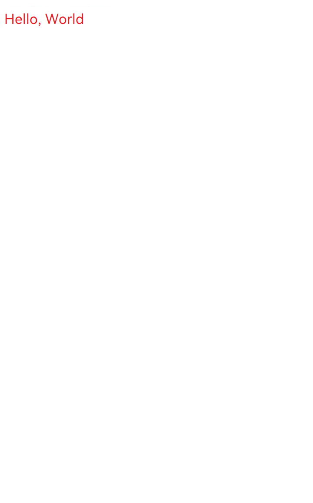


## Drawing and Displaying Multi-line Text

Multi-line text is more complex than single-line text. Multi-line text requires paragraph formatting, word break policy setting, text alignment, and maximum number of lines. The paragraph style is used to implement these functions.


### How to Implement

**ParagraphStyle** ([ParagraphStyle](../reference/apis-arkgraphics2d/js-apis-graphics-text.md#paragraphstyle)) is used to set the style of each paragraph in the multi-line text, including the word break policy, text alignment mode, and maximum number of lines. You can style different paragraphs to improve the readability and aesthetics of the text.


### How to Develop

1. Obtain the canvas object through context.

   ```ts
   // Write the drawing code logic here.
   let canvas = context.canvas;
   ```

2. Initialize the text style.

   ```ts
   let myTextStyle: text.TextStyle = {
     color: {
       alpha: 255,
       red: 255,
       green: 0,
       blue: 0
     },
     fontSize: 50,
     // When wordBreak is set to text.WordBreak.BREAK_HYPHEN, you need to set the language preference. The paragraph will display different text word break effects under different language preferences.
     locale: "en-gb"
   };
   ```

3. Initialize the paragraph style.

   ```ts
   let myParagraphStyle: text.ParagraphStyle = {
     textStyle: myTextStyle,
     // Text alignment mode
     align: text.TextAlign.LEFT,
     // Maximum number of lines
     maxLines: 3,
     // Word break policy
     wordBreak: text.WordBreak.BREAK_WORD
   };
   ```

4. Initialize the paragraph object and add placeholders and text.

   ```ts
   let fontCollection = text.FontCollection.getGlobalInstance();
   let paragraphBuilder = new text.ParagraphBuilder(myParagraphStyle, fontCollection);
   // Update the text style.
   paragraphBuilder.pushStyle(myTextStyle);
   // Add text.
   paragraphBuilder.addText('Hello World Hello World Hello World Hello World Hello World Hello World ' +
     'Hello World Hello World Hello World Hello World Hello World Hello World Hello World Hello World ' +
     'Hello World Hello World Hello World Hello World Hello World ');
   ```

5. Arrange paragraphs and draw text.

   ```ts
   // Generate a paragraph.
   let paragraph = paragraphBuilder.build();
   // Layout
   paragraph.layoutSync(1250);
   // Draw text.
   paragraph.paint(canvas, 10, 0);
   ```


### Complete Sample Code

<!-- @[arkts_multi_line_text](https://gitcode.com/openharmony/applications_app_samples/blob/master/code/DocsSample/graphic/ArkGraphics2D/ComplexTextDrawing/entry/src/main/ets/pages/multiline/MultilineText.ets) -->

``` TypeScript
import { NodeController, FrameNode, RenderNode, DrawContext } from '@kit.ArkUI'
import { UIContext } from '@kit.ArkUI'
import { text } from '@kit.ArkGraphics2D'

// Create a MyRenderNode class and draw the text.
class MyRenderNode extends RenderNode {
  async draw(context: DrawContext) {
    // The drawing code logic is written here.
    let canvas = context.canvas;

    let myTextStyle: text.TextStyle = {
      color: {
        alpha: 255,
        red: 255,
        green: 0,
        blue: 0
      },
      fontSize: 50,
      // If wordBreak is set to text.WordBreak.BREAK_HYPHEN, you need to set the language preference for the paragraph. The paragraph will display different text break effects in different language preferences.
      locale: 'en-gb'
    };

    let myParagraphStyle: text.ParagraphStyle = {
      textStyle: myTextStyle,
      // Text alignment mode
      align: text.TextAlign.LEFT,
      // Maximum number of lines
      maxLines: 3,
      // Word break policy
      wordBreak: text.WordBreak.BREAK_WORD
    };
    let fontCollection = text.FontCollection.getGlobalInstance();
    let paragraphBuilder = new text.ParagraphBuilder(myParagraphStyle, fontCollection);
    // Update the text style.
    paragraphBuilder.pushStyle(myTextStyle);
    // Add text.
    paragraphBuilder.addText('Hello World Hello World Hello World Hello World Hello World Hello World ' +
      'Hello World Hello World Hello World Hello World Hello World Hello World Hello World Hello World ' +
      'Hello World Hello World Hello World Hello World Hello World ');
    //When wordBreak is set to text.WordBreak.BREAK_HYPHEN, replace the text content with the following:
    // paragraphBuilder.addText('Modern embedded systems require robust communication protocols and efficient memory ' +
    //   'management strategies. Developers often face challenges in optimizing performance while maintaining ' +
    //   'modularity and portability. By leveraging a layered architecture and structured logging, applications can ' +
    //   'detect anomalies and respond quickly to faults. This approach enhances reliability, especially in ' +
    //   'time-critical environments such as IoT devices and real-time operating systems.');

    // Generate a paragraph.
    let paragraph = paragraphBuilder.build();
    // Layout
    paragraph.layoutSync(1250);
    // Draw text.
    paragraph.paint(canvas, 10, 0);
  }
}

// Create a MyRenderNode object.
const textNode = new MyRenderNode();
// Define the pixel format of MyRenderNode.
textNode.frame = {
  x: 0,
  y: 0,
  width: 400,
  height: 600
};
textNode.pivot = { x: 0.2, y: 0.8 };
textNode.scale = { x: 1, y: 1 };

class MyNodeController extends NodeController {
  private rootNode: FrameNode | null = null;

  makeNode(uiContext: UIContext): FrameNode {
    this.rootNode = new FrameNode(uiContext);
    if (this.rootNode == null) {
      return this.rootNode;
    }
    const renderNode = this.rootNode.getRenderNode();
    if (renderNode != null) {
      renderNode.frame = {
        x: 0,
        y: 0,
        width: 10,
        height: 500
      }
    }
    return this.rootNode;
  }

  addNode(node: RenderNode): void {
    if (this.rootNode == null) {
      return;
    }
    const renderNode = this.rootNode.getRenderNode();
    if (renderNode != null) {
      renderNode.appendChild(node);
    }
  }

  clearNodes(): void {
    if (this.rootNode == null) {
      return;
    }
    const renderNode = this.rootNode.getRenderNode();
    if (renderNode != null) {
      renderNode.clearChildren();
    }
  }
}

let myNodeController: MyNodeController = new MyNodeController();

async function performTask() {
  myNodeController.clearNodes();
  myNodeController.addNode(textNode);
}

@Entry
@Component
struct Font08 {
  @State src: Resource = $r('app.media.startIcon');
  build() {
    Column() {
      Row() {
        NodeContainer(myNodeController)
          .height('100%')
          .width('100%')
        Image(this.src)
          .width('0%').height('0%')
          .onComplete(
            () => {
              performTask();
            })
      }
      .width('100%')
    }
  }
}
```


### Effect

| Paragraph Style Settings (Word Break Policy, Text Alignment, and Maximum Number of Lines)| Effect| 
| -------- | -------- |
| The text alignment is text.TextAlign.LEFT, the maximum number of lines is 3, and the word break policy is text.WordBreak.BREAK_WORD.| 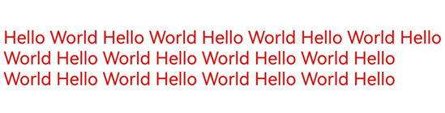| 
| The text alignment is text.TextAlign.RIGHT, the maximum number of lines is 3, and the word break policy is text.WordBreak.BREAK_WORD.| | 
| The text alignment mode is text.TextAlign.JUSTIFY, the maximum number of lines is 10, and the word break policy is text.WordBreak.BREAK_WORD.| 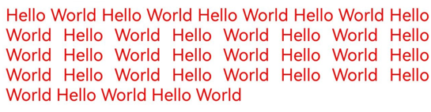| 
| The text alignment mode is text.TextAlign.LEFT, the maximum number of lines is 3, and the word break policy is text.WordBreak.BREAK_ALL.| 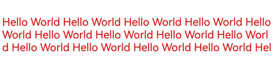| 
| The text alignment mode is text.TextAlign.LEFT, the maximum number of lines is 10, and the word break policy is text.WordBreak.BREAK_ALL.| 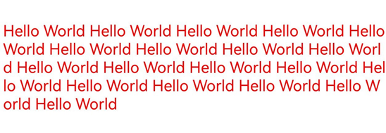| 
| The text alignment mode is text.TextAlign.LEFT, the maximum number of lines is 10, and the word break policy is text.WordBreak.BREAK_HYPHEN.<br>Language preference is not set. The paragraph does not contain hyphens (-).|  | 
| The text alignment mode is text.TextAlign.LEFT, the maximum number of lines is 10, and the word break policy is text.WordBreak.BREAK_HYPHEN.<br>The language preference is en-gb (British English). The paragraph contains hyphens (-) and the word break effect of the British language environment is displayed based on the language preference.|  | 
| The text alignment mode is text.TextAlign.LEFT, the maximum number of lines is 10, and the word break policy is text.WordBreak.BREAK_HYPHEN.<br>The language preference is en-us (American English). The paragraph contains hyphens (-) and the word break effect of the American language environment is displayed based on the language preference.|  | 


## Multi-Style Text Drawing and Display

In addition to basic text and typesetting attributes, developers may need to set different drawing styles or capabilities for different text designs in applications to highlight the unique performance or style of the corresponding text. In this case, you can use multiple drawing styles to render the text.

The following lists the multi-style drawing supported by the current version and the effects of each drawing style:

- **Decoration line drawing**: Texts are decorated with different line styles to make them more prominent and expressive.

- **Font feature drawing**: The appearance of texts is changed by changing the font, including the thickness and italic features, to enhance the readability and aesthetics of texts.

- **Variable font drawing**: This feature provides the capability of flexibly adjusting texts on different display environments and devices to meet more refined visual effects.

- **Text shadow drawing**: Shadows are added around texts to improve the layering and three-dimensionality of texts, making them more attractive.

- **Placeholder drawing**: This feature can be used to maintain the stability of the text layout when the text content is not determined, making the text display smoother and more natural.

- **Automatic spacing drawing**: Extra spacing can be automatically added to some character layout switching places to improve the reading experience.

- **Vertical alignment**: The vertical typesetting position of the text is adjusted to improve the typesetting quality.

- **Superscript and subscript**: Any character can be processed as a superscript or subscript to more accurately express the meaning of the text.

- **High-contrast text drawing**: Dark text is turned black and light text is turned white to enhance the contrast effect of the text.

- **Line height adjustment**: The vertical spacing between text lines can be changed by adjusting the line height, making the line spacing looser or tighter, significantly improving the vertical truncation problem of the text, and improving the readability.

- **Line spacing adjustment**: The line spacing can be adjusted to achieve the same effect as adjusting the line height, optimizing the reading experience.

### Decoration Line

A decoration line ([Decoration](../reference/apis-arkgraphics2d/js-apis-graphics-text.md#decoration)) is a decorative line added above, below, or in the middle of the text. Currently, the overline, underline, and strikethrough are supported.

You can add text decoration lines to improve the visual effect and readability of texts.

To use a decoration line, you need to initialize the decoration line style object and add it to the text style so that the decoration line takes effect during text drawing.

For details, see Example 1.

### Font Feature

**FontFeature** ([FontFeature](../reference/apis-arkgraphics2d/js-apis-graphics-text.md#fontfeature)) focuses on processing font features (such as bold, italic, and font variants) during text rendering. It allows fonts to display different effects in different typesetting scenarios, enhancing the expressiveness of text to better meet design and reading requirements.

Common **FontFeature** includes liga, frac, and case, which can be enabled only when the corresponding TTF file is supported.

For details, see Example 1.

### Variable Font

**FontVariation** ([FontVariation](../reference/apis-arkgraphics2d/js-apis-graphics-text.md#fontvariation)) is a font format that contains multiple glyph variants in a single font file. It allows you to flexibly adjust various font attributes (such as font weight, font width, and italic) in a single font file.

Unlike traditional font files (each variant requires an independent file), variable fonts contain multiple variant axes in a single font file. You can use variable fonts to implement smooth transition during text rendering and drawing.

For details, see Example 2.

### Text shadow

**TextShadow** ([TextShadow](../reference/apis-arkgraphics2d/js-apis-graphics-text.md#textshadow)) provides depth for text, making the text more three-dimensional on the background. It is usually used to improve the visual appeal or readability of text, especially in scenarios with low color contrast.

TextShadow has three attributes: color (shadow color), point (shadow offset based on the current text), and blurRadius (shadow radius).

To use the shadow effect, you need to set the corresponding shadow effect array in the text style so that the shadow effect takes effect during text drawing.

For details, see Example 2.

### Placeholder

Placeholder drawing is used to render placeholders in text.

Placeholders are also key to implementing mixed layout of images and text. They are visual elements used to provide or replace a position before the actual image or content is registered.

For details, see Example 2.

### Automatic Spacing

If this parameter is enabled, the spacing between CJK (Chinese, Japanese, and Korean) and Western characters (Latin, Cyrillic, and Greek), CJK and digits, CJK and copyright symbols, copyright symbols and digits, and copyright symbols and Western characters is automatically adjusted during text layout. For example, in the scenario where Chinese and English are mixed, enabling this parameter automatically adds extra spacing where Chinese and English are switched to improve the reading experience.
The key code is as follows:
```ts
let myParagraphStyle: text.ParagraphStyle = {
  autoSpace: true
};
```

### Vertical alignment

Vertical alignment is used to adjust the vertical layout position of text in a line. When line height scaling is enabled or texts in different font sizes are mixed in a line, vertical alignment can be enabled to align the text to the top, center, bottom, or baseline (default). Sample code:

```ts
let myParagraphStyle: text.ParagraphStyle = {
  verticalAlign: text.TextVerticalAlign.CENTER
};
```

For details, see Example 3.

### Superscript and subscript

Enabling this parameter allows the text to be used as a superscript or subscript for layout. This function is generally used in scenarios such as mathematical formulas and chemical formulas. Sample code:

```ts
let superScriptStyle: text.TextStyle = {
    badgeType: text.TextBadgeType.TEXT_SUPERSCRIPT
};
```

For details, see Example 4.

### High contrast ratio

High contrast can change dark text to black and light text to white. You can enable or disable high contrast text rendering for your app, or follow the high contrast text configuration in the system settings.

There are three high contrast modes. For details, see [TextHighContrast](../reference/apis-arkgraphics2d/js-apis-graphics-text.md#texthighcontrast20).

For details, see Example 5.

### Line Height Adjustment

Currently, there are two line height adjustment modes: setting the upper and lower limits of the line height and using the line height scaling coefficient.

**Line height adjustment (mode 1)**

From API version 21 onwards, the line height can be adjusted by setting the upper and lower limits of the line height. The key code is as follows:

```ts
let myTextStyle: text.TextStyle = {
    // Set the upper limit of the line height.
    lineHeightMaximum: 65,
    // Set the lower limit of the line height.
    lineHeightMinimum: 65
};
```

For details about the effect, see Example 6 (Line height adjustment mode 1) in the following.

**Line height adjustment (mode 2)**

The line height is adjusted by setting the line height scaling coefficient. The key code is as follows:

```ts
let myTextStyle: text.TextStyle = {
    // Enable the line height scaling function.
    heightOnly: true,
    // Set the line height scaling coefficient.
    heightScale: 1.5,
    // Set the line height scaling style.
    lineHeightStyle: text.LineHeightStyle.FONT_HEIGHT
};
```

For details about the effect, see Example 7 (Line height adjustment mode 2) in the following.

### Line Spacing Adjustment

From API version 21 onwards, the line spacing can be set to improve the distance between text lines and improve reading experience. The key code is as follows:

```ts
let myParagraphStyle: text.ParagraphStyle = {
  // Set the row spacing.
  lineSpacing: 100,
  // Disable the paragraph ascender and descender.
  textHeightBehavior: text.TextHeightBehavior.DISABLE_ALL,
};
```

For details about the effect, see Example 8 (Line spacing adjustment) in the following.

### Example 1 (decoration line and font feature)
The following uses the decoration line and font feature in the text style as an example to describe how to draw and display multi-style text.

<!-- @[arkts_complex_style_example1_text](https://gitcode.com/openharmony/applications_app_samples/blob/master/code/DocsSample/graphic/ArkGraphics2D/ComplexTextDrawing/entry/src/main/ets/pages/complexStyle/ComplexStyleExample1.ets) -->

``` TypeScript
import { NodeController, FrameNode, RenderNode, DrawContext } from '@kit.ArkUI'
import { UIContext } from '@kit.ArkUI'
import { text } from '@kit.ArkGraphics2D'

// Create a MyRenderNode class and draw the text.
class MyRenderNode extends RenderNode {
  async draw(context: DrawContext) {
    let canvas = context.canvas;

    // Initialize the decoration line object.
    let decorations: text.Decoration =
      {
        // Decoration line type. The underline, overline, and strikethrough are supported.
        textDecoration: text.TextDecorationType.UNDERLINE,
        // Decoration line color.
        color: {
          alpha: 255,
          red: 255,
          green: 0,
          blue: 0
        },
        // Decoration line style. The wavy line, dotted line, and straight line are supported.
        decorationStyle:text.TextDecorationStyle.SOLID,
        // Height of the decoration line.
        decorationThicknessScale: 1
      };

    let myTextStyle: text.TextStyle = {
      color: {
        alpha: 255,
        red: 255,
        green: 0,
        blue: 0
      },
      fontSize: 200,
      // Set the decoration line.
      decoration: decorations,
      // Enable the font feature.
      fontFeatures: [{name: 'frac', value: 1}]
    };

    let myParagraphStyle: text.ParagraphStyle = {
      textStyle: myTextStyle,
    };

    let fontCollection = text.FontCollection.getGlobalInstance();
    let paragraphBuilder = new text.ParagraphBuilder(myParagraphStyle, fontCollection);

    // Update the text style.
    paragraphBuilder.pushStyle(myTextStyle);
    // Add text.
    paragraphBuilder.addText('1/2 1/3 1/4 ');

    // Generate a paragraph.
    let paragraph = paragraphBuilder.build();
    // Layout
    paragraph.layoutSync(1250);
    // Draw text.
    paragraph.paint(canvas, 0, 0);
  }
}

// Create a MyRenderNode object.
const textNode = new MyRenderNode();
// Define the pixel format of MyRenderNode.
textNode.frame = {
  x: 0,
  y: 0,
  width: 400,
  height: 600
};
textNode.pivot = { x: 0.2, y: 0.8 };
textNode.scale = { x: 1, y: 1 };

class MyNodeController extends NodeController {
  private rootNode: FrameNode | null = null;

  makeNode(uiContext: UIContext): FrameNode {
    this.rootNode = new FrameNode(uiContext);
    if (this.rootNode == null) {
      return this.rootNode;
    }
    const renderNode = this.rootNode.getRenderNode();
    if (renderNode != null) {
      renderNode.frame = {
        x: 0,
        y: 0,
        width: 10,
        height: 500
      }
    }
    return this.rootNode;
  }

  addNode(node: RenderNode): void {
    if (this.rootNode == null) {
      return;
    }
    const renderNode = this.rootNode.getRenderNode();
    if (renderNode != null) {
      renderNode.appendChild(node);
    }
  }

  clearNodes(): void {
    if (this.rootNode == null) {
      return;
    }
    const renderNode = this.rootNode.getRenderNode();
    if (renderNode != null) {
      renderNode.clearChildren();
    }
  }
}

let myNodeController: MyNodeController = new MyNodeController();

async function performTask() {
  myNodeController.clearNodes();
  myNodeController.addNode(textNode);
}

@Entry
@Component
struct Font08 {
  @State src: Resource = $r('app.media.startIcon');
  build() {
    Column() {
      Row() {
        NodeContainer(myNodeController)
          .height('100%')
          .width('100%')
        Image(this.src)
          .width('0%').height('0%')
          .onComplete(
            () => {
              performTask();
            })
      }
      .width('100%')
    }
  }
}
```


The following figure shows the effect.

| Style settings (decoration line style and font feature)| Effect| 
| -------- | -------- |
| Decoration line and font feature disabled| 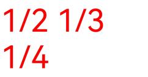| 
| Decoration line and font feature enabled| 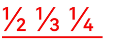| 

### Example 2 (variable font, text shadow, and placeholder)
The following uses variable font, text shadow, and placeholder as an example to describe how to draw and display multi-style text.

<!-- @[arkts_complex_style_example2_text](https://gitcode.com/openharmony/applications_app_samples/blob/master/code/DocsSample/graphic/ArkGraphics2D/ComplexTextDrawing/entry/src/main/ets/pages/complexStyle/ComplexStyleExample2.ets) -->

``` TypeScript
import { NodeController, FrameNode, RenderNode, DrawContext } from '@kit.ArkUI'
import { UIContext } from '@kit.ArkUI'
import { drawing } from '@kit.ArkGraphics2D'
import { text } from '@kit.ArkGraphics2D'
import { common2D } from '@kit.ArkGraphics2D'

// Create a MyRenderNode class and draw the text.
class MyRenderNode extends RenderNode {
  async draw(context: DrawContext) {
    let canvas = context.canvas;

    let myTextStyle: text.TextStyle = {
      color: {
        alpha: 255,
        red: 255,
        green: 0,
        blue: 0
      },
      fontSize: 120,
      // Variable font.
      fontVariations: [{axis: 'wght', value: 555}],
      // Text shadow.
      textShadows: [{color: { alpha: 0xFF, red: 0xFF, green: 0x00, blue: 0x00 }, point: {x:10,y:10}, blurRadius: 10}],
    };

    let myParagraphStyle: text.ParagraphStyle = {
      textStyle: myTextStyle,
    };

    let fontCollection = text.FontCollection.getGlobalInstance();
    let paragraphBuilder = new text.ParagraphBuilder(myParagraphStyle, fontCollection);

    // Initialize the placeholder object.
    let myPlaceholderSpan: text.PlaceholderSpan = {
      // Width.
      width: 300,
      // Height.
      height: 300,
      // Baseline alignment policy.
      align: text.PlaceholderAlignment.BOTTOM_OF_ROW_BOX,
      // Text baseline type.
      baseline: text.TextBaseline.ALPHABETIC,
      // Offset relative to the baseline. This parameter is valid only when the alignment policy is OFFSET_AT_BASELINE.
      baselineOffset: 100
    };
    // Add a placeholder.
    paragraphBuilder.addPlaceholder(myPlaceholderSpan);

    // Update the text style.
    paragraphBuilder.pushStyle(myTextStyle);
    // Add text.
    paragraphBuilder.addText('Hello Test');

    // Generate a paragraph.
    let paragraph = paragraphBuilder.build();
    // Layout
    paragraph.layoutSync(1250);
    // Draw text.
    paragraph.paint(canvas, 0, 0);

    // Obtain the array of all placeholders.
    let placeholderRects = paragraph.getRectsForPlaceholders();
    // Obtain the left boundary of the first placeholder.
    let left = placeholderRects[0].rect.left;
    // Obtain the upper boundary of the first placeholder.
    let top = placeholderRects[0].rect.top;
    // Obtain the right boundary of the first placeholder.
    let right = placeholderRects[0].rect.right;
    // Obtain the lower boundary of the first placeholder.
    let bottom = placeholderRects[0].rect.bottom;
    let pen: drawing.Pen =  new drawing.Pen();
    let penColor : common2D.Color = { alpha: 0xFF, red: 0xFF, green: 0x00, blue: 0x00 };
    pen.setColor(penColor);
    canvas.attachPen(pen);
    // Use the draw method to draw the placeholder rectangle.
    canvas.drawRect(left,top,right,bottom);
  }
}

// Create a MyRenderNode object.
const textNode = new MyRenderNode();
// Define the pixel format of MyRenderNode.
textNode.frame = {
  x: 0,
  y: 0,
  width: 400,
  height: 600,
};
textNode.pivot = { x: 0.2, y: 0.8 };
textNode.scale = { x: 1, y: 1 };

class MyNodeController extends NodeController {
  private rootNode: FrameNode | null = null;

  makeNode(uiContext: UIContext): FrameNode {
    this.rootNode = new FrameNode(uiContext);
    if (this.rootNode == null) {
      return this.rootNode;
    }
    const renderNode = this.rootNode.getRenderNode();
    if (renderNode != null) {
      renderNode.frame = {
        x: 0,
        y: 0,
        width: 10,
        height: 500
      };
    }
    return this.rootNode;
  }

  addNode(node: RenderNode): void {
    if (this.rootNode == null) {
      return;
    }
    const renderNode = this.rootNode.getRenderNode();
    if (renderNode != null) {
      renderNode.appendChild(node);
    }
  }

  clearNodes(): void {
    if (this.rootNode == null) {
      return;
    }
    const renderNode = this.rootNode.getRenderNode();
    if (renderNode != null) {
      renderNode.clearChildren();
    }
  }
}

let myNodeController: MyNodeController = new MyNodeController();

async function performTask() {
  myNodeController.clearNodes();
  myNodeController.addNode(textNode);
}

@Entry
@Component
struct Font08 {
  @State src: Resource = $r('app.media.startIcon');
  build() {
    Column() {
      Row() {
        NodeContainer(myNodeController)
          .height('100%')
          .width('100%')
        Image(this.src)
          .width('0%').height('0%')
          .onComplete(
            () => {
              performTask();
            })
      }
      .width('100%')
    }
  }
}
```

The following figure shows the effect.

| Style settings (variable fonts, text shadows, and placeholders)| Effect| 
| -------- | -------- |
| Variable fonts and text shadows are disabled, and placeholders are not used.| | 
| Variable fonts and text shadows are enabled, and placeholders are used.| 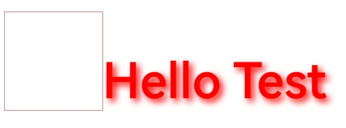| 

### Example 3 (vertical alignment)
The following uses the vertical alignment - center alignment feature as an example to describe the vertical text layout feature.

<!-- @[arkts_complex_style_example3_text](https://gitcode.com/openharmony/applications_app_samples/blob/master/code/DocsSample/graphic/ArkGraphics2D/ComplexTextDrawing/entry/src/main/ets/pages/complexStyle/ComplexStyleExample3.ets) -->

``` TypeScript
import { NodeController, FrameNode, RenderNode, DrawContext, UIContext } from '@kit.ArkUI'
import { text } from '@kit.ArkGraphics2D'

// Create a MyRenderNode class and draw the text.
class MyRenderNode extends RenderNode {
  async draw(context: DrawContext) {
    let canvas = context.canvas;

    let myTextStyle: text.TextStyle = {
      color: {
        alpha: 255,
        red: 255,
        green: 0,
        blue: 0
      },
      fontSize: 30,
      // Enable line height scaling.
      heightOnly: true,
      // The line height scaling coefficient is twice the font size.
      heightScale: 2
    };

    let myParagraphStyle: text.ParagraphStyle = {
      textStyle: myTextStyle,
      // Set the vertical alignment - center alignment mode.
      verticalAlign: text.TextVerticalAlign.CENTER,
    };

    let fontCollection = text.FontCollection.getGlobalInstance();
    let paragraphBuilder = new text.ParagraphBuilder(myParagraphStyle, fontCollection);

    // Set the style to be applied to the text to be typeset.
    paragraphBuilder.pushStyle(myTextStyle);
    // Add text.
    paragraphBuilder.addText('VerticalAlignment-center');

    // Generate a paragraph.
    let paragraph = paragraphBuilder.build();
    // Layout
    paragraph.layoutSync(1000);
    // Draw text.
    paragraph.paint(canvas, 0, 0);
  }
}

// Create a MyRenderNode object.
const textNode = new MyRenderNode();
// Define the pixel format of MyRenderNode.
textNode.frame = {
  x: 0,
  y: 0,
  width: 400,
  height: 600
};
textNode.pivot = { x: 0.2, y: 0.8 };
textNode.scale = { x: 1, y: 1 };

class MyNodeController extends NodeController {
  private rootNode: FrameNode | null = null;

  makeNode(uiContext: UIContext): FrameNode {
    this.rootNode = new FrameNode(uiContext);
    if (this.rootNode == null) {
      return this.rootNode;
    }
    const renderNode = this.rootNode.getRenderNode();
    if (renderNode != null) {
      renderNode.frame = {
        x: 0,
        y: 0,
        width: 10,
        height: 500
      }
      renderNode.pivot = { x: 50, y: 50 };
    }
    return this.rootNode;
  }

  addNode(node: RenderNode): void {
    if (this.rootNode == null) {
      return;
    }
    const renderNode = this.rootNode.getRenderNode();
    if (renderNode != null) {
      renderNode.appendChild(node);
    }
  }

  clearNodes(): void {
    if (this.rootNode == null) {
      return;
    }
    const renderNode = this.rootNode.getRenderNode();
    if (renderNode != null) {
      renderNode.clearChildren();
    }
  }
}

let myNodeController: MyNodeController = new MyNodeController();

async function performTask() {
  myNodeController.clearNodes();
  myNodeController.addNode(textNode);
}

@Entry
@Component
struct Font08 {
  @State src: Resource = $r('app.media.startIcon');
  build() {
    Column() {
      Row() {
        NodeContainer(myNodeController)
          .height('100%')
          .width('100%')
        Text('Test for vertical alignment')
          .onAppear(() => {
            performTask();
          })
      }
      .width('100%')
    }
  }
}
```


The following figure shows the effect.
| Style settings (vertical alignment)| Effect (The black box only shows the text drawing area and is not drawn in actual.)| 
| -------- | -------- |
| Baseline alignment (default)| 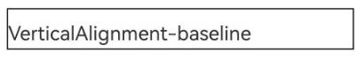| 
| Top alignment| | 
| Center| 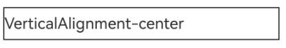| 
| Bottom alignment| 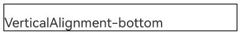| 

### Example 4: Subscript and Superscript Text
This example demonstrates how to format subscript and superscript text.

<!-- @[arkts_complex_style_example4_text](https://gitcode.com/openharmony/applications_app_samples/blob/master/code/DocsSample/graphic/ArkGraphics2D/ComplexTextDrawing/entry/src/main/ets/pages/complexStyle/ComplexStyleExample4.ets) -->

``` TypeScript
import { NodeController, FrameNode, RenderNode, DrawContext, UIContext } from '@kit.ArkUI'
import { text } from '@kit.ArkGraphics2D'

// Create a MyRenderNode class and draw the text.
class MyRenderNode extends RenderNode {
  async draw(context: DrawContext) {
    let canvas = context.canvas;

    let myTextStyle: text.TextStyle = {
      color: {
        alpha: 255,
        red: 255,
        green: 0,
        blue: 0
      },
      fontSize: 30,
    };

    let subScriptStyle: text.TextStyle = {
      color: {
        alpha: 255,
        red: 255,
        green: 0,
        blue: 0
      },
      fontSize: 30,
      // Set the subscript style.
      badgeType: text.TextBadgeType.TEXT_SUBSCRIPT
    };

    let myParagraphStyle: text.ParagraphStyle = {
      textStyle: myTextStyle,
    };

    let fontCollection = text.FontCollection.getGlobalInstance();
    let paragraphBuilder = new text.ParagraphBuilder(myParagraphStyle, fontCollection);

    // Set the style to be applied to the text to be typeset.
    paragraphBuilder.pushStyle(myTextStyle);
    // Add text.
    paragraphBuilder.addText('The chemical formula for water: H');
    paragraphBuilder.pushStyle(subScriptStyle);
    paragraphBuilder.addText('2');
    paragraphBuilder.pushStyle(myTextStyle);
    paragraphBuilder.addText('o');

    // Generate a paragraph.
    let paragraph = paragraphBuilder.build();
    // Layout
    paragraph.layoutSync(1000);
    // Draw text.
    paragraph.paint(canvas, 0, 0);
  }
}

// Create a MyRenderNode object.
const textNode = new MyRenderNode();
// Define the pixel format of MyRenderNode.
textNode.frame = {
  x: 0,
  y: 0,
  width: 400,
  height: 600
};
textNode.pivot = { x: 0.2, y: 0.8 };
textNode.scale = { x: 1, y: 1 };

class MyNodeController extends NodeController {
  private rootNode: FrameNode | null = null;

  makeNode(uiContext: UIContext): FrameNode {
    this.rootNode = new FrameNode(uiContext);
    if (this.rootNode == null) {
      return this.rootNode;
    }
    const renderNode = this.rootNode.getRenderNode();
    if (renderNode != null) {
      renderNode.frame = {
        x: 0,
        y: 0,
        width: 10,
        height: 500
      }
      renderNode.pivot = { x: 50, y: 50 };
    }
    return this.rootNode;
  }

  addNode(node: RenderNode): void {
    if (this.rootNode == null) {
      return;
    }
    const renderNode = this.rootNode.getRenderNode();
    if (renderNode != null) {
      renderNode.appendChild(node);
    }
  }

  clearNodes(): void {
    if (this.rootNode == null) {
      return;
    }
    const renderNode = this.rootNode.getRenderNode();
    if (renderNode != null) {
      renderNode.clearChildren();
    }
  }
}

let myNodeController: MyNodeController = new MyNodeController();

async function performTask() {
  myNodeController.clearNodes();
  myNodeController.addNode(textNode);
}

@Entry
@Component
struct Font08 {
  @State src: Resource = $r('app.media.startIcon');
  build() {
    Column() {
      Row() {
        NodeContainer(myNodeController)
          .height('100%')
          .width('100%')
        Text('Test for superscript and subscript')
          .onAppear(() => {
            performTask();
          })
      }
    }
    .width('100%')
  }
}
```


The following figure shows the effect.
| Style Settings (Superscript and Subscript)| Effect| 
| -------- | -------- |
| Superscript text| 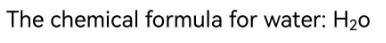| 
| Subscript text| | 

### Example 5 (high contrast)
This example demonstrates how to draw and display text with high contrast.

<!-- @[arkts_complex_style_example5_text](https://gitcode.com/openharmony/applications_app_samples/blob/master/code/DocsSample/graphic/ArkGraphics2D/ComplexTextDrawing/entry/src/main/ets/pages/complexStyle/ComplexStyleExample5.ets) -->

``` TypeScript
import { NodeController, FrameNode, RenderNode, DrawContext, UIContext} from '@kit.ArkUI'
import { text } from '@kit.ArkGraphics2D'

// Create a MyRenderNode class and draw the text.
class MyRenderNode extends RenderNode {
  async draw(context: DrawContext) {
    let canvas = context.canvas;

    // Enable high contrast for text rendering of the app.
    text.setTextHighContrast(text.TextHighContrast.TEXT_APP_ENABLE_HIGH_CONTRAST);

    let myTextStyle: text.TextStyle = {
      color: {
        alpha: 255,
        red: 111,
        green: 255,
        blue: 255
      },
      fontSize: 100,
    };

    let myParagraphStyle: text.ParagraphStyle = {
      textStyle: myTextStyle,
    };

    let fontCollection = text.FontCollection.getGlobalInstance();
    let paragraphBuilder = new text.ParagraphBuilder(myParagraphStyle, fontCollection);

    // Update the text style.
    paragraphBuilder.pushStyle(myTextStyle);
    // Add text.
    paragraphBuilder.addText('Hello World');

    // Generate a paragraph.
    let paragraph = paragraphBuilder.build();
    // Layout
    paragraph.layoutSync(1250);
    // Draw text.
    paragraph.paint(canvas, 10, 800);
  }
}

// Create a MyRenderNode object.
const textNode = new MyRenderNode();
// Define the pixel format of MyRenderNode.
textNode.frame = {
  x: 0,
  y: 0,
  width: 400,
  height: 600
};
textNode.pivot = { x: 0.2, y: 0.8 };
textNode.scale = { x: 1, y: 1 };

class MyNodeController extends NodeController {
  private rootNode: FrameNode | null = null;

  makeNode(uiContext: UIContext): FrameNode {
    this.rootNode = new FrameNode(uiContext);
    if (this.rootNode == null) {
      return this.rootNode;
    }
    const renderNode = this.rootNode.getRenderNode();
    if (renderNode != null) {
      renderNode.frame = {
        x: 0,
        y: 0,
        width: 10,
        height: 500
      };
      renderNode.pivot = { x: 0.2, y: 0.8 };
    }
    return this.rootNode;
  }

  addNode(node: RenderNode): void {
    if (this.rootNode == null) {
      return;
    }
    const renderNode = this.rootNode.getRenderNode();
    if (renderNode != null) {
      renderNode.appendChild(node);
    }
  }

  clearNodes(): void {
    if (this.rootNode == null) {
      return;
    }
    const renderNode = this.rootNode.getRenderNode();
    if (renderNode != null) {
      renderNode.clearChildren();
    }
  }
}

let myNodeController: MyNodeController = new MyNodeController();

async function performTask() {
  myNodeController.clearNodes();
  myNodeController.addNode(textNode);
}

@Entry
@Component
struct Font08 {
  build() {
    Column() {
      Row() {
        NodeContainer(myNodeController)
          .height('100%')
          .width('100%')
        Text('Test high contrast')
          .onAppear(() => {
            performTask();
          })
      }
      .width('100%')
    }
  }
}
```

The following figures show the effect.

| High contrast| Effect| 
| -------- | -------- |
| Not enabled| | 
| Enabled| 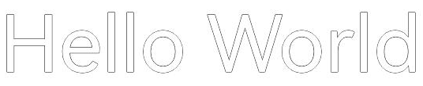| 

### Example 6 (line height adjustment mode 1)
In this example, the upper and lower limits of the line height are set to the same value to show the drawing effect when the line height is fixed.

```ts
import { NodeController, FrameNode, RenderNode, DrawContext, UIContext } from '@kit.ArkUI'
import { drawing, text, common2D } from '@kit.ArkGraphics2D'
import { image } from '@kit.ImageKit'

// Create a MyRenderNode class and draw the text.
class MyRenderNode extends RenderNode {
  async draw(context: DrawContext) {
    let canvas = context.canvas;

    let myTextStyle: text.TextStyle = {
      color: {
        alpha: 255,
        red: 255,
        green: 0,
        blue: 0
      },
      fontSize: 50,
      // Set the upper limit of the row height.
      lineHeightMaximum: 65,
      // Set the lower limit of the row height.
      lineHeightMinimum: 65,
    };

    let myParagraphStyle: text.ParagraphStyle = {
      textStyle: myTextStyle,
    };

    let fontCollection = text.FontCollection.getGlobalInstance();
    let paragraphBuilder = new text.ParagraphBuilder(myParagraphStyle, fontCollection);

    // Set the style to be applied to the text to be typeset.
    paragraphBuilder.pushStyle(myTextStyle);
    // Add text.
    paragraphBuilder.addText("Hello World!");

    // Generate a paragraph.
    let paragraph = paragraphBuilder.build();
    // Layout
    paragraph.layoutSync(1000);
    // Draw text.
    paragraph.paint(canvas, 0, 0);
  }
}

// Create a MyRenderNode object.
const textNode = new MyRenderNode()
// Define the pixel format of MyRenderNode.
textNode.frame = {
  x: 0,
  y: 0,
  width: 400,
  height: 600
}
textNode.pivot = { x: 0.2, y: 0.8 }
textNode.scale = { x: 1, y: 1 }

class MyNodeController extends NodeController {
  private rootNode: FrameNode | null = null;

  makeNode(uiContext: UIContext): FrameNode {
    this.rootNode = new FrameNode(uiContext)
    if (this.rootNode == null) {
      return this.rootNode
    }
    const renderNode = this.rootNode.getRenderNode()
    if (renderNode != null) {
      renderNode.frame = {
        x: 0,
        y: 0,
        width: 10,
        height: 500
      }
      renderNode.pivot = { x: 50, y: 50 }
    }
    return this.rootNode
  }

  addNode(node: RenderNode): void {
    if (this.rootNode == null) {
      return
    }
    const renderNode = this.rootNode.getRenderNode()
    if (renderNode != null) {
      renderNode.appendChild(node)
    }
  }

  clearNodes(): void {
    if (this.rootNode == null) {
      return
    }
    const renderNode = this.rootNode.getRenderNode()
    if (renderNode != null) {
      renderNode.clearChildren()
    }
  }
}

let myNodeController: MyNodeController = new MyNodeController()

async function performTask() {
  myNodeController.clearNodes()
  myNodeController.addNode(textNode)
}

@Entry
@Component
struct Font08 {
  @State src: Resource = $r('app.media.startIcon')
  build() {
    Column() {
      Row() {
        NodeContainer(myNodeController)
          .height('100%')
          .width('100%')
        Text("Test for line height limit")
          .onAppear(() => {
            performTask();
          })
      }
    }
      .width('100%')
  }
}
```

The effect is as follows:

| Maximum line height| Minimum line height| Effect (The black box is only used to display the text drawing area and is not drawn.)|
| -------- | -------- | -------- |
| 65 | 65 |  |
| 200 | 200 |  |

### Example 7 (Line Height Adjustment Mode 2)
This example uses the line height scaling style FontHeight as an example to describe how to draw and display text after line height adjustment.

```ts
import { NodeController, FrameNode, RenderNode, DrawContext, UIContext } from '@kit.ArkUI'
import { drawing, text, common2D } from '@kit.ArkGraphics2D'
import { image } from '@kit.ImageKit'

// Create a MyRenderNode class and draw the text.
class MyRenderNode extends RenderNode {
  async draw(context: DrawContext) {
    let canvas = context.canvas;

    let myTextStyle: text.TextStyle = {
      color: {
        alpha: 255,
        red: 255,
        green: 0,
        blue: 0
      },
      fontSize: 50,
      // Enable line height scaling.
      heightOnly: true,
      // Set the line height scaling coefficient.
      heightScale: 1.5,
      // Set the line height scaling style.
      lineHeightStyle: text.LineHeightStyle.FONT_HEIGHT,
    };

    let myParagraphStyle: text.ParagraphStyle = {
      textStyle: myTextStyle,
    };

    let fontCollection = text.FontCollection.getGlobalInstance();
    let paragraphBuilder = new text.ParagraphBuilder(myParagraphStyle, fontCollection);

    // Set the style to be applied to the text to be typeset.
    paragraphBuilder.pushStyle(myTextStyle);
    // Add text.
    paragraphBuilder.addText("Hello World!");

    // Generate a paragraph.
    let paragraph = paragraphBuilder.build();
    // Layout
    paragraph.layoutSync(1000);
    // Draw text.
    paragraph.paint(canvas, 0, 0);
  }
}

// Create a MyRenderNode object.
const textNode = new MyRenderNode()
// Define the pixel format of MyRenderNode.
textNode.frame = {
  x: 0,
  y: 0,
  width: 400,
  height: 600
}
textNode.pivot = { x: 0.2, y: 0.8 }
textNode.scale = { x: 1, y: 1 }

class MyNodeController extends NodeController {
  private rootNode: FrameNode | null = null;

  makeNode(uiContext: UIContext): FrameNode {
    this.rootNode = new FrameNode(uiContext)
    if (this.rootNode == null) {
      return this.rootNode
    }
    const renderNode = this.rootNode.getRenderNode()
    if (renderNode != null) {
      renderNode.frame = {
        x: 0,
        y: 0,
        width: 10,
        height: 500
      }
      renderNode.pivot = { x: 50, y: 50 }
    }
    return this.rootNode
  }

  addNode(node: RenderNode): void {
    if (this.rootNode == null) {
      return
    }
    const renderNode = this.rootNode.getRenderNode()
    if (renderNode != null) {
      renderNode.appendChild(node)
    }
  }

  clearNodes(): void {
    if (this.rootNode == null) {
      return
    }
    const renderNode = this.rootNode.getRenderNode()
    if (renderNode != null) {
      renderNode.clearChildren()
    }
  }
}

let myNodeController: MyNodeController = new MyNodeController()

async function performTask() {
  myNodeController.clearNodes()
  myNodeController.addNode(textNode)
}

@Entry
@Component
struct Font08 {
  @State src: Resource = $r('app.media.startIcon')
  build() {
    Column() {
      Row() {
        NodeContainer(myNodeController)
          .height('100%')
          .width('100%')
        Text("Test for line height limit")
          .onAppear(() => {
            performTask();
          })
      }
    }
      .width('100%')
  }
}
```

The effect is as follows:

| Line height scaling style| Example (The black box only shows the text drawing area and is not drawn in actual.)|
| -------- | -------- |
| FontSize |  |
| FontHeight |  |

### Example 8 (line spacing adjustment)
The following uses disabling the paragraph ascent and descent and setting the line spacing as an example to show the text drawing and display after the line spacing is increased.

```ts
import { NodeController, FrameNode, RenderNode, DrawContext, UIContext } from '@kit.ArkUI'
import { drawing, text, common2D } from '@kit.ArkGraphics2D'
import { image } from '@kit.ImageKit'

// Create a MyRenderNode class and draw the text.
class MyRenderNode extends RenderNode {
  async draw(context: DrawContext) {
    let canvas = context.canvas;

    let myTextStyle: text.TextStyle = {
      color: {
        alpha: 255,
        red: 255,
        green: 0,
        blue: 0
      },
      fontSize: 50,
    };

    let myParagraphStyle: text.ParagraphStyle = {
      textStyle: myTextStyle,
      // Set the row spacing.
      lineSpacing: 100,
      // Disable the top and bottom of the paragraph.
      textHeightBehavior: text.TextHeightBehavior.DISABLE_ALL,
    };

    let fontCollection = text.FontCollection.getGlobalInstance();
    let paragraphBuilder = new text.ParagraphBuilder(myParagraphStyle, fontCollection);

    // Set the style to be applied to the text to be typeset.
    paragraphBuilder.pushStyle(myTextStyle);
    // Add text.
    paragraphBuilder.addText("Hello World!");

    // Generate a paragraph.
    let paragraph = paragraphBuilder.build();
    // Layout
    paragraph.layoutSync(200);
    // Draw text.
    paragraph.paint(canvas, 0, 0);
  }
}

// Create a MyRenderNode object.
const textNode = new MyRenderNode()
// Define the pixel format of MyRenderNode.
textNode.frame = {
  x: 0,
  y: 0,
  width: 400,
  height: 600
}
textNode.pivot = { x: 0.2, y: 0.8 }
textNode.scale = { x: 1, y: 1 }

class MyNodeController extends NodeController {
  private rootNode: FrameNode | null = null;

  makeNode(uiContext: UIContext): FrameNode {
    this.rootNode = new FrameNode(uiContext)
    if (this.rootNode == null) {
      return this.rootNode
    }
    const renderNode = this.rootNode.getRenderNode()
    if (renderNode != null) {
      renderNode.frame = {
        x: 0,
        y: 0,
        width: 10,
        height: 500
      }
      renderNode.pivot = { x: 50, y: 50 }
    }
    return this.rootNode
  }

  addNode(node: RenderNode): void {
    if (this.rootNode == null) {
      return
    }
    const renderNode = this.rootNode.getRenderNode()
    if (renderNode != null) {
      renderNode.appendChild(node)
    }
  }

  clearNodes(): void {
    if (this.rootNode == null) {
      return
    }
    const renderNode = this.rootNode.getRenderNode()
    if (renderNode != null) {
      renderNode.clearChildren()
    }
  }
}

let myNodeController: MyNodeController = new MyNodeController()

async function performTask() {
  myNodeController.clearNodes()
  myNodeController.addNode(textNode)
}

@Entry
@Component
struct Font08 {
  @State src: Resource = $r('app.media.startIcon')
  build() {
    Column() {
      Row() {
        NodeContainer(myNodeController)
          .height('100%')
          .width('100%')
        Text("Test for lineSpacing and height behavior")
          .onAppear(() => {
            performTask();
          })
      }
    }
      .width('100%')
  }
}
```

The effect is as follows.

| Rising part Falling part Switch| Effect (The black box is only used to draw the text area and is not drawn.)|
| -------- | -------- |
| DISABLE_ALL |  |
| ALL |  |
