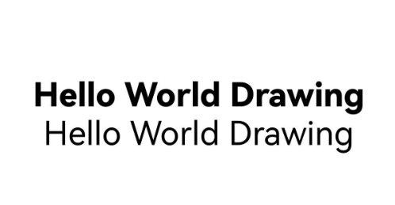
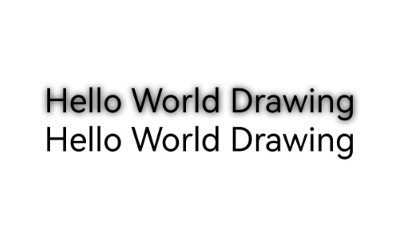
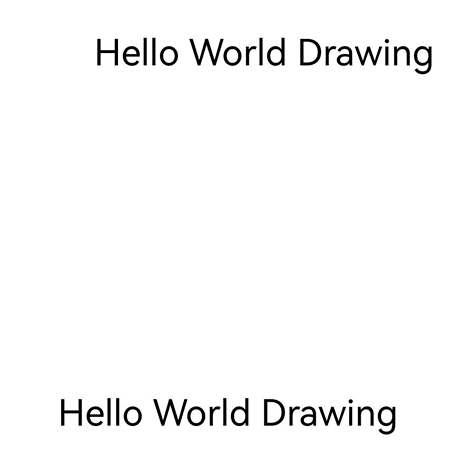

# Drawing and Displaying Complex Text (C/C++)
<!--Kit: ArkGraphics 2D-->
<!--Subsystem: Graphics-->
<!--Owner: @oh_wangxk; @gmiao522; @Lem0nC-->
<!--Designer: @liumingxiang-->
<!--Tester: @yhl0101-->
<!--Adviser: @ge-yafang-->
When drawing text, simple text can be drawn and displayed by selecting appropriate fonts, sizes, and colors. Additionally, complex text drawing is supported by setting other styles, languages, paragraphs, etc.

Complex text drawing involves the following scenarios:

- Multi-language text drawing and display

- Multi-line text drawing and display

- Multi-style text drawing and display

- Style copying, drawing, and display


## Multi-language text drawing and display

Multi-language support is the foundation of globalized applications. Multi-language text drawing needs to support the character sets of different languages and their unique display requirements, such as right-to-left languages (such as Arabic) or vertical text (such as Chinese). You need to understand the rendering features of different languages to ensure correct text display.

When multi-language text is used, you can specify the **locale** field in **TextStyle** to match the corresponding font, skipping the process of traversing the font list to save time and memory.

### Available APIs

| API Definition| Description| 
| -------- | -------- |
| void OH_Drawing_SetTypographyTextLocale(OH_Drawing_TypographyStyle\* style, const char\* locale) | Sets the locale for a typography style.| 


### How to Develop

For details about the **Canvas** object, see [Obtaining a Canvas and Displaying Drawing Results](canvas-get-result-draw-c.md).

<!-- @[complex_text_c_multilingual_text](https://gitcode.com/openharmony/applications_app_samples/blob/master/code/DocsSample/ArkGraphics2D/TextEngine/NDKComplexText1/entry/src/main/cpp/samples/draw_text_impl.cpp) -->

``` C++
// Create a TypographyStyle object, which is required for creating TypographyCreate.
OH_Drawing_TypographyStyle *typoStyle = OH_Drawing_CreateTypographyStyle();
// Set the text alignment mode to center.
OH_Drawing_SetTypographyTextAlign(typoStyle, TEXT_ALIGN_CENTER);
// Set the locale to Chinese.
OH_Drawing_SetTypographyTextLocale(typoStyle, "zh-Hans");

// Set the text color, size, and weight. If TextStyle is not set, the default TextStyle in TypographyStyle is used.
OH_Drawing_TextStyle *txtStyle = OH_Drawing_CreateTextStyle();
OH_Drawing_SetTextStyleColor(txtStyle, OH_Drawing_ColorSetArgb(0xFF, 0x00, 0x00, 0x00));
OH_Drawing_SetTextStyleFontSize(txtStyle, DIV_TEN(width_));
OH_Drawing_SetTextStyleFontWeight(txtStyle, FONT_WEIGHT_400);

// Create a FontCollection object to manage the font matching logic.
OH_Drawing_FontCollection *fc = OH_Drawing_CreateSharedFontCollection();
// Use the FontCollection object and the created TypographyStyle object to create a TypographyCreate object, which is used to create a Typography object.
OH_Drawing_TypographyCreate *handler = OH_Drawing_CreateTypographyHandler(typoStyle, fc);

// Add the created TextStyle object to handler.
OH_Drawing_TypographyHandlerPushTextStyle(handler, txtStyle);
// Add text to handler.
const char *text = "你好，中文\n";
OH_Drawing_TypographyHandlerAddText(handler, text);

// Create a Typography object based on handler.
OH_Drawing_Typography *typography = OH_Drawing_CreateTypography(handler);
// Set the maximum width.
double maxWidth = width_;
OH_Drawing_TypographyLayout(typography, maxWidth);
// Draw the text on the canvas.
OH_Drawing_TypographyPaint(typography, cCanvas_, 0, DIV_TEN(width_));

// Release the memory.
OH_Drawing_DestroyTypographyStyle(typoStyle);
OH_Drawing_DestroyTextStyle(txtStyle);
OH_Drawing_DestroyFontCollection(fc);
OH_Drawing_DestroyTypographyHandler(handler);
OH_Drawing_DestroyTypography(typography);
```

### Effect


## Multi-line Text Drawing and Display

Multi-line text is more complex than single-line text. Generally, text typography, word break, text alignment, line limit, etc., are required for multi-line text, mainly achieved by setting paragraph styles.


### Available APIs

| API Definition| Description| 
| -------- | -------- |
| void OH_Drawing_SetTypographyTextAlign(OH_Drawing_TypographyStyle\* style, int align) | Sets the text alignment mode.| 
| void OH_Drawing_SetTypographyTextWordBreakType(OH_Drawing_TypographyStyle\* style, int wordBreakType) | Sets the word break type.| 
| void OH_Drawing_SetTypographyTextMaxLines(OH_Drawing_TypographyStyle\* style, int lineNumber) | Sets the maximum number of lines in the text.| 


### How to Develop

The following uses the **BREAK_ALL** word break policy as an example. The same method applies to other word break policies.

<!-- @[complex_text_c_break_all_text](https://gitcode.com/openharmony/applications_app_samples/blob/master/code/DocsSample/ArkGraphics2D/TextEngine/NDKComplexText1/entry/src/main/cpp/samples/draw_text_impl.cpp) -->

``` C++
// Create a FontCollection object to manage the font matching logic.
OH_Drawing_FontCollection *fc = OH_Drawing_CreateSharedFontCollection();

// Set the text color, size, and weight. If TextStyle is not set, the default TextStyle in TypographyStyle is used.
OH_Drawing_TextStyle *txtStyle = OH_Drawing_CreateTextStyle();
OH_Drawing_SetTextStyleColor(txtStyle, OH_Drawing_ColorSetArgb(0xFF, 0x00, 0x00, 0x00));
OH_Drawing_SetTextStyleFontSize(txtStyle, DIV_TWENTY(width_));
OH_Drawing_SetTextStyleFontWeight(txtStyle, FONT_WEIGHT_400);

// Add text.
const char *text =
    "Nunc quis augue viverra, venenatis arcu eu, gravida odio. Integer posuere nisi quis ex pretium, a dapibus "
    "nisl gravida. Mauris lacinia accumsan enim, non tempus ligula. Mauris iaculis dui eu nisi tristique, in porta "
    "urna varius. Orci varius natoque penatibus et magnis dis parturient montes, nascetur ridiculus mus. Mauris "
    "congue nibh mi, vel ultrices ex volutpat et. Aliquam consectetur odio in libero tristique, a mattis ex "
    "mollis. Praesent et nisl iaculis, facilisis metus nec, faucibus lacus. Duis nec dolor at nibh eleifend "
    "tempus. Nunc et enim interdum, commodo eros ac, pretium sapien. Pellentesque laoreet orci a nunc pharetra "
    "pharetra.";

// Create a TypographyStyle object with the word break policy set to BREAK_ALL.
OH_Drawing_TypographyStyle *typoStyle = OH_Drawing_CreateTypographyStyle();
// Set the text alignment mode to center.
OH_Drawing_SetTypographyTextAlign(typoStyle, TEXT_ALIGN_CENTER);
// Set the word break policy to WORD_BREAK_TYPE_BREAK_ALL.
OH_Drawing_SetTypographyTextWordBreakType(typoStyle, OH_Drawing_WordBreakType::WORD_BREAK_TYPE_BREAK_ALL);
// Set the maximum number of lines to 10. Lines beyond the maximum number are not displayed.
OH_Drawing_SetTypographyTextMaxLines(typoStyle, 10);

// Use the created FontCollection and TypographyStyle objects to create a TypographyCreate object, which is used to create a Typography object.
OH_Drawing_TypographyCreate *handler = OH_Drawing_CreateTypographyHandler(typoStyle, fc);
// Add the created TextStyle object to handler.
OH_Drawing_TypographyHandlerPushTextStyle(handler, txtStyle);
// Add the text to handler.
OH_Drawing_TypographyHandlerAddText(handler, text);

OH_Drawing_Typography *typography = OH_Drawing_CreateTypography(handler);
// Set the maximum width.
double maxWidth = width_;
OH_Drawing_TypographyLayout(typography, maxWidth);
// Draw the text on the canvas.
OH_Drawing_TypographyPaint(typography, cCanvas_, 0, DIV_TEN(width_));

// Release the memory.
OH_Drawing_DestroyFontCollection(fc);
OH_Drawing_DestroyTextStyle(txtStyle);
OH_Drawing_DestroyTypographyStyle(typoStyle);
OH_Drawing_DestroyTypographyHandler(handler);
OH_Drawing_DestroyTypography(typography);
```

| BREAK_ALL | BREAK_WORD | 
| -------- | -------- |
|  |  | 

| BREAK_HYPHEN (locale: Not Set)| BREAK_HYPHEN (locale: en-gb)| BREAK_HYPHEN (locale: en-us)| 
| -------- | -------- |-------- |
|  |  |  |

## Multi-style Text Drawing and Display

In addition to the basic text and typography attributes, you may need to set different drawing styles or capabilities for different text designs in applications to highlight the unique performance or style of the corresponding text. In this case, you can use multiple drawing styles to render the text.

The following lists the multi-style drawing supported by the current version and the effects of each drawing style:

- **Decoration**: decorates the text with different line styles, which can make the text more prominent and expressive.

- **Font feature**: alters the appearance of the text through font changes, including thickness, italics and other features, to enhance the readability and aesthetics of the text.

- **Font variation**: flexibly adjusts the text in different display environments and devices for more refined visual effects.

- **Text shadow**: adds shadow effects around the text to enhance the text's sense of depth and three-dimensionality, making the text more attractive.

- **Placeholder**: maintains the stability of the text layout when the text content is uncertain, making text display smoother and more natural.

- **Automatic spacing**: adds extra spacing in places where characters are mixed and switched, improving the reading experience.

- **Gradient color**: provides gradient color effects for text to enhance text expressiveness.

- **Vertical alignment**: adjusts the typography position of text in the vertical direction to improve typography quality.

- **Superscript and subscript**: processes any character into superscript or subscript.

- **High-contrast text**: turns dark text black and light text white to enhance the contrast effect of the text.

- **Line height adjustment**: adjusts the line height to change the vertical spacing of text lines, making the line spacing looser or tighter, significantly addressing the problem of vertical truncation of text and improving readability.

- **Line spacing adjustment**: adjusts the line spacing to change the line height, optimizing the reading experience.

### Decoration

Decoration is a decorative line added above, below, or in the middle of the text. Currently, the overline, underline, and strikethrough are supported.

You can add text decoration lines to enhance the visual effect and readability of the text.

To use decoration lines, you need to initialize the decoration line style object and add it to the text style so that the decoration lines take effect when the text is drawn.


| API Definition| Description| 
| -------- | -------- |
| void OH_Drawing_SetTextStyleDecoration(OH_Drawing_TextStyle\* style, int decoration) | Sets the decoration for a text style. Only one decoration can be set. To add multiple decorations, use **OH_Drawing_AddTextStyleDecoration**.| 
| void OH_Drawing_SetTextStyleDecorationStyle(OH_Drawing_TextStyle\* style, int decorationStyle) | Sets the decoration style for a text style.| 
| void OH_Drawing_SetTextStyleDecorationColor(OH_Drawing_TextStyle\* style, uint32_t color) | Sets the decoration color for a text style.| 


The following is an example:

<!-- @[complex_text_c_decoration_text](https://gitcode.com/openharmony/applications_app_samples/blob/master/code/DocsSample/ArkGraphics2D/TextEngine/NDKComplexText1/entry/src/main/cpp/samples/draw_text_impl.cpp) -->

``` C++
// Create a TypographyStyle object, which is required for creating Typography.
OH_Drawing_TypographyStyle *typoStyle = OH_Drawing_CreateTypographyStyle();
// Set the text alignment mode to center.
OH_Drawing_SetTypographyTextAlign(typoStyle, TEXT_ALIGN_CENTER);
// Add text.
const char *text = "Hello World Drawing\n";

// Set the text color, size, and weight. If TextStyle is not set, the default TextStyle in TypographyStyle is used.
OH_Drawing_TextStyle *txtStyleWithDeco = OH_Drawing_CreateTextStyle();
OH_Drawing_SetTextStyleColor(txtStyleWithDeco, OH_Drawing_ColorSetArgb(0xFF, 0x00, 0x00, 0x00));
OH_Drawing_SetTextStyleFontSize(txtStyleWithDeco, DIV_TEN(width_));
OH_Drawing_SetTextStyleFontWeight(txtStyleWithDeco, FONT_WEIGHT_400);
// Set the decoration to LINE_THROUGH.
OH_Drawing_SetTextStyleDecoration(txtStyleWithDeco, TEXT_DECORATION_LINE_THROUGH);
// Set the decoration style to WAVY.
OH_Drawing_SetTextStyleDecorationStyle(txtStyleWithDeco, TEXT_DECORATION_STYLE_WAVY);
// Set the decoration color.
OH_Drawing_SetTextStyleDecorationColor(txtStyleWithDeco, OH_Drawing_ColorSetArgb(0xFF, 0x6F, 0xFF, 0xFF));

// Create a TextStyle object without any decoration for comparison.
OH_Drawing_TextStyle *txtStyleNoDeco = OH_Drawing_CreateTextStyle();
// Set the text color, size, and weight. If TextStyle is not set, the default TextStyle in TypographyStyle is used.
OH_Drawing_SetTextStyleColor(txtStyleNoDeco, OH_Drawing_ColorSetArgb(0xFF, 0x00, 0x00, 0x00));
OH_Drawing_SetTextStyleFontSize(txtStyleNoDeco, DIV_TEN(width_));
OH_Drawing_SetTextStyleFontWeight(txtStyleNoDeco, FONT_WEIGHT_400);

// Create a FontCollection object to manage the font matching logic.
OH_Drawing_FontCollection *fc = OH_Drawing_CreateSharedFontCollection();
// Use the FontCollection object and the created TypographyStyle object to create a TypographyCreate object, which is used to create a Typography object.
OH_Drawing_TypographyCreate *handler = OH_Drawing_CreateTypographyHandler(typoStyle, fc);

// Add a text style with decoration.
OH_Drawing_TypographyHandlerPushTextStyle(handler, txtStyleWithDeco);
// Add the text to handler.
OH_Drawing_TypographyHandlerAddText(handler, text);

// Add a text style without decoration.
OH_Drawing_TypographyHandlerPushTextStyle(handler, txtStyleNoDeco);
// Add the text to handler.
OH_Drawing_TypographyHandlerAddText(handler, text);

OH_Drawing_Typography *typography = OH_Drawing_CreateTypography(handler);
// Set the maximum width.
double maxWidth = width_;
OH_Drawing_TypographyLayout(typography, maxWidth);
// Draw the text on the canvas.
OH_Drawing_TypographyPaint(typography, cCanvas_, 0, DIV_TEN(width_));

// Release the memory.
OH_Drawing_DestroyTypographyStyle(typoStyle);
OH_Drawing_DestroyTextStyle(txtStyleWithDeco);
OH_Drawing_DestroyTextStyle(txtStyleNoDeco);
OH_Drawing_DestroyFontCollection(fc);
OH_Drawing_DestroyTypographyHandler(handler);
OH_Drawing_DestroyTypography(typography);
```


### Font Feature

**FontFeature** focus on processing font features (such as bold, italic, and font variants) during text rendering. It allows fonts to display different effects in different typesetting scenarios, enhancing the expressiveness of text to better meet design and reading requirements.

Common **FontFeature** includes liga, frac, and case, which can be enabled only when the corresponding TTF file is supported.


| API Definition| Description| 
| -------- | -------- |
| void OH_Drawing_TextStyleAddFontFeature(OH_Drawing_TextStyle\* style, const char\* tag, int value) | Adds a font feature for a text style.| 


The following is an example:

<!-- @[complex_text_c_font_feature_text](https://gitcode.com/openharmony/applications_app_samples/blob/master/code/DocsSample/ArkGraphics2D/TextEngine/NDKComplexText1/entry/src/main/cpp/samples/draw_text_impl.cpp) -->

``` C++
// Create a TypographyStyle object, which is required for creating TypographyCreate.
OH_Drawing_TypographyStyle *typoStyle = OH_Drawing_CreateTypographyStyle();
// Set the text alignment mode to center.
OH_Drawing_SetTypographyTextAlign(typoStyle, TEXT_ALIGN_CENTER);
// Add text.
const char *text = "1/2 1/3 1/4\n";

// Set the text color, size, and weight. If TextStyle is not set, the text cannot be drawn.
OH_Drawing_TextStyle *txtStyleWithFeature = OH_Drawing_CreateTextStyle();
OH_Drawing_SetTextStyleColor(txtStyleWithFeature, OH_Drawing_ColorSetArgb(0xFF, 0x00, 0x00, 0x00));
OH_Drawing_SetTextStyleFontSize(txtStyleWithFeature, DIV_TEN(width_));
OH_Drawing_SetTextStyleFontWeight(txtStyleWithFeature, FONT_WEIGHT_900);
// Enable the frac font feature. This feature replaces numbers separated by slashes with common (diagonal) fractions.
OH_Drawing_TextStyleAddFontFeature(txtStyleWithFeature, "frac", 1);

// Create a TextStyle object without any font feature for comparison.
OH_Drawing_TextStyle *txtStyleNoFeature = OH_Drawing_CreateTextStyle();
// Set the text color, size, and weight. If TextStyle is not set, the text cannot be drawn.
OH_Drawing_SetTextStyleColor(txtStyleNoFeature, OH_Drawing_ColorSetArgb(0xFF, 0x00, 0x00, 0x00));
OH_Drawing_SetTextStyleFontSize(txtStyleNoFeature, DIV_TEN(width_));
OH_Drawing_SetTextStyleFontWeight(txtStyleNoFeature, FONT_WEIGHT_900);

// Create a FontCollection object to manage the font matching logic.
OH_Drawing_FontCollection *fc = OH_Drawing_CreateSharedFontCollection();
// Use the FontCollection object and the created TypographyStyle object to create a TypographyCreate object, which is used to create a Typography object.
OH_Drawing_TypographyCreate *handler = OH_Drawing_CreateTypographyHandler(typoStyle, fc);

// Add a text style with font features.
OH_Drawing_TypographyHandlerPushTextStyle(handler, txtStyleWithFeature);
// Add the text to handler.
OH_Drawing_TypographyHandlerAddText(handler, text);
// Destroy the created TextStyle object.
OH_Drawing_TypographyHandlerPopTextStyle(handler);

// Add a text style without font features.
OH_Drawing_TypographyHandlerPushTextStyle(handler, txtStyleNoFeature);
// Add the text to handler.
OH_Drawing_TypographyHandlerAddText(handler, text);
// Destroy the created TextStyle object.
OH_Drawing_TypographyHandlerPopTextStyle(handler);

OH_Drawing_Typography *typography = OH_Drawing_CreateTypography(handler);
// Set the maximum width.
double maxWidth = width_;
OH_Drawing_TypographyLayout(typography, maxWidth);
// Draw the text on the canvas.
OH_Drawing_TypographyPaint(typography, cCanvas_, 0, DIV_TEN(width_));

// Release the memory.
OH_Drawing_DestroyTypographyStyle(typoStyle);
OH_Drawing_DestroyTextStyle(txtStyleWithFeature);
OH_Drawing_DestroyTextStyle(txtStyleNoFeature);
OH_Drawing_DestroyFontCollection(fc);
OH_Drawing_DestroyTypographyHandler(handler);
OH_Drawing_DestroyTypography(typography);
```


### Font Variation

Font variation is a font format that contains multiple glyph variants in a single font file. It allows you to flexibly adjust various font attributes (such as font weight, font width, and italic) in a single font file.

Unlike regular font files (each variant requires an independent file), font variation contain multiple variant axes in a single font file to implement smooth transition during text rendering and drawing.


| API Definition| Description| 
| -------- | -------- |
| void OH_Drawing_TextStyleAddFontVariation(OH_Drawing_TextStyle\* style, const char\* axis, const float value) | Adds a font variation. This function takes effect only when the corresponding font file (.ttf file) supports variable adjustment. Otherwise, calling this function does not take effect.| 


The following is an example:

<!-- @[complex_text_c_font_variation_text](https://gitcode.com/openharmony/applications_app_samples/blob/master/code/DocsSample/ArkGraphics2D/TextEngine/NDKComplexText1/entry/src/main/cpp/samples/draw_text_impl.cpp) -->

``` C++
// Create a TypographyStyle object, which is required for creating Typography.
OH_Drawing_TypographyStyle *typoStyle = OH_Drawing_CreateTypographyStyle();
// Set the text alignment mode to center.
OH_Drawing_SetTypographyTextAlign(typoStyle, TEXT_ALIGN_CENTER);
// Set the text content.
const char *text = "Hello World Drawing\n";

OH_Drawing_TextStyle *txtStyleWithVar = OH_Drawing_CreateTextStyle();
// Set the font weight to 800. You can also set slnt and wdth if supported by the font file.
OH_Drawing_TextStyleAddFontVariation(txtStyleWithVar, "wght", 800);
// Set the text color, size, and weight. If TextStyle is not set, the default TextStyle in TypographyStyle is used.
OH_Drawing_SetTextStyleColor(txtStyleWithVar, OH_Drawing_ColorSetArgb(0xFF, 0x00, 0x00, 0x00));
OH_Drawing_SetTextStyleFontSize(txtStyleWithVar, DIV_TEN(width_));
// The font weight setting does not take effect and will be overwritten by the font weight of the font variation.
OH_Drawing_SetTextStyleFontWeight(txtStyleWithVar, FONT_WEIGHT_400);

// Create a TextStyle without font variation for comparison.
OH_Drawing_TextStyle *txtStyleNoVar = OH_Drawing_CreateTextStyle();
// Set the text color, size, and weight. If TextStyle is not set, the default TextStyle in TypographyStyle is used.
OH_Drawing_SetTextStyleColor(txtStyleNoVar, OH_Drawing_ColorSetArgb(0xFF, 0x00, 0x00, 0x00));
OH_Drawing_SetTextStyleFontSize(txtStyleNoVar, DIV_TEN(width_));
OH_Drawing_SetTextStyleFontWeight(txtStyleNoVar, FONT_WEIGHT_400);

// Create a FontCollection object to manage the font matching logic.
OH_Drawing_FontCollection *fc = OH_Drawing_CreateSharedFontCollection();
// Use the FontCollection object and the created TypographyStyle object to create a TypographyCreate object, which is used to create a Typography object.
OH_Drawing_TypographyCreate *handler = OH_Drawing_CreateTypographyHandler(typoStyle, fc);

// Add a text style with font variation.
OH_Drawing_TypographyHandlerPushTextStyle(handler, txtStyleWithVar);
// Add the text to handler.
OH_Drawing_TypographyHandlerAddText(handler, text);
// Display the created TextStyle object.
OH_Drawing_TypographyHandlerPopTextStyle(handler);

// Add a text style without font variation.
OH_Drawing_TypographyHandlerPushTextStyle(handler, txtStyleNoVar);
// Add the text to handler.
OH_Drawing_TypographyHandlerAddText(handler, text);
// Display the created TextStyle object.
OH_Drawing_TypographyHandlerPopTextStyle(handler);

OH_Drawing_Typography *typography = OH_Drawing_CreateTypography(handler);
// Set the maximum width.
double maxWidth = width_;
OH_Drawing_TypographyLayout(typography, maxWidth);
// Draw the text on the canvas.
OH_Drawing_TypographyPaint(typography, cCanvas_, 0, DIV_TEN(width_));

// Release the memory.
OH_Drawing_DestroyTypographyStyle(typoStyle);
OH_Drawing_DestroyTextStyle(txtStyleWithVar);
OH_Drawing_DestroyTextStyle(txtStyleNoVar);
OH_Drawing_DestroyFontCollection(fc);
OH_Drawing_DestroyTypographyHandler(handler);
OH_Drawing_DestroyTypography(typography);
```




### Text Shadow

Text shadow creates a 3D effect for text by adding depth against the background. It is usually used to improve the visual appeal or readability of text, especially in scenarios with low color contrast.

**TextShadow** has three attributes: **color** (shadow color), **point** (shadow offset from the text), and **blurRadius** (shadow radius).

To use the shadow effect, you need to set the shadow effect array in the text style so that the shadow effect takes effect when the text is drawn.


| API Definition| Description| 
| -------- | -------- |
| OH_Drawing_Point\* OH_Drawing_PointCreate(float x, float y) | Creates an **OH_Drawing_Point** object.| 
| OH_Drawing_TextShadow\* OH_Drawing_CreateTextShadow(void) | Creates an **OH_Drawing_TextShadow** object.| 
| void OH_Drawing_SetTextShadow(OH_Drawing_TextShadow\* shadow, uint32_t color, OH_Drawing_Point\* offset, double blurRadius) | Sets a text shadow.| 
| void OH_Drawing_TextStyleAddShadow(OH_Drawing_TextStyle\* style, const OH_Drawing_TextShadow\* shadow) | Adds a shadow to a text shadow container.| 
| void OH_Drawing_DestroyTextShadow(OH_Drawing_TextShadow\* shadow) | Destroys an **OH_Drawing_TextShadow** object and reclaims the memory occupied by the object.| 


The following is an example:

<!-- @[complex_text_c_shadow_text](https://gitcode.com/openharmony/applications_app_samples/blob/master/code/DocsSample/ArkGraphics2D/TextEngine/NDKComplexText1/entry/src/main/cpp/samples/draw_text_impl.cpp) -->

``` C++
// Create a TypographyStyle object, which is required for creating Typography.
OH_Drawing_TypographyStyle *typoStyle = OH_Drawing_CreateTypographyStyle();
// Set the text alignment mode to center.
OH_Drawing_SetTypographyTextAlign(typoStyle, TEXT_ALIGN_CENTER);
// Add text.
const char *text = "Hello World Drawing\n";

// Set the text color, size, and weight. If TextStyle is not set, the default TextStyle in TypographyStyle is used.
OH_Drawing_TextStyle *txtStyleWithShadow = OH_Drawing_CreateTextStyle();
OH_Drawing_SetTextStyleColor(txtStyleWithShadow, OH_Drawing_ColorSetArgb(0xFF, 0x00, 0x00, 0x00));
OH_Drawing_SetTextStyleFontSize(txtStyleWithShadow, DIV_TEN(width_));
OH_Drawing_SetTextStyleFontWeight(txtStyleWithShadow, FONT_WEIGHT_400);
// Set the shadow offset.
OH_Drawing_Point *offset = OH_Drawing_PointCreate(1, 1);
OH_Drawing_TextShadow *shadow = OH_Drawing_CreateTextShadow();
double radius = 10.0;
// Set the style for TextShadow.
OH_Drawing_SetTextShadow(shadow, OH_Drawing_ColorSetArgb(0xFF, 0x00, 0x00, 0x00), offset, radius);
// Add TextShadow to TextStyle.
OH_Drawing_TextStyleAddShadow(txtStyleWithShadow, shadow);

// Create a TextStyle object without any shadow for comparison.
OH_Drawing_TextStyle *txtStyleNoShadow = OH_Drawing_CreateTextStyle();
// Set the text color, size, and weight. If TextStyle is not set, the default TextStyle in TypographyStyle is used.
OH_Drawing_SetTextStyleColor(txtStyleNoShadow, OH_Drawing_ColorSetArgb(0xFF, 0x00, 0x00, 0x00));
OH_Drawing_SetTextStyleFontSize(txtStyleNoShadow, DIV_TEN(width_));
OH_Drawing_SetTextStyleFontWeight(txtStyleNoShadow, FONT_WEIGHT_400);

// Create a FontCollection object to manage the font matching logic.
OH_Drawing_FontCollection *fc = OH_Drawing_CreateSharedFontCollection();
// Use the FontCollection object and the created TypographyStyle object to create a TypographyCreate object, which is used to create a Typography object.
OH_Drawing_TypographyCreate *handler = OH_Drawing_CreateTypographyHandler(typoStyle, fc);

// Add a text style with a shadow.
OH_Drawing_TypographyHandlerPushTextStyle(handler, txtStyleWithShadow);
// Add the text to handler.
OH_Drawing_TypographyHandlerAddText(handler, text);

// Add a text style without a shadow.
OH_Drawing_TypographyHandlerPushTextStyle(handler, txtStyleNoShadow);
// Add the text to handler.
OH_Drawing_TypographyHandlerAddText(handler, text);

OH_Drawing_Typography *typography = OH_Drawing_CreateTypography(handler);
// Set the maximum width.
double maxWidth = width_;
OH_Drawing_TypographyLayout(typography, maxWidth);
// Draw the text on the canvas.
OH_Drawing_TypographyPaint(typography, cCanvas_, 0, DIV_TEN(width_));

// Release the memory.
OH_Drawing_DestroyTypographyStyle(typoStyle);
OH_Drawing_DestroyTextStyle(txtStyleWithShadow);
OH_Drawing_PointDestroy(offset);
OH_Drawing_DestroyTextShadow(shadow);
OH_Drawing_DestroyTextStyle(txtStyleNoShadow);
OH_Drawing_DestroyFontCollection(fc);
OH_Drawing_DestroyTypographyHandler(handler);
OH_Drawing_DestroyTypography(typography);
```




### Placeholder

Placeholder drawing is used to render placeholder symbols in the text.

Placeholder drawing is also used to implement image and text layout. It is a visual element used to provide or replace a position before the actual image or content is registered.


| API Definition| Description| 
| -------- | -------- |
| void OH_Drawing_TypographyHandlerAddPlaceholder(OH_Drawing_TypographyCreate\* handler, OH_Drawing_PlaceholderSpan\* span) | Adds a placeholder.| 


The following is an example:

<!-- @[complex_text_c_placeholder_text](https://gitcode.com/openharmony/applications_app_samples/blob/master/code/DocsSample/ArkGraphics2D/TextEngine/NDKComplexText1/entry/src/main/cpp/samples/draw_text_impl.cpp) -->

``` C++
// Set the maximum width.
double maxWidth = width_;
// Create a FontCollection object to manage the font matching logic.
OH_Drawing_FontCollection *fc = OH_Drawing_CreateSharedFontCollection();

// Set the text color, size, and weight. If TextStyle is not set, the default TextStyle in TypographyStyle is used.
OH_Drawing_TextStyle *txtStyle = OH_Drawing_CreateTextStyle();
OH_Drawing_SetTextStyleColor(txtStyle, OH_Drawing_ColorSetArgb(0xFF, 0x00, 0x00, 0x00));
OH_Drawing_SetTextStyleFontSize(txtStyle, DIV_TEN(width_));
OH_Drawing_SetTextStyleFontWeight(txtStyle, FONT_WEIGHT_400);

// Add text.
const char *text = "Hello World Drawing\n";

// Create a TypographyStyle object, which is required for creating Typography.
OH_Drawing_TypographyStyle *typoStyle = OH_Drawing_CreateTypographyStyle();
// Set the text alignment mode to center.
OH_Drawing_SetTypographyTextAlign(typoStyle, TEXT_ALIGN_CENTER);

// Use the FontCollection object and the created TypographyStyle object to create a TypographyCreate object, which is used to create a Typography object.
OH_Drawing_TypographyCreate *handlerWithPlaceholder = OH_Drawing_CreateTypographyHandler(typoStyle, fc);
// Create a placeholder and initialize its member variables.
OH_Drawing_PlaceholderSpan placeholder;
placeholder.width = DIV_TEN(width_);
placeholder.height = DIV_FIVE(width_);
placeholder.alignment = ALIGNMENT_ABOVE_BASELINE; // Baseline alignment.
placeholder.baseline = TEXT_BASELINE_ALPHABETIC; // Text baseline type.
placeholder.baselineOffset = 0.0; // Offset relative to the baseline. This parameter is valid only when the alignment policy is OFFSET_AT_BASELINE.

// Place the placeholder at the beginning.
OH_Drawing_TypographyHandlerAddPlaceholder(handlerWithPlaceholder, &placeholder);

// Add the created TextStyle object to handler.
OH_Drawing_TypographyHandlerPushTextStyle(handlerWithPlaceholder, txtStyle);
// Add the text to handler.
OH_Drawing_TypographyHandlerAddText(handlerWithPlaceholder, text);

OH_Drawing_Typography *typographyWithPlaceholder = OH_Drawing_CreateTypography(handlerWithPlaceholder);
OH_Drawing_TypographyLayout(typographyWithPlaceholder, maxWidth);
// Draw the text on the canvas.
OH_Drawing_TypographyPaint(typographyWithPlaceholder, cCanvas_, 0, DIV_TEN(width_));

// Create OH_Drawing_TypographyCreate.
OH_Drawing_TypographyCreate *handlerNoPlaceholder = OH_Drawing_CreateTypographyHandler(typoStyle, fc);
// Add the created TextStyle object to handler.
OH_Drawing_TypographyHandlerPushTextStyle(handlerNoPlaceholder, txtStyle);
// Add the text to handler.
OH_Drawing_TypographyHandlerAddText(handlerNoPlaceholder, text);

OH_Drawing_Typography *typographyNoPlaceholder = OH_Drawing_CreateTypography(handlerNoPlaceholder);

OH_Drawing_TypographyLayout(typographyNoPlaceholder, maxWidth);
// Draw the text on the canvas.
OH_Drawing_TypographyPaint(typographyNoPlaceholder, cCanvas_, 0, DIV_TWO(width_));

// Release the memory.
OH_Drawing_DestroyFontCollection(fc);
OH_Drawing_DestroyTextStyle(txtStyle);
OH_Drawing_DestroyTypographyStyle(typoStyle);
OH_Drawing_DestroyTypographyHandler(handlerWithPlaceholder);
OH_Drawing_DestroyTypographyHandler(handlerNoPlaceholder);
OH_Drawing_DestroyTypography(typographyWithPlaceholder);
OH_Drawing_DestroyTypography(typographyNoPlaceholder);
```




### Automatic Spacing

When automatic spacing is enabled, it applies between CJK (Chinese, Japanese, and Korean) and Western characters (Latin, Cyrillic, and Greek), between CJK and digits, between CJK and copyright symbols, between copyright symbols and digits, and between copyright symbols and Western characters. For example, in an English-Chinese mixed layout scenario, automatic spacing adds extra spacing in places where English and Chinese are switched, improving the reading experience.


| API Definition| Description| 
| -------- | -------- |
| void OH_Drawing_SetTypographyTextAutoSpace(OH_Drawing_TypographyStyle \*style, bool enableAutoSpace) |Sets whether to enable automatic spacing during text typography. This feature is disabled by default. If enabled, automatic spacing applies between CJK (Chinese, Japanese, and Korean) and Western characters (Latin, Cyrillic, and Greek), between CJK and digits, between CJK and copyright symbols, between copyright symbols and digits, and between copyright symbols and Western characters.| 


The following is an example:

<!-- @[complex_text_c_auto_space_text](https://gitcode.com/openharmony/applications_app_samples/blob/master/code/DocsSample/ArkGraphics2D/TextEngine/NDKComplexText1/entry/src/main/cpp/samples/draw_text_impl.cpp) -->

``` C++
// Create a TypographyStyle object, which is required for creating Typography.
OH_Drawing_TypographyStyle *typoStyle = OH_Drawing_CreateTypographyStyle();
// Enable automatic spacing. The default value is false.
OH_Drawing_SetTypographyTextAutoSpace(typoStyle, true);
// Set the text content.
const char *text = "test测试©test©测。";

OH_Drawing_TextStyle *txtStyle = OH_Drawing_CreateTextStyle();
// Set the text color, size, and weight. If TextStyle is not set, the default TextStyle in TypographyStyle is used.
OH_Drawing_SetTextStyleColor(txtStyle, OH_Drawing_ColorSetArgb(0xFF, 0x00, 0x00, 0x00));
OH_Drawing_SetTextStyleFontSize(txtStyle, DIV_TEN(width_));

// Create a FontCollection object to manage the font matching logic.
OH_Drawing_FontCollection *fc = OH_Drawing_CreateSharedFontCollection();
// Use the FontCollection object and the created TypographyStyle object to create a TypographyCreate object, which is used to create a Typography object.
OH_Drawing_TypographyCreate *handler = OH_Drawing_CreateTypographyHandler(typoStyle, fc);

// Add the text style to handler.
OH_Drawing_TypographyHandlerPushTextStyle(handler, txtStyle);
// Add the text to handler.
OH_Drawing_TypographyHandlerAddText(handler, text);
// Create a paragraph.
OH_Drawing_Typography *typography = OH_Drawing_CreateTypography(handler);
// Set the maximum width.
double maxWidth = width_;
// Apply the paragraph according to the typography width.
OH_Drawing_TypographyLayout(typography, maxWidth);
// Draw the text on the canvas.
OH_Drawing_TypographyPaint(typography, cCanvas_, 0, DIV_TEN(width_));

// Enable automatic spacing for comparison.
OH_Drawing_SetTypographyTextAutoSpace(typoStyle, false);

// Use the FontCollection object and the created TypographyStyle object to create a TypographyCreate object, which is used to create a Typography object.
OH_Drawing_TypographyCreate *handlerWithoutAutoSpace = OH_Drawing_CreateTypographyHandler(typoStyle, fc);

// Add the text style to handlerWithoutAutoSpace.
OH_Drawing_TypographyHandlerPushTextStyle(handlerWithoutAutoSpace, txtStyle);
// Add the text to handlerWithoutAutoSpace.
OH_Drawing_TypographyHandlerAddText(handlerWithoutAutoSpace, text);
// Create a paragraph.
OH_Drawing_Typography *typographyWithoutAutoSpace = OH_Drawing_CreateTypography(handlerWithoutAutoSpace);
// Apply the paragraph according to the typography width.
OH_Drawing_TypographyLayout(typographyWithoutAutoSpace, maxWidth);
// Draw the text on the canvas.
OH_Drawing_TypographyPaint(typographyWithoutAutoSpace, cCanvas_, 0, DIV_FOUR(width_));

// Release the memory.
OH_Drawing_DestroyTypographyStyle(typoStyle);
OH_Drawing_DestroyTextStyle(txtStyle);
OH_Drawing_DestroyFontCollection(fc);
OH_Drawing_DestroyTypographyHandler(handler);
OH_Drawing_DestroyTypographyHandler(handlerWithoutAutoSpace);
OH_Drawing_DestroyTypography(typography);
OH_Drawing_DestroyTypography(typographyWithoutAutoSpace);
```

| Paragraph Style Setting (Automatic Spacing)| Effect| 
| -------- | -------- |
| Disabled| | 
| Enabled| | 

### Gradients

Gradient color is a visual effect widely used in text design. It creates a smooth transition from one color to another by applying different colors to different parts of the text. You can use a shader to implement the gradient effect of text. For more information about shaders, see [Shader Effect](complex-drawing-effect-c.md#shader-effect).


| API Definition| Description| 
| -------- | -------- |
| void OH_Drawing_SetTextStyleForegroundBrush(OH_Drawing_TextStyle\* style, OH_Drawing_Brush* foregroundBrush) | Adds a foreground brush. The gradient shader attribute is attached to the foreground brush.| 


The following is an example:

<!-- @[complex_text_c_gradient_text](https://gitcode.com/openharmony/applications_app_samples/blob/master/code/DocsSample/ArkGraphics2D/TextEngine/NDKComplexText1/entry/src/main/cpp/samples/draw_text_impl.cpp) -->

``` C++
OH_Drawing_TypographyStyle *typoStyle = OH_Drawing_CreateTypographyStyle();
OH_Drawing_TextStyle *txtStyle = OH_Drawing_CreateTextStyle();
// Set the text size.
OH_Drawing_SetTextStyleFontSize(txtStyle, DIV_TEN(width_));
// Create a shader object and set the color, start point, and end point.
OH_Drawing_Point *startPt = OH_Drawing_PointCreate(0, 0);
// The end point is (900, 900).
OH_Drawing_Point *endPt = OH_Drawing_PointCreate(900, 900);
uint32_t colors[] = {0xFFFFFF00, 0xFFFF0000, 0xFF0000FF};
float pos[] = {0.0f, 0.5f, 1.0f};
// The length of the pos array is 3.
OH_Drawing_ShaderEffect *colorShaderEffect =
    OH_Drawing_ShaderEffectCreateLinearGradient(startPt, endPt, colors, pos, 3, OH_Drawing_TileMode::CLAMP);
// Create a brush object and add the shader to the brush.
OH_Drawing_Brush *brush = OH_Drawing_BrushCreate();
OH_Drawing_BrushSetShaderEffect(brush, colorShaderEffect);
// Add the brush to the text style.
OH_Drawing_SetTextStyleForegroundBrush(txtStyle, brush);
// Create a typography object and draw the text.
OH_Drawing_FontCollection *fc = OH_Drawing_CreateSharedFontCollection();
OH_Drawing_TypographyCreate *handler = OH_Drawing_CreateTypographyHandler(typoStyle, fc);
OH_Drawing_TypographyHandlerPushTextStyle(handler, txtStyle);
const char *text = "Hello World";
OH_Drawing_TypographyHandlerAddText(handler, text);
OH_Drawing_Typography *typography = OH_Drawing_CreateTypography(handler);
// Set the maximum width.
double maxWidth = width_;
// Apply the paragraph according to the typography width.
OH_Drawing_TypographyLayout(typography, maxWidth);
OH_Drawing_TypographyPaint(typography, cCanvas_, 0, DIV_TEN(width_));

// Release the object.
OH_Drawing_DestroyFontCollection(fc);
OH_Drawing_ShaderEffectDestroy(colorShaderEffect);
OH_Drawing_BrushDestroy(brush);
OH_Drawing_DestroyTextStyle(txtStyle);
OH_Drawing_DestroyTypographyStyle(typoStyle);
OH_Drawing_DestroyTypographyHandler(handler);
OH_Drawing_DestroyTypography(typography);
```


### Vertical Alignment

Vertical alignment is used to adjust the vertical layout position of text in a line. Vertical alignment aligns the text to the top, center, bottom, or baseline (default) when line height scaling is enabled or when text in different font sizes is mixed in a line.

| API Definition| Description| 
| -------- | -------- |
| void OH_Drawing_SetTypographyVerticalAlignment(OH_Drawing_TypographyStyle* style, OH_Drawing_TextVerticalAlignment align) | Sets the vertical typography mode of text.| 

The following is an example:

<!-- @[complex_text_c_vertical_alignment_text](https://gitcode.com/openharmony/applications_app_samples/blob/master/code/DocsSample/ArkGraphics2D/TextEngine/NDKComplexText1/entry/src/main/cpp/samples/draw_text_impl.cpp) -->

``` C++
OH_Drawing_TypographyStyle *typoStyle = OH_Drawing_CreateTypographyStyle();
OH_Drawing_TextStyle *txtStyle = OH_Drawing_CreateTextStyle();
// Set the vertical alignment mode.
OH_Drawing_SetTypographyVerticalAlignment(typoStyle,
                                          OH_Drawing_TextVerticalAlignment::TEXT_VERTICAL_ALIGNMENT_CENTER);
// Set the text size.
OH_Drawing_SetTextStyleFontSize(txtStyle, DIV_TEN(width_));
// Set the text color.
OH_Drawing_SetTextStyleColor(txtStyle, OH_Drawing_ColorSetArgb(0xFF, 0x00, 0x00, 0x00));
// Create a typography object and draw the text.
OH_Drawing_FontCollection *fc = OH_Drawing_CreateSharedFontCollection();
OH_Drawing_TypographyCreate *handler = OH_Drawing_CreateTypographyHandler(typoStyle, fc);
OH_Drawing_TypographyHandlerPushTextStyle(handler, txtStyle);
const char *text = "VerticalAlignment-center";
OH_Drawing_TypographyHandlerAddText(handler, text);
OH_Drawing_Typography *typography = OH_Drawing_CreateTypography(handler);
// Set the maximum width.
double maxWidth = width_;
// Apply the paragraph according to the typography width.
OH_Drawing_TypographyLayout(typography, maxWidth);
OH_Drawing_TypographyPaint(typography, cCanvas_, 0, DIV_TEN(width_));

// Release the object.
OH_Drawing_DestroyFontCollection(fc);
OH_Drawing_DestroyTextStyle(txtStyle);
OH_Drawing_DestroyTypographyStyle(typoStyle);
OH_Drawing_DestroyTypographyHandler(handler);
OH_Drawing_DestroyTypography(typography);
```

The following figure shows the effect (The black box only shows the text drawing area and is not drawn in actual.).


### Superscript and Subscript

Superscript or subscript text can be enabled in cases such as mathematical and chemical formulas.

| API Definition| Description| 
| -------- | -------- |
| void OH_Drawing_SetTextStyleBadgeType(OH_Drawing_TextStyle* style, OH_Drawing_TextBadgeType textBadgeType) | Enables the superscript and subscript style.| 

The following is an example:

<!-- @[complex_text_c_badge_text](https://gitcode.com/openharmony/applications_app_samples/blob/master/code/DocsSample/ArkGraphics2D/TextEngine/NDKComplexText1/entry/src/main/cpp/samples/draw_text_impl.cpp) -->

``` C++
OH_Drawing_TypographyStyle *typoStyle = OH_Drawing_CreateTypographyStyle();
OH_Drawing_TextStyle *txtStyle = OH_Drawing_CreateTextStyle();
OH_Drawing_TextStyle *badgeTxtStyle = OH_Drawing_CreateTextStyle();
// Set the text size.
OH_Drawing_SetTextStyleFontSize(txtStyle, DIV_TWENTY(width_));
OH_Drawing_SetTextStyleFontSize(badgeTxtStyle, DIV_TWENTY(width_));
// Set the text color.
OH_Drawing_SetTextStyleColor(txtStyle, OH_Drawing_ColorSetArgb(0xFF, 0x00, 0x00, 0x00));
OH_Drawing_SetTextStyleColor(badgeTxtStyle, OH_Drawing_ColorSetArgb(0xFF, 0x00, 0x00, 0x00));
// Enable the superscript.
OH_Drawing_SetTextStyleBadgeType(badgeTxtStyle, OH_Drawing_TextBadgeType::TEXT_SUPERSCRIPT);
// Create a typography object and draw the text.
OH_Drawing_FontCollection *fc = OH_Drawing_CreateSharedFontCollection();
OH_Drawing_TypographyCreate *handler = OH_Drawing_CreateTypographyHandler(typoStyle, fc);
OH_Drawing_TypographyHandlerPushTextStyle(handler, txtStyle);
const char *text = "Mass-energy equivalence: E=mc";
OH_Drawing_TypographyHandlerAddText(handler, text);
OH_Drawing_TypographyHandlerPushTextStyle(handler, badgeTxtStyle);
const char *badgeText = "2";
OH_Drawing_TypographyHandlerAddText(handler, badgeText);
OH_Drawing_Typography *typography = OH_Drawing_CreateTypography(handler);
// Set the maximum width.
double maxWidth = width_;
// Apply the paragraph according to the typography width.
OH_Drawing_TypographyLayout(typography, maxWidth);
OH_Drawing_TypographyPaint(typography, cCanvas_, 0, DIV_TEN(width_));

// Release the object.
OH_Drawing_DestroyFontCollection(fc);
OH_Drawing_DestroyTextStyle(txtStyle);
OH_Drawing_DestroyTextStyle(badgeTxtStyle);
OH_Drawing_DestroyTypographyStyle(typoStyle);
OH_Drawing_DestroyTypographyHandler(handler);
OH_Drawing_DestroyTypography(typography);
```


### High Contrast

High contrast can change dark text to black and light text to white. You can enable or disable high contrast text rendering in your application, or follow the system settings.


| API Definition| Description| 
| -------- | -------- |
| void OH_Drawing_SetTextHighContrast(OH_Drawing_TextHighContrast action) | Sets the high contrast mode for text rendering. For details about the modes, see [OH_Drawing_TextHighContrast](../reference/apis-arkgraphics2d/capi-drawing-text-global-h.md#oh_drawing_texthighcontrast).| 


The following is an example:

<!-- @[complex_text_c_high_contrast_text](https://gitcode.com/openharmony/applications_app_samples/blob/master/code/DocsSample/ArkGraphics2D/TextEngine/NDKComplexText1/entry/src/main/cpp/samples/draw_text_impl.cpp) -->

``` C++
// Enable the high contrast mode for text rendering in the application. The priority of this mode is higher than the mode following the system settings.
OH_Drawing_SetTextHighContrast(TEXT_APP_ENABLE_HIGH_CONTRAST);
// Create a TypographyStyle object, which is required for creating Typography.
OH_Drawing_TypographyStyle *typoStyle = OH_Drawing_CreateTypographyStyle();

// Set the text color and size. If TextStyle is not set, the default TextStyle in TypographyStyle is used.
OH_Drawing_TextStyle *txtStyle = OH_Drawing_CreateTextStyle();
OH_Drawing_SetTextStyleColor(txtStyle, OH_Drawing_ColorSetArgb(0xFF, 0x6F, 0xFF, 0xFF));
OH_Drawing_SetTextStyleFontSize(txtStyle, DIV_TEN(width_));

// Create a FontCollection object to manage the font matching logic.
OH_Drawing_FontCollection *fc = OH_Drawing_CreateSharedFontCollection();
// Use the FontCollection object and the created TypographyStyle object to create a TypographyCreate object.
OH_Drawing_TypographyCreate *handler = OH_Drawing_CreateTypographyHandler(typoStyle, fc);

// Add the created TextStyle object to handler.
OH_Drawing_TypographyHandlerPushTextStyle(handler, txtStyle);
// Add text to handler.
const char *text = "Hello World Drawing\n";
OH_Drawing_TypographyHandlerAddText(handler, text);

OH_Drawing_Typography *typography = OH_Drawing_CreateTypography(handler);
// Set the maximum width.
double maxWidth = width_;
// Apply the paragraph according to the typography width.
OH_Drawing_TypographyLayout(typography, maxWidth);
// Draw the text on the canvas.
OH_Drawing_TypographyPaint(typography, cCanvas_, 0, DIV_TEN(width_));

// Release the memory.
OH_Drawing_DestroyTypographyStyle(typoStyle);
OH_Drawing_DestroyTextStyle(txtStyle);
OH_Drawing_DestroyFontCollection(fc);
OH_Drawing_DestroyTypographyHandler(handler);
OH_Drawing_DestroyTypography(typography);
```

| High Contrast| Effect| 
| -------- | -------- |
| Disabled| | 
| Enabled| | 

### Line Height Adjustment

Adjusting the line height can change the vertical spacing of text lines, making the line spacing looser or tighter, significantly addressing the problem of vertical truncation of text and improving readability.

You can adjust the line height either by setting the maximum and minimum line heights or using a line height scaling coefficient.

**Method 1**

Starting from API version 21, you can set the maximum and minimum line heights for text lines.

| API Definition| Description| 
| -------- | -------- |
| [OH_Drawing_ErrorCode OH_Drawing_SetTextStyleAttributeDouble(OH_Drawing_TextStyle* style, OH_Drawing_TextStyleAttributeId id, double value)](../reference/apis-arkgraphics2d/capi-drawing-text-typography-h.md#oh_drawing_settextstyleattributedouble) | Sets the maximum line height. The input ID is **OH_Drawing_TextStyleAttributeId::TEXT_STYLE_ATTR_D_LINE_HEIGHT_MAXIMUM**.|
| [OH_Drawing_ErrorCode OH_Drawing_SetTextStyleAttributeDouble(OH_Drawing_TextStyle* style, OH_Drawing_TextStyleAttributeId id, double value)](../reference/apis-arkgraphics2d/capi-drawing-text-typography-h.md#oh_drawing_settextstyleattributedouble) | Sets the minimum line height. The input ID is **OH_Drawing_TextStyleAttributeId::TEXT_STYLE_ATTR_D_LINE_HEIGHT_MINIMUM**.|

The following is an example:
<!-- @[complex_text_c_line_height_limit_one_text](https://gitcode.com/openharmony/applications_app_samples/blob/master/code/DocsSample/ArkGraphics2D/TextEngine/NDKComplexText1/entry/src/main/cpp/samples/draw_text_impl.cpp) -->

``` C++
OH_Drawing_TypographyStyle *typoStyle = OH_Drawing_CreateTypographyStyle();
OH_Drawing_TextStyle *txtStyle = OH_Drawing_CreateTextStyle();
// Set the text size to 50.
OH_Drawing_SetTextStyleFontSize(txtStyle, 50);
// Set the text color.
OH_Drawing_SetTextStyleColor(txtStyle, OH_Drawing_ColorSetArgb(0xFF, 0x00, 0x00, 0x00));
OH_Drawing_SetTextStyleAttributeDouble(txtStyle,
    OH_Drawing_TextStyleAttributeId::TEXT_STYLE_ATTR_D_LINE_HEIGHT_MAXIMUM, 65); // Set the maximum line height to 65.
OH_Drawing_SetTextStyleAttributeDouble(txtStyle,
    OH_Drawing_TextStyleAttributeId::TEXT_STYLE_ATTR_D_LINE_HEIGHT_MINIMUM, 65); // Set the minimum line height to 65.
// Create a typography object and draw the text.
OH_Drawing_FontCollection *fc = OH_Drawing_CreateSharedFontCollection();
OH_Drawing_TypographyCreate *handler = OH_Drawing_CreateTypographyHandler(typoStyle, fc);
OH_Drawing_TypographyHandlerPushTextStyle(handler, txtStyle);
const char *text = "Hello World!";
OH_Drawing_TypographyHandlerAddText(handler, text);
OH_Drawing_Typography *typography = OH_Drawing_CreateTypography(handler);
// Set the typography width to 1000.
OH_Drawing_TypographyLayout(typography, 1000);
OH_Drawing_TypographyPaint(typography, cCanvas_, 0, 0);

// Release the object.
OH_Drawing_DestroyFontCollection(fc);
OH_Drawing_DestroyTextStyle(txtStyle);
OH_Drawing_DestroyTypographyStyle(typoStyle);
OH_Drawing_DestroyTypographyHandler(handler);
OH_Drawing_DestroyTypography(typography);
```
  
The following figures show the effect.

| Maximum Line Height| Minimum Line Height| Effect (The black box only shows the text drawing area and is not drawn in actual.)|
| -------- | -------- | -------- |
| 65 | 65 |  |
| 200 | 200 |  |

**Method 2**

Set the line height scaling coefficient.

| API Definition| Description| 
| -------- | -------- |
| [void OH_Drawing_SetTextStyleFontHeight(OH_Drawing_TextStyle* style, double fontHeight)](../reference/apis-arkgraphics2d/capi-drawing-text-typography-h.md#oh_drawing_settextstylefontheight) | Enables line height scaling.|
| [OH_Drawing_ErrorCode OH_Drawing_SetTextStyleAttributeInt(OH_Drawing_TextStyle* style, OH_Drawing_TextStyleAttributeId id)](../reference/apis-arkgraphics2d/capi-drawing-text-typography-h.md#oh_drawing_settextstyleattributeint) | Enables the line height scaling style. The input ID is **OH_Drawing_TextStyleAttributeId::TEXT_STYLE_ATTR_I_LINE_HEIGHT_STYLE**.|

The following is an example:
<!-- @[complex_text_c_line_height_limit_two_text](https://gitcode.com/openharmony/applications_app_samples/blob/master/code/DocsSample/ArkGraphics2D/TextEngine/NDKComplexText1/entry/src/main/cpp/samples/draw_text_impl.cpp) -->

``` C++
OH_Drawing_TypographyStyle *typoStyle = OH_Drawing_CreateTypographyStyle();
OH_Drawing_TextStyle *txtStyle = OH_Drawing_CreateTextStyle();
// Set the text size to 50.
OH_Drawing_SetTextStyleFontSize(txtStyle, 50);
// Set the text color.
OH_Drawing_SetTextStyleColor(txtStyle, OH_Drawing_ColorSetArgb(0xFF, 0x00, 0x00, 0x00));
// Set the line height scaling coefficient to 1.5.
OH_Drawing_SetTextStyleFontHeight(txtStyle, 1.5);
// Set the line height scaling style. (1 indicates that the line height scaling uses the glyph height as the scaling base.)
OH_Drawing_SetTextStyleAttributeInt(txtStyle,
    OH_Drawing_TextStyleAttributeId::TEXT_STYLE_ATTR_I_LINE_HEIGHT_STYLE, 1);
// Create a typography object and draw the text.
OH_Drawing_FontCollection *fc = OH_Drawing_CreateSharedFontCollection();
OH_Drawing_TypographyCreate *handler = OH_Drawing_CreateTypographyHandler(typoStyle, fc);
OH_Drawing_TypographyHandlerPushTextStyle(handler, txtStyle);
const char *text = "Hello World!";
OH_Drawing_TypographyHandlerAddText(handler, text);
OH_Drawing_Typography *typography = OH_Drawing_CreateTypography(handler);
// Set the typography width to 1000.
OH_Drawing_TypographyLayout(typography, 1000);
OH_Drawing_TypographyPaint(typography, cCanvas_, 0, 0);

// Release the object.
OH_Drawing_DestroyFontCollection(fc);
OH_Drawing_DestroyTextStyle(txtStyle);
OH_Drawing_DestroyTypographyStyle(typoStyle);
OH_Drawing_DestroyTypographyHandler(handler);
OH_Drawing_DestroyTypography(typography);
```
  
The following figures show the effect.

| Line Height Scaling Style| Effect (The black box only shows the text drawing area and is not drawn in actual.)|
| -------- | -------- |
| TEXT_LINE_HEIGHT_BY_FONT_SIZE |  |
| TEXT_LINE_HEIGHT_BY_FONT_HEIGHT |  |


### Line Spacing Adjustment

Starting from API version 21, you can adjust the line spacing to improve the reading experience.

| API Definition| Description| 
| -------- | -------- |
| [OH_Drawing_ErrorCode OH_Drawing_SetTypographyStyleAttributeDouble(OH_Drawing_TypographyStyle* style, OH_Drawing_TypographyStyleAttributeId id, double value)](../reference/apis-arkgraphics2d/capi-drawing-text-typography-h.md#oh_drawing_settypographystyleattributedouble) | Sets the line spacing. The input ID is **OH_Drawing_TypographyStyleAttributeId::TYPOGRAPHY_STYLE_ATTR_D_LINE_SPACING as the input ID**.|

The following is an example:
<!-- @[complex_text_c_line_spacing_text](https://gitcode.com/openharmony/applications_app_samples/blob/master/code/DocsSample/ArkGraphics2D/TextEngine/NDKComplexText1/entry/src/main/cpp/samples/draw_text_impl.cpp) -->

``` C++
OH_Drawing_TypographyStyle *typoStyle = OH_Drawing_CreateTypographyStyle();
OH_Drawing_SetTypographyStyleAttributeDouble(typoStyle,
    OH_Drawing_TypographyStyleAttributeId::TYPOGRAPHY_STYLE_ATTR_D_LINE_SPACING, 100); // Set the line spacing to 100.
OH_Drawing_TextStyle *txtStyle = OH_Drawing_CreateTextStyle();
// Set the text size to 50.
OH_Drawing_SetTextStyleFontSize(txtStyle, 50);
// Set the text color.
OH_Drawing_SetTextStyleColor(txtStyle, OH_Drawing_ColorSetArgb(0xFF, 0x00, 0x00, 0x00));
// Create a typography object and draw the text.
OH_Drawing_FontCollection *fc = OH_Drawing_CreateSharedFontCollection();
OH_Drawing_TypographyCreate *handler = OH_Drawing_CreateTypographyHandler(typoStyle, fc);
OH_Drawing_TypographyHandlerPushTextStyle(handler, txtStyle);
const char *text = "Hello World!";
OH_Drawing_TypographyHandlerAddText(handler, text);
OH_Drawing_Typography *typography = OH_Drawing_CreateTypography(handler);
// Set the width to 200.
OH_Drawing_TypographyLayout(typography, 200);
OH_Drawing_TypographyPaint(typography, cCanvas_, 0, 0);

// Release the object.
OH_Drawing_DestroyFontCollection(fc);
OH_Drawing_DestroyTextStyle(txtStyle);
OH_Drawing_DestroyTypographyStyle(typoStyle);
OH_Drawing_DestroyTypographyHandler(handler);
OH_Drawing_DestroyTypography(typography);
```
  
The following figures show the effect.

| Ascent and Descent| Effect (The black box only shows the text drawing area and is not drawn in actual.)|
| -------- | -------- |
| TEXT_HEIGHT_DISABLE_ALL |  |
| TEXT_HEIGHT_ALL |  |


## Style Copying, Drawing, and Display
You can copy text styles, paragraph styles, and shadow styles to quickly apply them to different texts.

| API Definition| Description| 
| -------- | -------- |
| OH_Drawing_TypographyStyle\* OH_Drawing_CopyTypographyStyle(OH_Drawing_TypographyStyle\* style) | Creates a copy of an existing paragraph style object.| 
| OH_Drawing_TextStyle* OH_Drawing_CopyTextStyle(OH_Drawing_TextStyle* style) | Creates a copy of an existing text style object.| 
| OH_Drawing_TextShadow* OH_Drawing_CopyTextShadow(OH_Drawing_TextShadow* shadow) | Creates a copy of an existing text shadow object.| 

The following is an example:

<!-- @[complex_text_c_style_copy_text](https://gitcode.com/openharmony/applications_app_samples/blob/master/code/DocsSample/ArkGraphics2D/TextEngine/NDKComplexText1/entry/src/main/cpp/samples/draw_text_impl.cpp) -->

``` C++
// Create a TypographyStyle object, which is required for creating Typography.
OH_Drawing_TypographyStyle *typoStyle = OH_Drawing_CreateTypographyStyle();
// Configure the paragraph style, including enabling automatic spacing, setting the maximum number of lines, ellipsis style, ellipsis text, and alignment mode.
// Enable automatic spacing.
OH_Drawing_SetTypographyTextAutoSpace(typoStyle, true);
// Set the maximum number of lines in the paragraph to 3.
OH_Drawing_SetTypographyTextMaxLines(typoStyle, 3);
// Set the ellipsis mode to end ellipsis.
OH_Drawing_SetTypographyTextEllipsisModal(typoStyle, ELLIPSIS_MODAL_TAIL);
// Set the ellipsis text.
OH_Drawing_SetTypographyTextEllipsis(typoStyle, "...");
// Set the alignment mode to center.
OH_Drawing_SetTypographyTextAlign(typoStyle, TEXT_ALIGN_CENTER);

OH_Drawing_TextStyle *txtStyle = OH_Drawing_CreateTextStyle();
// Set the text color, size, and weight. If TextStyle is not set, the default TextStyle in TypographyStyle is used.
OH_Drawing_SetTextStyleColor(txtStyle, OH_Drawing_ColorSetArgb(0xFF, 0x00, 0x00, 0x00));
OH_Drawing_SetTextStyleFontSize(txtStyle, DIV_TEN(width_));
// Set the text decoration.
// Add an underline.
OH_Drawing_SetTextStyleDecoration(txtStyle, TEXT_DECORATION_UNDERLINE);
// Set the text decoration to a wavy line.
OH_Drawing_SetTextStyleDecorationStyle(txtStyle, TEXT_DECORATION_STYLE_WAVY);
// Set the underline thickness.
OH_Drawing_SetTextStyleDecorationThicknessScale(txtStyle, 1);
// Set the underline color to blue.
OH_Drawing_SetTextStyleDecorationColor(txtStyle, OH_Drawing_ColorSetArgb(0xFF, 0x00, 0x00, 0xFF));

// Set the shadow color, offset, and blur radius.
// Create a shadow object.
OH_Drawing_TextShadow *shadow = OH_Drawing_CreateTextShadow();
// Set the shadow offset to (5, 5).
OH_Drawing_Point *offset = OH_Drawing_PointCreate(5, 5);
// Set the shadow blur radius to 4.
double blurRadius = 4;
OH_Drawing_SetTextShadow(shadow, OH_Drawing_ColorSetArgb(0xFF, 0xFF, 0x00, 0xFF), offset, blurRadius);

// Copy the shadow object.
OH_Drawing_TextShadow *shadowCopy = OH_Drawing_CopyTextShadow(shadow);
// Add the copied shadow to the text style.
OH_Drawing_TextStyleAddShadow(txtStyle, shadowCopy);

// Create a FontCollection object to manage the font matching logic.
OH_Drawing_FontCollection *fc = OH_Drawing_CreateSharedFontCollection();

// Use the FontCollection object and the created TypographyStyle object to create a TypographyCreate object, which is used to create a Typography object.
OH_Drawing_TypographyCreate *handler = OH_Drawing_CreateTypographyHandler(typoStyle, fc);
// Add the text style of paragraph 1 to handler.
OH_Drawing_TypographyHandlerPushTextStyle(handler, txtStyle);
// Add the text of paragraph 1 to handler.
const char *text = "The text style, paragraph style, and text shadow of the copied text will be exactly the same "
                   "as those of the original text.";
OH_Drawing_TypographyHandlerAddText(handler, text);
// Create paragraph 1 and typeset it based on the typography width.
OH_Drawing_Typography *typography = OH_Drawing_CreateTypography(handler);
double maxWidth = width_;
OH_Drawing_TypographyLayout(typography, maxWidth);
OH_Drawing_TypographyPaint(typography, cCanvas_, 0, DIV_TEN(width_));

// Generate paragraph 2 whose text style and paragraph style are copied from paragraph 1.
// Copy the text style.
OH_Drawing_TextStyle *textStyleCopy = OH_Drawing_CopyTextStyle(txtStyle);
// Copy the paragraph style.
OH_Drawing_TypographyStyle *typographyStyleCopy = OH_Drawing_CopyTypographyStyle(typoStyle);

// Apply the copied style to paragraph 2. Verify if both paragraphs have identical visual effects.
OH_Drawing_TypographyCreate *handlerCopy = OH_Drawing_CreateTypographyHandler(typographyStyleCopy, fc);
OH_Drawing_TypographyHandlerPushTextStyle(handlerCopy, textStyleCopy);
OH_Drawing_TypographyHandlerAddText(handlerCopy, text);
OH_Drawing_Typography *typographyCopy = OH_Drawing_CreateTypography(handlerCopy);
OH_Drawing_TypographyLayout(typographyCopy, maxWidth);
OH_Drawing_TypographyPaint(typographyCopy, cCanvas_, 0, DIV_TWO(width_));

// Release the memory.
OH_Drawing_DestroyFontCollection(fc);
OH_Drawing_DestroyTypographyStyle(typoStyle);
OH_Drawing_DestroyTextStyle(txtStyle);
OH_Drawing_DestroyTypographyHandler(handler);
OH_Drawing_DestroyTypography(typography);
// Release the memory of the copied paragraph style.
OH_Drawing_DestroyTypographyStyle(typographyStyleCopy);
// Release the memory of the copied text style.
OH_Drawing_DestroyTextStyle(textStyleCopy);
OH_Drawing_DestroyTypographyHandler(handlerCopy);
OH_Drawing_DestroyTypography(typographyCopy);
```


<!--no_check-->